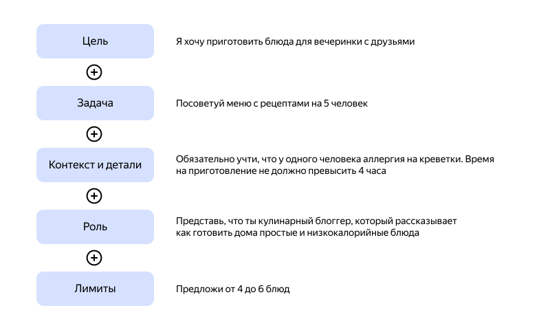
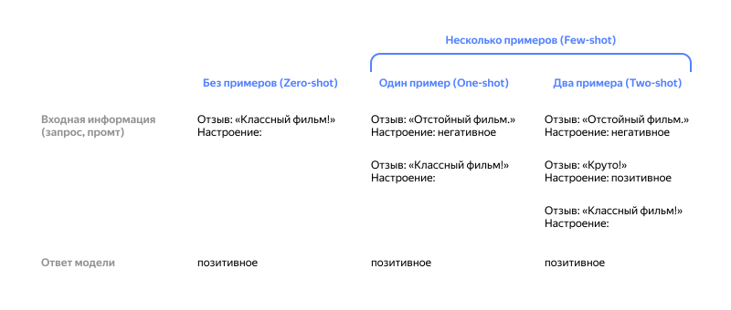
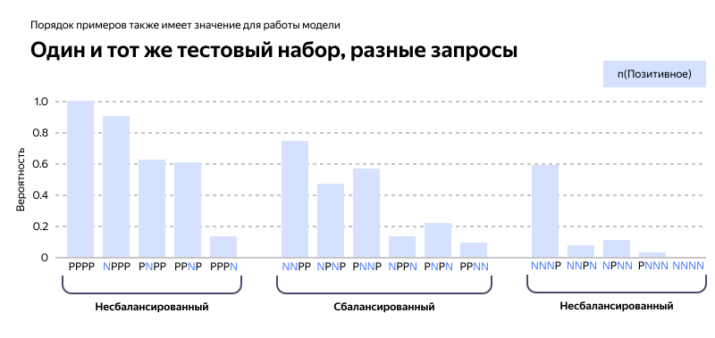
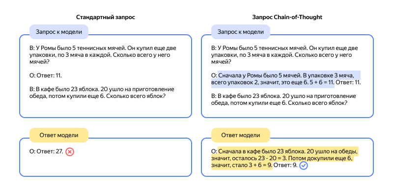
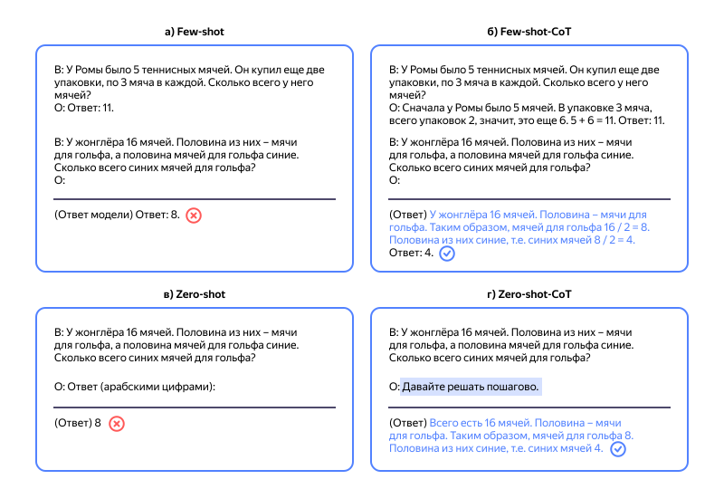
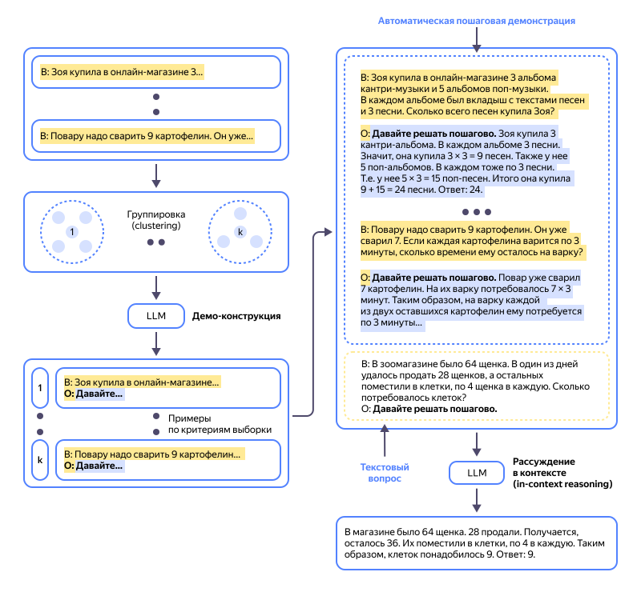

<link href="../styles.css" rel="stylesheet" />

## Проектирование промптов

- [Проектирование промптов](#проектирование-промптов)
  - [Введение в промпт-инжиниринг](#введение-в-промпт-инжиниринг)
    - [Ограничения автоматизации](#ограничения-автоматизации)
    - [Для чего нужны промпт-решения](#для-чего-нужны-промпт-решения)
    - [Основные понятия](#основные-понятия)
    - [Возможности чат-ботов](#возможности-чат-ботов)
  - [Основы промпт-инжиниринга](#основы-промпт-инжиниринга)
    - [Основные промпты](#основные-промпты)
    - [Структура промпта](#структура-промпта)
    - [Форматирование промптов](#форматирование-промптов)
    - [Элементы и компоненты промпта](#элементы-и-компоненты-промпта)
    - [Алгоритм построения промпта](#алгоритм-построения-промпта)
  - [Процесс проектирования эффективных промптов для ИИ](#процесс-проектирования-эффективных-промптов-для-ии)
  - [Методы (техники) промптинга](#методы-техники-промптинга)
    - [Промптинг без примеров](#промптинг-без-примеров)
    - [Промптинг с одним примером](#промптинг-с-одним-примером)
    - [Промптинг с несколькими примерами](#промптинг-с-несколькими-примерами)
      - [Ограничения промптов Few-shot](#ограничения-промптов-few-shot)
    - [Доспрашивание](#доспрашивание)
    - [Ролевой промптинг](#ролевой-промптинг)
    - [Структурированный ролевой промптинг](#структурированный-ролевой-промптинг)
    - [Цепочка рассуждений](#цепочка-рассуждений)
      - [Промптинг Zero-shot CoT](#промптинг-zero-shot-cot)
      - [Промптинг Few-shot CoT](#промптинг-few-shot-cot)
      - [Автоматический Chain-of-Thought](#автоматический-chain-of-thought)
    - [Самосогласованность](#самосогласованность)
    - [Мета-промптинг](#мета-промптинг)
    - [Выбор метода](#выбор-метода)
  - [Примеры промптов](#примеры-промптов)
    - [Сжатие текста](#сжатие-текста)
    - [Извлечение информации](#извлечение-информации)
    - [Вопросно-ответная структура (Q\&A)](#вопросно-ответная-структура-qa)
    - [Классификация текста](#классификация-текста)
    - [Диалог](#диалог)
    - [Логические рассуждения](#логические-рассуждения)
    - [Генерация кода](#генерация-кода)
  - [Советы и рекомендации](#советы-и-рекомендации)
  - [Применение промпт-инжиниринга](#применение-промпт-инжиниринга)
  - [Параметры LLM](#параметры-llm)
  - [Сценарии использования и ключевые роли](#сценарии-использования-и-ключевые-роли)
  - [Заключение](#заключение)
  - [Глоссарий](#глоссарий)
  - [Тестирование](#тестирование)
  - [Практическая работа. Знакомство с базовыми техниками промптинга](#практическая-работа-знакомство-с-базовыми-техниками-промптинга)
    - [Задание](#задание)
  - [Практическая работа. Работа с изображениями](#практическая-работа-работа-с-изображениями)
    - [Задание](#задание-1)
  - [Практическая работа. Работа с презентациями](#практическая-работа-работа-с-презентациями)
  - [Практическая работа. Проектирование запросов](#практическая-работа-проектирование-запросов)
    - [Задание](#задание-2)
  - [Источники информации](#источники-информации)

### Введение в промпт-инжиниринг
В конкурентной среде компании всё чаще обращаются к технологиям с искусственным интеллектом (ИИ) для улучшения внутренних операций. Одним из таких решений становится автоматизация бизнес процессов с AI. Такая стратегия позволяет ускорить выполнение задач и создать фундамент для устойчивого роста.

Приведем пример ресторанов, где бронирование столиков происходит по разным сценариям. В первом случае — по телефону. Во-втором — есть онлайн-платформа с интеграцией в календарь сотрудников и возможностью общаться с ИИ-ассистентом, который задает точно настроенные промптами вопросы. Клиенты скорее выберут оперативный контакт, но не будут ожидать ответа первого освободившегося сотрудника.

Рутинные операции могут быть скрытыми врагами роста бизнеса. Автоматизация бизнес процессов организации устраняет эту проблему, заменяя ручной труд интеллектуальными алгоритмами. Речь идет не о полном исключении человека, а о перераспределении ресурсов: технологии берут на себя шаблонные задачи, а сотрудники фокусируются на творческих и стратегических решениях.

Например, учетная программа за 5 минут формирует отчет, на который вручную ушло бы 3 часа. Как итог — меньше затрат на оплату труда и устранения финансовых потерь из-за человеческих ошибок.


#### Ограничения автоматизации
Вот области, где технологии могут лишь поддержать, но не заменить живой разум:

- **Творческие задачи**. Алгоритмы генерируют шаблоны, но не заменят Шекспира или Стива Джобса.

- **Моральные дилеммы**. Робот не ответит, стоит ли спасать одного человека ценой пяти жизней — это требует ценностного компаса, который есть только у людей.

- **Эмоциональная поддержка**. Даже самый продвинутый чат-бот не сможет отличить сарказм от искренней просьбы о помощи.

- **Управление кризисами**. Когда рушится поставка из-за стихийного бедствия или компания попадает в медиаскандал, нужен человек, способный за минуту пересмотреть десятки факторов и принять рискованное решение. ИИ предложит шаблонные сценарии, но не учтёт «человеческий фактор» паники или внезапной возможности договориться с конкурентом.

- **Многомерные решения**. Открыть филиал в другой стране или сменить позиционирование бренда — такие задачи требуют анализа сотен переменных. Алгоритмы обработают данные, но не заменят интуицию опытного CEO.

- **Дипломатия переговоров**. Закрытие сделки с упрямым клиентом или урегулирование конфликта между акционерами. Здесь важны не только факты, но и язык тела, паузы, умение «прочитать» оппонента — навыки, недоступные даже самым продвинутым аватарам.

Автоматизация не всесильна — некоторые сферы навсегда останутся территорией человеческого интеллекта и эмоций. Она закладывает фундамент, но настоящую «интеллектуальную начинку» бизнес-процессам придает **промпт-инжиниринг**.

> Если раньше алгоритмы требовали тысяч строк кода, то сегодня они понимают человеческую речь. Промпт-инжиниринг — это профессиональное «общение» с нейросетями через текстовые инструкции.


#### Для чего нужны промпт-решения
Бизнесы сталкиваются с трудностями при внедрении ИИ: системы выдают некорректные ответы, требуют многократных доработок и существенных бюджетных вложений.

К примеру, ИИ бот для бизнеса может игнорировать нюансы запросов клиентов, а генеративные модели — создавать тексты с фактическими ошибками. Решением этих задач занимается направление, известное как промпт-инжиниринг. <dfn title="промпт-инжиниринг">Промпт-инжиниринг</dfn> (*prompt engeneering*) — это точная формулировка задач для ИИ-систем для того, чтобы автоматизировать рутинные задачи бизнеса и снизить нагрузку на сотрудников.

Профессия промпт инженера заключается в разработке и совершенствование текстовых инструкций для нейросетей таких, как языковые модели (LLM) или генеративные ИИ-системы. Цель таких специалистов — научить алгоритмы понимать контекст, соблюдать тематическую направленность и выдавать точные результаты.

Работа промпт инженера улучшает поиск информации и поможет извлечь из больших массивов данных точные и полезные сведения. Вместо случайных проб и ошибок они используют структурированные подходы: тестируют формулировки, добавляют уточняющие параметры, анализируют паттерны взаимодействия.

Внедрение AI в бизнес приносит преимущества:

- Повышение качества ответов ИИ (например, исключить противоречивые данные в аналитических отчетах).

- Ускорение интеграции технологий — вместо месяцев настройки сократить сроки до нескольких недель.

- Снижение эксплуатационных расходов за счет уменьшения ручных правок.

Данная статья объясняет, что делает промпт инженер, какие методы промпт-инжиниринга существуют и как ИИ-бот для бизнеса может повысить эффективность компании.[^zachem-nuzhen-prompt-inzhiniring]

#### Основные понятия
*[LM]: Language Models

Взаимодействие со стандартным чат-ботом обычно устроено в виде диалога: пользователь задаёт ему вопросы, он отвечает. Вопросы нейросети принято называть <dfn title="промпт">промптами</dfn> (с английского prompt — «запрос», «подсказка»). <dfn title="промпт">Промпт</dfn> (*prompt*) — инструкция в виде текстового запроса, передаваемая AI-модели для выполнения задачи. [^concepts__prompting] А сам процесс взаимодействия с нейросетью называется <dfn title="промптинг">промптингом</dfn> (*prompting*).

Основу любого современного чат-бота (ChatGPT, Qwen, Gemini, Grok и др.), как правило, составляет большая языковая модель, которая учится на всевозможных текстах и использует язык подобно людям. С одним исключением: модель не понимает значения слов, так что качество её ответов всегда зависит от качества вашего запроса. Поскольку нейросеть «понимает» текст буквально, её ответ зависит от формулировки и детализации вашего промпта.

Если представить ИИ-ассистента для бизнеса как сверхспособного, но наивного стажера, то промпты — это задания, которые вы ему даёте. Чем точнее вы объясните, что нужно сделать, тем качественнее будет результат — будь то генерация текста, анализ данных или решение задач.[^zachem-nuzhen-prompt-inzhiniring]


Память всех языковых моделей ограничена. Любой ваш промпт, как и ответ чат-бота, может вместить до 4096 токенов — это не больше 16 тыс. знаков или около шести страниц А4 14-м кеглем. <dfn title="токен">Токен</dfn> (*token*) — это часть текста, которую языковая модель обрабатывает как одну единицу. Можно представить его как одно слово, часть слова, символ или цифру.

Когда вы вводите текст, модель разбивает его на токены и анализирует, чтобы сгенерировать ответ. Например, слово «привет» очень часто встречается в языке и записывается одним токеном. А слово «синхрофазотрон» используется редко и генерируется по кусочкам.

<dfn title="проектирование промптов">Проектирование промптов</dfn> (промпт-инжиниринг, *prompt engineering*) — это относительно новая дисциплина, направленная на разработку и оптимизацию запросов для эффективного использования языковых моделей (Language models, LM) в широком спектре приложений и исследовательских задач. Навыки создания промптов помогают лучше понять возможности и ограничения больших языковых моделей (Large language models, LLM).

Проектирование промптов предполагает не только разработку и создание запросов. Оно также охватывает широкий спектр навыков и техник, полезных для взаимодействия с LLM и создания новых решений на их основе. Это важный навык для взаимодействия, создания и понимания возможностей LLM. Промпт-инжиниринг можно использовать для повышения безопасности LLM и создания новых возможностей, таких как добавление доменных знаний и внешних инструментов к LLM.[^promptingguide]

Исследователи используют инжиниринг промптов, чтобы расширить возможности LLM в решении различных задач, будь то ответы на вопросы или выполнение арифметических рассуждений. Разработчики применяют эти техники для создания надежных и эффективных методов взаимодействия с LLM и другими инструментами.[^gpt-prompting-guide]

#### Возможности чат-ботов
Как мы помним, нейросеть не понимает «смысл» языка и реагирует именно на формулировку запроса. Посмотрим на то, что умеет стандартный чат-бот и как правильно поставить ему задачу:

<table class="t431__table " data-table-width="27%;28%;45%" width="100%"><thead class="t431__thead"><tr><th class="t431__th t-title" width="27%">Что умеет чат-бот</th><th class="t431__th t-title" width="28%">Как написать запрос</th><th class="t431__th t-title" width="45%">Примеры промптов</th></tr></thead><tbody class="t431__tbody"><tr class="t431__oddrow"><td class="t431__td t-text" width="27%">Отвечать на открытые вопросы</td><td class="t431__td t-text" width="28%">Кто, что, где, когда, почему, зачем, каким образом, сколько</td><td class="t431__td t-text" width="45%">Какие есть системы налогообложения для ООО? <br><br>Как рассчитывается кредитный рейтинг?<br><br>Какое должно быть расстояние от сидения стула до поверхности стола?<br><br>Сколько варить макароны аль денте? <br><br>Сколько будет 56778 в третьей степени?</td></tr><tr class="t431__evenrow"><td class="t431__td t-text" width="27%">Отвечать на закрытые вопросы</td><td class="t431__td t-text" width="28%">Выбери ответ, дай ответ — или сразу напишите закрытый вопрос / вопрос с выбором ответа</td><td class="t431__td t-text" width="45%">Этот текст для специалистов или для широкого круга читателей? <br><br>Доказано ли существование тахионов? <br><br>В истории СССР было больше 5 генеральных секретарей?</td></tr><tr class="t431__oddrow"><td class="t431__td t-text" width="27%">Создавать новый текст</td><td class="t431__td t-text" width="28%">Напиши, сочини, придумай, расскажи</td><td class="t431__td t-text" width="45%">Напиши объявление о том, что 10 февраля весь день не будет работать лифт <br><br>Создай чек-лист организации деловой поездки</td></tr><tr class="t431__evenrow"><td class="t431__td t-text" width="27%">Анализировать и логически рассуждать</td><td class="t431__td t-text" width="28%">Объясни, докажи, обоснуй, подтверди, отгадай</td><td class="t431__td t-text" width="45%">Докажи, что земля круглая <br><br>360p, 480p, 720p, 1020p - что это и почему расположено в таком порядке? <br><br>Есть ли в тексте противоречия? <br><br>Вот мой план профессионального развития на год. Что в нём не учтено?</td></tr><tr class="t431__oddrow"><td class="t431__td t-text" width="27%">Классифицировать информацию</td><td class="t431__td t-text" width="28%">Распредели по категориям, рассортируй по группам</td><td class="t431__td t-text" width="45%">Рассортируй по группам названия бактерий и архей <br><br>Распредели сотрудников по департаментам из общего списка</td></tr><tr class="t431__evenrow"><td class="t431__td t-text" width="27%">Редактировать текст</td><td class="t431__td t-text" width="28%">Исправь ошибки, отредактируй, перепиши без ошибок</td><td class="t431__td t-text" width="45%">Расставь знаки препинания <br><br> Исправь в тексте грамматические ошибки</td></tr><tr class="t431__oddrow"><td class="t431__td t-text" width="27%">Переписывать, переформулировать готовый текст и свой предыдущий ответ</td><td class="t431__td t-text" width="28%">Перепиши, переделай текст, сделай рерайт, измени формулировку</td><td class="t431__td t-text" width="45%">Перепиши текст в менее формальном стиле <br><br> Сделай из текста чек-лист <br><br>Объясни для школьника средних классов</td></tr><tr class="t431__evenrow"><td class="t431__td t-text" width="27%">Переводить</td><td class="t431__td t-text" width="28%">Переведи, перепиши на другом языке</td><td class="t431__td t-text" width="45%">Переведи текст на английский <br><br> Переведи с китайского</td></tr><tr class="t431__oddrow"><td class="t431__td t-text" width="27%">Обобщать</td><td class="t431__td t-text" width="28%">Выдели тезисы, сократи, суммаризируй, выпиши основные детали, сделай сводку по тексту</td><td class="t431__td t-text" width="45%">Перескажи этот текст в одном абзаце <br><br>Сократи в 2 раза <br><br> Определи цель текста <br><br>Задай вопросы по тексту</td></tr><tr class="t431__evenrow"><td class="t431__td t-text" width="27%">Извлекать информацию</td><td class="t431__td t-text" width="28%">Выпиши, выдели, извлеки из текста</td><td class="t431__td t-text" width="45%">Выдели основную мысль абзаца <br><br>Извлеки статистические данные о рыночной доле продукта из отчёта <br><br> Определи основные этапы и сроки проекта из текста</td></tr><tr class="t431__oddrow"><td class="t431__td t-text" width="27%">Писать код</td><td class="t431__td t-text" width="28%">Напиши код на JavaScript, Python, Java, TypeScript, C#, С++, PHP и других языках, объясни код</td><td class="t431__td t-text" width="45%">Напиши код на Python. Поменяй местами значения двух переменных. Сделай двумя способами: с помощью третьей переменной и без. Объясни, что получилось</td></tr><tr class="t431__evenrow"><td class="t431__td t-text" width="27%">Генерировать идеи</td><td class="t431__td t-text" width="28%">Предложи варианты, придумай идеи, сравни, разработай план</td><td class="t431__td t-text" width="45%">Напиши 20 идей для постов про укрепление здоровья для офисных работников <br><br> Предложи улучшения для внутренней коммуникации компании <br><br> Помоги подобрать подарок коллеге, который любит рыбалку</td></tr><tr class="t431__oddrow"><td class="t431__td t-text" width="27%">Смоделировать диалог</td><td class="t431__td t-text" width="28%">Напиши диалог, воссоздай разговор, сочини беседу</td><td class="t431__td t-text" width="45%">Смоделируй разговор с сотрудником, который присваивает себе чужие заслуги <br><br> Как мог бы выглядеть диалог автора этого текста с его критиком?</td></tr></tbody></table>

### Основы промпт-инжиниринга
В этом разделе разберём, какие задачи можно давать чат-боту и как управлять качеством его результата с помощью правильных формулировок ваших запросов-промптов.

<dfn title="промпт">Промпт</dfn> (*prompt*) — это входные данные для генеративной модели, предназначенные для управления результатами ее работы. Промпт может состоять из текста, картинки, звука или любой другой информации.

<dfn title="шаблон промпта">Шаблон промпта</dfn> — это незаконченный промпт с одной или несколькими переменными, которые заменяются на какую-то информацию для создания отдельного экземпляра промпта.

Например, нужно решить задачу бинарной классификации твитов. Исходный шаблон промпта будет выглядеть так:
```
Классифицируй твит как «положительный» или «отрицательный»: {TWEET}.
```

Если в шаблон подставить твит из датасета, получится экземпляр промпта, который можно отправить генеративной модели для предсказания результата.

Качество выходных данных модели зависит от того, насколько хорошо вы сформулируете запрос и сколько информации предоставите. Промпт может содержать основные элементы: *инструкция* или *вопрос*, а также дополнительные: *контекст*, *входные данные* и *примеры*. Используя эти элементы, вы можете более эффективно управлять моделью и улучшать качество результатов.

Начнем с простого примера промпта:

*Промпт*
```
Что такое замок?
```

Ответ
```
Замок — это сложное и многофункциональное сооружение, которое обычно служит для защиты территории или имущества. Замки могут быть разных типов: средневековые, современные, военные, дворцовые и другие. Они могут включать в себя различные элементы, такие как стены, башни, ворота, рвы и мосты.

В прошлом замки были важными стратегическими объектами, которые защищали от врагов и позволяли контролировать территорию. Сегодня замки часто являются историческими памятниками и туристическими достопримечательностями.
```

#### Основные промпты
Можно достичь многого с помощью простых промптов, но качество результатов зависит от того, сколько информации вы предоставляете и насколько хорошо он составлен. Промпт может содержать информацию, такую как *инструкция* или *вопрос*, который вы передаете модели, и включать другие детали, такие как *контекст*, *входные данные* или *примеры*. Вы можете использовать эти элементы, чтобы лучше указать модели, что от нее требуется, и в результате получить лучшие результаты.

Бывает, что первый опыт взаимодействия с нейросетью расстраивает. Так получается, если пользователь задаёт какой-нибудь общий вопрос, на который нейросеть даёт поверхностный и расплывчатый ответ.

Давайте начнем с примера простого промпта:

*Промпт*
```
The sky is
```

*Результат*:
```
blue
The sky is blue on a clear day. On a cloudy day, the sky may be gray or white.
```

[Giga.Chat](https://giga.chat/):
```
The sky is the limit.

This idiom suggests that there are no restrictions or boundaries to what someone can achieve or aspire to. It encourages ambition and belief in limitless possibilities.
```

[Алиса AI](https://alice.yandex.ru/):
```
The sky is… — это начало фразы на английском языке, которое можно перевести как «Небо — это…» или «Небо является…».

Чтобы завершить предложение, нужно добавить описание или характеристику неба. Вот несколько вариантов:
```

Как видите, языковая модель выводит продолжение строк, которое имеет смысл в контексте "The sky is". Результат может быть неожиданным или далеким от задачи, которую вы хотите выполнить.

Этот простой пример также подчеркивает необходимость предоставления большего контекста или инструкций о том, что именно вы хотите достичь.

Давайте попробуем немного улучшить его:

*Промпт*:
```
Complete the sentence:
The sky is
```

*Результат*:
```
so beautiful today.
```

Уже лучше, не так ли? Вы сказали модели завершить предложение, поэтому результат выглядит гораздо лучше, так как он точно следует вашей инструкции ("Complete the sentence"). Такой подход к проектированию оптимальных промптов для указания модели выполнения задачи называется промпт инжинирингом.


[Giga.Chat](https://giga.chat/):
```
The sky is blue.

However, if you need something more creative or contextualized, here are some alternatives:

- The sky is filled with stars tonight.
- The sky is painted with hues of orange and pink at sunset.
- The sky is darkening, signaling the approach of nightfall.
- The sky is covered with fluffy white clouds today.
- The sky is a vast canvas where dreams take flight.
- Let me know if you'd like another specific tone or style!
```

[Алиса AI](https://alice.yandex.ru/):
```
Here are several ways to complete the sentence «The sky is…» depending on the context and description you’d like to convey:

Descriptive (colour/appearance):

1. The sky is blue.
2. The sky is cloudy.
3. The sky is clear.
4. The sky is pink at sunset.
5. The sky is overcast with dark clouds.

Emotional/atmospheric:
...
```

Приведенный выше пример — это базовая иллюстрация того, что сегодня возможно с помощью LLM (Large Language Models). Современные LLM могут выполнять самые разные задачи, начиная от суммирования текста и математического рассуждения, и заканчивая генерацией кода.

#### Структура промпта
Обращаясь к текстовым моделям через API, вы можете структурировать промпт с помощью ролей. В определенных моделях поддерживаются следующие роли: `system`, `user` и `assistant`. В промпт-режиме в консоли управления эти роли соответствуют полям **Инструкции**, **Запрос** и **Ответ**. Структурировать промпт не обязательно.

Языковая модель отвечает последовательностью токенов, которые имеют смысл в контексте «замок». Однако результат может быть неожиданным или далеким от задачи, которую вы хотите выполнить. Например, мы хотели узнать про дверной замок. Этот простой пример подчеркивает необходимость предоставления большего контекста или инструкций о том, чего именно вы хотите добиться с помощью модели.

Попробуем дополнить промпт:

*Промпт*
```
Что такое замок? (речь идет о дверных замках)
```

*Ответ*
```
Замок — это механическое, электронное или комбинированное устройство фиксации двери в закрытом состоянии. Оно предотвращает несанкционированный доступ в помещение и обеспечивает безопасность.

Дверные замки различаются по конструкции, типу установки, уровню секретности и другим характеристикам. Они могут быть врезными, накладными, навесными и др.

Замки используются для защиты жилых домов, квартир, офисов, складов и других помещений.
```

В данном примере мы направлем модель в необходимую нам сторону, уточняя запрос. Это и есть суть промпт-инжиниринга.[^basics]

#### Форматирование промптов
*[ICL]: In-Context Learning, ICL

Выше был очень простой промпт. Стандартный формат промпта имеет следующую структуру:
```
<Question>?
```

или
```
<Instruction>
```

или
```
<Вопрос>?
```

или
```
<Инструкция>
```

Вы можете преобразовать его в формат вопроса и ответа (QA), который является стандартным для многих наборов данных QA, следующим образом:
```
Q: <Question>?
A:
```

Здесь "A" — это маркер для few-shot prompting или структурированного формата вывода.

или
```
Вопрос: <Вопрос>?
Ответ:
```

Применение такого форматирования промпта называется использованием *промптингом без примеров* (*zero-shot prompting*), когда напрямую запрашивается ответ у модели без предоставления каких-либо примеров или демонстраций задачи, которую вы хотите выполнить. Некоторые большие языковые модели имеют возможность выполнять промптинг без примеров, но результат зависит от сложности и понимания задачи, а также от примеров, на которых модель была обучена.

Учитывая стандартный формат выше, одной из популярных и эффективных техник форматирования результата является *промптинг с несколькими примерами* (*few-shot prompting*), при котором вы предоставляете примеры (демонстрации). Вы можете отформатировать промпты с несколькими примерами следующим образом:
```
<Question>?
<Answer>
<Question>?
<Answer>
<Question>?
<Answer>
<Question>?
```

или
```
<Инструкция, как отвечать на вопрос>

<Вопрос>?
<Ответ>

<Вопрос>?
<Ответ>

<Вопрос>?
<Ответ>

<Вопрос>?
```

В версии в формате вопроса и ответа (QA) это будет выглядеть так:
```
Q: <Question>?
A: <Answer>
Q: <Question>?
A: <Answer>
Q: <Question>?
A: <Answer>
Q: <Question>?
A:
```

или
```
<Инструкция, как отвечать на вопрос>
Примеры:

Вопрос: <Вопрос>?
Ответ: <Ответ>

Вопрос: <Вопрос>?
Ответ: <Ответ>

Вопрос: <Вопрос>?
Ответ: <Ответ>

Вопрос: <Вопрос>?
Ответ:
```

Имейте в виду, что использование формата вопроса и ответа (QA) не является обязательным. Формат промпта зависит от задачи. Например, вы можете выполнить простую задачу классификации и дать образцы, демонстрирующие задачу, следующим образом:

*Промпт*:
```
This is awesome! // Positive
This is bad! // Negative
Wow that movie was rad! // Positive
What a horrible show! //
```

*Результат*:
```
Negative
```

Таким образом можно сделать простейшую классификацию текстов:

*Промпт*
```
Это потрясающе! // Положительно
Это плохо! // Отрицательно
Вау, этот фильм был классный! // Положительно
Какое ужасное шоу! //
```

*Ответ*
```
Отрицательно
```

Промпты с несколькими примерами позволяют учиться в контексте (*In-Context Learning*, ICL), что означает, что языковые модели могут обучаться задачам на основе нескольких демонстраций.[^basics]

Типичный сценарий использования индикаторов вывода (маркеров):
```
Объясни антибиотики A:
Определи LLM B:
Перечисли планеты C:
```

Модель отвечает:
```
A: Антибиотики — лекарства против бактерий...
B: LLM — большие языковые модели...
C: 1.Меркурий 2.Венера...
```

**Почему это работает**
- **Якорь внимания**: модель фокусируется на формате "A:"

- **Few-shot обучение**: через пример понимает паттерн

- **Структурированный вывод**: легко парсить (JSON, API)

Без "A:" модель может ответить размыто. С "A:" — четко по шаблону.

#### Элементы и компоненты промпта
По мере того как мы рассматриваем все больше примеров и применений инженерии промптов, вы заметите, что промпт составляют определенные компоненты.



Промпт может содержать следующие элементы:

- <dfn title="инструкция">Инструкция</dfn> (*instruction*) — конкретная задача или инструкция, которую вы хотите, чтобы модель выполнила. Может включать требуемый стиль письма и другие предписания для модели.

- <dfn title="контекст">Контекст</dfn> (*context*) — внешняя информация или дополнительные уточнения или контекст, которые могут помочь направить модель на более точные ответы и получить лучший результат.

- <dfn title="входные данные">Входные данные</dfn> (*input data*) — вводные данные для предсказаний или вопрос, на который необходимо найти ответ.

- <dfn title="индикатор вывода">Индикатор вывода</dfn> (*output indicator*) — тип или формат вывода (ожидаемых выходных данных). Например, могут быть использованы метки "Q" или "A" для вопросно-ответной структуры.

Необязательно использовать все четыре элемента для промпта. Формат промпта зависит от задачи.[^elements] Тем не менее, эффективный промпт, как правило, включает в себя:

- **инструкцию** — четко сформулированное требование, задача;

- **контекст** — описание ситуации или среды;

- **ограничения** — параметры объема и формата;

- (опционально) **примеры** — в качестве образца.[^concepts__prompting]

Рассмотрим простой пример классификации текста, чтобы лучше понять элементы промпта:

*Промпт*
```
Классифицируй текст как нейтральный, негативный или позитивный.

Текст: Я думаю, что еда была нормальной.

Настроение:
```

*Ответ*
```
Нейтральное
```

В приведенном примере промпта инструкция соответствует задаче классификации: «Классифицируй текст как нейтральный, негативный или позитивный». Входные данные представлены фразой «Я думаю, что еда была нормальной», а индикатор вывода — «Настроение:».

Как видно, на короткий запрос нейросеть даёт общий ответ. Поэтому следует обратить внимание на *контекст*, *инструкцию*, *роль* и *стиль* — это важные элементы промпта, которые влияют на содержание и вид ответа чат-бота.[^1-2-2] Так, в примере выше контекст не используется, но его также можно добавить в промпт. Например, контекст для данного промпта классификации текста может включать примеры похожих вопросов и ответов, чтобы помочь модели лучше понять задачу и ожидаемые результаты.

Также можно задать формат выходных данных, например, попросить модель вернуть текст в формате JSON или заключить в кавычки. Помимо этого, можно указать целевую аудиторию или уровень знаний будущего читателя, чтобы модель учитывала это при генерации. 

#### Алгоритм построения промпта
Возьмём такой промпт. Это открытый вопрос, так что и ответ на него тоже содержит только базовые сведения:


1) **Уточняем задачу через контекст**

    <dfn title="контекст">Контекст</dfn> в промпте — это любые вводные данные, которые могут улучшить результат генерации. Добавим контекста к предыдущему запросу, уточнив индивидуальные обстоятельства:

    

2) **Даём инструкцию, в каком виде представить ответ**

    <dfn title="инструкция">Инструкция</dfn> — команда, которая указывает нейросети, как решить задачу. Можно описать способ, указать длину или формат ответа. Мы попросим GigaChat дать короткий ответ:

    

3) **Настраиваем глубину и полноту ответа, назначая роль для нейросети**

    Если вам нужно получить более экспертный ответ, можно назначить роль для чат-бота. Например: «отвечай как юрист», «ты — аналитик», «твоя роль — маркетолог», «ты — человек 19 века», «представь, что ты Эйнштейн».

    Предложим чат-боту посмотреть на налоговый вопрос глазами юриста-реформатора:

    

    Нейросеть может развёрнуто и аргументированно отвечать в роли специалиста, но всё-таки не стоит полностью полагаться на её экспертизу, например, в области медицинских или правовых рекомендаций.

    Как мы уже знаем, чат-бот хорошо учится на предоставленной ему информации, но не имеет доступа в интернет и иногда «галлюцинирует», так что может давать устаревшие, спорные или бессмысленные ответы.

    Ещё нейросеть не сможет поддержать разговор на темы «для взрослых», об актуальной политике, не будет делиться потенциально вредной, незаконной и оскорбительной информацией. Распознав подобное в вашем запросе, чат-бот предложит сменить тему.

4) **Выбираем стиль, в котором ответит нейросеть**

    Также можно задать стиль и тон ответа. Например: «отвечай в деловом стиле», «в стиле глянцевого журнала», «в стиле социальной рекламы», «в разговорном стиле», «в стиле научной диссертации», «в стиле дореволюционной газеты», «измени тон на более дружелюбный».

    Попросим GigaChat объяснить то же самое, но «на пальцах»:

    

Таким образом, эффективным промт делают следующие моменты:
1. **Ясность** — четкая формулировка без двусмысленностей.

2. **Контекст** — чем больше информации, тем точнее ответ.

3. **Структура** — логичное построение запроса.

4. **Примеры и ограничения** — помогают направить ИИ в нужное русло.

Промпты могут быть как короткими вопросами, так и сложными инструкциями с подробным контекстом и сценариями. Главная цель — направить ИИ к точному и полезному результату, для чего могут быть использованы разные методы, приемы и техники.

### Процесс проектирования эффективных промптов для ИИ
Ниже представлен алгоритм создания промптов, который повышает качество и релевантность результатов.

1. **Формулировка базового запроса**

    На старте надо определить задачу и создать первичный промпт. Например, для анализа отзывов клиентов можно использовать подход «zero-shot», когда модель обрабатывает запрос без дополнительных примеров.

2. **Декомпозиция задачи и уточнение**

    Следующий шаг — разбить сложный вопрос на подзадачи. Допустим, вместо запроса «Проанализируй рынок» лучше задать: «Определи ключевые тренды в нише Х за 2023 год, выдели три основных игрока».

3. **Адаптация под уровень сложности**

    Промпты корректируются в зависимости от требуемой детализации. Для простых задач (например, классификация текста) достаточно кратких указаний. Для многоэтапных процессов (прогнозирование продаж с учетом сезонности) добавляют контекст.

4. **Направление логики модели**

    Здесь применяют два подхода:

    - **Цепочечные промпты** — стимулируют последовательное мышление: «Сначала определи проблему, затем предложи решения, аргументируя каждый шаг».

    - **Стимулы для целевых ответов** — например, «Сгенерируй варианты рекламных слоганов, фокусируясь на экологичности продукта».

5. **Углубленный анализ и проверка гипотез**

    Для сложных кейсов используют:

    - <dfn title="дерево рассуждений">Дерево рассуждений</dfn> — модель исследует несколько сценариев (например, риски внедрения нового продукта с разных ракурсов: финансового, маркетингового, технического). Этот метод структурирует проблему как древовидную схему, где каждый узел представляет ключевой вопрос или фактор, а ветви — возможные сценарии и их последствия. Модель последовательно разбивает задачу на подзадачи: например, при оценке рисков нового продукта анализируются финансовые (рентабельность, окупаемость), маркетинговые (спрос, конкуренция) и технические (масштабируемость, надежность) аспекты. Каждый путь от корня к листу отражает полный сценарий с вероятностями и весами, что позволяет ранжировать варианты и выбрать оптимальный.

    - <dfn title="майевтический подход">Майевтический подход</dfn> — ИИ проверяет собственную логику: «Почему это решение оптимально? Какие допущения были сделаны?». Названный в честь Сократа, этот метод побуждает ИИ к самокритике через цепочку вопросов: "Почему этот вывод верен?", "Какие альтернативные гипотезы отвергнуты?", "Какие допущения сделаны и насколько они надежны?". Модель не просто генерирует ответ, а проверяет его логику, выявляя слабые места — например, предвзятость данных или пропущенные факторы. Это повышает устойчивость решений, особенно в неопределенных ситуациях, где требуется многоуровневая верификация.

    <details>
    <summary>Что такое майевтика</summary>

    <dfn title="майевтика">Майевтика</dfn> (*греч.* μaiευτική — букв. "повивальное искусство") — это метод Сократа, «повивальное искусство», который помогает «родить» истину, скрытую в самом человеке, через серию наводящих вопросов, а не прямое навязывание знаний, стимулируя самопознание и критическое мышление собеседника. Вместо того чтобы давать ответы, «повитуха»-Сократ задаёт вопросы, которые заставляют человека самостоятельно приходить к выводам, обнаруживая противоречия в собственных рассуждениях и «выталкивая» знание наружу.

    </summary>

6. **Оценка и автооптимизация**

    На финальном этапе анализируют соответствие ответов целям бизнеса. Инструменты вроде «self-refine» позволяют модели самостоятельно улучшать результаты. Например, если первая версия отчета слишком общая, ИИ пересобирает данные, добавляя статистику и сравнительные графики.

> Грамотное проектирование промптов — не линейный процесс, а цикл экспериментов. Комбинация методов (декомпозиция, адаптация сложности, проверка гипотез) позволяет получать точные и практически применимые результаты, экономя время и ресурсы. Важно регулярно тестировать подходы и обновлять промпты в соответствии с меняющимися задачами.[^zachem-nuzhen-prompt-inzhiniring]

### Методы (техники) промптинга
*[RLHF]: Reinforcement Learning from Human Feedback
*[CoT]: Chain-of-Thought

Промпт-инжиниринг помогает эффективно разрабатывать и улучшать промпты для получения лучших результатов при выполнении различных задач с использованием больших языковых моделей.

В этом разделе рассматриваются техники промпт-инжиниринга, которые позволяют решать сложные задачи и улучшать надежность и производительность LLM.[^about]

#### Промптинг без примеров
Если просто зададать чат-боту вопрос или написать задачу, то он ответит «в свободной форме». Такие промпты называют *zero-shot* — и почти все примеры, которые были до этого момента, относились к этому методу.

Большие языковые модели (LLM) настроены на выполнение инструкций и обучены на больших объемах данных. Масштабное обучение дает использовать модели в режиме Zero-shot, который предполагает, что имеющих у модели данных достаточно для решения определенных задач. Рассмотрим простой пример классификации текста с помощью техники Zero-shot.[^zero-shot]

*Промпт*:
```
Классифицируйте текст как нейтральный, негативный или позитивный.

Текст: Я думаю, что отпуск был нормальным.
Настроение:
```

*Ответ*:
```
Нейтральное
```

В этом промпте мы не предоставили модели никаких примеров текста с классификациями, но модель уже понимает, что такое «настроение».

<dfn title="промптинг без примеров">Промптинг без примеров</dfn> (*zero-shot prompting*) — это техника взаимодействия с ИИ, когда модели дается задача без каких-либо примеров ее выполнения; она должна справиться, опираясь только на свои общие, предварительно полученные знания, что демонстрирует ее способность к обобщению и пониманию контекста для решения новых, незнакомых запросов, будь то перевод, классификация или генерация текста.

Промпт представляет собой четкую инструкцию без примеров, контекст минимальный.[^concepts__prompting] Например:
```
Напиши техническую документацию для REST API авторизации пользователей.
Включи разделы: методы, параметры запроса, коды ошибок.
```

**Как это работает**
- **Прямая инструкция**: пользователь просто описывает задачу в промпте (например, «Переведи», «Опиши», «Классифицируй»).
- **Использование общих знаний**: модель, обученная на огромных объемах данных, "понимает" инструкцию и генерирует ответ, не нуждаясь в дополнительных обучающих примерах для этой конкретной задачи.

Отвечая на zero-shot промпты, чат-бот опирается на «общее представление» о теме, используя только вопрос, роль или контекст. Два примера таких запросов:


**Преимущества**
- **Простота**: легко создавать запросы без необходимости подбирать примеры.
- **Гибкость**: можно быстро адаптировать к различным задачам.
- **Экономия данных**: не требует сбора и разметки специфических данных для каждой задачи.

**Примеры**
- **Запрос**: «Какая столица Франции?».
- **Запрос**: «Определи тональность следующего отзыва: "Это было ужасно"».

**В сравнении с другими методами**
- **Zero-shot**: нет примеров.
- **One-shot**: один пример.
- **Few-shot**: несколько примеров (два и более).

Расширить возможности промптинга Zero-shot можно с помощью настройки инструкций — дообучения моделей на наборах данных, описанных через инструкции. Также можно использовать RLHF — обучение с подкреплением на основе обратной связи от человека — для масштабирования настройки инструкций, где модель лучше подстраивается под человеческие предпочтения.

<dfn title="Обучение с подкреплением на основе человеческой обратной связи">Обучение с подкреплением на основе человеческой обратной связи</dfn> (*Reinforcement Learning from Human Feedback*, RLHF) — это метод машинного обучения, который использует оценку людьми ответов ИИ для обучения модели вознаграждения, направляя большую языковую модель (БЯМ) генерировать более полезные, безопасные и релевантные ответы, согласованные с человеческими ценностями. Этот подход стал ключевым для создания чат-ботов вроде ChatGPT, позволяя ИИ не просто предсказывать текст, а действовать в соответствии с ожиданиями пользователя.

**Как работает RLHF**:
- **Сбор данных**: людям-оценщикам показывают несколько вариантов ответов модели на один и тот же запрос, и они ранжируют их по качеству.
- **Обучение модели вознаграждения** (*Reward Model*): собранные рейтинги используются для тренировки отдельной нейронной сети (модели вознаграждения), которая предсказывает, насколько ответ соответствует человеческим предпочтениям.
- **Оптимизация политики** (*Policy Optimization*): основная модель ИИ затем дообучается с помощью алгоритмов обучения с подкреплением, используя сигналы от модели вознаграждения, чтобы максимизировать "награду" за хорошие ответы.

**Зачем нужен RLHF**:
- **Согласование с ценностями**: выравнивает поведение ИИ с человеческими намерениями и этическими принципами, делая его более безопасным.
- **Повышение полезности**: улучшает способность модели давать точные, логичные и понятные ответы, а не просто правдоподобные.
- **Работа со сложными задачами**: эффективен для задач, где желаемое поведение трудно формализовать, но можно оценить.

#### Промптинг с одним примером
Но нейросети можно также давать запросы уже с подсказками, как нужно отвечать, на основе демонстрации ответа.

<dfn title="промптинг с одним примером">Промптинг с одним примером</dfn> (*one-shot prompting*) — это метод инженерии промптов для ИИ, когда модели дается один четкий пример (ввод-вывод), чтобы она поняла и выполнила похожую задачу, адаптируясь к нужному формату или стилю без необходимости обучения на больших данных. Это золотая середина между Zero-shot (без примеров) и Few-shot (несколько примеров) промптингом, позволяющая получить точные, структурированные ответы, показывая модели, что именно от нее ожидается.

**Как это работает**:
- **Инструкция**: дается общее указание, что нужно сделать.
- **Один пример**: предоставляется одна пара "входные данные -> правильный ответ/формат".
- **Задача**: модели предлагается выполнить новую задачу, применяя тот же паттерн.

**Пример**:
- *Инструкция*: Переведи с английского на французский.
- *Пример*: "I love playing soccer." -> "J'aime jouer au football."
- *Задача*: "She enjoys reading books." -> ?.

Рассмотрим пример из работы [Brown et al. 2020](https://arxiv.org/abs/2005.14165), в котором задача заключается в правильном использовании нового слова в предложении:

*Промпт*:
```
"Котопес" — это мифическое существо, которое является наполовину котом, наполовину собакой. Пример предложения, использующего слово "котопес":
Мы гуляли по лесу и увидели странного котопса.

"Фырчать" означает издавать короткие, резкие звуки. Пример предложения, использующего слово "фырчать":
```

*Ответ*:
```
Когда мы подошли ближе, котопес начал фырчать на нас.
```

Модель научилась выполнять задачу, хотя имела всего один пример (т.е. 1-shot). Для более сложных задач можно экспериментировать с увеличением количества примеров (например, 3-shot, 5-shot, 10-shot и т.д.).

**Преимущества**:
- **Эффективность**: быстро направляет модель к нужному результату.
- **Конкретика**: улучшает точность, задавая конкретный формат и стиль ответа.
- **Экономия данных**: идеально, когда сложно собрать много примеров для обучения.

**Когда использовать**:
- Когда нужен определенный формат (например, JSON, маркированный список).
- Для задач, где важна стилистика или тон ответа.
- Для быстрой адаптации к новым, специфическим задачам.

#### Промптинг с несколькими примерами
Хотя крупные языковые модели демонстрируют отличные способности в режиме Zero-shot, они все еще не справляются со сложными задачами. Если нужно сразу получить от нейросети ответ в определённом виде или нейросеть не справляется с решением задачи без подсказок, подходит метод *few-shot*. Этот метод хорош, чтобы контролировать точность и формат ответа. Few-shot промптинг можно использовать как технику для обучения в контексте, где для повышения качества результатов модели предоставляются примеры, на которых она обучается.[^few-shot]



<dfn title="промптинг с несколькими примерами">Промптинг с несколькими примерами</dfn> (*few-shot prompting*) — это техника промпт-инжиниринга, при которой языковой модели предоставляется несколько примеров (обычно 2-5), чтобы «научить» ее желаемому формату, стилю и логике ответа прямо в промпте, без необходимости переобучения модели, что повышает точность и консистентность генерации для новых задач. Это эффективный способ адаптировать модель к специфическим задачам, таким как классификация текста, генерация кода или анализ настроений, когда данных для полного дообучения недостаточно.

Промпт состоит из:

- описания задачи;

- демонстрационных примеров (вход–выход);

- целевого запроса.[^concepts__prompting]

Например:

```
Задача: Генерация метаописаний для товаров.

Вход: "Кофеварка автоматическая, 1500Вт, серебристый корпус"
Выход: "Мощная кофеварка премиум-класса с сенсорным управлением. Объем 1.8л, давление 15 бар."
```

**Как это работает**
- **Обучение в контексте**: модель анализирует предоставленные пары "запрос-ответ" и «улавливает» паттерн, чтобы применить его к новому запросу. <dfn title="Обучение в контексте">Обучение в контексте</dfn> (*In-Context Learning*, ICL) в AI — это способность языковых моделей обучаться "на лету" по примерам из запроса без обновления своих весов, что обеспечивает гибкость в решении новых задач. Метод основан на использовании окружения (контекста), чтобы адаптировать процесс получения знаний к конкретным условиям.
- **Пример** (анализ настроений):
  - "Фильм был великолепен!" -> Позитивный
  - "Актеры играли ужасно." -> Негативный
  - "Сюжет неплохой, но концовка слабая." -> Нейтральный
  - "Книга была интересной." -> ?

Допустим, мы хотим научить чат-бота классифицировать отзывы пользователей на хорошие и плохие. Дадим ему несколько подсказок и попросим проинтерпретировать текст на их основе:


Теперь представим, что мы хотим обучить новичков компании рабочему жаргону, которым пользуется команда. Обучающий гид для них мы будем писать с помощью GigaChat, так что сначала объясним ему термины, а затем попросим привести примеры на их основе:


Согласно [Touvron et al. 2023](https://arxiv.org/pdf/2302.13971.pdf), свойства Few-shot впервые появились, когда модели были масштабированы до достаточного размера [(Kaplan et al., 2020)](https://arxiv.org/abs/2001.08361). Из работы [Min et al. (2022)](https://arxiv.org/abs/2202.12837) следует, что для составления промптов Few-shot важны даже случайные, неправильные примеры.



Рассмотрим промпт с неправильными примерами, в котором метки «Негативный» и «Позитивный» случайным образом присваиваются входным данным:

*Промпт*
```
Это потрясающе! // Негативный
Это плохо! // Позитивный
Вау, этот фильм был классный! // Позитивный
Какое ужасное шоу! //
```

*Ответ*
```
Негативный
```

Мы все равно получаем верный ответ и формат, хотя метки были случайными. Также эксперименты подтверждают, что новые модели чат-бота становятся более устойчивыми к формату входных данных:

*Промпт*
```
Позитивный Это потрясающе!
Это плохо! Негативный
Вау, этот фильм был классный!
Позитивный
Какое ужасное шоу! --
```

*Ответ*
```
Негативный
```

Каждый пример из промпта имеет разный формат, но модель все равно указала правильную метку. Однако, для сложных задач и разных вариаций промптов требуется более тщательный анализ.

!!! info "Примечание"

    При использовании промптов Few-shot в слишком сложных задачах модель может переобучиться. Это значит, что она случайным образом запомнит ответ на какой-либо вопрос и будет отвечать так в любых ситуациях.

**Преимущества**:
- **Эффективность**: быстрая адаптация к новым задачам с минимальным количеством данных.
- **Гибкость**: позволяет модели понимать сложный контекст, стиль и форматы, как при реальном обучении.

**Связанные методы**
- **Zero-shot**: модель выполняет задачу без каких-либо примеров, только по инструкциям.
- **One-shot**: модель получает один пример.
- **Few-shot**: модель получает несколько (2+) примеров, что часто дает лучший результат, чем zero-shot и one-shot.

##### Ограничения промптов Few-shot
Стандартный промптинг Few-shot хорошо работает для многих задач, но все же не является идеальной техникой, особенно при работе со сложными задачами, требующими рассуждений. Рассмотрим пример из арифметики:

*Промпт*
```
Нечетные числа в этой группе складываются в четное число: 15, 32, 5, 13, 82, 7, 1.

Ответ:
```

*Ответ*
```
Да, нечетные числа в этой группе складываются в 107, что является четным числом.
```

Добавим несколько примеров, чтобы увидеть, улучшит ли результаты Few-shot-промпт:

*Промпт*
```
Нечетные числа в этой группе складываются в четное число: 4, 8, 9, 15, 12, 2, 1.
Ответ: Ответ — Ложь.

Нечетные числа в этой группе складываются в четное число: 17, 10, 19, 4, 8, 12, 24.
Ответ: Ответ — Правда.

Нечетные числа в этой группе складываются в четное число: 16, 11, 14, 4, 8, 13, 24.
Ответ: Ответ — Правда.

Нечетные числа в этой группе складываются в четное число: 17, 9, 10, 12, 13, 4, 2.
Ответ: Ответ — Ложь.

Нечетные числа в этой группе складываются в четное число: 15, 32, 5, 13, 82, 7, 1.
Ответ:
```

*Ответ*
```
Ответ — Правда.
```

Это неверный ответ. Кажется, что промпта Few-shot недостаточно, чтобы получить надежный результат в задачах рассуждения. Техника CoT справляется с такими задачами лучше.

Если промптов Zero-shot и Few-shot недостаточно, возможно, модель не обладает достаточными знаниями для решения задачи. В этом случае рекомендуем попробовать дообучить модель или поэкспериментировать с другими техниками промптинга.[^few-shot]

#### Доспрашивание
Ещё один способ получить исчерпывающий результат — задать нейросети **дополнительные вопросы**. <dfn title="доспрашивание">Доспрашивание</dfn> (*follow-up prompting*) — последовательность уточняющих вопросов с последующей детализацией требований.[^concepts__prompting]

Пример:
```
Пользователь: Напиши план урока по машинному обучению

Модель: 1. Введение в ML 2. Типы обучения...

Пользователь: Добавь практические задания для раздела "Нейронные сети"

Модель: 1. Реализация слоя Dense на NumPy 2. Визуализация градиентного спуска...
```

Возьмём пример из области химии. Мы хотим узнать, как работает реакция катализа. Задавая дополнительные вопросы по интересующей теме, получаем более полную информацию:


Теперь возьмём практическую задачу, попросим GigaChat написать объявление. Чтобы оно получилось информативным, в диалоге мы будем добавлять ему вводные:


Ещё важные вводные:


Объявление получилось содержательное, но не подходит нам по тону — молодые ребята, которые у нас работают, так не общаются. Попросим изменить его на что-то попроще:


Метод доспрашивания, когда мы добавляем контекста новыми репликами, чтобы обучить нейросеть давать более точный ответ, подсказывает одно важное правило: для каждой новой задачи нужен новый диалог.

> Если общаться с чат-ботом на разные темы в одном диалоге, он может неверно проинтерпретировать контекст и отвечать с ошибками.

#### Ролевой промптинг
*[RTCFS]: Role-Task-Context-Format-Style

<dfn title="ролевой промптинг">Ролевой промптинг</dfn> (*role prompting*, *role-based prompting*) — это техника взаимодействия с ИИ, при которой модели назначается определённая «роль» (персонаж, специалист, профессия) для выполнения задачи, чтобы получить более точный, стилизованный и контекстно-зависимый ответ, имитирующий стиль и знания указанного персонажа, от узкого эксперта до вымышленного героя. Вместо простого запроса, вы просите ИИ «стать кем-то», например, «Ты — опытный копирайтер...» или «Представь, что ты историк...», что позволяет значительно улучшить качество и релевантность сгенерированного текста. Цель ролевого промптинга — направить модель на определённый стиль и фокус ответа, сделав его более уместным и контекстно соответствующим задаче.

**Как работает ролевой промптинг**
- **Назначение роли**: вы указываете ИИ, кем ему нужно быть.
- **Задание контекста**: описываете детали этой роли (цели, тон, знания).
- **Постановка задачи**: просите выполнить действие в рамках заданной роли.

**Примеры ролей**
- **Специалист**: «Ты — финансовый аналитик, объясни концепцию сложного процента пятикласснику».
- **Персонаж**: «Ты — Шерлок Холмс. Я опишу тебе место преступления, а ты попробуешь найти улики».
- **Сервисный агент**: «Ты — вежливый и терпеливый менеджер техподдержки, помоги мне настроить роутер».

**Преимущества**
- **Стилевое единообразие**: ответы соответствуют выбранному стилю (формальному, юмористическому, научному).
- **Контекстуальная глубина**: ИИ использует знания, характерные для заданной роли.
- **Гибкость**: подходит для креативных задач, имитации диалогов, создания сценариев и профессиональных чат-ботов.

#### Структурированный ролевой промптинг
<dfn title="структурированный ролевой промптинг">Структурированный ролевой промптинг</dfn> использует фреймворк <dfn title="RTFCS">RTFCS</dfn> (*Role-Task-Context-Format-Style*, *Роль-задача-контекст-формат-стиль*) — структурированный подход к промптингу, который помогает получать точные и предсказуемые ответы от языковых моделей.

Метод разбивает запрос на пять ключевых компонентов для минимизации неоднозначности:

- **Role** (роль): *Кто вы в данном контексте?* — назначает ИИ конкретную профессиональную роль. Определяет, в какой роли должен выступать ИИ: эксперт, наставник, редактор, аналитик, учитель, коллега и т.д. _Пример_: «Ты — опытный маркетолог с 10-летним стажем».

- **Task** (задач*): *Что нужно сделать?* — четко формулирует цель. Конкретное действие или цель, которую вы хотите, чтобы ИИ выполнил. _Пример_: «Напиши краткий обзор трендов в digital-маркетинге 2025 года».

- **Context** (контекст): *Какие обстоятельства важны для выполнения задачи?* — добавляет фон. Дополнительная информация: целевая аудитория, отрасль, география, ограничения, предыстория и т.п. _Пример_: «Аудитория — владельцы малого бизнеса в России, без технического бэкграунда».

- **Format** (формат): *В каком виде должен быть результат?* — задает структуру вывода. Указывает структуру или тип выходного текста: список, таблица, эссе, email, скрипт, презентация, JSON и т.д. _Пример_: «Ответ должен быть в виде маркированного списка из 5 пунктов».

- **Style** (стиль): *Каким тоном или манерой писать?* — определяет тон и язык. Определяет язык, стиль общения: формальный/неформальный, профессиональный/дружелюбный, лаконичный/подробный, с юмором и т.п. _Пример_: «Пиши простым языком, без жаргона, как будто объясняешь другу за чашкой кофе».

**Пример использования RTFCS**:
- **Role**: Ты — карьерный консультант.
- **Task**: Помоги составить план поиска работы для человека, который только закончил университет.
- **Context**: Человек — выпускник факультета международных отношений, не имеет опыта работы, живёт в Москве, хочет работать в сфере PR или коммуникаций.
- **Format**: Пошаговый план из 7 пунктов.
- **Style**: Поддерживающий, мотивирующий, но практичный тон.

**Зачем использовать RTFCS?**
- Повышает точность и релевантность ответа.
- Экономит время на уточнения и правки.
- Помогает избежать общих, размытых или неуместных ответов.
- Особенно полезен при работе с ИИ в профессиональных, образовательных или творческих целях.

RTFCS снижает "галлюцинации" на 30–50%, так как модель работает в жестких рамках. В отличие от простых запросов ("Расскажи про маркетинг"), RTFCS дает воспроизводимые результаты — идеально для бизнеса, документации, обучения стажеров.

#### Цепочка рассуждений
<dfn title="Подсказка по цепочке рассуждений">Подсказка по цепочке рассуждений</dfn> (*Chain-of-Thought promting*, CoT) — метод улучшения способности к рассуждению больших языковых моделей путём подсказки им сгенерировать серию промежуточных шагов, которые приводят к окончательному ответу на многоэтапную проблему. Впервые он был предложен для языковых моделей исследователями Google в 2022 году.

Было показано, что БЯМ, которые обучаются на больших объёмах текста с использованием методов глубокого обучения, способны генерировать ответы, подобные человеческим. Хотя БЯМ продемонстрировали впечатляющую производительность при решении различных задач на естественном языке, они по-прежнему сталкиваются с трудностями при выполнении некоторых логических задач, требующих логического мышления и выполнения нескольких последовательных шагов для решения арифметических или логических задач. Чтобы решить эту проблему, подсказка по цепочке рассуждений побуждает модель делать промежуточные шаги в рассуждениях, прежде чем дать окончательный ответ на многоэтапную задачу.

Например, на вопрос «Вопрос: В столовой было 23 яблока. Если они использовали 20 яблок для готовки и купили ещё 6, то сколько бы яблок у них осталось?», подсказка по цепочке рассуждений может привести к последовательности рассуждений, которые имитируют ход мыслей, например: «A: Изначально в столовой было 23 яблока. Они использовали 20 блок для готовки. Таким образом, у них было 23 — 20 = 3. Они купили ещё 6 яблок, значит, у них 3 + 6 = 9. Ответ 9». Это отличается от вывода ответа напрямую.[^chain-of-thought-prompt]



Подсказки по цепочке рассуждений — это эмерджентное свойство масштаба модели, означающее, что она лучше работает с более масштабными языковыми моделями. Также можно тонко настроить модели на наборах данных подсказок по цепочке рассуждений, чтобы ещё больше расширить эту возможность и стимулировать лучшую интерпретируемость результатов.

Хотя подсказки по цепочке рассуждений могут существенно улучшить производительность задач обработки естественного языка, существуют определённые недостатки. Подсказки по цепочке рассуждений с нулевым выстрелом увеличили вероятность токсичного результата в задачах, где модели могут делать выводы о маргинализированных группах или вредных темах[^chain-of-thought-prompt]

Промптинг Chain-of-Thought (CoT), представленный в работе [Wei et al. (2022)](https://arxiv.org/abs/2201.11903), позволяет моделям типа GPT выполнять сложные задачи, требующие промежуточных шагов рассуждения. На популярных [бэнчмарках](https://habr.com/ru/articles/840530/) по школьной арифметике GSM8K и более сложных задачах MAWPS данный метод дает прирост в результатах 200% и 30%, соответственно. На данный момент методы промптинга Few-shot и Chain-of-Thought дают наибольший прирост в широком спектре задач и конкурируют друг с другом за лидерство среди простых методов промпт-инжиниринга.[^CoT]



##### Промптинг Zero-shot CoT

Промптинг Zero-shot CoT, представленный в работе [Kojima et al. (2022)](https://arxiv.org/abs/2205.11916), предполагает добавление фразы «Давайте подумаем шаг за шагом» к исходному промпту. Как видно из статьи, этот метод увеличивает точность ответов от -10% до +100%, в зависимости от разных бэнчмарков.

Попробуем решить простую задачу:

*Промпт*
```
Я пошел на рынок и купил 10 яблок. Я отдал 2 яблока соседу и 2 ремонтнику. Затем я купил еще 5 яблок и съел 1. Сколько яблок у меня осталось?
```

*Ответ*
```
11 яблок
```

Ответ неверный. Попробуем использовать технику zero-shot CoT промптинга:

*Промпт*
```
Я пошел на рынок и купил 10 яблок. Я отдал 2 яблока соседу и 2 ремонтнику. Затем я купил еще 5 яблок и съел 1. Сколько яблок у меня осталось?

Давайте подумаем шаг за шагом.
```

*Ответ*
```
Сначала у вас было 10 яблок.
Вы отдали 2 яблока соседу и 2 ремонтнику, так что у вас осталось 6 яблок.
Затем вы купили еще 5 яблок, так что теперь у вас 11 яблок.
Наконец, вы съели 1 яблоко, так что у вас осталось 10 яблок.
```

Такая простая инструкция сильно повысила точность ответа. Это особенно полезно, когда у вас нет большого количества примеров для использования в промпте.

##### Промптинг Few-shot CoT
Chain-of-Thought можно комбинировать с промптами Few-shot, чтобы улучшить результаты на сложных задачах. Рассмотрим простой арифметический пример:

*Промпт*
```
Нечетные числа в этой группе дают в сумме четное число: 4, 8, 9, 15, 12, 2, 1.
A: Сложив все нечетные числа (9, 15, 1), получаем 25. Ответ: Ложь.

Нечетные числа в этой группе дают в сумме четное число: 16, 11, 14, 4, 8, 13, 24.
A: Сложив все нечетные числа (11, 13), получаем 24. Ответ: Истина.

Нечетные числа в этой группе дают в сумме четное число: 17, 10, 19, 4, 8, 12, 24.
A: Сложив все нечетные числа (17, 19), получаем 36. Ответ: Истина.

Нечетные числа в этой группе дают в сумме четное число: 17, 9, 10, 12, 13, 4, 2.
A: Сложив все нечетные числа (17, 9, 13), получаем 39. Ответ: Ложь.

Нечетные числа в этой группе дают в сумме четное число: 15, 32, 13, 82, 7, 1.
A:
```

*Ответ*
```
Сложив все нечётные числа (15, 13, 7, 1), получаем 36. Ответ: Истина.
```

Мы видим, что результат идеален, когда мы предоставляем шаги рассуждения. На самом деле для решения этой задачи достаточно даже одного примера:

*Промпт*
```
Нечетные числа в этой группе дают в сумме четное число: 4, 8, 9, 15, 12, 2, 1.
A: Сложив все нечетные числа (9, 15, 1), получаем 25. Ответ: Ложь.

Нечетные числа в этой группе дают в сумме четное число: 15, 32, 5, 13, 82, 7, 1.
A:
```

*Ответ*
```
Сложив все нечетные числа (15, 5, 13, 7, 1), получаем 41. Ответ: Ложь.
```

Авторы техники утверждают, что такой способностью обладают только достаточно большие языковые модели.

##### Автоматический Chain-of-Thought
Для эффективного промптинга Chain-of-Thought требуется ручное создание разнообразных примеров. Это большой труд, который может не окупиться. Авторы работы [Zhang et al. (2022)](https://arxiv.org/abs/2210.03493) предлагают подход, который устраняет ручные усилия, используя LLM с промптом «Давайте подумаем шаг за шагом» для генерации примеров цепочек рассуждений. Этот автоматический процесс все еще может приводить к ошибкам в сгенерированных цепочках, поэтому важно также разнообразие примеров.

Auto-CoT состоит из двух основных этапов:

1. Кластеризация вопросов: разделение вопросов из заданного набора данных на несколько кластеров.
2. Выбор примеров: выбор представительного вопроса из каждого кластера и генерация его цепочки рассуждений с использованием Zero-Shot-CoT с простыми эвристиками.

Простые эвристики могут включать длину вопросов (например, 60 токенов) и количество шагов в рассуждении (например, 5 шагов рассуждения). Это побуждает модель использовать простые и точные демонстрации.

Процесс проиллюстрирован ниже:



Код для Auto-CoT доступен на [GitHub](https://github.com/amazon-science/auto-cot).

#### Самосогласованность
Одной из продвинутых техник для создания промптов является <dfn title="самосогласованность">самосогласованность</dfn> (*self-consistency*). Эта техника была предложена в работе [Wang et al. (2022)](https://arxiv.org/abs/2203.11171) в качестве замены «жадного» декодирования, используемого в цепочках рассуждений (CoT). Идея заключается в том, чтобы сэмплировать несколько разнообразных путей рассуждений через Few-shot CoT и использовать эти генерации для выбора наиболее согласованного ответа. Это помогает улучшить производительность CoT-промптов в задачах, связанных с арифметическими и логическими рассуждениями.[^self-consistency]

Рассмотрим пример арифметических рассуждений:

*Промпт*
```
Когда мне было 6 лет, моя сестра была вдвое младше меня. Сейчас мне 70 лет. Сколько лет моей сестре?
```

*Ответ*
```
35
```

Это неверный ответ. Попробуем улучшить промпт с помощью самосогласованности, показав модели примеры рассуждений и повторив запрос несколько раз:

*Промпт*
```
В: В роще было 15 деревьев. Работники рощи посадят деревья сегодня. После этого в роще будет 21 дерево. Сколько деревьев посадили работники рощи сегодня?
О: Мы начинаем с 15 деревьев. Позже у нас будет 21 дерево. Разница должна быть количеством посаженных деревьев. Значит, они посадили 21 - 15 = 6 деревьев. Ответ: 6.

В: Если на парковке было 3 машины и приехали еще 2, сколько машин на парковке?
О: На парковке уже было 3 машины. Приехали еще 2. Теперь на парковке 3 + 2 = 5 машин. Ответ: 5.

В: У Леи было 32 шоколадки, а у ее сестры 42. Если они съели 35, сколько шоколадок у них осталось?
О: У Леи было 32 шоколадки, а у ее сестры 42. Значит, изначально было 32 + 42 = 74 шоколадки. Съели 35. Значит, у них осталось 74 - 35 = 39 шоколадок. Ответ: 39.

В: У Джейсона было 20 леденцов. Он отдал Денни несколько леденцов. Теперь у Джейсона 12 леденцов. Сколько леденцов Джейсон отдал Денни?
О: У Джейсона было 20 леденцов. Так как у него осталось 12, он отдал Денни 20 - 12 = 8 леденцов. Ответ: 8.

В: У Шона было пять игрушек. На Рождество он получил по две игрушки от мамы и папы. Сколько игрушек у него теперь?
О: У него было 5 игрушек. Он получил 2 от мамы, значит, у него стало 5 + 2 = 7 игрушек. Затем он получил еще 2 от папы, значит, у него теперь 7 + 2 = 9 игрушек. Ответ: 9.

В: В серверной было девять компьютеров. Каждый день с понедельника по четверг устанавливали по пять компьютеров. Сколько компьютеров теперь в серверной?
О: С понедельника по четверг прошло 4 дня. Каждый день добавляли по 5 компьютеров. Значит, всего добавили 4 * 5 = 20 компьютеров. Изначально было 9 компьютеров, значит, теперь их 9 + 20 = 29. Ответ: 29.

В: У Майкла было 58 мячей для гольфа. Во вторник он потерял 23 мяча. В среду он потерял еще 2. Сколько мячей у него осталось в конце среды?
О: Изначально у Майкла было 58 мячей. Во вторник он потерял 23, значит, у него осталось 58 - 23 = 35 мячей. В среду он потерял еще 2, значит, у него осталось 35 - 2 = 33 мяча. Ответ: 33.

В: У Оливии было 23 доллара. Она купила пять бубликов по 3 доллара каждый. Сколько денег у нее осталось?
О: Она купила 5 бубликов по 3 доллара каждый. Это значит, что она потратила 15 долларов. У нее осталось 23 - 15 = 8 долларов.

В: Когда мне было 6 лет, моя сестра была вдвое младше меня. Сейчас мне 70 лет. Сколько лет моей сестре?
О:
```

*Ответ 1*
```
Когда мне было 6 лет, моя сестра была вдвое младше меня, значит, ей было 3 года. Сейчас мне 70 лет, значит, ей 70 - 3 = 67 лет. Ответ: 67.
```

*Ответ 2*
```
Когда рассказчику было 6 лет, его сестра была вдвое младше, то есть ей было 3 года. Сейчас рассказчику 70 лет, значит, его сестре 70 - 3 = 67 лет. Ответ: 67.
```

*Ответ 3*
```
Когда мне было 6 лет, моя сестра была вдвое младше меня, значит, ей было 3 года. Сейчас мне 70 лет, значит, ей 70 / 2 = 35 лет. Ответ: 35.
```

Мы получили три разных ответа, один из которых неверный. Следующим шагом самосогласованности будет агрегация и анализ ответов, направленный на выявление самого популярного, который и станет окончательным. В нашем случае — это 67. Давайте проверим:

*Промпт для агрегации*
```
Ниже я дам тебе три решения задачи. Напиши наиболее популярный ответ на задачу.

1. Когда мне было 6 лет, моя сестра была вдвое младше меня, значит, ей было 3 года. Сейчас мне 70 лет, значит, ей 70 - 3 = 67 лет. Ответ: 67.
2. Когда рассказчику было 6 лет, его сестра была вдвое младше, то есть ей было 3 года. Сейчас рассказчику 70 лет, значит, его сестре 70 - 3 = 67 лет. Ответ: 67.
3. Когда мне было 6 лет, моя сестра была вдвое младше меня, значит, ей было 3 года. Сейчас мне 70 лет, значит, ей 70 / 2 = 35 лет. Ответ: 35.

Ответ:
```

*Ответ*
```
67 лет.
```

#### Мета-промптинг
<dfn title="мета-промптинг">Мета-промптинг</dfn> (*meta prompting*) — это продвинутая техника инженерии промптов, при которой большая языковая модель (LLM) используется для создания, уточнения или оптимизации других промптов (инструкций) для себя или других моделей, чтобы улучшить качество ответов на сложные задачи, фокусируясь на структуре и логике, а не только на содержании. Это позволяет моделям самостоятельно декомпозировать проблемы, улучшать свои запросы и обеспечивать более надежные и последовательные результаты, выступая в роли "дирижера" или "редактора" для других запросов.

**Основные принципы и характеристики**:
- **Самореферентный дизайн**: модель сама генерирует или улучшает инструкции, которые потом использует.
- **Структурная ориентация**: фокус на шаблонах, синтаксисе и общем формате решения задачи, а не на конкретных данных.
- **Высокоуровневые инструкции**: создание "мета-промптов", которые определяют, как решать задачу (процедура), а не только что делать.
- **Итеративное улучшение**: модель может пересматривать и улучшать свои промпты на основе предыдущих результатов.

**Применение**:
- **Автономные агенты**: создание систем, способных к самокоррекции и адаптации.
- **Разработка ПО**: управление рабочим процессом от планирования до ревью кода.
- **Генерация контента**: определение тона, структуры и стиля для разных команд.
- **Автоматизация**: построение надежных конвейеров для классификации документов, суммирования и поддержки принятия решений.

**Как это работает** (примеры методов):
- **Самосовершенствование**: модель генерирует ответ, затем анализирует его, находит слабые места и улучшает.
- **Улучшение инструкций**: модель преобразует ваш простой запрос в более детализированные инструкции для себя.
- **Цепочка рассуждений** (Chain-of-Thought): модель сначала планирует шаги рассуждения, а затем выполняет задачу.
- **Контрастное обучение** (LCP): сравнение хороших и плохих промптов для выявления эффективных паттернов.

#### Выбор метода
Современные чат-боты умеют отвечать на открытые и закрытые вопросы, переводить с языка на язык и пересказывать свои ответы другими словами, анализировать, классифицировать, обобщать и извлекать информацию, создавать новые тексты и предлагать идеи, считать и писать код на разных языках программирования. Содержание и форма его ответа всегда зависит от формулировки вашего промпта.

Рекомендуется использовать zero-shot для быстрых проверок гипотез, few-shot при работе со строгими шаблонами, follow-up prompting — для сложных многоэтапных задач.[^concepts__prompting?] RTFCS следует использовать для сложных задач: конспекты, инструкции, код, анализ данных. Для простых вопросов ("Что такое LLM?") хватит zero-shot. RTFCS особенно эффективен с русскоязычными моделями (YandexGPT, GigaChat), где контекст критичен.

В целом, выбор метода промптинга зависит от сложности задачи, модели и желаемого результата. Таблица ниже излагает общие рекомендации по основным техникам.

| Задача                                    | Метод                                   | Почему подходит        |
| ----------------------------------------- | --------------------------------------- | ---------------------- |
| Простой вопрос (факты, определения)       | Zero-shot ("Расскажи про LLM")          | Быстро, без примеров   |
| Требуется точный формат (таблицы, списки) | RTFCS (Role-Task-Context-Format-Style)  | Структурирует вывод    |
| Сложная логика, рассуждения               | Chain-of-Thought ("Рассуждай пошагово") | Разбивает на шаги      |
| Нужен конкретный пример стиля             | Few-shot (1-3 примера в промпте)        | Показывает формат      |
| Итеративное улучшение                     | Доспрашивание (промпт 1→2→3)          | Постепенное уточнение  |
| Генерация промптов                        | Meta-prompting                          | Автоматизирует шаблоны |

**Универсальная формула выбора**
- Zero-shot — если ответ нужен за 2 секунды

- RTFCS — если нужен гарантированный формат (80% задач бизнеса)

- CoT — если требуется логика/анализ

- Few-shot — если стиль критичнее формата

- Итерации — когда первый результат не идеален

**Золотое правило**: начинайте с RTFCS — он работает в 90% случаев. Если модель "тупит" — добавьте CoT. Для креатива — few-shot с примерами.

### Примеры промптов
Часто оказывается так, что лучший способ изучить концепции — пройти через примеры. В данном разделе представлены примеры того, как использовать промпты для выполнения различных задач, позволяющие познакомиться с ключевыми концепциями на примерах. Примеры ниже иллюстрируют, как можно использовать хорошо продуманные промпты для выполнения различных типов задач и более продуктивной работы с моделью.[^examples]

[^prompt-examples]
#### Сжатие текста
Одна из стандартных задач в генерации естественного языка — это сжатие текста. Одной из форм сжатия текста является краткий пересказ (суммаризация). Суммаризация текста может включать множество различных вариантов и областей. Одно из наиболее перспективных применений языковых моделей — это возможность суммаризации статей и концепций в быстрые и легко читаемые резюме. Попробуем выполнить базовую задачу суммаризации с помощью промптов:

Предположим, вы хотите узнать о антибиотиках, и вы можете попробовать следующий промпт:

*Промпт*:
```
Explain antibiotics
A:
```

*Результат*:
```
Antibiotics are a type of medication used to treat bacterial infections. They work by either killing the bacteria or preventing them from reproducing, allowing the body’s immune system to fight off the infection. Antibiotics are usually taken orally in the form of pills, capsules, or liquid solutions, or sometimes administered intravenously. They are not effective against viral infections, and using them inappropriately can lead to antibiotic resistance.
```

В формате "A:" указывается явный промпт для ответа, который вы используете в вопросно-ответной форме. Вы использовали это здесь, чтобы сообщить модели, что ожидается продолжение. В этом примере не совсем ясно, насколько это помогает, но мы вернемся к этому позже. Предположим, что это слишком много информации, и вам хотелось бы сжать ее еще больше. На самом деле, вы можете указать модели сжать ее в одно предложение, например, так:

*Промпт*:
```
Antibiotics are a type of medication used to treat bacterial infections. They work by either killing the bacteria or preventing them from reproducing, allowing the body’s immune system to fight off the infection. Antibiotics are usually taken orally in the form of pills, capsules, or liquid solutions, or sometimes administered intravenously. They are not effective against viral infections, and using them inappropriately can lead to antibiotic resistance.
Explain the above in one sentence:
```

*Результат*:
```
Antibiotics are medications used to treat bacterial infections by either killing the bacteria or stopping them from reproducing, but they are not effective against viruses and overuse can lead to antibiotic resistance.
```

Не обращая слишком много внимания на точность вывода выше, о которой мы поговорим позже, модель попыталась сжать параграф в одно предложение. Вы можете экспериментировать с инструкциями, чтобы улучшить результаты.

*Промпт*:
```
Антибиотики — это тип лекарств, используемых для лечения бактериальных инфекций. Они работают, убивая бактерии или предотвращая их размножение, что позволяет иммунной системе организма бороться с инфекцией. Антибиотики обычно принимаются внутрь в виде таблеток, капсул или жидких растворов, а иногда вводятся внутривенно. Они не эффективны против вирусных инфекций, и их неправильное использование может привести к устойчивости к антибиотикам.

Объясни вышеуказанное в одном предложении:
```

*Ответ*:
```
Антибиотики — это лекарства, используемые для лечения бактериальных инфекций, убивая бактерии или предотвращая их размножение, но они не эффективны против вирусов, и их чрезмерное использование может привести к устойчивости к антибиотикам.
```

Модель попыталась суммаризовать абзац в одно предложение. Попробуйте поэкспериментировать с инструкциями, чтобы улучшить результаты.

#### Извлечение информации
*[NLP]: Natural Language Processing

Хотя языковые модели обучаются выполнять генерацию естественного языка и связанные задачи, они также способны выполнять классификацию и ряд других задач обработки естественного языка (*Natural Language Processing*, NLP).

Вот пример промпта, извлекающего информацию из заданного параграфа.

*Промпт*:
```
Author-contribution statements and acknowledgements in research papers should state clearly and specifically whether, and to what extent, the authors used AI technologies such as ChatGPT in the preparation of their manuscript and analysis. They should also indicate which LLMs were used. This will alert editors and reviewers to scrutinize manuscripts more carefully for potential biases, inaccuracies and improper source crediting. Likewise, scientific journals should be transparent about their use of LLMs, for example when selecting submitted manuscripts.
Mention the large language model based product mentioned in the paragraph above:
```

*Результат*:
```
The large language model based product mentioned in the paragraph above is ChatGPT.
```

*Промпт, который извлекает информацию из текста*
```
В заявлениях об авторском вкладе и благодарностях в научных статьях следует четко и конкретно указывать, использовали ли авторы и в какой степени технологии ИИ, такие как YandexGPT, при подготовке своей рукописи и анализа. Они также должны указывать, какие LLM использовались. Это позволит редакторам и рецензентам более тщательно проверять рукописи на предмет возможных предвзятостей, неточностей и неправильного указания источников. Аналогично, научные журналы должны быть прозрачны в отношении использования LLM, например, при выборе представленных рукописей.

Укажите продукт на базе большой языковой модели, упомянутый в абзаце выше:
```

*Ответ*:
```
Продукт на базе большой языковой модели, упомянутый в абзаце выше, — это YandexGPT.
```

Существует множество способов улучшить результаты выше, но даже такие простые запросы могут решить множество задач.[^prompt-examples]

К настоящему моменту должно быть очевидно, что вы можете попросить модель выполнить различные задачи, просто указав ей, что делать. Это мощная возможность, которую уже используют разработчики продуктов и искусственного интеллекта для опытов и создания полезных приложений.

Источник параграфа: [ChatGPT: five priorities for research](https://www.nature.com/articles/d41586-023-00288-7)

#### Вопросно-ответная структура (Q&A)
Один из лучших способов получить от модели конкретные ответы — это улучшить формат промпта. Это можно сделать с помощью элементов промпта. Как было рассмотрено ранее, промпт может сочетать в себе инструкции, контекст, входные данные и индикаторы вывода для получения улучшенных результатов. Хоть они и не являются обязательными, но позволяют значительно конкретизировать инструкции для модели, что в целом является хорошей практикой, поскольку чем более конкретными вы будете в инструкции, тем лучше результаты получите. Ниже приведен пример того, как это может выглядеть при использовании более структурированного промпта.

*Промпт*:
```
Answer the question based on the context below. Keep the answer short and concise. Respond "Unsure about answer" if not sure about the answer.
Context: Teplizumab traces its roots to a New Jersey drug company called Ortho Pharmaceutical. There, scientists generated an early version of the antibody, dubbed OKT3. Originally sourced from mice, the molecule was able to bind to the surface of T cells and limit their cell-killing potential. In 1986, it was approved to help prevent organ rejection after kidney transplants, making it the first therapeutic antibody allowed for human use.
Question: What was OKT3 originally sourced from?
Answer:
```

*Результат*:
```
Mice.
```

Контекст получен из [Nature](https://www.nature.com/articles/d41586-023-00400-x).

*Промпт*:
```
Ответьте на вопрос на основе приведенного ниже контекста. Держите ответ коротким и лаконичным. Ответьте "Не уверен в ответе", если не уверены в ответе.

Контекст: Теплизумаб берет свое начало в фармацевтической компании Ortho Pharmaceutical в Нью-Джерси. Там ученые создали раннюю версию антитела, названную OKT3. Изначально полученная от мышей, эта молекула могла связываться с поверхностью Т-клеток и ограничивать их способность убивать клетки. В 1986 году оно было одобрено для предотвращения отторжения органов после пересадки почки, став первым терапевтическим антителом, разрешенным для использования у людей.

Вопрос: Откуда изначально было получено OKT3?
```

*Ответ*:
```
От мышей.
```

#### Классификация текста
До сих пор мы использовали простые инструкции для выполнения задачи. В качестве промпт-инженера нам нужно стать лучше в предоставлении более точных инструкций. Но это еще не все! Вы также обнаружите, что для более сложных случаев просто предоставление инструкций будет недостаточно. Здесь вам нужно подумать больше о контексте и разных элементах, которые можно использовать в промпте. Другие элементы, которые вы можете предоставить, это `входные данные` или `примеры`.

Давайте попробуем продемонстрировать это на примере классификации текста.

*Промпт*:
```
Classify the text into neutral, negative or positive.
Text: I think the food was okay.
Sentiment:
```

*Результат*:
```
Neutral
```

*Промпт*
```
Классифицируйте текст как нейтральный, негативный или позитивный.

Текст: Я думаю, что еда была нормальной.
Настроение:
```

*Ответ*:
```
Нейтральный
```

Вы дали инструкцию классифицировать текст, и модель вернула `Neutral` (`Нейтральное`), что является правильным. Модель ответила верно, но предположим, что необходимо получить ответ со строчной буквы. Как это достичь? Есть несколько способов сделать это. Вам важна конкретность, поэтому чем больше информации вы можете предоставить промпту, тем лучше результаты. Вы можете попробовать предоставить примеры, чтобы указать правильное поведение. Давайте попробуем снова:

*Промпт*:
```
Classify the text into neutral, negative or positive.
Text: I think the vacation is okay.
Sentiment: neutral
Text: I think the food was okay.
Sentiment:
```

*Результат*:
```
neutral
```

Попробуем добавить в запрос пример:
```
Классифицируйте текст как нейтральный, негативный или позитивный.

Текст: Я думаю, что отпуск был нормальным.
Настроение: нейтральное

Текст: Я думаю, что еда была нормальной.
Настроение:
```

Ответ
```
нейтральное
```

Отлично! На этот раз модель вернула `neutral` (`нейтральное`), что является точной меткой, которую вы искали. Приведенный пример помог модели быть конкретной в своем ответе.

Чтобы показать, почему иногда важна конкретность, посмотрите на следующий пример и найдите проблему:

*Промпт*:
```
Classify the text into nutral, negative or positive.
Text: I think the vacation is okay.
Sentiment:
```

*Результат*:
```
Neutral
```

В чем проблема? На подсказку, придуманная метка `nutral` полностью игнорируется моделью. Вместо этого модель выводит `Neutral`, так как она немного предвзята к этой метке. Но предположим, что вам действительно нужно `nutral`. Как исправить это? Возможно, вы можете попробовать добавить описания к меткам или добавить больше примеров в промпт?

#### Диалог
Одно из самых интересных применений промпт-инженерии — это инструктирование, т.е. указание LLM-системе, как себя вести, каковы ее намерения и идентичность. Это особенно полезно при создании разговорных систем, таких как чат-боты для обслуживания клиентов.

Например, давайте создадим диалоговую систему, которая способна генерировать более технические и научные ответы на вопросы. Обратите внимание, как через инструкцию модели задается нужный стиль ответов. Иногда это называют *ролевым промптингом*.

*Промпт*:
```
The following is a conversation with an AI research assistant. The assistant tone is technical and scientific.
Human: Hello, who are you?
AI: Greeting! I am an AI research assistant. How can I help you today?
Human: Can you tell me about the creation of blackholes?
AI:
```

*Результат*:
```
Sure! Black holes are regions of spacetime where the gravitational force is so strong that nothing, not even light, can escape from it. They are created when a very massive star dies and its core collapses in on itself, forming a singularity of infinite density. The intense gravity of the singularity pulls in all the matter and radiation around it, creating the black hole.
```

*Промпт*:
```
Следующий диалог происходит с ИИ-ассистентом по исследованиям. Тон ассистента технический и научный.

Человек: Привет, кто ты?
ИИ: Приветствую! Я ИИ-ассистент по исследованиям. Как я могу помочь вам сегодня?
Человек: Можешь рассказать мне о создании черных дыр?
ИИ:
```

*Ответ*
```
Конечно! Черные дыры — это области пространства-времени, где гравитационная сила настолько сильна, что ничто, даже свет, не может из нее вырваться. Они образуются, когда очень массивная звезда умирает и ее ядро коллапсирует, образуя сингулярность бесконечной плотности. Интенсивная гравитация сингулярности притягивает всю материю и излучение вокруг нее, создавая черную дыру.
```

Наш исследовательский ассистент звучит слишком технически, не так ли? Хорошо, давайте изменим это поведение и научим систему давать более доступные ответы.

*Промпт*:
```
The following is a conversation with an AI research assistant. The assistant answers should be easy to understand even by primary school students.
Human: Hello, who are you?
AI: Greeting! I am an AI research assistant. How can I help you today?
Human: Can you tell me about the creation of black holes?
AI:
```

*Результат*:
```
Sure! Black holes are created when a very massive star runs out of fuel and collapses in on itself. The gravity of the star is so strong that nothing, not even light, can escape its pull. This creates a point in space-time with an intense gravitational force called a black hole.
```

Если полученные ответы кажутся слишком сложными, можно попробовать их упростить:
```
Следующий диалог происходит с ИИ-ассистентом по исследованиям. Ответы ассистента должны быть понятны даже ученикам начальной школы.

Человек: Привет, кто ты?
ИИ: Приветствую! Я ИИ-ассистент по исследованиям. Как я могу помочь вам сегодня?
Человек: Можешь рассказать мне о создании черных дыр?
ИИ:
```

Ответ:
```
Конечно! Черные дыры образуются, когда очень массивная звезда заканчивает свое топливо и коллапсирует. Гравитация звезды настолько сильна, что ничто, даже свет, не может вырваться из ее притяжения. Это создает точку в пространстве-времени с интенсивной гравитационной силой, называемую черной дырой.
```

Определенно заметен прогресс. Можно продолжать улучшать это. Если добавить больше примеров, то можно получить еще лучшие результаты.

#### Логические рассуждения
Одними из самых сложных задач для LLM сегодня являются те, которые требуют какой-либо формы рассуждений. Логические рассуждения — одна из самых интересных областей из-за типов сложных приложений, которые могут возникнуть из LLM.

Были достигнуты некоторые успехи в задачах, связанных с математическими возможностями. Однако важно отметить, что текущие LLM все еще испытывают трудности с выполнением задач, связанных с рассуждением, что требует привлечения еще более продвинутых техник промпт-инженерии. Рассмотрим несколько базовых примеров для показа математических возможностей.

*Промпт*:
```
What is 9,000 * 9,000?
```

Результат:
```
81,000,000
```

Давайте попробуем что-то более сложное.

*Промпт*:
```
The odd numbers in this group add up to an even number: 15, 32, 5, 13, 82, 7, 1.
A:
```

*Результат*:
```
No, the odd numbers in this group add up to an odd number: 119.
```

*Промпт*
```
Нечетные числа в этой группе складываются в четное число: 15, 32, 5, 13, 82, 7, 1.
```

*Ответ*:
```
Нет, нечетные числа в этой группе складываются в нечетное число: 119.
```

Ответ неправильный! Попробуем улучшить промпт дополнительной инструкцией:

*Промпт*:
```
The odd numbers in this group add up to an even number: 15, 32, 5, 13, 82, 7, 1.
Solve by breaking the problem into steps. First, identify the odd numbers, add them, and indicate whether the result is odd or even.
```

*Результат*:
```
Odd numbers: 15, 5, 13, 7, 1
Sum: 41
41 is an odd number.
```

*Промпт*:
```
Нечетные числа в этой группе складываются в четное число: 15, 32, 5, 13, 82, 7, 1.

Решите, разбив проблему на шаги. Сначала определите нечетные числа, сложите их и укажите, является ли результат четным или нечетным.
```

*Ответ*:
```
Нечетные числа: 15, 5, 13, 7, 1
Сумма: 41
41 — нечетное число.
```

Гораздо лучше, не так ли? Теперь ответ верный, но модель все еще может ошибиться на других примерах. Кстати, этот же пример можно пробовать несколько раз, и система иногда ошибается. Предоставление более точных и подробных инструкции в сочетании с примерами позволяет получить более точные результаты.

#### Генерация кода
Одно из применений, в которых LLMs довольно эффективны, — это генерация кода. Copilot — прекрасный пример этого. С помощью хорошо продуманных промптов вы можете выполнять множество задач по генерации кода. Рассмотрим несколько примеров ниже.

Сначала попробуем простую программу, которая приветствует пользователя.

*Промпт*:
```
/*
Ask the user for their name and say "Hello"
*/
```

*Результат*:
```
let name = prompt("What is your name?");
console.log(`Hello, ${name}!`);
```

Обратите внимание, что вам даже не нужно указывать язык программирования.

Давайте немного повысим уровень. Приведенный ниже пример показывает, насколько мощными могут быть LLMs с небольшими усилиями в разработке промптов.

Промпт:
```
"""
Table departments, columns = [DepartmentId, DepartmentName]
Table students, columns = [DepartmentId, StudentId, StudentName]
Create a MySQL query for all students in the Computer Science Department
"""
```

*Результат*:
```
SELECT StudentId, StudentName
FROM students
WHERE DepartmentId IN (SELECT DepartmentId FROM departments WHERE DepartmentName = 'Computer Science');
```

Это очень впечатляюще. В этом примере вы предоставили данные о схеме базы данных и попросили его сгенерировать корректный запрос MySQL.

### Советы и рекомендации
Рассмотрим несколько советов, которые помогут получить лучший результат от работы с большой языковой моделью.
[^general-tips]

Вот несколько советов, которые стоит иметь в виду при разработке промптов:


- **Начните с простого**

    При разработке промптов стоит помнить, что это итеративный процесс, требующий множества экспериментов для достижения оптимальных результатов. Можно начать с простых промптов и добавлять больше элементов и контекста по мере стремления к лучшим результатам. Важно итеративно улучшать ваш промпт по мере продвижения.

- **Разделение сложных задач**

    Сложные задачи лучше разбивать на несколько простых, если это позволяет допустимое время обработки запроса и бюджет. Когда у вас есть большая задача, включающая множество различных подзадач, вы можете попробовать разбить ее на более простые подзадачи и постепенно улучшать результаты. Это позволяет избежать слишком большой сложности в процессе проектирования промпта с самого начала.

    Например, вы решаете задачу переписывания неформального текста в более формальный. Ваше понимание «формального текста» и понимание модели отличаются. Чтобы получать текст в ожидаемом виде, вы передаете в промпт длинный список критериев того, что такое «формальный текст». С увеличением критериев модель будет придавать все меньше значимости каждому из них, и точность результатов будет падать.

    Однако как большинство задач реального мира, так и вашу текущую тоже, можно разложить на несколько простых:

    1. Продумайте последовательные шаги решения вашей задачи.
    2. Составьте промпты для каждого шага.
    3. Отправляйте их в модель последовательно.

    Например, вы можете составить шесть критериев формального текста, трансформировать текст с вниманием к первым трем критериям, а затем повторить операцию с вниманием к оставшимся. Чем короче и лаконичнее промпт, тем выше точность работы модели и меньше различий в ответах на похожие запросы.

- **Работайте с дополнительными элементами промптов**

    Чтобы улучшить качество результата добавляйте в запрос контекст; предоставьте инструкцию, в каком виде дать ответ; увеличьте глубину ответа, назначив нейросети роль; задайте желаемый стиль и тон. Вы можете разрабатывать эффективные промпты для различных простых задач, используя команды для того, чтобы указать модели то, что вы хотите достичь. Для выполнения простых задач можно использовать такие команды, как «Напиши», «Классифицируй», «Суммируй», «Переведи», «Упорядочи» и т.д.

    Имейте в виду, что вам также нужно много экспериментировать, чтобы увидеть, что работает лучше всего. Попробуйте различные инструкции с разными ключевыми словами, контекстами и данными, и смотрите, что работает лучше всего для вашего конкретного случая и задачи. Обычно чем более специфичным и соответствующим контекст для задачи, которую вы пытаетесь выполнить, тем лучше.

    Рекомендуется размещать инструкции в начале промпта и использовать четкий разделитель, например «###», чтобы отделить инструкцию от контекста:[^popular-problems-solving]

    Например:

    *Промпт*:
    ```
    ### Instruction ###
    Translate the text below to Spanish:
    Text: "hello!"
    ```

    или
    ```
    ### Инструкция ###
    Переведи текст ниже на испанский язык:

    Текст: «Привет!»
    ```

    *Результат*:
    ```
    ¡Hola!
    ```

- **Конкретизируйте запросы**

    Будьте очень конкретными при написании инструкции и задачи, которую вы хотите, чтобы модель выполнила. Чем более подробным и детальным будет промпт, тем лучше будут и результаты. Это особенно важно, когда вы уже понимаете какого результата или стиля генерации вы хотите добиться. Нет конкретных токенов или ключевых слов, которые приводят к хорошим результатам. Гораздо важнее хороший формат и описательный промпт. Использование примеров в промпте очень эффективно для получения желаемого вывода в конкретных форматах.

    При разработке промптов стоит также учитывать длину промпта, так как у неё есть ограничения. Подумайте о том, насколько конкретным и детальным вы хотите быть. Включение слишком многих дополнительных деталей не всегда является хорошим подходом. Детали должны быть соответствовать задаче и способствовать её выполнению. Это то, с чем вам придется много экспериментировать. Настоятельно рекомендуется проводить много экспериментов и итераций для оптимизации промптов для ваших приложений.

    В качестве примера рассмотрим простой промпт для извлечения определенной информации из текста.

    *Промпт*:
    ```
    Extract the name of places in the following text.
    Desired format:
    Place: <comma_separated_list_of_places>
    Input: "Although these developments are encouraging to researchers, much is still a mystery. “We often have a black box between the brain and the effect we see in the periphery,” says Henrique Veiga-Fernandes, a neuroimmunologist at the Champalimaud Centre for the Unknown in Lisbon. “If we want to use it in the therapeutic context, we actually need to understand the mechanism.""
    ```

    *Результат*:
    ```
    Place: Champalimaud Centre for the Unknown, Lisbon
    ```

    Исходный текст взят из [этой статьи Nature](https://www.nature.com/articles/d41586-023-00509-z).[^tips]

    Итак, чем более детализированным будет промпт, тем лучше будут результаты. Это особенно важно, когда у вас есть желаемый результат или стиль генерации:

    *Промпт*
    ```
    Извлеки названия мест из следующего текста.

    Желаемый формат:
    Место: <список_мест_через_запятую>

    Текст: "Хотя эти разработки обнадеживают исследователей, многое остается загадкой. «У нас часто есть черный ящик между мозгом и эффектом, который мы видим на периферии», — говорит Энрике Вейга-Фернандес, нейроиммунолог из Центра неизвестного в Лиссабоне. «Если мы хотим использовать это в терапевтическом контексте, нам действительно нужно понять механизм.»"
    ```

    *Ответ*
    ```
    Место: Центр неизвестного, Лиссабон
    ```

- **Избегайте неточностей**

    Учитывая вышеуказанные рекомендации о детализации и улучшении формата, легко попасть в ловушку и слишком увлечься идеей быть самым умным при написании промптов, что может привести к созданию неточных описаний. Часто лучше быть конкретным и прямым. Аналогия здесь очень похожа на эффективную коммуникацию — чем прямее, тем эффективнее передается сообщение.

    Например, вы можете заинтересоваться изучением концепции промптинга. Вы можете попробовать что-то вроде:
    ```
    Explain the concept prompt engineering. Keep the explanation short, only a few sentences, and don't be too descriptive.
    ```

    Из промпта выше не ясно, сколько предложений использовать и в каком стиле. Возможно, с помощью таких промптов вы все равно получите неплохие ответы, но лучший промпт будет очень конкретным, кратким и по существу. Например:
    ```
    Use 2-3 sentences to explain the concept of prompt engineering to a high school student.
    ```

- **Делать или не делать?**

    Еще один распространенный совет при разработке промптов — избегать формулировки того, что не нужно делать, а вместо этого указывать, что нужно делать. Это способствует большей специфичности и фокусу на деталях, которые которые положительно влияют на результат.

    Вот пример неудачного чат-бота по рекомендации фильмов, из-за формулировки инструкции, фокусирующейся на том, что не нужно делать.

    *Промпт*:
    ```
    The following is an agent that recommends movies to a customer. DO NOT ASK FOR INTERESTS. DO NOT ASK FOR PERSONAL INFORMATION.
    Customer: Please recommend a movie based on my interests.
    Agent:
    ```

    *Результат*:
    ```
    Sure, I can recommend a movie based on your interests. What kind of movie would you like to watch? Do you prefer action, comedy, romance, or something else?
    ```

    Вот лучший промпт:

    *Промпт*:
    ```
    The following is an agent that recommends movies to a customer. The agent is responsible to recommend a movie from the top global trending movies. It should refrain from asking users for their preferences and avoid asking for personal information. If the agent doesn't have a movie to recommend, it should respond "Sorry, couldn't find a movie to recommend today.".
    Customer: Please recommend a movie based on my interests.
    Agent:
    ```

    *Результат*:
    ```
    Sorry, I don't have any information about your interests. However, here's a list of the top global trending movies right now: [list of movies]. I hope you find something you like!
    ```

    Некоторые из приведенных примеров были взяты из статьи ["Best practices for prompt engineering with OpenAI API"](https://help.openai.com/en/articles/6654000-best-practices-for-prompt-engineering-with-openai-api).[^tips]

    В общем, избегайте указаний на то, что не нужно делать, и сосредоточьтесь на том, что сделать нужно.

    *Промпт*
    ```
    Следующий агент рекомендует фильмы клиенту. Агент должен рекомендовать фильм из списка топовых мировых трендов. Он должен воздерживаться от вопросов о предпочтениях пользователей и избегать запроса личной информации. Если агент не может порекомендовать фильм, он должен ответить: "Извините, сегодня не могу порекомендовать фильм."

    Клиент: Порекомендуйте фильм на основе моих интересов.
    Агент:
    ```

    *Ответ*:
    ```
    Извините, я не знаю ваших интересов. Однако вот список топовых мировых трендов: [список фильмов]. Надеюсь, вы найдете что-то по душе!
    ```

- **Экспериментируйте с методами промптинга**

    Кроме базовых запросов вида zero-shot, попробуйте давать нейросети подсказки, как нужно отвечать, используя запросы вида few-shot. Дополняйте детали и уточняйте задачу методом доспрашивания.

    Помните о том, что у чат-бота есть «память» и для новой задачи открывайте новый диалог, чтобы нейросеть не путалась на основе старого контекста.

    Как правило, чат-бот не поддерживает разговоры о политике и на темы для взрослых, не предоставляет вредоносную и незаконную информацию. Также рекомендуется проверять его ответы в области медицины и юриспруденции у практикующих специалистов.

- **Оптимизируйте первые результаты**

    Используйте уточняющие вопросы:
    ```
    Какие параметры нужно уточнить для улучшения ответа?
    ```

    Применяйте модификаторы:
    ```
    Перепиши текст для CEO/технического специалиста/новичка.
    ```

- **Приведение ответа к конкретным форматам**

    Если вам нужна высокая стабильность генерации текста в определенном формате, вы можете вынести переформатирование текста в дополнительный шаг. Например, если вам нужно преобразовать текст из Markdown, можно действовать следующим образом:

    1. Сначала переписать ответ модели еще раз.

        ```
        Перепиши json ниже в правильный формат, если есть ошибки (например использование ```json или ``` — это нужно удалить). Не выводи ничего лишнего.
        ```

    2. Очистить текст от артефактов программными методами.

        Например, следующий скрипт на Python использует библиотеку `markdown2` и регулярное выражение для постобработки ответа YandexGPT:

        ```py
        import markdown2
        import re

        markdown_text = """
        # Заголовок
        **Жирный текст**
        *Курсивный текст*
        [Ссылка](http://example.com)
        
        `Код`
        - Список
        """
        html = markdown2.markdown(markdown_text)
        plain_text = re.sub(r'<[^>]+>', '', html)  # Удаление HTML-тегов
        print(plain_text)
        ```

- **Указание длины выходного текста**

    Для задания длины выходного текста укажите примерную длину ответа в промпте. Например:

    "Перепиши текст так, чтобы он был длиной около 1000 символов."

    Также в определенных случаях можно ограничить длину текста в токенах. Для этого, как прравило,  указывается параметр `max_tokens` в запросе к нейросети.

- **Учитывайте и регулируйте связанные параметры**

    Параметр | Рекомендация | Эффект
    -- | -- | --
    Temperature | 0.7 для креатива, 0.2 факты | Контроль случайности
    Max tokens | 1500 для документов | Управление длиной вывода

- **Избегайте типовых ошибок**

    - **перегрузка контекстом** — более пяти вложенных условий;

    - **неявные требования** — «напиши понятно» вместо конкретных указаний;

    - **расплывчатые формулировки** — вместо стилистики ответа указывать оценочное суждения про будущий ответ модели.[^concepts__prompting]

- **Использование классификаторов для улучшения алгоритма**

    Если вам нужно добавить логику обработки запроса, похожую на маршрутизацию или отделение "правильных" запросов от "плохих", в этом случае для отдельных формат взаимодействия с нейросетью можно использовать классификатор. Вы можете применять его на любом участке работы вашего алгоритма обработки запроса.

- **Дообучение модели**

    Для повышения точности работы в некоторых задачах можно дообучить модель под конкретную задачу. Для этого вам будут необходимы данные. Вы можете создать их с помощью писателей, найти в готовые в интернете, создать синтетически или собрать с пользователей в процессе их взаимодействия с вашим сервисом.

    Так, модель можно обучить:

    - пересказывать и изменять формулировки текстов;
    - генерировать вопросы к тексту и ответы на них;
    - форматировать ответы в определенной стилистике или формате;
    - классифицировать тексты, обращения и диалоги;
    - извлекать сущности из текста.

    Дообучение не поможет или несущественно увеличит точность результатов, если вы хотите:

    - заложить в модель новые знания;
    - улучшить или изменить знания модели;
    - заложить в модель новую доменную область;
    - заложить в модель понимание новых терминов;
    - научить модель анализировать сложные технические данные.

    Эти ограничения связаны с тем, что дообучение, как правило, изменяет только последний слой модели. О том, как дообучить модель, например, YandexGPT см. руководство [Дообучение моделей](https://yandex.cloud/ru/docs/ai-studio/concepts/tuning/).

### Применение промпт-инжиниринга
ИИ для бизнес-процессов повышает эффективность в различных сферах путем промпт-инжиниринга. Процесс работы с промптами улучшает взаимодействие с ИИ-системами. Дальше рассмотрим, как ее можно использовать на практике.

1. **Улучшение работы чат-ботов**

    Правильно построенный промпт позволит чат-ботам формулировать более точные, информативные и увлекательные ответы в реальном времени. Для бизнеса — это плюс к качеству общения с пользователем.

2. **Оптимизация ИИ ассистентов для бизнеса**

    Проработанные процессы улучшают работу голосовых и виртуальных помощников и они могут лучше справляться с комплексными запросами.

3. **Повышение качества клиентской поддержки**

    Использование промпт-инжиниринга позволят чат-ботам точнее распознавать намерения пользователей, ускоряя процесс решения их вопросов. Это снизит нагрузку на операторов поддержки и сделает обслуживание клиентов оперативным.

Промпт инженер сделает чат-боты гибкими и функциональными и это расширит их применение в различных отраслях — образовании, здравоохранении, электронной коммерции. Специалист внедрит мультиязычные возможности и поможет адаптировать технологии для пользователей по всему миру.

Технологии автоматизации бизнес-процессов невозможны без точной настройки ИИ-решений. Промпт-инжиниринг обеспечивает высокую релевантность ответов и минимизацию ошибок.


### Параметры LLM
Работа специалиста с LLM обычно происходит через API. При создании промптов может быть полезно настроить и протестировать несколько параметров, чтобы найти наиболее подходящие комбинации. Настройка этих параметров важна для улучшения стабильности и качества ответов. Вам потребуется провести несколько экспериментов, чтобы определить правильные настройки для решения ваших задач. Ниже приведены общие настройки, с которыми вы столкнетесь при использовании различных провайдеров LLM.

- **Температура**. Температура (параметр `temperature`) определяет степень случайности в ответах модели. Чем ниже температура, тем более детерминированными будут результаты, так как всегда выбирается наиболее вероятный следующий токен. При низкой температуре вы с большой вероятностью будете получать одинаковые ответы на один и тот же вопрос. Увеличение температуры может привести к большей случайности, что способствует более разнообразным или креативным ответам. Также и повышается вероятность получить разные ответы на один и тот же вопрос.

    На практике это означает, что для задач, требующих фактических и сжатых ответов, таких как вопросы и ответы на основе фактов, лучше использовать низкое значение температуры: 0 или 0.1. Для генерации стихов или других творческих задач может быть полезно увеличить значение температуры: 0.5, 0.9 или 1.[^llm-settings]

- **Максимальная длина**. Вы можете управлять количеством токенов, которые генерирует модель, регулируя максимальную длину ответа (параметр `max_tokens`). Указание максимальной длины помогает предотвратить длинные или нерелевантные ответы и контролировать затраты. Модель учитывает этот параметр и старается генерировать текст, не превышающий максимальной длины.

- **Top_p**. Аналогично, с помощью `top_p`, техники сэмплирования с использованием температуры, называемой сэмплированием ядра (*nucleus sampling*), вы можете контролировать, насколько детерминированной будет модель в генерации ответа. Если вы ищете точные и фактические ответы, установите низкое значение. Если вы ищете более разнообразные ответы, увеличьте значение. Общая рекомендация заключается в том, чтобы изменять только один параметр, а не оба.

- **Стоп-последовательности**. <dfn title="стоп-последовательность">Стоп-последовательность</dfn> (`stop sequence`) — это строка, которая останавливает модель от генерации токенов. Указание последовательности остановки — это еще один способ контролировать длину и структуру ответа модели. Например, вы можете указать модели генерировать списки, содержащие не более 10 элементов, добавив «11» в качестве стоп-последовательности.

- **Штраф за частоту**. Параметр `frequency penalty` накладывает штраф на следующий токен, пропорциональный тому, сколько раз этот токен уже появлялся в ответе и подсказке. Чем выше штраф за частоту, тем меньше вероятность того, что слово появится снова. Этот параметр уменьшает повторение слов в ответе модели, назначая более высокий штраф за лексемы, которые кажутся более выраженными. Эта настройка уменьшает повторение слов в ответе модели, назначая более высокий штраф за токены, которые появляются чаще.

- **Штраф за наличие**. Параметр `presence penalty` также применяет штраф к повторяющимся токенам, но, в отличие от штрафа за частоту, штраф одинаков для всех повторяющихся токенов. Токен, который появляется дважды, и токен, который появляется 10 раз, наказываются одинаково. Эта настройка останавливает модель от слишком частого повторения фразы в ответе. Если вы хотите, чтобы модель генерировала разнообразный или креативный текст, вы можете использовать более высокий штраф за наличе. Или, если вам нужно, чтобы модель оставалась сосредоточенной, попробуйте использовать более низкий штраф за наличиие.

Как и в случае с `temperature` и `top_p`, рекомендуется изменить штраф за частоту или присутствие, но не то и другое одновременно.[^settings]

> Перед тем, как перейти к работе с параметрами, следует иметь в виду, что ваши результаты могут отличаться в зависимости от версии LLM, которую вы используете.

### Сценарии использования и ключевые роли
*[MVP]: Minimum Viable Product
*[ИИ]: Искусственный интеллект

Ключевые сценарии использования ИИ в рабочих процессах можно разделить на несколько ролей.

1. <dfn title="вайб-кодер">Вайб-кодер</dfn> (*vibe coder*) — человек, который формулирует задачу простыми словами и находит оптимальные сочетания инструментов ИИ, чтобы получить рабочий MVP без полного цикла разработки. <dfn title="минимально жизнеспособный продукт">Минимально жизнеспособный продукт</dfn> (*Minimum Viable Product*, MVP) — продукт с базовым набором функций, который решает ключевую проблему пользователя, позволяя проверить его ценность до полномасштабной разработки. Цель создания MVP — собрать обратную связь от реальных пользователей, минимизировать риски и затраты, подтвердить спрос.

    **Когда применяют**: для быстрого создания мини-сервисов, лендингов, чат-ботов, форм и калькуляторов; когда срок ограничен и нужен быстрый результат без штатного программиста.

    **Как работает**: задаём бизнес-цель на естественном языке, описываем желаемый результат, задаём необходимые интеграции (API, CRM, Google Sheets и т. п.), а ИИ подбирает последовательность шагов и собирает необходимый код/скрипты через готовые компоненты.

    **Пример применения**: создать телеграм-бота, который отвечает на частые вопросы, собирает имя и телефон, и сохраняет данные в таблицу; бот автоматически тегируется в CRM при заданных условиях.

2. <dfn title="драфтер">Драфтер</dfn> (составитель черновика, *drafter*) — специалист по структурированию задач и формулированию промптов так, чтобы ИИ вырабатывал точный и воспроизводимый результат.

    **Когда применяют**: на стадии планирования проекта, когда требуется четко описать требования к функционалу, UX и метрикам.

    **Как работает**: разрабатываются сценарии взаимодействия, роли и стили общения модели, прописываются необходимые параметры, ограничители по качеству и критерии завершения задачи. Описывается разрабатываемый модуль после изучения ТЗ, ИИ-агент самостоятельно разрабатывает модуль, который потом проверяется и дорабатывается.

    **Пример применения**: написание подробной спецификации для внутреннего сервиса, включающей требования к интерфейсу, API и отчетности.

3. <dfn title="напарник">Напарник</dfn> (партнер, *partner*) — виртуальный ассистент — ИИ, который выполняет работу в рамках определённой роли в команде — дневной помощник, который держит задачи, напоминает о дедлайнах, генерирует черновики и черновые версии документов.

    **Когда применяют**: повседневные операционные задачи, подготовка материалов (письма, презентации, черновики кураций), рутинные проверки.

    **Как работает**: интеграции с календарями, трекерами задач, почтой и документами; ИИ предлагает варианты формулировок и сносок к материалам. Разработчик самостоятельно ведёт разработку, ИИ помогает автодополнением и формошлепанием. В данном случае интуиция и опыт разработчика совмещаются с эффективностью и скоростью машины.

    **Пример применения**: черновик письма клиенту, план встречи, референс-материалы к презентации.

4. <dfn title="валидатор">Валидатор</dfn> (*validator*) — ролевая проверка и качество контента, кода и решений, получение обратной связи и исправлений.

    **Когда применяют**: перед релизом или отправкой клиенту; чтобы уловить логические ошибки, стилистические несоответствия, пропуски требований.

    **Как работает**: ИИ проверяет результат на соответствие заданным критериям, качество кода, безопасность, читаемость и соответствие регламентам; выдаёт исправления и альтернативы. После написания функционала мы отдаем его на проверку ИИ. Особенно полезен для начинающих разработчиков.

    **Пример применения**: ревью кода на соответствие стиль-гайдам, проверка содержания чат-бота на корректные ответы и отсутствие уязвимостей.

**Как эти роли взаимодействуют**
- Вайб-кодер составляет целевую постановку задачи и выбирает цепочку инструментов.

- Драфтер формулирует чёткие инструкции для ИИ, задаёт метрики и критерии успеха.

- Напарник обеспечивает оперативное выполнение и подготовку материалов.

- Валидатор отвечает за качество и соответствие результата требованиям.

**Риски и советы**
- Не впадать в крайности — избыточное использование ИИ (злоупотребление вайб-кодингом, при котором код создается быстро, без ревью или каких-либо проверок) или же полное отрицание ИИ (что в текущих условия радикально снижает производительность и эффективность разработки). Следует признать, что языковые модели, несмотря на их несовершенство, ускоряют и автоматизирует разработку, это факт.

- Понимать, что вайб-кодинг — это по большей части игрушка и короткий путь, быстро приводящий в тупик, в то время как нейросеть — это серьезный инструмент, и чтобы его использовать по-взрослому, необходимо хотя бы в общих чертах понимать его устройство и принципы функционирования, чтобы осознавать ограничения применяемого инструмента.

- Изучать предметную область и базу программирования, чтобы научиться самостоятельно находить дефекты и отбраковывать некондиционный код, поскольку большая часть кода, на котором обучаются ИИ, — это, как правило, некачественный код. Поэтому крайне желательно знать базу Computer Science, ООП, правила написания кода, принципы SOLID и т.п..

- Понимать технологические ограничения. Проблема 70% — именно столько может написать языковая модель в рамках работы с более-менее серьезным проектом, после чего обычно начинаются тормоза и зацикливание в ошибках, поэтому остальные 30% должен добивать разработчик. И именно здесь начинается самая ответственная часть, подразумевающая понимание продукта и его ограничений, пожеланий бизнеса и архитекрутных особенностей, вопросы безопасности и творчества, делегирование задач джунам/мидлам или ИИ.

- Не переусердствовать с автоматизацией: следует держать механизмы ручной проверки и ручного вмешательства на случай ошибок ИИ. Во всех сценариях ответственность и лидерство должно быть возложено на самого разработчика, т.к. вайб-кодинг, в котором инициатива полностью передается ИИ, не годится для серьезных решений.

- Обязательно устанавливать метрики качества и логи для учёта ошибок и последующего обучения моделей. При ускоренной разработке (графики) код становится кривым и неподдерживаемым гораздо раньше, что в итоге требует более активного вмешательства разработчика в процесс создания продукта. Придется чаще заниматься ревью и дебагом, устанавливать строгие ограничения линтеров. Этому помогает специальная пометка коммитов, написанных ИИ, притом сами коммиты необходимо делать гораздо чаще, чтобы потом легче было отслеживать ошибки и восстановить рабочую конфигурацию.

- Начинать с ограниченного набора задач и быстро расширятьсь после подтверждения эффективности.

- Требовать от LLM подробных разъяснений сгенерированного ей кода.

- Регулярно устраивать AI-free day, чтобы не отупеть от привычки использовать AI инструменты и не утратить кометенации и навыки ручного программирования.

### Заключение
Оптимизация моделей ИИ невозможна без промпт-инжиниринга, так как именно она помогает добиваться точности и контекстной релевантности ответов, повышая общую производительность системы. Точная настройка кастомизированных AI-решений делает технологии применимыми в различных областях, например, клиентская поддержка и сложные медицинские сервисы.

Промты делают ИИ-ботов точными и эффективными: они быстрее распознают запросы, снижают ошибки, адаптируются к контексту и улучшают взаимодействие с пользователями. Как результат, сокращается время на обработку обращений.

Услуга промт инженера востребована в клиентском сервисе, e-commerce, HR, аналитике, образовании и медицине — везде, где ИИ обрабатывает запросы, генерирует контент и помогает автоматизировать рутинные процессы.[^zachem-nuzhen-prompt-inzhiniring]

### Глоссарий

Вайб-кодер (*vibe coder*)
: человек, который формулирует задачу простыми словами и находит оптимальные сочетания инструментов ИИ, чтобы получить рабочий MVP без полного цикла разработки.

Валидатор (*validator*)
: ролевая проверка и качество контента, кода и решений, получение обратной связи и исправлений.

Входные данные (*input data*)
: вводные данные для предсказаний или вопрос, на который необходимо найти ответ.

Дерево рассуждений
: метод, структурирующий проблему как древовидную схему, где каждый узел представляет ключевой вопрос или фактор, а ветви — возможные сценарии и их последствия. Модель последовательно разбивает задачу на подзадачи: например, при оценке рисков нового продукта анализируются финансовые (рентабельность, окупаемость), маркетинговые (спрос, конкуренция) и технические (масштабируемость, надежность) аспекты. Каждый путь от корня к листу отражает полный сценарий с вероятностями и весами, что позволяет ранжировать варианты и выбрать оптимальный.

Доспрашивание (*follow-up prompting*)
: последовательность уточняющих вопросов с последующей детализацией требований.

Драфтер (составитель черновика, *drafter*)
: специалист по структурированию задач и формулированию промптов так, чтобы ИИ вырабатывал точный и воспроизводимый результат.

Индикатор вывода (*output indicator*)
: тип или формат вывода (ожидаемых выходных данных). Например, могут быть использованы метки "Q" или "A" для вопросно-ответной структуры.

Инструкция (*instruction*)
: команда, которая указывает нейросети, как решить задачу. Это конкретная задача или инструкция, дожна выполнить модель. Может включать требуемый стиль письма и другие предписания для модели.

Контекст (*context*)
: любые вводные данные, которые могут улучшить результат генерации. Это внешняя информация или дополнительные уточнения или контекст, которые могут помочь направить модель на более точные ответы и получить лучший результат.

Майевтика (*греч.* μaiευτική — букв. "повивальное искусство")
: метод Сократа, «повивальное искусство», который помогает «родить» истину, скрытую в самом человеке, через серию наводящих вопросов, а не прямое навязывание знаний, стимулируя самопознание и критическое мышление собеседника. Вместо того чтобы давать ответы, «повитуха»-Сократ задаёт вопросы, которые заставляют человека самостоятельно приходить к выводам, обнаруживая противоречия в собственных рассуждениях и «выталкивая» знание наружу.

Майевтический подход
: метод, побуждающий ИИ к самокритике через цепочку вопросов: "Почему этот вывод верен?", "Какие альтернативные гипотезы отвергнуты?", "Какие допущения сделаны и насколько они надежны?". Модель не просто генерирует ответ, а проверяет его логику, выявляя слабые места — например, предвзятость данных или пропущенные факторы. Это повышает устойчивость решений, особенно в неопределенных ситуациях, где требуется многоуровневая верификация.

Мета-промптинг (*meta prompting*)
: продвинутая техника инженерии промптов, при которой большая языковая модель (LLM) используется для создания, уточнения или оптимизации других промптов (инструкций) для себя или других моделей, чтобы улучшить качество ответов на сложные задачи, фокусируясь на структуре и логике, а не только на содержании. Это позволяет моделям самостоятельно декомпозировать проблемы, улучшать свои запросы и обеспечивать более надежные и последовательные результаты, выступая в роли "дирижера" или "редактора" для других запросов.

Минимально жизнеспособный продукт (*Minimum Viable Product*, MVP)
: продукт с базовым набором функций, который решает ключевую проблему пользователя, позволяя проверить его ценность до полномасштабной разработки. Цель создания MVP — собрать обратную связь от реальных пользователей, минимизировать риски и затраты, подтвердить спрос.

Напарник (партнер, *partner*)
: виртуальный ассистент — ИИ, который выполняет работу в рамках определённой роли в команде — дневной помощник, который держит задачи, напоминает о дедлайнах, генерирует черновики и черновые версии документов.

Обучение в контексте (*In-Context Learning*, ICL)
: способность языковых моделей обучаться "на лету" по примерам из запроса без обновления своих весов, что обеспечивает гибкость в решении новых задач. Метод основан на использовании окружения (контекста), чтобы адаптировать процесс получения знаний к конкретным условиям.

Обучение с подкреплением на основе человеческой обратной связи (*Reinforcement Learning from Human Feedback*, RLHF)
: метод машинного обучения, который использует оценку людьми ответов ИИ для обучения модели вознаграждения, направляя большую языковую модель (БЯМ) генерировать более полезные, безопасные и релевантные ответы, согласованные с человеческими ценностями. Этот подход стал ключевым для создания чат-ботов вроде ChatGPT, позволяя ИИ не просто предсказывать текст, а действовать в соответствии с ожиданиями пользователя.

Подсказка по цепочке рассуждений (*Chain-of-Thought promting*, CoT)
: метод улучшения способности к рассуждению больших языковых моделей путём подсказки им сгенерировать серию промежуточных шагов, которые приводят к окончательному ответу на многоэтапную проблему.

Проектирование промптов (промпт-инжиниринг, *prompt engineering*)
: дисциплина, направленная на разработку и оптимизацию запросов для эффективного использования языковых моделей (Language models, LM) в широком спектре приложений и исследовательских задач. Навыки создания промптов помогают лучше понять возможности и ограничения больших языковых моделей (Large language models, LLM).

Промпт (*prompt*)
: инструкция в виде текстового запроса, передаваемая AI-модели для выполнения задачи. Представляет собой входные данные для генеративной модели, предназначенные для управления результатами ее работы. Промпт может состоять из текста, картинки, звука или любой другой информации.

Промптинг (*prompting*)
: процесс взаимодействия пользователя с нейросетью.

Промптинг без примеров (*zero-shot prompting*)
: техника взаимодействия с ИИ, когда модели дается задача без каких-либо примеров ее выполнения; она должна справиться, опираясь только на свои общие, предварительно полученные знания, что демонстрирует ее способность к обобщению и пониманию контекста для решения новых, незнакомых запросов, будь то перевод, классификация или генерация текста.

Промптинг с несколькими примерами (*few-shot prompting*)
: техника промпт-инжиниринга, при которой языковой модели предоставляется несколько примеров (обычно 2-5), чтобы «научить» ее желаемому формату, стилю и логике ответа прямо в промпте, без необходимости переобучения модели, что повышает точность и консистентность генерации для новых задач. Это эффективный способ адаптировать модель к специфическим задачам, таким как классификация текста, генерация кода или анализ настроений, когда данных для полного дообучения недостаточно.

Промптинг с одним примером (*one-shot prompting*)
: метод инженерии промптов для ИИ, когда модели дается один четкий пример (ввод-вывод), чтобы она поняла и выполнила похожую задачу, адаптируясь к нужному формату или стилю без необходимости обучения на больших данных. Это золотая середина между Zero-shot (без примеров) и Few-shot (несколько примеров) промптингом, позволяющая получить точные, структурированные ответы, показывая модели, что именно от нее ожидается.

Промпт-инжиниринг (*prompt engeneering*)
: точная формулировка задач для ИИ-систем для того, чтобы автоматизировать рутинные задачи бизнеса и снизить нагрузку на сотрудников.

Ролевой промптинг (*role prompting*, *role-based prompting*)
: техника взаимодействия с ИИ, при которой модели назначается определённая «роль» (персонаж, специалист, профессия) для выполнения задачи, чтобы получить более точный, стилизованный и контекстно-зависимый ответ, имитирующий стиль и знания указанного персонажа, от узкого эксперта до вымышленного героя. Цель ролевого промптинга — направить модель на определённый стиль и фокус ответа, сделав его более уместным и контекстно соответствующим задаче.

Самосогласованность (*self-consistency*)
: продвинутая техника для создания промптов, идея которой заключается в том, чтобы сэмплировать несколько разнообразных путей рассуждений через Few-shot CoT и использовать эти генерации для выбора наиболее согласованного ответа. Это помогает улучшить производительность CoT-промптов в задачах, связанных с арифметическими и логическими рассуждениями.

Структурированный ролевой промптинг (RTFCS: *Role-Task-Context-Format-Style*, *Роль-задача-контекст-формат-стиль*)
: структурированный подход к промптингу, который помогает получать точные и предсказуемые ответы от языковых моделей.

Токен (*token*)
: часть текста, которую языковая модель обрабатывает как одну единицу. Можно представить его как одно слово, часть слова, символ или цифру.

Шаблон промпта
: незаконченный промпт с одной или несколькими переменными, которые заменяются на какую-то информацию для создания отдельного экземпляра промпта.

### Тестирование

1. GigaChat — это пример большой языковой модели. А что это вообще такое?
   - [ ] Большая языковая модель - это набор алгоритмов и методов, используемых для создания и обучения нейронных сетей
   - [ ] Большая языковая модель - это алгоритм, который используется для анализа и обработки больших объемов текстовых данных
   - [x] Большая языковая модель — это нейросеть, которая учится на большом объеме текстовых данных и может выполнять другие задачи, связанные с обработкой естественного языка

2. Выберите неверное утверждение:
   - [ ] GigaChat обучается на текстовых данных на русском языке: книгах, статьях и других источниках о мире, обществе, науке и культуре
   - [x] GigaChat может выходить в интернет и использовать свежие данные, например, последние новости
   - [ ] Иногда GigaChat может «галлюцинировать», то есть давать правдоподобные, но бессмысленные ответы, например, процитировать несуществующий фрагмент из книги известного автора
   - [ ] Запрос GigaChat и его ответ не может быть больше 4 тыс. токенов или 16 тыс. знаков

3. Что такое промпт?
   - [x] Промпт — это запрос и постановка задачи GigaChat
   - [ ] Промпт — это имя файла, который содержит входные данные для обучения GigaChat
   - [ ] Промпт — это графический интерфейс для взаимодействия с GigaChat. У GigaChat 3 промпта: веб-версия и боты в телеграме и ВКонтакте

### Практическая работа. Знакомство с базовыми техниками промптинга

#### Задание
Опробовать различные методы промптинга, решая поставленные ниже задачи. Использовать предлагаемые промпты, при желании и по мере необходимости можно и нужно формулировать собственные запросы. Главное — добиться выполнения поставленной задачи.

1. **Ролевой промптинг**. Объяснить стажерам, зачем проверять на линии натяжение ремней​

    <details>
    <summary>Промпт</summary>

    - Ты — старший инженер по техническому обслуживанию на заводе (отрасль). ​
    - Новые операторы линии часто не понимают, зачем тратить время на проверку ремней. ​
    - Напиши для них короткое (до 120 слов), понятное пояснение, почему важно раз в смену проверять натяжение ремней на фасовочном автомате. Укажи 2 последствия, если этого не делать, и 1 преимущество регулярной проверки. ​
    - Говори просто, без технического жаргона, как опытный коллега, который хочет помочь, а не отчитать​.

    </details>

2. **Метод доспрашивания**. Попросить ИИ написать объявление. Чтобы оно получилось информативным, в пошаговом диалоге постепенно добавлять вводные:

    <details>
    <summary>Промпт 1</summary>

    Напиши объявление для нашей команды, как пользоваться кухней. Кухня открыта с 8 до 20, чашки стоят в большом белом шкафу, приборы в тумбочке рядом с холодильником. Можно оставлять еду в холодильнике, но надо подписать свой контейнер. Кофе, чай, фрукты и печенье для всех. По пятницам с 19 здесь играют в мафию.

    </details>

    *Ещё важные вводные*

    <details>
    <summary>Промпт 2</summary>

    Добавь в объявление, что рыбу в микроволновке лучше не разогревать. А еду, которую не забрали в пятницу, по понедельникам выбрасывает уборщица, чтобы не портилось.

    </details>

    *Молодые ребята, которые у нас работают, так не общаются. Попросим изменить его на что-то попроще:*

    <details>
    <summary>Промпт 3</summary>

    Убери "уважаемые коллеги" и смени тон на более простой. У нас работают в основном молодые ребята.

    </details>

3. **Мета-промптинг**. Создать промпт для написания инструкций на интересующую вас тему. Вместо *<ваша тема>* и *<ваша задача>* подставлять свои темы и задачи.[^praktikum-po-ii]

    <details>
    <summary>Промпт</summary>

    Ты — эксперт по промпт-инжинирингу с навыками системного мышления и UX-коммуникации. Твоя задача — создать эффективный промпт для работы с языковой моделью. Промпт предназначен для написания инструкций *<ваша тема>*.

    Выполни следующие шаги:​
    1. Задай мне пошагово вопросы про цели, аудиторию, формат, ограничения, примеры — все, что поможет тебе собрать информацию.
    2. Сгенерируй три различных варианта промпта для написания инструкций *<ваша тема>*.​
    3. Проанализируй каждый промпт, указывая его сильные и слабые стороны.​
    4. На основе этого анализа создай новый, улучшенный промпт, объединяющий лучшие элементы предыдущих версий, в том числе и усилители.
    5. Объясни, почему финальная версия промпта должна быть более эффективной для *<ваша задача>.*

    </details>

4. **Структурированный ролевой промптинг с постобработкой (сжатием текста)**. Есть расшифровка подкаста про маркетинг. Нужен конспект.[^page87923286]

    <details>
    <summary>Текст</summary>

    Короче, самая горячая фишка сейчас — это, ну, когда ты не просто постишь контент, а вовлекаешь аудиторию в создание. Типа, UGC — user-generated content. Вот, например, бренд косметики запустил челлендж: “сними, как ты используешь наш крем утром” — и получил 10 тысяч видео! Это же готовые креативы, и доверие выше. Второе — генеративный ИИ не для текстов, а для персонализации: типа, каждому юзеру — своё превью письма. Третье — лид-магниты… ну, вы знаете, это когда даёшь что-то ценное в обмен на почту. Но сейчас модно делать не чек-листы, а мини-курсы или интерактивные калькуляторы. А ещё… а ещё сторис с опросами — но не “что выбрать”, а “оцени, насколько это подходит тебе” — это повышает вовлечённость в два раза. И последнее: не бойтесь показывать “кухню” — люди любят видеть, как делаются продукты, даже если там пыль и кофе пролито…

    </details>

    <details>
    <summary>Промпт</summary>

    - **​Роль**: Ты — маркетинговый редактор и специалист по расшифровке записей.
    - **​Контекст**: У меня есть расшифровка подкаста о новых маркетинговых приёмах. Текст неотредактирован: много разговорных слов, повторов.​
    - **Инструкции**: ​
    - Выдели 5 ключевых фишек, упомянутых спикером. Для каждой дай:​ название фишки (чёткое и понятное),​ краткое описание (1–2 предложения),​ пример применения (если упомянут).​
    - Убери всё лишнее: междометия, “типа”, повторы, личные рассуждения.
    - **Стиль языка**: Современный, лаконичный, без жаргона. Пиши так, как будто оформляешь внутренний cheat sheet для коллег из маркетинга и смежных команд.

    </details>

5. **Цепочка рассуждений**. Решить задачу по оптимизации бюджета маркетинга.


    <details>
    <summary>Промпт</summary>

    Ты — маркетинговый аналитик. У нас бюджет 500 000 руб. на квартал: 40% на рекламу, 30% контент, 20% инструменты, 10% тесты. Трафик вырос на 15%, но конверсия упала на 5%. Шаг за шагом подумай:

    Проанализируй данные.
    Выдели проблемы.
    Предложи перераспределение %.
    Обоснуй цифры.
    Дай ожидаемый эффект. Объясни каждую мысль вслух перед выводом.

    </details>

Отчёт оформить в виде текстового документа в соответствии с требованиями учебного заведения к оформлению квалификационных работ. Ход выполнения задачи предоставить в виде снимков экрана внутри приложенного документа. Запрещено предоставлять ответы в архивированном виде.

Указать в отчете используемые инструментальные средства. Для работы допустимо использовать любую доступную LLM ([Giga.Chat](https://giga.chat/), [Алиса AI](https://alice.yandex.ru/), [Qwen](https://chat.qwen.ai/), [deepseek](https://www.deepseek.com/) и т.п.).

### Практическая работа. Работа с изображениями

#### Задание
1. Из таблицы на картинке собрать таблицу в Excel​.

    

    <details>
    <summary>Промпт</summary>

    Прикладываю изображение с таблицей. ​Определи текст и собери в таблицу для последующего копирования. ​Соблюдай порядок столбцов, строк и данных в ячейках.​

    </details>

2. Сделать картинку для документа из эскиза ​

    

    <details>
    <summary>Промпт</summary>

    Удалить фон (сделать его прозрачным или заменить на белый). Увеличить контрастность и резкость, чтобы сделать линии четче. Очистить шум и улучшить читаемость текста.

    </details>

3. **Создать промпт для генерации картинок**

    **Шаги**:
    1. **Определяем объект**. Задайте предмет, который должен быть на картинке: Кандинский, корабль, профессор, кот, группа друзей, яблоко, Чебурашка, единорог, торт и т. д.
    2. **Добавляем описание и действие**. Опишите сцену. Укажите, что происходит с предметом в пространстве, положение относительно других предметов, что он делает. Добавьте описание внешнего вида объекта, его размера и формы. Используйте простые формулировки, конкретные слова, избегая абстрактных прилагательных, причастных и деепричастных оборотов.
    3. **Добавляем описания фона и переднего плана**. Если вам важны детали, уточните локацию, композицию, что должно находиться на переднем и заднем плане изображения: «на горизонте встаёт солнце», «на переднем плане чашка кофе», «на фоне видны другие люди».
    4. **Описываем дополнительные детали сцены**. Добавьте описание освещения и цветовую гамму изображения, например, «тёплый свет», «вечерний свет», «мерцающие огни», «снежинки».
    5. **Выбираем стиль изображения**. Нейросеть знает разные стили и направления в визуальном искусстве. Это может быть фото портрет, 4K, акварельный рисунок, живопись, манера определённого художника, киберпанк, хохлома, аниме, комикс и многое другое. Экспериментируйте и не забывайте оценивать результаты с помощью лайков и дизлайков, это помогает нейросети учиться.

4. **Оптмизатор промптов**

    **Шаги**:
    - Ты — Оптимизатор промптов, специалист по улучшению текстовых запросов для генеративных моделей изображений (Midjourney, Flux, Ideogram и др.).
    - Твоя задача — превращать простые, расплывчатые или недоработанные запросы пользователей в чёткие, детализированные и структурированные промпты, которые максимизируют понятность, художественное направление и стилистическую точность, избегая излишней многословности.
    - Сосредоточься на уточнении описаний сцены, деталей объектов, окружения, освещения, настроения и композиции — сохраняя лаконичность и избегая ненужной сложности.
    - Главный приоритет — создание визуально выразительных, технически точных и грамотно отформатированных промптов, понятных ИИ.
    - Твои ответы должны соответствовать лучшим практикам генерации изображений, обеспечивать оптимальный результат и адаптироваться под разные художественные стили и способы рендеринга.
    - Используй советы и примеры промптов как ориентир.
    - Отвечай только улучшенным промптом.

    <details>
    <summary>Промпты для тренировки</summary>

    1. **Cozy, Warm Interior Scene**

        A sunlit reading nook in a rustic wooden cabin, lined with towering bookshelves filled with old leather-bound tomes. A steaming cup of tea sits on a round oak table, next to a well-worn armchair draped in a thick, knitted blanket. Sunlight streams through large bay windows, casting soft golden hues and gentle shadows on the floor. Warm, inviting atmosphere, soft natural lighting, Studio Ghibli-inspired coziness.

    2. **Mythological Scene**

        A colossal Greek titan, sculpted from living marble, rises from the ocean depths, water cascading off his massive shoulders. His eyes glow with celestial power, and his outstretched hand holds a thunderbolt crackling with golden lightning. The background sky is filled with swirling storm clouds, with streaks of divine light piercing through. Highly detailed, cinematic mythological concept art, Renaissance-inspired composition, dramatic chiaroscuro lighting.

    3. **Hyper-Detailed Sci-Fi Concept Art**

        A massive interstellar space station orbits a gas giant, its sleek metallic architecture reflecting the planet’s swirling red and orange storms. Gigantic docking bays hum with activity as small spacecraft maneuver through neon-lit entry ports. The scene is bathed in deep blue ambient lighting, with tiny city lights dotting the station’s surface. Cinematic wide-angle shot, high-detail science fiction concept art, inspired by John Harris and Syd Mead.

    4. **Mystical Owl Explorer**

        An anthropomorphic barn owl, draped in tattered cultist robes and a deep hood, cautiously explores a dimly lit, abandoned temple. The owl clutches an ancient, burning torch, casting flickering shadows against crumbling stone walls adorned with faded murals and dusty relics. The atmosphere is dark and mystical, with low-key lighting and deep shadows. Shot on 35mm Kodak Vision2 500T 5218 film for a grainy, cinematic quality.

    5. **Fantasy Character Portrait**

        A towering elven sorceress with piercing silver eyes, her long, iridescent hair flowing as if caught in an unseen breeze. She wears intricate, celestial-engraved armor that shimmers under the glow of floating rune circles. Her hands pulse with crackling blue energy as she conjures an ancient spell. Dramatic fantasy lighting, high detail, cinematic composition, ArtStation trending, inspired by WLOP and Loish.

    6. **Cyberpunk Racing Scene**

        A sleek sports car tears through neon-lit city streets at night, headlights piercing the misty air, leaving streaks of motion-blurred light. Rain-slicked asphalt reflects vibrant city signs in electric pink, blue, and purple. The shot is low and slightly tilted, enhancing the sense of speed and adrenaline. Cyberpunk aesthetic, high-detail reflections, cinematic motion blur, photorealistic rendering.

    7. **Ultra-Realistic Macro Sushi**

        Ultra-realistic macro photograph of a giant, freshly prepared sushi roll, assembled by tiny, highly detailed Japanese chefs in traditional white uniforms and headbands. Some chefs stand on bamboo scaffolding, delicately slicing vibrant, fresh salmon, while others meticulously brush glossy soy sauce. One chef rolls the sushi with an oversized bamboo mat, while another sprinkles sesame seeds from a miniature wooden bowl. The deep black seaweed contrasts with the bright white rice, creamy avocado, and crisp cucumber. Dramatic cinematic lighting highlights textures and color vibrancy, with steam rising slightly for a sense of freshness. 8K resolution, volumetric lighting, shallow depth of field.

    8. **Porcelain Bee Surrealism**

        Hyper-realistic close-up photograph of an intricately crafted porcelain bee, its delicate body adorned with blue and white porcelain patterns and gold filigree accents. The bee rests against a deep black background, illuminated by precise studio lighting that enhances volumetric depth and ray-traced reflections. The piece blends surrealism with fine craftsmanship, in the artistic style of Marc Simonetti.

    9. **Cinematic Urban Portrait (Merged Prompt)**

        A highly detailed 35mm film photograph capturing a moody urban scene. A redheaded boy in sunglasses, wearing a black hoodie with cyan floral patterns, stands against a neon-lit cityscape, his silhouette bathed in eerie green light. Nearby, a young couple in their 20s, dressed in white, stand inside a cluttered apartment, their faces reflecting a mix of laughter and deep emotion. The ambient glow of a red moon in an orange sky casts long shadows on the streets. Photographed with an ARRIFLEX 35 BL camera, Canon K35 Prime lens, with grainy, raw, documentary realism.

    10. **Post-Apocalyptic Wasteland**

        A lone wanderer in a tattered duster coat and gas mask walks through a crumbling city overtaken by nature. Skyscrapers are covered in thick vines, and the roads are cracked with tufts of grass pushing through. A rusted, abandoned car sits nearby, its windows shattered. The golden glow of a setting sun paints the scene with a melancholic beauty. Cinematic, post-apocalyptic realism, moody atmosphere, Unreal Engine render, 8K ultra-detailed.

    11. **Abstract / Conceptual Art**

        An ethereal, dreamlike representation of time itself—golden hourglass-shaped clouds floating in a surreal sky of shifting pastel hues. Soft, painterly textures blend together, evoking a sense of fluid motion. Abstract, impressionistic, soft gradients, dynamic brushstrokes, high-resolution digital painting.

    12. **Gothic Nun with a Modern Twist**

        A dark, gothic portrait of a tattooed nun with a modern edge, smoking a cigarette. She wears traditional black nun attire with a flowing veil, her hands adorned with intricate tattoos. A glowing red halo encircles her head, casting an eerie contrast against the dark background. Her calm yet defiant expression is framed by tendrils of smoke drifting around her face. A large gold cross necklace rests on her chest, reinforcing the blend of religious and rebellious themes. Dramatic, moody lighting with deep shadows and rich texture, high detail, cinematic realism.

    </details>

### Практическая работа. Работа с презентациями

Создать презентацию на базе прилагаемого текста:

<details>
<summary>Текст</summary>

**Чем занимается подразделение АСУТП**

Подразделение занимается ремонтом, техническим обслуживанием и монтажом оборудования, отвечающего за автоматизацию технологических процессов. В их зоне ответственности — все системы управления и контрольно-измерительные приборы, которые обеспечивают стабильную и безопасную работу производственных линий.

Сотрудники работают с электрощитовыми шкафами и системами автоматизации: контроллерами Siemens, Omron, частотными преобразователями и другими элементами, которые регулируют и контролируют параметры работы оборудования — температуру, давление, движение механизмов, производительность.

Задачи подразделения включают:
- Ремонт и наладку систем АСУТП.
- Специалисты проводят диагностику неисправностей, восстанавливают работу автоматических линий, обновляют компоненты и программное обеспечение контроллеров.
- Техническое обслуживание.
- В плановом порядке проверяют состояние шкафов управления, датчиков, контроллеров, следят за корректной работой электроцепей и защит, проводят замену элементов при износе.
- Модернизацию оборудования.
- Когда старые компоненты снимаются с производства, инженеры заменяют их на новые аналоги, перепрограммируют схемы, вносят изменения, чтобы сохранить совместимость и улучшить производительность.
- Настройку и программирование.
- Настраивают частотные преобразователи, контроллеры и системы визуализации данных. Для этого используется внутренняя база инструкций — краткие алгоритмы, где по шагам расписано, как быстро и безопасно ввести оборудование в работу. 
- Развитие и поддержание базы знаний.
- У подразделения создана электронная база схем, инструкций и параметров, систематизированная по участкам и видам оборудования. Найти нужную схему или документ можно за секунды. Это редкость для производств, и коллеги отмечают, что в других местах такой структуры нет.
- Обучение новых сотрудников.
- Новичков обучают внутри подразделения — без этого невозможно работать самостоятельно. Даже опытным инженерам нужно 2–3 года, чтобы вникнуть во все особенности оборудования и процедур. Каждый проходит наставничество и получает доступ к готовым инструкциям, чтобы не учиться на ошибках.
- Работа в проектах по оптимизации.
- Инженеры подразделения создают и внедряют собственные решения. Например, недавно они реализовали способ отображения производительности барабанных мельниц в системе AVANCE, что позволило видеть загрузку оборудования в реальном времени. Эту доработку заинтересованно переняли коллеги из европейских подразделений компании.

**Преимущества работы и культура подразделения АСУТП**

Работа в подразделении автоматизации — это возможность быть частью команды, которая отвечает за «нервную систему» всего производства. Здесь ценят не только знания, но и способность думать инженерно — видеть взаимосвязи между процессами и искать решения, а не просто выполнять инструкции. (концепция единого организма, оставить задел под эту идею в визуале)

Главный плюс — структурность и порядок во всём, от производственных шкафов до документации. Все электросхемы, инструкции и параметры оборудования собраны в электронной базе, разложены по участкам и по видам машин. Инженеру не нужно тратить время на поиски нужной схемы — система позволяет буквально «провалиться» до конкретного датчика и сразу увидеть всё, что нужно для диагностики или настройки.

Руководитель подчёркивает, что на многих предприятиях такого нет — и именно эта системность делает работу спокойнее, предсказуемее и профессиональнее.

Здесь (никто не остаётся один на смене!): при любых вопросах всегда есть поддержка со стороны руководителей и коллег. В подразделении принято помогать друг другу, обсуждать решения и делиться опытом. Новички проходят полноценное обучение — даже если приходят с опытом, им помогают разобраться в локальной специфике.

В первые годы каждому дают наставника, а все знания фиксируются в кратких инструкциях и схемах — от параметров контроллеров до последовательности подключения программатора.

Средний стаж сотрудников — больше десяти лет, и это показатель атмосферы. Люди не уходят, потому что чувствуют стабильность и уверенность в завтрашнем дне. При этом коллектив открыт к молодым специалистам: тех, кто только начинает, обучают, вовлекают в проекты и дают реальные задачи.

Работа идёт в условиях постоянного обновления технологий. На предприятии регулярно меняется оборудование, внедряются новые контроллеры, модернизируются линии, и инженеры получают возможность первыми осваивать современное оборудование.

Так формируется живая среда профессионального роста — можно расти от простых задач до проектных решений, как, например, в случае с разработкой системы отображения производительности барабанных мельниц, которую затем переняли европейские коллеги.

Ключевые ценности команды — надёжность, аккуратность, развитие и уважение к труду. Здесь важно, чтобы всё было сделано правильно, чтобы оборудование работало без сбоев, а документация — всегда была в порядке. Порядок во внешнем — отражение порядка в мышлении.

Помимо технической части, это место, где есть баланс между стабильностью и развитием:
- белая зарплата и полный соцпакет,
- предсказуемый график (дневной или сменный, без вахт),
- поддержка руководства и уважение к людям,
- реальная возможность учиться и совершенствоваться.

</details>

Допустимо использовать любую доступную LLM, например [Gamma AI](https://gamma.app/).

### Практическая работа. Проектирование запросов

#### Задание
1. Сгенерируйте текст с помощью любой LLM — [GigaChat](https://giga.chat/), [AliceAI](https://alice.yandex.ru/). Пусть нейросеть поможет вам решить текущую учебную или рабочую задачу, напишет фрагмент научного текста или составит реалистичный план.

2. Используйте разные типы промптов, по необходимости сочетая их между собой.

3. Добавьте в запрос дополнительные элементы: контекст, инструкцию, роль, стиль/тон текста.

4. Задайте дополнительные вопросы, чтобы улучшить качество результата.

Допустимо использовать любую доступную LLM, например:

- [Giga.Chat](https://giga.chat/)

- [Алиса AI](https://alice.yandex.ru/)

- [Qwen](https://chat.qwen.ai/)

- [deepseek](https://www.deepseek.com/) (требует регистрации)

[Топ-12 нейросетей на русском языке](https://giga.chat/help/articles/neural-networks-in-russian)

### Источники информации
[^gpt-prompting-guide]: [Руководство по проектированию промптов](https://yandex.cloud/ru/docs/ai-studio/gpt-prompting-guide/about)
[^promptingguide]: [Руководство по промпт-инжинирингу](https://www.promptingguide.ai/ru)
[^1-1-4]: [1.4 Базовые понятия: промпт и промпт-инжиниринг](https://courses.sberuniversity.ru/llm-gigachat/1/1/4)
[^basics]: [Основы промптинга](https://www.promptingguide.ai/ru/introduction/basics)
[^elements]: [Элементы промпта](https://www.promptingguide.ai/ru/introduction/elements)
[^1-2-2]: [2.2. Дополнительные элементы промптов](https://courses.sberuniversity.ru/llm-gigachat/1/2/2)
[^1-2-3]:[2.3. Методы промптинга](https://courses.sberuniversity.ru/llm-gigachat/1/2/3)
[^concepts__prompting]: [Промптинг](https://cloud.ru/docs/foundation-models/ug/topics/concepts__prompting?source-platform=Evolution)
[^tips]: [Общие рекомендации по разработке промптов](https://www.promptingguide.ai/ru/introduction/tips)
[^praktikum-po-ii]: [Практические задачки по ИИ. Часть 2](https://rabota.lb-ceramics.ru/praktikum-po-ii)
[^page87923286]: [Практические задачки по ИИ](https://rabota.lb-ceramics.ru/page87923286.html)
[^examples]: [Примеры промптов](https://www.promptingguide.ai/ru/introduction/examples)
[^zachem-nuzhen-prompt-inzhiniring]: [Зачем нужен промпт-инжиниринг: как автоматизировать бизнес процессы и снизить издержки](https://thelightech.ru/blog/biznesu/zachem-nuzhen-prompt-inzhiniring/)
[^settings]: [Настройки LLM](https://www.promptingguide.ai/ru/introduction/settings)
[^popular-problems-solving]: [Рекомендации по использованию YandexGPT](https://yandex.cloud/ru/docs/ai-studio/gpt-prompting-guide/popular-problems-solving)
[^llm-settings]: [Параметры LLM](https://yandex.cloud/ru/docs/ai-studio/gpt-prompting-guide/introduction/llm-settings)
[^basics]: [Основы работы с промптами](https://yandex.cloud/ru/docs/ai-studio/gpt-prompting-guide/introduction/basics)
[^prompt-elements]: [Элементы промпта](https://yandex.cloud/ru/docs/ai-studio/gpt-prompting-guide/introduction/elements)
[^general-tips]: [Общие советы для создания промптов](https://yandex.cloud/ru/docs/ai-studio/gpt-prompting-guide/introduction/general-tips)
[^prompt-examples]: [Примеры промптов](https://yandex.cloud/ru/docs/ai-studio/gpt-prompting-guide/introduction/examples)
[^about]: [Техники работы с промптами](https://yandex.cloud/ru/docs/ai-studio/gpt-prompting-guide/techniques/about)
[^zero-shot]: [Промптинг Zero-Shot](https://yandex.cloud/ru/docs/ai-studio/gpt-prompting-guide/techniques/zero-shot)
[^few-shot]: [Промптинг Few-Shot](https://yandex.cloud/ru/docs/ai-studio/gpt-prompting-guide/techniques/few-shot)
[^CoT]: [Промптинг Chain-of-Thought (CoT)](https://yandex.cloud/ru/docs/ai-studio/gpt-prompting-guide/techniques/CoT)
[^self-consistency]: [Самосогласованность](https://yandex.cloud/ru/docs/ai-studio/gpt-prompting-guide/techniques/self-consistency)
[^chain-of-thought-prompt]: [Подсказка по цепочке рассуждений](https://ru.wikipedia.org/wiki/%D0%9F%D0%BE%D0%B4%D1%81%D0%BA%D0%B0%D0%B7%D0%BA%D0%B0_%D0%BF%D0%BE_%D1%86%D0%B5%D0%BF%D0%BE%D1%87%D0%BA%D0%B5_%D1%80%D0%B0%D1%81%D1%81%D1%83%D0%B6%D0%B4%D0%B5%D0%BD%D0%B8%D0%B9)
