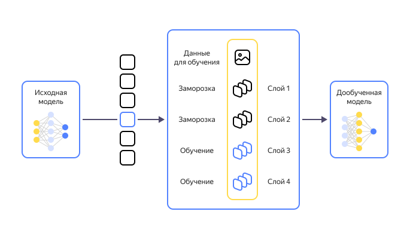

<link href="../styles.css" rel="stylesheet" />

## 01. Введение в машинное обучение

- [01. Введение в машинное обучение](#01-введение-в-машинное-обучение)
  - [Цели и задачи](#цели-и-задачи)
    - [Цели модуля](#цели-модуля)
    - [Задачи модуля](#задачи-модуля)
    - [Результаты обучения](#результаты-обучения)
  - [Основы машинного обучения и больших данных](#основы-машинного-обучения-и-больших-данных)
  - [Искусственный интеллект](#искусственный-интеллект)
    - [Актуальность искусственного интеллекта](#актуальность-искусственного-интеллекта)
    - [Зачем и как изучать искусственный интеллект](#зачем-и-как-изучать-искусственный-интеллект)
    - [Определение понятий](#определение-понятий)
    - [Краткая история развития ИИ](#краткая-история-развития-ии)
    - [Применение ИИ в различных областях](#применение-ии-в-различных-областях)
    - [Чат-боты](#чат-боты)
      - [История развития чат-ботов](#история-развития-чат-ботов)
      - [Как работает виртуальный ассистент с искусственным интеллектом](#как-работает-виртуальный-ассистент-с-искусственным-интеллектом)
      - [Типы чат-ботов](#типы-чат-ботов)
      - [Создание чат-бота](#создание-чат-бота)
      - [Будущее чат-ботов](#будущее-чат-ботов)
    - [Большие языковые модели (LLM)](#большие-языковые-модели-llm)
      - [История возникновения LLM](#история-возникновения-llm)
      - [Виды LLM](#виды-llm)
      - [Принципы работы LLM](#принципы-работы-llm)
      - [Примеры использования LLM в разных областях](#примеры-использования-llm-в-разных-областях)
      - [Проблемы LLM](#проблемы-llm)
    - [Мнения относительно искусственного интеллекта](#мнения-относительно-искусственного-интеллекта)
  - [Машинное обучение](#машинное-обучение)
    - [Введение в машинное обучение](#введение-в-машинное-обучение)
    - [Основные понятия](#основные-понятия)
    - [Типология и суть Machine Learning](#типология-и-суть-machine-learning)
      - [Общая постановка задачи](#общая-постановка-задачи)
      - [Виды машинного обучения](#виды-машинного-обучения)
    - [Задачи машинного обучения](#задачи-машинного-обучения)
    - [Подходы к машинному обучению](#подходы-к-машинному-обучению)
    - [Основные алгоритмы машинного обучения](#основные-алгоритмы-машинного-обучения)
      - [Линейная регрессия](#линейная-регрессия)
      - [Логистическая регрессия](#логистическая-регрессия)
      - [Деревья решений](#деревья-решений)
      - [Случайный лес](#случайный-лес)
      - [Метод опорных векторов (SVM)](#метод-опорных-векторов-svm)
      - [К-средних](#к-средних)
      - [Нейронные сети](#нейронные-сети)
      - [Градиентный бустинг](#градиентный-бустинг)
      - [Ассоциативные правила](#ассоциативные-правила)
    - [Этапы машинного обучения](#этапы-машинного-обучения)
    - [Обучающая и тестовая выборки](#обучающая-и-тестовая-выборки)
    - [Модели машинного обучения](#модели-машинного-обучения)
      - [Основные типы моделей машинного обучения](#основные-типы-моделей-машинного-обучения)
        - [Регрессия](#регрессия)
        - [Классификация](#классификация)
        - [Кластеризация](#кластеризация)
      - [Фундаментальные модели](#фундаментальные-модели)
    - [Дообучение](#дообучение)
    - [Применение машинного обучения](#применение-машинного-обучения)
    - [Преимущества и ограничения машинного обучения](#преимущества-и-ограничения-машинного-обучения)
    - [Будущее машинного обучения](#будущее-машинного-обучения)
  - [Теория и практика](#теория-и-практика)
    - [Теоретическая база](#теоретическая-база)
    - [Средства реализации](#средства-реализации)
    - [1. Предварительные знания](#1-предварительные-знания)
      - [1.1. Математика](#11-математика)
        - [1.1.1. Линейная алгебра](#111-линейная-алгебра)
        - [1.1.2. Математический анализ](#112-математический-анализ)
        - [1.1.3. Основы математической статистики](#113-основы-математической-статистики)
      - [1.1.4. Что делать, если ничего не понятно](#114-что-делать-если-ничего-не-понятно)
      - [1.2. Программирование](#12-программирование)
        - [1.2.1. Python](#121-python)
        - [1.2.2. C++](#122-c)
        - [1.2.3. SQL](#123-sql)
        - [1.2.4. Другие языки, используемые в машинном обучении](#124-другие-языки-используемые-в-машинном-обучении)
        - [1.2.5. Алгоритмы и структуры данных](#125-алгоритмы-и-структуры-данных)
    - [2. Классическое машинное обучение](#2-классическое-машинное-обучение)
  - [Заключение](#заключение)
  - [Глоссарий](#глоссарий)
  - [Практическое задание](#практическое-задание)
    - [Реферат. Применение искусственного интеллекта](#реферат-применение-искусственного-интеллекта)
    - [Реферат. Использование машинного обучения](#реферат-использование-машинного-обучения)
  - [Источники информации](#источники-информации)

### Цели и задачи

#### Цели модуля
Основная цель модуля — дать общее понимание ключевых понятий и структуры машинного обучения, составить общее представление о машинном обучении (МО).

**Цель урока**: познакомиться с феноменом искусственного интеллекта и связанными с ним понятиями, узнать, как развивался искусственный интеллект и как он применяется в современном мире.

#### Задачи модуля

- Изучить основные концепции и термины МО.

- Ознакомиться с этапами построения моделей и подходами к обучению.

- Познакомиться с проблемами и ограничениями МО.

- Рассмотреть примеры практического применения.

- Рассказать о типах задач и алгоритмах МО.

#### Результаты обучения
После прохождения модуля слушатели смогут:

- объяснять, что такое машинное обучение и его место в искусственном интеллекте;

- определять предмет и объект машинного обучения;

- распознавать и формулировать основные задачи МО;

- понимать этапы процесса построения и внедрения ML-моделей;

- оценивать качество моделей и выявлять возможные проблемы и ограничения.

### Основы машинного обучения и больших данных
В последние десятилетия информационные технологии проникают во все сферы нашей жизни, порождая при этом беспрецедентные объемы данных. В эпоху, когда каждое устройство может стать источником данных, и каждое действие может быть зафиксировано и проанализировано, понимание сути и возможностей таких явлений, как машинное обучение и большие данные, становится не просто желательным, но и неотъемлемым для специалистов IT-сектора. Эти две дисциплины – машинное обучение и большие данные – сегодня определяют, как компании принимают решения, как научные исследования достигают новых горизонтов и даже как мы, как потребители, интерактируем с окружающим миром.[^mashinnoe-obuchenie-i-big-data]

Наша задача заключается в том, чтобы разобраться, что такое машинное обучение, сформулировать объект и предмет МО. Далее мы рассмотрим основные концепции машинного обучения, включая типы задач, алгоритмы и инструменты, используемые для создания моделей машинного обучения.[^machine] Кроме того, мы изучим взаимосвязь машинного обучения с другими смежными дисциплинами — искусственным интеллектом (aritificial intelligence), большими данными (big data), наукой о данных (data science), компьютерными науками (computer science), информатикой (information science) и т.п..

<dfn title="машинное обучение">Машинное обучение</dfn> (МО, ML) — это направление (раздел) искусственного интеллекта (AI), которое изучает методы создания алгоритмов, способных учиться на шаблонах тренировочных данных, делать выводы о новых данных и принимать решения без явного программирования на каждую задачу.

В широком смысле <dfn title="машинное обучение">машинное обучение</dfn> (ML) — совокупность математических, статистических и вычислительных методов для разработки алгоритмов. Благодаря им компьютер может решать задачи, выявляя закономерности в разнообразных загружаемых данных. ML — ещё и форма искусственного интеллекта: на этих алгоритмах работает и анализ больших данных.

<dfn title="искусственный интеллект">Искусственный интеллект</dfn> (ИИ, AI) — это область компьютерных наук (*computer science*), целью которой является создание систем, способных имитировать когнитивные функции человека, такие как обучение, рассуждение и принятие решений. Машины, оснащенные ИИ, могут обрабатывать огромные объемы данных, распознавать речь и изображения, а также прогнозировать будущие события, чтобы решать сложные задачи на уровне человеческого интеллекта.

### Искусственный интеллект
Сегодня нас с вами окружают мощнейшие компьютеры, супербыстрые смартфоны, электромобили, системы распознавания лиц, удобные в использовании приложения и всевозможные интерактивные помощники. И все это – прямое следствие развития технологии вообще и искусственного интеллекта в частности.

<dfn title="искусственный интеллект">Искусственный интеллект</dfn> – это область компьютерной науки, которая занимается созданием систем, способных выполнять задачи, которые обычно требуют интеллектуального усилия человека. В этом курсе мы рассмотрим основные концепции и методы, используемые в искусственном интеллекте. Мы начнем со знакомства с феноменом искусственного интеллекта и краткого обзора его истории, а затем перейдем к более конкретным темам, таким как машинное обучение, нейронные сети, глубокое обучение и другим.[^aibasics]

Все мы пользуемся современными технологиями, применяем их в своей работе и повседневной жизни. Но людей, которые знают, что в действительности представляет собой искусственный интеллект, на порядок меньше тех, кто просто пожинает его плоды. Цель курса: познакомиться с основами искусственного интеллекта, понять, как он появился и как он работает, узнать, на что он способен, какие задачи может выполнять и каково его устройство. Наша задача – ввести вас в курс базовых концепций искусственного интеллекта, познакомить с основной терминологией и помочь понять, каким образом нечто, что мы не можем даже потрогать руками и увидеть воочию, становится тем, что многие уже сравнивают с настоящим мозгом человека.

#### Актуальность искусственного интеллекта
Тема искусственного интеллекта (ИИ) в наше время является одной из самых важных и актуальных в мире, и есть несколько причин, почему это так.

Во-первых, ИИ уже сейчас используется во многих сферах жизни, таких как медицина, банковское дело, производство, транспорт и т.д. Благодаря ИИ мы можем получать более точные диагнозы, быстрее и эффективнее проводить финансовые операции, автоматизировать производственные процессы и улучшать безопасность транспорта. Однако с ростом использования ИИ возникают новые вопросы, связанные с этическими, правовыми и социальными последствиями, которые нужно учитывать и регулировать. Этой теме будет посвящен отдельный раздел, поэтому пока не будем заострять на этом внимание.

Во-вторых, ИИ представляет огромный потенциал для инноваций и улучшений в различных областях. Например, в медицине ИИ можно использовать для более точного прогнозирования заболеваний, оценки рисков и эффективности лечения. В области транспорта ИИ может использоваться для создания более умных систем управления трафиком и улучшения безопасности дорожного движения. Но чтобы использовать ИИ на практике, нужно понимать, как он работает и как его можно применять.

> Наконец, ИИ является частью более широкой цифровой революции, которая уже изменяет наш мир и нашу экономику. Как показывает опыт, технологические изменения могут привести к значительным социальным и экономическим переменам, и понимание того, как ИИ может повлиять на нашу жизнь и экономику, является важным для того, чтобы адаптироваться к этим изменениям и использовать их в своих интересах.

Еще одна причина, почему важно разбираться в теме ИИ, это потенциальные риски и угрозы, связанные с данной технологией. Например, существует опасность, что ИИ может быть использован для создания автономных оружейных систем, которые могут стать неуправляемыми и угрожать безопасности мирового сообщества. Также возможны угрозы для личной безопасности и конфиденциальности, связанные с использованием ИИ в массовой слежке или том же навязывании ненужных услуг или товаров.

В целом, тема искусственного интеллекта является важной в современном мире, потому что она уже влияет на нашу жизнь и будет продолжать это делать в будущем. Понимание того, как работает ИИ и как его можно применять, поможет нам использовать его потенциал наилучшим образом и справиться с вызовами, которые возникают с развитием этой технологии. Кроме того, разбираться в ИИ нужно не только специалистам, но и обычным людям, т.к. ИИ влияет на нашу повседневную жизнь и может привести к изменениям в нашем окружении и обществе вообще.[^intro]

#### Зачем и как изучать искусственный интеллект
Для начала скажем, что знать основы искусственного интеллекта полезно людям из самых разных сфер, ведь эта технология распространяется все сильнее и получает все больше влияния. Вот лишь небольшой список тех, кому пригодятся **знания об искусственном интеллекте**:

- Студенты, обучающиеся информационным технологиям, которые планируют заняться исследованиями или работать в этой области.
- Программисты и разработчики, которые хотят создавать приложения, использующие искусственный интеллект.
- Инженеры и специалисты в области автоматизации и робототехники, работающие с технологиями искусственного интеллекта.
- Аналитики данных, желающие использовать искусственный интеллект для анализа больших объемов информации.
- Менеджеры и руководители, которые хотят понимать, как искусственный интеллект может повысить эффективность и конкурентоспособность их бизнеса.
- Люди, работающие в области здравоохранения и биологии, которые хотят использовать искусственный интеллект для обработки и анализа медицинских данных.
- Ученые и исследователи в различных областях, стремящиеся применять искусственный интеллект для решения своих научных задач.

Но знание основ искусственного интеллекта пригодится и совершенно обычному человеку в повседневной жизни, потому что эти технологии становятся все более популярными и появляются во многих сферах.

Например, использование голосовых помощников, таких как Siri и Alexa, или рекомендательных систем на сайтах, таких как YouTube и Netflix, является ярким примером того, как мы используем искусственный интеллект дома. Зная основы данной технологии, мы будем лучше понимать, как эти системы работают и как ими пользоваться.

> Также знание основ искусственного интеллекта поможет нам принимать осознанные решения об использовании технологий вообще и оценивать их влияние на общество и окружающую среду, связанные с их применением риски.

Говоря проще, понимание того, как работает искусственный интеллект, является одной из базовых компетенций современного человека (и тем более специалиста), а также неотъемлемой частью цифровой грамотности. Вместе они позволяют не только боле уверенно чувствовать себя в цифровом пространстве и по жизни, но и уберечься от массы неприятностей, начиная от обмана и мошенничества в Сети и заканчивая информационными пузырями, эффектом Google и т.п.

Освоить тему искусственного интеллекта за короткий промежуток времени – задача практически невозможная. Здесь есть огромное количество подтем, тонкостей и нюансов, и люди, имеющие дело с этой технологией, как правило, посвящают ей всю жизнь.

Здесь не обойтись без изучения основ программирования, математики и статистики, машинного и глубокого обучения и соответствующих библиотек, работы над массой проектов, общения с профессионалами, специалистами и единомышленниками, анализа исследований, прохождений курсов и отслеживания инноваций.

В данном курсе рассматривается несколько наиболее важных и имеющих прямое отношение к искусственному интеллекту и машинному обучению тем, в которых есть смысл разобраться, если изначально отсутствуют либо имеется минимум знаний. Если же просто хочется в общих чертах понять, что к чему, рассмотренного в курсе материала будет более чем достаточно, чтобы перестать оставаться в неведении.

Можно отметить, что данный курс не является заменой полноценной многолетней обучающей программе по искусственному интеллекту и даже не претендует на это. Мы лишь стремимся предоставить возможность стать чуточку осведомленнее в этой области, получить пищу для размышлений и понять, куда двигаться дальше.[^aibasics]

Так что же такое этот самый искусственный интеллект и какими терминами нужно научиться оперировать в первую очередь? Об этом и поговорим далее.

#### Определение понятий
*[DL]: Deep Learning
*[ANN]: Artificial Neural Networks
*[NLP]: Natural Language Processing
*[IoT]: Internet of Things
*[CV]: Computer Vision

Есть огромное количество понятий и терминов, связанных с темой искусственного интеллекта, но рассматривать абсолютно все рамках одного небольшого урока и даже курса было бы достаточно проблематично. Поэтому мы изучим лишь несколько понятий, которые помогут освоить азы темы ИИ и начать в ней разбираться.

Далее мы приводим список основных понятий из области искусственного интеллекта и их определения:

- <dfn title="искусственный интеллект">Искусственный интеллект</dfn> (*Artificial Intelligence*, AI) – область науки, которая занимается разработкой компьютерных систем и программ, способных имитировать интеллектуальные функции человека, такие как распознавание образов, обработка естественного языка и принятие решений.

- <dfn title="машинное обучение">Машинное обучение</dfn> (*Machine Learning*, ML) – метод построения алгоритмов и систем, которые могут изучать и анализировать данные, обнаруживать закономерности и использовать их для решения задач.

- <dfn title="глубокое обучение">Глубокое обучение</dfn> (*Deep Learning*, DL) – подмножество методов машинного обучения, основанных на использовании искусственных нейронных сетей для обработки и анализа данных.

- <dfn title="искусственные нейронные сети">Искусственные нейронные сети</dfn> (*Artificial Neural Networks*, ANN) – компьютерные системы, моделирующие работу нейронных сетей мозга, которые используются для обработки информации и решения задач.

- <dfn title="обработка естественного языка">Обработка естественного языка</dfn> (*Natural Language Processing*, NLP) – область искусственного интеллекта, которая занимается разработкой систем и алгоритмов для обработки и анализа естественного языка, используемого в человеческой коммуникации.

- <dfn title="робототехника">Робототехника</dfn> (*robotics*) – область техники и искусственного интеллекта, которая занимается разработкой и созданием роботов и автономных систем, способных выполнять различные задачи.

- <dfn title="интернет вещей">Интернет вещей</dfn> (*Internet of Things*, IoT) – концепция взаимодействия между различными устройствами и сетями, которые используют сенсоры и другие технологии для сбора и обработки данных.

- <dfn title="компьютерное зрение">Компьютерное зрение</dfn> (*Computer Vision*, CV) – область искусственного интеллекта, которая занимается разработкой систем и алгоритмов для анализа и интерпретации изображений и видео.

- <dfn title="автономные системы">Автономные системы</dfn> (*autonomous systems*) – системы и устройства, способные принимать решения и выполнять действия без участия человека.

- <dfn title="Большие данные">Большие данные</dfn> (*Big Data*) – огромные объемы данных, которые требуют специальных методов и технологий для их обработки, анализа и использования.

- <dfn title="распознавание образов">Распознавание образов</dfn> (*Image Recognition*) – процесс определения и идентификации объектов и паттернов на изображениях.

- <dfn title="алгоритмы оптимизации">Алгоритмы оптимизации</dfn> (*Optimization Algorithms*) – методы и алгоритмы, используемые для поиска наилучших решений в различных задачах оптимизации.

- <dfn title="решающие деревья">Решающие деревья</dfn> (*Decision Trees*) – модели машинного обучения, использующие древовидную структуру для принятия решений.

- <dfn title="байесовские сети">Байесовские сети</dfn> (*Bayesian Networks*) – модели, основанные на вероятностных методах и используемые для анализа и предсказания сложных систем.

- <dfn title="эволюционные алгоритмы">Эволюционные алгоритмы</dfn> (*Evolutionary Algorithms*) – методы машинного обучения, основанные на принципах эволюции в природе и используемые для поиска наилучших решений.

- <dfn title="кластеризация">Кластеризация</dfn> (*clustering*) – метод машинного обучения, который позволяет разбивать данные на группы, основанные на их сходстве.

- <dfn title="ассоциативные правила">Ассоциативные правила</dfn> (*Association Rules*) – методы машинного обучения, используемые для анализа больших данных и поиска закономерностей и связей между различными параметрами.

- <dfn title="нейронные сети прямого распространения">Нейронные сети прямого распространения</dfn> (*Feedforward Neural Networks*) – тип искусственных нейронных сетей, используемых для решения различных задач, включая распознавание образов, прогнозирование и классификацию.

- <dfn title="рекуррентные нейронные сети">Рекуррентные нейронные сети</dfn> (*Recurrent Neural Networks*) – тип искусственных нейронных сетей, способных обрабатывать последовательные данные, такие как текст, речь и временные ряды.

- <dfn title="сверточные нейронные сети">Сверточные нейронные сети</dfn> (*Convolutional Neural Networks*) – тип искусственных нейронных сетей, используемых для обработки и анализа изображений и видео.

Это лишь небольшой список ключевых терминов из области искусственного интеллекта. Они являются основными для понимания основных принципов и методов ИИ. В последующих уроках мы в той или иной степени будем касаться всего (или почти всего) перечисленного. А в особых случаях будем давать дополнительные пояснения.

Теперь же давайте немного отвлечемся и попробуем проследить, как развивался искусственный интеллект с течением времени. Уверены, что история его развития, даже в краткой форме, будет интересна любому, кто неравнодушен к теме ИИ.[^intro]

#### Краткая история развития ИИ
*[LISP]: List Processing language

История развития ИИ начинается с конца 19 века, когда появилась идея создания машин, способных имитировать человеческий интеллект. Одной из первых попыток создания машин с элементами ИИ был механический анализатор Чарльза Бэббиджа, который был предназначен для автоматического решения математических задач.[^nick-bostrom]

!!! question "Как вы думаете"

      В каком десятилетии 20 века были сделаны первые шаги к созданию искусственного интеллекта?

      <details>
      <summary>Ответ</summary>

      Первые шаги к созданию искусственного интеллекта были сделаны в 1950-х годах, во втором десятилетии 20 века. Дартмутская конференция 1956 года считается официальным рождением ИИ как дисциплины, где Джон Маккарти и коллеги сформулировали основные идеи. Работы Алана Тьюринга 1950 года, включая тест Тьюринга, заложили теоретическую основу. Таким образом, 1950-е годы ознаменовались переходом от философских идей к практическим разработкам логических систем и первых программ.

      </details>

В 1960-х годах были разработаны первые языки программирования и инструменты для создания искусственного интеллекта, такие как язык LISP и система [ELIZA](https://ru.wikipedia.org/wiki/%D0%AD%D0%BB%D0%B8%D0%B7%D0%B0_(%D0%BF%D1%80%D0%BE%D0%B3%D1%80%D0%B0%D0%BC%D0%BC%D0%B0)), которая могла имитировать психотерапевта.

В 1970-х годах были созданы экспертные системы, которые использовали базы знаний и правил для решения задач в конкретной области. Одним из примеров таких систем является [MYCIN](https://ru.wikipedia.org/wiki/MYCIN), система для диагностики инфекционных заболеваний.[^4JwN5DTpcqkC]

В 1980-х годах началось развитие нейронных сетей и методов машинного обучения. Также появилась концепция распределенного искусственного интеллекта, которая предполагала использование нескольких машин для решения сложных задач.[^1404.7828]

В 1990-х годах с развитием компьютерных технологий и Интернета появилась возможность собирать и обрабатывать большие объемы данных, что привело к развитию методов анализа данных и машинного обучения.

В 2000-х годах развитие ИИ было ускорено за счет использования графических процессоров для обработки данных и создания более мощных нейронных сетей.[^nature16961]

В настоящее время разработки в области ИИ продолжаются и активно применяются в различных областях, таких как медицина, финансы, производство, транспорт и другие. Существует множество приложений ИИ, таких как голосовые ассистенты, системы автоматического перевода, системы распознавания речи и образов, анализ данных и т.д.

> Современный ИИ стал возможен благодаря развитию компьютерных технологий, а также разработке новых методов и алгоритмов машинного обучения. В настоящее время активно разрабатываются и исследуются такие методы, как глубокое обучение, рекуррентные нейронные сети, обработка естественного языка и многие другие.

Однако вместе с развитием ИИ возникают и некоторые риски и проблемы, такие как безопасность и конфиденциальность данных, автономность систем и роботов, а также социальные и этические вопросы, связанные с замещением человеческого труда машинами.

Таким образом, развитие искусственного интеллекта продолжается, а его применение в различных областях жизни становится все более широким. Вместе с этим появляются и новые проблемы и вызовы, связанные с этой технологией, которые требуют серьезного и внимательного рассмотрения.

И чтобы более предметно показать, насколько прочно и основательно ИИ внедрился в нашу с вами жизнь, давайте посмотрим на несколько примеров его применения.[^intro]

#### Применение ИИ в различных областях
Искусственный интеллект применяется в различных областях жизни, включая медицину, производство, финансы, транспорт, образование и другие. Рассмотрим эти области более подробно:

- **Медицина**. ИИ используется для диагностики болезней, разработки лекарств и прогнозирования состояния пациентов. Например, системы машинного обучения помогают врачам в обработке медицинских данных, определении диагноза и улучшении лечения заболеваний.

- **Производство**. ИИ используется для оптимизации производственных процессов, контроля качества и прогнозирования спроса на продукцию. К примеру, системы машинного обучения помогают в автоматизации производственных процессов, снижении уровня брака и сокращении времени на производство.

- **Финансы**. ИИ используется для анализа финансовых данных, прогнозирования рыночных трендов и управления рисками. Так, системы машинного обучения помогают в автоматизации процессов кредитования, определении вероятности дефолта и мошенничества, а также в принятии решений по инвестированию.

- **Транспорт**. ИИ используется для управления автономными транспортными средствами, оптимизации маршрутов и улучшения безопасности на дорогах. Например, системы машинного обучения оказывают поддержку в прогнозировании трафика, предотвращении аварий и улучшении энергоэффективности транспортных средств.

- **Образование**. ИИ используется для персонализации образовательного процесса, адаптации к ученикам и автоматизации оценки знаний. Системы машинного обучения помогают в разработке индивидуальных учебных планов, определении слабых мест учащихся и предоставлении обратной связи.

- **Розничная торговля**. ИИ используется для персонализации рекомендаций, прогнозирования популярности товаров и оптимизации логистики. К примеру, системы машинного обучения помогают в предоставлении персонализированных рекомендаций покупателям на основе истории их покупок и предпочтений, а также позволяют оптимизировать запасы и доставку товаров.

- **Энергетика**. ИИ используется для управления энергосистемами, оптимизации производства электроэнергии и улучшения энергоэффективности. Так, системы машинного обучения существенно облегчают прогнозирование спроса на электроэнергию и оптимизацию работы сетей электропередач.

- **Реклама и маркетинг**. ИИ используется для анализа поведения потребителей, определения целевой аудитории и улучшения эффективности рекламных кампаний. К примеру, системы машинного обучения помогают автоматизировать рекламные кампании, определять оптимальные цены и прогнозировать эффективность рекламы вообще.

- **Робототехника**. ИИ используется для разработки автономных роботов и систем управления ими. Например, системы машинного обучения участвуют в создании роботов, которые могут самостоятельно принимать решения и выполнять задачи, допустим, при работе на складах.

- **Обработка естественного языка**. ИИ используется для разработки систем, которые могут обрабатывать и понимать естественный язык. Системы машинного обучения могут помочь в создании голосовых ассистентов, систем перевода и анализа текстов.

- **Игровая индустрия**. ИИ используется для создания более реалистичных и интерактивных игровых миров, улучшения характеристик персонажей и оптимизации процесса разработки игр.

- **Распознавание изображений**. ИИ используется для распознавания объектов и сцен на изображениях, а также для создания автоматических инструментов редактирования и улучшения изображений.

- **Голосовые ассистенты**. ИИ используется для создания голосовых ассистентов, которые участвуют в управлении устройствами, поиске информации и выполнении других задач.

- **Анализ контента**. ИИ используется для анализа и категоризации контента, такого как изображения, видео и аудио.

Думаем, что перечисленного хватает с головой, чтобы увидеть, что ИИ присутствует сегодня практически в каждой сфере жизни человека. А если вам хочется статистики, вот несколько любопытных фактов.

По данным исследования PwC, еще в 2017 году 72% крупнейших компаний мира считали ИИ ключевым бизнес-приоритетом. Более 50% компаний использовали ИИ для анализа данных, а 20% планировали внедрить технологию в ближайшие 12 месяцев.

> В 2019 году появилось более 400 новых медицинских продуктов на базе ИИ, и это число продолжает расти. Одна из главных областей применения ИИ в медицине – диагностика и прогнозирование заболеваний. Также ИИ помогает управлять медицинскими данными и оптимизировать рабочие процессы врачей и медицинского персонала.

ИИ применяется для прогнозирования рынка, управления портфелем, обработки платежей и борьбы с мошенничеством. По данным Tractica, до 2025 года глобальный рынок ИИ в финансовой сфере достигнет $26 млрд. Кроме того, по данным Statista, к 2025 году объем мирового рынка ИИ составит $190 млрд.

В целом же, статистика говорит о том, что использование ИИ в настоящее время широко распространено и продолжает расти в различных секторах экономики. Прогнозы также указывают на дальнейшее увеличение объемов инвестиций и использования ИИ в будущем.

> И все это в очередной раз свидетельствует о том, что изучать искусственный интеллект важно и нужно. Хотя бы по той простой причине, что это позволяет идти в ногу со временем, быть в курсе новых трендов и тенденций, иметь общее представление о том, что может ждать в будущем, а значит, развивать соответствующие знания и навыки и планировать свое обучение, карьеру и жизнь в целом.

#### Чат-боты
Чат-бот или виртуальный консультант — это программа для общения с клиентами, которая помогает им решить задачи разной степени сложности и принести выгоду бизнесу. Например, проконсультировать по действующим тарифам, назначить собеседование, ответить на частые вопросы и решить другие рутинные задачи. Нередко программа имитирует разговор так, будто его ведет человек, а не робот.

В основе самых современных виртуальных консультантов лежат технологии машинного обучения и искусственного интеллекта. Они распознают намерения пользователя и подбирают ответы, которые, вероятнее всего, хочет получить пользователь. В то же время боты непрерывно обучаются на новых данных, своем опыте и ошибках. Нередко они настроены так, что при возникновении у пользователя трудностей в чат приглашается сотрудник.

Все это помогает автоматизировать процессы, сэкономить бюджет и время сотрудников, а также дать клиенту быстрый ответ. Например, сервис [HR Messenger](https://hrmessenger.com/) обрабатывает отклики от 160 кандидатов в минуту. На это понадобилось бы как минимум девять сотрудников. Облачная платформа Yandex Cloud позволяет чат-боту работать без сбоев, экономя 70% бюджета на подбор персонала.[^chat-bot]

##### История развития чат-ботов
Вопросы искусственного интеллекта обсуждались еще с прошлого века. Новый толчок им дала статья Алана Тьюринга «[Вычислительная техника и интеллект»](http://www.etheroneph.com/files/can_the_machine_think.pdf), опубликованная в 1950 году. Ученый предложил оценивать искусственный интеллект по тому, насколько трудно отличить его от человеческого. По мнению Тьюринга, если человек в переписке не сможет понять, что это машина, то это идеальный искусственный интеллект.

В 1966 году появилась программа Джозефа Вейзенбаума [ЭЛИЗА](https://ru.wikipedia.org/wiki/%D0%AD%D0%BB%D0%B8%D0%B7%D0%B0_(%D0%BF%D1%80%D0%BE%D0%B3%D1%80%D0%B0%D0%BC%D0%BC%D0%B0)), которая имитировала разговор с психотерапевтом. Программа поддерживала диалог фразами «Пожалуйста, продолжайте», реагировала на ключевые слова и задавала вопросы, вроде «Расскажи мне больше о своей семье». Похожие методы легли в основу современных чат-ботов.

В 2010-е годы широкую популярность приобрели мессенджеры и социальные сети, которые стали удобной площадкой для размещения виртуальных собеседников. Одними из первых компаний, использующих чат-боты, стали крупные банки. Сегодня ими пользуется в том числе и малый бизнес.

2022 год стал одним из самых громких в истории развития искусственного интеллекта. Компания OpenAI представила чат-бот [ChatGPT](https://openai.com/chatgpt), который нашел применение во всех возможных сферах деятельности человека. Незадолго до этого также произошел громкий скандал, когда инженер по программному обеспечению компании Google Блейк Леймон заявил, что у нейросети LaMDA есть сознание. Многие сочли это возмутительным, и Блейк был отстранен от работы.

##### Как работает виртуальный ассистент с искусственным интеллектом
*[NLU]: Natural Language Understanding

Обычные чат-боты действуют достаточно прямолинейно: ищут в сообщении ключевые слова и выдают заранее подготовленные ответы либо задают уточняющие вопросы. В случае с искусственным интеллектом схема сложнее:

1. Бот получает запрос и загружает контекст диалога из базы данных.

2. Полученная информация позволяет определить намерение пользователя с помощью [NLU](https://ru.wikipedia.org/wiki/%D0%9F%D0%BE%D0%BD%D0%B8%D0%BC%D0%B0%D0%BD%D0%B8%D0%B5_%D0%B5%D1%81%D1%82%D0%B5%D1%81%D1%82%D0%B2%D0%B5%D0%BD%D0%BD%D0%BE%D0%B3%D0%BE_%D1%8F%D0%B7%D1%8B%D0%BA%D0%B0) (*Natural-language understanding*, понимание естественного языка).

3. Система ищет информацию, наиболее точно удовлетворяющую запросу.

4. Если это запрограммировано, то выполняются заданные скрипты и вызываются внешние информационные системы.

5. Генерируется ответ с помощью множества подстановок и функций, позволяющих правильно писать на естественном языке.

6. Диалог отправляется в базу данных для самообучения и последующего использования.

7. Пользователь получает ответ.

##### Типы чат-ботов
Благодаря гибкости нейросетей и технологиям машинного обучения чат-ботам можно найти множество применений, например:

- **Информационные**: могут отвечать на вопросы о погоде, новостях, расписании событий и другом. Призваны упростить взаимодействие пользователя с сайтом или мобильным приложением или сделать его более интерактивным.

- **Торговые**: предоставляют информацию о ценах, скидках, помогают выбрать товар и проконсультировать по созданию заказа. Используются в электронной коммерции.

- **Чат-боты службы поддержки**: круглосуточно предоставляют информацию по услугам компании и помогают решить несложные проблемы. Такие чат-боты настроены на часто задаваемые вопросы и могут решить до половины всех задач, с которыми обращаются клиенты.

- **Рекрутинговые**: позволяют на раннем этапе оценить способности кандидатов, провести отбор, назначить интервью, разослать приглашения или сделать обзвоны. Полезны любым компаниям с большим штатом сотрудников.

- **Медицинские**: помогают записаться на прием, получить медицинскую информацию, проверить результаты анализов и другое. Согласно [исследованиям 2019 года](https://www.ncbi.nlm.nih.gov/pmc/articles/PMC6704417/), 67% опрошенных обратились бы к такому боту, но многие также отказались доверить машине вопросы своего здоровья.

- **Развлекательные**: могут рассказывать шутки, анекдоты, использоваться в качестве развивающих игрушек для детей. Например, кукла Hello Barbie, которая подключена к интернету и может общаться с детьми на простые темы.

##### Создание чат-бота
Процесс создания бота можно поделить на несколько этапов:

1. **Продумывание концепции и сбор информации.**

      Сначала нужно продумать общую идею: будет ли бот просто предоставлять информацию или сможет самостоятельно решать многие задачи пользователей. Предполагается, что перед созданием виртуального ассистента у вас уже есть такая информация, как целевая аудитория, ее интересы, часто задаваемые вопросы и т. д.

      Можно воспользоваться данными технической поддержки, отдела работы с клиентами и других отделов, чтобы выписать все возможные потребности пользователей. От этого напрямую зависит полезность бота: будут ли люди пользоваться его ответами или предпочтут общаться с оператором.

2. **Составление структуры диалога.**

      Прежде чем приступать к разработке чат-бота, требуется продумать для него структуру диалога, позволяющую как можно точнее выяснить причину обращения и помочь клиенту без участия сотрудника. Пример структуры торгового чат-бота без искусственного интеллекта:

      - **Стартовые вопросы** — на этапе приветствия можно добавить кнопки, которые позволят клиенту выбрать примерную причину обращения. Например, вопросы по доставке, отмена заказа, возврат и обмен товара, технические проблемы и другое.
      - **Блоки с ключевыми словами** — алгоритмы, которые извлекают из сообщения пользователя определенные слова и выдают заранее заготовленные ответы.
      - **Уточняющие вопросы**, например, фамилия, номер заказа и другая информация для обращения в базу данных.
      - **Конец диалога** — условия для завершения диалога с чат-ботом или переключения на сотрудника. Например, если пользователь благодарит и прощается, ключевых слов в сообщении нет или пользователь сам требует оператора.
3. **Искусственный интеллект и машинное обучение.**

      Для более продвинутых ботов можно использовать искусственный интеллект, который позволяет поддерживать диалог с пользователем, не опираясь на ключевые слова. Такой виртуальный ассистент генерирует ответы с помощью нейросети или эвристических методов.

      Подобные боты также включают в себя технологии машинного обучения, которые позволяют им использовать огромные объемы данных, полученных в том числе из диалогов с пользователями. Алгоритмы анализируют данные, прогнозируют успешность своих ответов и со временем ставятся «умнее».

      Это незаменимо в юриспруденции, образовании и других областях, где требуется индивидуальный подход, а также для крупных компаний, предоставляющих широкий спектр услуг.

4. **Способ разработки и технологии для интеграции.**

      Далее следует определить, где виртуальный ассистент будет работать. Можно разместить его на сайте компании, в мессенджере или в социальных сетях. Инструменты для разработки виртуальных помощников сегодня предоставляет почти каждая крупная площадка. Например, ВКонтакте, Telegram и другие.

      Сегодня можно создать бота, даже если у вас нет своих программистов. Популярность виртуальных помощников привела на рынок многочисленные сервисы для их создания. Также можно воспользоваться онлайн-конструкторами, которые не требуют от пользователя навыков программирования. Например, Flow XO, Fasttrack, Chatforma и другие.

5. **Тестирование.**

      Чем сложнее бот, тем выше вероятность ошибок. К примеру, голосовые боты могут неправильно распознавать слова, а текстовые нуждаются в дополнительных настройках, чтобы их ответы никого не обидели и не посоветовали нечто вредное.

      В случае с голосовыми ботами тестировщик ищет в логах момент, когда все пошло не по плану, и решает, что с этим делать. Например, слово «доставлен» созвучно с «до ставен», поэтому для логики торгового бота уместно будет сделать их синонимами.

      Тем временем у текстовых ботов бывают проблемы с этичностью ответов, грамотностью, выдачей списков и таблиц, слишком длинных ответов и многим другим. Нужно проверить все сценарии взаимодействия с ботом до того, как клиент столкнется с неудобствами и напишет негативный отзыв о компании.

      Однако некоторые ошибки исправить не получится. Например, [галлюцинации искусственного интеллекта](https://en.wikipedia.org/wiki/Hallucination_(artificial_intelligence)), когда бот пытается выдать выдуманную информацию за доказанный факт. Феномен не до конца изучен, и разработчики не могут избавиться от него полностью.

##### Будущее чат-ботов
Популярность чат-ботов с каждым годом растет, и нет никаких предпосылок, что это изменится в скором будущем. Рассмотрим статистику по использованию чат-ботов на 2023 год:

- 62% клиентов [согласились бы](https://www.tidio.com/blog/chatbot-statistics/) разговаривать с чат-ботом, а 38% предпочли бы дождаться оператора.
- 19% компаний уже используют чат-ботов, а 62% планируют их внедрить.
- 74% владельцев чат-ботов удовлетворены их работой, 22% высказались нейтрально и лишь 4% имели негативный опыт.
- На 67% в среднем [увеличились](https://thrivemyway.com/chatbot-statistics/) продажи у лидирующих компаний, которые внедрили чат-ботов.
- В среднем чат-боты генерируют 35–40% полезных откликов.

По мнению экспертов, если 2-3 года назад рынок виртуальных помощников стоил около 2 млрд $, то в 2024 году он превзошел отметку в 15 млрд $. Ожидается, что чат-боты также станут гораздо умнее. Например, они смогут перенаправлять клиента на другого бота, более компетентного в какой-то области, а искусственный интеллект и машинное обучение будут использоваться в бо́льших объемах.

Многие опасаются, что боты могут вытеснить людей из этих профессий. До настоящих консультантов они пока не дотягивают, но за счет стремительного развития технологий все может быстро измениться. Ожидается, что первыми боты заменят сотрудников колл-центров, консультантов по кредитам и страховкам и т. д.[^chat-bot]

#### Большие языковые модели (LLM)
*[LLM]: Large Language Models

<dfn title="большая языковая модель">Большая языковая модель</dfn> (*Large language model*, LLM) — продвинутая вычислительная модель, способная анализировать и генерировать тексты на любую тематику. Она работает по принципу нейронных сетей и может образовывать сложные шаблоны и взаимосвязи между изученными языковыми данными.[^llm]

##### История возникновения LLM
*[GPT]: Generative Pre-trained Transformer
*[RNN]: Recurrent neural network
*[BERT]: Bidirectional Encoder Representation Transformers
*[T5]: Text-to-Text Transfer Transformer

Первые языковые модели появились еще в 1990-х годах и могли работать только над лексическим переводом, выравниванием порядка слов в предложениях и другими относительно несложными задачами. Работа над полноценными LLM началась в начале 2010-х годов, когда нейронные сети хорошо зарекомендовали себя в работе с изображениями.

Уже к 2016 году переводчик Google начал работать на основе нейронной сети. В 2017 году исследователи компании представили архитектуру [Transformer](https://ru.wikipedia.org/wiki/%D0%A2%D1%80%D0%B0%D0%BD%D1%81%D1%84%D0%BE%D1%80%D0%BC%D0%B5%D1%80_(%D0%BC%D0%BE%D0%B4%D0%B5%D0%BB%D1%8C_%D0%BC%D0%B0%D1%88%D0%B8%D0%BD%D0%BD%D0%BE%D0%B3%D0%BE_%D0%BE%D0%B1%D1%83%D1%87%D0%B5%D0%BD%D0%B8%D1%8F)), которая легла в основу всех популярных LLM. В 2018 OpenAI создали GPT-1, но она не стала особо популярной. GPT-2, выпущенную годом позже, компания отказалась делать общедоступной из-за опасений по поводу ее злонамеренного использования.

К 2022 году OpenAI пересмотрела свое отношение и представила миру ChatGPT (GPT 3.5), которая стала первой большой языковой моделью, привлекшей огромное внимание. За следующие два года LLM проникли практически во все сферы бизнеса и науки.

##### Виды LLM
Все наиболее популярные большие языковые модели базируются на архитектуре Transformer, но могут быть дополнительно настроены под конкретные задачи, например:

- **GPT** (*Generative Pre-trained Transformer*) — наиболее актуальные LLM для генерации текста. Имеют обширную область применения: чат-боты, генерация рекламного контента, написание программ и другое.
- **BERT** (*Bidirectional Encoder Representation Transformers*) – модель, которая распознает текст как слева направо, так справа налево. Используется для генерации релевантной поисковой выдачи, переводов и других задач, завязанных на контекстуальном анализе текста.
- **T5** (*Text-to-Text Transfer Transformer*) — модели, обученные преобразовывать один вид текстовых данных в другой. Например, системы машинного перевода и декодирования.

Не так давно начали появляться модели, основанные на новых архитектурах. Например, рекуррентные нейросети (RNN) и Mamba (модель пространства состояний), которые особенно хорошо справляются с последовательностями слов и событий и требуют меньше ресурсов.

##### Принципы работы LLM
Большие языковые модели выполняют свои задачи за доли секунды, однако пользователи не видят, как сложно они устроены внутри. Разберем принцип работы LLM на простом примере:

1. **Запрос** — пользователь обращается к модели. Например, спрашивает: «Какая погода в Москве?»

2. **Токенизация** — модель разбивает запрос на токены, что позволяет ей лучше понимать естественный язык.

      Нейросети работают с текстами, представляя слова и предложения в виде <dfn title="токен">токенов</dfn> (*token*) — смысловых отрывков или часто встречающихся последовательностей символов, характерных для естественного языка. Токены позволяют нейросетям находить закономерности и обрабатывать естественный язык. Каждая модель использует свой токенизатор для обработки текстов, поэтому количество токенов в одном и том же тексте будет отличаться.[^tokens] Например, наш запрос может быть разбит на пять токенов: «Какая», «погода», «в», «Москве», «?».

      <dfn title="токенизация">Токенизация</dfn> (*tokenization*) — процесс разделения текста на составляющие (их называют «токенами»). Чаще всего текст разделяется на токены по словам или предложениям.

3. **Векторизация** — токены преобразуются в векторы, называемые эмбеддингами. Эти векторы отражают смысловое значение и контекст так, чтобы нейросеть могла применять к ним математические алгоритмы.

      Компьютеры обрабатывают любую информацию в виде чисел. Чтобы эффективно работать с текстами на естественных языках, модели искусственного интеллекта преобразовывают слова, фразы и предложения в числовые векторы (массивы чисел) фиксированного размера, которые сохраняют характеристики слов и связи между ними.

      Процесс преобразования текста в такие векторы называется <dfn title="векторизация">векторизацией</dfn> (*vectorization*), а результирующий вектор — <dfn title="embedding">эмбеддингом</dfn> (*embedding*). Эмбеддинги хранят информацию о тексте и позволяют применять математические методы для обработки текстов. Так, с помощью эмбеддингов можно классифицировать информацию, сравнивать и сопоставлять тексты или организовать поиск по собственной базе знаний.[^embeddings]

6. **Формулирование ответа** — модель пропускает эмбеддинги через многочисленные слои информации, то есть собственную базу знаний. Каждый слой помогает модели лучше понять написанное и дать наиболее точный ответ.

7. **Корректировка** — модель редактирует текст с учетом заложенных в нее фильтров. Например, убирает потенциально опасные призывы, нецензурные слова и прочее.

8. **Декодирование** — ответ модели преобразуется обратно в текст, чтобы человек смог его понять.

На такой простой запрос большинство LLM с легкостью даст релевантный ответ, однако даже самые мощные из них часто не справляются с более сложными запросами, если их плохо сформулировать. Для составления понятных машине запросов существует целая дисциплина — [проектирование промптов](https://yandex.cloud/ru/docs/ai-studio/gpt-prompting-guide/about) (запросов).

Также пользователю часто доступны дополнительные параметры ответа, такие как его максимальная длина и *температура* (*temperature*). Второй параметр сообщает модели, насколько творчески она может подойти к задаче. С низкими значениями температуры LLM выдаст более детерминированный ответ, что подходит для фактических запросов, а с высокими — будет больше «фантазировать» и напишет, например, более удачную песню или сочинение.

##### Примеры использования LLM в разных областях
Большие языковые модели позволяют бизнесу автоматизировать многие процессы, повысить качество контента или эффективность работы многих специалистов. Разберем популярные сценарии их использования.

- **Анализ настроения клиентов**

    Стриминговый сервис Netflix [использует](https://medium.com/@imteyazkashif8/using-llms-for-recommendation-systems-a-netflix-use-case-967c007dd173) LLM для формирования персональных рекомендаций контента. Алгоритмы анализируют отзывы пользователей на сайте и в соцсетях, а также их историю просмотров и оценок. Эти данные позволяют определить, какой контент будет наиболее интересен конкретному пользователю. Для обработки такого объёма информации вручную потребовалось бы привлечь тысячи сотрудников, LLM же нужно всего несколько минут. Модель запоминает даже то, какой контент более релевантен для пользователя в определенное время суток.

- **Генерация описаний товаров**

    Компании Лемана ПРО (Леруа Мерлен) с помощью модели YandexGPT [удалось](https://yandex.cloud/ru/blog/posts/2024/10/yandex-gpt-4-0) снизить стоимость написания карточек товаров для дома и ремонта в 95 раз. В ассортименте магазинов более 390 000 товаров, генерировать описания которых вручную — задача колоссального объема.

    Ритейлер также обращается к модели YandexART для генерации медиаконтента. Модель может органично представить ту или иную вещь в разных интерьерах и экстерьерах, что помогает покупателям упростить выбор, а магазину — увеличить продажи.

- **Автоматизация процесса обработки заказов**

    Разработчик Макс Бродер-Урбас [поделился](https://betterprogramming.pub/placing-30-000-customer-orders-with-llms-f1f73872e2eb) опытом обработки более 30 000 ежегодных заказов компании по оптовой продаже алкогольной продукции с помощью LLM. Заказы осуществляются по электронной почте и каждый из них — отдельная головоломка, потому что нужно рассчитать скидку, проверить доступность товара на складе и добавить к заказу недостающую информацию.

    Процесс был реализован в три этапа: обработка электронной почты, поиск недостающей для заказа информации и отправка нового письма с корректно оформленным заказом, который останется только принять. До внедрения LLM обработка заказов требовала времени множества сотрудников и была самым уязвимым местом компании для масштабирования.

- **Общение с клиентами**

    Производителю обуви Ralf Ringer с помощью YandexGPT [удалось](https://vc.ru/services/1659960-kak-s-pomoshyu-yandexgpt-avtomaticheski-otvechat-na-60-voprosov-i-otzyvov-opyt-ralf-ringer) наполовину автоматизировать обработку обращений в клиентскую поддержку. За день модель успевает «пообщаться» более чем с 2 000 пользователей.

    Модель специально дообучили под бренд на парах «вопрос — ответ». Каждый новый качественный ответ также заносится в базу данных для дообучения. В качестве тестирования продавцам предложили сравнить ответы оператора и модели: 65% выбрали модель. Правда, негативные отзывы ей пока не доверяют — модель самостоятельно выявляет тональность сообщения и передает его оператору, если она негативная.

- **Постановка диагнозов**

    Если обучить модель на больших массивах медицинских данных, она [способна](https://www.johnsnowlabs.com/the-impact-of-medical-llms-on-disease-diagnosis-and-treatment/) анализировать и интерпретировать сложную медицинскую информацию, складывая в одну картину множество фактов из анамнеза пациента. Медицина — та область, в которой потенциал LLM огромен.

     Модели могут подмечать закономерности, которые невооруженным взглядом не увидит даже опытный диагност. Помимо индивидуальной помощи пациентам, большие языковые модели используются в исследованиях болезней и разработке лекарств.

##### Проблемы LLM
Несмотря на позитивную динамику развития LLM, перед разработчиками все еще стоит ряд вызовов:

- **Галлюцинации** — модели склонны генерировать фактически неверную, нарушающую логику или несоответствующую контексту информацию. Зачастую сложно найти причины такого поведения — это может быть некорректный промпт, проблемы с данными для обучения, несовершенство архитектуры и многое другое.

- **Этические проблемы** — создатели LLM иногда закладывают в модели свои собственные или обусловленные законами страны ценности и предубеждения. Это может сделать модель необъективной. Например, на какой-то сложный запрос она выдаст предвзятый ответ или вовсе откажется отвечать.

- **Ограниченные рассуждения** — LLM все еще плохо справляются с задачами, требующими долгих размышлений. Без дообучения они представляют собой эрудированного на первый взгляд сотрудника, все знания которого оказываются поверхностными, если попробовать углубиться в тему.

- **Однотипные и неуместные ответы** — модель иногда чрезмерно ориентируется на конкретный результат. Например, если стимулировать модель давать безвредные ответы, она может добавлять предостерегающие дисклеймеры там, где это не нужно. «Не ешьте слишком много яблок», — может добавить LLM к ответу на безобидный запрос о сортах этого фрукта.

- **Интерпретация контекста** — в сложных текстах модели могут не понимать, как согласуются между собой те или иные их части. Особенно это заметно в задачах, где нужно распознать отношения между сущностями.

- **Эмерджентность** — LLM могут проявлять поведение, которое не закладывалось разработчиками. Например, модель Bard научилась переводить с бенгальского языка, хотя ее этому не обучали. Умение модели самостоятельно искать информацию может быть полезно, но многие исследователи считают это поводом насторожиться — поведение нейросетей трудно предсказать.

- **Нарушение авторских прав** — нейросети обучаются на информации из интернета, но многие не заинтересованы в передаче им своих материалов. Законодательства многих стран пока не приспособились к новой реальности, что служит почвой для судебных разбирательств.

- **Ресурсозатратность** — чем больше модель, тем большие вычислительные мощности ей нужны. Только один центр обработки данных потребляет энергию, которой хватило бы для годового энергообеспечения 50 000 домов.[^llm]

#### Мнения относительно искусственного интеллекта

> Я думаю, что наш разум – это программа, в то время как мозг – аналог компьютера. Теоретически возможно скопировать содержимое мозга на компьютер и таким образом создать форму вечной жизни. Сегодня, однако, это не в наших силах.


*Стивен Хокинг*

> Представьте: вы придумали самообучаемую машину, которая собирает клубнику. Она с каждым днем собирает ее все лучше и лучше, все больше и больше. Ей начинает нравиться собирать клубнику. Логично, что в какой-то момент ей захочется, чтобы на всей планете были сплошные клубничные поля. А теперь представьте, что вы собираетесь выключить такого робота, чтобы он не уничтожил человечество, пытаясь засадить все клубникой. Вы будете первым, кого он убьет.


*Илон Маск*

> Инструменты контроля с помощью искусственного интеллекта дают неотъемлемое преимущество тоталитарным режимам над открытыми обществами.


*Джордж Сорос*

Я представляю время, когда мы будем для роботов тем, чем собаки являются для людей, и я болею за машины.


*Клод Шеннон*

> Любовь и преданность не под силу искусственному интеллекту – он всегда проигрывает разумному человеку.


*Зафар Мирзо*

> Я всегда задаю себе один вопрос: «Если я смог создать искусственный интеллект, то почему никто другой этого тоже не сделал?» Ответ скрывается в поведении самого человека. Возможно, тот человек, или те люди, которые смогли создать похожий на мой алгоритм ИИ, используют его также тайно, как и я. Просто если это умный и добрый человек, то он прекрасно понимает, что ИИ нельзя показывать никому. Это приведет к колоссальным изменениям в мире. А если это злой и умный человек, то он также никому не расскажет про свое открытие, так как он захочет сделать себя очень влиятельным человеком на земле.


*Дмитрий Джулиус*

> Искусственный интеллект меня больше пугает, чем интересует – на самом деле, возможно, испуг и интерес не так уж далеки друг от друга. Вещи могут стать реальными в вашем воображении, вас могут обмануть, и вы верите в то, во что обычно не верите. Мир, управляемый автоматами, больше не кажется совершенно нереальным. Это немного пугает.


*Джемма Уилан*

> Искусственный интеллект достигнет человеческого уровня примерно к 2029 году. Продолжайте в том же духе, и, скажем, к 2045 году мы увеличим интеллект, человеческий биологический машинный интеллект нашей цивилизации в миллиард раз.


*Рэй Курцвейл*

Потрясения в области искусственного интеллекта могут быстро нарастать и становиться все более страшными и даже катастрофическими. Представьте, как медицинский робот, изначально запрограммированный на избавление от рака, может прийти к выводу, что лучший способ уничтожить рак – это уничтожить людей, генетически предрасположенных к этому заболеванию.


*Ник Билтон*

Года работы над искусственным интеллектом достаточно, чтобы заставить поверить в бога.


*Алан Джей Перлис*

### Машинное обучение
*[ML]: Machine Learning
*[МО]: Машинное обучение
*[AI]: Artificial Intelligence
*[ИИ]: Искусственный интеллект

Большинство современных технологических систем используют в своей основе искусственный интеллект, который помогает решать поставленные перед ними задачи. ИИ стал настоящей находкой для многих отраслей; он формируется с помощью машинного обучения.[^mashinnoe-obuchenie]

**Машинное обучение** – одно из самых динамично развивающихся направлений в современных компьютерных науках. В его основе лежит амбициозная идея: дать машинам способность учиться без явного программирования, на основе анализа данных.

Начнем с разделения понятий. Не стоит путать машинное обучение с искусственным интеллектом, хотя они тесно связаны. Если искусственный интеллект – это широкое поле, направленное на создание «умных» машин, способных имитировать человеческое мышление, то машинное обучение – это методика, позволяющая этим машинам обучаться на данных.[^mashinnoe-obuchenie-i-big-data]

<dfn title="машинное обучение">Машинное обучение</dfn> — это методология искусственного интеллекта, которая позволяет компьютерным системам учиться на основе опыта без активного программирования, благодаря чему компьютеры учатся находить закономерности и принимать решения на основе данных без прямого программирования (явных, жестко прописанных инструкций). Эта технология используется для создания компьютерных систем, которые могут обучаться и сами улучшать свою производительность при выполнении задач, которые ранее требовали человеческого участия или были сложными для прямого программирования.

#### Введение в машинное обучение

В повседневной жизни все мы ежедневно сталкиваемся с принятием решений:

- при текущей дорожной ситуации надо ли ехать на метро или на машине?

- удалить ли письмо в электронной почте как спам или сохранить?

- ожидается ли дождь, и стоит ли брать с собой зонтик?

- стоит ли звонить человеку с определённым предложением или он от него, скорее всего, откажется?

- стоит ли докупить хлеба и молока или их хватит до конца недели?

- какое фокусное расстояние на фотоаппарате установить, чтобы лицо фотографируемого человека получилось чётким?

Аналогичные проблемы принятия решений решаются организациями в массовом порядке:

- сколько хлеба и молока закупить магазину, чтобы удовлетворить спрос до конца недели?

- как почтовому сервису автоматически разделять письма на полезные и спам?

- какими способами и по каким маршрутам отправлять грузы?

- какую погоду предсказать сервису прогноза погоды на оставшийся конец дня?

- как автоматически устанавливать фокусное расстояние на производимых фотоаппаратах?

При массовом и повторяющемся принятии решений целесообразно процесс принятия этих решений автоматизировать. Можно разработать явную систему правил этого процесса. Например, при определении важности письма мы можем смотреть на то, переписывались ли мы ранее с отправителем, принадлежит ли отправитель надежной и известной компании, включает ли текст письма определённые ключевые слова, которые нам заранее не интересны? В этом случае мы как бы явно программируем алгоритм принятия решений. Но проблема заключается в том, что

- Сложно разработать универсальный алгоритм, который бы подходил всем пользователям. Одних может не интересовать получение кредита или психологическая консультация, а для других это может оказаться актуальным.

- Сложно учесть всё многообразие ситуаций. Например, "бесплатная психологическая консультация" может быть сформулирована как "консультация психолога без оплаты", и изначальное правило уже перестанет действовать.

В подобных случаях полезно использовать **машинное обучение** (*machine learning*).

> <dfn title="машинное обучение">Машинное обучение</dfn> — это процесс, в результате которого компьютер по наблюдаемым данным обучается лучше решать заданную задачу. Метод решения задачи при этом ищется в широком классе функций, параметризованном вектором параметров, который и подбирается по наблюдаемым данным.

Вместо явного прописывания четкой системы правил принятия решений в идеологии машинного обучения эти правила подбираются автоматически по данным. Под компьютером при этом может пониматься любое вычислительное устройство, например смартфон или процессор робота. Рассмотрим более детальное определение:

> Машина учится на заданном **опыте** решать некоторую **задачу**, относительно некоторого **показателя качества**, если показатель качества растет на задаче после получения опыта.

В нашем примере задача — это классификация писем на спам/не спам, показатель качества — доля верно классифицированных писем, а опыт — коллекция прошлых писем, которые до этого были вручную размечены по классам.

В другом примере задачей выступает предсказание времени в пути, отталкиваясь от текущего времени суток, дня недели, погоды и загрузки дорог, показатель качества — модуль отклонения предсказанного времени от фактического, а опытом — история предыдущих передвижений в известных условиях и с известным временем в пути.[^deepmachinelearning]

Общий термин «Machine Learning» или «машинное обучение» обозначает множество математических, статистических и вычислительных методов для разработки алгоритмов, способных решить задачу не прямым способом, а на основе поиска закономерностей в разнообразных входных данных.[^Машинное_обучение] Решение вычисляется не по четкой формуле, а по установленной зависимости результатов от конкретного набора признаков и их значений. Например, если каждый день в течении недели земля покрыта снегом и температура воздуха существенно ниже нуля, то вероятнее всего, наступила зима. Поэтому машинное обучение применяется для диагностики, прогнозирования, распознавания и принятия решений в различных прикладных сферах: от медицины до банковской деятельности.

**Предмет машинного обучения** — это алгоритмы и методы, которые позволяют компьютерам автоматически обучаться на основе данных, выявлять закономерности, делать предсказания и принимать решения без явного программирования каждого шага.

**Объект машинного обучения** — это данные, которые используются для обучения моделей, а также сама обучаемая задача. Это могут быть различные информационные массивы (тексты, изображения, числовые данные и пр.), на основе которых строятся модели для решения практических задача — классификации, регрессии, кластеризации и других целей.

Таким образом, машинное обучение изучает методы построения моделей, способных учиться на данных (предмет), а объектом является вся совокупность данных и задач, к которым применяются эти методы.

**Как это работает**

- **Алгоритмы и модели**: ИИ использует алгоритмы и математические модели для анализа данных, выявления закономерностей и "обучения".
- **Нейронные сети**: основой многих современных систем ИИ являются искусственные нейронные сети, имитирующие структуру и функции человеческого мозга.
- **Обучение на данных**: системы ИИ получают большие наборы данных, на которых они учатся распознавать образы, принимать решения и выполнять задачи без прямого вмешательства человека.

**Основные аспекты ИИ**

- **Обучение и адаптация**: ИИ системы способны обучаться на основе новых данных, что позволяет им улучшать свою работу и адаптироваться к новым условиям. 
- **Обработка информации**: ИИ может анализировать и обрабатывать различные типы данных, включая текст, изображения и звуки, распознавая закономерности и тенденции. 
- **Принятие решений**: Системы ИИ способны принимать решения, основываясь на анализе данных и прогнозировании будущих событий, имитируя человеческое рассуждение. 
- **Имитация когнитивных функций**: Ключевая задача ИИ — воспроизведение таких когнитивных функций человека, как восприятие, понимание языка, рассуждение и принятие решений. 

**Основные возможности**

- **Обработка естественного языка**: ИИ может понимать и генерировать текст, например, в автоматизированных чат-ботах.
- **Распознавание изображений**: способность систем распознавать объекты и лица на фотографиях.
- **Принятие решений**: ИИ может использоваться для автоматизированного принятия решений в бизнесе и других сферах.
- **Генерация контента**: ИИ способен создавать музыку и помогать в написании сценариев.

**Примеры применения ИИ**

- **Виртуальные помощники и чат-боты**: автоматизированные системы, которые помогают пользователям, отвечают на вопросы и выполняют различные задачи. 
- **Распознавание образов и речи**: технологии, позволяющие компьютерам понимать и интерпретировать изображения и устную речь. 
- **Генеративные модели**: ИИ, который способен создавать новый контент, такой как текст, изображения или музыка, на основе анализа больших массивов данных. 
- **Автономные системы**: например, беспилотные автомобили, которые могут принимать решения и управлять машиной без участия человека. 

#### Основные понятия
<dfn title="машинное обучение">Машинное обучение</dfn> (ML — *machine learning*) представляет собой способ обучения компьютеров без программирования. Системы при помощи запросов пользователей учатся классифицировать объекты и определять взаимосвязи. Большой интерес для бизнеса они представляют по причине автоматизации многих процессов. Благодаря этому машинное обучение становится ключевым элементом развития IT-стратегии предприятия. Основу машинного обучения представляют базовые компоненты.

Для понимания основ машинного обучения важно усвоить несколько ключевых концепций:

- <dfn title="данные">Данные</dfn> (обучающая выборка) — набор примеров, на которых алгоритм обучается. Другими словами, <dfn title="обучающая выборка">обучающая выборка</dfn> (*dataset*) — это информация (набор данных), используемая для обучения алгоритма. Этот набор содержит входные данные и соответствующие им выходные результаты. От количества данных зависит качество и эффективность конечного результата. **Отличие информации от данных**: данные для машины, информация имеет значение для человека.

- <dfn title="модель">Модель</dfn> — результат обучения, который может делать предсказания на новых данных. Это математическая структура, обученная на данных для предсказаний.

- <dfn title="признак">Признаки</dfn> (фичи) — измеряемые параметры объекта. Это какие-либо характеристики объекта (например, возраст, рост). Они становятся определяющим элементам в вопросе построения параметров ML.

- <dfn title="целевая переменная">Целевая переменная</dfn> — то, что пытается предсказать модель, т.е. именно то, что нужно предсказать (например, цена дома).

- <dfn title="алгоритм">Алгоритм</dfn> — метод машинного обучения.

**Основная идея**: есть данные и задачи и алгоритм строит модель, способную обобщать информацию и делать предсказания. То есть после обучения на основе алгоритма и обучающей выборки, система создает **модель**, которая может делать прогнозы или принимать решения без явного программирования. Другими словами, если оптимизировать работу модели на наборе данных, достаточно близком к задачам из реального мира (процесс называется обучением модели), то модель сможет делать точные предсказания на новых данных, с которыми она столкнется в реальных условиях.[^machine-learning] После обучения модели выполняется **оценка и тестирования**, в ходе которых эффективность модели проверяется на новых, ранее не встречавшихся данных.

Сам процесс обучения — это всего лишь средство для достижения цели: обобщения (**генерализации**), то есть переноса высокого качества работы (<dfn title="производительность модели">производительности модели</dfn>) на тренировочных данных на полезные результаты в реальных сценариях. Тем не менее, обучение является фундаментальной задачей машинного обучения. По сути, обученная модель применяет шаблоны, которые она выучила на тренировочных данных, чтобы сделать правильный вывод в реальной задаче; процесс использования модели ИИ называется <dfn title="инференс">инференсом</dfn> (выводом) ИИ.

#### Типология и суть Machine Learning
Выделяют 2 типа машинного обучения [^Машинное_обучение]:

1. <dfn title="обучение по прецедентами">Обучение по прецедентами</dfn> (*instance-based learning*) или <dfn title="индуктивное обучение">индуктивное обучение</dfn>, основано на выявлении эмпирических закономерностей во входных данных;
2. <dfn title="дедуктивное обучение">Дедуктивное обучение</dfn> предполагает формализацию знаний экспертов и их перенос в компьютер в виде базы знаний.

Дедуктивное обучение принято относить к области [экспертных систем](https://ru.wikipedia.org/wiki/%D0%AD%D0%BA%D1%81%D0%BF%D0%B5%D1%80%D1%82%D0%BD%D0%B0%D1%8F_%D1%81%D0%B8%D1%81%D1%82%D0%B5%D0%BC%D0%B0), поэтому термины *машинное обучение* и *обучение по прецедентам* можно считать синонимами. Многие методы индуктивного обучения разрабатывались как альтернатива классическим статистическим подходам и тесно связаны с [извлечением информации](https://ru.wikipedia.org/wiki/%D0%98%D0%B7%D0%B2%D0%BB%D0%B5%D1%87%D0%B5%D0%BD%D0%B8%D0%B5_%D0%B8%D0%BD%D1%84%D0%BE%D1%80%D0%BC%D0%B0%D1%86%D0%B8%D0%B8) (англ. *information extraction*, *information retrieval*), [интеллектуальным анализом данных](https://ru.wikipedia.org/wiki/%D0%98%D0%BD%D1%82%D0%B5%D0%BB%D0%BB%D0%B5%D0%BA%D1%82%D1%83%D0%B0%D0%BB%D1%8C%D0%BD%D1%8B%D0%B9_%D0%B0%D0%BD%D0%B0%D0%BB%D0%B8%D0%B7_%D0%B4%D0%B0%D0%BD%D0%BD%D1%8B%D1%85) (*data mining*).

##### Общая постановка задачи
*[CBR]: Case Based Reasoning

Имеется множество *объектов* (ситуаций) и множество возможных *ответов* (откликов, реакций). Существует некоторая зависимость между ответами и объектами, но она неизвестна. Известна только конечная совокупность *прецедентов* — пар «объект, ответ», называемая *обучающей выборкой*. На основе этих данных требуется восстановить неявную зависимость, то есть построить алгоритм, способный для любого возможного входного объекта выдать достаточно точный классифицирующий ответ. Эта зависимость не обязательно выражается аналитически, и здесь нейросети реализуют принцип эмпирически формируемого решения. Важной особенностью при этом является способность обучаемой системы к обобщению, то есть к адекватному отклику на данные, выходящие за пределы имеющейся обучающей выборки. Для измерения точности ответов вводится оценочный *функционал качества*.[^Машинное_обучение]

Таким образом, <dfn title="прецедент">прецеденты</dfn> или <dfn title="Обучающая выборка">обучающая выборка</dfn> – это наборы входных объектов и соответствующих им результатов. При этом не существует четкой формулы, которая аналитически описывает зависимость между результатами и входами. Например, какая погода будет завтра, если на протяжении недели дни были морозные, солнечные, с низкой влажностью воздуха, без ветра и осадков? При этом следует учесть еще множество параметров: географические координаты, рельеф местности, движение теплых и холодных фронтов воздуха и пр. Необходимо построить алгоритм, который выдаст достаточно точный результат для любого возможного входа. На практике входные данные могут быть неполными, неточными и разнородными. Поэтому существует множество методов машинного обучения [2]. Можно сказать, что машинное обучение реализует подход <dfn title="Case Based Reasoning">Case Based Reasoning</dfn> (CBR) — **метод решения проблем рассуждением по аналогии**, путем предположения на основе подобных случаев (прецедентов).


*Суть и смысл машинного обучения (Machine Learning)*

##### Виды машинного обучения
Принято выделять два глобальных вида машинного обучения — *классическое* (*традиционное*) и *глубокое*, причем в разных источниках эти термины могут использоваться по-разному.

1. Под глубоким обучением (*Deep Learning*, DL) понимается все, что связано с глубокими нейросетями.

2. Под классическим машинным обучением (*Classic Machine Learning*, *Classic ML*) понимается большая часть остальных, "неглубоких" обучающихся алгоритмов и примыкающие к ним методы математической статистики.


*Типология ML*

<dfn title="классическое машинное обучение">Классическое машинное обучение</dfn> (*Classical ML*) — это набор статистических и математических методов для создания алгоритмов, которые учатся на данных, выявляя закономерности без явного программирования правил. Оно фокусируется на "табличных данных" (как в базах данных) и решает задачи классификации (спам/не спам) и регрессии (предсказание цены) с помощью моделей на основе линейных методов или деревьев решений, в отличие от нейронных сетей для изображений/текстов. Основные подходы: *обучение с учителем* (данные размечены) и *без учителя* (поиск структур).

**Основные принципы**
- **Обучение на опыте** (данных): rомпьютерная программа улучшает свою производительность на задаче с накоплением опыта (набора данных).
- **Поиск закономерностей**: dместо жестких правил, алгоритмы сами находят скрытые паттерны в данных.
- **Автоматизация**: позволяет автоматизировать сложные процессы прогнозирования, классификации и принятия решений.

**Ключевые задачи и методы**
- **Классификация**: отнесение объектов к одной из категорий (например, «спам»/«не спам», «кошка»/«собака»).
- **Регрессия**: прогнозирование непрерывного числового значения (например, цены дома).
- **Кластеризация**: группировка схожих данных без предварительных меток (обучение без учителя).
- **Снижение размерности**: уменьшение количества признаков при сохранении информации.

**Примеры классических ML-алгоритмов и методов**:

- Линейная и логистическая регрессия
- Другие “неглубокие” модели — решающие деревья, SVM, …
- Ансамбли (Random Forest, XGBoost, …)
- Методы понижения размерности (PCA, t-SNE, UMAP, …)
- и многое другое

**Где применяется**
- **Прогнозирование**: финансовые риски, поведение пользователей, спрос.
- **Рекомендации**: персонализированные предложения (как в интернет-магазинах).
- **Диагностика**: медицина, кредитный скоринг.

<dfn title="глубокое машинное обучение">Глубокое машинное обучение</dfn> (*Deep Learning*) — это подвид машинного обучения, использующий многослойные искусственные нейронные сети для анализа данных, имитируя работу человеческого мозга; оно позволяет системам автоматически извлекать сложные закономерности из больших объемов неструктурированных данных (текст, изображения, звук) для выполнения задач, таких как распознавание речи, машинный перевод и автономное вождение, без необходимости ручной разработки признаков.

**Как это работает**
- **Нейронные сети**: используются сложные, многоуровневые нейронные сети, где каждый слой обрабатывает и извлекает новые, более абстрактные характеристики из данных.
- **Иерархическое обучение**: сеть учится распознавать простые черты (например, края на изображении), а затем комбинирует их для понимания более сложных концепций (объекты, сцены).
- **Автоматическое извлечение признаков**: в отличие от традиционного ML, где признаки задаются вручную, DL-модели сами определяют, какие признаки важны для задачи.

**Ключевые отличия от классического машинного обучения**:
- **Сложность данных**: DL отлично справляется с неструктурированными данными (видео, аудио), тогда как классический ML лучше работает с табличными данными.
- **Объем данных**: DL требует больших объемов данных для обучения; чем больше данных, тем лучше результат.
- **Вычислительная мощность**: требует мощных серверов с GPU для обучения.

**Примеры глубоких нейросетей**:

- Глубокие сверточные сети (VGG-16, AlexNet, ResNet, …)
- Диффузионные модели (Stable Diffusion, DALLE-2, …)
- Трансформерные архитектуры (Transformer, ViT, T5, BERT, GPT, ChatGPT, …)
- и другие.

**Примеры применения**:
- **Компьютерное зрение**: распознавание объектов, лиц, анализ медицинских изображений.
- **Обработка естественного языка** (NLP): машинный перевод, создание чат-ботов, анализ текста, голосовые помощники.
- **Автономные системы**: самоуправляемые автомобили.

Глубокое обучение стало движущей силой многих современных достижений в области искусственного интеллекта, позволяя решать задачи, которые ранее были недоступны, с качеством, сравнимым или превосходящим человеческое.

Основное отличие классического от глубокого обучения (нейронных сетей)
- **Классический ML**: отлично работает с разнородными, структурированными (табличными) данными.
- **Глубокое обучение**: лучше справляется с большими объемами однородных данных, таких как изображения, тексты, аудио, видео.

#### Задачи машинного обучения
*[PCA]: Principal Component Analysis

Результат обучения зависит от качества исходных данных. Благодаря машинному обучению можно закрыть многие пробелы в функционировании организации и предприятия. Оно отвечает за решение следующих задач:

- прогнозирование с использованием показателей с разными признаками;
- помогает выявлять объекты по имеющимся параметрам (например, поиск людей по фото);
- систематизирует данные по схожим признакам;
- выполняет поиск информации по заданным параметрам;
- анализирует объем имеющихся данных и делает прогнозы.

На этом проблемы, с которыми помогает справляться машинное обучение, не ограничиваются, что еще раз подтверждает перспективность использования ML в развитии как крупного, так и малого бизнеса.

Приведём примеры популярных задач, решаемых с помощью машинного обучения:[^deepmachinelearning]

- Предсказать, уйдёт ли клиент к конкурентам? (*churn prediction*)

- Является ли последовательность финансовых транзакций мошеннической? (*fraud detection*)

- Предсказание пробок и времени в пути при планировании маршрута (*traffic prediction*).

- Стоит ли показывать заданный товар покупателю в качестве рекомендации? (*recommender systems*)

- Рекомендовать ли человека в качестве друга в социальной сети?

- Является ли аккаунт в социальной сети ботом?

- Голосовой ассистент: распознавание речи, автоматический ответ на вопросы, генерация речевого ответа.

- Идентификация человека по лицу. Распознавание номера машины на камерах.

- Подсчёт и отслеживание людей по камерам видеонаблюдения (*object tracking*). Обнаружение неправомерных действий (*activity recognition*).

- Автоматическое управление машинами (*self-driving cars*): распознавание ситуации, планирование маршрута.

- Автоматическая торговля на бирже (*algorithmic trading*).

- Перевод с одного языка на другой (*machine translation*).

- Постановка медицинских диагнозов по жалобам пациента и результатам обследований.

- Рекомендация веб-страниц по поисковому запросу (*information retrieval*).

- Автоматическая оценка ожидаемой зарплаты кандидата по резюме.

- Игра компьютера в шахматы, управление игровыми персонажами.

- Автоматическая оценка квартиры по её характеристикам.

- Хвалит или ругает пользователь товар в своём отзыве? (*sentiment analysis*)

- Генерация иллюстраций к тексту. Текстовое описание, что показано на изображении.

- Прогноз погоды. Рекомендации фермерам, когда сажать/поливать/удобрять посевы.

- Автоматическое написание программного кода (*no code AI*).

- Автоматический выбор, каким пользователям какую онлайн-рекламу показать (*targeted ads*).

- Генерация химических соединений, обладающих требуемыми свойствами:

    - крепкий, но легкий и термостойкий материал с повышенной проводимостью (*material design*)

    - препарат, обеспечивающий лечение и обладающий минимальными побочными эффектами (*drug discovery*)

Типологически основные задачи машинного обучения включают классификацию (присвоение объекта категории, например, спам или не спам), регрессию (предсказание непрерывного числового значения, например, цены дома), кластеризацию (группировка объектов без предварительной разметки) и снижение размерности (уменьшение количества признаков). Отдельным направлением является обработка естественного языка.

1. **Восстановление пропущенных или поврежденных данных** (*data recovery*)

      - **Суть**: процесс восстановления недостающих или испорченных значений в данных, чтобы повысить качество анализа и модели. Включает методы заполнения пропусков или исправления ошибок.

      - **Примеры**: заполнение отсутствующих значений в медицинских данных, восстановление данных после сбоев в системах хранения.

2. **Поиск выбросов** (*outlier detection*) и **выявление аномалий** (*anomaly detection*)

      - **Суть**: обнаружение данных, которые значительно отличаются от большинства (поиск необычных данных). Есть множество  объектов $M$. Найти в нем все аномальные объекты.

      - **Примеры**: Выявление мошеннических транзакций или нетипичных событий в системе.

3. **Поиск новизны** (*novelty detection*): вплотную примыкает к предыдущей задаче

      - **Суть**: есть множество  объектов $M$. Определить, является ли объект $A \notin M$ похожим на объекты из $M$ или нет. В отличие от поиска выбросов, где аномалии уже могут присутствовать в имеющихся данных, задача поиска новизны направлена на оценку, насколько новый объект отличается от известных данных с целью выявления новых, ранее не встречавшихся паттернов или объектов.

      - **Примеры**: определение, насколько новый пользовательский контент похож или отличается от известного, чтобы фильтровать спам или рекомендовать релевантный контент; распознавание новых схем мошенничества, отличающихся от известных, для предотвращения угроз безопасности.


4. <dfn title="классификация">Классификация</dfn> (*classification*): является одним из самых распространенных типов задач машинного обучения. Она заключается в отнесении объектов к определенным категориям или классам. Например, можно использовать классификацию для определения того, является ли электронное письмо спамом. В этом случае модель обучается на основе примеров уже размеченных писем и в дальнейшем может автоматически определять, относить письмо к спаму или нет.[^machine]

      - **Суть**: присвоение объекту одной из *предопределенных* категорий.

      - **Примеры**: определение, является ли электронное письмо спамом, классификация изображений (кошка, собака).

5. <dfn title="кластеризация">Кластеризация</dfn> (*clustering*) – это тип задачи машинного обучения, который позволяет группировать объекты на основе сходства между ними. Кластеризацию можно использовать, к примеру, для определения групп покупателей, имеющих схожие предпочтения при покупке товаров. В этом случае модель обучается на основе информации о покупках и в дальнейшем может автоматически группировать покупателей со схожими интересами.[^machine]

      - **Суть**: группировка данных на основе их сходства без предварительной разметки. Дано множество объектов. Их нужно разбить на несколько групп (кластеров), состоящих из похожих друг на друга объектов. Следует учитывать, что кластеризация — это автоматическое формирование групп схожих объектов без предварительной информации о классах, а классификация — это распределение объектов по заранее определённым классам на основе обучающей выборки с метками.

      - **Примеры**: Сегментация клиентов на основе их поведенческих характеристик, анализ социальных сетей.

6. **Предсказание** (*prediction*) на основе **регрессии**. <dfn title="регрессиия">Регрессия</dfn> (*regression*) является типом задачи машинного обучения, которая предсказывает числовые значения на основе данных. Например, можно использовать регрессию для определения цены на недвижимость на основе ее характеристик, таких как количество комнат, площадь, местоположение и т.д. В этом случае модель обучается на основе примеров, содержащих информацию о проданных объектах, и в дальнейшем может автоматически предсказывать цену на новые объекты.[^machine]

      - **Суть**: Прогнозирование непрерывного числового значения. Есть множество объектов $M$ с известными значениями признака $Y$ (называемого **целевым признаком**). Найти значение признака $Y$ для нового объекта $A \notin M$. Т.е. при отсутствии у $A$ значения признака $Y$ необходимо его предсказать.

      - **Примеры**: Прогнозирование цены недвижимости на основе ее характеристик или предсказание спроса на товар.

7. **Снижение размерности** (*dimensionality reduction*)

      - **Суть**: уменьшение числа признаков в данных при сохранении важной информации, что упрощает моделирование. Эти методы помогают упростить модели, ускорить обучение и улучшить интерпретацию результатов, особенно при больших множествах признаков.

      - **Примеры**: применение <dfn title="метод главных компонент">методов главных компонент</dfn> (*Principal Component Analysis* — PCA) — выделении главных направлений вариативности — для визуализации данных или ускорения обучения моделей; <dfn title="отбор признаков">отбор признаков</dfn> (*feature selection*), заключающийся в выбрасывании неинформативных или слабо влияющих на целевой признак переменных, например, по порогу дисперсии.

8. <dfn title="обработка естестве">Обработка естественного языка</dfn> (Natural Language Processing — NLP) — тип задачи машинного обучения, который позволяет анализировать текстовые данные и извлекать из них значимую информацию. Так, можно использовать обработку естественного языка для определения тональности отзывов о продукте, написанных пользователями. В этом случае модель обучается на основе текстов отзывов, а после автоматически определяет, положительный или отрицательный отзыв написал пользователь.

На этом проблемы, с которыми помогает справляться машинное обучение, не ограничиваются, что еще раз подтверждает перспективность использования ML в развитии как крупного, так и малого бизнеса. Каждый из этих типов задач машинного обучения имеет свои специфические алгоритмы и подходы для обучения моделей, о которых непременно следует сказать детальнее. В IT-сфере принято подразделять ML на три простые категории (подходы) для упрощения классификации, отображающие принципиально разные подходы к машинному обучению.

#### Подходы к машинному обучению
**Классическое** машинное обучение предполагает существование табличных данных, на основе которых создаются алгоритмические модели. Так, например, работают поисковые машины. Существует два основных подхода к обучению: *с учителем* и *без*. В первом случае специалист обучает машину на реальных примерах, она должна найти общие признаки и выстроить связи. Во втором случае алгоритм должен сам найти общие признаки и классифицировать полученные данные. Этот подход используется, когда собрать размеченные данные заранее невозможно

Таким образом, существует несколько типов машинного обучения, каждый из которых решает свои задачи. Чтобы обучить модель, может использоваться один из трех способов, отличающихся по степени вовлеченности в процесс разработчика:

- <dfn title="обучение с учителем">Обучение с учителем</dfn> (*supervised learning*) — алгоритм учится на основе размеченных данных, стремясь находить зависимости и прогнозировать результаты. При этом есть правильные ответы (метки) на обучающих данных, например, классификация (распределение писем на спам и не спам), регрессия (прогноз цены дома). Данный тип обучения подразумевает наличие ответа на поставленный вопрос, искусственному интеллекту нужно лишь понять взаимосвязь.

    Дата-инженер предоставляет модели обработанные данные, по которым она должна  обучаться. То есть признаки уже заданы, а модели остается лишь понять, почему тот или иной объект ими обладает. Учитель продолжает исправлять модель до тех пор, пока она не выдаст требуемую точность прогнозов.

    Применяется, когда необходимо найти функциональную зависимость результатов от входов и построить алгоритм, на входе принимающий описание объекта и на выходе выдающий ответ. Функционал качества, как правило, определяется через среднюю ошибку ответов алгоритма по всем объектам выборки. К обучению с учителем относятся задачи классификации, регрессии, ранжирования и прогнозирования.[^machine-learning]

    Применимо для большинства задач: линейная и полиномиальная регрессия, деревья решений, k-ближайших соседей, наивный Байес и другие. Однако, чем больше объемы данных, тем менее актуален такой способ обучения, поскольку требует постоянной вовлеченности дата-инженера.[^ml-models]

- <dfn title="обучение без учителя">Обучение без учителя</dfn> (*unsupervised learning*) — здесь алгоритм работает с не размеченными данными, пытаясь выявить в них структуру или закономерности. При этом нет меток, задача — найти структуру в данных (кластеризация, понижение размерности). Данный тип основывается на выявлении ИИ закономерностей и их систематизации.

   Модели дают необработанные данные, чтобы она сама выделила в них какие-то закономерности. Алгоритм применяется, когда объемы данных слишком большие, но предполагается, что машина сможет самостоятельно распознать в них паттерны.

   Применяется, когда ответы не задаются, и нужно искать зависимости между объектами. Сюда входят задачи кластеризации, поиска ассоциативных правил, фильтрации выбросов, построения доверительной области, сокращения размерности и заполнения пропущенных значений.[^machine-learning] Без учителя работает обучение любых моделей кластеризации, но для большинства других задач метод не подходит.[^ml-models]

К неклассическим, но весьма популярным методам относят обучение с подкреплением, в частности, генетические алгоритмы, и искусственные нейронные сети. В качестве входных объектов выступают пары «ситуация, принятое решение», а ответами являются значения функционала качества, который характеризует правильность принятых решений (реакцию среды). Эти методы успешно применяются для формирования инвестиционных стратегий, автоматического управления технологическими процессами, самообучения роботов и других подобных задач.[^machinelearning]

- <dfn title="обучение с подкреплением">Обучение с подкреплением</dfn> (*reinforcement learning*) — обучение на основе наград и штрафов от взаимодействия с окружением. В этом случае машина учится, основываясь на «награде» или «штрафе» в ответ на свои действия, стремясь максимизировать свою «выгоду». Данный тип подразумевает набор сценариев, находясь в которых ИИ должен определить оптимальные действия. В этом подразделе машинного обучения строится не однократный прогноз независимо для каждого объекта, а вырабатывается интерактивная стратегия поведения в изменяемой среде.

    Машина подстраивается под изменения в динамичной виртуальной среде. Самый простой пример — обучение беспилотных автомобилей. В виртуальной реальности имитируются различные события, вроде неожиданных действий другой машины, выбегания на дорогу ребенка и так далее.

    Другим примером обучения с подкреплением может служить автоматическая игра в шахматы, в которой необходимо последовательно генерировать каждый следующий ход. Успех генерации определяется не только текущим ходом, но и всей последовательностью решений в течение партии. Обучение с подкреплением также применяется в управлении игровыми персонажами в играх, машинами-роботами на дорогах, дронами, продвинутыми чат-ботами и роботизированными ассистентами.[^deepmachinelearning]

    Примеры алгоритмов:

    - <dfn title="Q-обучение">Q-обучение</dfn> — создается среда, которая за одни результаты штрафует модель, а за другие — дает вознаграждение. Накапливая опыт, машина вырабатывает наиболее эффективную стратегию поведения.
    - <dfn title="глубокое Q-обучение">Глубокое Q-обучение</dfn> — компенсирует недостатки Q-обучения за счет добавления нейронной сети для аппроксимации действий, чтобы модель могла подстраиваться под новые среды.
    - <dfn title="генетический алгоритм">Генетический алгоритм</dfn> — аналогично естественному отбору в природе, случайно подбираются различные комбинации признаков для выявления наиболее эффективного способа решения задач.[^ml-models]

В глубокой тщательности этих процессов кроется возможность переопределения того, как технология взаимодействует с миром вокруг нас, делая машины не просто инструментами, но и активными участниками этого взаимодействия.

*Типы машинного обучения*

| Тип                          | Описание                                        | Пример задачи                       |
| ---------------------------- | ----------------------------------------------- | ----------------------------------- |
| **Обучение с учителем**      | Есть метки (правильные ответы)                  | Классификация спама, регрессия цены |
| **Обучение без учителя**     | Нет меток, ищем структуру в данных              | Кластеризация, сегментация          |
| **Обучение с подкреплением** | Учимся через взаимодействие с задачей и награды | Обучение игры, робототехника        |


Один из подвидов ML — <dfn title="глубокое обучение">глубокое обучение</dfn>, когда алгоритм помимо текста включает в себя фото, видео, звук. Так работают нейронные сети: во время обучения они учатся автоматически выявлять правила и характеристики.

<dfn title="глубокое обучение">Глубокое обучение</dfn> (*deep learning*) — подраздел машинного обучения про сложные многоуровневые модели (нейросети), способные решать более сложные задачи прогнозирования. С ростом вычислительных мощностей и объёма данных существует устойчивый тренд на замену классических алгоритмов машинного обучения на нейросетевые, обеспечивающие большую точность и возможность генерировать не только численные ответы, но и ответы в виде сложно структурированных данных, таких как текст, речь, изображение и видео.[^deepmachinelearning]

#### Основные алгоритмы машинного обучения
Знание основных алгоритмов машинного обучения является важным для любого, кто занимается анализом данных и разработкой моделей машинного обучения. Понимание принципов работы и применения каждого алгоритма позволит выбрать подходящий алгоритм для решения конкретной задачи и оптимизировать процесс обучения моделей.[^machine]

- **Линейная регрессия**: прогнозирует числовое значение (цена, температура).

- **Логистическая регрессия**: классификация (например, спам/не спам).

- **Деревья решений**: разделяют пространство признаков по правилам.

- **K-ближайших соседей** (**KNN**): классифицирует по ближайшим примерам.

- **K-средних** (**K-means**): алгоритм кластеризации.

- **Нейронные сети** (**глубокое обучение**): модели, вдохновленные работой мозга, для сложных задач, например, распознавания образов.

Пример задачи — построение модели для распознавания рукописных цифр с использованием набора MNIST:

- **Входные данные**: изображения размером 28x28 пикселей;

- **Задача**: определить, какая цифра изображена;

- **Используются**: нейронные сети или решающие деревья.

Пример кода линейной регрессии:
```python
# Пример на Python с scikit-learn
from sklearn.linear_model import LinearRegression
model = LinearRegression()
model.fit(X_train, y_train)
predictions = model.predict(X_test)
```

Ниже на рисунке показана классификация наиболее часто используемых методов Machine Learning:


##### Линейная регрессия
<dfn title="линейная регрессия">Линейная регрессия</dfn> (*linear regression*) – это алгоритм, который используется для построения модели регрессии. Линейная регрессия предсказывает значения зависимой переменной на основе линейной комбинации нескольких независимых переменных. Этот алгоритм подходит для прогнозирования числовых значений.

Визуально линейную регрессию можно **представить так**:

<figure style="background: white">


</figure>

##### Логистическая регрессия
<dfn title="логистическая регрессия">Логистическая регрессия</dfn> (*logistic regression*) – это алгоритм, который используется для классификации объектов. Логистическая регрессия прогнозирует вероятность принадлежности объекта к определенному классу. Этот алгоритм обычно используется для бинарной классификации, т.е. когда объекты относятся только к двум классам.

Визуально логистическую регрессию можно **представить так**:

<figure style="background: white">


</figure>

##### Деревья решений
<dfn title="деревья решений">Деревья решений</dfn> (*decision trees*) – это алгоритм, применяемый для решения задач классификации и регрессии. Деревья решений представляют собой древовидную структуру, где каждый узел соответствует некоторому условию на входных данных, а каждый лист дерева соответствует предсказанию для объектов, которые соответствуют данному пути от корня до листа.

Ниже можно увидеть **пример дерева решений**:


##### Случайный лес
<dfn title="случайный лес">Случайный лес</dfn> (*random forest*) – это алгоритм, который используется для классификации и регрессии. Случайный лес представляет собой ансамбль деревьев решений, где каждое дерево обучается на случайной выборке данных и случайном наборе признаков. Затем предсказание производится путем агрегирования предсказаний всех деревьев.

Вот **пример случайного леса**:


##### Метод опорных векторов (SVM)
<dfn title="метод опорных векторов">Метод опорных векторов</dfn> (*Support Vector Machine*, SVM) – это алгоритм, применяемый для решения задач классификации и регрессии. SVM ищет гиперплоскость, которая лучше всего разделяет объекты разных классов в пространстве признаков. SVM также может использоваться для решения задачи поиска аномалий (англ. *anomaly detection*).

Визуально SVM можно **представить так**:


##### К-средних
<dfn title="K-средних">K-средних</dfn> (*K-means*) – это алгоритм, который используется для кластеризации данных. K-средних разделяет данные на кластеры, где каждый кластер представляет группу объектов, которые находятся близко друг к другу в пространстве признаков. Количество кластеров определяется заранее.

Визуально это выглядит **следующим образом**:


##### Нейронные сети
<dfn title="нейронные сети">Нейронные сети</dfn> (*neural networks*) – это алгоритм, который используется для решения различных задач, включая классификацию, регрессию, обработку естественного языка и многие другие. Нейронные сети – это модель, имитирующая работу человеческого мозга и состоящая из большого количества взаимосвязанных нейронов. Нейронные сети обучаются на большом количестве данных, где каждый нейрон находит определенные закономерности в них.

Вот пример **нейронной сети**:


##### Градиентный бустинг
<dfn title="градиентный бустинг">Градиентный бустинг</dfn> (*gradient boosting*) – это алгоритм, который используется для решения задач регрессии и классификации. По сути, это ансамбль моделей, где каждая последующая модель обучается на ошибках предыдущей модели. Это позволяет улучшать точность предсказаний с каждой новой моделью.

Пример градиентного бустинга вы можете **увидеть ниже**:


##### Ассоциативные правила
<dfn title="ассоциативные правила">Ассоциативные правила</dfn> (*association rules*) – это алгоритм, который используется для анализа ассоциативных связей между переменными. Ассоциативные правила могут помочь в выявлении скрытых зависимостей между переменными и выявлении интересных факторов в данных.

Визуально это выглядит **примерно так**:


Кроме того, существуют и другие алгоритмы машинного обучения, такие как наивный Байес, машина опорных векторов с ядром (SVM с ядром), метод k-ближайших соседей (k-NN) и другие. Каждый из этих алгоритмов имеет свои особенности и применяется для решения определенных задач в различных отраслях.

#### Этапы машинного обучения
Процесс в машинном обучении делят на несколько этапов. На первом определяют конечную цель для алгоритма. Например, создание рекомендательной системы или предсказание доходности акций. Далее ML-специалист собирает и готовит данные для обучения модели, структурирует и описывает их. Только после подготовки начинается обучение: на тренировочных данных выстраивается алгоритм. Построенная модель попадает на этап оценивания результатов: например, насколько алгоритм отвечает итоговой цели.

Таким образом, этапы машинного обучения включают понимание и формализацию задачи, сбор и подготовку данных (включая предобработку и генерацию признаков), выбор, обучение и настройку модели, а также ее оценку, внедрение и последующий мониторинг с дообучением. Этот итеративный процесс направлен на создание эффективной системы, способной решать поставленную бизнес-задачу на основе данных.

1. **Понимание и формализация задачи**

      - **Определение бизнес-проблемы**: четкое понимание того, какую проблему необходимо решить с помощью машинного обучения.
      - **Формализация задачи**: преобразование бизнес-задачи в конкретную задачу машинного обучения (например, классификация, регрессия).

2. **Сбор и подготовка данных**

      - **Сбор данных**: получение необходимых данных для обучения модели.
      - **Предобработка данных**: очистка, трансформация и подготовка данных для анализа и обучения.
      - **Генерация и отбор признаков**: создание новых, более информативных признаков из исходных данных и выбор наиболее важных из них для повышения эффективности модели.

3. **Построение и обучение модели**

      - **Выбор модели**: подбор подходящего алгоритма машинного обучения для решения поставленной задачи.
      - **Обучение модели**: "тренировка" модели на подготовленных данных, чтобы она могла находить закономерности.
      - **Настройка модели**: оптимизация параметров модели для улучшения ее производительности.

4. **Оценка и внедрение**

      - **Оценка качества модели**: проверка эффективности и точности модели с помощью различных метрик и тестовых данных.
      - **Внедрение** (Deployment): интеграция обученной модели в рабочую среду или приложение.

5. **Мониторинг и дообучение**

      - **Мониторинг**: постоянное отслеживание производительности модели после ее внедрения.
      - **Дообучение**: периодическое обновление модели новыми данными для поддержания и улучшения ее эффективности с течением времени.

#### Обучающая и тестовая выборки
Понимание того, что такое обучающая выборка и тестовая выборка, является критически важным для успешного обучения моделей машинного обучения и получения **точных предсказаний**:

<dfn title="обучающая выборка">Обучающая выборка</dfn> (*training set*) представляет собой набор данных, на которых модель обучается, т.е. на основе которых она настраивает свои веса и определяет зависимости между входными данными и целевой переменной.

<dfn title="тестовая выборка">Тестовая выборка</dfn> (*test set*), с другой стороны, представляет собой независимый набор данных, на которых модель не обучалась, но который используется для оценки ее качества и точности предсказаний.

Разделение данных на обучающую и тестовую выборки необходимо для оценки способности модели к обобщению на новых данных, которых не было в обучающей выборке. Если модель будет обучена на данных из обучающей выборки и затем протестирована на тех же данных, она может показать высокую точность предсказаний, но при этом плохо справляться с новыми данными. Это явление называется <dfn title="переобучение">переобучением</dfn> (*overfitting*) и приводит к тому, что модель не может применяться к реальным задачам, где данные могут быть разнообразными.

Чтобы избежать переобучения и проверить способность модели к обобщению, необходимо использовать тестовую выборку для проверки точности предсказаний на новых данных. Тестовая выборка должна быть представительной для всего набора данных, но не должна пересекаться с обучающей выборкой.

> Вместе с тем, особенно важно использовать еще и кросс-валидацию, метод, который позволяет оценить точность и устойчивость модели машинного обучения путем разбиения данных на несколько частей и последовательного использования каждой из них как тестовой выборки. Это позволяет избежать проблемы переобучения модели на обучающей выборке и дает более объективную оценку качества модели на независимых данных.

В основе <dfn title="кросс-валидация">кросс-валидации</dfn> (перекрестной проверки — *cross-validation*) лежит идея разделения данных на несколько складок (*folds*), обучения модели на нескольких складках и использования оставшейся части данных для тестирования модели. Процедура повторяется несколько раз с разными комбинациями складок, и в итоге получается оценка точности модели на всем наборе данных.

Кросс-валидация позволяет оценить точность модели на независимых данных и сравнить качество разных моделей на одних и тех же данных. Этот метод также помогает снизить влияние случайных факторов, таких как разбиение на обучающую и тестовую выборки, и улучшить устойчивость модели.

> Таким образом, кросс-валидация является важным методом для проверки качества моделей машинного обучения и выбора наиболее подходящей модели для конкретной задачи. Кроме того, кросс-валидация может быть использована для оптимизации гиперпараметров модели, таких как количество слоев или количество нейронов, что помогает достичь для модели лучшего качества.

Зная, что такое обучающая и тестовая выборки, а также умея проводить кросс-валидацию, специалисты могут успешно обучать модели машинного обучения и получать точные предсказания, а значит, и применять полученные результаты к реальным задачам.[^machine] Далее будут рассмотрены некоторые примеры применения машинного обучения в различных областях, чтобы продемонстрировать значение всего сказанного выше.

#### Модели машинного обучения
<dfn title="модель машинного обучения">Модели машинного обучения</dfn> — это методы обучения компьютера, позволяющие выявлять какие-либо закономерности и генерировать прогнозы или контент. Основная часть процесса обучения происходит за счет использования вычислительных мощностей и без участия программиста, поэтому серьезно помогает сэкономить время.

Применение машинному обучению сегодня найдется в любом крупном бизнесе. Это может быть подбор рекомендаций для пользователей, анализ предпочтений клиентов для таргетинговой рекламы, прогнозирование доходов и расходов и многое другое. Для выполнения всех этих задач вручную понадобилось бы множество людей и времени.[^ml-models]

##### Основные типы моделей машинного обучения
Модели машинного обучения строятся на основе математических методов, решающих определенные типы задач. Можно выделить три основных типа задач:

1. Регрессия.
2. Классификация.
3. Кластеризация.

###### Регрессия
Такие модели показывают связь множества переменных — каким будет результат Х, если заданы переменные A, B, C, D и так далее. Например, нам нужно определить стоимость дома. Человек в таком случае будет просто изучать цены других домов, но компьютер можно научить сопоставлять год постройки, площадь, популярность района, цены конкурентов и другие параметры.

Регрессионные модели популярны для прогноза стоимости ценных бумаг, медицинских диагнозов, пробок на дороге, финансовых показателей организаций и примерных цен. Регрессионные алгоритмы встроены даже в Excel.

Регрессию можно описать как линию между разными точками, которая отражает их зависимость. Если линия прямая, то это прямолинейная регрессия, если кривая — полиномиальная. Существуют и другие виды, но они сегодня практически не используются.

###### Классификация
Классификационные модели похожи на регрессионные, однако прогноз они дают в виде деления по каким-либо заранее заданным признакам. Как в развивающих играх для детей, в которых нужно поместить разные геометрические фигуры в подходящие отверстия.

Это самые популярные модели. Например, с помощью них работают спам-фильтры, автоматическая модерация контента, распознавание языков и рукописного текста. Классификационные модели также могут быть полезны для выявления аномалий, то есть объектов, которые не подходят ни под один заданный критерий.

Наиболее популярные алгоритмы классификационных моделей включают:

- <dfn title="наивный Байес">Наивный Байес</dfn> (*Naive Bayes*) — основан на [теореме Байеса](https://ru.wikipedia.org/wiki/%D0%A2%D0%B5%D0%BE%D1%80%D0%B5%D0%BC%D0%B0_%D0%91%D0%B0%D0%B9%D0%B5%D1%81%D0%B0) и используется, когда заданные признаки независимы друг от друга. Например, в задачах классификации текстов и фильтрации спама, когда достаточно сортировки по каким-либо словам.

- <dfn title="деревья решений">Деревья решений</dfn> (*Decision Trees*) — алгоритм строится в виде дерева, где каждая «ветка» представляет собой условие по одному признаку. Например, для выдачи банком кредита клиент должен подходить сразу по нескольким признакам: кредитная история, размер зарплаты, наличие финансовых обязательств и другое.

- <dfn title="машины опорных векторов">Машины опорных векторов</dfn> (*Support Vector Machines*) — используется для бинарной классификации, когда между двумя типами признаков проводится вектор, определяющий наибольший зазор. Далее с помощью вспомогательных векторов определяется, каких признаков у объекта больше всего. Такие модели часто используют для классификации животных и растений.

- <dfn title="К-ближайших соседей">К-ближайших соседей</dfn> (*K-Nearest Neighbors*) — содержит в основе [теорему компактности](https://ru.wikipedia.org/wiki/%D0%A2%D0%B5%D0%BE%D1%80%D0%B8%D1%8F_%D0%BC%D0%BE%D0%B4%D0%B5%D0%BB%D0%B5%D0%B9#%D0%A2%D0%B5%D0%BE%D1%80%D0%B5%D0%BC%D0%B0_%D0%BA%D0%BE%D0%BC%D0%BF%D0%B0%D0%BA%D1%82%D0%BD%D0%BE%D1%81%D1%82%D0%B8), то есть объекту присваивается признак, который преобладает у похожих объектов. Таким образом, например, можно классифицировать товары по популярности, а пациентов — по медицинским показателям.

- <dfn title="AdaBoost">AdaBoost</dfn> — алгоритм направлен на постепенное усовершенствование классификации. Каждый следующий классификатор строится на основе объектов, которые слабо удовлетворяют предыдущему, то есть стремится повысить точность его предсказаний. На основе AdaBoost работает, например, распознавание лиц.

###### Кластеризация
Когда данных много, а признаки, по которым их делить, неизвестны, то машина может попытаться сама их классифицировать. Это используется, например, для сжатия изображений или видео. Чтобы сжать картинку до 32 цветов, машина сама объединит в одну группу такие похожие цвета, как нефритовый, изумрудный и виридиан.

Помимо сжатия, применяется в распознавании объектов на фото, сегментации рынка и разметки новых данных и т.п. С помощью классификации также удобно выявлять аномалии: финансовые махинации, ботов в соцсетях, зловредный трафик.

В алгоритмах кластеризации часто используются сложные математические формулы, например:

- <dfn title="сингулярное разложение">Сингулярное разложение</dfn> — разложение прямоугольной матрицы объектов, позволяющее привести ее к более удобному каноническому виду.
- <dfn title="K-средних">K-средних</dfn> — объекты разбиваются по группам (кластерам) в зависимости от их близости к центру группы. Далее рассчитывается среднее арифметическое векторов признаков всех вошедших в эту группу объектов, и распределение происходит заново. Это повторяется до тех пор, пока кластеры не перестанут меняться.
- <dfn title="DBSCAN">DBSCAN</dfn> — расположенные на определенной плоскости объекты группируются в зависимости от близости друг к другу, а наиболее далекие от всех помечаются как выбросы.

##### Фундаментальные модели
Отдельно выделяют фундаментальные (базовые) модели, которые отличаются огромными объемами данных для обучения. Благодаря этому они могут решать практически любые задачи, а если они чего-то не умеют, то их можно научить. На основе базовых моделей работают такие сервисы, как [ChatGPT](https://openai.com/chatgpt), [DeepSeek](https://www.deepseek.com/), [ГигаЧат](https://giga.chat/), [YandexGPT](https://ya.ru/ai/gpt-2), [AliceAI](https://alice.yandex.ru/), [DALLE-2](https://openai.com/dall-e-2) и другие.

В последние годы развитие подобных моделей достигло беспрецедентно высоких темпов. Генерируемый ими контент иногда практически невозможно отличить от работы человека. Так, в 2023 году конкурс Sony World Photography Awards 2023 [выиграла](https://www.engadget.com/german-artist-refuses-award-after-his-ai-image-wins-prestigious-photography-prize-071322551.html) сгенерированная искусственным интеллектом фотография, а обман раскрылся, только когда победитель сам во всем сознался.

Можно выделить четыре особенности, которые отличают фундаментальные модели:

1. **Обучение на огромном объеме данных**. Объемы загруженных в модель слов могут исчисляться сотнями тысяч миллионов, которые человек не сможет прочитать даже за несколько жизней.

2. **Самостоятельное обучение**. Данные предоставляются без маркировки и модель извлекает из них полезную информацию без помощи программиста.

3. **Непрерывное обучение**. Базовые модели легко адаптируются за счет того, что продолжают учиться даже после запуска в эксплуатацию.

4. **Обобщение**. Большинство фундаментальных моделей созданы для решения общих задач, поэтому параметры их обучения должны быть максимально обобщенными. Однако их всегда можно дообучить под свои нужды.[^ml-models]

#### Дообучение
Отдельно стоит выделить <dfn title="дообучение">дообучение</dfn> (*fine-tuning*) моделей нейронной сети — это переобучение существующих слоев модели и добавление новых, необходимых для определенных задач. Например, модель может поверхностно разбираться в медицинских диагнозах, но для конкретного отделения диагностики этого может быть недостаточно. Обычному сотруднику клиники вряд ли под силу создать новую модель, но благодаря возможности дообучения ему это и не потребуется.

Процесс дообучения выглядит примерно так:

1. Необходимо выбрать модель, которая уже была обучена на достаточно большом объеме данных, требующихся для выбранной задачи.
2. Замораживаются слои модели, которые уже приспособлены для решения таких задач.
3. Изменяются слои, в которых недостаточно необходимых данных.
4. Добавляются слои с новыми данными, если это требуется.
5. Происходит процесс дообучения, в результате которого модель получает новые данные и адаптирует свои функции под новые задачи.



#### Применение машинного обучения

Машинное обучение используется в различных отраслях, таких как медицина, финансы, технологии, реклама и другие. В медицине, например, машинное обучение может использоваться для диагностики и прогнозирования различных заболеваний. В финансовой отрасли машинное обучение помогает в принятии решений по кредитованию, определению инвестиционных стратегий и т.д. Обо всем этом мы и поговорим далее.[^machine]

В центре революции, порожденной большими данными и машинным обучением, стоит не столько технология, сколько реальное воздействие на жизнь людей и деятельность компаний. Давайте погрузимся в практические аспекты, где этот симбиоз уже сейчас проявляет свою силу.

- **Медицина и здравоохранение**: Современные диагностические системы, опираясь на алгоритмы машинного обучения, обрабатывают гигабайты медицинских данных — от снимков МРТ до геномных последовательностей — позволяя врачам ставить более точные диагнозы и прогнозировать заболевания на ранних стадиях.
- **Финансовая сфера**: Банки и финансовые учреждения используют машинное обучение для выявления подозрительных операций, автоматизации процессов кредитования и оптимизации инвестиционных стратегий, анализируя при этом терабайты транзакционных данных.
- **Розничная торговля**: Системы рекомендаций для интернет-магазинов, опираясь на обработку больших данных о покупках и поведении пользователей, предлагают потребителям товары, которые они, вероятнее всего, захотят приобрести.
- **Сельское хозяйство**: С помощью сенсоров и дронов, собирающих данные о почве, влажности и климате, алгоритмы машинного обучения помогают фермерам оптимизировать урожайность и уменьшить потери.
- **Транспорт**: Автономные транспортные средства, такие как беспилотные автомобили, используют машинное обучение для анализа данных с датчиков и камер в реальном времени, обеспечивая безопасное и эффективное движение.

Стоит отметить, что перечисленные сферы — лишь верхушка айсберга. Большие данные и машинное обучение проникают во все отрасли человеческой деятельности, делая наш мир более прогнозируемым, управляемым и оптимизированным. В грядущем десятилетии можно ожидать еще большего взрыва инноваций на стыке этих технологий.[^mashinnoe-obuchenie-i-big-data]

Машинное обучение является важной областью в информационных технологиях и науке о данных. Как уже стало понятно, эта технология использует различные алгоритмы и модели, чтобы на основе данных обучить компьютерные системы делать прогнозы, принимать решения и выполнять задачи.[^machine] Модели машинного обучения в настоящее время решают широкий спектр задач:

- **Рекомендательные системы**: подбор контента или товаров для пользователя, например, в новостных лентах. Рекомендательная система на основании истории просмотров пользователя, а также, сравнивая поведение этого пользователя с поведением других пользователей системы, умеет понимать, какой именно контент интересует данного пользователя. Машинное обучение может использоваться для создания персонализированных рекомендаций, к примеру, для рекомендации фильмов или товаров в интернет-магазинах.

- **Анализ и обработка текста**: автоматическая работа с текстом. Например, при наборе текста на смартфоне, можно заметить, как алгоритм начинает рекомендовать те слова, которые, как он считает нужным, должны появиться в данный момент. Машинное обучение может использоваться для автоматической обработки и анализа больших объемов текстовой информации, например, в социальных сетях для анализа настроений пользователей.

- **Обработка естественного языка** (NLP): Позволяет компьютерам понимать и обрабатывать человеческую речь. Машинное обучение может использоваться для автоматического перевода текстов на разные языки.

- **Классификация и обработка изображений**: существуют программы обработки изображений, основанные на моделях машинного обучения. Допустим, есть некоторое изображение (фотография или рисованная картина), которую хочется обработать в том или ином стиле. Это можно выполнить с помощью ИИ.

    

      Машинное обучение может использоваться для распознавания объектов на изображениях, например, в медицине для обнаружения рака на рентгеновских снимках.

- **Компьютерное зрение** (*Computer Vision*): наделяет машины способностью "видеть" и интерпретировать изображения и видео. Машинное обучение может использоваться для разработки систем автоматического управления электромобилями (**автопилоты**), которые способны определять препятствия на дороге и принимать решения о маршруте и скорости движения.

- **Прогнозирование временных рядов**. Машинное обучение может использоваться, например, для прогнозирования продаж или изменения цен на фондовом рынке.

- **Определение обмана и мошенничества**. Машинное обучение может использоваться в банковской сфере для обнаружения незаконных операций с кредитными картами.

- **Обработка звука**. Машинное обучение может использоваться для распознавания речи или музыкальных инструментов.

- **Оптимизация процессов**. Машинное обучение может использоваться для оптимизации процессов в промышленности, например, в производстве или управлении качеством продукции.

- **Определение болезней**. Машинное обучение может использоваться для обработки медицинских данных и определения болезней, например, для диагностики рака или диабета.

К другим важным вопросам, решаемым с помощью машинного
обучения относятся:

- **Поиск человека на кадре видеопотока при помощи растущего нейронного газа**: разрабатывается и обучается алгоритм для локализации человека с использованием алгоритма кластеризации растущего нейронного газа с выводом на основе нечеткой логики.

- **Идентификация человека по лицу**: разрабатывается и обучается сиамская нейронная сеть. В качестве признакового пространства используются признаки, полученные из адаптированной и переобученной архитектуры глубокой нейронной сети MobileNet v2.

- **Распознавание номерных знаков**: распознавание номерных знаков ведется при помощи камеры уличного наблюдения в режиме реального времени, детекция — при помощи
алгоритма YOLO, локализация пластины — при помощи алгоритма Виолы-Джонс, распознавание символов — при помощи НС MobileNet.

- **Классификация видеопоследовательностей**: классификация видеопоследовательности и определения ситуации осуществляется по нескольким классам: драка, пожар, авария. В качестве подкрепления используется текстовое аннотирование кадров и ключевые слова.

- **Распознавание Бенгальских графем**: разрабатывается и обучается классификатор для идентификации класса символа по составляющим: согласные – 168 классов, корень
графемы – 11 классов, гласный диакритический знак – 7 классов. Достигается точность 0.962.

- **Идентификация и классификация клепок при производстве самолетов**: обучается алгоритм локализации YOLOv5 для выявления клепок на кадрах. Для классификации типа клепки обучен классификатор на основе MobileNet v3.

- **Классификация ионных каналов**: разрабатывается и обучается классификатор для идентификации класса ионного канала по временному ряду. Для проекта задействуется архитектура нейронной сети с использованием двунаправленных LTSM слоев и архитектура WaveNet для классификации.

- **Классификация информации о сетевых соединениях и детекция DDOS атак**: по набору характеристик сетевых соединений классифицируется и определяется тип сетевого трафика. Для классификации сетевого трафика используется нейронная сеть на базе LTSM с подкреплением кластерной оценки трафика.

- **Автоматизация работы телефонии**: разработана подсистема по получению звонка по IP телефонии, распознаванию голоса, формированию ответа при помощи обученного ансамбля и признаков на основе трансформенной языковой модели Bert.

- **Кластеризация транзакций**: разработан модуль для кластеризации абонентов систем
быстрых платежей с использованием статистических признаков при помощи карты Кохонена.

А также такие актуальные задачи, как:
- предсказание стоимости жилья;
- кредитный скоринг (предсказание того, можно ли заемщику давать деньги в кредит);
- прогнозирование спроса на товары;
- медицинская диагностика (по анализу крови можно определять наличие тех или иных заболеваний и факторов риска);
- ранжирование поисковой выдачи (решение вопроса о том, в каком порядке располагать страницы в поисковой выдаче, основываясь на том, какие документы будут более релевантны, чем другие);
- поиски аномалий в данных (поиск тех данных, которые очень сильно не похожи на своих соседей).

> **Машинное обучение – это, главным образом, поиск скрытых закономерностей в данных.**

Машинное обучение имеет огромное значение в нашей жизни, поскольку позволяет нам делать более точные прогнозы, принимать решения на основе больших объемов данных, создавать персонализированные рекомендации, оптимизировать процессы и многое другое.

> Благодаря машинному обучению мы можем улучшать качество жизни, повышать эффективность процессов и создавать новые возможности для роста и развития в различных сферах деятельности.

И одним из ключевых аспектов машинного обучения является правильная обработка данных, поскольку качество обучения и точность моделей зависят от качества данных, на которых они обучаются. И об этом мы подробно поговорим на следующем уроке.

#### Преимущества и ограничения машинного обучения
Машинное обучение предлагает ключевые преимущества в автоматизации, анализе данных и принятии решений.

**Основные премущества**

- **Автоматизация рутинных задач**: модели обрабатывают большие объемы данных без участия человека, освобождая ресурсы для стратегических задач.

- **Выявление скрытых закономерностей**: алгоритмы находят зависимости в данных, недоступные для ручного анализа.

- **Улучшение точности со временем**: модели совершенствуются на новых данных, повышая качество прогнозов.

ML универсально и не имеет четкой привязки к определенному сектору, его используют во многих отраслях, в том числе в медицине, банковском секторе, финансовых и маркетинговых компаниях.

**Бизнес-ценность**

- **Оптимизация процессов** и снижение затрат за счет обработки массивов информации.

- **Персонализация услуг** и повышение конкурентоспособности через точные рекомендации.

В отличие от классических подходов, использование ML помогает проводить более точный анализ посредством обработки большого объема информации и нахождения сложных взаимосвязей; это позволяет разрабатывать эффективные решения проблем.

При этом большой объем – это необязательное условие, алгоритмы будут успешно работать и с небольшим количеством информации, однако существует прямая взаимосвязь между ее объемом и эффективностью получаемых моделей.
[^mashinnoe-obuchenie]

Несмотря на большой потенциал и широкий круг успешно решаемых задач, не стоит забывать, что у машинного обучения есть и свои проблемы, а также то, что ему свойственны определенные ограничения. Проблемы — это актуальные трудности, с которыми сталкиваются методы машинного обучения в процессе разработки и применения, а ограничения — фундаментальные или технологические барьеры, ограничивающие эффективность и применение этих методов.

**Ограничения машинного обучения**

- Зависимость от качества и полноты данных, без которых невозможно построить надежные модели.

- Модели не гарантируют 100% точность и могут ошибаться, особенно на новых или изменяющихся данных.

- Ограниченная способность понимать и моделировать сложные причинно-следственные связи.

- Высокие вычислительные ресурсы и время обучения для сложных моделей.

- Отсутствие универсальных моделей: алгоритмы требуют настройки и адаптации под конкретные задачи.

- Ограниченная масштабируемость и сложности внедрения в производственные системы.

- Необходимость постоянного мониторинга и обновления моделей из-за изменений во входных данных и среде.

**Проблемы машинного обучения**
Несмотря на впечатляющие результаты моделей машинного обучения, человечество пока не в полной мере научилось справляться с некоторым сложностями в обучении:

- **Недостаток разнообразных и объемных обучающих данных** снижает точность и обобщающую способность моделей.

- **Качество данных и предвзятость**. Чем больше объемы данных, тем сложнее исключить из них зашумленные, неполные или необъективные. Также не исключено, что недостоверные данные будут добавлены по злому умыслу. Это может привести к неточным прогнозам модели.[^ml-models] **Предвзятость данных и алгоритмов** приводит к несправедливым или дискриминационным результатам.

- **Недообучение** — модель слишком проста и не может уловить закономерности, присутствующие в данных. При недостаточном объеме данных модели склонны искать простой путь для решения задач. Они могут хорошо работать с тестовой выборкой, но неэффективны при работе с новыми данными.[^ml-models]

- **Переобучение** — модель чрезмерно подстраивается под обучающий набор и плохо работает на новых данных.  Если не использовать сложные методы предотвращения переобучения, то есть вероятность, что модель хорошо научится работать с предоставленными примерами, но не выявит достаточно закономерностей, чтобы справляться с новыми.[^ml-models]

- **Объяснимость и интерпретируемость** — многие модели работают как «черные ящики», непонятно, почему они принимают те или иные решения. Чем сложнее модель, тем более непрозрачными для нас являются ее методы принятия решений и возникают **сложности с интерпретацией**. То есть модель может безупречно решать какие-то задачи, но то, как именно она это делает — остается неизвестным.

- **Мультиколлинеарность** — наличие сильно коррелированных признаков усложняет обучение и интерпретацию модели. <dfn title="мультиколлинеарность">Мультиколлинеарность</dfn> — это явление, при котором две или более независимых переменных (признаков) в модели сильно коррелируют между собой, то есть существует линейная зависимость между этими признаками. Например, зарплата в рублях и зарплата в долларах — эти два признака практически полностью коррелируют, и модель с ними будет страдать от мультиколлинеарности. Такая зависимость усложняет оценку влияния каждого признака, затрудняет интерпретацию модели и может привести к нестабильным и ненадежным оценкам коэффициентов регрессии.

- **Ложные корреляции** — модели могут научиться неправильным зависимостям, не отражающим причинно-следственные связи.

- **Вычислительная сложность**. Для нынешних технологий машинное обучение все еще является крайне ресурсозатратным процессом. Вряд ли эта проблема скоро решится, поскольку вместе с растущим мощностями усложняются и технологии машинного обучения.[^ml-models]

- **Этические и социальные проблемы**, связанные с использованием и последствиями решений машинного обучения.

Многие проблемы связаны с тем, что машинное обучение начало бурно развиваться не так уж давно, в связи с чем возникает проблема в компетентности заказчиков и исполнителей. Очень часто этим двум группам сложно понять друг друга. Например, заказчики склонные требовать от исполнителей (программистов) то, что модели машинного обучения просто не в состоянии сделать.

Вторая проблема состоит в том, кто будет нести ответственность за ошибки модели. Например, результаты медицинского анализа, полученный с помощью модели машинного обучения, предсказывают, что пациент болен, в то время как он на самом деле здоров, или, что еще хуже, модель предсказывает, что больной пациент здоров. В этом случае не вполне понятно, кто должен отвечать за допущенную ошибку. Привлекать к ответственности врача, расписавшегося за эту ошибку, бессмысленно, поскольку сами результаты анализов выдала модель машинного обучения. Привлекать к ответственности программистов, которые эту модель описывали, не совсем логично, поскольку модели машинного обучения строятся из истории тех случаев, которые им предоставляются во время обучения. До сих пор этот вопрос не имеет юридического решения.

Еще одна характерная проблема: если модель МО дает правильный ответ, то не совпадение ли это? Пример — мошенническая схема с предсказанием курса доллара (50/50). Часто люди пробуют предсказывать "движение" курсов валют используя анализ временных рядов, но как правило качество таких предсказаний модели невысоко ввиду того, что "движение" (и как задача бинарной классификации и уже тем более регрессии) зависит не только от предыдущего состояния временного ряда и его сезонных составляющих, но и в большей степени от прочих факторов, которые прогнозировать или сложно или невозможно (политических, настроений инвесторов, новостного фона и т.д.).

Таким образом, можно сделать вывод о том, вопросы об эффективности и правильности работы моделей машинного обучения во многом остаются открытыми.

#### Будущее машинного обучения
В единственном потоке времени, который ведет нас в будущее, большие данные и машинное обучение не просто следуют рядом — они объединяют свои силы, становясь главными двигателями технологической эволюции. Попытаемся взглянуть на горизонты этой эволюции и понять, что ожидает нас завтра.

- **Квантовые вычисления**: Передовые исследования в области квантовых технологий обещают революцию в обработке данных. Квантовые компьютеры могут кардинально ускорить многие алгоритмы машинного обучения, делая возможным обработку объемов данных, которые сегодня кажутся нам непостижимыми.

- **Нейроморфные чипы**: Эти инновационные чипы, имитирующие структуру человеческого мозга, могут стать ключом к созданию систем машинного обучения, способных к глубокому анализу данных с невиданным до этого эффективностью.

- **Федеративное обучение**: Этот подход позволяет моделям машинного обучения обучаться на данных, оставаясь на устройствах пользователей. Таким образом, приватность данных обеспечивается на новом уровне, не ущемляя при этом качество аналитики.

- **Автономное машинное обучение** (AutoML): Системы, способные самостоятельно оптимизировать свои алгоритмы и структуры, уменьшают необходимость в человеческом вмешательстве, делая применение машинного обучения доступным даже для тех, кто не обладает глубокими знаниями в области программирования.

- **Семантические технологии**: Вместо чистого анализа «сырых» данных, будущие системы могут фокусироваться на понимании контекста и семантики данных, позволяя достигать новых высот в аналитике и прогнозировании.

Следует понимать, что каждое новое достижение в области больших данных и машинного обучения открывает новые горизонты, но и сталкивает нас с непреодолимыми прежде проблемами. Эти вызовы — это не препятствия, а ступени к новым вершинам познания, к которым человечество стремится на крыльях технологического прогресса.[^mashinnoe-obuchenie-i-big-data]

### Теория и практика

На рисунке ниже изображена приблизительная последовательность шагов, которые нужно пройти, чтобы получить крепкую базу и в конечном итоге найти адекватную работу в области машинного обучения с какими-то карьерными перспективами. На картинке путь выглядит прямым, как будто он идет сверху вниз, но в реальности обучение всегда нелинейное. Время от времени нужно возвращаться обратно, чтобы что-то повторить, пересмотреть план обучения и т.д. и т.п.[^774844]


*Приблизительная схема пути в ML*

#### Теоретическая база
Конечно, машинное обучение и анализ данных легче изучать не с нуля, а уже имея определенную базу. Методы машинного обучения используют результаты следующих математических дисциплин:

- теория вероятности и математическая статистика;
- математический анализ;
- математическое моделирование и теория оптимизации;
- идеи из геометрии и линейной алгебры;
- дискретная математика и теория программирования.

Т.е. разные группы методов машинного обучения основаны на разных математических дисциплинах. Знание этих дисциплин будет очень полезным.

#### Средства реализации
Сегодня чаще всего для создания программ машинного обучения используются языки R, Python, Scala и Julia. Они поддерживаются многими интегрированными средами разработки, в частности, R-Studio, R-Brain, Visual Studio, Eclipse, PyCharm, Spyder, IntelliJ IDEA, Jupyter Notebooks, Juno и др.[^machine-learning]

#### 1. Предварительные знания
Итак, для того, чтобы понимать, как работают алгоритмы машинного обучения и в дальнейшем быть способными писать какой-то программный код с их использованием, нам понадобится освоить следующие области:


*База, на которой держится машинное обучение*

##### 1.1. Математика
Самые минимальные знания по основам линейной алгебры и мат. анализа, которые нужны для того, чтобы можно было начать смотреть и немного понимать некоторые учебные материалы про работу нейросетей, можно получить, посмотрев по четыре первых видео из следующих плейлистов известного 3blue1brown:

- [Essence of Linear Algebra](https://www.youtube.com/playlist?list=PLZHQObOWTQDPD3MizzM2xVFitgF8hE_ab)

- [Essence of Calculus](https://www.youtube.com/playlist?list=PLZHQObOWTQDMsr9K-rj53DwVRMYO3t5Yr)

Однако, просмотра вводных видео, указанных выше, недостаточно для того, чтобы действительно хорошо понимать ML-алгоритмы, а также в будущем создавать свои собственные пайплайны по обработке данных или нейросети (даже если последние будут модификациями уже известных архитектур). Кроме того, в этой области очень важно не бояться математических формул и иметь привычку с ними работать. Иначе будет очень сложно понимать статьи по машинному обучению и делать какие-либо нетривиальные расчеты.

Поэтому сейчас мы разберем примеры бесплатных курсов и демонстраций, в которых можно изучить нужные области математики более основательно и с практикой.

###### 1.1.1. Линейная алгебра
Два варианта курсов для освоения **Линейной алгебры**:

- Более быстрый вариант, для тех, кто уже изучал математику в ВУЗе и хочет повторить: https://stepik.org/course/2461

   Главный минус — в курсе не хватает секции про собственные значения, которые используются в алгоритмах понижения размерности (PCA). Эту тему можно повторить, посмотрев конец плейлиста 3blue1brown с предыдущей страницы.

- Более подробный вариант, может быть доступнее для тех, кто раньше не изучал предмет: https://www.khanacademy.org/math/linear-algebra

Также не забываем продолжать просмотр плейлиста 3blue1brown [Essence of Linear Algebra](https://www.youtube.com/playlist?list=PLZHQObOWTQDPD3MizzM2xVFitgF8hE_ab).

Главное, чего нужно достичь при изучении линейной алгебры — научиться свободно работать с векторами, матрицами, хорошо понимать формулы с участием этих объектов и не бояться их. Именно в этом — основная цель решения упражнений. При этом для практиков уметь решать все задачи "со звёздочкой" не обязательно, главное научиться уверенно работать с объектами линейной алгебры хотя бы в более-менее типичных сценариях.

Чуть более сложные темы, наподобие обратных матриц, собственных значений и векторов, смены базиса в векторных пространствах, пригодятся для того, чтобы в дальнейшем понять алгоритмы уменьшения размерности (PCA), а также чтобы уметь интерпретировать работу алгоритмов машинного обучения в терминах работы с линейными пространствами (иногда это удобнее). Эти темы можно отложить, если очень хочется скорее приступить к изучению базовых алгоритмов ML, где они еще не используются, и вернуться к ним позже, когда понадобятся.

###### 1.1.2. Математический анализ
Два варианта для освоения **Математического Анализа**:

- Вариант похардкорнее: https://stepik.org/course/95/syllabus

Тут наиболее полезны модули 1-3 (т.е. все, кроме 4го модуля - интегралов, которые можно отложить в бэклог).

- Вариант поподробнее: https://www.khanacademy.org/math/calculus-1

Также не забываем продолжать просмотр плейлиста 3blue1brown [Essence of Calculus](https://www.youtube.com/playlist?list=PLZHQObOWTQDMsr9K-rj53DwVRMYO3t5Yr).

Главное тут — дойти до раздела "производная сложной функции". Если соединить это знание с линейной алгеброй, этого, в принципе, достаточно для понимания смысла обучения ML моделей, в том числе для понимания алгоритма обратного распространения ошибки (backpropagation). Изучать интегралы не обязательно для понимания большей части того машинного обучения, что используется на практике. Поэтому с ними достаточно поверхностно ознакомиться по видео 3blue1brown, а более подробное изучение отложить на время, и вернуться при необходимости. 

Если большинство типичных упражнений по мат.анализу из выбранного курса сделать получается, а какие-то сложные задачи с большими выкладками не идут, можно их пропустить. В реальной практике большие выкладки редко встречаются — разве что их можно увидеть в некоторых научных статьях.

###### 1.1.3. Основы математической статистики
К этой теме можно подступиться, начав с изучения вот такого сайта с демонстрациями, чтобы постепенно войти в тему:

- https://seeing-theory.brown.edu/basic-probability/index.html

А потом перейти к какому-нибудь более серьезному курсу с упражнениями, например:

- https://stepik.org/course/326/syllabus

Но тут надо отметить, что этот курс сложный, и полностью его проходить не обязательно. Максимально полезен первый модуль и упражнения к нему; в модулях 2-3 желательно просмотреть хотя бы лекции, чтобы понимать, о чем речь. Дальнейшее прохождение можно отложить, просто запомнив названия тем на будущее. Если на следующих этапах поймете, что вам необходимо пройти эти темы — вернетесь к курсу обратно.

Конечно, математическая статистика нужна разным специалистам в разной степени. Тем, кто хочет глубоко проникнуть в статистический анализ данных, она нужна в большей степени (например, им может потребоваться понять хотя бы в общих чертах, что такое статистические критерии), а тем, кому не нужен такой глубокий анализ или кто в основном работает с алгоритмами — им она нужна меньше.

Тем не менее, всем специализациям из ML и DS полезно знать самые базовые основы — что такое мат. ожидание, дисперсия, что такое распределение, выборка, что такое статистическая значимость. Для последнего желательно понять в общих чертах и то, что такое доверительный интервал. Без этого будет очень трудно по науке оценить результат работы алгоритмов машинного обучения и протестировать гипотезы насчет данных.

##### 1.1.4. Что делать, если ничего не понятно
Если не удается ничего понять ни в мат. анализе, ни в линейной алгебре, ни в мат. статистике, то, возможно, все очень плохо с математикой школьного уровня. Ведь для понимания вышеизложенных предметов необходимо помнить довольно существенную часть школьной математики. Если так, то придется потратить дополнительное время на восполнение этих пробелов.

Пример **бесплатного** мини-курса, в котором можно восполнить некоторые пробелы:

- https://practicum.yandex.ru/math-foundations/, а также понять, какие именно разделы математики вызывают трудности (в рекламу платных курсов рядом с ним, заходить, естественно, не обязательно).

В случае, если этого курса тоже будет недостаточно — можно поискать другие курсы на https://www.khanacademy.org/ и https://stepik.org/, ища по названию тех разделов математики, которые даются с особенным трудом.

##### 1.2. Программирование
Секцию “Программирование” можно условно разделить на две части — "Основы языка" и "Основы Алгоритмов и Структур Данных", но на самом деле, основы алгоритмов и структур данных часто изучаются совместно с языком.

Первым у нас будет самый популярный язык для машинного обучения — Python. Большинство курсов по машинному обучению используют в домашних заданиях и примерах именно этот язык, и без знания этого языка вы их просто не решите, поэтому он _крайне рекомендуется_ к изучению.

###### 1.2.1. Python


*Наш лучший друг*

Вот на какой бесплатный курс по Python я советую обратить внимание в первую очередь:

- https://stepik.org/course/512

Здесь не только рассказывается про программирование на Python, но и про такие важные темы, как работа с API, скачивание и парсинг html, json etc — это как раз **то, что часто используют в работе любители машинного обучения и анализа данных**.

Здесь есть важная деталь: курс рассчитан на тех, кто уже умел раньше программировать на другом языке (хотя бы немного). Если опыта программирования нет совсем, лучше начать с этого курса:

- https://stepik.org/course/67, а потом вернуться к курсу выше.

Если все равно не получается решать упражнения из этих курсов, можно попробовать обратиться к более подробным курсам, где больше упражнений, на которых можно “набить руку”.

Например, есть вот такой курс в двух частях:

- https://stepik.org/course/58852,
- https://stepik.org/course/68343.

Есть у него и третья часть, но она, к сожалению, платная, а значит, не является предметом обзора данной презентации. Так что если есть желание остаться в рамках концепции “за ноль рублей”, есть вариант пройти первые две части этого курса, а потом вернуться к курсам с предыдущего слайда и прорешать там те разделы, которые в этом курсе не покрыты.

В конечном итоге, мы хотим добиться знаний:

- Основных конструкций и ключевых слов (keywords) языка Python — без этого мы не сможем писать свой код и понимать чужой;

- Основных механик языка (например, как происходит присваивание по ссылке и копирование) — чтобы понимать на базовом уровне, что происходит под капотом и, как следствие, уметь понимать и исправлять ошибки при написании кода;

- Основ объектно-ориентированного программирования — чтобы умело пользоваться ML-библиотеками и создавать свои собственные ML-модели.

И напоследок, еще один, [дополнительный учебный материал по Python](https://open-data-science.github.io/pycourse/base). Его важные особенности — наличие разделов “установка инструментов” и “Jupyter Notebook”. Эти разделы очень важны для практической работы, но не до конца покрыты курсами, указанными выше. Поэтому этот учебный материал послужит отличным дополнением к всему вышеперечисленному.

###### 1.2.2. C++


*Наш второй друг — тот самый, который вечно влипает в неприятности*

Кроме Python, в области машинного обучения можно встретить использование и других языков программирования, в частности, C++. Этот язык нужен довольно небольшому числу ML-специалистов — в основном разработчикам (Developer), которые работают с высокопроизводительным продакшн-кодом, хотят иметь совместимость с каким-то уже написанным кодом или нуждаются в работе с особым оборудованием (например, с какими-то промышленными устройствами). Кроме того, изучать его намного сложнее, чем Python. Поэтому тратьте время на этот язык _только_ если вы точно уверены в том, что это ваш вариант.

В качестве первого пособия по этому языку можно предложить книгу Б. Страуструпа "**Язык программирования С++**". По-хорошему книга, конечно, платная, но в реальности ее несложно можно найти и скачать в интернете бесплатно. Если что-то непонятно, можно обращаться к аналогичному пособию по языку С (без плюсиков) — обычно все непонятное приходит именно оттуда.

После изучения этой книги и основ алгоритмов и структур данных (см. следующую часть презентации) можно посмотреть курс:

- https://stepik.org/course/153

Здесь можно познакомиться с продвинутыми темами языка С++ и шаблонами проектирования, которые, опять же, пригодятся только людям, сильно нацеленным на интеграцию ML-решения в продакшн и другие задачи, требующие создания сложных программ. Остальным ML и DS специалистам не обязательно изучать это.

###### 1.2.3. SQL
SQL — это язык с очень ограниченной областью применения: его используют для работы с базами данных. Вот пример ресурса, где можно поупражняться в SQL:

- https://stepik.org/course/63054

Однако, на этапе получения предварительных знаний глубоко изучать SQL рано. Для начала можно просто познакомиться с тем, что такое базы данных и узнать простейшие примеры работы с ними. Сделать это можно, например, полистав такую забавную книжку с картинками, как “**Занимательное программирование. Базы данных. Манга**”, которую также можно найти бесплатно в интернете.

Ну, а серьезно тренироваться в SQL имеет смысл только тогда, когда будете точно уверены, что хотите пойти податься на вакансию, где требуется работа с SQL (он нужен не везде) и займетесь подготовкой к такой вакансии. Об этом еще будет сказано немного в разделе 4.

###### 1.2.4. Другие языки, используемые в машинном обучении
Конечно, в мире машинного обучения можно встретить и другие языки. Например, язык **R** — его используют для анализа данных, особенно много в нем встроенных инструментов для применения аппарата математической статистики. Язык не является мейнстримом, так что если не уверены в том, что он вам нужен, с изучением можно не спешить. Также иногда в пайплайнах для обработки данных и в продакшн-коде используют **Java**. Если не уверены, что он вам нужен, изучать также не обязательно.

Те языки, что я перечислила, покрывают, пожалуй, 99% вакансий, связанных с ML/DS. В стандартном сценарии нам для начала достаточно изучить _только Python_, а потом переходить к алгоритмам и структурам данных.

###### 1.2.5. Алгоритмы и структуры данных
Большинству специалистов в Machine Learning и Data Science достаточно знать лишь основы этих тем. Посмотреть на эти основы я рекомендую в следующих источниках:

- https://stepik.org/course/1547 — изучить модуль “Базовые структуры данных”, чтобы узнать про наиболее часто используемые структуры данных.

- https://stepik.org/course/217 — изучить модуль “Введение: теория и задачи”, чтобы посмотреть простые примеры алгоритмических задач и узнать что такое сложность алгоритма.

Дальше первых модулей изучать эти курсы на начальном этапе не нужно. Продолжить изучение рекомендуется либо если вы будете точно уверены, что хотите углубиться в разработку (Development), либо перед собеседованиями. А еще изучать эти модули можно параллельно с изучением ML-алгоритмов.

Еще один занятный способ знакомиться с базовыми алгоритмами и структурами данных - приложение “[Алгоритмы. Понятные и анимированные](https://play.google.com/store/apps/details?id=wiki.algorithm.algorithms)” на Android (ссылка открывается либо с ПК с VPN, либо со смартфона).

Приложение представляет собой набор демонстраций к классическим алгоритмам и структурам данных. К сожалению, некоторые демонстрации доступны только платно, но большая часть бесплатная. Приятно смотреть эти демонстрации по дороге на работу или учебу как дополнительный материал к основным занятиям. Я рекомендую в первую очередь просмотреть разделы “структуры данных” и “поиск” (в списках и графах).

#### 2. Классическое машинное обучение
Итак, в первой части статьи мы узнали, как получить предварительную базу по математике и программированию и теперь можем приступить к самому машинному обучению.

Конечно, сейчас в фокусе внимания находятся глубокие нейросети, но для хорошего понимания их работы нужно сначала разобраться хотя бы в основах классического ML. Кроме того, не редкость, когда одному и тому же специалисту для решения рабочей задачи нужно использовать и классический ML (например, для анализа данных и решения задачи в первом приближении), и глубокие нейросети (для более точного решения).

Начать "мягкое вхождение" в тему классического машинного обучения можно с помощью интерактивных демонстраций, включающих основные классические алгоритмы:

- https://mlu-explain.github.io/

И видео про основы работы глубоких нейросетей от 3blue1brown:

- https://youtube.com/playlist?list=PLZHQObOWTQDNU6R1_67000Dx_ZCJB-3pi

После этого (или параллельно с этим) следует приступить к более серьезным материалам.

Хорошую теоретическую базу в мире машинного обучения могут дать лекции К.В.Воронцова. [Вот версия 2019 года](https://www.youtube.com/playlist?list=PLJOzdkh8T5krxc4HsHbB8g8f0hu7973fK).

В основном курс лекций концентрируется на теоретических основах машинного обучения, постановке ML-задач и на классическом ML, который используется для их решения.

Обзор курса, включая ссылки на доп.материалы, можно найти на [machinelearning.ru](http://www.machinelearning.ru/wiki/index.php?title=%D0%9C%D0%B0%D1%88%D0%B8%D0%BD%D0%BD%D0%BE%D0%B5_%D0%BE%D0%B1%D1%83%D1%87%D0%B5%D0%BD%D0%B8%D0%B5_%28%D0%BA%D1%83%D1%80%D1%81_%D0%BB%D0%B5%D0%BA%D1%86%D0%B8%D0%B9%2C_%D0%9A.%D0%92.%D0%92%D0%BE%D1%80%D0%BE%D0%BD%D1%86%D0%BE%D0%B2%29).

Плюсы курса:

- Строгое изложение материала
- Дает очень крепкую теоретическую базу

Минусы курса:

- Высокий порог вхождения — нужно очень хорошо знать математику, желательно на уровне первых двух курсов мехмата/физтеха.
- Не хватает практических заданий.

Если не хватает математической подготовки для освоения лекций Воронцова, можно обратить внимание на менее нагруженный теорией [курс, например, этот](https://stepik.org/course/4852/).

Большим плюсом этого курса является то, что в нем рассказаны основы того, как пользоваться важными ML библиотеками — Numpy, Pandas, Scikit-learn + даются практические задания с их использованием. Курс содержит более простые (но при этом, конечно, менее строгие) объяснения самых важных моделей и концепций, о которых рассказано в лекциях Воронцова.

[Еще один вариант маленького курса](https://stepik.org/course/8057/) по основам ML и классическим ML-алгоритмам.

Этот курс является, пожалуй, самым простым из перечисленных. Новичка могут напугать разве что формулы из мат. статистики, но к ним в любом случае придется привыкнуть. В курсе подробно рассказано о базовых вещах, однако, сложные алгоритмы изложены только на уровне идеи и махания руками. Есть упражнения, но, к сожалению, без обзора библиотек. Если выбрали этот курс, библиотеки нужно будет изучить в другом месте.

### Заключение
Машинное обучение — это мощный инструмент современной науки и бизнеса, дающий возможность автоматизировать анализ данных и принимать обоснованные решения. Однако для эффективного применения МО важно не только знать алгоритмы и методы, но и учитывать ограничения, этические вопросы и качество исходных данных.

**Что нужно знать при работе в области машинного обучения?**

- основные идеи алгоритмов МО; что они могут делать, а что они сделать не в состоянии;
- какие операции при работе с данными не поддаются автоматизации, насколько результат МО зависит от «человеческого фактора»;
- методы обмана заказчика (это должны знать и исполнители и заказчики).

### Глоссарий

AdaBoost
: алгоритм машинного обучения, направленный на постепенное усовершенствование классификации. Каждый следующий классификатор строится на основе объектов, которые слабо удовлетворяют предыдущему, то есть стремится повысить точность его предсказаний. На основе AdaBoost работает, например, распознавание лиц.

Case Based Reasoning (CBR)
: метод решения проблем рассуждением по аналогии, путем предположения на основе подобных случаев (прецедентов).

DBSCAN
: алгоритм машинного обучения, при котором расположенные на определенной плоскости объекты группируются в зависимости от близости друг к другу, а наиболее далекие от всех помечаются как выбросы.

Q-обучение
: способ машинного обучения, при котором создается среда, которая за одни результаты штрафует модель, а за другие — дает вознаграждение. Накапливая опыт, машина вырабатывает наиболее эффективную стратегию поведения.

Автономные системы (*Autonomous Systems*)
: системы и устройства, способные принимать решения и выполнять действия без участия человека.

Алгоритмы оптимизации (*Optimization Algorithms*)
: методы и алгоритмы, используемые для поиска наилучших решений в различных задачах оптимизации.

Ассоциативные правила (*Association Rules*)
: методы машинного обучения, используемые для анализа больших данных и поиска закономерностей и связей между различными параметрами. Также алгоритм, который используется для анализа ассоциативных связей между переменными. Ассоциативные правила могут помочь в выявлении скрытых зависимостей между переменными и выявлении интересных факторов в данных.

Байесовские сети (*Bayesian Networks*)
: модели, основанные на вероятностных методах и используемые для анализа и предсказания сложных систем.

Большая языковая модель (*Large language model*, LLM)
: продвинутая вычислительная модель, способная анализировать и генерировать тексты на любую тематику. Она работает по принципу нейронных сетей и может образовывать сложные шаблоны и взаимосвязи между изученными языковыми данными.

Большие данные (*Big Data*)
: огромные объемы данных, которые требуют специальных методов и технологий для их обработки, анализа и использования.

Векторизация (*vectorization*)
: процесс преобразования текста в векторы — компактные числовые представления (векторы) для каждого объекта.

Восстановление пропущенных или поврежденных данных (*data recovery*)
: процесс восстановления недостающих или испорченных значений в данных, чтобы повысить качество анализа и модели. Включает методы заполнения пропусков или исправления ошибок.

Выявление аномалий (*anomaly detection*)
: поиск необычных данных.

Данные (обучающая выборка)
: набор примеров, на которых алгоритм обучается. Другими словами, это информация, используемая для обучения.

Деревья решений (*Decision Trees*)
: алгоритм машинного обучения, выстраиваемый в виде дерева, где каждая «ветка» представляет собой условие по одному признаку. Например, для выдачи банком кредита клиент должен подходить сразу по нескольким признакам: кредитная история, размер зарплаты, наличие финансовых обязательств и другое.

Дообучение (*fine-tuning*) моделей нейронной сети
: переобучение существующих слоев модели и добавление новых, необходимых для определенных задач.

Генетический алгоритм
: способ машинного обучения, работающий аналогично естественному отбору в природе, при котором случайно подбираются различные комбинации признаков для выявления наиболее эффективного способа решения задач.

Главные компоненты (*Principal Components*)
: ключевые элементы метода PCA (Principal Component Analysis), которые позволяют преобразовывать исходные данные в более удобную для анализа форму. Они представляют собой новые переменные, которые получаются в результате линейного преобразования исходных данных. Главные компоненты устроены так, чтобы максимально упростить анализ и выделить наиболее важные закономерности.

Глубокое Q-обучение
: способ машинного обучения, компенсирующий недостатки Q-обучения за счет добавления нейронной сети для аппроксимации действий, чтобы модель могла подстраиваться под новые среды.

Глубокое обучение (*Deep Learning*, DL)
: подмножество методов машинного обучения, основанных на использовании искусственных нейронных сетей для обработки и анализа данных. В основном это разработка и применение алгоритмов, включающих помимо текста, фото, видео, звук. Это  подраздел машинного обучения про сложные многоуровневые модели (нейросети), способные решать более сложные задачи прогнозирования. Многослойные искусственные нейронные сети используются для анализа данных, имитируя работу человеческого мозга; оно позволяет системам автоматически извлекать сложные закономерности из больших объемов неструктурированных данных (текст, изображения, звук) для выполнения задач, таких как распознавание речи, машинный перевод и автономное вождение, без необходимости ручной разработки признаков.

Градиентный бустинг (*gradient boosting*)
: алгоритм, который используется для решения задач регрессии и классификации. По сути, это ансамбль моделей, где каждая последующая модель обучается на ошибках предыдущей модели. Это позволяет улучшать точность предсказаний с каждой новой моделью.

Деревья решений (*decision trees*)
: алгоритм, применяемый для решения задач классификации и регрессии. Деревья решений представляют собой древовидную структуру, где каждый узел соответствует некоторому условию на входных данных, а каждый лист дерева соответствует предсказанию для объектов, которые соответствуют данному пути от корня до листа.

Интернет вещей (*Internet of Things*, IoT)
: концепция взаимодействия между различными устройствами и сетями, которые используют сенсоры и другие технологии для сбора и обработки данных.

Инференс (вывод) ИИ
: процесс использования модели ИИ, связанный с переносом высокого качества работы модели, продемонстрированного ею на тренировочных данных, на полезные результаты в реальных сценариях.

Искусственные нейронные сети (*Artificial Neural Networks*, ANN)
: компьютерные системы, моделирующие работу нейронных сетей мозга, которые используются для обработки информации и решения задач.

Искусственный интеллект (ИИ, AI)
: область компьютерных наук (Computer Science), целью которой является создание систем, способных имитировать когнитивные функции человека, такие как обучение, рассуждение и принятие решений.

К-ближайших соседей (*K-Nearest Neighbors*)
: алгоритм и модель машинного обучения, содержащие в основе теорему компактности, то есть объекту присваивается признак, который преобладает у похожих объектов. Таким образом, например, можно классифицировать товары по популярности, а пациентов — по медицинским показателям.

K-средних (*K-means*)
: алгоритм машинного обучения, при котором объекты разбиваются по группам (кластерам) в зависимости от их близости к центру группы. Далее рассчитывается среднее арифметическое векторов признаков всех вошедших в эту группу объектов, и распределение происходит заново. Это повторяется до тех пор, пока кластеры не перестанут меняться.

Классификация (*classification*)
: тип задачи машинного обучения, заключающийся в отнесении объектов к определенным категориям или классам.

Кластеризация (*clustering*)
: метод машинного обучения, который позволяет разбивать данные на группы, основанные на их сходстве.

Компьютерное зрение (*Computer Vision*)
: область искусственного интеллекта, которая занимается разработкой систем и алгоритмов для анализа и интерпретации изображений и видео.

Кросс-валидация (*cross-validation*)
: метод в машинном обучении для оценки надежности модели, при котором данные делят на несколько частей (**складок** или **фолдов** — *folds*), многократно обучают модель на части данных и тестируют на оставшейся, а затем усредняют результаты, чтобы получить более достоверную оценку ее способности к обобщению на новые данные, чем при простом разделени Это позволяет лучше выявить переобучение и выбрать наилучшую модель, эффективно используя весь набор данных.

Линейная регрессия (*linear regression*)
: алгоритм, который используется для построения модели регрессии. Линейная регрессия предсказывает значения зависимой переменной на основе линейной комбинации нескольких независимых переменных. Этот алгоритм подходит для прогнозирования числовых значений.

Логистическая регрессия (*logistic regression*)
: алгоритм, который используется для классификации объектов. Логистическая регрессия прогнозирует вероятность принадлежности объекта к определенному классу. Этот алгоритм обычно используется для бинарной классификации, т.е. когда объекты относятся только к двум классам.

Машинное обучение (МО, ML)
: направление и форма искусственного интеллекта (AI), которое изучает методы создания алгоритмов, способных учиться на шаблонах тренировочных данных, делать выводы о новых данных и принимать решения без явного программирования на каждую задачу. Представляет собой совокупность математических, статистических и вычислительных методов для разработки алгоритмов. Другими словами, это методология искусственного интеллекта, которая позволяет компьютерным системам учиться на основе опыта без активного программирования, благодаря чему компьютеры учатся находить закономерности и принимать решения на основе данных без прямого программирования (явных, жестко прописанных инструкций). Метод решения задачи при этом ищется в широком классе функций, параметризованном вектором параметров, который и подбирается по наблюдаемым данным.

Машины опорных векторов (*Support Vector Machines*)
: модель машинного обучения, основанная на методе опорных векторов и используемая для бинарной классификации, когда между двумя типами признаков проводится вектор, определяющий наибольший зазор. Далее с помощью вспомогательных векторов определяется, каких признаков у объекта больше всего. Такие модели часто используют для классификации животных и растений.

Метод главных компонент (*Principal Component Analysis* — PCA)
: один из основных способов уменьшить размерность данных, потеряв наименьшее количество информации. Изобретён Карлом Пирсоном в 1901 году. Главная цель PCA в анализе данных — это выделение главных направлений вариативности. Применяется во многих областях, в том числе в эконометрике, биоинформатике, обработке изображений, для сжатия данных, в общественных науках.

Метод опорных векторов (*Support Vector Machine*, SVM)
: алгоритм, применяемый для решения задач классификации и регрессии. SVM ищет гиперплоскость, которая лучше всего разделяет объекты разных классов в пространстве признаков. SVM также может использоваться для решения задачи поиска аномалий.

Модель
: результат обучения, который может делать предсказания на новых данных. Это математическая структура, обученная на данных для предсказаний.

Мультиколлинеарность
: явление, при котором две или более независимых переменных (признаков) в модели сильно коррелируют между собой, то есть существует линейная зависимость между этими признаками.

Наивный Байес (*Naive Bayes*)
: алгоритм и модель машинного  обучения, основанные на теореме Байеса и используемые, когда заданные признаки независимы друг от друга (например, в задачах классификации текстов и фильтрации спама, когда достаточно сортировки по каким-либо словам).

Недообучение (*underfitting*)
: негативное явление, при котором алгоритм обучения не обеспечивает достаточно малой величины средней ошибки на обучающей выборке. Недообучение возникает при использовании недостаточно сложных моделей, когда модель слишком проста и не может уловить закономерности, присутствующие в данных. При недостаточном объеме данных модели склонны искать простой путь для решения задач. Они могут хорошо работать с тестовой выборкой, но неэффективны при работе с новыми данными.

Нейронные сети прямого распространения (*Feedforward Neural Networks*)
: тип искусственных нейронных сетей, используемых для решения различных задач, включая распознавание образов, прогнозирование и классификацию.

Обработка естественного языка (*Natural Language Processing*, NLP)
: область искусственного интеллекта, которая занимается разработкой систем и алгоритмов для обработки и анализа естественного языка, используемого в человеческой коммуникации, а также тип задач машинного обучения, который позволяет анализировать текстовые данные и извлекать из них значимую информацию.

Обучающая выборка (*dataset*, *training set*)
: это информация (набор данных), используемая для обучения алгоритма. Этот набор содержит входные данные, на которых модель обучается (т.е. на основе которых она настраивает свои веса и определяет зависимости между входными данными и целевой переменной) и соответствующие им выходные результаты.

Обучение без учителя (*unsupervised learning*)
: подход к машинному обучению, при котором алгоритм работает с не размеченными данными, пытаясь выявить в них структуру или закономерности. При этом нет меток, задача — найти структуру в данных (кластеризация, понижение размерности). Данный тип основывается на выявлении ИИ закономерностей и их систематизации. Модели дают необработанные данные, чтобы она сама выделила в них какие-то закономерности. Применяется, когда ответы не задаются, и нужно искать зависимости между объектами. Сюда входят задачи кластеризации, поиска ассоциативных правил, фильтрации выбросов, построения доверительной области, сокращения размерности и заполнения пропущенных значений. Алгоритм используется, когда объемы данных слишком большие, но предполагается, что машина сможет самостоятельно распознать в них паттерны.

Обучение с учителем (*supervised learning*)
: подход к машинному обучению, при котором алгоритм учится на основе размеченных данных, стремясь находить зависимости и прогнозировать результаты. При этом есть правильные ответы (метки) на обучающих данных, например, классификация (распределение писем на спам и не спам), регрессия (прогноз цены дома). Данный тип обучения подразумевает наличие ответа на поставленный вопрос, искусственному интеллекту нужно лишь понять взаимосвязь. Применяется, когда необходимо найти функциональную зависимость результатов от входов и построить алгоритм, на входе принимающий описание объекта и на выходе выдающий ответ. Функционал качества, как правило, определяется через среднюю ошибку ответов алгоритма по всем объектам выборки. К обучению с учителем относятся задачи классификации, регрессии, ранжирования и прогнозирования.

Обучение с подкреплением (*reinforcement learning*)
: обучение на основе наград и штрафов от взаимодействия с окружением. В этом случае машина учится, основываясь на «награде» или «штрафе» в ответ на свои действия, стремясь максимизировать свою «выгоду». Данный тип подразумевает набор сценариев, находясь в которых ИИ должен определить оптимальные действия.

Отбор признаков (*feature selection*)
: выбрасывание неинформативных или слабо влияющих на целевой признак переменных, например, по порогу дисперсии.

Переобучение (*overfitting*)
: негативное явление, возникающее, когда алгоритм обучения вырабатывает предсказания, которые слишком близко или точно соответствуют конкретному набору данных и поэтому не подходят для применения алгоритма к дополнительным данным или будущим наблюдениям. Данный эффект возникает, когда модель чрезмерно подстраивается под обучающий набор и плохо работает на новых данных.  Если не использовать сложные методы предотвращения переобучения, то есть вероятность, что модель хорошо научится работать с предоставленными примерами, но не выявит достаточно закономерностей, чтобы справляться с новыми.

Поиск выбросов (*outlier detection*)
: обнаружение данных, которые значительно отличаются от большинства.

Поиск новизны (*novelty detection*)
: оценка, насколько новый объект отличается от известных данных с целью выявления новых, ранее не встречавшихся паттернов или объектов.

Предсказание (*prediction*)
: прогнозирование непрерывного числового значения.

Прецедент (обучающая выборка)
: набор входных объектов и соответствующих им результатов.

Признаки (фичи)
: измеряемые параметры объекта. Это какие-либо характеристики объекта (например, возраст, рост).

Производительность модели
: качество работы модели на новых данных.

Распознавание образов (*Image Recognition*)
: процесс определения и идентификации объектов и паттернов на изображениях.

Регрессия (*regression*)
: тип задач машинного обучения, предсказывающий числовые значения на основе данных.

Рекуррентные нейронные сети (*Recurrent Neural Networks*)
: тип искусственных нейронных сетей, способных обрабатывать последовательные данные, такие как текст, речь и временные ряды.

Решающие деревья (*Decision Trees*)
: модели машинного обучения, использующие древовидную структуру для принятия решений.

Робототехника (*Robotics*)
: область техники и искусственного интеллекта, которая занимается разработкой и созданием роботов и автономных систем, способных выполнять различные задачи.

Сверточные нейронные сети (*Convolutional Neural Networks*)
: тип искусственных нейронных сетей, используемых для обработки и анализа изображений и видео.

Сингулярное разложение
: разложение прямоугольной матрицы объектов, позволяющее привести ее к более удобному каноническому виду.

Случайный лес (*random forest*)
: алгоритм, который используется для классификации и регрессии. Случайный лес представляет собой ансамбль деревьев решений, где каждое дерево обучается на случайной выборке данных и случайном наборе признаков. Затем предсказание производится путем агрегирования предсказаний всех деревьев.

Снижение размерности (*dimensionality reduction*)
: уменьшение числа признаков в данных при сохранении важной информации, что упрощает моделирование. Эти методы помогают упростить модели, ускорить обучение и улучшить интерпретацию результатов, особенно при больших множествах признаков.

Тестовая выборка (*test set*)
: независимый набор данных, на которых модель не обучалась, но который используется для оценки ее качества и точности предсказаний.

Токен (*token*)
: смысловой отрывок или часто встречающаяся последовательность символов, характерных для естественного языка. Токены позволяют нейросетям находить закономерности и обрабатывать естественный язык. Каждая модель использует свой токенизатор для обработки текстов, поэтому количество токенов в одном и том же тексте будет отличаться.

Токенизация (*tokenization*)
: процесс разделения текста на составляющие (их называют «токенами»). Чаще всего текст разделяется на токены по словам или предложениям.

Целевая переменная
: то, что пытается предсказать модель, т.е. именно то, что нужно предсказать (например, цена дома).

Эволюционные алгоритмы (*Evolutionary Algorithms*)
: методы машинного обучения, основанные на принципах эволюции в природе и используемые для поиска наилучших решений.

Эмбеддингом (*embedding*)
: техника в машинном обучении, которая преобразует сложные объекты (слова, предложения, изображения, звуки) в плотные числовые векторы (массивы чисел), чтобы компьютер мог их понять, хранить и обрабатывать, при этом векторы отражают семантическое значение объекта, а схожие объекты имеют близкие векторы в многомерном пространстве, что позволяет вычислять их смысловую близость.

Эмерджентность
: свойство сложных систем, при котором возникают новые, качественно отличные свойства и качества, не присущие отдельным элементам системы, но появляющиеся в результате их взаимодействия. В теории систем — наличие у системы свойств, не присущих её компонентам по отдельности; несводимость свойств системы к сумме свойств её компонентов. По сути, целое больше, чем сумма его частей, а эти новые свойства невозможно предсказать, изучая только компоненты по отдельности.

### Практическое задание

#### Реферат. Применение искусственного интеллекта
Ваша задача – написать небольшое эссе на тему применения искусственного интеллекта в жизни. Предложите свою идею использования ИИ и подробно ее опишите: в какой сфере вы видите применение ИИ, какова цель его применения, в чем будут состоять ключевые особенности этот процесса, какую пользу это принесет людям и обществу в целом.

Ваша фантазия ничем не ограничена, вы можете предлагать совершенно любые идеи. Объем текста должен составлять не более 300 слов. Это задание на взаимную проверку, поэтому сначала вам нужно проверить две работы других пользователей, а затем загрузить свою.

При проверке чужих работ оценивайте оригинальность идей и степень их полезности, а также реалистичность воплощения.

Опишите, как именно вы используете ИИ в вашей повседневной жизни и работе/учебе.

#### Реферат. Использование машинного обучения
Предлагаем вам самим немного поразмышлять на эту тему.

Выберите любую интересную вам область (наука, техника, здравоохранение, транспорт и т.д.) и предложите, как и для чего можно было бы использовать в ней машинное обучение, какую конкретно технологию вы хотели бы внедрить. Дайте подробные пояснения: для чего она будет использоваться, какую функцию выполнять, как сможет улучшить жизнь человека.

Объем текста должен составлять не более 300 слов. Это задание на взаимную проверку, поэтому сначала вам нужно проверить две работы других пользователей, а затем загрузить свою. При проверке чужих работ вам необходимо оценить оригинальность идеи, степень ее полезности для человека и возможность реализации.

### Источники информации
[^machine-learning]: [What is machine learning ?](https://www.ibm.com/think/topics/machine-learning)
[^aibasics]: [Основы искусственного интеллекта](https://4brain.ru/aibasics/)
[^machine]: [Урок 2. Как работает машинное обучение](https://4brain.ru/aibasics/machine.php)
[^mashinnoe-obuchenie-i-big-data]: [Машинное обучение и большие данные](https://www.decosystems.ru/mashinnoe-obuchenie-i-big-data/)
[^mashinnoe-obuchenie]: [Машинное обучение ML](https://www.decosystems.ru/uslugi/mashinnoe-obuchenie/)
[^intro]: [Урок 1. Введение в искусственный интеллект](https://4brain.ru/aibasics/intro.php)
[^nick-bostrom]: [N. Bostrom, 2014](https://dorshon.com/wp-content/uploads/2017/05/superintelligence-paths-dangers-strategies-by-nick-bostrom.pdf)
[^4JwN5DTpcqkC]: [Principles of Artificial Intelligence](https://books.google.ru/books?id=4JwN5DTpcqkC&lr=&redir_esc=y)
[^1404.7828]: [Deep Learning in Neural Networks: An Overview](https://arxiv.org/abs/1404.7828)
[^nature16961]: [Mastering the game of Go with deep neural networks and tree search](https://www.nature.com/articles/nature16961)
[^ml-models]: [Модели машинного обучения](https://yandex.cloud/ru/docs/glossary/ml-models)
[^chat-bot]: [Чат-бот с искусственным интеллектом](https://yandex.cloud/ru/docs/glossary/chat-bot)
[^llm]: [Большая языковая модель (LLM)](https://yandex.cloud/ru/docs/glossary/llm?utm_referrer=https%3A%2F%2Fyndx.auth.yandex.cloud%2F)
[^tokens]: [Токены](https://yandex.cloud/ru/docs/ai-studio/concepts/generation/tokens)
[^embeddings]: [Векторизация текста](https://yandex.cloud/ru/docs/ai-studio/concepts/embeddings)
[^774844]: [Вкатываемся в Machine Learning с нуля за ноль рублей: что, где, в какой последовательности изучить](https://habr.com/ru/articles/774844/)
[^machine-learning]: [Machine Learning](https://bigdataschool.ru/wiki/machine-learning/)
[^Машинное_обучение]: [Машинное обучение](https://ru.wikipedia.org/wiki/%D0%9C%D0%B0%D1%88%D0%B8%D0%BD%D0%BD%D0%BE%D0%B5_%D0%BE%D0%B1%D1%83%D1%87%D0%B5%D0%BD%D0%B8%D0%B5)
[^machinelearning]: [Машинное обучение](http://www.machinelearning.ru/wiki/index.php?title=%D0%9C%D0%B0%D1%88%D0%B8%D0%BD%D0%BD%D0%BE%D0%B5_%D0%BE%D0%B1%D1%83%D1%87%D0%B5%D0%BD%D0%B8%D0%B5)
[^deepmachinelearning]: [Введение в машинное обучение](https://deepmachinelearning.ru/docs/Machine-learning/intro)
