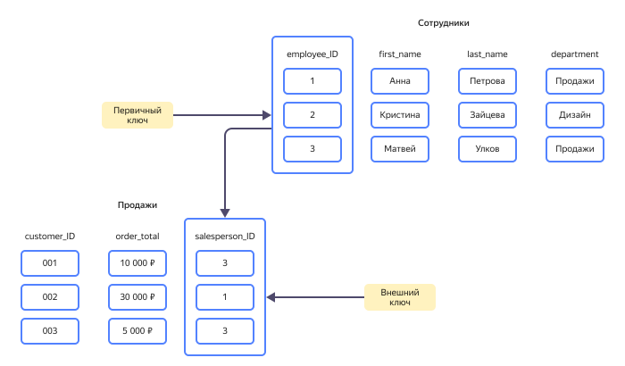
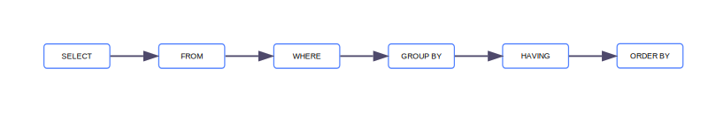
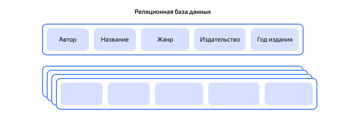
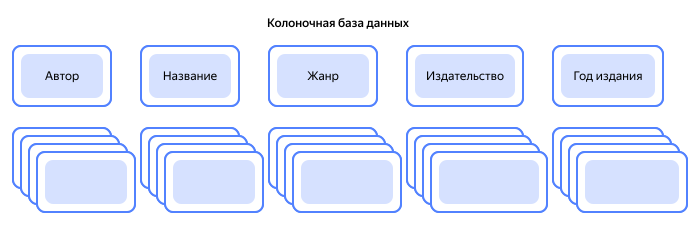
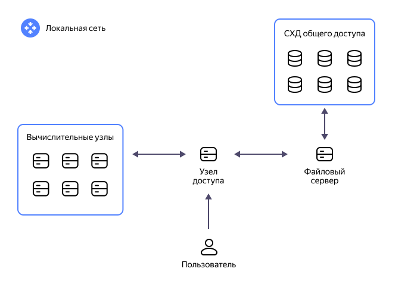
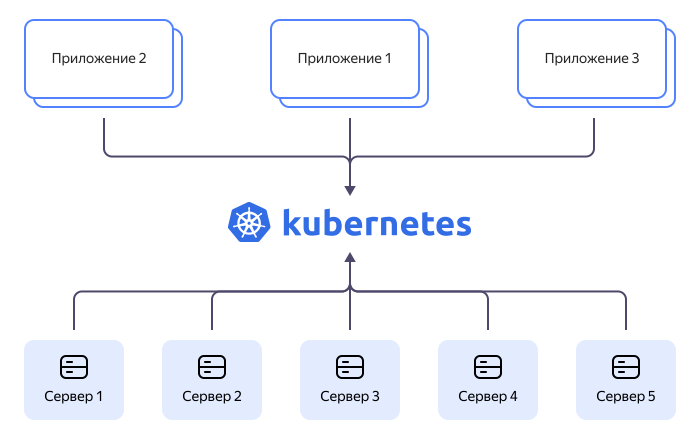
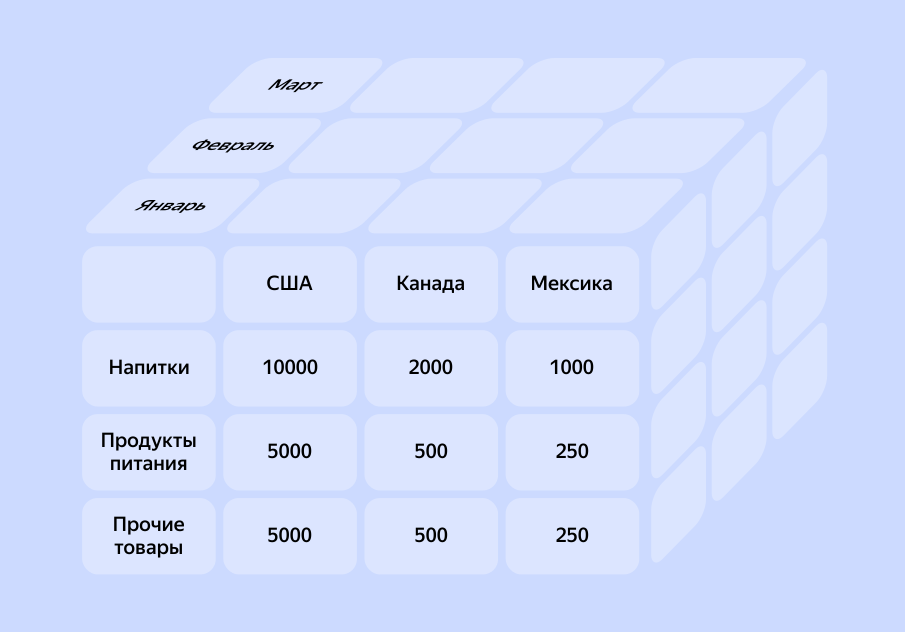

<link href="../styles.css" rel="stylesheet" />

## 02. Введение в большие данные

- [02. Введение в большие данные](#02-введение-в-большие-данные)
  - [Большие данные](#большие-данные)
    - [Данные и информация](#данные-и-информация)
    - [Что такое большие данные?](#что-такое-большие-данные)
    - [Особенности больших данных](#особенности-больших-данных)
  - [Работа с Big Data](#работа-с-big-data)
    - [Этапы работы (пайплайн)](#этапы-работы-пайплайн)
  - [Хранение и обработка больших данных](#хранение-и-обработка-больших-данных)
    - [Реляционные базы данных](#реляционные-базы-данных)
      - [Реляционная модель](#реляционная-модель)
      - [Структура реляционной базы данных](#структура-реляционной-базы-данных)
      - [Основные характеристики реляционных баз данных](#основные-характеристики-реляционных-баз-данных)
      - [Применение реляционных баз данных](#применение-реляционных-баз-данных)
    - [SQL](#sql)
      - [История развития](#история-развития)
      - [Типы данных](#типы-данных)
      - [Структура запросов](#структура-запросов)
      - [Операторы](#операторы)
      - [Объединение данных](#объединение-данных)
      - [Оптимизация запросов](#оптимизация-запросов)
      - [Индексы](#индексы)
    - [NoSQL](#nosql)
      - [История](#история)
      - [Характеристики NoSQL баз данных](#характеристики-nosql-баз-данных)
    - [Колоночные базы данных](#колоночные-базы-данных)
      - [Сравнение колоночных и реляционных баз данных](#сравнение-колоночных-и-реляционных-баз-данных)
        - [Особенности работы реляционных баз данных](#особенности-работы-реляционных-баз-данных)
        - [Особенности работы колоночных баз данных](#особенности-работы-колоночных-баз-данных)
      - [Преимущества колоночных баз данных](#преимущества-колоночных-баз-данных)
      - [Недостатки колоночных баз данных](#недостатки-колоночных-баз-данных)
      - [Сценарии применения](#сценарии-применения)
      - [Заключение](#заключение)
    - [NewSQL](#newsql)
      - [Классификации NewSQL систем](#классификации-newsql-систем)
      - [Реализация масштабируемости](#реализация-масштабируемости)
    - [Хранилище данных](#хранилище-данных)
      - [Решения на основе данных](#решения-на-основе-данных)
      - [Планирование ресурсов предприятия](#планирование-ресурсов-предприятия)
      - [Роль и функции КХД](#роль-и-функции-кхд)
      - [ETL и ELT](#etl-и-elt)
      - [Построение хранилищ данных](#построение-хранилищ-данных)
      - [Основныхе характеристики КХД](#основныхе-характеристики-кхд)
    - [Озеро данных](#озеро-данных)
      - [Применение Data Lake](#применение-data-lake)
      - [Примеры использования Data Lake](#примеры-использования-data-lake)
      - [Как устроено озеро данных](#как-устроено-озеро-данных)
      - [Отличия Data Lake от хранилища данных](#отличия-data-lake-от-хранилища-данных)
      - [Преимущества Data Lake](#преимущества-data-lake)
      - [Недостатки Data Lake](#недостатки-data-lake)
      - [Советы по использованию Data Lake](#советы-по-использованию-data-lake)
    - [Витрина данных](#витрина-данных)
      - [Отличия витрины от хранилища данных](#отличия-витрины-от-хранилища-данных)
      - [Преимущества Data Mart](#преимущества-data-mart)
      - [Типы Data Mart](#типы-data-mart)
      - [Применение витрин данных](#применение-витрин-данных)
      - [Реализация Data Mart](#реализация-data-mart)
    - [Кластер](#кластер)
      - [Из чего состоят кластеры](#из-чего-состоят-кластеры)
      - [Виды кластеров](#виды-кластеров)
        - [Кластеры высокой доступности](#кластеры-высокой-доступности)
        - [Кластеры с балансировкой нагрузки](#кластеры-с-балансировкой-нагрузки)
        - [Высокопроизводительные кластеры](#высокопроизводительные-кластеры)
      - [Преимущества кластеризации](#преимущества-кластеризации)
      - [Проблемы кластеризации](#проблемы-кластеризации)
      - [Облачные решения](#облачные-решения)
      - [Кластеры и контейнеризация приложений](#кластеры-и-контейнеризация-приложений)
    - [OLTP](#oltp)
      - [Как работает OLTP](#как-работает-oltp)
      - [Особенности OLTP](#особенности-oltp)
      - [Требования к OLTP](#требования-к-oltp)
      - [Где применяется OLTP](#где-применяется-oltp)
      - [Преимущества и недостатки OLTP](#преимущества-и-недостатки-oltp)
      - [Популярные системы и платформы](#популярные-системы-и-платформы)
    - [OLAP](#olap)
      - [Суть технологии](#суть-технологии)
      - [Как работают OLAP-системы](#как-работают-olap-системы)
        - [Хранение данных](#хранение-данных)
        - [Средства ETL](#средства-etl)
        - [Сервер](#сервер)
        - [Аналитические инструменты](#аналитические-инструменты)
      - [Требования к OLAP-системам](#требования-к-olap-системам)
      - [Чем отличаются технологии OLAP и OLTP](#чем-отличаются-технологии-olap-и-oltp)
      - [Преимущества и недостатки](#преимущества-и-недостатки)
      - [Популярные системы и платформы](#популярные-системы-и-платформы-1)
        - [СУБД Greenplum](#субд-greenplum)
  - [Аналитика больших данных](#аналитика-больших-данных)
    - [Цели и задачи аналитики данных](#цели-и-задачи-аналитики-данных)
    - [Типы аналитики больших данных](#типы-аналитики-больших-данных)
    - [Ценность аналитики данных для бизнеса](#ценность-аналитики-данных-для-бизнеса)
      - [Примеры применения аналитики в бизнесе](#примеры-применения-аналитики-в-бизнесе)
    - [Инструменты аналитики](#инструменты-аналитики)
    - [Основная терминология](#основная-терминология)
    - [Бизнес-аналитика](#бизнес-аналитика)
      - [Преимущества внедрения бизнес-аналитики BI](#преимущества-внедрения-бизнес-аналитики-bi)
      - [Какие задачи решают BI-системы для руководителей и аналитиков](#какие-задачи-решают-bi-системы-для-руководителей-и-аналитиков)
      - [Примеры задач, решаемых с помощью BI](#примеры-задач-решаемых-с-помощью-bi)
      - [BI и сквозная аналитика: в чем различие?](#bi-и-сквозная-аналитика-в-чем-различие)
      - [Ключевые этапы внедрения BI](#ключевые-этапы-внедрения-bi)
      - [Примеры используемых систем](#примеры-используемых-систем)
  - [Разработка систем Big Data](#разработка-систем-big-data)
    - [Специалисты для работы с Big Data](#специалисты-для-работы-с-big-data)
    - [Этапы разработки систем Big Data](#этапы-разработки-систем-big-data)
  - [Направления работы в области Big Data](#направления-работы-в-области-big-data)
  - [Применение Big Data](#применение-big-data)
  - [Преимущества и недостатки Big Data](#преимущества-и-недостатки-big-data)
  - [Наука о данных](#наука-о-данных)
    - [Направления и специальности](#направления-и-специальности)
    - [Уровни компетенций](#уровни-компетенций)
  - [Взаимосвязь машинного обучения и больших данных](#взаимосвязь-машинного-обучения-и-больших-данных)
    - [Облачные сети](#облачные-сети)
    - [Веб-скрейпинг](#веб-скрейпинг)
    - [Системы «умных» рекомендаций и прогнозирование в реальном времени](#системы-умных-рекомендаций-и-прогнозирование-в-реальном-времени)
    - [IoT, Интернет вещей](#iot-интернет-вещей)
    - [Системы кибербезопасности](#системы-кибербезопасности)
  - [Интернет вещей](#интернет-вещей)
    - [Архитектура IoT-систем](#архитектура-iot-систем)
    - [Как интернет вещей собирает малые данные](#как-интернет-вещей-собирает-малые-данные)
    - [Как работает интернет вещей с Big Data](#как-работает-интернет-вещей-с-big-data)
    - [Роль Big Data и ML в IoT](#роль-big-data-и-ml-в-iot)
  - [Представление данных для машинного обучения. Признаки объектов](#представление-данных-для-машинного-обучения-признаки-объектов)
      - [Типы признаков](#типы-признаков)
      - [Ограничения табличного представления объектов](#ограничения-табличного-представления-объектов)
  - [Заключение](#заключение-1)
      - [Выводы](#выводы)
  - [Практическая работа. Представление признаков в табличной форме](#практическая-работа-представление-признаков-в-табличной-форме)
    - [Задание](#задание)
  - [Глоссарий](#глоссарий)
  - [Источники информации](#источники-информации)

### Большие данные
В мире, где цифровизация стала основой нашего образа жизни, мы столкнулись с новым явлением, получившим название «большие данные». Но что стоит за этим термином, и каковы его реальные масштабы?

> Большие данные, или Big Data, – это не просто объемная информация. Это данные такого масштаба, скорости и разнообразия, что традиционные методы их обработки становятся неэффективными. Мы говорим о терабайтах и петабайтах данных, поступающих из самых разных источников: от социальных сетей до космических телескопов.


В 2025 году ежегодный объем генерируемых данных превысил 160 зеттабайт. Однако почти все генерируемые сегодня данные (98%) затем удаляются или перезаписываются. Подобное отношение к генерируемым данным объясняется просто: у компаний пока еще не хватает инструментов для работы с такими колоссальными объемами. Но ведь эти данные — буквально золотая жила для бизнеса, поскольку оттуда можно выуживать ценнейшую информацию. И терять их для крупных компаний, значит, недополучать значительную долю прибыли.[^692978]


*График ежегодного объема генерируемых данных*

Однако, объем – это лишь верхушка айсберга. Большие данные представляют собой не только квантовое увеличение информации, но и качественное изменение. Они включают в себя структурированную, полуструктурированную и неструктурированную информацию, требующую специализированных подходов к хранению, обработке и анализу.

Работа с большими данными выдвигает перед IT-специалистами целый ряд вызовов. С одной стороны, это вопросы хранения и доступа к данным. С другой – необходимость преобразования этих массивов информации в понятные и полезные знания, способные повлиять на принятие решений в бизнесе, науке и других сферах.

Далее мы подробно рассмотрим ключевые понятия и компоненты больших данных, а также разберемся, как машинное обучение помогает обрабатывать большие объемы данных и извлекать ключевую информацию, скрытую в них. И, разумеется, приведем примеры совместного использования Big Data и Machine Learning (ML), а также расскажем об интересных проектах для тех, кто хотел бы начать работать с большими данными и ML.

Однако для начала стоит разобраться, чем отличаются данные от информации.

#### Данные и информация
<dfn title="данные">Данные</dfn> — это необработанные, сырые факты и цифры, не имеющие самостоятельного смысла, в то время как <dfn title="информация">информация</dfn> — это обработанные, структурированные и контекстуализированные данные, которые приобретают значение и цель для пользователя. Информация помогает понять закономерности, принимает форму отчета или сводки, тогда как данные — это отдельные фрагменты пазла, которые становятся цельной картиной только после их сборки.

**Ключевые отличия**
- **Структура**: данные — это неорганизованная совокупность фактов (числа, текст, изображения), а информация — это данные, которые были упорядочены и связаны в логическую последовательность. 
- **Смысл и контекст**: данные не несут конкретного смысла или назначения сами по себе, в отличие от информации, которая имеет значение и цель, добавляемую при её обработке. 
- **Цель использования**: Данные служат основой для анализа и принятия решений, а информация помогает осмысливать эти данные и формировать суждения. 
- **Превращение**: данные превращаются в информацию в результате обработки, интерпретации, анализа и добавления контекста. 

**Пример**
- **Данные**: Список цифр в электронной таблице, например: "150 (Январь), 300 (Февраль)".
- **Информация**: Отчет, который анализирует эти цифры и показывает, что "В начале года (январь-февраль) наблюдался рост расходов на транспорт, что требует дальнейшего изучения". 

Отличие информации от данных состоит в том, что:
1) **Данные** — это фиксированные сведения о событиях и явлениях, которые хранятся на определенных носителях, а **информация** появляется в результате обработки данных при решении конкретных задач.

    Например, в базах данных хранятся различные данные, а по определенному запросу система управления базой данных выдает требуемую информацию.

2) Данные — это носители информации, а не сама информация.

3) Данные превращаются в информацию только тогда, когда ими заинтересуется человек. Человек извлекает информацию из данных, оценивает, анализирует ее и по результатам анализа принимает то или иное решение.

    Данные превращаются в информацию несколькими путями:

   - контекстуализация: мы знаем, для чего эти данные нужны;
   - категоризация: мы разбиваем данные на типы и компоненты;
   - подсчет: мы обрабатываем данные математически;
   - коррекция: мы исправляем ошибки и ликвидируем пропуски;
   - сжатие: мы сжимаем, концентрируем, агрегируем данные.

   Таким образом, если существует возможность использовать данные для уменьшения неопределенности знаний о каком-либо предмете, то данные превращаются в информацию. Поэтому можно утверждать, что информацией являются используемые данные.

4) Информацию можно измерять. Мера измерения содержательности информации связана с изменением степени неосведомленности получателя и основана на методах теории информации.[^38087337]

#### Что такое большие данные?
<dfn title="big data">Big Data</dfn> — это крупные массивы разнообразной информации и стек специальных технологий для работы с ней. Термин применяется к таким объемам данных, с которыми пользовательский компьютер и офисные программы не справятся. С помощью анализа больших данных бизнес может получить возможность принимать решения по развитию продукта и завоевывать конкурентное преимущество.

Термин Big Data появился еще в прошлом веке, но начал набирать популярность, когда появились первые крупные интернет-сервисы. Компании столкнулись с тем, что пользователи загружают на сайты колоссальные объемы неструктурированного контента.

Это заставило разработчиков придумывать новые типы хранилищ данных, поскольку стандартных уже не хватало. Первой платформой, которая взяла на себя работу с такими объемами данных, стала [Hadoop](https://ru.wikipedia.org/wiki/Hadoop). К настоящему времени она обладает мощным стеком инструментов.[^bigdata]

#### Особенности больших данных
<dfn title="большие данные">Большие данные</dfn> (*big data*) — данные большого объема, высокой скорости накопления или изменения и/или разновариантные информационные активы, которые требуют экономически эффективных, инновационных формы обработки данных, которые позволяют получить расширенное  понимание информации, способствующее принятию решений и автоматизации процессов.[^big-data]

Таким образом, большие данные — это наборы данных настолько объёмные или сложные, что традиционные методы обработки не справляются с ними эффективно. Они характеризуются "3V":

1. **Volume** (*объём*) — очень большой объём информации (терабайты и петабайты). Как правило, информации должно поступать более 150 Гб в сутки. Для каждой организации или компании существует предел объема данных (*volume*) которые компания или организация способна обрабатывать одновременно для целей аналитики, как правило этот объем ограничен объемами оперативной памяти серверов корпоративных приложений и баз данных и необходимостью партиционирования (*partitioning*)  хранимых данных.

2. **Velocity** (*скорость*) — данные поступают очень быстро (поток данных в реальном времени). Для работы с массивами информации в режиме реального времени требуются повышенные вычислительные мощности. Для каждой организации или компании существуют физические ограничения на количество транзакций/объем данных (*velocity*), которая корпоративныя система может обработать или передать за единицу времени вследствии ограничений scale in архитектуры.

3. **Variety** (*разнообразие*) — данные бывают разных типов и форматов. Поступающая информация имеет разные форматы или степень структурированности. Например, контент социальных сетей может сильно различаться даже в пределах одной страницы. Традиционные корпоративные системы (реляционные) могут использовать эффективно только структурированные источники поступления информации, не принимая во внимание разновариантные и не структурированые источники данных (*variety*)  или имея серьезные органичения по работе с такими источниками.

Иногда добавляют еще три дополнительных признака больших данных, которые точно помогают определить, что речь идет именно о Big Data:

4. **Veracity** (*достоверность*) — источникам данных можно доверять, а результат их обработки обладает достоверностью, достаточной для принятия решений. Большое количество данных и разнообразие источников требует качества и аккуратности при обработке и анализе данных. Твиты, хэштэги, аббревиатуры, сокращения, типо ошибки и конечно просто надежность и точность контента ставят под сомнение достоверность (*veracity*)  самих данных так и принятых решений на основе этих данных. Количество не переходит в качество.

5. **Variability** (*вариативность*) — поток данных изменчив, на него может влиять даже время суток или погода. Например, в час пик приходит больше данных от таксистов. Большие данные, зависимости между ними  и условия окружения непрерывно меняются  (*variability*).

6. **Value** (*ценность*) — данные могут иметь разное значение для компании. Например, сделки с крупными покупателями имеют большее значение, чем с мелкими. Cбор и анализ больших данных должен предоставлять определенную ценность (*value*) для бизнеса. Ценность данных неразрывна связанна со стоимость владения и  ценностью для бизнеса.[^big-data]


*Примеры типов данных*

Большие данные |	Обычные данные
-- | --
Записи всех звонков сотрудников крупного колл-центра |	Бухгалтерские отчеты компании в Excel
Поисковые запросы, переходы по ссылкам, движения и нажатия мыши всех пользователей поисковой системы |	ФИО и возраст всех пользователей отдельного сервиса
Сведения о перемещениях таксистов, трафик и спрос на поездки |	Расписание маршрутов всего общественного транспорта области
Информация о покупках клиентов банка и снятии ими наличных в терминалах и отделениях |	Список клиентов с просроченными задолженностями

Еще одна особенность больших данных заключается в их распределенной структуре — для сбора и анализа информации одновременно используется множество инструментов. Получается что-то наподобие воронок, которые пропускают информацию из разных источников, попутно обрабатывая ее. В умелых руках это дает ряд преимуществ:

- **Расширяемость** — платформы для работы с Big Data можно горизонтально масштабировать до тех пор, пока хватает вычислительных мощностей.
- **Отказоустойчивость** — сбой в одном потоке не нарушает работу других.
- **Локализация** — информация обрабатывается на тех же серверах, где она находится, что минимизирует затраты на транспортировку.[^bigdata]

Источники больших данных:

- социальные сети;
- сенсоры и IoT-устройства;
- транзакционные системы (банки, интернет-магазины);
- логи серверов и системных устройств.

### Работа с Big Data
*[DAS]: Direct-attached storage
*[NAS]: Network Attached Storage
*[SAN]: Storage Area Network
*[IE]: Information Extraction

До начала создания базы данных нужно определить, какие технологии планируется использовать для сбора, хранения, обработки и анализа информации. Чтобы лучше понимать эти процессы, рассмотрим этапы работы (**пайплайн**) с Big Data.

#### Этапы работы (пайплайн)

1. <dfn title="сбор данных">Сбор данных</dfn> (*data collection*) — процессы получения информации из различных источников для последующего анализа и использования.

    Все начинается с интеграции технологий сбора информации, определения ее источников и необходимой обработки. Это могут быть действия пользователей сайта, отчеты о продажах, статистические, медицинские и любые другие данные, которые ценны для компании. К процессу также подключаются специалисты по Data Cleaning, которые настраивают фильтры для будущего анализа.

    **Основные этапы**: сбор данных охватывает извлечение сырых данных из источников, таких как датчики, базы данных, веб-формы или документы. Ключевые шаги: идентификация источников, захват данных (сканирование, импорт, опросы) и начальная проверка целостности. Это обеспечивает готовность данных для обработки в ML или аналитике.

    **Методы сбора**
      - **Автоматизированный**: через API, IoT-устройства, логи систем или веб-скрейпинг.

      - **Ручной**: опросы, интервью, анкетирование или ввод из документов.

      - **Гибридный**: комбинация, например, сканирование бумажных форм с OCR для цифровизации.

    Эти компоненты формируют фундамент пайплайна данных в Big Data и машинном обучении.

2. <dfn title="хранение данных">Хранение данных</dfn> (*data retention*, *data storage*) — процессы сохранения, организации и обеспечения доступа к информации на цифровых носителях.

    **Основные компоненты**: хранение охватывает выбор носителей (диски, облака, СХД), структуру данных (реляционные БД, NoSQL, озера данных) и управление жизненным циклом: от загрузки до архивирования. Ключевые задачи — обеспечение целостности, масштабируемости и безопасности через резервное копирование и репликацию. На данном этапе используются такие инструменты, как NoSQL базы данных (MongoDB, Cassandra), распределённые файловые системы (например, HDFS).

    **Типы систем хранения**
    - **Блоковое**: данные как блоки (DAS, SAN) для высокопроизводительных приложений.

    - **Файловое**: иерархическая структура (NAS) для общего доступа.

    - **Объектное**: для неструктурированных данных в Big Data (S3, MinIO).

    <details>
    <summary>Про DAS, NAS, SAN</summary>

    <dfn title="NAS">NAS</dfn> (англ. *Network Attached Storage*, сетевое хранилище) — сервер для хранения данных на файловом уровне. По сути представляет собой компьютер с некоторым дисковым массивом, подключённый к сети (обычно локальной) и поддерживающий работу по принятым в ней протоколам. Несколько таких компьютеров могут быть объединены в одну систему.[^NAS]

    <dfn title="SAN">SAN</dfn> (англ. *Storage Area Network*, сеть хранения данных) — архитектурное решение для подключения внешних устройств хранения данных, таких как дисковые массивы, ленточные библиотеки, оптические приводы к серверам таким образом, чтобы операционная система распознала подключённые ресурсы как локальные. SAN характеризуются предоставлением так называемых сетевых блочных устройств (обычно посредством протоколов Fibre Channel, iSCSI или AoE), в то время как сетевые хранилища данных (англ. Network Attached Storage, NAS) нацелены на предоставление доступа к хранящимся на их файловой системе данным при помощи сетевой файловой системы (такой как NFS, SMB/CIFS, или Apple Filing Protocol). При этом категоричное разделение SAN и NAS является искусственным: с появлением iSCSI началось взаимное проникновение технологий с целью повышения гибкости и удобства их применения.[^SAN]

    <dfn title="DAS">DAS</dfn> (англ. *Direct-attached storage* — система хранения данных с прямым подключением, дисковое хранилище) — запоминающее устройство, непосредственно подключённое к серверу или рабочей станции, без помощи сети хранения данных. Это ретроним, используемый в основном для отличия несетевых устройств хранения от SAN и NAS. Де-факто DAS — это быстрое (если интерфейс быстрый) локальное хранилище, доступное только тому устройству, к которому оно подключено. Жёсткий диск внутри ПК тоже своего рода DAS. DAS часто называют «островами информации»[^DAS].

    </details>

    Эти элементы формируют базу для последующего анализа и ML.

    Для больших объемов информации недостаточно будет даже нескольких компьютеров, поэтому компании прибегают к услугам облачных провайдеров и задействуют распределенные вычислительные мощности. Примеры технологий, которые используются для хранения:

   - <dfn title="data warehouse">Data Warehouse</dfn> (*хранилище данных*) — единое корпоративное хранилище с обработанной и структурированной информацией. Хранилище упрощает анализ полученных данных, но требует структурированности.
   - <dfn title="data vault">Data Vault</dfn> (*свод данных*) — одна из моделей хранилища Data Warehouse с временными отметками размещения данных, которые позволяют проследить изменение хранимой информации во времени.
   - <dfn title="data lake">Data Lake</dfn> (*озеро данных*) — данные в хранилище поступают непрерывно в неструктурированном или, наоборот, структурированном или слабоструктурированном виде. Используется для сбора данных из разных источников в режиме реального времени.
   - <dfn title="data mart">Data Mart</dfn> (*витрина данных*) — хранилище данных, предназначенных для повседневного использования. Поступающую информацию необходимо тщательно обрабатывать, но после этого к ней проще регулярно обращаться.

3. <dfn title="обработка данных">Обработка данных</dfn> (*data processing*) — преобразование сырых данных в пригодный для анализа формат.

    **Основные этапы**
    - <dfn title="очистка данных">Очистка данных</dfn> (*data cleaning*) — процесс выявления и устранения ошибок, несоответствий и "грязи" в датасетах для повышения их качества. Очистка обеспечивает точность ML-моделей, снижая шум и предвзятость. Включает следующие методы: удаление дублей, пропусков, выбросов и исправление ошибок.

    - <dfn title="трансформация данных">Трансформация данных</dfn> (*data transformation*) — это процесс преобразования сырых данных в удобный для анализа или хранения формат. Включает следующие методы: нормализация, кодирование категориальных переменных, масштабирование признаков.

    - <dfn title="извлечение информации">Извлечение информации</dfn> (*information extraction*, IE) — выделение структурированных данных из неструктурированного или слабоструктурированного текста/данных, распознавание сущностей, отношений и событий. Это прямой инструмент для подготовки данных к аналитике. Применимо в контексте big data для преобразования большого объема текстовой информации в пригодную для анализа форму.

    - <dfn title="интеграция данных">Интеграция даных</dfn> (*data integration*) — объединение данных из разных источников в единый набор данных (*dataset*).

    - <dfn title="агрегация данных">Агрегация данных</dfn> (*data aggregation*) — процесс обобщения информации в сводную форму для анализа. Агрегация в пайплайне следует после интеграции: сначала сливаются источники, затем данные суммируются. Уменьшает объём данных, ускоряя обработку без потери ключевых инсайтов. Агрегация снижает нагрузку на хранение, интеграция обеспечивает полноту. Результат — компактный датасет с метриками, удобный для отчётов и визуализации.

    - <dfn title="обогащение данных">Обогащение данных</dfn> (*data enrichment*) — добавления дополнительной ценной информации к существующим наборам (например, дополняет записи новыми атрибутами из внешних источников). Отличается от агрегации расширением (добавление), а не сжатием данных.

    Обработка обеспечивает качество данных для ML-моделей: снижает шум, повышает точность прогнозов и ускоряет вычисления.

    Для обработки крупных объемов информации используется технология [MapReduce](https://hadoop.apache.org/docs/current/hadoop-mapreduce-client/hadoop-mapreduce-client-core/MapReduceTutorial.html). Массивы распределяется на разных узлах, которые могут параллельно их обрабатывать, даже если на одном узле случилась ошибка. На MapReduce, например, работают кластеры Apache Spark™, Apache Hadoop®.

4. <dfn title="анализ данных">Анализ данных</dfn> — это процесс исследования, фильтрации и моделирования информации для извлечения полезных знаний и поддержки решений.

    Заключительным этапом работы является анализ — получение самого ценного из всего хранилища данных. С помощью СУБД, нейросетей и других инструментов массивы информации преобразуются в таблицы, диаграммы, графики и другое (**визуализация данных**). Анализ начинается с **описательного** (что произошло?), переходит к **диагностическому** (почему?), **предиктивному** (что будет?) и **пресскриптивному** (что делать?). Включает статистику, визуализацию и ML для выявления паттернов (интеллектуальную аналитику). На данном этапе используются такие инструменты, как MapReduce, Apache Hadoop, Apache Spark.

    **Визуализация** используется на финальных шагах анализа для представления результатов: графики, дашборды, тепловые карты помогают выявить паттерны и тренды. **Вывод инсайтов** следует сразу после — интерпретация визуализаций для бизнес-решений или гипотез. <dfn title="инсайт">Инсайт</dfn> (*insight* — с англ. "прозрение", "озарение") в анализе данных — это глубокое, неожиданное понимание или ценное открытие, полученное из данных, которое приводит к практическим рекомендациям. Инсайт отличается от обычных фактов тем, что объясняет "почему" и "как использовать": например, не просто "продажи упали на 20%", а "отток вырос из-за задержек доставки в регионы X и Y". Он рождается на стыке данных, гипотез и контекста. Вывод инсайтов завершает анализ данных: после визуализации и моделирования аналитик интерпретирует результаты для бизнеса.

    **Примеры назначения анализа**

    - <dfn title="сравнительная аналитика">Сравнительная аналитика</dfn> (*competitive analytics*) — изучение поведения потребителей и их вовлеченность в режиме реального времени, чтобы сравнить продукт компании с продуктами конкурентов.

    - <dfn title="аналитика настроений">Аналитика настроений</dfn> (*sentiment analysis*) — изучение отзывов клиентов и обсуждений продукта в соцсетях, чтобы выявить слабые стороны продукта и уровень удовлетворенности потребителей.

    - <dfn title="маркетинговая аналитика">Маркетинговая аналитика</dfn> (*marketing analytics*) — изучение данных о клиентах, чтобы улучшить маркетинговые компании и разработать бизнес-инициативы.

    - <dfn title="интеллектуальный анализ данных">Интеллектуальный анализ данных</dfn> (*data mining*) — подмножество анализа для поиска скрытых зависимостей, процесс «просеивания» больших массивов данных с целью извлечь из них ценную информацию для конкретного применения. Он является неотъемлемой частью науки о данных и бизнес-аналитики и направлен в первую очередь на поиск закономерностей.

    - <dfn title="информационный поиск">Информационный поиск</dfn> (*information retrieval*) в контексте big data обычно относится к быстрому извлечению документов или ответов на запросы из больших корпусов данных, что чаще ассоциируется с системами поиска и ранжирования, но также тесно связано с этапами обработки и подготовки данных, чтобы качественно отвечать на запросы.

_Пример_: Анализ кликов пользователей на сайте для персонализации рекламы в реальном времени.

*Пример MapReduce (подсчёт слов) (псевдокод)*:
```py
Map(key, value):
  for word in value:
    Emit(word, 1)

Reduce(key, values):
  sum = 0
  for v in values:
    sum += v
  Emit(key, sum)
```

### Хранение и обработка больших данных
*[DWH]: Data Wharehouse
*[CRM]: Customer Relationship Management
*[ERP]: Enterprise Resource Planning

Современные организации генерируют и собирают данные в огромных объёмах и разнообразии форм. Эффективное хранение таких данных требует подходов, которые обеспечивают не только надёжность и масштабируемость, но и удобство доступа для анализа, прогнозирования и принятия решений. Для решения задач хранения и обработки используется большое количество разнообразных архитектурных моделей и хранилищ данных: от традиционных реляционных баз данных и локальных систем до специализированных решений для больших данных, включая Data Lake, хранилища данных (Data Warehouse) и промежуточные структуры Data Mart. Особое внимание уделяется облачным хранилищам и гибридным схемам, которые позволяют сочетать преимущества локальных и удалённых инфраструктур.

**Основные концепции**

- <dfn title="data lake">Data Lake</dfn> (озеро данных): универсальный репозиторий для хранения данных в формате «как есть» — в структурированном, полуструктурированном и неструктурированном виде. Такой подход упрощает сбор и первичную агрегацию данных из разных источников, сохраняя их неизменными до момента необходимого анализа.

- <dfn title="data warehouse">Data Warehouse</dfn> (DWH, хранилище данных): централизованное хранилище структурированных данных, оптимизированное под единый путь анализа, бизнес-отчётности и сложные запросы. Часто применяется после этапов очистки и трансформации данных.

- <dfn title="data mart">Data Mart</dfn> (витрина данных): локальное или специализированное подручное хранилище данных, ориентированное на определённый бизнес-подразделение или процесс, с более быстрым доступом и меньшим объёмом данных по сравнению с DWH.

- <dfn title="реляционная база данных">Реляционные базы данных</dfn> (*relational databases*): классические системные решения для хранения структурированной информации с поддержкой транзакционности, целостности данных и SQL-запросов.

- **Облачные хранилища и гибридные подходы**: аренда ресурсов и сервисов в облаке, которые позволяют масштабироваться под нагрузку, интегрировать локальные и облачные источники данных, снижая капитальные затраты и усилия по администрированию.

- **Метаданные и управление качеством данных**: ключевые компоненты любой архитектуры больших данных, обеспечивающие поиск, контекстуализацию и доверие к данным через каталоги, линейки данных и политику доступа.

**Зачем нужна такая гибкость**

- **Масштабируемость**: рост объёмов данных требует инфраструктуры, которая может динамически наращивать мощность и хранить данные любого типа.

- **Разнообразие источников**: современные предприятия собирают данные из CRM, ERP, IoT-устройств, лог-файлов, социальных сетей и внешних сервисов; единое решение должно поддерживать разные форматы.

- **Разделение задач**: разные потребители — аналитики, дата-сайентисты, бизнес-итоги — нуждаются в разных режимах доступа и скорости отклика.

- **Эффективность анализа**: правильная комбинация хранилищ позволяет ускорить бизнес-аналитику, уменьшить издержки на хранение и повысить скорость внедрения инсайтов.

*Реализация хранения Big Data с помощью популярных сервисов*

Назначение |	Сервис (инструмент)
-- | --
Обработка транзакций |	Apache HBase, Amazon DynamoDB, Google Cloud Spanner, Microsoft SQL Server (In-Memory/OLTP), PostgreSQL with WAL-based replication
Запросы и отчеты |	Apache Hive, Apache Impala, Amazon Athena, Google BigQuery, Amazon Redshift
New SQL |	Apache Cassandra, Google Cloud Spanner, CockroachDB, VoltDB, TiDB
Документоориентированная СУБД |	MongoDB, Couchbase, Amazon DocumentDB, Firebase Firestore, RavenDB
Резидентная СУБД |	Redis, SQLite, Derby (Embedded DB), H2, LevelDB
БД «ключ — значение» |	Redis, DynamoDB, Riak, RocksDB, Memcached
БД временных рядов |	InfluxDB, TimescaleDB, OpenTSDB, Prometheus, Druid
Потоковая обработка |	Apache Kafka, Apache Flink, Spark Streaming, Apache Storm, Google Cloud Dataflow
Полнотекстовый поиск |	Apache Solr, Elasticsearch, Algolia, OpenSearch, Sphinx
Очередь сообщений	| Apache Kafka, RabbitMQ, AWS SQS, Google Cloud Pub/Sub, NATS

#### Реляционные базы данных

В информационном пространстве под данными подразумевают факты и идеи, зафиксированные в формализованном виде — таком, который позволяет хранить, передавать и обрабатывать их. Совокупность данных формирует <dfn title="база данных">базу данных</dfn> (*database*) — массив, в котором собраны и организованы по некоторому принципу данные из какой-либо области знаний. Принцип построения базы данных определяется ее моделью. Наиболее известны иерархическая, сетевая, объектная и реляционная модели. Последняя — самая популярная, и именно о ней пойдет речь далее.

##### Реляционная модель
Реляционную модель предложил британский математик [Эдгар Кодд](https://ru.wikipedia.org/wiki/%D0%9A%D0%BE%D0%B4%D0%B4,_%D0%AD%D0%B4%D0%B3%D0%B0%D1%80) на рубеже шестидесятых и семидесятых годов XX в. Она основывается на теории множеств и представляет все данные в привычной, строгой и логичной форме обыкновенных таблиц. Такие таблицы в математике именуют отношением (англ. relation — отсюда и название модели). Кодд сформулировал единые для любой реляционной базы данных законы и заложил основы построения запросов для работы с данными.

<dfn title="реляционная база данных">Реляционная база данных</dfn> — это составленная по реляционной модели база данных, в которой данные, занесенные в таблицы, имеют изначально заданные отношения. Сами таблицы в такой базе данных также соотносятся друг с другом строго определенным образом. Реляционные базы данных используют целый комплекс инструментов, которые обеспечивают целостность данных, т. е. их точность, полноту и единообразие.

Для взаимодействия с любой реляционной базой данных используется SQL (*Structured Query Language*) — язык структурированных запросов. Это основа интерфейса систем управления базами данных. Он стандартизирован с 1986 года и поддерживается всеми известными ядрами реляционных баз данных. SQL позволяет работать со строками таблиц (например, удалять, добавлять или изменять их), а также извлекать нужные блоки информации и производить транзакции.

<dfn title="транзакция">Транзакция</dfn> (*transaction*) — это комплекс последовательных операций с применением операторов SQL, имеющих определенную цель. Все транзакции должны отвечать четырем требованиям ACID:

- <dfn title="атомарность">Атомарность</dfn> (англ. *atomicity*) — транзакция является неделимым блоком и выполняется или полностью, или никак.
- <dfn title="согласованность">Согласованность</dfn> (англ. *consistency*) — завершенная транзакция сохраняет согласованность базы данных.
- <dfn title="изолированность">Изолированность</dfn> (англ. *isolation*) — параллельные транзакции не могут влиять друг на друга.
- <dfn title="устойчивость">Устойчивость</dfn> (англ. *durability*) — никакой сбой в системе не может влиять на результат завершенной транзакции.

##### Структура реляционной базы данных
*[FK]: Foreign Key
*[PK]: Primary Key

Данные в реляционной базе данных формируют отношения — двумерные таблицы с информацией о сущностях, т. е. объектах. Строка такой таблицы называется кортежем. Кортежи содержат множество атрибутов одной сущности, категории которых задаются в столбцах.

Например, возьмем базу данных отдела кадров на предприятии. В ее строки заносятся сведения о сотрудниках — у них могут быть следующие атрибуты:

- дата рождения;
- фамилия;
- имя;
- отчество;
- должность;
- структурное подразделение;
- номер пропуска.

Для каждого атрибута выделен строго определенный столбец, а каждый столбец может содержать только один тип (или категорию) атрибутов.

Каждая из строк определяет только одну-единственную сущность — сотрудника — и содержит уникальный набор его атрибутов.

Таким образом, строки в базе данных не повторяются. Чтобы гарантировать уникальность каждой строки, для нее задается <dfn title="первичный ключ">первичный ключ</dfn> (*primary key*), своего рода идентификатор, который также используется, когда на кортеж нужно сослаться из другой таблицы, при этом не приводя полного набора атрибутов сущности. Тогда первичный ключ становится <dfn title="внешний ключ">внешним ключом</dfn> (*foreign key*). Именно ключи обеспечивают целостность и согласованность данных и отношений.

Допустим, кроме таблицы работников из отдела кадров, у нас есть таблица заказчиков из отдела маркетинга. У каждого заказчика тоже есть свои атрибуты, в том числе идентификатор — первичный ключ. Если нам нужно учесть объем продукции, отгруженный каждым из работников каждому заказчику, мы можем связать данные из двух этих таблиц в третьей — используя их первичные ключи, которые в новой таблице будут выступать в качестве внешних ключей.



Первичный ключ позволяет обращаться к кортежам базы данных независимо от того, где физически они расположены, на каком месте, в какой таблице и в каком порядке. Ключи позволяют сортировать, фильтровать, извлекать, обрабатывать и возвращать данные в таблицы без лишних операций: если та или иная сущность встречается в базе данных множество раз, достаточно изменить ее атрибуты в одной таблице (по первичному ключу) — и они обновятся везде, где встречается этот ключ. Кроме того, ключи не позволяют ссылаться на несуществующие данные — а это гарантирует целостность всей базы данных.

##### Основные характеристики реляционных баз данных

Признак |	Пояснение
-- | --
**Множество сущностей** |	Объекты со строго определенным набором атрибутов, с помощью которых они связываются между собой, формируют понятную и простую для восприятия структуру.
**Табличный формат** |	Такой формат гарантирует высокий уровень структурированности с жесткими логическими взаимосвязями, минимальный уровень избыточности данных, их согласованность и целостность.
**Язык SQL** |	SQL является стандартизированным средством общения пользователя с базой данных. Он очень формальный, что делает его удобным и простым в изучении. SQL гарантирует точный результат даже при сложном многоуровневом запросе.
**Масштабирование по вертикали** |	Реляционные базы данных хорошо масштабируются по вертикали. Но это значит, что по мере накопления информации в какой-то момент ее обработка потребует больших аппаратных ресурсов и финансовых затрат.
**Масштабирование по горизонтали** |	Горизонтальное масштабирование, подразумевающее распределение таблиц данных по множеству серверов, является слабой стороной реляционных баз данных. С разрастанием системы появляются задержки в обновлении данных. В какие-то моменты нарушается принцип целостности данных, что может негативно отразиться на пользовательском опыте.
**Наличие требований к параметрам данных** |	Реляционные базы данных умеют работать только со структурированными данными. Но современный цифровой мир полон неструктурированных данных (например, фото и видео), к которым нельзя применять принципы реляционной модели.

##### Применение реляционных баз данных
Реляционные базы данных — самые распространенные базы данных в мире. Компании самого разного размера и профиля используют их для обслуживания своих информационных систем. Такой подход удобен, чтобы:

- отслеживать торговые транзакции в интернете;
- обрабатывать критически важные данные банковских клиентов;
- хранить и обслуживать картотеки на промышленных предприятиях;
- вести учет в медицине и образовании.

То есть реляционные базы данных применимы везде, где важнейшим приоритетом является целостность и безопасность данных и где встречаются высокоструктурированные данные, соответствующие строгой, предсказуемой и предопределенной схеме.[^relational-databases]

#### SQL
*[SQL]: Structured Query Language
*[DDL]: Data Definition Language
*[DML]: Data Manipulation Language
*[DCL]: Data Control Language

<dfn title="sql">SQL</dfn> (*Structured Query Language*) — стандартизированный язык работы с реляционными базами данных. С его помощью можно искать информацию, организовывать, модифицировать, поддерживать ее надежность посредством транзакций и многое другое. Благодаря гибкости SQL находит применение как в огромных корпоративных системах, так и в небольших интернет-магазинах.

Основные компоненты:

- <dfn title="DDL">DDL</dfn> (*Data Definition Language* — **язык определения данных**) — определяет структуру БД: создает, изменяет или удаляет ее компоненты.
- <dfn title="DML">DML</dfn> (*Data Manipulation Language* — **язык манипуляции данными**) — работает с данными в таблицах: добавляет, изменяет, удаляет и извлекает их.
- <dfn title="DCL">DCL</dfn> (*Data Control Language* — **язык управления данными**) — обеспечивает безопасность: предоставляет или отзывает права на работу с БД.[^sql]

##### История развития
*[NIST]: National Institute of Standards and Technology
*[CSF]: Cybersecurity Framework

SQL был изобретен в начале 1970-х годов, и до 1996 года его стандартизация обеспечивалась силами Национального института стандартов и технологий (NIST). Далее производители начали расширять функциональность SQL каждый под себя, и появились разные, часто несовместимые между собой диалекты.

В стандарте SQL-92 определяли четыре уровня соответствия реализации:

- Базовый (*entry*);
- Переходный (*transitional*);
- Промежуточный (*intermediate*);
- Полный (*full*).

С введением стандарта SQL:1999 он приобрел модульную структуру. Остался только один уровень совместимости — Core, что означало поддержку основной части стандарта.

Во второй половине 2000-х годов зародилось движение NoSQL. <dfn title="NoSQL">NoSQL</dfn> — тип СУБД, которые не используют традиционную схему формата данных. Такие системы позволяют обрабатывать и хранить большие объемы полуструктурированных и неструктурированных данных. Оно было вызвано не столько отказом от языка SQL, сколько отрицанием реляционной модели и принципов строгой согласованности. Например, так работают базы данных MongoDB, Redis, Cassandra, Firestore.

В 2010-е годы ряд СУБД отнес себя к категории NewSQL, в которой при сохранении свойств масштабируемости NoSQL-систем была реализована в том числе поддержка SQL. Эта поддержка распространилась не только на СУБД, но и на экосистемы [Hadoop](https://ru.wikipedia.org/wiki/Hadoop), а также на связующее программное обеспечение.

##### Типы данных
SQL предлагает более 30 типов данных и возможность добавления пользовательских. Выбор неправильного типа может замедлить БД в два раза, а также увеличить ее размер.

*Основные типы*:

Категория |	Тип |	Примеры
-- | -- | --
Числовые |	`INT` — целые числа<br>`DECIMAL` — числа с фиксированной точностью	| Возраст, количество<br>Цена, вес товара
Строковые |	`CHAR` — строка с фиксированной длиной<br>`VARCHAR` — строка с изменяемой длиной |	Имя, фамилия<br>Адрес, описание
Дата и время |	`DATE` — даты в формате «год-месяц-день»<br>`DATETIME` или `TIMESTAMP` — конкретное время с датой	2024-03-15 | 2024-03-15<br>14:30:15
Логические |	`BOOLEAN` — значения истинности (`TRUE` или `FALSE`) |	Флаг «активен/неактивен»
Двоичные |	`BLOB` — бинарные данные |	Изображения или файлы

##### Структура запросов
Эффективность выполнения запросов зависит от правильности их структуры. Ее нарушение приводит к синтаксическим ошибкам. Базовый запрос состоит из нескольких ключевых компонентов:



- команда (например, `SELECT`, `INSERT`) — действие с данными;
- указание таблицы (`FROM`) — источник данных;
- условия (`WHERE`) — фильтр выборки данных;
- дополнительные параметры (`ORDER BY`) — ограничение или упорядочивание результата.

В большинстве случаев рекомендуется писать команды строчными буквами и избегать лишних пробелов или переносов, чтобы код было легче читать. Также важно правильно использовать кавычки: одинарные кавычки (`'`) — для строковых значений, обратные (` ``` `) — для идентификаторов.

##### Операторы
<dfn title="оператор">Операторы</dfn> (*operators*) — специальные ключевые слова, которые выполняют определенные действия с данными или структурой базы данных. Обычно команды не учитывают регистр, но к нему могут быть чувствительны названия таблиц и полей в определенных БД, например в Linux.

Основные операторы:

- `CREATE` — формирование новых таблиц;

    <details>
    <summary>Пример</summary>

    *Формирование таблицы сотрудников с идентификатором, именем и должностью*:
    ```sql
    CREATE TABLE employees (id INT PRIMARY KEY, name VARCHAR(40), position VARCHAR(30))
    ```

    </details>

- `INSERT` — дополнение таблицы новыми данными;

    <details>
    <summary>Пример</summary>

    *Внесение нового сотрудника в таблицу*:
    ```sql
    INSERT INTO employees (id, name, position) VALUES ('1', 'Алексей', 'рабочий')
    ```

    </details>

- `SELECT` — извлечение данных из одной или нескольких таблиц;

    <details>
    <summary>Пример</summary>

    *Просмотр списка всех сотрудников*:
    ```sql
    SELECT * FROM employees
    ```

    </details>

- `UPDATE` — корректировка уже имеющихся данных в таблице;

    <details>
    <summary>Пример</summary>

    *Смена должности сотрудника*:
    ```sql
    UPDATE employees SET position = 'менеджер' WHERE id = 1
    ```

    </details>

- `DELETE` — исключение строк из таблицы;

    <details>
    <summary>Пример</summary>

    *Исключение сотрудника из таблицы*:
    ```sql
    DELETE FROM employees WHERE id = 1
    ```

    </details>

- `ALTER` — модификация существующих компонентов БД;

    <details>
    <summary>Пример</summary>

    *Добавление в таблицу столбца с зарплатами сотрудников*:
    ```sql
    ALTER TABLE employees ADD COLUMN salary DECIMAL(10, 2)
    ```

    </details>

- `DROP` — удаление компонентов БД;

    <details>
    <summary>Пример</summary>

    *Полное удаление таблицы*:
    ```sql
    DROP TABLE employees
    ```

    </details>

- `GRANT` — выдача доступа к изменению данных;

    <details>
    <summary>Пример</summary>

    *Выдача пользователю прав на выполнение операций `SELECT` и `INSERT` в таблице*:
    ```sql
    GRANT SELECT, INSERT ON employees TO user1
    ```

    </details>

- `REVOKE` — отзыв ранее выданного доступа;

    <details>
    <summary>Пример</summary>

    *Отзыв у пользователя права на выполнение операции `INSERT` в таблице*:
    ```sql
    REVOKE INSERT ON employees FROM user1
    ```

    </details>

- `WHERE` — условие выборки данных для запроса.

    <details>
    <summary>Пример</summary>

    *Получение конкретной строки из таблицы*:
    ```sql
    SELECT * FROM employees WHERE id = 2
    ```

    </details>

В процессе администрирования таблиц важно поддерживать согласованность информации и связей между данными. Например, нельзя удалить запись, на которую ссылается другая таблица, без предварительного изменения или удаления ссылки.

##### Объединение данных
Объединение требуется для анализа и обработки информации в базе данных. Оно позволяет получать более полную картину, выполнять сложные вычисления и делать выводы.

Основные методы:

- <dfn title="объединение таблиц">Объединение таблиц</dfn> — процесс соединения данных из нескольких таблиц в один результат.
- <dfn title="группировка данных">Группировка данных</dfn> — объединение строк с совпадающими значениями внутри одной таблицы для совместной обработки.
- <dfn title="агрегирование">Агрегирование</dfn> — вычисление обобщенных показателей по группам или всему массиву данных.

| Оператор           | Функция                                                                                                           |
| ------------------ | ----------------------------------------------------------------------------------------------------------------- |
| **Объединение таблиц** |                                                                                                                   |
| `INNER JOIN`         | Возвращает только те строки, у которых есть совпадение в объединяемых таблицах                                    |
| `LEFT JOIN`          | Возвращает все строки из левой^1^ таблицы и совпадающие — из правой^1^; несовпадающие заменяются на NULL              |
| `RIGHT JOIN`         | Возвращает все строки из правой таблицы и совпадающие — из левой; несовпадающие строки в левой заменяются на NULL |
| `FULL JOIN`          | Возвращает совокупность всех строк из обеих таблиц, заполняя NULL там, где совпадений нет                         |
| **Группировка данных** |                                                                                                                   |
| `GROUP BY`           | Объединяет строки с одинаковыми значениями в указанном столбце или столбцах                                       |
| **Агрегирование**      |                                                                                                                   |
| `COUNT()`^2^           | Считает количество строк, соответствующих условию или всей таблице                                                |
| `SUM()`              | Вычисляет сумму числовых значений указанного столбца                                                              |
| `AVG()`              | Определяет среднее арифметическое число в столбце                                                                 |
| `MIN()`              | Находит строку с минимальным значением                                                                            |
| `MAX()`              | Находит строку с максимальным значением                                                                           |

^1^ Левая и правая таблицы — это таблицы, названия которых указаны слева и справа от оператора JOIN.

^2^ Агрегатные функции всегда требуют обязательных скобок с аргументом внутри. Обычно в них помещают имя столбца или выражение, по которому вычисляется агрегатная величина. Пустые скобки вызывают синтаксическую ошибку.

Кроме того, можно выполнять *подзапросы* или *вложенные запросы*, которые встраиваются внутрь основного SQL-запроса. Они выполняются в первую очередь и возвращают результат, который затем используется основным запросом для дальнейшей обработки. Подходят для фильтрации, агрегации и создания временных наборов данных.

<details>
<summary>Примеры</summary>

*Фильтрует данные по результатам вложенного запроса*:
```sql
SELECT ... WHERE id IN (SELECT id FROM table2)
```

*Cравнивает значение с результатом подзапроса для фильтрации*:
```sql
SELECT * FROM table1 WHERE value > (SELECT AVG(value) FROM table1)
```

</details>

##### Оптимизация запросов
Оптимизация помогает снизить нагрузку на сервер и ускорить получение данных. Таким образом улучшается работа приложений и экономятся ресурсы системы. Основные принципы:

- **Минимизация объема извлекаемых данных** — выбирайте только необходимые столбцы и строки, чтобы снизить нагрузку на систему.
- **Эффективность условий фильтрации** — правильно формулируйте условия для уменьшения количества обрабатываемых строк.
- **Применение соединений и подзапросов** — выбирайте тип соединения и структуру запроса, обеспечивающие наилучшую производительность.
- **Оптимизация группировок и сортировок** — применяйте агрегатные функции и дополнительные параметры только к необходимым столбцам и индексам.
- **Избегание излишних вычислений и преобразований** — переносите сложные вычисления в предварительную обработку или используйте вычисляемые поля.
- **Использование индексов** — ускорьте поиск нужных строк без полного сканирования таблицы.

##### Индексы
<dfn title="индексы">Индексы</dfn> (*indices*) — особые структуры данных, которые помогают организовать значения одного или нескольких столбцов в определенном порядке для быстрого поиска нужных записей.

| Индекс         | Описание работы                                                                    | Синтаксис       |
| -------------- | ---------------------------------------------------------------------------------- | --------------- |
| Одностолбцовый | Ускоряет поиск и сортировку по выбранному столбцу.                                 | `INDEX`           |
| Составной      | Индекс по нескольким столбцам эффективен при фильтрации по их комбинации.          | `INDEX`           |
| Уникальный     | Помимо ускорения поиска, гарантирует уникальность значений в столбце или столбцах. | `UNIQUE INDEX`    |
| Полнотекстовый | Обеспечивает быстрый поиск по текстовым данным и строкам.                          | `FULLTEXT INDEX`  |
| Кластерный     | Физически сортирует данные таблицы по индексу, что ускоряет диапазонные запросы.   | `CLUSTERED INDEX` |

<details>
<summary>Пример</summary>

*Эта операция индексирует товары с ценой выше 1 000*:
```sql
CREATE INDEX idx_price ON products(price);
SELECT * FROM products WHERE price > 1000
```

В результате поиск таких товаров в БД ускорится, так как остальные строки не будут учитываться в запросе.

</details>

#### NoSQL
*[NoSQL]: Not Only SQL

В последнее время термин “NoSQL” стал очень модным и популярным, активно развиваются и продвигаются всевозможные программные решения под этой вывеской. Синонимом NoSQL стали огромные объемы данных, линейная масштабируемость, кластеры, отказоустойчивость, нереляционность. Однако, мало у кого есть четкое понимание, что же такое NoSQL хранилища, как появился этот термин и какими общими характеристиками они обладают. Попробуем устранить этот пробел.[^152477]


<dfn title="NoSQL">NoSQL</dfn> (*Not Only SQL*) — это класс нереляционных баз данных, предлагающих гибкие модели хранения данных (документы, ключ-значение, граф, столбцы) для эффективной работы с большими объемами неструктурированной информации, обеспечивая высокую масштабируемость и производительность, в отличие от традиционных SQL-систем с жесткой табличной структурой. Они используются для современных приложений, где важна гибкость схемы, высокая нагрузка и распределение данных.

**Зачем нужны?**
- **Большие данные** (Big Data): эффективно обрабатывают потоки данных из социальных сетей, IoT-устройств, внешних сервисов.
- **Быстрое прототипирование**: гибкость схемы ускоряет разработку.
- **Высокие нагрузки**: идеальны для приложений с интенсивным чтением или записью, где важна отказоустойчивость.

**Примеры использования**
- Хранение пользовательских профилей, каталогов товаров с разными атрибутами (MongoDB).
- Кэширование данных, сессий (Redis).
- Анализ социальных связей, рекомендательные системы (Neo4j).
- Мониторинг, анализ временных рядов (Cassandra, InfluxDB).

##### История

Самое интересное в термине, что при том, что впервые он стал использоваться в конце 90-х, реальный смысл в том виде, как он используется сейчас, приобрел только в середине 2009. Изначально так называлась опенсорсная база данных, созданная Карло Строззи, которая хранила все данные как ASCII файлы и использовала шелловские скрипты вместо SQL для доступа к данным. С “NoSQL” в его нынешнем виде она ничего общего не имела.

В июне 2009 в Сан-Франциско Йоханом Оскарссоном была организована встреча, на которой планировалось обсудить новые веяния на ИТ рынке хранения и обработки данных. Главным стимулом для встречи стали новые опенсорсные продукты наподобие BigTable и Dynamo. Для яркой вывески для встречи требовалось найти емкий и лаконичный термин, который отлично укладывался бы в Твиттеровский хэштег. Один из таких терминов предложил Эрик Эванс из RackSpace — «NoSQL». Термин планировался лишь на одну встречу и не имел под собой глубокой смысловой нагрузки, но так получилось, что он распространился по мировой сети наподобие вирусной рекламы и стал де-факто названием целого направления в ИТ-индустрии. На конференции, к слову, выступали Voldemort (клон Amazon Dynamo), Cassandra, Hbase (аналоги Google BigTable), Hypertable, CouchDB, MongoDB.

Стоит еще раз подчеркнуть, что термин “NoSQL” имеет абсолютно стихийное происхождение и не имеет общепризнанного определения или научного учреждения за спиной. Это название скорее характеризует вектор развития ИТ в сторону от реляционных баз данных. Расшифровывается как Not Only SQL, хотя есть сторонники и прямого определения No SQL. Сгруппировать и систематизировать знания о NoSQL мире попытались сделать Прамод Садаладж и Мартин Фаулер в своей недавней книге “NoSQL Distilled”.

##### Характеристики NoSQL баз данных

Общих характеристик для всех NoSQL немного, так как под лэйблом NoSQL сейчас скрывается множество разнородных систем (самый полный, пожалуй, список можно найти на сайте http://nosql-database.org/). Многие характеристики свойственны только определенным NoSQL базам.

**Ключевые особенности**
- **Гибкая схема**: данные хранятся в «естественном» виде (например, JSON-документы), без необходимости заранее определять строгую структуру.
- **Масштабируемость**: легко масштабируются горизонтально (добавляются новые серверы), распределяя нагрузку (шардинг).
- **Производительность**: оптимизированы для высокой скорости чтения/записи для больших объемов данных.
- **Разнообразие моделей**: не ограничиваются таблицами, используют разные подходы:
    - **Документные**: хранят данные в виде документов (JSON, BSON) (MongoDB).
    - **Ключ-значение**: быстрый доступ по уникальному ключу (Redis).
    - **Графовые**: для моделирования связей между данными (Neo4j).
    - **Столбцовые**: эффективны для запросов по определенным столбцам (Cassandra).

1. **Не используется SQL**

    Имеется в виду ANSI SQL DML, так как многие базы пытаются использовать query languages похожие на общеизвестный любимый синтаксис, но полностью его реализовать не удалось никому и вряд ли удастся. Хотя по слухам есть стартапы, которые пытаются реализовать SQL, например, в хадупе (http://www.drawntoscalehq.com/ и http://www.hadapt.com/ )

2. **Неструктурированные (*schemaless*)**

    Смысл таков, что в NoSQL базах в отличие от реляционных структура данных не регламентирована (или слабо типизированна, если проводить аналогии с языками прогаммирования) — в отдельной строке или документе можно добавить произвольное поле без предварительного декларативного изменения структуры всей таблицы. Таким образом, если появляется необходимость поменять модель данных, то единственное достаточное действие — отразить изменение в коде приложения.

    Например, при переименовании поля в MongoDB:
    ```js
    BasicDBObject order = new BasicDBObject();
    order.put(“date”, orderDate); // это поле было давно
    order.put(“totalSum”, total); // раньше мы использовали просто “sum”
    ```

    Если мы меняем логику приложения, значит мы ожидаем новое поле также и при чтении. Но в силу отсутствия схемы данных поле `totalSum` отсутствует у других уже существующих объектов `Order`. В этой ситуации есть два варианта дальнейших действий. Первый — обойти все документы и обновить это поле во всех существующих документах. В силу объемов данных этот процесс происходит без каких-либо блокировок (сравним с командой `alter table rename column`), поэтому во время обновления уже существующие данные могут считываться другими процессами. Поэтому второй вариант — проверка в коде приложения — неизбежен:
    ```js
    BasicDBObject order = new BasicDBObject();
    Double totalSum = order.getDouble(“sum”); // Это старая модель
    if (totalSum  == null)
      totalSum = order.getDouble(“totalSum”); // Это обновленная модель
    ```

    А уже при повторной записи мы запишем это поле в базу в новом формате.

    Приятное следствие отсутствия схемы — эффективность работы с разреженными (*sparse*) данными. Если в одном документе есть поле `date_published`, а во втором — нет, значит никакого пустого поля `date_published` для второго создано не будет. Это, в принципе, логично, но менее очевидный пример — column-family NoSQL базы данных, в которых используются знакомые понятия таблиц/колонок. Однако в силу отсутствия схемы, колонки не объявляются декларативно и могут меняться/добавляться во время пользовательской сессии работы с базой. Это позволяет в частности использовать динамические колонки для реализации списков.

    У неструктурированной схемы есть свои недостатки — помимо упомянутых выше накладных расходов в коде приложения при смене модели данных — отсутствие всевозможных ограничений со стороны базы (`not null`, `unique`, `check constraint` и т.д.), плюс возникают дополнительные сложности в понимании и контроле структуры данных при параллельной работе с базой разных проектов (отсутствуют какие-либо словари на стороне базы). Впрочем, в условиях быстро меняющегося современного мира такая гибкость является все-таки преимуществом. В качестве примера можно привести Твиттер, который лет пять назад вместе с твиттом хранил лишь немного дополнительной информации (время, Twitter handle и еще несколько байтов метаинформации), однако сейчас в дополнение к самому сообщению в базе сохраняется еще несколько килобайт метаданных.

    *(Здесь и далее речь идет в-основном о key-value, document и column-family базах данных, graph базы данных могут не обладать этими свойствами).*

3. **Представление данных в виде агрегатов (*aggregates*).**

    В отличие от реляционной модели, которая сохраняет логическую бизнес-сущность приложения в различные физические таблицы в целях нормализации, NoSQL хранилища оперируют с этими сущностями как с целостными объектами:

    

    В этом примере продемонстрированы агрегаты для стандартной концептуальной реляционной модели e-commerce “заказ — позиции заказа — платежи — продукт”. В обоих случаях заказ объединяется с позициями в один логический объект, при этом каждая позиция хранит в себе ссылку на продукт и некоторые его атрибуты, например, название (такая денормализация необходима, чтобы не запрашивать объект продукта при извлечении заказа — главное правило распределенных систем — минимум “джоинов” между объектами). В одном агрегате платежи объединены с заказом и являются составной частью объекта, в другом — вынесены в отдельный объект. Этим демонстрируется главное правило проектирования структуры данных в NoSQL базах — она должна подчиняться требованиям приложения и быть максимально оптимизированной под наиболее частые запросы. Если платежи регулярно извлекаются вместе с заказом — имеет смысл их включать в общий объект, если же многие запросы работают только с платежами — значит, лучше их вынести в отдельную сущность.

    Многие возразят, заметив, что работа с большими, часто денормализованными, объектами чревата многочисленными проблемами при попытках произвольных запросов к данным, когда запросы не укладываются в структуру агрегатов. Что, если мы используем заказы вместе с позициями и платежами по заказу (так работает приложение), но бизнес просит нас посчитать, сколько единиц определенного продукта было проданно в прошлом месяце? В этом случае вместо сканирования таблицы OrderItem (в случае реляционной модели) нам придется извлекать заказы целиком в NoSQL хранилище, хотя большая часть этой информации нам будет не нужна. К сожалению, это компромисс, на который приходится идти в распределенной системе: мы не можем проводить нормализацию данных как в обычной односерверной системе, так как это создаст необходимость объединения данных с разных узлов и может привести к значительному замедлению работы базы

    Плюсы и минусы обоих подходов сгрупиированы в таблице:

    

4. **Слабые ACID свойства**

    Долгое время консистентность (*consistency*) данных была “священной коровой” для архитекторов и разработчиков. Все реляционные базы обеспечивали тот или иной уровень изоляции — либо за счет блокировок при изменении и блокирующего чтения, либо за счет undo-логов. С приходом огромных массивов информации и распределенных систем стало ясно, что обеспечить для них транзакционность набора операций с одной стороны и получить высокую доступность и быстрое время отклика с другой — невозможно. Более того, даже обновление одной записи не гарантирует, что любой другой пользователь моментально увидит изменения в системе, ведь изменение может произойти, например, в мастер-ноде, а реплика асинхронно скопируется на слейв-ноду, с которой и работает другой пользователь. В таком случае он увидит результат через какой-то промежуток времени. Это называется *eventual consistency* и это то, на что идут сейчас все крупнейшие интернет-компании мира, включая Facebook и Amazon. Последние с гордостью заявляют, что максимальный интервал, в течение которого пользователь может видеть неконсистентные данные составляют не более секунды. Пример такой ситуации показан на рисунке:

    

    Логичный вопрос, который появляется в такой ситуации — а что делать системам, которые классически предъявляют высокие требования к атомарности-консистентности операций и в то же время нуждаются в быстрых распределенных кластерах — финансовым, интернет-магазинам и т.д? Практика показывает, что эти требования уже давно неактуальны: вот что сказал один разработчик финансовой банковской системы: “Если бы мы действительно ждали завершения каждой транзакции в мировой сети ATM (банкоматов), транзакции занимали бы столько времени, что клиенты убегали бы прочь в ярости. Что происходит, если ты и твой партнер снимаете деньги одновременно и превышаете лимит? — Вы оба получите деньги, а мы поправим это позже.” Другой пример — бронирование гостиниц, показанный на картинке. Онлайн-магазины, чья политика работы с данными предполагает eventual consistency, обязаны предусмотреть меры на случай таких ситуаций (автоматическое решение конфликтов, откат операции, обновление с другими данными). На практике гостиницы всегда стараются держать “пул” свободных номеров на непредвиденный случай и это может стать решением спорной ситуации.

    На самом деле слабые ACID свойства не означают, что их нет вообще. В большинстве случаев приложение, работающее с реляционной базой данных, использует транзакцию для изменения логически связанных объектов (заказ — позиции заказа), что необходимо, так как это разные таблицы. При правильном проектировании модели данных в NoSQL базе (агрегат представляет из себя заказ вместе с перечнем пунктов заказа) можно добиться такого же самого уровня изоляции при изменении одной записи, что и в реляционной базе данных.

5. **Распределенные системы, без совместно используемых ресурсов (*share nothing*)**

    Опять же, это не касается граф баз данных, чья структура по определению плохо разносится по удаленным нодам.

    Это, возможно, главный лейтмотив развития NoSQL баз. С лавинообразным ростом информации в мире и необходимости ее обрабатывать за разумное время встала проблема вертикальной масштабируемости — рост скорости процессора остановился на 3.5 Ггц, скорость чтения с диска также растет тихими темпами, плюс цена мощного сервера всегда больше суммарной цены нескольких простых серверов. В этой ситуации обычные реляционные базы, даже кластеризованные на массиве дисков, не способны решить проблему скорости, масштабируемости и пропускной способности. Единственный выход из ситуации — горизонтальное масштабирование, когда несколько независимых серверов соединяются быстрой сетью и каждый владеет/обрабатывает только часть данных и/или только часть запросов на чтение-обновление. В такой архитектуре для повышения мощности хранилища (емкости, времени отклика, пропускной способности) необходимо лишь добавить новый сервер в кластер — и все. Процедурами шардинга, репликации, обеспечением отказоустойчивости (результат будет получен даже если одна или несколько серверов перестали отвечать), перераспределения данных в случае добавления ноды занимается сама NoSQL база. Вкратце представлю основные свойства распределенных NoSQL баз:

    <dfn title="репликация">Репликация</dfn> — копирование данных на другие узлы при обновлении. Позволяет как добиться большей масштабируемости, так и повысить доступность и сохранность данных. Принято подразделять на два вида:
    master-slave:

    

    и peer-to-peer:

    

    Первый тип предполагает хорошую масштабируемость на чтение (может происходить с любого узла), но немасштабируемую запись (только в мастер узел). Также есть тонкости с обеспечением постоянной доступности (в случае падения мастера либо вручную, либо автоматически на его место назначается один из оставшихся узлов). Для второго типа репликации предполагается, что все узлы равны и могут обслуживать как запросы на чтение, так и на запись.

    <dfn title="шардинг">Шардинг</dfn> — разделение данных по узлам:

    

    Шардинг часто использовался как “костыль” к реляционным базам данных в целях увеличения скорости и пропускной способности: пользовательское приложение партицировало данные по нескольким независимым базам данных и при запросе соответствующих данных пользователем обращалось к конкретной базе. В NoSQL базах данных шардинг, как и репликация, производятся автоматически самой базой и пользовательское приложение обособленно от этих сложных механизмов.

6. **NoSQL базы в-основном оупенсорсные и созданы в 21 столетии**

    Именно по второму признаку Садаладж и Фаулер не классифицировали объектные базы данных как NoSQL (хотя http://nosql-database.org/ включает их в общий список), так как они были созданы еще в 90-х и так и не снискали большой популярности.

NoSQL движение набирает популярность гигантскими темпами. Однако это не означает, что реляционные базы данных становятся рудиментом или чем-то архаичным. Скорее всего они будут использоваться и использоваться по-прежнему активно, но все больше в симбиозе с ними будут выступать NoSQL базы. Мы вступаем в эру *polyglot persistence* — эру, когда для различных потребностей используются разные хранилища данных. Теперь нет монополизма реляционных баз данных, как безальтернативного источника данных. Все чаще архитекторы выбирают хранилище исходя из природы самих данных и того, как мы ими хотим манипулировать, какие объемы информации ожидаются. И поэтому все становится только интереснее.[^152477]

#### Колоночные базы данных
<dfn title="колоночная база данных">Колоночные (столбцовые) базы данных</dfn> — это формат организации данных, при котором информация упорядочивается и сохраняется по столбцам. Несмотря на то, что каждый из столбцов по сути представляет из себя таблицу, состоящую из одного столбца, колоночные базы принципиально отличаются от [реляционных баз данных](#реляционные-базы-данных), где хранение и обработка данных происходит так же в таблицах, но построчно. Использование колоночных баз данных особенно полезно для аналитических запросов, когда необходимо извлечь конкретные характеристики данных из большого объема информации.

Колоночные базы данных появились в 1970-х годах, но широко применяться стали только в 2000-х. Это связано с ростом объемов данных, появлением новых типов данных (научных, геопространственных, временных рядов), а также со стремлением к повышению производительности за счет распараллеливания и оптимизированных алгоритмов сжатия и обработки данных. Использование колоночных баз данных стало революционным подходом к хранению и обработке данных, предоставляя ИТ-специалистам новые возможности для анализа.[^columnar-databases]

##### Сравнение колоночных и реляционных баз данных
Колоночные БД хранят данные по колонкам, а не по строкам, что позволяет быстрее читать нужные поля и эффективнее сжимать данные.

Чтобы лучше понять ключевые особенности колоночных баз данных, сравним их с реляционными.

**Что такое колоночная организация**
- В обычной строковой БД данные хранятся построчно: каждая запись целиком за один раз на диске.

- В колоночной БД для каждой колонки таблицы хранится последовательность значений этой колонки. Все значения первой колонки подряд, затем все значения второй колонки и так далее. Это значит, что чтение затрагивает только те столбцы, которые нужны запросу.

Представим таблицу клиентов с такими полями:

- id

- город

- возраст

- платёжная сумма за год

В строковой БД хранение будет выглядеть как набор строк:

- (1, Москва, 34, 1200)

- (2, Санкт-Петербург, 28, 980)

- (3, Москва, 45, 2500)

...

В колоночной БД данные распределяются по колонкам:

- id: 1, 2, 3, ...

- город: Москва, Санкт-Петербург, Москва, ...

- возраст: 34, 28, 45, ...

- платеж: 1200, 980, 2500, ...

| | Реляционные базы данных |	Колоночные базы данных
-- | -- | --
**Структура данных** |	Связанные таблицы |	Столбцы
**Скорость запросов** |	Средняя |	Высокая
**Сложность добавления данных** |	Просто |	Сложно
**Применение** |	Работа с постоянно обновляемыми данными |	Анализ статистических данных

**Как это работает**:
- **Строковая БД** (MySQL, PostgreSQL): хранит данные строки за строкой. Для запроса `SELECT col1, col3 FROM table` нужно прочитать всю строку, включая `col2` (лишние данные).
- **Колоночная БД**: Хранит данные столбца за столбцом. Для запроса `SELECT col1, col3 FROM table` читаются только `col1` и `col3`, что гораздо быстрее и экономит место за счет сильного сжатия однотипных данных. 

###### Особенности работы реляционных баз данных
Рассмотрим простой пример: база данных библиотеки, где у каждой книги есть несколько характеристик — автор, название, жанр и т.д.

<figure style="background: white">



</figure>

Реляционные базы данных организуют данные в виде связанных таблиц. Каждая книга — это строка в таблице, а ее характеристики — столбцы.

Чтобы узнать, например, сколько книг определенного автора находится в библиотеке, реляционной базе данных необходимо проверить каждую строку таблицы. И если библиотека большая, это может занять достаточно много времени.

При этом добавить новую книгу в базу данных очень просто — достаточно добавить всего одну строку с нужной информацией.

Таким образом реляционные базы данных чаще используют при работе с постоянно обновляемыми данными, когда нужна высокая надежность и безопасность (например, для банковских и [ERP (Enterprise Resource Planning)](https://ru.wikipedia.org/wiki/ERP) систем).

###### Особенности работы колоночных баз данных

<figure style="background: white">



</figure>

Колоночные базы данных организуют данные в виде столбцов. Каждый столбец содержит данные об одной из характеристик книги.

Чтобы узнать количество книг определенного автора, в базе данных такого типа поиск будет выполняться всего по одному столбцу «Автор». Это позволяет значительно быстрее обрабатывать большие объемы информации.

Однако добавить в колоночную базу данных новую книгу сложнее — нужно добавить информацию во все необходимые столбцы. Поэтому колоночные базы чаще используют для анализа данных, а не для их постоянного обновления (например, в рекламных технологиях и интернет-магазинах).

Колоночные БД сохраняют связь между значениями разных колонок одного объекта (строки) с помощью индексов или позиционного соответствия. Каждая колонка хранит значения в том же порядке, что позволяет по позиции восстановить полную запись.

Значения в колонках выровнены по порядку строк. Если в колонке `id` на позиции 0 значение `1`, то в колонке город на той же позиции 0 значение `Москва`, в колонке возраст — `34`. Это означает, что строка №0 = (id:1, город:Москва, возраст:34).

Как работает поиск конкретного объекта
```sql
SELECT город, возраст FROM clients WHERE id = 100
```

1. Поиск в колонке `id`: БД сканирует только колонку `id`, находит все позиции где `id=100` (например, позиция 5432). Это быстро, т.к. читается только 1 колонка.
​
2. Извлечение по позициям: берутся значения из колонок город и возраст точно по найденным позициям (позиция 5432). Получается результат: (Москва, 34).

3. Результат: (Москва, 34) без чтения лишних колонок.

**Индексы и оптимизации**
- **Первичный ключ**: колонка id обычно индексирована (sparse index), поиск позиции занимает O(log N) или O(1).

- **Bitmap индексы**: для категориальных данных (город, статус) хранят битовую карту "позиция имеет значение X".

- **MinMax индексы**: для диапазонных запросов хранят минимакс в блоках данных.

```
id:     [..., 98, 99, 100, 101, 102, ...]  позиции: [...0...1...2...3...4...]
город:  [..., СПб,  СПб, Москва, Москва,...]  позиция 2 = Москва для id=100
```

Сложный пример поиска
```sql
SELECT AVG(платеж) FROM clients 
WHERE город='Москва' AND возраст > 30
```

1. Фильтр по городу: в колонке `город` найти все позиции с 'Москва' → [позиции: 2, 7, 12, 5432, ...].

2. Фильтр по возрасту: в колонке `возраст` проверить позиции [2,7,12,5432,...] > 30 → остались.
​
3. Агрегация: по позициям взять значения из колонки `платеж` и посчитать среднее.
​
Структура на диске (упрощенно)
```
Файл id.bin:      [1][2][3]...[100]...[N]
Файл город.bin:   [Мск][СПб][Мск]...[Екб]...[N]  ← тот же порядок!
Файл возраст.bin: [34][28][45]...[29]...[N]
```

Поиск id=100 → позиция 99 → город=Екб, возраст=29. Связь сохраняется позицией.
​
Таким образом, колоночные БД не хранят "принадлежность" явно, а используют порядок позиций + индексы колонок для быстрого нахождения связанных значений.

##### Преимущества колоночных баз данных
Специфика функционирования баз данных, организованных в виде колонок, позволяет им иметь определенные преимущества по сравнению с другими типами баз данных:

- **Оптимизация хранения данных**: благодаря тому, что в каждой колонке содержатся однотипные данные, алгоритмы сжатия могут сокращать объем информации без потери качества. Сжатие данных с помощью Run-Length Encoding (замена повторяющихся символов на один символ и число его повторов), Bitmap Indexing (индексирование данных для обозначения наличия или отсутствия значения в колонке) и других методов позволяет значительно сократить затраты на хранение и увеличить скорость извлечения данных. Это имеет большое значение для анализа данных в бизнесе и других видов деятельности, где необходимо оперативно получать результаты.

- **Эффективность чтения данных**: аналитические запросы в колоночных базах данных выполняются с большой скоростью. Это особенно полезно в ситуациях, когда нужно обработать большой массив информации и извлечь информацию из нескольких столбцов.

- **Умение решать задачи [OLAP](#olap)**: колоночные базы данных эффективнее выполняют суммирование, подсчет, вычисление среднего значения и другие операции. Это объясняется их структурой и возможностью обрабатывать данные прицельно по колонкам, без загрузки лишней информации.

- **Масштабируемость**: колоночные базы данных могут легко подстраиваться под растущий объем и меняющиеся требованиям к обработке информации благодаря способности распределять ее между несколькими серверами.

Исходя из перечисленных выше свойств, очевидно, что колоночные базы данных — это лучший выбор для оперативной обработки большого количества информации. Они не только гарантируют высокую скорость работы, но и позволяют оптимизировать расходы на хранение данных.

##### Недостатки колоночных баз данных
Не существует универсального решения, которое могло бы удовлетворить все запросы. Каждый вид базы данных имеет свои плюсы и минусы. Это касается и колоночных баз данных. Поэтому, прежде чем выбрать этот тип для реализации проекта, необходимо проанализировать его слабые стороны:

- **Трудности в решении [OLTP-задач](#oltp)**: базы, организованные в виде колонок, эффективно обрабатывают аналитические запросы. Однако специфика их структуры предполагает, что добавление новой записи чаще всего влияет сразу на множество столбцов. Это очень тормозит и усложняет процесс.

- **Сложность управления**: настройка и администрирование колоночных баз данных сложнее, чем реляционных. Специалист по работе с колоночными базами данных должен иметь более глубокие знания, чтобы работать со сжатыми данными, распределенной нагрузкой, а также индексами.

- **Трудоемкость создания резервных копий**: резервное копирования в колоночных базах — это длительный процесс, который тратит большое количество ресурсов. Это может быть крайне значимо в системах, где скорость восстановления данных после сбоя играет критическую роль.

- **Сложность в интеграции с существующими системами и процессами**: из-за различий в архитектурах и подходах к обработке данных миграция на колоночные базы может потребовать дополнительных усилий и временных затрат.

- **Ограниченная поддержка [ACID-свойств](https://ru.wikipedia.org/wiki/ACID)**: поскольку не все колоночные базы данных поддерживают требования к транзакционной системе, существует риск повреждения и искажения информации.

##### Сценарии применения
*[ГИС]: геоинформационная система

Плюсы и минусы колоночных баз данных в совокупности определяют ключевые области, в которых они наиболее эффективны. Ниже рассмотрим несколько наиболее популярных сценариев применения баз данных такого типа.

- **Анализ больших объемов данных**

    Big Data аналитика — один из наиболее востребованных сценариев применения колоночных баз данных. Использование баз данных такого типа позволяет быстро и эффективно анализировать петабайты и даже эксабайты данных, выявляя закономерности и тенденции. Часто такая аналитика выполняется в режиме реального времени. Это позволяет специалистам не только отслеживать необходимую информацию, но и эффективно и своевременно использовать полученные данные.

- **Интернет вещей (IoT)**

    Колоночные базы данных эффективно справляются с колоссальным объемом информации, который создают устройства [IoT](https://ru.wikipedia.org/wiki/%D0%98%D0%BD%D1%82%D0%B5%D1%80%D0%BD%D0%B5%D1%82_%D0%B2%D0%B5%D1%89%D0%B5%D0%B9). Поток полученных от них данных быстро обрабатывается и анализируется. Это очень важно в таких отраслях, как умный дом, промышленный интернет вещей или мониторинг состояния окружающей среды.

- **Бизнес-аналитика и отчетность**

    [Бизнес-аналитика](#бизнес-аналитика) и отчетность являются традиционными областями применения колоночных баз данных. Эти базы предоставляют возможность оперативно получать и обрабатывать информацию, формируя отчеты и дашборды о финансовых операциях, показателях эффективности и других ключевых метриках. Это может быть полезно для стратегического планирования и оперативного руководства компанией.

- **Исследование и анализ временных рядов**

    Колоночные базы данных хорошо подходят для задач, связанных с анализом временных рядов, например, мониторинга производительности оборудования, прогнозирования погоды или анализа финансовых рынков. Способность быстро суммировать или агрегировать данные по времени значительно улучшает производительность запросов.

- **Научные исследования**

    В исследовательских центрах проводится анализ большого объема научных данных, например результатов экспериментов, наблюдений, статистических данных. Колоночные базы данных способны эффективно обрабатывать данные такого типа.

- **Хранилища данных**

    Для хранилищ данных, содержащих огромные объемы информации, прекрасным выбором являются колоночные базы данных, способные эффективно сжимать информацию и выполнять сложные аналитические запросы.

- **Геоинформационные системы (ГИС)**

    Применение колоночных баз данных работы с геопространственными данными существенно ускоряет выполнение операций, связанных с определением местоположения и планированием маршрутов. Это крайне востребовано в географических и геологических исследованиях, а также в изучении городской среды и экологических данных, где требуется работа с большим объемом информации о координатах, зонах, картах и местоположении.

- **Рекомендательные системы**

    Колоночные базы данных также применяются для детального анализа поведения клиентов (например, в интернет-магазинах). Это позволяет отслеживать их действия на сайте, разделять аудиторию на группы и создавать персональные предложения.

##### Заключение
Основная идея колоночных баз данных: физическое хранение по колонкам позволяет читать минимально необходимые данные и лучше сжимать значения, что ускоряет аналитические запросы и экономит место на диске. В целом это характерно для систем вроде ClickHouse, Vertica и аналогичных, которые называют себя столбцово-ориентированными СУБД и подчеркивают преимущества чтения конкретных столбцов.

Базы данных на основе колонок не могут заменить реляционные базы данных, но они являются отличным выбором для решения аналитических задач. Такие решения, как ClickHouse от Yandex, [Apache Cassandra](https://ru.wikipedia.org/wiki/Apache_Cassandra) и [Amazon Redshift](https://ru.wikipedia.org/wiki/Amazon_Redshift), уже зарекомендовали себя надежными и эффективными инструментами для работы с большими объемами данных. Они предлагают гибкость и возможность масштабирования, что делает их незаменимыми в современном мире.

**Чем лучше**
- **Быстрый доступ к нужным полям**: если запрос требует только город и возраст, считываются только две колонки, а не все поля. Это снижает I/O и ускоряет выполнение запросов.
​
- **Эффективное сжатие**: значения внутри колонки часто имеют повторяющиеся или близкие по диапазону значения, что позволяет сильнее сжимать данные (примерно по принципу повторяющихся значений в одной колонке).
​
- **Прогнозируемость хранения**: добавление новой записи не требует немедленного расширения всей строки — в колоночной схеме можно добавлять значения по колонкам для каждого нового ключа, что облегчает гибкое масштабирование.
​
**Когда колоночность хорошо работает**
- Аналитические запросы: агрегации, фильтры и выборки по нескольким столбцам, особенно когда задействованы лишь некоторые поля.

- Большие наборы данных с повторяющимися значениями в полях (например, даты, коды городов, статусы).

**Когда может быть хуже**
- **Записи целиком** (межтабличные операции по целой строке): если нужен полный набор полей одной записи, чтение всех колонок может потребовать больше операций, чем в строковой БД.
​
- **Частые вставки/обновления по одной записи**: колоночные СУБД обычно оптимизированы под читку и агрегацию, а не под частые миксовые обновления.

Если вы ищете эффективный способ анализировать большие объемы данных, рассмотрите возможность внедрения колоночных баз данных. Это не только ускорит обработку информации, но и позволит сократить расходы на ее хранение.

#### NewSQL

<dfn title="NewSQL">NewSQL</dfn> — это класс реляционных систем управления базами данных (СУБД), возникших на рубеже 2000-х и 2010-х годов, которые сочетают масштабируемость и производительность NoSQL с надежностью, строгой согласованностью (ACID) и знакомым языком запросов SQL, решая проблемы традиционных SQL-баз при работе с большими объемами транзакционных данных. В основе NewSQL лежит стремление сохранить полную совместимость с SQL, т.е разработчики, уже знакомые с SQL, могут легко адаптироваться к использованию NewSQL систем без необходимости изучения чего-либо другого. Помимо базового SQL синтаксиса, многие NewSQL системы вводят дополнительные расширения, направленные на улучшение производительности Эти расширения могут включать в себя новые функции, процедуры и методы оптимизации запросов, которые традиционные SQL-системы не поддерживают.[^792722]

Термин предложен в 2011 году аналитиком 451 Group Мэтью Аслетом, отметившим потребность в данных таких системах у организаций, работающих с критическими данными (например, финансового сектора), которым требуются масштабируемые решения, в то время как решения NoSQL не могли обеспечить транзакционные механизмы и не отвечали требованиям надёжности данных. Типичные решения, используемые для реализации систем этого класса — сегментирование, обеспечение консенсуса (с использованием таких алгоритмов, как Паксос или Raft), синхронизация часов (англ. *clock synchronization*). Они позволяют горизонтально масштабироваться, сохраняя при этом целостность данных, что критично для финансовых и других корпоративных систем.

Основная категория NewSQL-систем — реляционные СУБД, изначально построенные под требования горизонтальной масштабируемости (в качестве примеров таковых указываются Clustrix, CockroachDB, Spanner, H-Store, HyPer, MemSQL, NuoDB, Hana, VoltDB); другие варианты реализации — связующее программное обеспечение, работающее как прозрачный слой для одноузловых систем и позволяющее построить масштабируемую систему (dbShards, MaxScale для MariaDB, ScaleArc, Apache ShardingSphere) и публично-облачные системы (Amazon Aurora, ClearDB)[^NewSQL]

**Ключевые характеристики**
- **SQL и ACID**: полная поддержка языка SQL и свойств ACID (атомарность, согласованность, изолированность, долговечность) для транзакций.
- **Горизонтальная масштабируемость**: способность распределять данные и нагрузку по множеству узлов (серверов) для обработки больших объемов.
- **Современное ядро**: используют новые архитектуры и алгоритмы (например, Paxos/Raft для консенсуса), а не наследуют устаревшие подходы.
- **Целевое назначение**: идеально подходят для высоконагруженных систем обработки транзакций (OLTP), где важны и скорость, и надежность.

**Примеры NewSQL СУБД**
- CockroachDB
- YugabyteDB
- Google Spanner (вдохновивший многие другие)
- VoltDB
- NuooDB

**Категории NewSQL**
- **Новые распределенные БД**: системы, изначально спроектированные для масштабирования (CockroachDB, YugabyteDB).
- **Прозрачные слои шардирования**: middleware, который распределяет запросы поверх существующих SQL-баз (Apache ShardingSphere, Vitess).
- **Облачные решения**: сервисы, предоставляющие NewSQL функциональность (Amazon Aurora).

##### Классификации NewSQL систем
Первый подход — это создание **NewSQL систем с нуля**. Эти системы разрабатываются с учетом последних технических фич и потребностей рынка, чтобы преодолеть ограничения как классических реляционных бдшек так и NoSQL решений.

Основа NewSQL — это использование оперативной памяти и технологий быстрого хранения, таких как SSD, для обеспечения очень быстрой скорости доступа к данным и обработки транзакций.

Примеры таких систем:

- [**VoltDB**](https://www.voltactivedata.com/): один из ярких примеров NewSQL систем, созданных с нуля. VoltDB разработан для обеспечения обработки транзакций с гарантией ACID в реал тайме. Он использует полностью In-Memory архитектуру, что дает очень большой ресурс производительности. VoltDB оптимизирован для обработки транзакций с очень низкой задержкой

- **NuoDB**: эта система представляет собой эластичную SQL бд, способную масштабироваться в любых облачных средах без потери производительности и согласованности. NuoDB использует архитектуру, которая позволяет добавлять новые узлы для увеличения масштабируемости и выносливости системы без простоев и изменения приложения. Это достигается за счет разделения данных и процессов на слои, что позволяет добиться как горизонтального, так и вертикального масштабирования.

NewSQL предлагает решения, которые могут масштабироваться горизонтально, распределяя нагрузку по нескольким узлам.

Вторая классификация NewSQL БД — это **модификация существующих движков баз данных**. Этот подход позволяет сохранить инвестиции в существующую инфраструктуру, одновременно расширяя возможности этих систем для того, чтобы справиться с существующими вызовами

Модификация движков баз данных заключается в создании новых движков или расширений, которые улучшают производительность и масштабируемость существующих систем, к примеру MySQL.

Примеры модификаций:

- [**Percona Server**](https://www.percona.com/mysql/software/percona-server-for-mysql) включает в себя ряд оптимизаций и функций, которые не доступны в стандартной версии MySQL, к примеру: улучшенная работа с памятью, более эффективные инструменты для мониторинга и управления, а также расширенная поддержка различных сценариев репликации.

- [**TokuDB**](https://mariadb.com/kb/en/tokudb/) — это движок хранения для MySQL и MariaDB, который дает больше производительность из-за использования фрактальных индексов. Эти индексы уменьшают количество операций ввода/вывода при выполнении и обновлениях. Поскольку TokuDB теперь является частью Percona Server и MariaDB, ваши взаимодействия с базой данных на уровне SQL в большинстве случаев не будут отличаться от стандартных операций MySQL/MariaDB. Различия заключаются в настройке и конфигурации сервера базы данных для использования TokuDB в качестве движка хранения.

При создании можно указать TokuDB в качестве движка хранения с помощью директивы `ENGINE=TokuDB`.

##### Реализация масштабируемости
<dfn title="прозрачное объединение в кластеры">Прозрачное объединение в кластеры</dfn> подразумевает создание кластера из нескольких узлов БД, работающих совместно как единая система. В основе прозрачного объединения в кластеры лежит принцип автоматического распределения данных между узлами кластера. Кластеризация предполагает, что даже в случае сбоя одного или нескольких узлов, сервис продолжает функционировать, автоматически перераспределяя нагрузку и задачи между оставшимися в работоспособном состоянии узлами.

Примеры реализаций:

- [MySQL NDB Cluster](https://mysql.com/products/cluster/) предлагает решение для кластеризации базы данных MySQL, которое автоматически управляет распределением данных и балансировкой нагрузки.

- [CockroachDB](https://www.cockroachlabs.com/) — это распределенная SQL база данных, спроектированная для облачных сред и обеспечивающая легкость масштабирования, высокую доступность и географическое распределение данных. CockroachDB автоматически реплицирует данные по множеству узлов

Партиционирование и шардирование — методы разделения данных для масштабирования БД, но **партиционирование** разбивает большую таблицу на логические части внутри *одного сервера/кластера* (например, по месяцам), чтобы ускорить запросы, а **шардирование** распределяет данные по *разным физическим серверам*, создавая независимые базы данных (шарды), что необходимо для горизонтального масштабирования при огромных нагрузках.

<dfn title="партиционирование">Партиционирование</dfn> (*partitioning*) — разделение одной большой таблицы на меньшие, более управляемые части (партиции) внутри одной базы данных. Разделение происходит в пределах одного узла/кластера БД по диапазону, хешу, списку или другим критериям (например, по дате или региону). Цель — улучшение производительности запросов, упрощение администрирования (резервного копирования, обслуживания), не требует сложной сетевой логики. Пример: таблица продаж разделена по годам, и данные за 2024 год находятся в одной партиции, за 2025 — в другой.

<dfn title="шардирование">Шардирование</dfn> (*sharding*) — разделение данных на независимые части (шарды) и их размещение на разных серверах или узлах, каждый из которых является отдельным экземпляром БД. Разделение происходит между разными серверами, создавая распределенную систему, для чего определяется ключ шарда (hash, range, geo), который решает, куда попадет запись. Цель — горизонтальное масштабирование, распределение нагрузки и объема данных, повышение отказоустойчивости. Пример: пользователи из Европы на одном сервере, из Азии — на другом.

**Ключевые различия**
- **Локация**: партиции живут вместе (внутри одного сервера/кластера), шарды живут порознь (на разных серверах).
- **Масштабирование**: партиционирование — это "вертикальное" улучшение (в рамках одного сервера), шардирование — "горизонтальное" (добавление новых серверов).
- **Сложность**: шардирование сложнее из-за распределенных транзакций и сетевых задержек; партиционирование проще в реализации.

Таким образом, партиционирование помогает управлять огромной таблицей, шардирование помогает управлять огромной базой данных, распределяя ее по множеству машин. Поддержка партиционирования по умолчанию включена почти во все современные базы данных, тогда как шардирование представляет технически намного более сложный процесс.

<dfn title="шардирование">Шардирование</dfn> (*sharding*) представляет собой процесс горизонтального разбиения данных.

Первый шаг реализации шардинга — это выбор ключа шардинга, который будет использоваться для распределения данных по шардам. Ключ шардинга может быть любым значимым атрибутом данных, таким как идентификатор пользователя, географическое расположение или дата. Выбор ключа шардинга зависит от специфики приложения и шаблонов доступа к данным.

Используя ключ шардинга, данные разбиваются на логические блоки или шарды. Метод разбиения может варьироваться; одним из подходов является использование хэш-функции от ключа шардинга для определения, в какой шард попадут данные. Другой подход — диапазонное разбиение, при котором данные распределяются по шардам на основе диапазонов значений ключа шардинга.

После того как данные разбиты на шарды, они распределяются по разным серверам или узлам. Каждый шард может быть размещен на отдельном сервере, что позволяет распараллелить обработку запросов и увеличить производительность системы.

Например, [Google Spanner](https://cloud.google.com/spanner?hl=ru) использует механизм синхронизации времени, известный как [TrueTime](https://cloud.google.com/spanner/docs/true-time-external-consistency), который дает строгую согласованность данных на глобальном уровне.

Spanner может масштабироваться до тысяч серверов и обрабатывать миллиарды строк данных, предоставляя при этом низкую задержку и высокую производительность.

Для работы с Google Spanner обычно используется [Google Cloud SDK](https://cloud.google.com/sdk?_gl=1*lonkjp*_up*MQ..&gclid=CjwKCAiAt5euBhB9EiwAdkXWOzGZ2UVaIqnpyVpobzbXphVBZemBiYzArNb4h721X8b1H7gWDas2jBoC2n4QAvD_BwE&gclsrc=aw.ds&hl=ru) и клиентские библиотеки для различных япах.

#### Хранилище данных
*[КХД]: Корпоративное хранилище данных
*[ERP]: Enterprise Resource Planning
*[BI]: Business Intelligence
*[ETL]: Extract, Transform, Load
*[OLTP]: On-Line Transaction Processing
*[ELT]: Extract, Load, Transform

В современном мире объем данных, которые генерируются компаниями, растет с каждым днем. Особенно для крупных организаций с множеством источников информации и множеством подразделений, анализ данных и доступ к необходимым данным становится ключевой составляющей успешного бизнеса. Однако, часто возникают проблемы с эффективностью использования этой информации. Реализовать Data driven подход в управлении невозможно без построения корпоративного хранилища данных (КХД).

##### Решения на основе данных
<dfn title="решения на основе данных">Решения на основе данных</dfn> (*data-driven approach* — управляемый данными подход) — это стратегия принятия решений в бизнесе и управлении, основанная не на интуиции или опыте, а на глубоком анализе фактических данных и метрик для повышения точности, снижения рисков и поиска точек роста. Он включает сбор, обработку, анализ данных и их использование для формирования планов действий, от маркетинга до управления продуктом.

**Основные принципы**:
- **Решения на основе фактов**: вместо «мнения самого высокооплачиваемого человека» (HiPPO) опираются на цифры.
- **Понимание пользователей**: анализ данных помогает понять, как пользователи взаимодействуют с продуктом, выявить проблемы и потребности.
- **Поиск точек роста**: данные указывают, куда вкладывать ресурсы, какие функции улучшать, а от каких отказываться.

**Как это работает**:
1. **Сбор данных**: использование систем аналитики (Google Analytics, Яндекс.Метрика) и других источников.
2. **Обработка и анализ**: применение инструментов для анализа больших объемов информации (Data Management).
3. **Формирование гипотез**: на основе анализа выдвигаются гипотезы о том, как улучшить показатели.
4. **Тестирование и внедрение**: гипотезы проверяются (например, A/B-тестирование) и внедряются, если подтвердились (пример с формой заявки).

**Ключевые элементы внедрения**:
- **Качественные данные**: важны точные и полные данные.
- **Инструменты**: системы хранения и анализа данных.
- **Культура**: обучение и вовлечение всех сотрудников, чтобы данные стали частью повседневной работы.
- **Методология**: Четкие правила работы с данными (Data Governance).

**Преимущества**:
- Высокая точность и скорость принятия решений.
- Снижение субъективности и рисков.
- Эффективное развитие продукта и бизнеса.

**Сложности**:
- Зависимость от качества данных.
- Требуются специальные знания для интерпретации.
- Необходимы затраты на ПО и персонал.

</details>

##### Планирование ресурсов предприятия

<dfn title="корпоративное хранилище данных">Корпоративное хранилище данных</dfn> (*Data Warehouse*, DWH) — централизованная система, которая собирает, очищает и объединяет исторические данные из разных источников (CRM, с сайта, из мобильного приложения, электронных таблиц (Excel) и ERP) в единое место для последующего анализа, формирования отчётов, тестирования гипотез и принятия обоснованных решений, не влияя при этом на производительность операционных систем.

ERP (enterprise resource planning) — это планирование ресурсов предприятия. В наиболее общем виде ERP можно определить как совокупность всех базовых бизнес-процессов, необходимых для управления компанией: финансы, управление персоналом, производство, цепочка поставок, услуги, закупки и многое другое. На самом базовом уровне ERP помогает эффективно управлять всеми этими процессами в интегрированной системе. 

<dfn title="ERP">ERP</dfn> — организационная стратегия интеграции производства и операций, управления трудовыми ресурсами, финансового менеджмента и управления активами, ориентированная на непрерывную балансировку и оптимизацию ресурсов предприятия посредством специализированного интегрированного пакета прикладного программного обеспечения, обеспечивающего общую модель данных и процессов для всех сфер деятельности.[^erp]

<dfn title="ERP-система">ERP-система</dfn> — конкретный программный пакет, реализующий стратегию ERP. По сути это центральная нервная система предприятия, которая обеспечивает автоматизацию, интеграцию и интеллектуальность, необходимые для эффективного выполнения всех повседневных бизнес-операций. Большинство или все данные организации должны храниться в системе ERP, чтобы обеспечить единый источник достоверной информации в масштабе всей компании.

Современные ERP-системы — это не что иное, как базовые, и они мало похожи на ERP-системы десятилетий назад. Теперь они поставляются в облаке и используют новейшие технологии, такие как искусственный интеллект (ИИ) и машинное обучение, для интеллектуальной автоматизации, повышения эффективности и мгновенного анализа в масштабе всей компании. [^810741]

##### Роль и функции КХД
В отличие от обычной базы, которая нужна для оперативной работы приложений, например чтобы быстро оформлять заказы или собирать данные пользователей, хранилище создаётся именно для аналитики. В нём данные очищаются, приводятся к единому формату и структурируются так, чтобы их было удобно анализировать. DWH структурирует данные, хранит их в течение долгого времени, обеспечивая быстрый доступ к ним для аналитики (OLAP), в отличие от операционных баз данных (OLTP).

Разработка и модернизация хранилища данных КХД позволяет решить проблему мгновенного доступа к необходимой информации. Использование передовых методологий и концепций Data Warehouse (DWH) по хранению данных с поддержкой историчности изменений гарантирует быстрый и удобный доступ к необходимым данным. Корпоративное хранилище данных при этом выполняет роль единого источника и информационного центра для всех участников вашего производственного процесса, позволяя существенно повысить эффективность и оперативность принятия решений.

**Ключевые функции DWH**
- **Интеграция**: объединение информации из множества разнородных источников в одну систему.
- **Очистка и трансформация** (ETL): обработка данных, удаление дубликатов, исправление ошибок, приведение к единому формату.
- **Хранение**: долгосрочное сохранение исторических данных для анализа трендов и закономерностей.
- **Анализ**: поддержка сложных запросов, создание отчётов, бизнес-аналитика (BI), самообслуживание пользователей.
- **Изоляция**: анализ данных не нагружает основные рабочие системы, работающие в реальном времени.

##### ETL и ELT

<dfn title="ETL">ETL</dfn> (Extract, Transform, Load — «Извлечение, Преобразование, Загрузка») — это процесс интеграции данных, который собирает информацию из разных источников, очищает, преобразует её в единый формат и загружает в централизованное хранилище (например, «склад данных» или DWH) для дальнейшего анализа, отчетности и поддержки бизнес-решений. Он позволяет объединять разнородные данные, делая их согласованными и пригодными для использования. 

**Три этапа ETL**
- **Извлечение** (*Extract*): сбор данных из различных источников, таких как базы данных, файлы, облачные сервисы, CRM, API.
- **Преобразование** (*Transform*): приведение данных к единому виду: очистка от ошибок, удаление дубликатов, агрегирование, пересчет показателей, применение бизнес-правил.
- **Загрузка** (*Load*): перенос подготовленных данных в целевую систему — хранилище данных, где они становятся доступными для анализа.

**Зачем нужен ETL**
- **Единая картина данных**: создает единый источник правды для всей компании.
- **Принятие решений**: предоставляет чистые, готовые данные для бизнес-аналитики.
- **Интеграция систем**: объединяет информацию из разных отделов и приложений.

<dfn title="ELT">ELT</dfn> (Extract, Load, Transform — Извлечение, Загрузка, Преобразование) — современный метод интеграции данных, противоположный ETL, где данные сначала загружаются в хранилище, а затем преобразуются по мере необходимости, используя мощь облачных хранилищ для гибкого анализа больших объемов.

При таком подходе данные извлекаются (Extract) из источников, сразу загружаются (Load) в целевую систему (например, хранилище данных), а затем преобразуются (Transform) уже внутри этой системы, когда это необходимо для анализа. Это дает быструю загрузку сырых данных, гибкость (преобразования по запросу), позволяет организовать эффективную работу с большими данными (Big Data) в облачных средах (озера данных, хранилища).

Таким образом, В ETL сначала идет преобразование данных, а потом загрузка в хранилище; в ELT — загрузка, а потом преобразование.

##### Построение хранилищ данных

Разработка хранилища данных DWH включает создание многослойной архитектуры, где каждый слой и каждая таблица выполняют строго определённую функцию. Внедрение начинается с создания концепции и охватывает создание слоёв: Operational Data Store (ODS) для хранения оперативных данных, Detail Data Store (DDS) для детализированных данных и сервисного слоя для построения витрин данных, бизнес-аналитики и аналитических отчетов.[^postroenie-hranilishh-dannyh] Для обеспечения масштабируемости системы следует использовать самые современные подходы.

Решения по DWH обычно включают комплексные механизмы управления качеством данных. Система объединяет данные из различных источников в исходном качестве, обеспечивая оперативное устранение ошибок и проверку целостности. Современные хранилища поддерживают автоматическую валидацию исходной информации и получения данных без необходимости ручного вмешательства.

Для построения DWH обычно используются масштабируемые решения, такие как Greenplum, ClickHouse и Hadoop, позволяющие обрабатывать большие объёмы структурированных и полуструктурированных данных. Платформа КХД позволяет интегрировать данные из разных источников и создавать агрегированные и сводные отчеты. Система хранит данные в различных форматах и обеспечивает эффективную работу с детализированной информацией для бизнес-аналитики.

Хранилище данных проектируется для работы с историческими данными и отслеживания изменений во времени. Управление данными включает автоматическое версионирование и архивирование, что позволяет проводить глубокий временной анализ для бизнес-аналитики.

##### Основныхе характеристики КХД
Качественные хранилища данных должны следующими характеристиками:

- **Универсальность и высокая производительность**

    Используемые методологии по хранению и организации данных должны позволять интегрировать данные из различных источников, включая баз данных различных типов, обладают невероятной производительностью, обеспечивая мгновенный доступ к большим объемам данных. Это особенно важно для крупных компаний с множеством источников информации, так как правильно организованное хранилище данных (КХД) позволяет обрабатывать данные как в пакетном так и потоковом режиме, что значительно ускоряет процесс принятия решений и повышает оперативность бизнес-процессов, обеспечивая их совместимость и доступность в едином формате.

- **Надежность и качество данных**

    При разработке хранилищ данных желательно внедрение инструментов автоматизации тестирования ETL/ELT-процессов а так же инструменты для маскирования данных, для обеспечения сохранности коммерческой тайны и персональных данных компании, гарантируя актуальные данные в системе.

- **Скорость**

    Используемые подходы должны позволять хранить и обрабатывать значительные объемы данных, как пакетно, так и в режиме реального времени, обеспечивая возможность быстро получать и обрабатывать поступающие в хранилище данные .

- **Простота использования**

    Архитектура разрабатываемых корпоративных хранилищ данных должна быть интуитивно понятна и легка в освоении, что позволяет сотрудникам компании быстро адаптироваться к использованию новой системы. Например, для организации хранения данных может быть использована методологию Data Vault 2.0

Платформа КХД должна обеспечивать полный цикл поддержки аналитических процессов для бизнес-аналитики: от сбора и трансформации данных до формирования отчётов и интерактивных дашбордов. КХД обычно поддерживает автоматическую оркестрацию ETL/ELT-процессов, построение витрин данных, и предоставление как детализированных, так и агрегированных представлений. Решение следует адаптировать под современные BI-инструменты, обеспечить соответствие требованиям корпоративной отчётности и современным тенденциям развития аналитических систем.

**Зачем DWH нужно бизнесу**
- Получение единого источника "правды" о компании.
- Снижение издержек на ручной сбор и интеграцию данных.
- Улучшение качества принимаемых решений.
- Понимание динамики бизнеса, выявление причинно-следственных связей (например, как маркетинг повлиял на продажи).

#### Озеро данных
<dfn title="озеро данных">Озеро данных</dfn> (*Data Lake*) — это логическая совокупность репозиториев данных, предназначенных для хранения и анализа больших данных в их исходном формате. В отличие от традиционного понимания централизованного хранилища, Data Lake может быть распределенным по множеству физических местоположений, включая облачные платформы, on-premises инфраструктуру или гибридные среды. Концепция озера данных представляет собой эволюционный подход к управлению корпоративными данными, обеспечивающий гибкость, масштабируемость и экономическую эффективность в условиях постоянно растущих объемов информации.[^data-lake]

<details>
<summary>Об on-premise и on-cloud решениях</summary>

**On-premise** – это метод развертывания программного обеспечения или приложений, которые устанавливаются и функционируют на собственных серверах и инфраструктуре компании-заказчика. **On-cloud** (облачные) решения предполагают, что доступ к программному обеспечению осуществляется через серверы стороннего поставщика.[^on-premise-i-on-cloud-v-chem-raznitsa-i-chto-vybrat]

<dfn title="on-premise">On-premise</dfn> (также “on-premises” и “on-prem”, в переводе с англ. — локальный) в контексте компаний означает модель развертывания программного обеспечения и инфраструктуры, когда все ресурсы, включая оборудование и данные, находятся внутри компании, на её собственных серверах, а не в облаке. Локальное решение относится к программной или технологической инфраструктуре, которая устанавливается и обслуживается на собственных серверах или оборудовании компании. Локальные решения считаются более безопасными, поскольку компания имеет полный контроль над инфраструктурой, но они также могут быть более дорогостоящими и трудоемкими в управлении по сравнению с облачными или веб-решениями.[^on-premise-i-on-cloud-v-chem-raznitsa-i-chto-vybrat] В отличие от облачных решений, где компания арендует ресурсы у стороннего провайдера, on-premise модель предполагает полный контроль и ответственность за инфраструктуру со стороны компании.[^chto-znachit-on-premise]

<dfn title="облачное решение">Облачное решение</dfn> (англ. *on-cloud*) представляет собой программное обеспечение или услугу, предоставляемую через интернет или сеть удаленных серверов. Подобное решение позволяет компаниям получать доступ и использовать программное обеспечение или сервис из любого места, где есть подключение к интернету, поскольку данные и приложения размещаются на удаленных серверах, а не на собственном компьютере пользователя или на локальных серверах. Облачные решения часто обеспечивают такие преимущества, как масштабируемость, доступность и экономичность, поскольку они не требуют поддержки аппаратной или программной инфраструктуры. В качестве примеров можно вспомнить такие популярные облачные решения, как 1С Облако, Trello, Figma, «Битрикс24» и пр.[^on-premise-i-on-cloud-v-chem-raznitsa-i-chto-vybrat]

</details>

<dfn title="data lake">Data Lake</dfn> или Озеро данных — технология для получения и управления данными в разных форматах: в необработанном, неупорядоченном или, наоборот, структурированном или слабоструктурированном виде, в едином репозитории. Данные, которые можно хранить в озере:[^datalake]

Тип данных |	Примеры
-- | --
Неструктурированные |	Текстовые документы, медицинские данные, изображения и видео
Слабоструктурированные |	Файлы в формате xml, edi, json и лог-файлы
Структурированные |	Строки и столбцы реляционных БД, таблицы Excel

##### Применение Data Lake
Термин придуман в 2010-м году основателем компании Pentaho Джеймсом Диксоном. Описывая концепцию, он сравнил Data Lake и Data Mart. Витрины данных похожи на бутилированную воду — очищенную и упакованную. Озера данных — это открытые водоемы, в которые вода стекается из различных источников. В водоемы можно погружаться, а можно брать образцы с поверхности.

Так, озера данных удобны для сбора, хранения и обработки больших потоков информации, которая поступает непрерывно. Если грамотно их использовать, они станут надежным инструментом для следующих отраслей:

- **Телекоммуникации**. Озера данных часто применяются для хранения и анализа данных о клиентах, трафике, сетевых устройствах и других факторах, которые влияют на бизнес телекоммуникационных компаний.
- **Нефтегазовая промышленность**. Data Lake собирают терабайты данных и используют их в прогнозных моделях для разведки месторождений, управления цепочками поставок и техническим обслуживанием.
- **Медицина**. База данных о пациентах, их диагнозах и способах лечения может быть использована для автоматизации диагностики.
- **Розничная торговля**. Data lake позволяет хранить и анализировать данные о продажах, клиентах, инвентаре и других факторах, которые важны для розничных компаний.
- **Организации, занимающиеся финансами, страхованием, логистикой, закупками** — любой бизнес, который обрабатывает огромные объемы данных, может извлечь выгоду из использования Data Lake.

##### Примеры использования Data Lake
- **Омниканальный маркетинг**.

    Приложения для смартфонов нередко собирают информацию о действиях пользователя, а озера данных позволяют оперативно ее получать. На основе этой информации маркетологи могут делать специальные предложения или персонализированные скидки. Так, стриминговый сервис Netflix, Inc. с помощью Data Lake [получает](https://www.protocol.com/enterprise/how-netflix-and-uber-helped-create-the-data-lakehouse-by-preserving-an-open-source-tradition) данные о просмотренных пользователями фильмах и сериалах.

- **Цифровая цепочка поставок**.

    В цифровой цепочке поставок часто необходимо собирать большие объемы данных разного формата. Например, информация из цеха, отчеты о доставке и оплате. Благодаря Data Lake производитель может объединить их. Одним из первых пользователей Data Lake в промышленности [стал](https://www.ge.com/news/press-releases/ge-announces-first-data-lake-approach-industrial-internet-better-access-analyze-and) международный производитель техники General Electric.

- **Интернет вещей**.

    [Интернет вещей](https://ru.wikipedia.org/wiki/%D0%98%D0%BD%D1%82%D0%B5%D1%80%D0%BD%D0%B5%D1%82_%D0%B2%D0%B5%D1%89%D0%B5%D0%B9) непрерывно расширяется за счет многочисленных датчиков, которые устанавливаются на транспортные средства. С помощью них отслеживается передвижение транспорта, безопасность его эксплуатации, расход топлива и другое. Озера данных популярны для сбора такой информации, поскольку не требуют ее структурирования. Например, сервис доставки и такси Uber с помощью Data Lake [следит](https://www.protocol.com/enterprise/how-netflix-and-uber-helped-create-the-data-lakehouse-by-preserving-an-open-source-tradition) за своими автомобилями.

##### Как устроено озеро данных
Озеро данных можно рассматривать как шаблон проектирования — формализованные рекомендации, которые можно использовать для решения распространенных проблем при разработке инфраструктуры. Четыре основные особенности устройства Data Lake:

- Данные необработаны либо слабообработаны.
- Большой срок хранения данных.
- Есть возможность преобразования данных.
- Поддерживаются разные схемы чтения данных.

Файлы в Data Lake хранятся на нескольких серверах, куда поступают из таких источников, как CRM-системы, социальные сети, интернет-магазины, датчики на производстве и прочих. Поступающей в озеро информации присваиваются метаданные: время поступления, источник, формат, структура и другое.

Все это может использоваться для извлечения данных в будущем, чтобы провести аналитику или обучить чему-то искусственный интеллект. Способы организации Data Lake могут включать HDFS, S3, Data Vault и распределенные файловые системы. Для размещения озера данных можно использовать как локальное хранилище, так и облачное.

##### Отличия Data Lake от хранилища данных
У озера данных и хранилища данных есть существенные различия, которые надо учитывать при выборе способа хранения информации:

| Область сравнения     | Data Lake                                    | Хранилище данных                |
| --------------------- | -------------------------------------------- | ------------------------------- |
| Сбор данных           | Данные любой структуры и из любых источников | Данные приведены к единому виду |
| Обработка данных      | Осуществляется после сбора                   | Осуществляется перед сбором     |
| Основные пользователи | Специалисты по глубокому анализу данных      | Оперативные пользователи        |
| Стоимость хранения    | Ниже                                         | Выше                            |
| Получение данных      | Высокая скорость получения                   | Низкая скорость получения       |

##### Преимущества Data Lake
- **Гибкие варианты использования**.

    При использовании озер данных не нужно заранее знать, как их необходимо будет анализировать. Например, данные из одного и того же озера можно использовать для поиска совпадающих записей или удаления дублирующихся, преобразования данных для внешней интеграции, классификации и кластеризации или машинного обучения.

- **Снижение эксплуатационных расходов**.

    Традиционные хранилища данных для аналитики и систем поддержки принятия решений используются уже более 30 лет. Озера данных совмещают в себе лучшие открытые и бесплатные технологии, что позволяет сэкономить на сборе и обработке информации.

- **Быстрый доступ к данным**.

    Информация — это стратегический актив, на основе которого можно разрабатывать инновации. Data Lake позволяет быстрее получить данные и принять необходимые решения. Искусственный интеллект также зависит от больших объемов разнообразной информации, быстрый доступ к которой можно организовать с помощью озер данных.

- **Совместное использование**.

    Крупные организации традиционно работают в разрозненных группах, каждая из которых может использовать разные типы данных. Объединенное хранилище для них — отличное решение, чтобы наладить совместную работу между командами.

- **Масштабируется бесконечно**.

    Благодаря низкой стоимости Data Lake не имеют ограничений по размеру. Также озера данных способны масштабироваться горизонтально и вертикально, что позволяет обрабатывать вплоть до нескольких петабайт данных.

##### Недостатки Data Lake
Озера данных оптимизированы для высокой пропускной способности, но ради этого приходится жертвовать качеством данных:

- В Data Lake не требуется структурировать данные, поэтому их сложнее анализировать.
- Data Lake не имеет инструментов для интегрированного или целостного получения всех данных.
- Без квалифицированного контроля за озерами данных трудно гарантировать конфиденциальность и безопасность хранилища.
- Для сбора реляционных данных есть гораздо более удобные решения, чем Data Lake.
- Если управление озером организовано плохо, в нем быстро накапливаются большие объемы неконтролируемых, и, возможно, бесполезных данных. Для эффективной фильтрации данных и отсечения недостоверных источников требуется высокая квалификация.

##### Советы по использованию Data Lake
Для извлечения максимальной выгоды из озер данных нужно с умом подойти к их использованию. К счастью, технология уже обкатана многими компаниями, которые сформулировали основные правила работы с озерами. Можно выделить три основных момента, которые помогут развернуть озеро данных, избежав возможных проблем в будущем:

1. **Главное — сбор данных**.

    Прежде всего необходимо максимально конкретизировать, что именно собирать, потому что озеро может поместить в себя что угодно и превратиться в болото. Грамотная настройка источников информации и фильтров в дальнейшем сильно упростит анализ и поможет сэкономить.

2. **Максимальная детализация метаданных**.

    Данные в озерах часто неструктурированные или слабоструктурированные, но навести порядок в хранилище можно с помощью каталогизации и метаданных. Затраченные усилия непременно окупятся, когда придет время анализировать результаты.

3. **План уничтожения данных**.

    Распространенная ошибка при работе с большими объемами информации — отсутствие плана по избавлению от ненужной информации. Если до сбора данных в озеро их удастся правильно разметить, то это поможет не удалить что-то нужное вместе с мусором, а также избавит от проблем с различными регуляторами и соответствием [регламентам](https://ru.wikipedia.org/wiki/%D0%9E%D0%B1%D1%89%D0%B8%D0%B9_%D1%80%D0%B5%D0%B3%D0%BB%D0%B0%D0%BC%D0%B5%D0%BD%D1%82_%D0%BF%D0%BE_%D0%B7%D0%B0%D1%89%D0%B8%D1%82%D0%B5_%D0%B4%D0%B0%D0%BD%D0%BD%D1%8B%D1%85).

#### Витрина данных
<dfn title="витрина данных">Витрина данных</dfn> (*data mart*) — база данных, предназначенная для решения специализированной задачи или набора задач из одной предметной области, например по поиску наименьшей цены товара, расчету загрузки производственных мощностей предприятия, организации тематических рассылок и т.п.

Альтернативная технология хранения данных — Data Lake или Озеро данных. Витрины данных похожи на бутилированную воду — очищенную и упакованную. Озера данных — это открытые водоемы, в которые вода стекается из различных источников.[^datamart]

##### Отличия витрины от хранилища данных
В отличие от хранилища, где размещаются большие объемы разнородной информации, требующей высокой скорости доступа, в витрине содержатся только однородные данные. К этим данным предъявляются высокие требования по достоверности и оперативности обновления.

| Характеристика                | Хранилище данных | Витрина данных       |
| ----------------------------- | ---------------- | -------------------- |
| Тип хранимой информации       | Разнородная      | Однородная           |
| Объем хранимой информации     | Большой          | Средний или малый    |
| Скорость доступа к информации | Средняя          | Высокая              |
| Достоверность информации      | Средняя          | Высокая              |
| Период обновления информации  | Произвольный     | Минимально возможный |

##### Преимущества Data Mart
- Время и стоимость создания витрины намного меньше затрат на создание хранилища.
- Данные для витрины можно размещать на разных аппаратно-программных комплексах и собирать по заранее настроенным запросам пользователя.
- Так как витрина представляет специализированную однородную информацию, ее может настроить один специалист в предметной области.
- Витрина обеспечивает быстрый доступ к необходимым пользователю сведениям.
- Благодаря относительно небольшому объему данных сокращается время анализа информации на витрине.
- За счет простой внутренней структуры витрину можно быстро перестроить в случае изменения информационной модели или задач пользователя.
- Так как решения Data Mart подразумевают деление данных по предметным областям, витрина позволяет гибко настраивать права доступа пользователей к информации.

##### Типы Data Mart
Витрины данных бывают зависимыми, независимыми и гибридными.

- **Зависимая витрина данных**

    Данные для витрин собираются централизованно через хранилище данных. С помощью специализированных наборов запросов информация из хранилища перегружается в витрины с разными назначениями. Преимущество этого типа Data Mart — единый источник информации и простое обновление данных на витринах по запросам к хранилищу. Основное условие успешной работы — наличие хранилища с заранее верифицированными данными.

- **Независимая витрина данных**

    Данные для витрин не хранятся, а собираются по запросам из разнородных источников (например, сети интернет), что уменьшает затраты на создание и поддержание в актуальном состоянии баз данных предприятия. Для этого типа Data Mart сложнее получать актуальную информацию. Кроме того, полученные данные требуют дополнительного анализа и верификации. Независимая витрина подходит для небольших проектов, ограниченных временными и бюджетными рамками.

- **Гибридная витрина данных**

    Сочетает преимущества обоих предыдущих типов. Наличие хранилища позволяет автоматизировать обновление витрин и увеличить скорость доступа к актуальным данным. Запросы ко внешним источникам обеспечивают отсутствие жесткой привязки к одному источнику данных и гибкость получаемой информации.

##### Применение витрин данных
Витрины данных позволяют оптимизировать работу отдельных пользователей или подразделений. Важно понимать, что Data Mart не предназначены для решения задач комплексной цифровизации бизнес-процессов.

Витрины обеспечивают:

- **Единство хранящихся данных**.

    Поскольку все представляемые данные выбираются из единого хранилища, это гарантирует непротиворечивость информации для всех пользователей и подразделений. Отсутствуют потери времени на дополнительную верификацию и сопряжение данных.

- **Высокую скорость доступа к информации**.

    Пользователи получают доступ к нужному подразделу информации с помощью заранее подготовленных запросов к единому хранилищу и автоматических механизмов выгрузки данных в специализированные СУБД — витрины данных. Это экономит время сотрудников, так как не требует постоянного доступа к центральному хранилищу и помощи квалифицированных ИТ-специалистов. Вся информация доступна для назначенных витрин и прав пользователей по мере необходимости.

- **Быстрое принятие решений на основе хранящейся статистики**.

    Витрина данных предоставляет доступ ко всей необходимой аналитике в объеме назначенных прав пользователей и потребностей подразделений. Статистические данные, собранные в едином хранилище для решения других задач, не мешают анализировать информацию по выбранной витрине.

- **Простое создание и применение**.

    Так как витрина данных настраивается на обслуживание задач конкретного направления, подразделения или пользователя, создание витрин проще и быстрее, чем создание единой аналитической базы данных. Для работы витрины достаточно наличия хранилища неструктурированных данных и запросов по выборке интересующей нас информации из этого хранилища.

- **Гибкость и масштабирование решений**.

    Поскольку представляемые данные изначально собираются не в витрины, а в хранилища данных, для перенастройки требуемой аналитики достаточно изменить запросы по выборке информации.

    Лучшей аналогией этого процесса является куб (хранилище данных), у которого мы можем увидеть любую грань (витрину) по нашему выбору.

- **Анализ динамики получаемой информации**.

    Для анализа изменения данных достаточно добавить к запросам по выборке информации при построении витрины еще один срез — время. Поскольку данные поступают в единое хранилище постоянно, это не требует перестройки работы хранилища в целом.

При создании Data Mart важно не попасть в другую крайность. Множество разнородных независимых витрин для разных пользователей в конечном итоге приводят к трудностям актуализации информации и снижают достоверность данных. При необходимости предоставления инструментария Data Mart для различных областей в рамках одного предприятия необходимо планировать разработку зависимых решений на основе единого хранилища данных.

Идеальной средой разработки подобных решений является облачное хранилище.[^datamart]

##### Реализация Data Mart
Чтобы успешно решать аналитические задачи с использованием зависимых витрин, необходимо реализовать следующие этапы:

1. Сбор и подготовка данных.
2. Организация многоуровневого хранения данных.
3. Создание удобных инструментов для анализа данных.

#### Кластер
<dfn title="кластер">Кластер</dfn> (*cluster*) — это группа серверов, объединенных с помощью коммуникационных каналов для совместного решения информационно-вычислительных задач. Для пользователя кластер выступает единой системой, независимо от своей структуры и состава.

Кластеры применяются в научных исследованиях, финансовой аналитике, обработке медицинских изображений и многих других областях, где требуются большие вычислительные ресурсы. Сложные задачи выполняются сразу на нескольких узлах кластера, что значительно повышает производительность.[^cluster]

##### Из чего состоят кластеры



Кластер состоит из нескольких физических или [виртуальных машин](https://yandex.cloud/ru/docs/glossary/vm) и вспомогательных ресурсов для взаимодействия с клиентами, хранения данных и решения вычислительных задач. Основные компоненты кластера:

- <dfn title="узел доступа">Узел доступа</dfn> — сервер или маршрутизатор, расположенный между сетью клиента и кластером. Он обеспечивает их связь — в том числе передачу данных и управление доступом.
- <dfn title="узел кластера">Узлы кластера</dfn> — компьютеры, которые входят в состав кластера. Ими могут быть как физические серверы, так и виртуальные машины.
- <dfn title="сеть">Сеть</dfn> — совокупность коммуникационных каналов, которые используются для передачи данных и команд между узлами кластера.
- <dfn title="хранилище данных">Хранилище данных</dfn> — локальное или удаленное хранилище различных ресурсов, необходимых кластеру.
- <dfn title="программное обеспечение">Программное обеспечение</dfn> — операционные системы, приложения и инструменты для управления кластером, выполнения задач, масштабирования и др.
- <dfn title="инструменты оркестрации и репликации">Инструменты оркестрации и репликации</dfn> — средства автоматизации развертывания и управления кластером, а также обеспечения надежности и доступности ресурсов.

##### Виды кластеров
Выделяет три основных типа кластеров:

1. Кластеры высокой доступности (High Availability).
2. Кластеры с балансировкой нагрузки (Network Load Balancing, NLB).
3. Высокопроизводительные кластеры (High-performance Cluster, HPC).

###### Кластеры высокой доступности
Приложение, запущенное на одном компьютере, достаточно уязвимо. Из-за этого надежность всей системы резко снижается. Если компьютер выйдет из строя, работа приложения будет приостановлена. Избежать этого помогает предварительный запуск приложения на резервной системе, которая сможет перехватить выполнение задачи, если что-то пойдет не так.

Кластеры высокой доступности построены по этому принципу. Они содержат избыточные узлы, одновременно выполняющие один и тот же процесс и позволяющие избежать потерь: если один узел выйдет из строя, остальные примут на себя его рабочую нагрузку.

Кластеры высокой доступности применяются для критических серверных приложений, например:

- серверов баз данных;
- терминальных и почтовых серверов;
- серверов общего доступа к файлам.

К главным преимуществам таких кластеров относят:

- стабильность — способность к восстановлению после сбоя;
- отказоустойчивость — способность продолжать работу в случае сбоя;
- надежность — способность работать должным образом в случае сбоя.

###### Кластеры с балансировкой нагрузки
<dfn title="балансировка нагрузки">Балансировка нагрузки</dfn> (*load balancing*) — это распределение трафика между узлами кластера. Она помогает оптимизировать производительность и предотвратить поступление непропорционально больших объемов задач на отдельные узлы.

Балансировщик нагрузки может быть установлен как на главных узлах кластера, так и вне его. Он контролирует работоспособность узлов, определяет сбои и при необходимости перенаправляет входящий трафик на другие машины.

Кластеры с балансировкой нагрузки широко применяются для поддержания баз данных. Системы управления базами данных (СУБД) создают огромную нагрузку на сервер: на чтение идет бесконечный поток запросов, и часто одна машина не справляется. При кластеризации СУБД запускается сразу на нескольких серверах, один из которых назначается главным. Он занимается записью и актуализацией данных в базе. Остальные серверы — его реплики — обслуживают чтение, равномерно распределяя нагрузку между собой и сокращая время отклика.

###### Высокопроизводительные кластеры
Высокопроизводительные кластеры способны обрабатывать данные и выполнять сложные расчеты с огромной скоростью — в несколько квадриллионов операций в секунду — за счет параллельного запуска тысяч вычислительных узлов.

Такие кластеры популярны в сфере науки, промышленности и общественной жизни. Именно они обеспечивают работу интернета вещей и искусственного интеллекта, проведение живых стримингов с высоким разрешением, возможность прогнозирования природных катаклизмов и анализа финансовых рынков.

##### Преимущества кластеризации
Кластеризация помогает многократно усилить вычислительные мощности и повысить надежность приложений. Среди самых явных преимуществ:

- **Надежность и доступность**. В случае сбоя одного из серверов кластер автоматически переводит нагрузку на другие серверы, гарантируя непрерывность работы. Это повышает доступность сервисов.

- **Масштабируемость**. С помощью кластеризации можно легко увеличивать или уменьшать число серверов в группе без изменения инфраструктуры. Это помогает быстро адаптировать ресурсы под новые требования.

- **Высокая производительность**. Объединение нескольких серверов приводит к более эффективному использованию ресурсов, что увеличивает производительность приложений.

- **Резервное копирование и восстановление**. Кластеры позволяют создавать резервные копии данных и восстанавливать их в случае сбоя. Это обеспечивает защиту данных и их надежность.

- **Снижение затрат**. Расходы на оборудование и обслуживание сокращаются, так как для выполнения одних и тех же задач при использовании кластеров требуется меньше серверов.

- **Ускорение разработки**. Кластеризация ускоряет разработку и внедрение новых приложений, поскольку для тестирования и отладки доступны сразу несколько серверов.

##### Проблемы кластеризации
Несмотря на все положительные стороны, иногда кластеризация может оказаться слишком сложной и затратной технологией:

- **Сложность настройки**. Кластеризация требует тщательной настройки: ошибки в конфигурации могут привести к нестабильному функционированию кластера или даже к его неработоспособности.

- **Ограничения оборудования**. Некоторые серверы могут не поддерживать технологии, необходимые для создания отказоустойчивых конфигураций.

- **Высокая стоимость создания и масштабирования**. Создание физического кластера может потребовать значительных финансовых, временных и ресурсных затрат на приобретение дополнительного оборудования, кабелей, коммутаторов и программного обеспечения, а также на настройку системы и ее обслуживание.

- **Проблемы совместимости**. Серверы и программное обеспечение могут иметь разные версии, что приводит к проблемам совместимости при создании кластера, а значит, ошибкам, сбоям и нестабильности в будущем.

- **Ограничения пропускной способности**. Физический кластер может иметь ограниченную пропускную способность между серверами из-за использования общей шины или кабелей. Это влечет за собой задержки и снижение производительности.

- **Проблемы безопасности**. При создании физического кластера необходимо учитывать вопросы безопасности: например, если серверы находятся в одном помещении, нужно гарантировать им защиту от атак и несанкционированного доступа.

##### Облачные решения
Решить большинство проблем кластеризации помогают современные облачные технологии. Кластер в облачных вычислениях реализуется в виде группы узлов, размещенных на виртуальных машинах и соединенных внутри виртуального частного облака. Облако позволяет полностью исключить большую часть накладных расходов, связанных с настройкой кластера:

1. Виртуальные машины могут подготавливаться по требованию, что обеспечивает масштабируемость кластера за считанные минуты.
2. Инфраструктуру можно быстро обновлять, придавая кластеру гибкость, необходимую для адаптации к меняющимся потребностям.
3. Развертывание узлов в нескольких зонах и регионах доступности может ускорить время отклика, а также повысить устойчивость и безопасность.

##### Кластеры и контейнеризация приложений
<dfn title="контейнеризация">Контейнеризацией</dfn> называют развертывание ПО, при котором весь код приложения, инструменты разработки, все файлы и компоненты, требуемые для запуска, объединяются в единое целое. Благодаря этому можно запускать приложение на любой инфраструктуре без настройки окружения и не тратить время на поиск версий под конкретные операционные системы.

Запуск контейнерных приложений на узлах кластера повышает доступность, масштабируемость и производительность веб-приложений. Однако управлять контейнерами на большом количестве машин очень сложно. Поэтому была создана [Kubernetes®](https://kubernetes.io/) — система с открытым исходным кодом для автоматического развертывания, масштабирования и управления контейнерными приложениями.

Она позволяет создавать дополнительные группы контейнеров, когда возрастает трафик, и автоматически восстанавливать вышедшие из строя компоненты. Кроме того, Kubernetes® динамически реагирует на изменения в сетевой инфраструктуре, балансирует нагрузку, применяет правила безопасности и выполняет другие функции.

Kubernetes® функционирует как посредник между контейнерными приложениями и узлами кластера:



Несмотря на то что Kubernetes® применяется в самых разных проектах, поддерживать ее своими силами не всегда получается. Часто для этого не хватает ресурсов или компетенций в команде. В таком случае часть задач можно делегировать провайдеру услуги.

#### OLTP
*[СРВ]: Система реального времени

<dfn title="OLTP">OLTP</dfn> (*OnLine Transaction Processing*) — система обработки транзакций в реальном времени.

<dfn title="транзакция">Транзакция</dfn> (*transaction*) — набор запросов, который выполняется в единой очереди. При неудачном или ошибочном завершении любого из запросов отменяется результат работы всего набора запросов.

<dfn title="реальное время">Реальное время</dfn> — режим работы системы, когда важны не только правильность обработки и предоставления информации, но и своевременность ее обработки. Информация в системах реального времени (СРВ) должна быть обработана за определенное фиксированное время, либо до наступления какого-либо контрольного события.[^oltp]

##### Как работает OLTP
OLTP-система обеспечивает непрерывную запись информации в базу данных. Это могут быть сигналы с устройств автоматического сбора данных (например, датчиков технологического процесса), данные о денежных переводах клиентов банка и т.п.

Одновременно OLTP обслуживает выполнение запросов от других систем на чтение данных из базы: от информации об удачном или неудачном завершении определенной транзакции до выборки информации для аналитических отчетов.

Все входящие (на запись) и исходящие (на чтение) запросы инициируются различными пользователями, внешними системами и алгоритмами и выполняются условно параллельно.

##### Особенности OLTP
В отличие от OLAP-систем (OnLine Analytical Processing), OLTP не предусматривает работу со сложной аналитикой, так как:

- база данных OLTP одномерна;
- в базе отсутствует агрегированная (сводная) информация для анализа;
- OLTP-система не оптимизирована для выполнения вложенных запросов на выборку данных из разных таблиц.

Если требуется получить и проанализировать срез данных из OLTP, необходимо:

1. Запустить запрос на чтение из базы данных по интересующему нас фильтру (периоду, объекту и т.п.).
2. Выгрузить результат запроса для автоматизированного анализа в специализированную систему, например OLAP, либо в файл электронной таблицы (*xls* и т.п.) для ручного анализа.

Ориентированность OLTP на высокую скорость обработки простых транзакций имеет и свои слабые стороны:

- **Низкая производительность при анализе больших объемов информации** (статистические расчеты, Big Data).

    Каждая транзакция в системе для обеспечения принципа изолированности требует выделения отдельных ресурсов. При значительном количестве подобных транзакций (от миллиона и выше) это приведет к постоянным блокировкам записей и таблиц базы данных и общему снижению производительности системы.

- **Сложность создания аналитических запросов для выборки данных**.

    Высокая степень нормализации OLTP базы данных требует соответствующей высокой вложенности выражений в запросе. К тому же наименования объектов в базе не являются мнемоничными или интуитивно понятными. Пользователю для создания запроса необходимо привлечение разработчика системы или администратора базы данных.

- **Снижение производительности системы при запросах к таблицам с избыточным количеством полей и записей**.

    Это связано с тем, что структура реляционной базы данных плохо адаптирована для хранения большого объема информации в одной таблице. Решением проблемы являются изменение архитектуры системы (применение вместо одной большой сводной таблицы с данными нескольких связанных между собой по ключевым полям таблиц) или перенос архивных данных в системы других типов (например, в хранилище или киоск данных).

##### Требования к OLTP
*[ACID]: Atomicity, Consistency, Isolation, Durability

Основные требования к OLTP-системам:

1. **Достоверность информации**. Вся хранящаяся информация должна подчиняться принципу ACID:

      - **Atomicity** — атомарность или неделимость информации.

        Каждая транзакция в системе или завершается успешно, или полностью откатывается к исходным значениям.

      - **Consistency** — консистентность или согласованность.

        Информация не берется из ниоткуда и не исчезает в никуда, а просто передается от источника информации к ее приемнику.

      - **Isolation** — изолированность или блокировка.

        Для обеспечения достоверности информации действия пользователя (чтение или запись) должны быть изолированы от действий других пользователей.

      - **Durability** — устойчивость.

        Успешно проведенная транзакция должна быть защищена от любого внешнего сбоя, как программного, так и аппаратного.

2. **Высокая скорость работы с информацией** (как чтение, так и запись в базу данных). Идеальным вариантом является работа системы полностью из оперативной памяти с периодическим сохранением информации на постоянный носитель.

3. **Легкая масштабируемость**. OLTP система должна строиться по принципу нормализации, когда исключается избыточное хранение данных. Данные хранятся только в одном месте (ячейке таблицы), прочие таблицы при необходимости используют ссылки на эти ячейки без дублирования данных.

При этом требований к хранимой структуре данных не предъявляется, поэтому такая система не предназначена для сложного аналитического учета, который требуется, например, от OLAP.

Под эти условия работы попадают системы, построенные на реляционных базах данных.

##### Где применяется OLTP
*[SCADA]: Supervisory Control and Data Acquisition
*[ПЛК]: Программируемый логический контроллер
*[IIoT]: Industrial Internet of Things
*[HMI]: Human-Machine Interface

OLTP используется везде, где необходим доступ в реальном времени к большим объемам однотипной информации:

- в автоматизированных системах управления технологическими процессами (SCADA) при оперативной обработке сигналов, поступающих с различных датчиков;
- в банковском секторе при обработке платежных транзакций;
- в ERP-системах предприятий при работе алгоритмов адресного складского хранения;
- в онлайн-магазинах и электронных торговых площадках при работе с заказами и лотами.

<dfn title="SCADA">SCADA</dfn> (*Supervisory Control and Data Acquisition*) — это программно-аппаратный комплекс для **диспетчерского управления и сбора данных** в реальном времени, используемый для мониторинга, контроля и автоматизации технологических процессов на промышленных объектах, от энергетики и ЖКХ до производства. Системы SCADA собирают данные с датчиков, отображают их в понятном виде (человеко-машинный интерфейс), позволяют оператору управлять оборудованием удаленно, сигнализируют о неполадках, повышают точность процессов и снижают брак.

**Ключевые функции SCADA**:
- **Сбор и обработка данных**: получение информации (температура, давление, уровень) с оборудования и ее агрегация.
- **Диспетчерский контроль**: предоставление оператору единой картины процесса для принятия решений.
- **Удаленное управление**: возможность дистанционно воздействовать на оборудование.
- **Мониторинг и сигнализация**: отслеживание отклонений, оповещение об аварийных ситуациях.
- **Анализ и отчетность**: формирование отчетов для оценки качества и эффективности.

**Как это работает**:
1. **Сбор данных**: датчики и контроллеры (ПЛК) собирают информацию с объектов. ПЛК (<dfn title="программируемый логический контроллер">программируемый логический контроллер</dfn>) — специализированный промышленный микрокомпьютер для автоматизации процессов, надежно работающий в жестких условиях. Читает данные с датчиков, анализирует их по программе и управляет исполнительными механизмами (двигатели, насосы, клапаны). Создан для работы в режиме реального времени в суровых промышленных условиях, в отличие от обычных компьютеров, ориентированных на пользователя. Используется для управления станками, производственными линиями, системами вентиляции, освещением, насосами. Интегрируются в IIoT (промышленный интернет вещей) для сбора данных и предиктивного обслуживания оборудования.

2. **Передача данных**: данные передаются по сети на серверы.

3. **Обработка и отображение**: компьютеры с SCADA-ПО обрабатывают данные и выводят их на экраны операторов (HMI). <dfn title="HMI">HMI</dfn> (*Human-Machine Interface*, *человеко-машинный интерфейс*) — это устройство или программный комплекс, обеспечивающий взаимодействие человека с машиной, компьютером или процессом, чаще всего в промышленности, позволяя оператору наблюдать, контролировать и управлять оборудованием через визуальные экраны, кнопки и сенсорные панели для мониторинга данных и команд в реальном времени. HMI-панели не требуют подключения к ПК и напрямую связываются с PLC (программируемыми логическими контроллерами) для визуализации процессов, сбора данных и управления производственными операциями, повышая эффективность автоматизации. В итоге, HMI выступает как "лицо" промышленной системы, делая сложный технологический процесс доступным для оператора.

4. **Управление**: оператор видит ситуацию и может давать команды, которые выполняются через те же контроллеры.

##### Преимущества и недостатки OLTP
OLTP-системы отлично подходят для управления операциями в реальном времени благодаря высокой скорости и надежности обработки тысяч мелких транзакций (вставки, обновления, удаления) с мгновенным откликом, гарантируя целостность данных (ACID), но недостаток в их неэффективности для сложных аналитических запросов (OLAP), которые могут замедлить всю систему и требуют выгрузки данных в отдельные хранилища для анализа, так как они не оптимизированы для чтения больших объемов агрегированной информации.

**Преимущества OLTP**
- **Высокая скорость и отзывчивость**: мгновенная обработка транзакций (миллисекунды) для оперативных задач (оплата, бронирование).
- **Масштабируемость**: легко адаптируются к росту числа пользователей и объема транзакций.
- **Целостность данных** (ACID): обеспечивают надежность операций и согласованность данных даже при сбоях.
- **Высокая доступность**: минимизируют время простоя, что критично для систем реального времени.
- **Простота операций**: оптимизированы для простых, частых операций (INSERT, UPDATE, DELETE).
- **Параллельный доступ**: эффективно обрабатывают одновременные запросы от множества пользователей.

**Недостатки OLTP**
- **Плохо подходят для аналитики** (OLAP): cложные аналитические запросы «тормозят» систему, так как требуют сканирования больших объемов данных и сложных соединений таблиц.
- **Не хранят агрегаты**: база одномерна и не содержит сводной информации для анализа.
- **Сложность баланса**: сложно найти баланс между скоростью транзакций и потребностями аналитики.
- **Нагрузка на производительность**: большой объем исторических данных может замедлять работу, требуя выноса в DWH.

Таким образом, OLTP — идеальный выбор для фронт-офисных приложений, ритейла, финансов, логистики, где важна оперативная обработка каждой транзакции в реальном времени, а не глубокий анализ.

##### Популярные системы и платформы
Популярные OLTP-системы — это реляционные СУБД, ориентированные на быстрые транзакции: Oracle Database, MS SQL Server, PostgreSQL, MySQL, а также облачные решения вроде Amazon RDS, Azure SQL Database, Yandex Managed Service for YDB, обеспечивающие масштабируемость и доступность. Они используются везде, где важна моментальная обработка множества мелких операций: банки, e-commerce, логистика, мобильные приложения, управление запасами.

**Классические реляционные OLTP-системы** (on-premise и облако)
- **Oracle Database**: мощное решение для критически важных систем.
- **Microsoft SQL Server**: широко используется, включая In-Memory OLTP для ускорения транзакций.
- **PostgreSQL**: гибкая и мощная СУБД с открытым исходным кодом.
- **MySQL**: популярна для веб-приложений.
- **IBM DB2**: еще одна классическая корпоративная СУБД.

**Облачные и распределенные OLTP-платформы** (Managed Services)
- **Amazon RDS/Aurora**: управляемые версии PostgreSQL, MySQL, SQL Server и др..
- **Azure SQL Database**: облачный аналог SQL Server.
- **Yandex Managed Service for YDB**: распределенная отказоустойчивая база данных с поддержкой ACID и SQL-подобным языком YQL, отличная для масштабируемых онлайн-сервисов.
- **DynamoDB** (AWS): NoSQL решение от Amazon для высокой производительности при больших нагрузках, схожее с документо-ориентированными базами данных.

**Новые подходы и NoSQL-решения** (часто используются в гибридных сценариях)
- MongoDB, Cassandra, Redis, Tarantool: предлагают альтернативы для специфических задач, не всегда строгие к ACID, но удобные для определенных нагрузок и масштабирования, часто в связке с классическими OLTP.

**Примеры применения**
- **Банкинг**: онлайн-платежи, банкоматы, учет операций.
- **E-commerce**: обработка заказов, корзины, управление товарами.
- **Телекоммуникации**: биллинг, управление звонками.
- **Логистика**: учет запасов, бронирование билетов.
- **Здравоохранение**: электронные карты пациентов.

#### OLAP
<dfn>OLAP</dfn> (OnLine Analytical Processing) — оперативная аналитическая обработка данных или анализ данных в реальном времени. Термин впервые использовал создатель теории реляционных баз данных Эдгар Кодд в 1993 г. в статье «OLAP для пользователей-аналитиков: каким он должен быть».[^olap]

##### Суть технологии
Бизнес-данные разной формы собирают из множества источников. При этом их объем настолько большой, что без применения автоматических систем его не проанализировать. Тогда на помощь приходят аналитические системы OLAP. Они обрабатывают огромные массивы данных с учетом множества критериев и максимально быстро предоставляют нужную информацию из разнородных хранилищ. Благодаря этому удается оперативно принимать важные бизнес-решения.

Технология объединяет хранилища данных, сервер, управляющий массивами данных, а также программное обеспечение для визуализации аналитической информации и составления отчетов. Сервер группирует данные в многомерную иерархию, которая позволяет ему эффективно и быстро получать в наглядном виде необходимые сведения — с помощью динамической обработки сложных запросов.

##### Как работают OLAP-системы
OLAP состоит из нескольких компонентов:

- Хранилище данных.
- Средства ETL.
- Сервер.
- Аналитические инструменты.

###### Хранение данных
*[MOLAP]: Multidimensional Online Analytical Processing
*[ROLAP]: Relational Online Analytical Processing
*[HOLAP]: Hybrid Online Analytical Processing

Данные появляются вне аналитической системы и имеют самую разную форму и представление. А для оперативной обработки структура данных должна быть оптимизирована под ее особые требования. Решение этой проблемы — специальные хранилища, где данные заранее импортированы из различных источников, а затем очищены, преобразованы в нужный формат и упорядочены по заданному принципу — в многомерные или классические реляционные базы данных.

1. **Многомерные хранилища**

    Такая система называется <dfn title="MOLAP">MOLAP</dfn> (*Multidimensional Online Analytical Processing*) — технология анализа данных, которая хранит и обрабатывает данные в виде многомерных кубов (массивов) для очень быстрого выполнения сложных аналитических запросов, агрегируя и оптимизируя их заранее, что обеспечивает высокую производительность для бизнес-аналитики, но требует больше ресурсов и сложнее обновляется при больших изменениях данных.

    **Как это работает**
    - **Многомерные кубы**: для хранения строится OLAP-куб — многомерный массив данных, упорядоченный по измерениям или категориям. Данные хранятся в структуре, похожей на куб, где измерения (например, "Продукт", "Время", "Регион") определяют оси, а значения (например, "Продажи") находятся внутри ячеек.

    - **Предварительная агрегация**: с помощью кубов создаются информативные сводные таблицы. В центре куба расположена двумерная таблица фактов, которые характеризуют взаимодействие элементов из разных измерений. Многие сводные данные вычисляются заранее (кэшируются), что позволяет мгновенно получать срезы и детализировать информацию.

    - **Хранение**: Используется специализированное хранилище многомерных массивов, а не реляционная база данных, что ускоряет доступ.

    

    MOLAP — cамый быстрый вид аналитических систем: сервер напрямую извлекает из куба меры, которые соответствуют поступающим запросам.

    **Преимущества**
    - **Высокая скорость**: быстрое выполнение запросов благодаря предварительной обработке.
    - **Мощная аналитика**: отлично подходит для сложных вычислений и анализа данных под разными углами.
    - **Естественная модель**: многомерная модель интуитивно понятна для анализа бизнеса.

    Однако такая база данных может очень сильно разрастаться и занимать значительный объем диска и оперативной памяти, что повышает нагрузку на всю систему. MOLAP обычно поддерживает однопользовательский режим записи и многопользовательский режим чтения.

    **Недостатки**
    - **Масштабируемость**: может быть неэффективен при работе с очень большими и постоянно меняющимися объемами данных.
    - **Сложность обновления**: изменение структуры или данных часто требует полной или частичной переагрегации кубов.
    - **Стоимость**: требует инвестиций в специализированное ПО и оборудование.

    **Где используется**
    - **Бизнес-аналитика** (*Business Intelligence*): Для формирования отчетов, анализа продаж, логистики, финансов.

    **Инструменты**: Microsoft Analysis Services, Oracle OLAP, Excel (для небольших объемов).

2. **Реляционные хранилища**

    Такая система называется <dfn title="ROLAP">ROLAP</dfn> (*Relational Online Analytical Processing*) — это подход к аналитической обработке данных, который использует традиционные реляционные базы данных (РБД) и язык SQL для многомерного анализа больших объёмов информации, в отличие от MOLAP, где данные хранятся в многомерных кубах. Он позволяет пользователям выполнять сложные запросы к данным в реальном времени, извлекая срезы данных напрямую из хранилищ (часто в схемах "звезда" или "снежинка"), что обеспечивает гибкость и масштабируемость.

    **Как работает ROLAP**
    - **Хранение данных**: Используются стандартные реляционные таблицы (факты и измерения) в СУБД. Реализуется в виде простого хранилища: данные нормализованы по множеству взаимосвязанных таблиц.
    - **Анализ**: При запросе пользователя ROLAP-сервер генерирует сложные SQL-запросы к базе данных.
    - **Результат**: Данные обрабатываются и возвращаются пользователю, часто через кэш для ускорения.

    Технология позволяет интегрировать систему OLAP с уже используемой, например, учетной системой.

    **Преимущества ROLAP**
    - **Масштабируемость**: Отлично подходит для больших объемов данных.
    - **Гибкость**: Использует возможности реляционных СУБД.
    - **Актуальность данных**: Обеспечивает анализ "свежих" данных, так как не требует предварительного построения кубов.
    - **Интеграция**: Легко интегрируется с существующими инструментами SQL и BI.

    Недостаток системы ROLAP заключается в ее медлительности — ведь структура данных в хранилище не оптимизирована для OLAP. Система *ROLAP гораздо лучше масштабируется и способна анализировать обширные и подробные данные.

    **Недостатки ROLAP**
    - **Производительность**: Может быть медленнее, чем MOLAP, из-за сложности SQL-запросов.
    - **Сложность**: Требует оптимизации для высокой производительности при сложных запросах.

    **MOLAP vs ROLAP**
    - **MOLAP**: хранит данные в многомерном кубе (быстрый, но ресурсоемкий).
    - **ROLAP** (Relational OLAP): работает непосредственно с реляционной базой данных (более гибкий, но медленнее).

3. **Гибридные решения**

    Самая распространенная система OLAP — HOLAP. <dfn title="HOLAP">HOLAP</dfn> (*Hybrid Online Analytical Processing*) — это технология гибридной аналитической обработки данных, которая сочетает лучшие черты MOLAP (многомерного OLAP) и ROLAP (реляционного OLAP), храня агрегированные данные в многомерных кубах для быстрого анализа, а исходные данные — в реляционных базах, что обеспечивает гибкость и масштабируемость для сложных запросов и детализации (drill-down) до первичного уровня. Эта модель позволяет быстро получать сводные отчеты (как MOLAP) и одновременно обращаться к детальным данным (как ROLAP), что критически важно для бизнес-аналитики.

    **Как работает HOLAP**
    - **Хранение данных**: агрегированные, суммированные данные хранятся в многомерных кубах (как в MOLAP), а исходные, детальные данные остаются в реляционной базе данных (как в ROLAP).

    - **Обработка запросов**:
        - **Сводные запросы**: если запрос касается агрегированных данных (например, общие продажи за квартал), система быстро отвечает, используя данные из куба (MOLAP-эффект).
        - **Детальные запросы**: если требуется детализация до уровня отдельных транзакций, система обращается к исходным данным в реляционной базе (ROLAP-эффект).

    Система объединяет возможности MOLAP и ROLAP: основные подробные данные находятся в реляционной базе данных, а множество предварительно рассчитанных мер — в кубе. Система обеспечивает самые оптимальные и эффективные решения.

    **Преимущества HOLAP**
    - **Скорость и гибкость**: Быстрый доступ к агрегатам и возможность детализации, чего не могут обеспечить чистые MOLAP или ROLAP.
    - **Масштабируемость**: Экономит место по сравнению с чистым MOLAP, так как не дублирует все исходные данные в кубе.
    - **Реальное время**: Обеспечивает актуальность данных благодаря прямому доступу к RDBMS.

    **Когда использовать HOLAP**
    - Для кубов, требующих быстрого ответа на сводные запросы, но при этом нуждающихся в детализации до уровня исходных данных.
    - Когда необходимо сочетать производительность многомерных моделей с полнотой данных реляционных систем.

###### Средства ETL

<dfn title="ETL">ETL</dfn> (Extract, Transform, Load) — это средства извлечения, преобразования и загрузки данных, которые позволяют хранилищу взаимодействовать с окружающим миром. С их помощью данные попадают в хранилище, обрабатываются и конвертируются в нужный формат, выгружаются на сервер для аналитической обработки и возвращаются обратно для просмотра результатов.

###### Сервер
Ядром системы является сервер — именно он забирает данные из источников, преобразует их с помощью средств ETL, выполняет предварительные расчеты, обрабатывает запросы клиента и руководит работой всей инфраструктуры OLAP.

###### Аналитические инструменты
<dfn title="аналитические инструменты">Аналитические инструменты</dfn> — это программы и приложения, которые выступают в роли посредников между пользователем и хранилищем данных. С их помощью аналитики формируют запросы к базам данных и отчеты с наглядным представлением важной для бизнеса информации.

##### Требования к OLAP-системам
*[FASMI]: Fast Analysis of Shared Multidimensional Information

Вместе с понятием аналитической системы OLAP Эдгар Кодд предложил 12 критериев, по которым система признается таковой. Однако, по мнению некоторых специалистов, его подход оказался недостаточно конкретизированным, поэтому через некоторое время были предложены новые критерии, суть которых раскрывает аббревиатура FASMI — Fast Analysis of Shared Multidimensional Information, то есть быстрый анализ доступной многомерной информации. К аналитическим системам OLAP выдвигается пять основных требований:

1. **Скорость реакции** (*Fast*) — реакция системы должна быть быстрой: время между запросом и откликом не должно превышать пяти секунд. Это важно для оперативного представления информации в системах поддержки принятия решений, чтобы полученный результат строго соответствовал текущей ситуации.
2. **Аналитические возможности** (*Analysis*) — система должна выполнять любой логический, численный или статистический анализ, требуемый в рамках выполняемых задач, а также представлять и сохранять его результаты в доступном и наглядном виде.
3. **Доступность данных** (*Shared*) — данные в системе должны быть доступны множеству пользователей, но только в необходимом им объеме, который определяется механизмами разграничения прав или ролей.
4. **Многомерность представления** (*Multidimensional*) — данные должны быть представлены в многомерных иерархических структурах. Причем это должно отражаться не в физической структуре хранилища, а в логике пользовательских запросов. Это главное требование к системам OLAP.
5. **Релевантная информация** (*Information*) — система должна работать с нужными данными независимо от их расположения и объема. При этом наличие посторонних нерелевантных приложению данных может негативно сказаться на быстродействии и эффективности всей системы.

##### Чем отличаются технологии OLAP и OLTP

Технология | Описание | Назначение
-- | -- | --
**OLTP** | Технология обработки транзакций в реальном времени. Она обеспечивает непрерывное занесение данных в базу, их модификацию и извлечение. Данные размещаются в простых таблицах и, как следствие, занимают не так много места в хранилище. Но главное: OLTP-системы не предназначены для комплексного анализа данных, скорее, это инструмент их массового сбора и преобразования. | Пользователи приложений, где происходит обмен данными
**OLAP**| OLAP-системы хранят неизменные многомерные исторические данные и данные транзакций (зачастую собранные системами OLTP), позволяя получать по ним сложную аналитику. | Аналитики данных, которые собираются в приложениях

Во многих случаях эти технологии образуют тандем, который помогает бизнесу быстро анализировать происходящее и находить лучшие решения.[^olap]

##### Преимущества и недостатки
Преимущества технологии OLAP включают в себя: быстрое формирование отчетов, многомерный анализ данных, единое хранилище, гибкость для бизнес-пользователей и выявление скрытых зависимостей. Основные недостатки: высокая стоимость и сложность внедрения, потенциальные проблемы с масштабированием и «взрывом» данных, а также необходимость в специальных знаниях для нетехнических пользователей и сложности с неаддитивными агрегатами.

**Ключевые преимущества**
- **Прямой доступ к данным**: пользователь может извлечь и просмотреть любые существующие в базе данные без фильтрации и преобразования.
- **Единая платформа**: объединяяя данные из разных источников, OLAP позволяет создать централизованное хранилище для всех аналитических нужд. Поскольку все данные находятся в одном месте, OLAP позволяет реализовать общую платформу для поддержания всех аналитических процессов предприятия.
- **Неизменность данных**: огромные массивы данных в OLAP обработаны заранее и хранятся в неизменных специализированных архивах, что значительно ускоряет их комплексный анализ.
- **Гибкость и универсальность**: OLAP-системы отличаются особой гибкостью: конечные пользователи могут извлекать произвольные данные, формировать любые отчеты и выполнять самые разные аналитические операции. Бизнес-пользователи могут самостоятельно создавать отчеты и проводить анализ без постоянного привлечения IT-специалистов.
- **Быстрая детализация итоговых данных**: иерархическая многомерная структура хранения позволяет оперативно представлять результат анализа данных с нужной степенью детализации.
- **Скорость и производительность**: предварительно агрегированные и обработанные данные в многомерных кубах обеспечивают молниеносные ответы на сложные запросы и формирование отчетов. Все данные рассчитаны заранее, поэтому при составлении отчета нужно дождаться только вывода результатов в заданном виде.
- **Многомерный анализ**: предварительно агрегированные и обработанные данные в многомерных кубах обеспечивают молниеносные ответы на сложные запросы и формирование отчетов. Быстрый доступ к инсайтам помогает принимать более обоснованные и своевременные бизнес-решения.
- **Возможность выявления скрытых зависимостей**: многомерность данных помогает обнаружить неочевидное влияние одних производственных процессов на другие и выявлять неочевидные связи между различными бизнес-процессами.

**Недостатки OLAP**
- **Сложность и стоимость**: требует значительных начальных инвестиций в ПО и инфраструктуру, а также затрат на внедрение и обслуживание.
- **Сложность моделирования**: проектирование многомерных моделей данных может быть нетривиальной задачей, особенно при частых изменениях бизнес-логики.
- **Проблема «взрыва» данных**: хранение всех комбинаций данных может привести к экспоненциальному росту размера куба.
- **Ограниченная гибкость** (для некоторых реализаций): традиционные кубы могут быть негибкими при необходимости анализа новых, не предусмотренных заранее измерений.
- **Сложность для нетехнических пользователей**: несмотря на цели самообслуживания, освоение специализированных инструментов может быть барьером.
- **Проблемы с неаддитивными показателями**: сложности в корректной агрегации значений, смысл которых меняется при изменении уровня детализации (например, средняя зарплата).

##### Популярные системы и платформы
- **IBM Cognos**: комплексное решение для бизнес-аналитики (BI).
- **Oracle Essbase**: один из классических примеров многомерной (MOLAP) системы.
- **ClickHouse**, **Apache Doris**, **StarRocks**: современные Open-Source платформы с поддержкой федеративных запросов к данным в озёрах данных.
- **Vertica**: аналитическая база данных с функциями машинного обучения, часто используется в OLAP.
- **Greenplum**: масштабируемая база данных на основе PostgreSQL, применяемая для больших данных.

###### СУБД Greenplum
*[СУБД]: Система управления базами данных
*[MPP]: Massively Parallel Processing

После закрытия открытого доступа к Pivotal компаниям, работающим с большими объемами данных, необходимо искать новые решения для управления информацией. Одним из таких вариантов является Arenadata DB — платформа для работы с базами данных, предлагающая широкий функционал для оптимизации обработки данных и обеспечения их безопасности.

<dfn title="Greenplum Database">Greenplum Database</dfn> (Arenadata DB) — это массивно-параллельная СУБД (Система управления базами данных), предназначенная для обработки больших объемов данных и их анализа, превращая их в источник роста и конкурентных преимуществ СУБД Greenplum обеспечивает скорость, масштабируемость и точность обработки данных. Она оптимизирована для комплексных аналитических задач и эффективно управляет рабочими процессами с большими данными..[^greenplum]

Архитектура Greenplum Database основана на массивно-параллельной обработке данных (MPP), что позволяет распределять нагрузку между множеством узлов, обеспечивая высокую производительность. <dfn title="массово-параллельная обработка">Массово-параллельная обработка</dfn> (*Massively Parallel Processing*, MPP) — это архитектура вычислений, которая использует сотни или тысячи процессоров (узлов) для одновременного решения одной сложной задачи, разбивая ее на мелкие части, которые выполняются параллельно, что обеспечивает высокую скорость обработки больших объемов данных. Каждый узел в MPP системе имеет свою память и ресурсы, работает независимо, а обмен данными происходит через высокоскоростную сеть.

**Ключевые особенности MPP**:
- **Распределенная память**: каждый процессор имеет собственную память, а не разделяет ее с другими (в отличие от архитектур типа SMP).
- **Масштабируемость**: системы MPP легко масштабируются путем добавления новых узлов для увеличения производительности.
- **Параллельное выполнение**: сложные запросы или задачи разбиваются на подзадачи и выполняются одновременно на множестве узлов.
- **Независимость узлов**: узлы работают автономно, со своей ОС и устройствами ввода/вывода.

**Где используется MPP**:
- **Анализ Big Data** (Больших данных): обработка огромных датасетов.
- **Хранилища данных** (Data Warehousing): быстрое получение аналитических отчетов.
- **Научные исследования**: моделирование погоды, сложные вычисления.
- **Бизнес-аналитика** (BI): получение мгновенных инсайтов из больших объемов информации.

**Принцип работы** (на примере баз данных):
- **Разделение данных**: табличные данные разбиваются на блоки (сплиты).
- **Распределение**: блоки данных распределяются по узлам кластера.
- **Параллельная обработка**: каждый узел обрабатывает свой блок данных независимо.
- **Агрегация**: Результаты с узлов собираются и объединяются для получения окончательного ответа.

MPP архитектура — это фундамент современных платформ для работы с большими данными, обеспечивающий высокую производительность и отказоустойчивость, как в облачных сервисах, так и в локальных системах. 


**Основные элементы архитектуры**:
1. **Мастер-узел**

      - Управляет запросами, распределяет задачи между сегментами.
      - Обрабатывает метаданные и возвращает результаты пользователю.

2. **Сегменты**

      - Независимые узлы, работающие параллельно.
      - Каждый сегмент хранит и обрабатывает выделенную часть данных, что минимизирует время выполнения запросов.

3. **Коммуникационная сеть**

      - Обеспечивает взаимодействие между мастер-узлом и сегментами.
      - Гарантирует синхронизацию данных и агрегацию результатов.

Такой подход позволяет обрабатывать терабайты данных быстрее и точнее, чем в традиционных системах.


**Greenplum Database** позволяет обрабатывать большие объемы данных и выполнять аналитические задачи, необходимых для принятия бизнес-решений. Применяются в таких отраслях как:

**Ритейл**:


1. Формирование персонализированных предложений для клиентов на основе анализа транзакционных данных.
2. Оптимизация цепочек поставок за счет прогнозирования узких мест и минимизации логистических издержек.
3. Построение моделей прогнозирования спроса с учетом исторических данных и сезонных колебаний.

**Финансовый сектор**:


1. Оценка кредитных рисков и разработка моделей скоринга для снижения уровня дефолтов.
2. Выявление мошеннических транзакций на основе анализа клиентского поведения в реальном времени.
3. Разработка новых финансовых продуктов через сегментацию и прогнозирование потребностей клиентов.

**Производство**:


1. Анализ производственных данных для повышения эффективности технологических процессов.
2. Контроль качества продукции в режиме реального времени с использованием предиктивной аналитики.
3. Оптимизация логистических операций и управление цепочками поставок.

**Телекоммуникации**:


1. Анализ сетевой нагрузки для предотвращения сбоев в периоды пикового использования.
2. Сегментация абонентов для персонализированных маркетинговых кампаний.
3. Прогнозирование спроса на услуги связи на основе анализа поведения клиентов.

**Greenplum Database** подходит для организаций, которые:

- Обрабатывают большие объемы  данных ежедневно.
- Требуют высокой производительности при выполнении аналитических запросов.
- Переходят от традиционных решений к построению масштабируемых Data Warehouse.

**Пример применения**: компании, работающие с большим количеством транзакционных данных, используют Greenplum для консолидации разрозненной информации и анализа данных.


**Greenplum Database** востребована в enterprise-секторе благодаря высокой производительности, масштабируемости и надежности. Основные сценарии использования Greenplum включают:

- **Системы предиктивной аналитики и отчетности**: обработка больших массивов данных для построения прогнозных моделей, включая анализ поведения клиентов, выявление трендов и формирование стратегических отчетов.
- **Построение озер данных** (Data Lake) и **корпоративных хранилищ** (DWH): консолидация данных из различных источников для их последующей обработки и анализа.
- **Разработка аналитических моделей**: создание прогнозных моделей, таких как анализ вероятности оттока клиентов (Churn Rate), сегментация аудитории и оценка рисков.


Greenplum успешно применяется в компаниях, где требуется обработка больших данных с высокой скоростью. Среди ключевых пользователей:

- **Финансовый сектор**: NYSE, NASDAQ, Тинькофф Банк, Sberbank CIB используют Greenplum для анализа транзакций, кредитного скоринга и управления рисками.

- **Телекоммуникации**: Ростелеком, AT&T применяют Greenplum для анализа сетевой нагрузки, сегментации клиентов и управления качеством обслуживания.

- **Ритейл**: Sony и другие ритейлеры используют Greenplum для прогнозирования спроса, анализа покупательского поведения и персонализации маркетинговых кампаний.

**Greenplum Database** предоставляет надежную платформу для аналитики, способную адаптироваться под потребности бизнеса, работающего с большими объемами данных.

**Greenplum** и **ClickHouse** — это два разных инструмента для работы с данными, ориентированных на разные задачи.

- **Greenplum** оптимизирован для построения масштабируемых хранилищ данных и выполнения сложных аналитических запросов SQL. Подходит для компаний, которым требуется анализировать данные в терабайтных объемах и использовать сложные алгоритмы прогнозирования.
- **ClickHouse** ориентирован на выполнение запросов OLAP в режиме реального времени, но менее эффективен при создание комплексных аналитических витрин, включающих множество связанных таблиц..

Greenplum — это универсальный инструмент для бизнеса, требующего интеграции Big Data с глубоким аналитическим подходом.[^greenplum]

### Аналитика больших данных
*[BI]: Business Intelligence
*[OLAP]: On-Line Analytical Processing

Аналитика данных применяется, когда нужно собрать, обработать и проанализировать значительный объем данных. Это помогает представить информацию в наглядном виде и сделать выводы.[^data-analytics]

Современные Big Data решения охватывают широкий спектр вопросов, связанных с корпоративными информационными ресурсами. Иногда разрабатываются комплексные системы, которые позволяют компаниям эффективно управлять данными и использовать их в интересах бизнеса.

#### Цели и задачи аналитики данных
Аналитика данных занимается большими данными — огромными массивами структурированных и неструктурированных данных, которые поступают с высокой скоростью. Их можно собирать только с помощью автоматизированных средств, а обрабатывать и анализировать — статистическими методами с применением математического аппарата. Например, к большим данным можно отнести данные о банковских транзакциях и действиях пользователей в социальных сетях или о работе умных устройств и интернета вещей.

В задачи аналитики данных входят:

- сбор, систематизация, обработка и визуализация данных;
- моделирование и исследование процессов;
- сопоставление возможных решений;
- выявление аномалий.

Все это помогает проанализировать настоящее и спрогнозировать будущее, а также сформировать базу для принятия стратегических решений.

Аналитика данных используется во всех сферах экономики: от рекламы и маркетинга до управления финансами и безопасности. Так, аналитик в сфере банковских услуг может проанализировать заемщиков по возрасту или социальному статусу и точно узнать, какие факторы влияют на платежеспособность положительно, а какие — отрицательно. Полученные знания позволят изменить условия кредитования так, чтобы снизить риски невозврата займов.

#### Типы аналитики больших данных
Существует четыре основных типа аналитики больших данных, каждый из которых имеет свою область применения:

1. **Описательная** — с ее помощью можно описать текущую ситуацию или события, произошедшие за определенный период времени. Такой тип аналитики позволяет выявлять положительные и отрицательные тенденции, но не их причины. Компании предпочитают использовать этот тип аналитики в сочетании с другими.

2. **Диагностическая** — нужна для того, чтобы изучить ситуацию более подробно и сфокусироваться на причинах происходящего. Здесь аналитик строит гипотезы, выявляет зависимости и поведенческие шаблоны. Компании прибегают к этому типу аналитики, чтобы глубже изучить ту или иную проблему.

3. **Предсказательная** — способствует прогнозированию будущих событий на основе накопленных данных описательной и диагностической аналитики. Прогнозирование является оценочным и его точность сильно зависит от качества данных и стабильности ситуации в изучаемой сфере.

4. **Предписывающая** — помогает составить рекомендации о действиях, которые нужно предпринять, чтобы устранить вероятную проблему или получить желаемый результат, например максимальную возможную прибыль. Предписывающая аналитика предполагает использование продвинутых инструментов и технологий обработки данных, в том числе машинного обучения и нейронных сетей, что делает ее применение достаточно дорогим и сложным. Здесь нужно сопоставлять затраты на внедрение такого типа аналитики и ожидаемый от этого рост прибыли.


#### Ценность аналитики данных для бизнеса
Аналитика данных в бизнесе — это основа для принятия решений. С ее помощью компании могут оценить происходящее и спрогнозировать будущее, а затем выбрать стратегию развития. Такой подход помогает избегать потенциальных проблем и повышать прибыльность бизнеса.

В частности, грамотный анализ данных позволяет:

- лучше понимать потребности клиентов;
- прогнозировать спрос на товар или услугу;
- повышать эффективность бизнес-процессов;
- оценивать вероятность неудач при принятии решений;
- следить за состоянием оборудования;
- управлять логистикой;
- быстро выявлять аномалии в данных и находить их причины;
- следить за результативностью отделов и сотрудников.

##### Примеры применения аналитики в бизнесе

Сфера деятельности |	Описание
-- | --
Разработка продукта | **Прогноз спроса на продукт**<br>Производители применяют данные фокус-групп, социальных сетей, тестовых рынков и ранних продаж, чтобы смоделировать запуск нового продукта. При этом сравнивают результаты моделирования для разных значений одного и того же параметра (например, в сфере модной одежды это может быть цвет, материал или фасон платья). Так выявляются решения, которые приводят к более успешному запуску продукта.
Техническое обслуживание и профилактика оборудования | **Раннее выявление неисправностей**<br>Факторы, которые могут предсказать механические неисправности, могут скрываться в таких данных, как год выпуска и модель оборудования, записи журналов, показания датчиков, сообщения об ошибках. Их анализ помогает выявлять потенциальные проблемы и вовремя проводить техобслуживание, увеличивая время безотказной работы.
Работа с клиентами | **Изучение портрета пользователей**<br>Анализ поведения пользователей в социальных сетях, статистики посещений сайтов и журналов вызовов ведет к улучшению взаимодействия с клиентами. Благодаря аналитике данных компании могут предоставлять персонализированные предложения, сокращать отток клиентов и исключать потенциальные проблемы.
Безопасность | **Обнаружение мошенников**<br>Аналитика позволяет находить закономерности, которые указывают на действия мошенников. Это особенно актуально для финансовой и банковской сфер бизнеса.
Эффективность производства | **Оптимизация процессов**<br>Методы аналитики помогают оценивать производственные процессы, собирать и обрабатывать отзывы клиентов, изучать причины возврата товаров и анализировать другие данные, чтобы сокращать простои и предсказывать будущие потребности.

#### Инструменты аналитики
Существует огромное количество инструментов аналитики: это и бесплатные программы с открытым исходным кодом, и дорогостоящие системы широкого профиля для нужд большого бизнеса.

Классифицировать все многообразие инструментов можно по их назначению:

1. **Системы баз данных** — реализуют сбор и хранение данных.
2. **Средства анализа данных** — извлекают данные из источников и выполняют их обработку по заданным критериям.
3. **Средства визуализации данных** — помогают представить результаты анализа данных в удобном наглядном виде.
4. **Средства прогнозирования** — инструменты прогнозирования на основе языков программирования.

#### Основная терминология
<dfn title="Business Intelligence">Business Intelligence</dfn> (BI) — технология аналитики, которая призвана предоставлять компании доступ к целостной картине деятельности в режиме реального времени. BI-системы отображают ключевые метрики, формируют детализированные отчёты и помогают ориентироваться в изменениях, оказывая поддержку при принятии стратегических решений.

<dfn title="OLAP">OLAP</dfn> (англ. *online analytical processing*, интерактивная аналитическая обработка) — подход к обработке данных, позволяющий оперативно получать в структурированном виде определённый срез из большого массива данных для их последующего анализа. Как правило основывается на подготовке агрегированной информации из больших массивов данных, структурированной по многомерному принципу. Реализации технологии OLAP являются компонентами программных решений класса Business Intelligence[^OLAP].

<dfn title="OLAP-кубы">OLAP-кубы</dfn> — структурированный инструмент, необходимый для многомерного анализа показателей. Благодаря ему специалисты выявляют скрытые закономерности, проводят глубокую обработку информации и прогнозируют динамику развития.

<dfn title="хранилище данных">Хранилище данных</dfn> (DataWarehouse, DWH) — единая среда хранения, рассчитанная на большой объем корпоративной информации. Грамотная архитектура DWH обеспечивает стабильную работу основных сервисов, а также сбор и консолидацию всех данных для дальнейших аналитических вычислений.

<dfn title="dashboarding">Dashboarding</dfn> — визуальное представление показателей, помогающее отслеживать изменения в режиме реального времени. Гибкие дашборды упрощают работа с ключевыми метриками и улучшают процессы управления, за счет чего повышается понимание текущих тенденций и возможностей компании.

<dfn title="data science">Data Science</dfn> (наука о данных) — методология, в рамках которой применяются машинное обучение и нейронные сети. Такой подход помогает создавать модели для прогнозирования спроса, удержания аудитории или оптимизации маркетинговых кампаний, задействуя весь доступный объем данных.[^resheniya-bi-big-data]

#### Бизнес-аналитика
Разработка и внедрение BI систем (Business Intelligence) – это не просто цифровизация отчетности, а стратегический инструмент для повышения прозрачности, управляемости и эффективности бизнеса. BI позволяет принимать решения, основанные на фактах, а не на интуиции.[^business-intelligence]

##### Преимущества внедрения бизнес-аналитики BI
Сегодня компании генерируют огромные объемы информации: продажи, финансы, маркетинг, логистика, клиентское поведение. Но без систематизированного подхода эти данные остаются неиспользованным активом. BI-системы позволяют трансформировать разрозненные данные в целостную картину бизнеса, выявлять тренды и отклонения, прогнозировать сценарии развития.

Business Intelligence – это не просто набор дашбордов. Это платформа, интегрирующая данные из внутренних и внешних источников (CRM, ERP, базы данных, облачные сервисы), очищающая их, структурирующая и визуализирующая в формате, понятном как для руководства, так и для аналитиков.


##### Какие задачи решают BI-системы для руководителей и аналитиков
- **Принятие обоснованных решений**. BI предоставляет полную картину происходящего в реальном времени, позволяя оперативно реагировать на изменения.

- **Финансовый контроль, оптимизация затрат и автоматизация отчетности**. Анализ прибыльности проектов, выявление точек потерь и неэффективных процессов.

- **Повышение прозрачности процессов и визуализация данных**. Вы видите, как работают отделы, где есть узкие места, и какие действия приносят результат.

- **Планирование и прогнозирование**. BI для бизнеса помогает строить сценарии развития, моделировать спрос и управлять рисками.

- **Улучшение клиентского сервиса**. Аналитика клиентского поведеня позволяет выстраивать персонализированные предложения и повышать лояльность.


##### Примеры задач, решаемых с помощью BI
BI-системы эффективны в компаниях, где важна скорость принятия решений и управление на основе данных:

- **Ритейл**: анализ продаж, управление цепочками поставок, оценка эффективности рекламных кампаний.

- **Производственные предприятия**: контроль загрузки оборудования, минимизация простоев, управление себестоимостью.

- **Финансовый сектор**: детальный анализ доходов, расходов, рисков и рентабельности.

- **IT и цифровые сервисы**: поведенческая аналитика пользователей, мониторинг эффективности релизов, развитие продуктов.

- **Логистика и транспорт**: оптимизация маршрутов, мониторинг SLA, управление запасами.

##### BI и сквозная аналитика: в чем различие?


**Business Intelligence** фокусируется на внутренней эффективности: анализ операционных показателей, производственных процессов, финансовой отчетности.


**Сквозная аналитика** ориентирована на внешние каналы привлечения и поведение клиентов: анализ маркетинговой воронки, атрибуция рекламных расходов, ROI по каналам.

Вместе они создают единую цифровую экосистему управления бизнесом: BI обеспечивает контроль внутренних метрик, а сквозная аналитика – оптимизацию внешней коммуникации и маркетинга.

##### Ключевые этапы внедрения BI
- **Постановка целей**: определение приоритетных задач и KPI.

- **Выбор BI-платформы**: анализ функционала, масштабируемости и совместимости с текущими системами.

- **Интеграция данных**: подключение к источникам, обеспечение качества и актуальности информации.

- **Настройка дашбордов**: визуализация ключевых метрик для разных ролей: от СЕО до операционного менеджера.

- **Обучение пользователей**: адаптация команды под работу с новой системой.

- **Мониторинг и оптимизация**: регулярное обновление данных и сценариев, адаптация под изменяющиеся цели бизнеса.

##### Примеры используемых систем
Стоит обратить внимание на такие платформы как Alpha BI, Glarus BI, Luxms BI и Analytics Workspace

- **Analytics Workspace**

    

    Это мощная BI-система, разработанная для оптимизации аналитики данных и повышения эффективности бизнеса. Она предлагает интуитивно понятный интерфейс, который облегчает визуализацию данных и создание отчетов даже для пользователей без технического бэкграунда. С возможностью интеграции с различными источниками данных, Analytics Workspace обеспечивает всесторонний анализ и глубокое понимание бизнес-процессов. Автоматизация отчетности и возможность настройки информационных панелей позволяют командам сосредоточиться на стратегическом развитии, принимая обоснованные решения на основе актуальной информации.

- **Alpha BI**

    

    Это интуитивно понятная BI-система, которая обеспечивает мгновенный доступ к вашим данным и мощные инструменты визуализации. С Alpha BI вы сможете легко настраивать отчеты и обзорные панели, что позволяет принимать взвешенные бизнес-решения на основе актуальной информации.

- **Glarus BI**

    

    Предлагает надежное решение для анализа данных, фокусирующее внимание на автоматизации отчетности. С этой системой вы сможете сократить время на сбор и обработку информации, позволяя вашему бизнесу сосредоточиться на стратегическом развитии и повышении эффективности.

- **Luxms BI**

    

    Российская платформа бизнес-аналитики с мощными функциональными и визуальными возможностями для создания аналитических решений — от «готовых» дэшбордов до развитого функционала self-service. Платформа гибко настраивается под конкретные бизнес цели компании.

### Разработка систем Big Data
Опыт показывает, что внедрение любой инициативы в сфере Big Data обычно занимает от года до нескольких лет. Для успеха проекта важна проработка концепции управления данными, определение архитектуры и выбор технологического стека. Когда возникает нехватка конкретной экспертизы или времени, компании привлекают внешних интеграторов.

Распространённая практика — создавать отдел, отвечающий за анализ и обработку больших массивов данных. В такой команде работают архитекторы, аналитики и инженеры по качеству, благодаря чему почти любая масштабная задача выполняются быстрее. Если система разворачивается в облаке, зоны ответственности разделяются между компанией-заказчиком, интегратором и провайдером, что способствует прозрачности и гармоничной координации.

#### Специалисты для работы с Big Data
Можно выделить несколько групп специалистов, без которых вряд ли удастся организовать хранилище больших данных:

- **Инженеры** — создают инфраструктуру для сбора и хранения данных. К ним относятся также разработчики центров обработки данных и сотрудники облачных сервисов.
- **Аналитики** — помогают находить скрытые закономерности и вырабатывать решения по улучшению продукта. Это не только дата-сайентисты, но и маркетологи, дизайнеры интерфейсов, специалисты по обработке естественного языка и другие.
- **Специалисты по нейросетям и машинному обучению** — подключают к работе искусственный интеллект, упрощающий анализ массивов информации.[^bigdata]

#### Этапы разработки систем Big Data

1. **Анализ задачи**. Сбор исходной информации, изучение существующих процессов и подходящих СУБД. Важна точная формулировка целей и понимание того, как данные будут использоваться и какие результаты ожидаются.

2. **ТЗ на разработку Big Data**. На базе полученных сведений формируется техническое задание. В нём учитываются все требования к функционалу, детально описывается модель решения и определяются используемые инструменты.

3. **Проектирование и дизайн**. Архитектурный отдел продумывает логику модулей, а также внешний вид будущей системы. На этом этапе выбираются методы интеграции и технология, позволяющие добиться высокой производительности.

4. **Программная реализация**. Специалисты приступают к коду, выбирая гибкие методологии (Scrum, Agile) или каскадные (Waterfall), в зависимости от потребностей заказа. Мы можем разрабатывать модули параллельно с тестированием, чтобы поддерживать высокое качество.

5. **Тестирование**. После завершения основной части работ команда проверяет все компоненты на корректность обработка данных и устойчивость к нагрузкам. Результаты согласовываются со стейкхолдерами.

6. **Внедрение и сопровождение**. Готовое решение интегрируется в инфраструктуру компании. Далее специалисты контролируют стабильность системы, занимаются её обновлением и развитием. Правильно организованная поддержка позволяет сохранять эффективность в долгосрочной перспективе.

При грамотном подходе даже очень большой проект в области Big Data становится полезным инструментом для усиления позиций на рынке. Благодаря углубленной аналитике руководители получают информацию о ключевых тенденциях, а это помогает разрабатывать более точные стратегии и повышать конкурентоспособность. Именно такой подход DecoSystems стремится внедрять, реализуя решения любой сложности и масштаба.[^resheniya-bi-big-data]

### Направления работы в области Big Data

*[LTV]: Lifetime Value

1. **Разработка банковских антифрод-систем и сценариев поиска недобросовестных клиентов**

      - Автоматизированная оценка онлайн-операций
      - Выявление паттернов поведения пользователей
      - Учет множества критериев при сегментарном анализе действий пользователя

      

2. **Увеличение среднего чека и минимизация оттока существующих клиентов**

      - Проведение клиентской аналитики
      - Сегментация клиентов с помощью алгоритмов ML
      - Настройка рекомендательных систем и расчет LTV клиентов

      <details>
      <summary>Что такое LTV</summary>

      LTV, или Lifetime Value, — пожизненная ценность клиента. Метрика показывает, сколько денег клиент принёс компании за всё время взаимодействия с ней. Это может быть и чистая прибыль от клиента, и доход от всех его заказов. LTV — одна из главных маркетинговых метрик. С её помощью можно оценить эффективность выбранной бизнес-модели и понять, окупаются ли на самом деле затраты на маркетинг. Метрику используют, чтобы понять, оправданы ли затраты на привлечение, вовлечение и удержание клиента. Другие названия показателя — CLV и CLTV: Customer Lifetime Value.[^chto-takoe-ltv-zachem-eye-schitat-i-kak-pravilno-eto-delat]

      </details>

      

3. **Создание маркетинговых движков и реализация персонализированного real-time маркетинга**

      - Интеграция бэкофисных систем с метаданными из веб-источников и социальных сетей
      - Интеграция бэкофисных систем с геолокационными метаданными
      - Реализация обогащения данных через интеграционное взаимодействие с публичными источниками для улучшения качества базы данных

      <details>
      <summary>Что такое бэк-офис</summary>

      <dfn title="бэк-офис">Бэк-офис</dfn> (от англ. *back* — задняя часть) — внутренние отделы компании, которые выполняют обслуживающие и административные функции и не взаимодействуют напрямую с клиентами и заказчиками. Среди прочего в круг задач входит оптимизация и автоматизация рабочих процессов, упразднение неэффективных операций. Фактически большинство компаний имеют бэк-офис, но не всегда выделяют его как нечто обособленное. Как правило, к бэк-офису относятся:

      - юристы
      - бухгалтеры и экономисты
      - HR
      - IT-специалисты
      - аналитики

      Существует противоположное понятие — фронт-офис. В него входят сотрудники, взаимодействующие с клиентами. В небольших компаниях обычно нет территориального разделения на фронт- и бэк-офис: все сотрудники работают в одном месте.[^bek-ofis]

      </details>

      

4. **Проведение аудита текущих систем отчетности и реализация дашбордов**

   - Формирование требований к системам отчетности
   - Обучение специалистов использованию систем визуализации данных
   - Обучение специалистов использованию отчетных движков (Qlik Sense, Stimulsoft, Tableau и другие)

      

5. **Построение логической модели данных для различных сфер бизнеса**

      - Разработка DWH, Data Lake, Data Marts
      - Определение оптимальной инфраструктуры при использовании MPP систем и ETL-инструментов
      - Реализация алгоритмов пакетной и real time модели обновления слоев данных для надежной работы с большими объемами информации

      

### Применение Big Data
Необходимость в хранилище больших сегодня возникает практически у каждой крупной компании. Рассмотрим примеры из разных отраслей, для которых может потребоваться внедрение хранилища больших данных.

- **Телекоммуникации**. Отрасль является абсолютным лидером по использованию Big Data: около 90% телекоммуникационных компаний уже собирают и анализируют большие данные, а остальные планируют начать в будущем. Например, такие онлайн-сервисы, как YouTube, VK и другие не смогли бы существовать без объемных хранилищ данных.

- **Продажи**. Немецкий производитель автомобилей BMW несколько лет назад решил собрать данные о своих продажах, продажах конкурентов, а также отследить, где автомобили этой марки пользуются наибольшим спросом. Анализ и визуализация информации помогли им выявить слабые и сильные места своего бизнеса и внести коррективы в стратегию компании.

- **Маркетинг**. Сложно представить, какое количество потребительских данных непрерывно поступает на серверы гиганта электронной коммерции Amazon. Благодаря анализу больших данных ритейлер в курсе интересов покупателей, а также предлагает собранную информацию другим компаниям, которые тоже используют ее в маркетинге.

- **Банкинг**. Такие банки, как СберБанк, Тинькофф и многие другие с помощью Big Data не только анализируют действия клиентов и предлагают им свои продукты, но и повышают безопасность. Например, биометрические данные клиентов помогают им бороться с мошенниками, а анализ доходов и затрат клиентов — оценивать их кредитоспособность.

- **Транспорт**. Получение больших объемов данных от водителей в режиме реального времени может сильно помочь сервисам такси. Так, Яндекс.Такси отслеживает спрос и количество водителей на территории, что позволяет предлагать клиентам актуальные цены.

- **Подбор персонала**. Рутинную работу по подбору кандидатов в крупных компаниях уже давно выполняют роботы, которые анализируют многочисленные резюме без помощи рекрутеров. Например, компания PepsiCo заполнила 10% своих вакансий с помощью робота. По словам представителей производителя, искусственный рекрутер может провести 1500 интервью за 9 часов, на что у HR-сотрудника ушли бы месяцы.

- **Автомобилестроение**. Наличие хранилища больших данных и умелых специалистов по их анализу иногда может даже спасти жизни. Например, компания Toyota с помощью Big Data выяснила, что большинство аварий происходит из-за того, что водители путают педали. Производитель начал разработку сервиса по определению манеры давления на педаль, который помешает водителю сделать ошибку во время стрессовой ситуации.[^bigdata]

*Области применения и примеры*

| Сфера | Примеры
-- | --
Рекомендательные системы | Netflix, YouTube, Amazon
финансовые технологии | Кредитный скоринг, обнаружение и борьба с мошенничеством
Медицина | Диагностика заболеваний по изображениям  или генетике, обработка генетических данных
Автомобильная промышленность | беспилотные автомобили
Социальные сети | Анализ и модерация контента


### Преимущества и недостатки Big Data
Резюмируя опыт использования больших данных, можно выделить следующие неоспоримые преимущества данной технологии:

- **Улучшение принятия решений**: анализ больших объемов данных позволяет выявлять точные корреляции и тренды, которые недоступны при работе с малыми наборами данных, что повышает качество стратегических и оперативных решений.

- **Персонализация и таргетинг**: использование больших данных позволяет предлагать клиентам более релевантный контент и продукты на основе их поведения, предпочтений и контекста в реальном времени.
​
- **Прогнозирование и оперативная оптимизация**: модели на основе больших данных улучшают точность прогнозов спроса, планирования запасов, обслуживания оборудования и др., что снижает издержки и увеличивает эффективность.
​
- **Инновации и новые бизнес-модели**: анализ больших данных стимулирует создание новых услуг, продуктов и цифровых экосистем, включая аналитические платформы, IoT-решения и автоматизацию процессов.
​
- **Эффективность процессов и автоматизация**: автоматизация сбора, обработки и анализа больших массивов данных ускоряет циклы принятия решений и сокращает время реакции на изменения рынка

Несмотря на очевидную пользу, пользователи больших данных сталкиваются с рядом трудностей:

- **Сложность**. Чтобы правильно собирать, фильтровать, обрабатывать и анализировать разрозненную и разнообразную информацию, требуется труд множества квалифицированных специалистов, а также вычислительные мощности и инфраструктура.

- **Затраты**. Специалисты по работе с данными очень востребованы, для хранения и обработки требуются серьезные вычислительные мощности, а многие инструменты являются платными.

- **Безопасность**. Чем больше у вас важной информации, тем выше риски, что она попадет не в те руки. Так, если взломать хранилище данных банка, то миллионы его клиентов могут остаться без денег. Чтобы не допустить этого, нужен основательный подход к сохранности данных и квалифицированные специалисты.[^bigdata]

### Наука о данных
<dfn title="наука о данных">Наука о данных</dfn> (*data science*) — это междисциплинарная область, которая использует научные методы, процессы, алгоритмы и системы для извлечения знаний и инсайтов из больших и структурированных или неструктурированных данных, объединяя математику, статистику, программирование и аналитику для решения сложных задач, прогнозирования и принятия решений. По сути, это превращение хаоса сырых данных в полезную информацию, модели и прогнозы, которые используются в бизнесе, науке, медицине и других сферах. 

Если говорить простыми словами, то <dfn title="data science">data science</dfn> (наука о данных) — это дисциплина, которая позволяет сделать данные полезными. Если найти пересечение различных определений что же такое Data Science, то им будет лишь одно слово — данные. Всё это говорит о том, что широта применения Data Science огромна. К сожалению, эта широта не дает никакой информации о потенциальной деятельности человека, решившего освоить это направление. Ведь с данными можно делать всё, что угодно. Можно строить сложные отчеты или «шатать» таблички с помощью SQL. Можно предсказывать спрос на такси константой или строить сложные математические модели динамического ценообразования. А еще можно настроить поточную обработку данных для высоконагруженных сервисов, работающих в режиме реального времени. 

А вообще, причем здесь слово «наука»? Безусловно, под капотом у Data Science серьезнейший математический аппарат: теория оптимизации, линейная алгебра, математическая статистика и другие области математики. Но настоящим академическим трудом занимаются единицы. Бизнесу нужны не научные труды, а решение проблем. Лишь гиганты могут позволить себе штат сотрудников, которые будут только и делать, что изучать и писать научные труды, придумывать новые и улучшать текущие алгоритмы и методы машинного обучения.

К сожалению, многие эксперты в этой области на разных мероприятиях зачастую связывают Data Science в первую очередь с построением моделей с помощью алгоритмов машинного обучения и довольно редко рассказывают самое важное, по-моему, — откуда возникла потребность в той или иной задаче, как она была сформулирована на «математическом языке», как это всё реализовано в эксплуатации, как провести честный эксперимент, чтобы правильно оценить бизнес-эффект.[^557416]


Для того, чтобы лучше понять суть data science, рассмотрим следующую картинку с [распределением Дирихле](https://ru.wikipedia.org/wiki/%D0%A0%D0%B0%D1%81%D0%BF%D1%80%D0%B5%D0%B4%D0%B5%D0%BB%D0%B5%D0%BD%D0%B8%D0%B5_%D0%94%D0%B8%D1%80%D0%B8%D1%85%D0%BB%D0%B5), то есть с вероятностью вероятностей:


Предположим, что в Data Science существуют три основные компетенции:

1. **Математика**. Теоретические знания алгоритмов машинного обучения, и математическая статистика для проверки разных статистических гипотез и обработки результатов, а также любые другие фундаментальные знания, которые будут важны в вашей предметной области.

2. **Разработка**. Всё, что связано с разработкой, инженерными составляющими проекта, DevOps, SysOps, SRE, и прочее.

3. **Предметная область**. Навыки коммуникации с коллегами и бизнесом, чтобы понимать, какую проблему они хотят решить, на какие вопросы ответить.

#### Направления и специальности
*[DevOps]: Development & Operations
*[ML]: Machine Learning
*[R&D]: Research & Development
*[ИИ]: искусственный интеллект

И Data Scientist в этой парадигме — это некоторое наблюдение из нашего распределения Дирихле. Но с помощью этого распределения можно ввести несколько новых должностей, которые будут давать более ясное представление о вашей потенциальной деятельности. Рассмотрим несколько из них.


- <dfn title="инженер машинного обучения">Инженер машинного обучения</dfn> (ML-инженер, *Machine Learning Engineer*) — специалист, который создает, обучает и внедряет модели искусственного интеллекта (ИИ), позволяя компьютерам решать задачи, анализируя большие объемы данных без явного программирования каждого шага. Он трансформирует идеи в рабочие системы, интегрируя их в реальные бизнес-процессы, оптимизируя производительность и обеспечивая стабильную работу в продакшне, занимется введением в эксплуатацию моделей машинного обучения и поддерживает их в актуальном состоянии. Для этого требуются навыки и знания в области алгоритмов машинного обучения, ну и, конечно, разработки.

- <dfn title="аналитик данных">Аналитик данных</dfn> (*data analyst*) — специалист, который собирает, обрабатывает и интерпретирует большие объемы данных, чтобы помочь компаниям принимать обоснованные решения, выявлять закономерности и тренды, оптимизировать процессы и снижать риски. По сути, он "переводит" хаотичные цифры в понятные выводы и рекомендации для бизнеса, используя статистические методы и инструменты визуализации. Данный специалист занимается проверкой статистических гипотез, проектирует и проводит эксперименты. Для этого требуются фундаментальные знания математической статистики, а также необходимо держать руку на пульсе бизнеса.

- <dfn title="инженер данных">Инженер данных</dfn> (дата-инженер, *data engineer*) — это IT-специалист, который строит и обслуживает инфраструктуру для сбора, хранения, обработки и перемещения больших объемов данных, делая их доступными и готовыми для аналитиков и ученых по данным (*Data Scientists*). Это тот человек, который занимается ETL-процессами, архитектурой хранилища, составляет витрины и поддерживает их, организовывает потоковую обработку данных. По сути, он «архитектор и строитель» мира данных, который обеспечивает надежные потоки информации, чтобы другие специалисты могли извлекать из них ценные инсайты.

- <dfn title="исследователь машинного обучения">Исследователь машинного обучения</dfn> (*machine learning researcher*) — исследователь, ориентированный на разработку новых методов и архитектур, проведение экспериментов и публикацию научных статей. Часто работает в академическом или R&D-контексте. Данный специалист в основном занимается исследовательской работой. Пишет и изучает статьи, придумывает новые математические методы. Таких позиций в России довольно мало, да и встречаются они, как правило, в крупных компаниях, которые могут себе это позволить.

- <dfn title="аналитик">Аналитик</dfn> (*analyst*) — специалист, который собирает, обрабатывает и интерпретирует данные, превращая их в понятные выводы и рекомендации для принятия обоснованных решений в бизнесе, IT или других сферах. <dfn title="бизнес-аналитик">Бизнес-аналитик</dfn> (*business analyst*) — это специалист, который изучает бизнес-процессы компании, выявляет проблемы и возможности для повышения эффективности, а затем переводит потребности бизнеса на понятный язык для команд разработки, предлагая и помогая внедрять решения для достижения целей компании. Это человек, который отвечает на вопросы бизнеса, и его плотность вероятности приходится на предметную область. Он выступает связующим звеном между бизнесом и IT-специалистами, работая над оптимизацией процессов, созданием новых продуктов и принятием управленческих решений, основанных на фактах. 

- <dfn title="оператор машинного обучения">Оператор машинного обучения</dfn> (*MLOps-инженер*) — это специалист на стыке Data Science и DevOps, который автоматизирует и управляет всем жизненным циклом моделей машинного обучения (ML) — от экспериментов и разработки до развертывания (deployment), мониторинга и поддержки в промышленной эксплуатации, делая ML-системы надежными, масштабируемыми и стабильными. Он создает конвейеры (pipelines) CI/CD для моделей, контейнеризирует их, настраивает мониторинг и обеспечивает интеграцию с IT-инфраструктурой, превращая прототипы в реальные бизнес-решения. Этот человек максимально сосредоточен на разработке и развёртывании кода в продакшене.

#### Уровни компетенций

Попробуем коротко сформулировать профиль человека, который будет находиться на каждом из грейдов в мире Data Science. Не стоит забывать, что от компании к компании уровень компетенций для каждого из грейдов может довольно сильно отличаться.[^557416]

1. **Junior Data Scientist**

   - Умеет реализовать полный DS-пайплайн: «приготовить» данные, обучить модель, измерить ее качество.
   - Делает только то, что ему сказали.
   - Нуждается в постоянной опеке и контроле.

2. **Middle Data Scientist**

   - Имеет подтвержденный на практике результат, например, построил и внедрил модель оттока клиентов, которая экономит компании N млн. руб в год.
   - Может обсуждать бизнес-постановку задачи.
   - В меру самостоятельный.
   - Редко ошибается.

3. **Senior Data Scientist**

   - Имеет более обширный опыт по сравнению с мидлом.
   - Может самостоятельно формулировать и решать задачи.
   - Имеет опыт наставничества или готов быть ментором.
   - Обладает высоким уровнем эмоционального интеллекта.
   - Уровень технических компетенций выше мидла.

   Если у middle ребят возникают проблемы с ростом и развитием, то зачастую это связано с

   - отсутствием проактивности;
   - неготовностью брать ответственность и инициативу на себя и доводить дело до конца;
   - неумением находить общий язык с бизнес заказчиками и смежниками;
   - синдромом самозванца;
   - недостаточным уровнем эмоционального интеллекта и/или отсутствия понимания его важности в рабочей деятельности

   А дальше уже сложнее, потому что тимлид может руководить как командой из 2-3 человек, так и несколькими отделами.

4. **Teamlead**

   - Эксперт, который отвечает за конкретные участки DS-пайплайна. Работает в соответствие с поставленными перед ним задачами. Координирует работу нескольких младших коллег.
   - Ставит задачи экспертам в соответствии с заданным планом и координирует их работу. Несет ответственность за конкретное направление DS в компании.
   - Отвечает за продукт/проект/направление, имеющие большое значение для крупной компании. Определяет требования к команде и составляет планы в соответствии с заданным направлением действий.
   - Отвечает за стратегически важный продукт/проект/направление в крупной компании. Руководит большой командой data scientist’ов и аналитиков. Задает команде направление действий, оценивает сроки и затраты, отвечает за результаты проектов.

    Чем выше уровень специалиста, тем больше ответственности и тем сложнее направление R&D. А значит, и больше зарплата.

    Но всё же можно выделить характерные отличия тимлида. Безусловно, этот человек должен обладать техническими навыками (hard skills): он знает, как сделать так, чтобы «всё заработало», может ответить на специфичные для продукта вопросы, знает, как работает продукт. А еще тимлид планирует и формулирует задачи (впоследствии «продаёт»), раскладывает их на составляющие, напрямую общается с бизнесом, работает с командой, занимается развитием и ростом своих ребят. Для тимлида важно думать и жить в терминах продукта и бизнеса, быть проактивным и доводить дело до конца.[^557416]

### Взаимосвязь машинного обучения и больших данных
На пересечении двух революционных технологий — машинного обучения и больших данных — рождается симбиоз, который кардинально меняет парадигмы современного мира. Осознание глубины и значения этой связи имеет ключевое значение для понимания будущего IT-сферы. Для начала, рассмотрим суть обеих дисциплин. Большие данные представляют собой огромные объемы информации, которые сложно обработать с помощью традиционных методов. Машинное обучение же — это способность машин адаптироваться и «учиться» на основе данных без явного программирования. Казалось бы, где здесь переплетение?


*Наука о данных, большие данные и машинное обучение*

Для качественного МО нужны большие объёмы данных — больших данных. Большие данные — источник информации для обучения моделей машинного обучения. Чем больше и качественнее данные, тем лучше можно обучить модель. Современные алгоритмы глубокого обучения требуют огромных объёмов данных и вычислительных ресурсов. Глубокие нейросети требуют масштабных данных и ресурсов. В условиях больших данных необходимость в эффективной автоматизации анализа и построения моделей огромна. Совместное использование позволяет строить точные и сложные модели, работать с реальным временем и масштабными задачами (например, рекомендации, анализ видео).

Алгоритмы машинного обучения становятся более эффективными по мере роста объемов обучающих данных. И объединяя большие данные с машинным обучением, мы получаем двойную выгоду: алгоритмы Machine Learning помогают нам справляться с непрерывным потоком данных, а объемы и разнообразие потоков данных прокачивают алгоритмы, делая их более совершенными. Давайте посмотрим, как в идеале должен работать процесс интеграции этих двух технологий.

Передавая большие объемы данных алгоритму машинного обучения, мы ожидаем увидеть определенные результаты (например, скрытые от менее совершенных инструментов паттерны или закономерности), которые могут помочь в дальнейшем моделировании. Некоторые компании используют полученные данные для автоматизации рабочих процессов, но чаще всего аналитики просматривают результаты работы алгоритма и выискивают в них ценную информацию, которая может помочь оптимизировать бизнес-схемы. И это на самом деле правильно.

В то время как ИИ в десятки и сотни раз превосходит людей по производительности, ему не хватает определенных способностей для принятия решений. Компьютерам еще только предстоит приобрести многие качества, присущие людям, но пока критическое мышление и гибкость в анализе им не свойственны. Вот и получается, что без эксперта, загружающего правильные данные, ценность результатов, сгенерированных алгоритмом, значительно уменьшается. А без эксперта, интерпретирующего вывод, предложения, сделанные алгоритмом, могут поставить под угрозу благосостояние компании. Современный ИИ — прежде всего помощник эксперта и еще долгие годы таковым и останется.


*Схема обработки больших данных в системах машинного обучения*

Тезисно связь между большими данными и машинным обучением можно выразить следующим образом.

- **Топливо для машин**: Большие данные становятся «топливом» для систем машинного обучения. Благодаря такому объему информации, машины могут обучаться гораздо эффективнее, распознавая закономерности и шаблоны в данных, которые раньше оставались незамеченными.

- **Высокая скорость принятия решений**: Машинное обучение позволяет обработать массивы больших данных в реальном времени, предоставляя компаниям моментальные аналитические выводы и прогнозы.

- **Персонализация и оптимизация**: Используя большие данные, системы машинного обучения могут предоставлять высоко персонализированные решения для пользователей, учитывая их индивидуальные предпочтения и поведение.

- **Автоматизация процессов**: На основе анализа больших данных, машины могут автоматизировать рутинные процессы, выполняя задачи, которые ранее требовали человеческого вмешательства.

А теперь несколько примеров, которые продемонстрируют, как большие данные и машинное обучение могут эффективно работать вместе.[^692978]

#### Облачные сети
*[CDN]: Content Delivery Network
*[PoP]: Point of Presence
*[GPU]: Graphic Processing Unit

У исследовательских компаний в различных областях есть большие объемы данных (например, медицинских), которые они хотят тщательно проанализировать. Но для этого им требуются серверы, онлайн-хранилища, сетевые ресурсы, а также нужно позаботиться и о конфиденциальности. Всё это приводит к солидным расходам. Здесь и приходят на помощь облачные сервисы, предлагающие всю необходимую инфраструктуру и модели машинного обучения для анализа данных в управляемой среде.

Модели машинного обучения такого типа включают распознавание изображений и анализ текста с ускорением на GPU. Правда, эти алгоритмы чаще всего не обучаются после развертывания, но их можно распространять и поддерживать с помощью сетей доставки контента (CDN).

<dfn title="CDN">CDN</dfn> (*Content Delivery Network*) — это распределённая сеть серверов по всему миру, которая ускоряет доставку веб-контента (картинок, видео, скриптов) пользователям, кэшируя его на ближайших к ним узлах (точках присуствия — PoP), что сокращает задержки и нагрузку на основной сервер, делая сайты и приложения быстрее и доступнее. Технология кэширует статический контент (изображения, CSS, JS) и оптимизирует маршруты для динамического, что важно для стриминга, игр и крупных проектов.

**Как работает CDN**
- **Кэширование**: при первом запросе контент загружается с исходного сервера (Origin) на ближайший к пользователю сервер CDN (PoP/Edge).
- **Доставка**: при последующих запросах этот контент отдается пользователю уже с ближайшего PoP-сервера, а не с основного.
- **Оптимизация**: даже динамический контент (например, изменения в профиле) проходит через CDN, который оптимизирует путь до основного сервера, сокращая время ответа.

**Преимущества**
- **Скорость**: мгновенная загрузка контента благодаря близости серверов.
- **Надежность**: повышенная доступность сайта, если один узел не работает, другие продолжают отдавать контент.
- **Снижение нагрузки**: уменьшает нагрузку на основной сервер, особенно в пиковые периоды.
- **Масштабируемость**: легко справляется с всплесками трафика (распродажи, акции).

**Где используется**
- Сайты и веб-приложения.
- Видеохостинги и стриминговые сервисы.
- Онлайн-игры (доставка обновлений, контента).
- Мобильные приложения.

#### Веб-скрейпинг
Под <dfn title="скрейпинг">скрейпингом</dfn> (*scraping*) понимают извлечение данных со страниц различных веб-ресурсов. Представим, что производитель электронных устройств узнает о состоянии рынка и обратной связи от покупателей из квартальных отчетов ритейлера. В своем желании выяснить, что могло быть упущено из отчетов, производитель решает извлечь из сети определенные данные, включая отзывы о продуктах, оставленные на различных площадках. Собирая эти данные и передавая их в модель глубокого обучения для анализа, руководство предприятия сможет понять, что необходимо улучшить в производственном процессе, чтобы увеличить продажи.

Однако веб-скрейпинг предполагает получение достаточно разнородных пакетов данных из множества источников, поэтому не менее важной частью процесса является фильтрация источников и типов данных. Для работы с отфильтрованными (то есть качественными) данными задействуются технологии интеллектуального анализа, Data Mining, позволяющие обнаруживать ценную информацию. По сути, Data Mining — это уже обученные алгоритмы по моделям Machine Learning.


*Облачные системы хранения данных и Big Data в море IoT*

#### Системы «умных» рекомендаций и прогнозирование в реальном времени
Такие системы используют Big Data для накопления истории посещений веб-ресурсов тысячами и миллионами пользователей. А алгоритмы машинного обучения задействуются здесь для анализа этих данных и формирования рекомендаций с последующей корректировкой, в зависимости от новых вводных. Так работают, например, системы рекомендаций Youtube или музыки ВК. Эти примеры — еще одна наглядная демонстрация, как большие данные и машинное обучение могут работать вместе.

Производители беспилотных автомобилей внедряют технологии Big Data и Machine Learning в свои системы прогнозирования ситуаций в реальном времени, на основе которых и работает их техника. Те же автомобили Tesla реагируют на внешние раздражители, используя постоянно обновляемые массивы данных для решений, которые принимаются на основе непрерывно совершенствующихся алгоритмов машинного обучения.

#### IoT, Интернет вещей
*[IoT]: Internet of Things

В основе Интернета вещей (IoT) лежат три технологии — это Big Data, 5G и AI на основе ML. IoT предполагает подключение множества гаджетов по сети и обеспечение беспрепятственной связи устройств друг с другом, а для этого требуются широкие каналы связи и технологии хранения и обработки больших объемов данных. Таким образом, IoT действует фактически как цифровая «нервная система». А AI позволяет извлекать из данных нужную информацию, что делает системы IoT намного более интеллектуальными.

Если же задействовать обученные алгоритмы Data Mining, появляются возможности для качественного глубокого анализа огромных объемов данных IoT. А это открывает возможности для изучения поведения пользователей услуг или покупателей. Новая технология, ставшая результатом совместной работы Big Data и AI на основе ML, получила название IoB, Интернет поведения или привычек (Behaviors). При помощи алгоритмов машинного обучения маркетологи, анализируя огромные массивы данных IoT, пытаются понять, когда и при каких условиях пользователи совершают покупки.


*Схема обработки данных в системах интеллектуального ПО*

#### Системы кибербезопасности
Большие данные нуждаются в серьезной защите, особенно если они связаны с такими чувствительными областями, как финансы или медицина. Это особенно важно, учитывая, что ML и AI увеличивают объемы обрабатываемых данных. Примером того, как машинное обучение используется для повышения кибербезопасности, является разработка интеллектуального антивирусного программного обеспечения, которое может распознавать любое вредоносное ПО или вирус. «Умные антивирусы» призваны точно определять новые угрозы и быстро выявлять старые. Такие пакеты уже предлагают известные разработчики антивирусного ПО (например, Norton, Bitdefender), где для определения и нейтрализации угроз задействуется ИИ.

Как видим, связка Big Data и Machine Learning уже дает свои плоды в масштабных IT-проектах. Эти технологии дополняют друг друга, делая работу отдельных приложений и целых систем по-настоящему эффективной. Поэтому углубленные знания в этих областях, понимание того, как работают эти технологии в связке, будет конкурентным преимуществом при работе в компаниях, занимающихся обработкой и анализом больших массивов данных.[^692978]

Большие данные предоставляют необходимую основу для обучения машин, в то время как машинное обучение обеспечивает инструменты для извлечения ценной информации из этих данных. Вместе они становятся мощным катализатором инноваций и прогресса в современном цифровом мире.[^mashinnoe-obuchenie-i-big-data]

Таким образом МО и большие данные — ключевые технологии будущего и важные тренды. Следующие шаги в обучении: изучение Python, библиотек (scikit-learn, TensorFlow), баз данных и распределённых систем. Для старта — изучить Python, библиотеку scikit-learn, основы Hadoop/Spark.

### Интернет вещей

<dfn title="интернет вещей">Интернет вещей</dfn> (*Internet of Things* — IoT) — это глобальная сеть физических устройств («вещей»), оснащенных датчиками и программным обеспечением, которые позволяют им подключаться к интернету и обмениваться данными друг с другом и с другими системами без участия человека, что создает «умные» объекты, автоматизирует процессы и делает нашу жизнь удобнее и эффективнее. Эти «вещи» могут быть бытовой техникой, автомобилями, промышленным оборудованием, носимыми устройствами и многим другим, собирая и передавая данные о температуре, влажности, движении и других параметрах.


**Как это работает**
- **Сбор данных**: датчики в устройствах собирают информацию из окружающей среды.
Передача данных: Информация отправляется в облако или на сервер через беспроводные сети (Wi-Fi, Bluetooth, сотовая связь).
- **Обработка данных**: облачные сервисы анализируют данные с помощью алгоритмов и ИИ.
- **Действие/Реакция**: система либо автоматически выполняет действия (например, регулирует температуру), либо отправляет уведомление пользователю.

**Примеры использования**
- **Умный дом**: термостаты, освещение, замки, управляемые со смартфона.
- **Носимые устройства**: фитнес-трекеры, смарт-часы, отслеживающие активность и здоровье.
- **Промышленность (IIoT)**: мониторинг оборудования, предсказание поломок, оптимизация производства.
- **Умные города**: управление освещением, парковками, мониторинг трафика.
- **Автомобили**: системы помощи водителю, удаленная диагностика.

<dfn title="промышленный интернет вещей">Промышленный интернет вещей</dfn> (*Industrial Internet of Things* — IIoT) — это система объединённых компьютерных сетей и подключённых к ним промышленных (производственных) объектов со встроенными датчиками и программным обеспечением для сбора и обмена данными, с возможностью удалённого контроля и управления в автоматизированном режиме, без участия человека. Это концепция, объединяющая датчики, программное обеспечение и оборудование в единую сеть для сбора и обмена данными в промышленных условиях (заводы, энергетика) с целью автоматизации, повышения эффективности и оптимизации процессов, являясь ключевым элементом Индустрии 4.0.

**Отличие IIoT от IoT** (Интернет вещей):
- IoT – широкий термин для подключенных устройств в быту и повседневной жизни (умные дома, часы).
- IIoT – узкоспециализированное применение IoT для промышленных нужд, где важны надежность, безопасность и масштабируемость для критически важных систем, делая его основой «умных заводов».

Применение Интернета вещей в промышленности создаёт новые возможности для развития производства и решает ряд важнейших задач: повышение производительности оборудования, снижение материальных и энергетических затрат, повышение качества, оптимизация и улучшение условий труда сотрудников компании, рост рентабельности производства и конкурентоспособности на мировом рынке. IIoT трансформирует производство через предиктивное обслуживание, удаленный мониторинг и улучшение контроля, в отличие от потребительского IoT, фокусируясь на сложных операциях.

**Основные компоненты и функции IIoT**:
- **Датчики и устройства**: интеллектуальные датчики и контроллеры, установленные на оборудовании, собирают данные в реальном времени (температура, вибрация, влажность, состояние механизмов).
- **Сеть и передача данных**: данные передаются через IP-сети по стандартизированным протоколам (например, MQTT) для обеспечения универсальной связи.
- **Анализ данных**: полученная информация анализируется для выявления закономерностей, прогнозирования отказов и принятия решений.
- **Автоматизация и управление**: система позволяет удаленно управлять процессами и оборудованием, устраняя необходимость ручного вмешательства.

Промышленный Интернет вещей является ключевым элементом Четвёртой промышленной революции (Индустрия 4.0). Промышленный Интернет вещей применяется не только на производстве, заводах и в тяжелой промышленности, такой как добыча полезных ископаемых, электростанции, авиация и т.д., он также используется в таких отраслях и сферах, как сельское хозяйство, логистика, финансы, государственные услуги, а также в межотраслевых решениях.[^iiot]

**Примеры применения**:
- **Предиктивное обслуживание**: датчики на станках предсказывают поломки до их возникновения, снижая простои.
- **Оптимизация производства**: системы климат-контроля автоматически регулируют условия в цехах.
- **Управление цепочками поставок**: отслеживание грузов и продукции в реальном времени.
- **Энергоэффективность**: мониторинг и оптимизация энергопотребления.

**Преимущества**
- Удобство и автоматизация повседневной жизни.
- Повышение эффективности и экономия ресурсов в бизнесе.
- Улучшение качества жизни и безопасности.

**Недостатки**
- Проблемы безопасности и защиты данных.

#### Архитектура IoT-систем

Типовая архитектура IIoT-систем состоит из следующих 3-х уровней:

1. **Конечные устройства** (**вещи**, *things*) – датчики, сенсоры, контроллеры и прочее периферийное оборудование для измерения необходимых показателей и передачи этих данных в сеть по проводным или беспроводным протоколам (Serial, RS-485, MODBUS, CAN bus, OPC UA, BLE, WiFi, Bluetooth, [6LoRaWAN](https://bigdataschool.ru/blog/iot-ipv6-crypto-big-data/), Sigfox и пр.). Поскольку каждая «порция» этой информации невелика по объему, такие данные называют малыми (Little Data).

2. **Сетевые шлюзы и хабы** (*network*) – роутеры, которые объединяют и подключают конечные устройства к облаку.

3. <dfn title="облако">Облако</dfn> (*cloud*) – удаленный сервер в датацентре, обрабатывающий, анализирующий и надежно хранящий информацию. Именно здесь малые данные превращаются в Big Data, когда консолидируется множество информационных потоков с различных устройств. Так интернет вещей становится «интеллектуальным», поскольку подключаются средства анализа данных, в т.ч. с использованием методов машинного обучения (Machine Learning). Это позволяет эффективно и удаленно управлять техникой, на которой установлены конечные устройства. Например, если датчики уровня вибрации оборудования показывают превышение допустимых значений, можно заранее спланировать профилактический ремонт и избежать поломки дорогостоящих инструментов.[^iot-architecture-big-data]


*3 уровня архитектуры IoT-систем*

#### Как интернет вещей собирает малые данные
**Датчики и сенсоры** измеряют необходимые параметры (температуру, давление, уровень, вибрацию и т.д.), регистрируя изменение окружающей среды, а не ее статическое состояние. Стоимость реализации и использования такого оборудования быстро падает, что позволяет собирать все больше данных при сокращении затрат. Раньше, подключая датчики к системам контроля и управления, можно было работать только с токами потребления в пределах 4–20 мА, протоколом HART или промышленными шинами, а также специализированным ПО. Сегодня возможно использовать самые разные типы проводных и беспроводных сетей для сбора данных, и поэтому даже в пределах одного производства используется сразу несколько типов сетевых подключений.[^big_data_iot]

**Выбор протоколов передачи данных** зависит от следующих факторов:

- **скорость** передачи информации — объем данных, передаваемых за единицу времени;
- **энергопотребление** – сколько времени электроника конечных устройств может работать без подзарядки;
- **дальность** – максимальное расстояние, на которое нужно передать данные;
- **частота** передачи информации (измеряемая в Гц), доступная для использования.

**Выделяют 2 категории датчиков**:

- **активные** – излучают сигналы сами и принимают их отражения, требуют больше энергии;
- **пассивные** – лишь принимают сигналы, что снижает их энергопотребление.

Большинство датчиков основано на волновом принципе — приеме звуковых, ультразвуковых, световых и тепловых волн. Но существуют устройства, измеряющие физические характеристики (индуктивность, емкость, давление и пр.). Комбинируя различные типы датчиков, можно значительно повысить качество и «уровень интеллектуальности» IoT-системы.


*Датчики и сенсоры — источники большого количества малых данных для IoT-систем*

#### Как работает интернет вещей с Big Data
Как правило, в промышленном IoT отсутствует прямой доступ к конечным устройствам, поэтому для соединения уровней технологического оборудования и интеллектуальных систем обработки и хранения информации используются шлюзы.[^415933]

**Конечные устройства являются источниками данных** с низкой вычислительной мощностью, которые непрерывно передают на шлюз множество информации различного формата. Датчик конечного устройства формирует аналоговый сигнал, который преобразуется в цифровое (дискретное) значение с помощью АЦП – аналого-цифрового преобразователя. Это значение маркируется меткой времени и классифицируется (тегируется) локальным процессором конечного устройства. Теги могут быть простыми, например, обнаружено движение, или сложными, из нескольких параметров (движение + скорость, движение + скорость + автомобиль и пр.). Чем сложнее тег, тем более мощным должен быть периферийный процессор и энергопотребление конечного устройства. Однако, более информативные теги позволяют сократить количество передаваемых данных в облако и полосу пропускания информации, а это, в свою очередь, увеличивает скорость реакции на событие.[^420173]

**Шлюз**, в свою очередь, отправляет данные в облачный кластер, где развернута программная IoT-платформа на базе средств Big Data для обработки и интеллектуального анализа информации.

**На облачном сервере** данные от различных периферийных устройств интегрируются (суммируются по тегам), систематизируются и анализируются с применением Machine Learning и других методов искусственного интеллекта. Результаты интеллектуального анализа данных визуализируются в виде графиков, диаграмм и пр., отображаясь в витринах (дэшбордах) пользовательского интерфейса IoT-платформы.[^420173]


*Передача информации с конечного устройства в облако*

Однако, интернет вещей предполагает не только передачу информации с технологических объектов, но и удаленное управление ими. Поэтому реализуется обратная связь от облачной IoT-платформы к периферийному устройству управления необходимым объектом, например, задвижкой на трубе и пр. Для этого в облаке реализуется виртуальное представление периферийного устройства, куда записывается необходимая информация по изменению его состояния, а затем передается на исполнительное устройство конечного оборудования. При этом периферийный процессор выполняет распознавание тегов и ЦАП, т.е. обратное цифро-аналоговое преобразование – из дискретного значения в аналоговую форму.


*Передача данных с IoT-платформы на конечное устройство*

Вся IoT-система является распределенной и масштабируемой, однако, связанной недостаточно надежными каналами передачи данных. Поэтому используются механизмы гарантированной доставки информации. В частности, если не удается передать данные от конечного устройства в облако или наоборот, осуществляются повторные попытки передачи.[^420173] Для обмена сигналами между компонентами распределенной системы используются специальные решения – брокеры сообщений, которые гарантируют доставку нужных данных одному или нескольким получателям через управляемую очередь.[^очередь-сообщений]

Наиболее популярными брокерами сообщения считаются RabbitMQ, Apache Qpid, Apache ActiveMQ. Также для этих целей используется распределенный реплицированный журнал фиксации изменений [Apache Kafka](https://bigdataschool.ru/wiki/kafka/), который отлично масштабируется, обеспечивая наращивание пропускной способности при росте числа и нагрузки со стороны источников данных, а также количества приложений по их обработке (подписчиков).[^416629] Для быстрой загрузки данных с конечных устройств часто используется платформа обработки событий (сообщений) Apache NiFi или ее упрощенная модификация Apache [MiNiFi](https://bigdataschool.ru/wiki/nifi/). Подробнее про средства обработки данных в облаке, в рамках IoT-платформы повествует следующий раздел.


*Интернет вещей — это целая экосистема программных и аппаратных компонентов*

#### Роль Big Data и ML в IoT
Интернет вещей (IoT) дает компаниям и организациям возможность контролировать удаленно расположенные «дешевые» вещи /объекты  получая с них информацию и выполняя мониторинг удаленно исполняемых операций. Учитывая огромное количество «умных» устройств в промышленности и повседневной жизни мы получаем колоссальную базу источников поступления информации (больших данных) в реальном времени.[^internet-of-things]

Internet of Things (IoT) имеет тесную связь с Big Data, поскольку IoT генерирует огромные объемы данных из множества подключенных устройств, которые требуют хранения, обработки и анализа в рамках Big Data. IoT-устройства, такие как датчики и умные приборы, производят потоковую информацию в реальном времени, которая консолидируется в Big Data для систематизации и масштабирования. Это превращает разрозненные данные в ценный ресурс для мониторинга и управления. Без Big Data инфраструктуры IoT-системы не справляются с объемами информации.

Machine Learning применяется поверх Big Data для анализа собранных данных, выявления паттернов и предиктивной аналитики, делая IoT "умным". Например, ML предсказывает сбои оборудования на основе IoT-данных. Однако ML — это инструмент обработки Big Data, а не основа IoT.

*Сравнение зависимостей*

Аспект |	Big Data в IoT |	Machine Learning в IoT
-- | -- | --
Основная функция |	Хранение и обработка потоков данных |	Анализ данных для прогнозов и автоматизации​
Необходимость |	Фундаментальна для масштаба |	Дополняет для интеллекта
​Примеры |	Агрегация данных с датчиков | 	Прогноз вибрации оборудования

### Представление данных для машинного обучения. Признаки объектов
В каком виде данные подаются машине?

Классический способ — представление данных в виде таблицы.

| Объекты | Признак 1 | Признак 2 | $\dots$ | Признак $m$
-- | -- | -- | -- | --
$A_1$ | $P_{11}$ | $P_{12}$ | $\dots$ | $P_{1m}$
$A_2$ | $P_{21}$ | $P_{22}$ | $\dots$ | $P_{2m}$
$\dots$ | $\dots$ | $\dots$ | $\dots$ | $\dots$
$A_n$ | $P_{n1}$ | $P_{n2}$ | $\dots$ | $P_{nm}$

- Здесь строки — это объекты, а столбцы — признаки. Таким образом, у каждого объекта есть несколько признаков.

- Соответственно, в данной выборке $n$ объектов, у каждого из которых имеется $m$ признаков.

- Число $n$ называется <dfn title="объем выборки">объёмом выборки</dfn>.

С помощью $P(A)$ будем обозначать значение признака $P$ для объекта $A$.

##### Типы признаков
Признаки могут очень сильно отличаться по своей природе.

- <dfn title="количественный признак">Количественный</dfn> (<dfn title="числовой признак">числовой</dfn>): признак, выражаемый по своему физическому смыслу в виде некоторого вещественного (действительного) числа. Область его значений (см. область отправления и прибытия, область определения и значений) — вещественные числа, и сам признак имеет числовую природу.

- <dfn title="порядковый признак">Порядковый</dfn>: не имеет числовой природы, он всего лишь задает порядок (см. отношение строгого порядка) на некотором множестве объектов. Порядковые признаки иначе называют <dfn title="псевдоколичественный признак">псевдоколичественными</dfn>, поскольку хотя они и имеют представление в виде числа, но не выражают количественных характеристик. Дело в том, что есть числовые признаки, а есть числа, но числовыми признаками, как ни странно, не являющиеся. Отличие первых от вторых в том, что над первыми можно производить операции, свойственным числам (арифметические), а над вторыми нет, ибо смысла они не имеют. Порядковые признаки поддерживают только операции сравнения — проверки на равенство (равно / не равно) и сравнения между собой (больше / меньше и т.д.). Также псевдоколичественные признаки позволяют работать с модой и медианой, но никак не со средними!

- <dfn title="номинальный признак">Номинальный</dfn> (<dfn title="категориальный признак">категориальный</dfn>): признак не имеет числовой природы и, как правило, число его возможных значений конечно (вспомнить про перечисления в ЯП — набор именованных констант). В частности, <dfn title="бинарный признак">бинарный признак</dfn> — это номинальный признак с двумя возможными значениями.

*Пример*

| Студент | Пол | Рост | Вес | Группа крови | Место на олимпиаде
-- | -- | -- | -- | -- | --
Иванов | 1 | 172 | 107 | 1 | 3
Запеканка | 1 | 185 | 64 | 2 | 4
Ватрушкина | 0 | 168 | 61 | 3 | 2
Ололоева | 0 | 201 | 85 | 4 | 1

- Рост и вес — это вещественные числа (**количественный** признак).
- Пол — это **бинарный** признак (в классическом понимании). Числа 0 и 1 не обозначают возможности совершения арифметических действий с признаками (например, сложение мужчины с женщиной не дает мужчину, равно как сложение женщин не дает женщину) или некоторую важность (приоритет, превосходство) одного над другим. Другими словами, это просто метки классов и не более того.
- Группа крови — это **номинальный** (но не бинарный) признак. Хотя исторически она и выражается в числах, тем не менее по факту она не имеет числовой природы, поскольку с группами крови невозможно выполнение арифметических операций и операци сравнения.
- Место на олимпиаде — это **порядковый** признак. Хотя места на олимпиаде и выражаются числами, но их нельзя складывать, умножать и т.д., т.к. это по сути не числа, а **ранги**, выражающие порядок.

!!! tip Упражнение

    - Какие еще числовые, порядковые, бинарные признаки существуют у человека?

      <details>
      <summary><em>Признаки человека</em></summary>

      Числовые признаки:

        - возраст;

        - индекс массы тела (ИМТ);

        - давление крови (систолическое и диастолическое);

        - частота пульса и дыхания;

        - уровень гормонов (например, количество тестостерона, эстрогена);

        - количество гемоглобина и других клеток крови.

        Порядковые признаки:

        - уровень образования;

        - степень физической активности;

        - категория состояния здоровья по шкале (например, нормальное, предболезненное, болезненное);

        - порядок рождения в семье (первый ребенок, второй и т.д.).

      Бинарные признаки:

        - резус-фактор крови (положительный или отрицательный);

        - наличие определенных заболеваний (например, диабет: есть/нет);

        - курение (курит/не курит);

        - способность сворачивать язык трубочкой (да/нет);

        - левша или правша.

      Таким образом, кроме основных физиологических и биометрических характеристик, у человека много других признаков разного типа, которые используются в медицине, генетике, социологии и других областях для более полного описания и анализа личности и состояния здоровья человека

      </details>

    - А слабо найти номинальный, но не бинарный признак у человека?

      <details>
      <summary><em>Номинальные признаки человека</em></summary>

      Пример номинального, но не бинарного признака у человека — это цвет глаз. Это качественный признак, который имеет несколько категорий (например, синий, карий, зеленый, серый), при этом между категориями нет упорядочивания или ранжирования, то есть нельзя сказать, что один цвет глаз "больше" или "лучше" другого. Такой признак является номинальным, так как это просто разные категории без внутреннего порядка.

      Другие примеры номинальных немонопольных признаков: национальность, род занятий, цвет волос, семейное положение (холост, женат, разведен, овдовевший) — все они представляют разные категории без упорядочивания, и не сводятся к бинарному разрезу.

      </details>

А теперь представьте, что у вас есть объекты более сложной природы. Как представить в виде строк таблицы набор картинок, аудио-файлов, текстов и т.п.?

Допустим, есть черно-белые рисунки, состоящие из 9 пикселов. Для простоты представим, что они имеют один и тот же размер (3 &times; 3 = 9 пиксейлей), причем все пиксели монохромные.


Самое простое — это ввести 9 бинарных признаков. Нумеруем пиксели. Получаем 9 бинарных (так как рисунки черно-белые) признаков, каждый из которых будет отвечать за цвет того или иного пикселя.


!!! tip Упражнение

    Сколько вариантов квадратов 3×3 с монохромными пикселями всего возможно?

    <details>
    <summary><em>Ответ</em></summary>

    В квадрате 3×3 всего 9 пикселей. Если каждый пиксель монохромный, то у него может быть 2 состояния: черный или белый (0 или 1).

    Количество всех возможных комбинаций расположения таких пикселей вычисляется как $2^9$, так как каждый из 9 пикселей может принимать 2 состояния независимо друг от друга.

    С точки зрения комбинаторики это относится к числу сочетаний с повторениями, где каждый элемент массива (пиксель) имеет 2 возможных состояния, и они могут повторяться независимо. Это можно рассматривать как вариант размещения с повторениями — выбор из двух вариантов для каждого из 9 мест без ограничений на количество повторений.

    Формула для подсчёта количества всех возможных комбинаций для $n$ и $k$ вариантов значений каждой позиции:

    $$ k^n $$

    В данном случае: $k=2$ (черный или белый), $n=9$ (пиксели в квадрате 3×3), значит

    $$ 2^9 = 512 $$

    Итого, всего возможно 512 различных комбинаций расположения монохромных пикселей в квадрате 3×3. Это не перестановка или классическое сочетание, а именно размещение с повторениями, так как порядок в 3×3 фиксирован (позиции разные) и каждая позиция выбирает значение независимо.

    </details>


*Превращение рисунка в строку из таблицы*

| Рисунок | пр1 | пр2 | пр3 | пр4 | пр5 | пр6 | пр7 | пр8 | пр9 |
-- | -- | -- | -- | -- | -- | -- | -- | -- | --
Рис1 | 0 | 0 | 0 | 0 | 1 | 0 | 1 | 1 | 1
Рис2 | 1 | 0 | 1 | 0 | 1 | 0 | 1 | 0 | 1
Рис3 | 0 | 0 | 0 | 0 | 1 | 0 | 0 | 0 | 0

Аналогичным образом можно закодировать любые другие монохромные картинки (разных размеров).

!!! question Какие недостатки имеются у такого представления рисунков?

    Главный недостаток такого представления — это то, что в процессе перехода от рисунка к строке теряется информация о смежности пикселей, т.е. утрачивается информацию о том, какие пиксели были расположены рядом друг с другом. Это главная проблема подобного представления рисунков.

##### Ограничения табличного представления объектов
Таблично представление объектов накладывает различные ограничения. Самое главное ограничение — это то, что все объекты должны иметь одинаковое количество признаков (чтобы их можно было поместить в одну таблицу). Выполнить это требование не всегда легко:
1. Если объект $A$ имеет более сложную структуру (более богатую историю) чем $B$.
2. Если объекты $A$ и $B$ – картинки, то они должны иметь одинаковый формат и размер.
3. Что делать если объекты имеют совершенно разную структуру (форму)? Например, это актуально для земельных участков.


### Заключение
В заключение, большие данные – это не просто термин или модный тренд. Это катализатор технологического прогресса и новое направление в развитии информационных технологий, которое уже сейчас определяет будущее нашего цифрового мира.[^mashinnoe-obuchenie-i-big-data]

##### Выводы
- Данные машине подаются в виде таблиц.
- Каждый объект в таблице описывается с помощью набора признаков.
- Признаки бывают разного типа.

### Практическая работа. Представление признаков в табличной форме

#### Задание
Сформировать таблицу с выборкой, содержащей признаки рисунков в соответствии со своим индивидуальным вариантом. Образец (вариант 0) представлен в прилагаемом файле *task_01.xlsx*, содержащем исходные данные по вариантам, в том числе индивидуально для каждого студента по группам (на соответствующих листах).

Задание представить в виде заполненного файла (свой фрагмент) в соответствии с представленным образцом.

### Глоссарий

ACID (Atomicity, Consistency, Isolation, Durability)
: набор из четырех требований, которые обеспечивают надежную работу транзакционных систем, как описано в этой статье. **Atomicity** (Атомарность): транзакция выполняется полностью или не выполняется вообще, без промежуточных состояний, как в примере с переводом денег. **Consistency** (Согласованность): транзакция приводит базу данных из одного согласованного состояния в другое, соблюдая все правила целостности. **Isolation** (Изоляция): параллельные транзакции не влияют друг на друга, каждая "видит" только завершенные изменения. **Durability** (Надежность): после успешного завершения транзакции (фиксации) ее изменения сохраняются навсегда, даже при сбоях.

Big Data
: крупные массивы разнообразной информации и стек специальных технологий для работы с ней. Термин применяется к таким объемам данных, с которыми пользовательский компьютер и офисные программы не справятся. С помощью анализа больших данных бизнес может получить возможность принимать решения по развитию продукта и завоевывать конкурентное преимущество.

Business Intelligence (BI)
: технология аналитики, которая призвана предоставлять компании доступ к целостной картине деятельности в режиме реального времени. BI-системы отображают ключевые метрики, формируют детализированные отчёты и помогают ориентироваться в изменениях, оказывая поддержку при принятии стратегических решений.

Dashboarding
: визуальное представление показателей, помогающее отслеживать изменения в режиме реального времени. Гибкие дашборды упрощают работа с ключевыми метриками и улучшают процессы управления, за счет чего повышается понимание текущих тенденций и возможностей компании.

Data Lake (озеро данных)
: универсальный репозиторий для хранения данных в формате «как есть» — в структурированном, полуструктурированном и неструктурированном виде. Данные в хранилище поступают непрерывно в неструктурированном или, наоборот, структурированном или слабоструктурированном виде. Такой подход упрощает сбор и первичную агрегацию данных из разных источников, сохраняя их неизменными до момента необходимого анализа. Озеро данных используется для сбора данных из разных источников в режиме реального времени.

Data Mart (витрина данных)
: хранилище данных, предназначенных для повседневного использования. Это локальное или специализированное подручное хранилище данных, ориентированное на определённый бизнес-подразделение или процесс, с более быстрым доступом и меньшим объёмом данных по сравнению с DWH. Поступающую информацию необходимо тщательно обрабатывать, но после этого к ней проще регулярно обращаться.

Data Science (наука о данных)
: методология, в рамках которой применяются машинное обучение и нейронные сети. Такой подход помогает создавать модели для прогнозирования спроса, удержания аудитории или оптимизации маркетинговых кампаний, задействуя весь доступный объем данных.

Data Vault (свод данных)
: одна из моделей хранилища Data Warehouse с временными отметками размещения данных, которые позволяют проследить изменение хранимой информации во времени.

Data Warehouse (DWH, хранилище данных)
: централизованное хранилище структурированных данных, оптимизированное под единый путь анализа, бизнес-отчётности и сложные запросы. Часто применяется после этапов очистки и трансформации данных.

DAS (англ. *Direct-attached storage* — система хранения данных с прямым подключением, дисковое хранилище)
: запоминающее устройство, непосредственно подключённое к серверу или рабочей станции, без помощи сети хранения данных. Это ретроним, используемый в основном для отличия несетевых устройств хранения от SAN и NAS. Де-факто DAS — это быстрое (если интерфейс быстрый) локальное хранилище, доступное только тому устройству, к которому оно подключено. Жёсткий диск внутри ПК тоже своего рода DAS. DAS часто называют «островами информации».

Data Lake (*озеро данных*)
: технология для получения и управления данными в разных форматах: в необработанном, неупорядоченном или, наоборот, структурированном или слабоструктурированном виде, в едином репозитории.

Data Warehouse (хранилище данных)
: единая среда хранения, рассчитанная на большой объем корпоративной информации. Представляет собой единое корпоративное хранилище с обработанной и структурированной информацией. Хранилище упрощает анализ полученных данных, но требует структурированности. Грамотная архитектура DWH обеспечивает стабильную работу основных сервисов, а также сбор и консолидацию всех данных для дальнейших аналитических вычислений.

DCL (*Data Control Language* — **язык управления данными**)
: язык, обеспечивающий безопасность: предоставляет или отзывает права на работу с БД.

DDL (*Data Definition Language* — **язык определения данных**)
: язык, определяющий структуру БД: создает, изменяет или удаляет ее компоненты.

DML</dfn> (*Data Manipulation Language* — **язык манипуляции данными**)
: язык, работающий с данными в таблицах: добавляет, изменяет, удаляет и извлекает их.

ELT (Extract, Load, Transform — Извлечение, Загрузка, Преобразование)
: современный метод интеграции данных, противоположный ETL, где данные сначала загружаются в хранилище, а затем преобразуются по мере необходимости, используя мощь облачных хранилищ для гибкого анализа больших объемов.

ERP-система
: конкретный программный пакет, реализующий стратегию ERP.

ETL (*Extract, Transform, Load* — «Извлечение, Преобразование, Загрузка»)
: процесс интеграции данных, который собирает информацию из разных источников, очищает, преобразует её в единый формат и загружает в централизованное хранилище (например, «склад данных» или DWH) для дальнейшего анализа, отчетности и поддержки бизнес-решений. Он позволяет объединять разнородные данные, делая их согласованными и пригодными для использования. Это средства извлечения, преобразования и загрузки данных, которые позволяют хранилищу взаимодействовать с окружающим миром. С их помощью данные попадают в хранилище, обрабатываются и конвертируются в нужный формат, выгружаются на сервер для аналитической обработки и возвращаются обратно для просмотра результатов.

Greenplum Database (Arenadata DB)
: массивно-параллельная СУБД (Система управления базами данных), предназначенная для обработки больших объемов данных и их анализа, превращая их в источник роста и конкурентных преимуществ.

HMI (*Human-Machine Interface*, *человеко-машинный интерфейс*)
: устройство или программный комплекс, обеспечивающий взаимодействие человека с машиной, компьютером или процессом, чаще всего в промышленности, позволяя оператору наблюдать, контролировать и управлять оборудованием через визуальные экраны, кнопки и сенсорные панели для мониторинга данных и команд в реальном времени. HMI-панели не требуют подключения к ПК и напрямую связываются с PLC (программируемыми логическими контроллерами) для визуализации процессов, сбора данных и управления производственными операциями, повышая эффективность автоматизации. В итоге, HMI выступает как "лицо" промышленной системы, делая сложный технологический процесс доступным для оператора.

HOLAP (*Hybrid Online Analytical Processing*)
: технология гибридной аналитической обработки данных, которая сочетает лучшие черты MOLAP (многомерного OLAP) и ROLAP (реляционного OLAP), храня агрегированные данные в многомерных кубах для быстрого анализа, а исходные данные — в реляционных базах, что обеспечивает гибкость и масштабируемость для сложных запросов и детализации (drill-down) до первичного уровня. Эта модель позволяет быстро получать сводные отчеты (как MOLAP) и одновременно обращаться к детальным данным (как ROLAP), что критически важно для бизнес-аналитики.

Kubernetes
: система с открытым исходным кодом для автоматического развертывания, масштабирования и управления контейнерными приложениями.

MOLAP (*Multidimensional Online Analytical Processing*)
: технология анализа данных, которая хранит и обрабатывает данные в виде многомерных кубов (массивов) для очень быстрого выполнения сложных аналитических запросов, агрегируя и оптимизируя их заранее, что обеспечивает высокую производительность для бизнес-аналитики, но требует больше ресурсов и сложнее обновляется при больших изменениях данных.

NAS (англ. *Network Attached Storage*, сетевое хранилище)
: сервер для хранения данных на файловом уровне. По сути представляет собой компьютер с некоторым дисковым массивом, подключённый к сети (обычно локальной) и поддерживающий работу по принятым в ней протоколам. Несколько таких компьютеров могут быть объединены в одну систему.

NoSQL (*Not Only SQL*)
: тип СУБД, которые не используют традиционную схему формата данных. Это класс нереляционных баз данных, предлагающих гибкие модели хранения данных (документы, ключ-значение, граф, столбцы) для эффективной работы с большими объемами неструктурированной информации, обеспечивая высокую масштабируемость и производительность, в отличие от традиционных SQL-систем с жесткой табличной структурой. Они используются для современных приложений, где важна гибкость схемы, высокая нагрузка и распределение данных. Такие системы позволяют обрабатывать и хранить большие объемы полуструктурированных и неструктурированных данных.

OLAP (*OnLine Analytical Processing*)
: оперативная аналитическая обработка данных или анализ данных в реальном времени. Термин впервые использовал создатель теории реляционных баз данных Эдгар Кодд в 1993 г. в статье «OLAP для пользователей-аналитиков: каким он должен быть».

OLAP-кубы
: структурированный инструмент, необходимый для многомерного анализа показателей. Благодаря ему специалисты выявляют скрытые закономерности, проводят глубокую обработку информации и прогнозируют динамику развития.

OLTP (*OnLine Transaction Processing*)
: технология и система обработки транзакций в реальном времени. Она обеспечивает непрерывное занесение данных в базу, их модификацию и извлечение. Данные размещаются в простых таблицах и, как следствие, занимают не так много места в хранилище. Но главное: OLTP-системы не предназначены для комплексного анализа данных, скорее, это инструмент их массового сбора и преобразования.

ROLAP (*Relational Online Analytical Processing*)
: подход к аналитической обработке данных, который использует традиционные реляционные базы данных (РБД) и язык SQL для многомерного анализа больших объёмов информации, в отличие от MOLAP, где данные хранятся в многомерных кубах. Он позволяет пользователям выполнять сложные запросы к данным в реальном времени, извлекая срезы данных напрямую из хранилищ (часто в схемах "звезда" или "снежинка"), что обеспечивает гибкость и масштабируемость.

SAN (англ. *Storage Area Network*, сеть хранения данных)
: архитектурное решение для подключения внешних устройств хранения данных, таких как дисковые массивы, ленточные библиотеки, оптические приводы к серверам таким образом, чтобы операционная система распознала подключённые ресурсы как локальные.

SCADA (*Supervisory Control and Data Acquisition*)
: программно-аппаратный комплекс для **диспетчерского управления и сбора данных** в реальном времени, используемый для мониторинга, контроля и автоматизации технологических процессов на промышленных объектах, от энергетики и ЖКХ до производства. Системы SCADA собирают данные с датчиков, отображают их в понятном виде (человеко-машинный интерфейс), позволяют оператору управлять оборудованием удаленно, сигнализируют о неполадках, повышают точность процессов и снижают брак.

SQL (*Structured Query Language* — структурированный язык запросов)
: стандартизированный язык работы с реляционными базами данных. С его помощью можно искать информацию, организовывать, модифицировать, поддерживать ее надежность посредством транзакций и многое другое. Благодаря гибкости SQL находит применение как в огромных корпоративных системах, так и в небольших интернет-магазинах.

Агрегация данных (*data aggregation*)
: процесс обобщения информации в сводную форму для анализа. Агрегация в пайплайне следует после интеграции: сначала сливаются источники, затем данные суммируются. Уменьшает объём данных, ускоряя обработку без потери ключевых инсайтов. Агрегация снижает нагрузку на хранение, интеграция обеспечивает полноту. Результат — компактный датасет с метриками, удобный для отчётов и визуализации.

Агрегирование
: вычисление обобщенных показателей по группам или всему массиву данных.

Аналитик (*analyst*)
: специалист, который собирает, обрабатывает и интерпретирует данные, превращая их в понятные выводы и рекомендации для принятия обоснованных решений в бизнесе, IT или других сферах.

Аналитик данных (*data analyst*)
: специалист, который собирает, обрабатывает и интерпретирует большие объемы данных, чтобы помочь компаниям принимать обоснованные решения, выявлять закономерности и тренды, оптимизировать процессы и снижать риски. По сути, он "переводит" хаотичные цифры в понятные выводы и рекомендации для бизнеса, используя статистические методы и инструменты визуализации. Данный специалист занимается проверкой статистических гипотез, проектирует и проводит эксперименты. Для этого требуются фундаментальные знания математической статистики, а также необходимо держать руку на пульсе бизнеса.

Аналитика настроений (*sentiment analysis*)
: изучение отзывов клиентов и обсуждений продукта в соцсетях, чтобы выявить слабые стороны продукта и уровень удовлетворенности потребителей.

Аналитические инструменты
: программы и приложения, которые выступают в роли посредников между пользователем и хранилищем данных. С их помощью аналитики формируют запросы к базам данных и отчеты с наглядным представлением важной для бизнеса информации.

Атомарность (*atomicity*)
: принцип, согласно которому транзакция является неделимым блоком и выполняется или полностью, или никак.

Балансировка нагрузки (*load balancing*)
: распределение трафика между узлами кластера. Она помогает оптимизировать производительность и предотвратить поступление непропорционально больших объемов задач на отдельные узлы.

Бизнес-аналитик (*business analyst*)
: специалист, который изучает бизнес-процессы компании, выявляет проблемы и возможности для повышения эффективности, а затем переводит потребности бизнеса на понятный язык для команд разработки, предлагая и помогая внедрять решения для достижения целей компании. Это человек, который отвечает на вопросы бизнеса, и его плотность вероятности приходится на предметную область. Он выступает связующим звеном между бизнесом и IT-специалистами, работая над оптимизацией процессов, созданием новых продуктов и принятием управленческих решений, основанных на фактах.

Бэк-офис (от англ. *back* — задняя часть)
: внутренние отделы компании, которые выполняют обслуживающие и административные функции и не взаимодействуют напрямую с клиентами и заказчиками. Среди прочего в круг задач входит оптимизация и автоматизация рабочих процессов, упразднение неэффективных операций. Фактически большинство компаний имеют бэк-офис, но не всегда выделяют его как нечто обособленное. Как правило, к бэк-офису относятся: юристы, бухгалтеры и экономисты, HR, IT-специалисты, аналитики. Существует противоположное понятие — фронт-офис. В него входят сотрудники, взаимодействующие с клиентами. В небольших компаниях обычно нет территориального разделения на фронт- и бэк-офис: все сотрудники работают в одном месте.

Бинарный признак (*binary feature*)
: номинальный признак с двумя возможными значениями.

Большие данные (*big data*)
: данные большого объема, высокой скорости накопления или изменения и/или разновариантные информационные активы, которые требуют экономически эффективных, инновационных формы обработки данных, которые позволяют получить расширенное  понимание информации, способствующее принятию решений и автоматизации процессов. Это наборы данных настолько объёмные или сложные, что традиционные методы обработки не справляются с ними эффективно.

Внешний ключ (*Foreign Key*, *FK*)
: столбец (или набор столбцов) в одной таблице реляционной базы данных, который ссылается на первичный ключ (PK) другой таблицы, создавая связь между ними и обеспечивая целостность данных, предотвращая появление "сиротских" (*orfan*) записей и дубликатов. Таблица с внешним ключом называется дочерней (*dependent*), а таблица, на которую он ссылаётся, — родительской (*referenced*). 

Группировка данных
: объединение строк с совпадающими значениями внутри одной таблицы для совместной обработки.

Данные (*data*)
: необработанные, сырые факты и цифры, не имеющие самостоятельного смысла

Извлечение информации (*information extraction*, IE)
: выделение структурированных данных из неструктурированного или слабоструктурированного текста/данных, распознавание сущностей, отношений и событий.

Изолированность (*isolation*)
: принцип, согласно которому параллельные транзакции не могут влиять друг на друга.

Индекс (*index*)
: особая структура данных, которая помогает организовать значения одного или нескольких столбцов в определенном порядке для быстрого поиска нужных записей.

Инженер данных (дата-инженер, *data engineer*)
: IT-специалист, который строит и обслуживает инфраструктуру для сбора, хранения, обработки и перемещения больших объемов данных, делая их доступными и готовыми для аналитиков и ученых по данным (*Data Scientists*). Это тот человек, который занимается ETL-процессами, архитектурой хранилища, составляет витрины и поддерживает их, организовывает потоковую обработку данных. По сути, он «архитектор и строитель» мира данных, который обеспечивает надежные потоки информации, чтобы другие специалисты могли извлекать из них ценные инсайты.

Инженер машинного обучения (ML-инженер, *Machine Learning Engineer*)
: специалист, который создает, обучает и внедряет модели искусственного интеллекта (ИИ), позволяя компьютерам решать задачи, анализируя большие объемы данных без явного программирования каждого шага. Он трансформирует идеи в рабочие системы, интегрируя их в реальные бизнес-процессы, оптимизируя производительность и обеспечивая стабильную работу в продакшне, занимется введением в эксплуатацию моделей машинного обучения и поддерживает их в актуальном состоянии. Для этого требуются навыки и знания в области алгоритмов машинного обучения, ну и, конечно, разработки.

Инсайт (*insight*)
: глубокое, неожиданное понимание или ценное открытие, полученное из данных, которое приводит к практическим рекомендациям. Инсайт отличается от обычных фактов тем, что объясняет "почему" и "как использовать": например, не просто "продажи упали на 20%", а "отток вырос из-за задержек доставки в регионы X и Y". Он рождается на стыке данных, гипотез и контекста.

Инструменты оркестрации и репликации
: средства автоматизации развертывания и управления кластером, а также обеспечения надежности и доступности ресурсов.

Интеграция даных (*data integration*)
: объединение данных из разных источников в единый набор данных (*dataset*).

Интеллектуальный анализ данных (*data mining*)
: подмножество анализа для поиска скрытых зависимостей, процесс «просеивания» больших массивов данных с целью извлечь из них ценную информацию для конкретного применения. Он является неотъемлемой частью науки о данных и бизнес-аналитики и направлен в первую очередь на поиск закономерностей.

Интернет вещей (*Internet of Things* — IoT)
: глобальная сеть физических устройств («вещей»), оснащенных датчиками и программным обеспечением, которые позволяют им подключаться к интернету и обмениваться данными друг с другом и с другими системами без участия человека, что создает «умные» объекты, автоматизирует процессы и делает нашу жизнь удобнее и эффективнее. Эти «вещи» могут быть бытовой техникой, автомобилями, промышленным оборудованием, носимыми устройствами и многим другим, собирая и передавая данные о температуре, влажности, движении и других параметрах.

Информационный поиск (*information retrieval*)
: быстрое извлечение документов или ответов на запросы из больших корпусов данных.

Информация (*information*)
: обработанные, структурированные и контекстуализированные данные, которые приобретают значение и цель для пользователя.

Исследователь машинного обучения (*machine learning researcher*)
: исследователь, ориентированный на разработку новых методов и архитектур, проведение экспериментов и публикацию научных статей. Часто работает в академическом или R&D-контексте. Данный специалист в основном занимается исследовательской работой. Пишет и изучает статьи, придумывает новые математические методы.

Кластер (*cluster*)
: группа серверов, объединенных с помощью коммуникационных каналов для совместного решения информационно-вычислительных задач. Для пользователя кластер выступает единой системой, независимо от своей структуры и состава.

Количественный (числовой) признак
: признак, выражаемый по своему физическому смыслу в виде некоторого вещественного (действительного) числа. Область его значений (см. область отправления и прибытия, область определения и значений) — вещественные числа, и сам признак имеет числовую природу.

Контейнеризация
: развертывание ПО, при котором весь код приложения, инструменты разработки, все файлы и компоненты, требуемые для запуска, объединяются в единое целое. Благодаря этому можно запускать приложение на любой инфраструктуре без настройки окружения и не тратить время на поиск версий под конкретные операционные системы.

Корпроративное хранилище данных (*Data Warehouse*, DWH)
: централизованная система, где собираются данные из разных источников: например из CRM, с сайта, из мобильного приложения и ERP. В отличие от обычной базы, которая нужна для оперативной работы приложений, например чтобы быстро оформлять заказы или собирать данные пользователей, хранилище создаётся именно для аналитики. В нём данные очищаются, приводятся к единому формату и структурируются так, чтобы их было удобно анализировать.

Локальное развертывание (*on-premise* или *on-premises*)
: модель развертывания программного обеспечения и инфраструктуры, когда все ресурсы, включая оборудование и данные, находятся внутри компании, на её собственных серверах, а не в облаке. Локальное решение относится к программной или технологической инфраструктуре, которая устанавливается и обслуживается на собственных серверах или оборудовании компании. Локальные решения считаются более безопасными, поскольку компания имеет полный контроль над инфраструктурой, но они также могут быть более дорогостоящими и трудоемкими в управлении по сравнению с облачными или веб-решениями.

Маркетинговая аналитика (*marketing analytics*)
: изучение данных о клиентах, чтобы улучшить маркетинговые компании и разработать бизнес-инициативы.

Массово-параллельная обработка (*Massively Parallel Processing*, MPP)
: архитектура вычислений, которая использует сотни или тысячи процессоров (узлов) для одновременного решения одной сложной задачи, разбивая ее на мелкие части, которые выполняются параллельно, что обеспечивает высокую скорость обработки больших объемов данных. Каждый узел в MPP системе имеет свою память и ресурсы, работает независимо, а обмен данными происходит через высокоскоростную сеть.

Наука о данных (*data science*)
: междисциплинарная область, которая использует научные методы, процессы, алгоритмы и системы для извлечения знаний и инсайтов из больших и структурированных или неструктурированных данных, объединяя математику, статистику, программирование и аналитику для решения сложных задач, прогнозирования и принятия решений. По сути, это превращение хаоса сырых данных в полезную информацию, модели и прогнозы, которые используются в бизнесе, науке, медицине и других сферах. 

Национальный институт стандартов и технологий (National Institute of Standards and Technology — NIST)
: агентство Министерства торговли США, которое разрабатывает стандарты, эталоны и руководства для продвижения инноваций и конкурентоспособности, особенно в области измерений, кибербезопасности и информационных технологий, обеспечивая надежность и безопасность для правительственных и коммерческих организаций. Его миссия — укрепление экономической безопасности США через развитие технологий и измерений, а стандарты NIST, такие как Cybersecurity Framework (CSF), широко используются для управления киберрисками.

Номинальный (категориальный) признак
: признак, не имеющий числовой природы и, как правило, число его возможных значений конечно.

Облако (*cloud*)
: удаленный сервер в датацентре, обрабатывающий, анализирующий и надежно хранящий информацию.

Облачное решение (*on-cloud*)
: Программное обеспечение или услуга, предоставляемая через интернет или сеть удаленных серверов. Подобное решение позволяет компаниям получать доступ и использовать программное обеспечение или сервис из любого места, где есть подключение к интернету, поскольку данные и приложения размещаются на удаленных серверах, а не на собственном компьютере пользователя или на локальных серверах. Облачные решения часто обеспечивают такие преимущества, как масштабируемость, доступность и экономичность, поскольку они не требуют поддержки аппаратной или программной инфраструктуры.

Обогащение данных (*data enrichment*)
: добавления дополнительной ценной информации к существующим наборам (например, дополняет записи новыми атрибутами из внешних источников). Отличается от агрегации расширением (добавление), а не сжатием данных.

Объединение таблиц
: процесс соединения данных из нескольких таблиц в один результат.

Озеро данных (*Data Lake*)
: логическая совокупность репозиториев данных, предназначенных для хранения и анализа больших данных в их исходном формате. В отличие от традиционного понимания централизованного хранилища, Data Lake может быть распределенным по множеству физических местоположений, включая облачные платформы, on-premises инфраструктуру или гибридные среды. Концепция озера данных представляет собой эволюционный подход к управлению корпоративными данными, обеспечивающий гибкость, масштабируемость и экономическую эффективность в условиях постоянно растущих объемов информации.

Оператор (*operator*)
: специальное ключевое слово, которое выполняет определенные действия с данными или структурой базы данных. Обычно команды не учитывают регистр, но к нему могут быть чувствительны названия таблиц и полей в определенных БД, например в Linux.

Оператор машинного обучения (MLOps-инженер)
: специалист на стыке Data Science и DevOps, который автоматизирует и управляет всем жизненным циклом моделей машинного обучения (ML) — от экспериментов и разработки до развертывания (deployment), мониторинга и поддержки в промышленной эксплуатации, делая ML-системы надежными, масштабируемыми и стабильными. Он создает конвейеры (pipelines) CI/CD для моделей, контейнеризирует их, настраивает мониторинг и обеспечивает интеграцию с IT-инфраструктурой, превращая прототипы в реальные бизнес-решения. Этот человек максимально сосредоточен на разработке и развёртывании кода в продакшене.

Очистка данных (*data cleaning*)
: процесс выявления и устранения ошибок, несоответствий и "грязи" в датасетах для повышения их качества. Очистка обеспечивает точность ML-моделей, снижая шум и предвзятость. Включает следующие методы: удаление дублей, пропусков, выбросов и исправление ошибок.

Партиционирование (*partitioning*)
: разделение одной большой таблицы на меньшие, более управляемые части (партиции) внутри одной базы данных. Разделение происходит в пределах одного узла/кластера БД по диапазону, хешу, списку или другим критериям (например, по дате или региону). Цель — улучшение производительности запросов, упрощение администрирования (резервного копирования, обслуживания), не требует сложной сетевой логики.

Первичный ключ (*Primary Key*, PK)
: столбец или набор столбцов в таблице базы данных, который уникально идентифицирует каждую запись, обеспечивая целостность данных и быстрый доступ, при этом значения ключа должны быть уникальными и не могут быть пустыми (`NULL`). Он служит как «адрес» для каждой строки, позволяя легко связывать таблицы и предотвращать дублирование информации, и в таблице может быть только один первичный ключ. Первичный ключ позволяет обращаться к кортежам базы данных независимо от того, где физически они расположены, на каком месте, в какой таблице и в каком порядке.

Планирование ресурсов предприятия (Enterprise Resource Planning, ERP)
: организационная стратегия интеграции производства и операций, управления трудовыми ресурсами, финансового менеджмента и управления активами, ориентированная на непрерывную балансировку и оптимизацию ресурсов предприятия посредством специализированного интегрированного пакета прикладного программного обеспечения, обеспечивающего общую модель данных и процессов для всех сфер деятельности.

Пожизенная ценность клиента (*Lifetime Value*, LTV)
: метрика, показывающая, сколько денег клиент принёс компании за всё время взаимодействия с ней. Это может быть и чистая прибыль от клиента, и доход от всех его заказов. Метрику используют, чтобы понять, оправданы ли затраты на привлечение, вовлечение и удержание клиента. Другие названия показателя — CLV и CLTV: Customer Lifetime Value.

Порядковый (псевдоколичественный) признак
: не имеет числовой природы, он всего лишь задает порядок (см. отношение строгого порядка) на некотором множестве объектов.

Программируемый логический контроллер (ПЛК)
: специализированный промышленный микрокомпьютер для автоматизации процессов, надежно работающий в жестких условиях. Читает данные с датчиков, анализирует их по программе и управляет исполнительными механизмами (двигатели, насосы, клапаны). Создан для работы в режиме реального времени в суровых промышленных условиях, в отличие от обычных компьютеров, ориентированных на пользователя. Используется для управления станками, производственными линиями, системами вентиляции, освещением, насосами. Интегрируются в IIoT (промышленный интернет вещей) для сбора данных и предиктивного обслуживания оборудования.

Программное обеспечение (*software*)
: операционные системы, приложения и инструменты для управления системой, выполнения задач, масштабирования и др.

Промышленный интернет вещей (*Industrial Internet of Things* — IIoT)
: система объединённых компьютерных сетей и подключённых к ним промышленных (производственных) объектов со встроенными датчиками и программным обеспечением для сбора и обмена данными, с возможностью удалённого контроля и управления в автоматизированном режиме, без участия человека. Это концепция, объединяющая датчики, программное обеспечение и оборудование в единую сеть для сбора и обмена данными в промышленных условиях (заводы, энергетика) с целью автоматизации, повышения эффективности и оптимизации процессов, являясь ключевым элементом Индустрии 4.0. IIoT трансформирует производство через предиктивное обслуживание, удаленный мониторинг и улучшение контроля, в отличие от потребительского IoT, фокусируясь на сложных операциях.

Реальное время
: режим работы системы, когда важны не только правильность обработки и предоставления информации, но и своевременность ее обработки. Информация в системах реального времени (СРВ) должна быть обработана за определенное фиксированное время, либо до наступления какого-либо контрольного события.

Реляционная база данных (*relational database*)
: составленная по реляционной модели база данных, в которой данные, занесенные в таблицы, имеют изначально заданные отношения. Сами таблицы в такой базе данных также соотносятся друг с другом строго определенным образом. Реляционные базы данных представляют собой классические системные решения для хранения структурированной информации с поддержкой транзакционности, целостности данных и SQL-запросов, для чего используют целый комплекс инструментов, которые обеспечивают целостность данных, т. е. их точность, полноту и единообразие.

Репликация
: копирование данных на другие узлы при обновлении. Позволяет как добиться большей масштабируемости, так и повысить доступность и сохранность данных.

Решение на основе данных (*data-driven approach* — управляемый данными подход)
: стратегия принятия решений в бизнесе и управлении, основанная не на интуиции или опыте, а на глубоком анализе фактических данных и метрик для повышения точности, снижения рисков и поиска точек роста. Он включает сбор, обработку, анализ данных и их использование для формирования планов действий, от маркетинга до управления продуктом.

Система управления взаимоотношениями с клиентами (CRM, CRM-система, сокращение от англ. *customer relationship management*)
: прикладное программное обеспечение для организаций, предназначенное для автоматизации стратегий взаимодействия с заказчиками (клиентами), в частности, для повышения уровня продаж, оптимизации маркетинга и улучшения обслуживания клиентов путём сохранения информации о клиентах и истории взаимоотношений с ними, установления и улучшения бизнес-процессов и последующего анализа результатов. CRM — модель взаимодействия, основанная на теории, что центром всей философии бизнеса является клиент, а главными направлениями деятельности компании являются меры по обеспечению эффективного маркетинга, продаж и обслуживания клиентов. Поддержка этих бизнес-целей включает сбор, хранение и анализ информации о потребителях, поставщиках, партнёрах, а также о внутренних процессах компании. Функции для поддержки этих бизнес-целей включают продажи, маркетинг, поддержку потребителей.

Сбор данных (*data collection*)
: процессы получения информации из различных источников для последующего анализа и использования.

Сеть
: совокупность коммуникационных каналов, которые используются для передачи данных и команд между узлами.

Скрейпинг (*scraping*)
: извлечение данных со страниц различных веб-ресурсов.

Согласованность (*consistency*)
: принцип, согласно которому завершенная транзакция сохраняет согласованность базы данных.

Сравнительная аналитика (*competitive analytics*)
: изучение поведения потребителей и их вовлеченность в режиме реального времени, чтобы сравнить продукт компании с продуктами конкурентов.

Точка присутствия (*Point of Presence* — PoP)
: физическое место, где оператор связи размещает свое оборудование (серверы, маршрутизаторы) для подключения клиентов и обмена трафиком, служащий шлюзом к сети Интернет, а также ключевым элементом для сетей доставки контента (CDN) для кэширования и быстрой доставки данных пользователям ближе к их местоположению.

Транзакция (*transaction*)
: набор запросов, который выполняется в единой очереди. При неудачном или ошибочном завершении любого из запросов отменяется результат работы всего набора запросов. В реляционных моделях это комплекс последовательных операций с применением операторов SQL, имеющих определенную цель.

Трансформация данных (*data transformation*)
: процесс преобразования сырых данных в удобный для анализа или хранения формат. Включает следующие методы: нормализация, кодирование категориальных переменных, масштабирование признаков.

Узел доступа (*access point*)
: сервер или маршрутизатор, расположенный между сетью клиента и кластером. Он обеспечивает их связь — в том числе передачу данных и управление доступом.

Узел кластера (*cluster node*)
: компьютер, входящий в состав кластера. Такими компьютерами могут быть как физические серверы, так и виртуальные машины.

Устойчивость (*durability*)
: принцип, согласно которому никакой сбой в системе не может влиять на результат завершенной транзакции.

Хранение данных (*data retention*, *data storage*)
: процессы сохранения, организации и обеспечения доступа к информации на цифровых носителях.

Хранилище данных (*data storage*)
: локальное или удаленное хранилище различных ресурсов.

Шардирование (шардинг, *sharding*)
: разделение данных на независимые части (шарды) и их размещение на разных серверах или узлах, каждый из которых является отдельным экземпляром БД. Разделение происходит между разными серверами, создавая распределенную систему, для чего определяется ключ шарда (hash, range, geo), который решает, куда попадет запись. Цель — горизонтальное масштабирование, распределение нагрузки и объема данных, повышение отказоустойчивости.

### Источники информации
[^38087337]: [Подскажите пожалуйста в чем заключается отличие информации от данных,и приведите примеры этих отличий](https://otvet.mail.ru/question/38087337)
[^resheniya-bi-big-data]: [Решения на основе Big Data](https://www.decosystems.ru/uslugi/resheniya-bi-big-data/)
[^chto-takoe-ltv-zachem-eye-schitat-i-kak-pravilno-eto-delat]: [Что такое LTV, зачем её считать и как правильно это делать](https://skillbox.ru/media/marketing/chto-takoe-ltv-zachem-eye-schitat-i-kak-pravilno-eto-delat/)
[^bek-ofis]: [Бэк-офис](https://netology.ru/glossariy/bek-ofis)
[^data-lake]: [Data Lake](https://bigdataschool.ru/wiki/data-lake/)
[^crm]: [Система управления взаимоотношениями с клиентами](https://ru.wikipedia.org/wiki/%D0%A1%D0%B8%D1%81%D1%82%D0%B5%D0%BC%D0%B0_%D1%83%D0%BF%D1%80%D0%B0%D0%B2%D0%BB%D0%B5%D0%BD%D0%B8%D1%8F_%D0%B2%D0%B7%D0%B0%D0%B8%D0%BC%D0%BE%D0%BE%D1%82%D0%BD%D0%BE%D1%88%D0%B5%D0%BD%D0%B8%D1%8F%D0%BC%D0%B8_%D1%81_%D0%BA%D0%BB%D0%B8%D0%B5%D0%BD%D1%82%D0%B0%D0%BC%D0%B8)
[^810741]: [Что такое ERP?](https://habr.com/ru/articles/810741/)
[^erp]: [ERP](https://ru.wikipedia.org/wiki/ERP)
[^chto-znachit-on-premise]: [On-premise: что это, чем отличается от облака и кому подходит](https://www.fromtech.ru/blog/chto-znachit-on-premise)
[^on-premise-i-on-cloud-v-chem-raznitsa-i-chto-vybrat]: [On-premise и on-cloud: в чем разница и что выбрать](https://express.ms/blog/tekhnologii/on-premise-i-on-cloud-v-chem-raznitsa-i-chto-vybrat/)
[^datamart]: [Data Mart](https://yandex.cloud/ru/docs/glossary/datamart)
[^mashinnoe-obuchenie-i-big-data]: [Машинное обучение и большие данные](https://www.decosystems.ru/mashinnoe-obuchenie-i-big-data/)
[^OLAP]: [OLAP](https://ru.wikipedia.org/wiki/OLAP)
[^bigdata]: [Big Data](https://yandex.cloud/ru/docs/glossary/bigdata)
[^DAS]: [DAS](https://ru.wikipedia.org/wiki/DAS)
[^SAN]: [Сеть хранения данных](https://ru.wikipedia.org/wiki/%D0%A1%D0%B5%D1%82%D1%8C_%D1%85%D1%80%D0%B0%D0%BD%D0%B5%D0%BD%D0%B8%D1%8F_%D0%B4%D0%B0%D0%BD%D0%BD%D1%8B%D1%85)
[^NAS]: [NAS](https://ru.wikipedia.org/wiki/NAS_(%D1%81%D0%B5%D1%80%D0%B2%D0%B5%D1%80))
[^datalake]: [Data Lake](https://yandex.cloud/ru/docs/glossary/datalake)
[^business-intelligence]: [Разработка и внедрение систем бизнес-аналитики BI](https://www.decosystems.ru/uslugi/business-intelligence/)
[^557416]: [Все что вы (не) хотели знать о Data Science](https://habr.com/ru/companies/citymobil/articles/557416/)
[^postroenie-hranilishh-dannyh]: [Создание корпоративных хранилищ данных (КХД)](https://www.decosystems.ru/uslugi/postroenie-hranilishh-dannyh/)
[^olap]: [OLAP](https://yandex.cloud/ru/docs/glossary/olap)
[^greenplum]: [СУБД Greenplum](https://www.decosystems.ru/uslugi/greenplum/)
[^oltp]: [OLTP](https://yandex.cloud/ru/docs/glossary/oltp)
[^iiot]: [Промышленный интернет вещей](https://ru.wikipedia.org/wiki/%D0%9F%D1%80%D0%BE%D0%BC%D1%8B%D1%88%D0%BB%D0%B5%D0%BD%D0%BD%D1%8B%D0%B9_%D0%B8%D0%BD%D1%82%D0%B5%D1%80%D0%BD%D0%B5%D1%82_%D0%B2%D0%B5%D1%89%D0%B5%D0%B9)
[^iot-architecture-big-data]: [Как интернет вещей использует Big Data: архитектура IoT-систем](https://bigdataschool.ru/blog/iot-architecture-big-data)
[^internet-of-things]: [Internet of Things](https://bigdataschool.ru/wiki/internet-of-things/)
[^big_data_iot]: [Использование IIoT для увеличения эффективности](https://controlengrussia.com/internet-veshhej/big_data_iot/)
[^415933]: [Как построить IIoT архитектуру своими руками](https://habr.com/ru/companies/itsumma/articles/415933/)
[^420173]: [IoT архитектура — первый взгляд под капот](https://habr.com/ru/articles/420173/)
[^очередь-сообщений]: [Очередь сообщений](https://ru.wikipedia.org/wiki/%D0%9E%D1%87%D0%B5%D1%80%D0%B5%D0%B4%D1%8C_%D1%81%D0%BE%D0%BE%D0%B1%D1%89%D0%B5%D0%BD%D0%B8%D0%B9)
[^416629]: [RabbitMQ против Kafka: два разных подхода к обмену сообщениями](https://habr.com/ru/companies/itsumma/articles/416629/)
[^sql]: [SQL](https://yandex.cloud/ru/docs/glossary/sql)
[^152477]: [NoSQL базы данных: понимаем суть](https://habr.com/ru/articles/152477/)
[^NewSQL]: [NewSQL](https://ru.wikipedia.org/wiki/NewSQL)
[^792722]: [Кратко про NewSQL](https://habr.com/ru/companies/otus/articles/792722/)
[^cluster]: [Кластер](https://yandex.cloud/ru/docs/glossary/cluster)
[^big-data]: [Big Data (Большие данные)](https://bigdataschool.ru/wiki/big-data/)
[^692978]: [Big Data + Machine Learning = Love](https://habr.com/ru/companies/first/articles/692978/)
[^relational-databases]: [Реляционные базы данных](https://yandex.cloud/ru/docs/glossary/relational-databases)
[^columnar-databases]: [Что такое колоночные базы данных](https://yandex.cloud/ru/docs/glossary/columnar-databases)
[^data-analytics]: [Аналитика данных](https://yandex.cloud/ru/docs/glossary/data-analytics)
