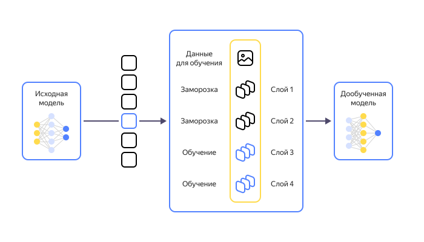

<link href="../../styles.css" rel="stylesheet" />

# Введение в машинное обучение

- [Цели и задачи](#цели-и-задачи)
  - [Цели модуля](#цели-модуля)
  - [Задачи модуля](#задачи-модуля)
  - [Результаты обучения](#результаты-обучения)
- [Основы машинного обучения и больших данных](#основы-машинного-обучения-и-больших-данных)
  - [Введение в машинное обучение](#введение-в-машинное-обучение-1)
  - [Основные понятия](#основные-понятия)
  - [Общая постановка задачи](#общая-постановка-задачи)
  - [Типология машинного обучения](#типология-машинного-обучения)
    - [Подходы к обучению](#подходы-к-обучению)
    - [Виды машинного обучения](#виды-машинного-обучения)
    - [Способы машинного обучения](#способы-машинного-обучения)
  - [Цель и задачи машинного обучения](#цель-и-задачи-машинного-обучения)
    - [Области применения](#области-применения)
    - [Сферы применения](#сферы-применения)
- [Методология машинного обучения](#методология-машинного-обучения)
  - [Линейная регрессия](#линейная-регрессия)
  - [Логистическая регрессия](#логистическая-регрессия)
  - [Деревья решений](#деревья-решений)
  - [Ансамблевые методы](#ансамблевые-методы)
  - [Метод опорных векторов (SVM)](#метод-опорных-векторов-svm)
  - [K-ближайших соседей](#k-ближайших-соседей)
  - [К-средних](#к-средних)
  - [Ассоциативные правила](#ассоциативные-правила)
  - [Наивный Байес](#наивный-байес)
  - [Искусственные нейронные сети](#искусственные-нейронные-сети)
  - [Глубокие нейронные сети](#глубокие-нейронные-сети)
- [Этапы машинного обучения](#этапы-машинного-обучения)
  - [Формализация задачи](#формализация-задачи)
    - [Методы факторного анализа](#методы-факторного-анализа)
    - [Методы дисперсионного анализа](#методы-дисперсионного-анализа)
    - [Методы регрессионного анализа](#методы-регрессионного-анализа)
  - [Сбор и подготовка данных](#сбор-и-подготовка-данных)
    - [Разделение выборок](#разделение-выборок)
  - [Построение модели](#построение-модели)
    - [Понятие модели](#понятие-модели)
    - [Виды моделей](#виды-моделей)
    - [Основные принципы моделирования](#основные-принципы-моделирования)
    - [Этапы моделирования](#этапы-моделирования)
    - [Информационное моделирование](#информационное-моделирование)
    - [Математические модели](#математические-модели)
    - [Модели машинного обучения](#модели-машинного-обучения)
    - [Основные типы моделей машинного обучения](#основные-типы-моделей-машинного-обучения)
      - [Классификационные модели](#классификационные-модели)
      - [Кластеризационные модели](#кластеризационные-модели)
      - [Фундаментальные модели](#фундаментальные-модели)
  - [Оптизимация модели](#оптизимация-модели)
    - [Математическая формулировка задач оптимизации](#математическая-формулировка-задач-оптимизации)
    - [Методы безусловной оптимизации](#методы-безусловной-оптимизации)
      - [Методы одномерной оптимизации](#методы-одномерной-оптимизации)
      - [Методы многомерной оптимизации](#методы-многомерной-оптимизации)
    - [Методы нелинейного программирования](#методы-нелинейного-программирования)
      - [Методы полиномиальной аппроксимации](#методы-полиномиальной-аппроксимации)
    - [Методы с использованием производной](#методы-с-использованием-производной)
      - [Метод хорд](#метод-хорд)
      - [Метод касательных](#метод-касательных)
      - [Метод средней точки](#метод-средней-точки)
    - [Пакеты прикладных программ для решения задач оптимизации](#пакеты-прикладных-программ-для-решения-задач-оптимизации)
  - [Оценка качества модели](#оценка-качества-модели)
    - [Экспертный анализ](#экспертный-анализ)
      - [Отбор экспертов](#отбор-экспертов)
      - [Методы экспертного анализа](#методы-экспертного-анализа)
  - [Дообучение модели](#дообучение-модели)
- [Применение машинного обучения](#применение-машинного-обучения)
  - [Преимущества и ограничения машинного обучения](#преимущества-и-ограничения-машинного-обучения)
  - [Будущее машинного обучения](#будущее-машинного-обучения)
- [Средства реализации машинного обучения](#средства-реализации-машинного-обучения)
  - [Классическое машинное обучение](#классическое-машинное-обучение)
  - [Математическое обеспечение](#математическое-обеспечение)
    - [Линейная алгебра](#линейная-алгебра)
    - [Математический анализ](#математический-анализ)
    - [Основы математической статистики](#основы-математической-статистики)
    - [Что делать, если ничего не понятно](#что-делать-если-ничего-не-понятно)
  - [Программное обеспечение](#программное-обеспечение)
    - [Программные средства](#программные-средства)
      - [Python](#python)
      - [C++](#c)
      - [SQL](#sql)
      - [Другие языки, используемые в машинном обучении](#другие-языки-используемые-в-машинном-обучении)
      - [Алгоритмы и структуры данных](#алгоритмы-и-структуры-данных)
  - [Аппаратное обеспечение](#аппаратное-обеспечение)
  - [Выводы](#выводы)
- [Заключение](#заключение)
- [Практическое задание](#практическое-задание)
  - [Реферат. Применение искусственного интеллекта](#реферат-применение-искусственного-интеллекта)
  - [Реферат. Использование машинного обучения](#реферат-использование-машинного-обучения)
- [Глоссарий](#глоссарий)
- [Источники информации](#источники-информации)

## Цели и задачи

### Цели модуля
Основная цель модуля — дать общее понимание ключевых понятий и структуры машинного обучения, составить общее представление о машинном обучении (МО).

### Задачи модуля

- Изучить основные концепции и термины МО.

- Ознакомиться с этапами построения моделей и подходами к обучению.

- Познакомиться с проблемами и ограничениями МО.

- Рассмотреть примеры практического применения.

- Рассказать о типах задач и алгоритмах МО.

### Результаты обучения
После прохождения модуля слушатели смогут:

- объяснять, что такое машинное обучение и его место в искусственном интеллекте;

- определять предмет и объект машинного обучения;

- распознавать и формулировать основные задачи МО;

- понимать этапы процесса построения и внедрения ML-моделей;

- оценивать качество моделей и выявлять возможные проблемы и ограничения.

## Основы машинного обучения и больших данных

*[ML]: Machine Learning
*[МО]: Машинное обучение
*[AI]: Artificial Intelligence
*[ИИ]: Искусственный интеллект

В последние десятилетия информационные технологии проникают во все сферы нашей жизни, порождая при этом беспрецедентные объемы данных. В эпоху, когда каждое устройство может стать источником данных, и каждое действие может быть зафиксировано и проанализировано, понимание сути и возможностей таких явлений, как машинное обучение и большие данные, становится не просто желательным, но и неотъемлемым для специалистов IT-сектора. Эти две дисциплины – машинное обучение и большие данные – сегодня определяют, как компании принимают решения, как научные исследования достигают новых горизонтов и даже как мы, как потребители, интерактируем с окружающим миром.[^mashinnoe-obuchenie-i-big-data]

В последнее время тема применения AI и ML-технологий стала очень актуальной. Ей интересуются многие компании, среди которых есть как крупные холдинги, так и малый бизнес. Основная задача подобных продуктов заключается в обработке большого количества данных, поэтому ML становится одной из ведущих составляющих в развитии IT-стратегии фирмы.

Оптимизация процессов с помощью технологий машинного обучения является фундаментальной точкой роста; они позволяют не только найти свою целевую аудиторию, но и уменьшить издержки.[^ml-tekhnologii]


Наша задача заключается в том, чтобы разобраться, что такое машинное обучение, сформулировать объект и предмет МО. Далее мы рассмотрим основные концепции машинного обучения, включая типы задач, алгоритмы и инструменты, используемые для создания моделей машинного обучения.[^machine] Кроме того, мы изучим взаимосвязь машинного обучения с другими смежными дисциплинами — искусственным интеллектом (*aritificial intelligence*), большими данными (*big data*), наукой о данных (*data science*), компьютерными науками (*computer science*), информатикой (*information science*) и т.п.

<dfn title="машинное обучение">Машинное обучение</dfn> (МО, ML) — это направление (раздел) искусственного интеллекта (AI), которое изучает методы создания алгоритмов, способных учиться на шаблонах тренировочных данных, делать выводы о новых данных и принимать решения без явного программирования на каждую задачу.

В широком смысле <dfn title="машинное обучение">машинное обучение</dfn> (ML) — совокупность математических, статистических и вычислительных методов для разработки алгоритмов. Благодаря им компьютер может решать задачи, выявляя закономерности в разнообразных загружаемых данных. ML — ещё и форма искусственного интеллекта: на этих алгоритмах работает и анализ больших данных.

<dfn title="искусственный интеллект">Искусственный интеллект</dfn> (ИИ, AI) — это область компьютерных наук (*computer science*), целью которой является создание систем, способных имитировать когнитивные функции человека, такие как обучение, рассуждение и принятие решений. Машины, оснащенные ИИ, могут обрабатывать огромные объемы данных, распознавать речь и изображения, а также прогнозировать будущие события, чтобы решать сложные задачи на уровне человеческого интеллекта.

Большинство современных технологических систем используют в своей основе искусственный интеллект, который помогает решать поставленные перед ними задачи. ИИ стал настоящей находкой для многих отраслей; он формируется с помощью машинного обучения.[^mashinnoe-obuchenie]

**Машинное обучение** – одно из самых динамично развивающихся направлений в современных компьютерных науках. В его основе лежит амбициозная идея: дать машинам способность учиться без явного программирования, на основе анализа данных.

Начнем с разделения понятий. Не стоит путать машинное обучение с искусственным интеллектом, хотя они тесно связаны. Если искусственный интеллект – это широкое поле, направленное на создание «умных» машин, способных имитировать человеческое мышление, то машинное обучение – это методика, позволяющая этим машинам обучаться на данных.[^mashinnoe-obuchenie-i-big-data]

<dfn title="машинное обучение">Машинное обучение</dfn> — это методология искусственного интеллекта, которая позволяет компьютерным системам учиться на основе опыта без активного программирования, благодаря чему компьютеры учатся находить закономерности и принимать решения на основе данных без прямого программирования (явных, жестко прописанных инструкций). Эта технология используется для создания компьютерных систем, которые могут обучаться и сами улучшать свою производительность при выполнении задач, которые ранее требовали человеческого участия или были сложными для прямого программирования.

### Введение в машинное обучение

В повседневной жизни все мы ежедневно сталкиваемся с принятием решений:

- при текущей дорожной ситуации надо ли ехать на метро или на машине?

- удалить ли письмо в электронной почте как спам или сохранить?

- ожидается ли дождь, и стоит ли брать с собой зонтик?

- стоит ли звонить человеку с определённым предложением или он от него, скорее всего, откажется?

- стоит ли докупить хлеба и молока или их хватит до конца недели?

- какое фокусное расстояние на фотоаппарате установить, чтобы лицо фотографируемого человека получилось чётким?

Аналогичные проблемы принятия решений решаются организациями в массовом порядке:

- сколько хлеба и молока закупить магазину, чтобы удовлетворить спрос до конца недели?

- как почтовому сервису автоматически разделять письма на полезные и спам?

- какими способами и по каким маршрутам отправлять грузы?

- какую погоду предсказать сервису прогноза погоды на оставшийся конец дня?

- как автоматически устанавливать фокусное расстояние на производимых фотоаппаратах?

При массовом и повторяющемся принятии решений целесообразно процесс принятия этих решений автоматизировать. Можно разработать явную систему правил этого процесса. Например, при определении важности письма мы можем смотреть на то, переписывались ли мы ранее с отправителем, принадлежит ли отправитель надежной и известной компании, включает ли текст письма определённые ключевые слова, которые нам заранее не интересны? В этом случае мы как бы явно программируем алгоритм принятия решений. Но проблема заключается в том, что

- Сложно разработать универсальный алгоритм, который бы подходил всем пользователям. Одних может не интересовать получение кредита или психологическая консультация, а для других это может оказаться актуальным.

- Сложно учесть всё многообразие ситуаций. Например, "бесплатная психологическая консультация" может быть сформулирована как "консультация психолога без оплаты", и изначальное правило уже перестанет действовать.

В подобных случаях полезно использовать **машинное обучение** (*machine learning*).

> <dfn title="машинное обучение">Машинное обучение</dfn> — это процесс, в результате которого компьютер по наблюдаемым данным обучается лучше решать заданную задачу. Метод решения задачи при этом ищется в широком классе функций, параметризованном вектором параметров, который и подбирается по наблюдаемым данным.

Вместо явного прописывания четкой системы правил принятия решений в идеологии машинного обучения эти правила подбираются автоматически по данным. Под компьютером при этом может пониматься любое вычислительное устройство, например смартфон или процессор робота. Рассмотрим более детальное определение:

> Машина учится на заданном **опыте** решать некоторую **задачу**, относительно некоторого **показателя качества**, если показатель качества растет на задаче после получения опыта.

В нашем примере задача — это классификация писем на спам/не спам, показатель качества — доля верно классифицированных писем, а опыт — коллекция прошлых писем, которые до этого были вручную размечены по классам.

В другом примере задачей выступает предсказание времени в пути, отталкиваясь от текущего времени суток, дня недели, погоды и загрузки дорог, показатель качества — модуль отклонения предсказанного времени от фактического, а опытом — история предыдущих передвижений в известных условиях и с известным временем в пути.[^deepmachinelearning]

Общий термин «Machine Learning» или «машинное обучение» обозначает множество математических, статистических и вычислительных методов для разработки алгоритмов, способных решить задачу не прямым способом, а на основе поиска закономерностей в разнообразных входных данных.[^Машинное_обучение] Решение вычисляется не по четкой формуле, а по установленной зависимости результатов от конкретного набора признаков и их значений. Например, если каждый день в течении недели земля покрыта снегом и температура воздуха существенно ниже нуля, то вероятнее всего, наступила зима. Поэтому машинное обучение применяется для диагностики, прогнозирования, распознавания и принятия решений в различных прикладных сферах: от медицины до банковской деятельности.

<dfn title="предмет машинного обучения">Предмет машинного обучения</dfn> — это алгоритмы и методы, которые позволяют компьютерам автоматически обучаться на основе данных, выявлять закономерности, делать предсказания и принимать решения без явного программирования каждого шага.

<dfn title="объект машинного обучения">Объект машинного обучения</dfn> — это данные, которые используются для обучения моделей, а также сама обучаемая задача. Это могут быть различные информационные массивы (тексты, изображения, числовые данные и пр.), на основе которых строятся модели для решения практических задача — классификации, регрессии, кластеризации и других целей.

Таким образом, машинное обучение изучает методы построения моделей, способных учиться на данных (предмет), а объектом является вся совокупность данных и задач, к которым применяются эти методы.

**Как это работает**

- **Алгоритмы и модели**: ИИ использует алгоритмы и математические модели для анализа данных, выявления закономерностей и "обучения".
- **Нейронные сети**: основой многих современных систем ИИ являются искусственные нейронные сети, имитирующие структуру и функции человеческого мозга.
- **Обучение на данных**: системы ИИ получают большие наборы данных, на которых они учатся распознавать образы, принимать решения и выполнять задачи без прямого вмешательства человека.

**Основные аспекты ИИ**

- **Обучение и адаптация**: ИИ системы способны обучаться на основе новых данных, что позволяет им улучшать свою работу и адаптироваться к новым условиям. 
- **Обработка информации**: ИИ может анализировать и обрабатывать различные типы данных, включая текст, изображения и звуки, распознавая закономерности и тенденции. 
- **Принятие решений**: системы ИИ способны принимать решения, основываясь на анализе данных и прогнозировании будущих событий, имитируя человеческое рассуждение.
- **Имитация когнитивных функций**: ключевая задача ИИ — воспроизведение таких когнитивных функций человека, как восприятие, понимание языка, рассуждение и принятие решений.


**Основные возможности**

- **Обработка естественного языка**: ИИ может понимать и генерировать текст, например, в автоматизированных чат-ботах.
- **Распознавание изображений**: способность систем распознавать объекты и лица на фотографиях.
- **Принятие решений**: ИИ может использоваться для автоматизированного принятия решений в бизнесе и других сферах.
- **Генерация контента**: ИИ способен создавать музыку и помогать в написании сценариев.

**Примеры применения ИИ**

- **Виртуальные помощники и чат-боты**: автоматизированные системы, которые помогают пользователям, отвечают на вопросы и выполняют различные задачи. 
- **Распознавание образов и речи**: технологии, позволяющие компьютерам понимать и интерпретировать изображения и устную речь. 
- **Генеративные модели**: ИИ, который способен создавать новый контент, такой как текст, изображения или музыка, на основе анализа больших массивов данных. 
- **Автономные системы**: например, беспилотные автомобили, которые могут принимать решения и управлять машиной без участия человека. 

### Основные понятия
*Artificial intelligence* с английского переводится как **искусственный интеллект**. Он может справляться с теми задачами, с которыми до недавнего времени мог совладать только человек. Они запрограммированы на поиск взаимосвязей между входными данными; AI имитирует мыслительный процесс, может самостоятельно рассуждать и учиться на своих ошибках. Подобные технологии в несколько раз сокращают время, затрачиваемое на поиск решений.

Более узким понятием является ML. **Машинное обучение** представляет собой технологию передачи данных нейронной сети. Благодаря этому процессу AI получает необходимые знания для последующего решения задач.[^ml-tekhnologii]

<dfn title="машинное обучение">Машинное обучение</dfn> (ML — *machine learning*) представляет собой способ обучения компьютеров без программирования. Системы при помощи запросов пользователей учатся классифицировать объекты и определять взаимосвязи. Большой интерес для бизнеса они представляют по причине автоматизации многих процессов. Благодаря этому машинное обучение становится ключевым элементом развития IT-стратегии предприятия. Основу машинного обучения представляют базовые компоненты.

Для понимания основ машинного обучения важно усвоить несколько ключевых концепций:

- <dfn title="данные">Данные</dfn> (обучающая выборка) — набор примеров, на которых алгоритм обучается. Другими словами, <dfn title="обучающая выборка">обучающая выборка</dfn> (*dataset*) — это информация (набор данных), используемая для обучения алгоритма. Этот набор содержит входные данные и соответствующие им выходные результаты. От количества данных зависит качество и эффективность конечного результата. **Отличие информации от данных**: данные для машины, информация имеет значение для человека.

- <dfn title="модель">Модель</dfn> — результат обучения, который может делать предсказания на новых данных. Это математическая структура, обученная на данных для предсказаний.

- <dfn title="признак">Признаки</dfn> (фичи) — измеряемые параметры объекта. Это какие-либо характеристики объекта (например, возраст, рост). Они становятся определяющим элементам в вопросе построения параметров ML.

- <dfn title="целевая переменная">Целевая переменная</dfn> — то, что пытается предсказать модель, т.е. именно то, что нужно предсказать (например, цена дома).

- <dfn title="алгоритм">Алгоритм</dfn> — метод машинного обучения.

**Основная идея**: есть данные и задачи и алгоритм строит модель, способную обобщать информацию и делать предсказания. То есть после обучения на основе алгоритма и обучающей выборки, система создает **модель**, которая может делать прогнозы или принимать решения без явного программирования. Другими словами, если оптимизировать работу модели на наборе данных, достаточно близком к задачам из реального мира (процесс называется обучением модели), то модель сможет делать точные предсказания на новых данных, с которыми она столкнется в реальных условиях.[^machine-learning] После обучения модели выполняется **оценка и тестирования**, в ходе которых эффективность модели проверяется на новых, ранее не встречавшихся данных.

Сам процесс обучения — это всего лишь средство для достижения цели: обобщения (**генерализации**), то есть переноса высокого качества работы (<dfn title="производительность модели">производительности модели</dfn>) на тренировочных данных на полезные результаты в реальных сценариях. Тем не менее, обучение является фундаментальной задачей машинного обучения. По сути, обученная модель применяет шаблоны, которые она выучила на тренировочных данных, чтобы сделать правильный вывод в реальной задаче; процесс использования модели ИИ называется <dfn title="инференс">инференсом</dfn> (выводом) ИИ.


### Общая постановка задачи
*[CBR]: Case Based Reasoning

Имеется множество *объектов* (ситуаций) и множество возможных *ответов* (откликов, реакций). Существует некоторая зависимость между ответами и объектами, но она неизвестна. Известна только конечная совокупность *прецедентов* — пар «объект, ответ», называемая *обучающей выборкой*. На основе этих данных требуется восстановить неявную зависимость, то есть построить алгоритм, способный для любого возможного входного объекта выдать достаточно точный классифицирующий ответ. Эта зависимость не обязательно выражается аналитически, и здесь нейросети реализуют принцип эмпирически формируемого решения. Важной особенностью при этом является способность обучаемой системы к обобщению, то есть к адекватному отклику на данные, выходящие за пределы имеющейся обучающей выборки. Для измерения точности ответов вводится оценочный *функционал качества*.[^Машинное_обучение]

Таким образом, <dfn title="прецедент">прецеденты</dfn> или <dfn title="Обучающая выборка">обучающая выборка</dfn> – это наборы входных объектов и соответствующих им результатов. При этом не существует четкой формулы, которая аналитически описывает зависимость между результатами и входами. Например, какая погода будет завтра, если на протяжении недели дни были морозные, солнечные, с низкой влажностью воздуха, без ветра и осадков? При этом следует учесть еще множество параметров: географические координаты, рельеф местности, движение теплых и холодных фронтов воздуха и пр. Необходимо построить алгоритм, который выдаст достаточно точный результат для любого возможного входа. На практике входные данные могут быть неполными, неточными и разнородными. [2] Поэтому существует множество подходов, способов и методов машинного обучения. Можно сказать, что машинное обучение реализует подход <dfn title="Case Based Reasoning">Case Based Reasoning</dfn> (CBR) — **метод решения проблем рассуждением по аналогии**, путем предположения на основе подобных случаев (прецедентов).


*Суть и смысл машинного обучения (Machine Learning)*

### Типология машинного обучения
Принято выделять несколько разных подходов, видов и способов машинного обучения. По направлению логического вывода знаний различают следующие базовые подходы к обучению:

1. **Дедуктивное обучение** (от общего к частному) — предполагает формализацию знаний экспертов и их перенос в компьютер в виде базы знаний.
2. **Индуктивное обучение** (от частного к общему) — основано на выявлении эмпирических закономерностей во входных данных.
3. **Трансдуктивное обучение** (от частного к частному).

По уровню сложности и архитектуре моделей принято выделять следующие виды машинного обучения:

1. **Классическое машинное обучение**: использует простые алгоритмы (линейные модели, деревья) с ручным или минимальным извлечением признаков.
2. **Глубокое обучение**: опирается на многослойные нейронные сети, автоматически обучающие иерархические представления данных.

По типу данных и сигналу обучения выделяют следующие способы:

1. **С учителем**: предполагает наличие размеченных пар (признаки + метки).
2. **Без учителя** — только признаки, поиск скрытых структур.
3. **С подкреплением** — взаимодействие агента со средой через награды, без прямых меток.

#### Подходы к обучению
<dfn title="дедуктивное обучение">Дедуктивное обучение</dfn> или обучение «сверху-вниз», от общего к частному, предполагает формализацию знаний экспертов и их перенос в компьютер в виде базы знаний. Дедуктивное обучение принято относить к области [экспертных систем](https://ru.wikipedia.org/wiki/%D0%AD%D0%BA%D1%81%D0%BF%D0%B5%D1%80%D1%82%D0%BD%D0%B0%D1%8F_%D1%81%D0%B8%D1%81%D1%82%D0%B5%D0%BC%D0%B0). Имеются знания, сформулированные экспертом и каким-либо образом формализованные через уравнения, теоремы, зависимости и т.д. Программа, экспертная система, выводит из этих правил конкретные факты и новые правила.

<dfn title="индуктивное обучение">Индуктивное обучение</dfn> или обучение «снизу-вверх», от частного к общему, обучение на примерах, <dfn title="обучение по прецедентам">обучение по прецедентам</dfn> (*instance-based learning*), основано на выявлении закономерностей в эмпирических данных, т.е., данных полученных путём наблюдения или эксперимента. Индуктивное обучение компьютеров принято относить к собственно **машинному обучению**. Многие методы индуктивного обучения разрабатывались как альтернатива классическим статистическим подходам и тесно связаны с [извлечением информации](https://ru.wikipedia.org/wiki/%D0%98%D0%B7%D0%B2%D0%BB%D0%B5%D1%87%D0%B5%D0%BD%D0%B8%D0%B5_%D0%B8%D0%BD%D1%84%D0%BE%D1%80%D0%BC%D0%B0%D1%86%D0%B8%D0%B8) (*information extraction*, *information retrieval*) и [интеллектуальным анализом данных](https://ru.wikipedia.org/wiki/%D0%98%D0%BD%D1%82%D0%B5%D0%BB%D0%BB%D0%B5%D0%BA%D1%82%D1%83%D0%B0%D0%BB%D1%8C%D0%BD%D1%8B%D0%B9_%D0%B0%D0%BD%D0%B0%D0%BB%D0%B8%D0%B7_%D0%B4%D0%B0%D0%BD%D0%BD%D1%8B%D1%85) (*data mining*). На основе эмпирических данных программа строит общее правило. Эмпирические данные могут быть получены самой программой в предыдущие сеансы её работы или просто предъявлены ей.

<dfn title="трансдуктивное обучение">Трансдуктивное обучение</dfn>[^1.2] или обучение от частного к частному, позволяет на основе эмпирических данных без выявления общих закономерностей и формализации знаний сделать выводы о других эмпирических данных. Понятие трансдукции было предложено [Владимиром Вапником](https://en.wikipedia.org/wiki/Vladimir_Vapnik) в 1990 году: «При решении интересующей проблемы не решайте более общую проблему как промежуточный шаг. Постарайтесь получить ответ, который вам действительно нужен, но не более общий». Например, если не учитывать объекты без метки (рисунок ниже), тогда невозможно правильно сегментировать множество, потому что слишком мало размеченных объектов.

<figure>


</figure>

*Пример трансдуктивного обучения*

При решении задачи методом индукции, когда ищется общий ответ для всех возможных случаев, неразмеченные объекты не учитываются, их как бы нет для решающего задачу, потому что с точки зрения индуктивного обучения могут быть и другие неразмеченные объекты кроме имеющихся. Учёт присутствующих неразмеченных данных может кардинально изменить качество решения, но если появятся новые неразмеченные данные, то их появление может полностью изменить ответ. Трансдуктивное обучение применяется в некоторых методах машинного обучения с частичным привлечением учителя (*semi-supervised learning*). Взаимосвязь между тремя типами обучения можно увидеть на рисунке:

<figure>


</figure>

*Три типа обучения*

Будем считать задачу обучения экзаменом, размеченные объекты – как решённые учителем примеры, а неразмеченные объекты – как предоставленные учителем нерешённые примеры. С точки зрения дедуктивного обучения у вас уже есть формула, показанная вам учителем, с помощью которой вы можете решить все нерешённые задачи на экзамене, поэтому нет смысла решать предоставленные учителем нерешённые примеры. С точки зрения индуктивного обучения нерешённые примеры являются подобными тем, которые будут на экзамене. С точки зрения трансдуктивного обучения данные учителем нерешённые примеры и есть экзамен, т.е. эти же примеры будут на экзамене.[^vvedeniye-v-mashinnoye-obucheniye-i-iskusstvennyye-neyronnyye-seti]

Таким образом, дедуктивное, индуктивное и трансдуктивное обучение — это разные подходы к выводу знаний или моделей, часто используемые в логике, педагогике и машинном обучении.

<dfn title="дедуктивное обучение">Дедуктивное обучение</dfn> — метод, где выводы делаются от общего правила к частным случаям. Сначала даётся универсальное правило (например, "все металлы проводят электричество"), а затем оно применяется к конкретным примерам (медь проводит ток). Выводы логически достоверны, если посылки верны.

<dfn title="индуктивное обучение">Индуктивное обучение</dfn> — обратный процесс: от частных наблюдений к общему правилу. Собираются примеры (воробьи, голуби и вороны летают), на основе которых формулируется обобщение ("все птицы летают"). Выводы вероятностны и могут быть опровергнуты новыми данными.

<dfn title="трансдуктивное обучение">Трансдуктивное обучение</dfn> — подход, фокусирующийся на предсказаниях только для конкретного набора тестовых данных, без построения общей модели. Используется в машинном обучении: на основе размеченных и неразмеченных данных выводятся ответы именно для заданных примеров, без обобщения на другие.

*Сравнение подходов*

Тип | Направление вывода | Цель | Достоверность вывода
-- | -- | -- | --
**Дедуктивное** | Общее → Частное | Применение правила | Логическая (100%)
​**Индуктивное** | Частное → Общее | Формирование правила | Вероятностная
​**Трансдуктивное** | Частное → Конкретное | Предсказание для теста | Высокая для данного сета

#### Виды машинного обучения
Принято выделять два глобальных вида машинного обучения — *классическое* (*традиционное*) и *глубокое*, причем в разных источниках эти термины могут использоваться по-разному.

1. Под глубоким обучением (*Deep Learning*, DL) понимается все, что связано с глубокими нейросетями.

2. Под классическим машинным обучением (*Classic Machine Learning*, *Classic ML*) понимается большая часть остальных, "неглубоких" обучающихся алгоритмов и примыкающие к ним методы математической статистики.


*Типология ML*

<dfn title="классическое машинное обучение">Классическое машинное обучение</dfn> (*Classical ML*) — это набор статистических и математических методов для создания алгоритмов, которые учатся на данных, выявляя закономерности без явного программирования правил. Оно фокусируется на "табличных данных" (как в базах данных) и решает задачи классификации (спам/не спам) и регрессии (предсказание цены) с помощью моделей на основе линейных методов или деревьев решений, в отличие от нейронных сетей для изображений/текстов. Основные подходы: *обучение с учителем* (данные размечены) и *без учителя* (поиск структур).

**Основные принципы**
- **Обучение на опыте** (данных): компьютерная программа улучшает свою производительность на задаче с накоплением опыта (набора данных).
- **Поиск закономерностей**: вместо жестких правил, алгоритмы сами находят скрытые паттерны в данных.
- **Автоматизация**: позволяет автоматизировать сложные процессы прогнозирования, классификации и принятия решений.

**Ключевые задачи и методы**
- **Классификация**: отнесение объектов к одной из категорий (например, «спам»/«не спам», «кошка»/«собака»).
- **Регрессия**: прогнозирование непрерывного числового значения (например, цены дома).
- **Кластеризация**: группировка схожих данных без предварительных меток (обучение без учителя).
- **Снижение размерности**: уменьшение количества признаков при сохранении информации.

**Примеры классических ML-алгоритмов и методов**:

- Линейная и логистическая регрессия
- Другие “неглубокие” модели — решающие деревья, SVM, …
- Ансамбли (Random Forest, XGBoost, …)
- Методы понижения размерности (PCA, t-SNE, UMAP, …)
- и многое другое

**Где применяется**
- **Прогнозирование**: финансовые риски, поведение пользователей, спрос.
- **Рекомендации**: персонализированные предложения (как в интернет-магазинах).
- **Диагностика**: медицина, кредитный скоринг.

<dfn title="глубокое машинное обучение">Глубокое машинное обучение</dfn> (*Deep Learning*) — это подвид машинного обучения, использующий многослойные искусственные нейронные сети для анализа данных, имитируя работу человеческого мозга; оно позволяет системам автоматически извлекать сложные закономерности из больших объемов неструктурированных данных (текст, изображения, звук) для выполнения задач, таких как распознавание речи, машинный перевод и автономное вождение, без необходимости ручной разработки признаков.

**Как это работает**
- **Нейронные сети**: используются сложные, многоуровневые нейронные сети, где каждый слой обрабатывает и извлекает новые, более абстрактные характеристики из данных.
- **Иерархическое обучение**: сеть учится распознавать простые черты (например, края на изображении), а затем комбинирует их для понимания более сложных концепций (объекты, сцены).
- **Автоматическое извлечение признаков**: в отличие от традиционного ML, где признаки задаются вручную, DL-модели сами определяют, какие признаки важны для задачи.

**Ключевые отличия от классического машинного обучения**:
- **Сложность данных**: DL отлично справляется с неструктурированными данными (видео, аудио), тогда как классический ML лучше работает с табличными данными.
- **Объем данных**: DL требует больших объемов данных для обучения; чем больше данных, тем лучше результат.
- **Вычислительная мощность**: требует мощных серверов с GPU для обучения.

**Примеры глубоких нейросетей**:

- Глубокие сверточные сети (VGG-16, AlexNet, ResNet, …)
- Диффузионные модели (Stable Diffusion, DALLE-2, …)
- Трансформерные архитектуры (Transformer, ViT, T5, BERT, GPT, ChatGPT, …)
- и другие.

**Примеры применения**:
- **Компьютерное зрение**: распознавание объектов, лиц, анализ медицинских изображений.
- **Обработка естественного языка** (NLP): машинный перевод, создание чат-ботов, анализ текста, голосовые помощники.
- **Автономные системы**: самоуправляемые автомобили.

Глубокое обучение стало движущей силой многих современных достижений в области искусственного интеллекта, позволяя решать задачи, которые ранее были недоступны, с качеством, сравнимым или превосходящим человеческое.

Основное отличие классического от глубокого обучения (нейронных сетей)
- **Классический ML**: отлично работает с разнородными, структурированными (табличными) данными.
- **Глубокое обучение**: лучше справляется с большими объемами однородных данных, таких как изображения, тексты, аудио, видео.


#### Способы машинного обучения
**Классическое** машинное обучение предполагает существование табличных данных, на основе которых создаются алгоритмические модели. Так, например, работают поисковые машины. Методы машинного обучения обычно разделяются на две обширные категории, в зависимости от наличия обучающего «сигнала» или «обратной связи» для алгоритма обучения: **обучение с учителем** (*supervised learning*) и **обучение без учителя** (*unsupervised learning*). В первом случае специалист обучает машину на реальных примерах, она должна найти общие признаки и выстроить связи. Во втором случае алгоритм должен сам найти общие признаки и классифицировать полученные данные. Этот подход используется, когда собрать размеченные данные заранее невозможно

При <dfn title="обучение с учителем">обучении с учителем</dfn> (*supervised learning*) система обучается на примерах с заранее известными правильными ответами. На основе этих входных примеров и известных правильных ответов требуется восстановить зависимость между множеством примеров и множеством ответов, т.е. построить алгоритм, который будет выдавать достаточно точный ответ для любого примера. Совокупность примеров (входных объектов) и соответствующих им правильных ответов называется <dfn title="обучающая выборка">обучающей выборкой</dfn> (*training set*).

**Формализация**: пусть обучающая выборка описывается парой значений $〈x, y〉$, где $x=〈x_1,x_2,…,x_n〉$ – это данные (многомерный вектор признаков), $y$ – это целевое значение (метка или правильный ответ). Надо найти функцию $ƒ(x)=y$.

Таким образом, алгоритм учится на основе размеченных данных, стремясь находить зависимости и прогнозировать результаты. При этом есть правильные ответы (метки) на обучающих данных, например, классификация (распределение писем на спам и не спам), регрессия (прогноз цены дома). Данный тип обучения подразумевает наличие ответа на поставленный вопрос, искусственному интеллекту нужно лишь понять взаимосвязь.

Дата-инженер предоставляет модели обработанные данные, по которым она должна  обучаться. То есть признаки уже заданы, а модели остается лишь понять, почему тот или иной объект ими обладает. Учитель продолжает исправлять модель до тех пор, пока она не выдаст требуемую точность прогнозов.

Применяется, когда необходимо найти функциональную зависимость результатов от входов и построить алгоритм, на входе принимающий описание объекта и на выходе выдающий ответ. Функционал качества, как правило, определяется через среднюю ошибку ответов алгоритма по всем объектам выборки. К обучению с учителем относятся задачи классификации, регрессии, ранжирования и прогнозирования.[^machine-learning]

Применимо для большинства задач: линейная и полиномиальная регрессия, деревья решений, k-ближайших соседей, наивный Байес и другие. Однако, чем больше объемы данных, тем менее актуален такой способ обучения, поскольку требует постоянной вовлеченности дата-инженера.[^ml-models]

<dfn title="обучение без учителя">Обучение без учителя</dfn> (*unsupervised learning*), самообучение, происходит на примерах без заранее известных правильных ответов. Система сама находит внутренние взаимосвязи, зависимости, закономерности, существующие между объектами без вмешательства внешнего учителя, экспериментатора, человека.

**Формализация**: пусть каждый объект описан вектором признаков $x=〈x1,x2,…,xn〉$. Надо найти механизм, который описывает структуру этих данных, которая заранее не известна.

Здесь алгоритм работает с не размеченными данными, пытаясь выявить в них структуру или закономерности. При этом нет меток, задача — найти структуру в данных (кластеризация, понижение размерности). Данный тип основывается на выявлении ИИ закономерностей и их систематизации.

Модели дают необработанные данные, чтобы она сама выделила в них какие-то закономерности. Алгоритм применяется, когда объемы данных слишком большие, но предполагается, что машина сможет самостоятельно распознать в них паттерны.

Применяется, когда ответы не задаются, и нужно искать зависимости между объектами. Сюда входят задачи кластеризации, поиска ассоциативных правил, фильтрации выбросов, построения доверительной области, сокращения размерности и заполнения пропущенных значений.[^machine-learning] Без учителя работает обучение любых моделей кластеризации, но для большинства других задач метод не подходит.[^ml-models]

Комбинированные виды обучения применяют различные сочетания обоих типов обучения в одной программе. Например, *обучение с частичным привлечением учителя*, *обучение с подкреплением* и некоторые другие.

Не всегда удаётся найти хорошую обучающую выборку. Часто данные размечены не полностью, т.е. не для всех данных есть правильный ответ (метка). Разметка данных для машинного обучения является однообразным и долгим трудом. Обычно имеется небольшое количество размеченных данных и большое количество неразмеченных данных. В этом случае применяется <dfn title="обучение с частичным привлечением учителя">обучение с частичным привлечением учителя</dfn>. Его ещё называют <dfn title="полуавтоматическое обучение">полуавтоматическим обучением</dfn> (*semi-supervised learning*). Многие исследователи машинного обучения обнаружили, что неразмеченные данные, при использовании в сочетании с небольшим количеством размеченных данных, могут значительно улучшить точность обучения. Обучение с частичным привлечением учителя является частным случаем трансдуктивного обучения.[^vvedeniye-v-mashinnoye-obucheniye-i-iskusstvennyye-neyronnyye-seti]

К неклассическим, но весьма популярным методам относят <dfn title="обучение с подкреплением">обучение с подкреплением</dfn>, в частности, *генетические алгоритмы*, и *искусственные нейронные сети*. В качестве входных объектов выступают пары «ситуация, принятое решение», а ответами являются значения функционала качества, который характеризует правильность принятых решений (реакцию среды). Эти методы успешно применяются для формирования инвестиционных стратегий, автоматического управления технологическими процессами, самообучения роботов и других подобных задач.[^machinelearning]

<dfn title="обучение с подкреплением">Обучение с подкреплением</dfn> (*reinforcement learning*) — обучение на основе наград и штрафов от взаимодействия с окружением. В этом случае машина учится, основываясь на «награде» или «штрафе» в ответ на свои действия, стремясь максимизировать свою «выгоду». При обучении с подкреплением учителем является сама окружающая среда, модель среды или неявный учитель, например, одновременная активность нескольких нейронов в искусственной нейронной сети.

Данный тип подразумевает набор сценариев, находясь в которых ИИ должен определить оптимальные действия. В этом подразделе машинного обучения строится не однократный прогноз независимо для каждого объекта, а вырабатывается интерактивная стратегия поведения в изменяемой среде.

Машина подстраивается под изменения в динамичной виртуальной среде. Самый простой пример — обучение беспилотных автомобилей. В виртуальной реальности имитируются различные события, вроде неожиданных действий другой машины, выбегания на дорогу ребенка и так далее.

Другим примером обучения с подкреплением может служить автоматическая игра в шахматы, в которой необходимо последовательно генерировать каждый следующий ход. Успех генерации определяется не только текущим ходом, но и всей последовательностью решений в течение партии. Обучение с подкреплением также применяется в управлении игровыми персонажами в играх, машинами-роботами на дорогах, дронами, продвинутыми чат-ботами и роботизированными ассистентами.[^deepmachinelearning]

Примеры алгоритмов:

- <dfn title="Q-обучение">Q-обучение</dfn> — создается среда, которая за одни результаты штрафует модель, а за другие — дает вознаграждение. Накапливая опыт, машина вырабатывает наиболее эффективную стратегию поведения.
- <dfn title="глубокое Q-обучение">Глубокое Q-обучение</dfn> — компенсирует недостатки Q-обучения за счет добавления нейронной сети для аппроксимации действий, чтобы модель могла подстраиваться под новые среды.
- <dfn title="генетический алгоритм">Генетический алгоритм</dfn> — аналогично естественному отбору в природе, случайно подбираются различные комбинации признаков для выявления наиболее эффективного способа решения задач.[^ml-models]

| Признак            | Описание                                                                                                 |
| ------------------ | -------------------------------------------------------------------------------------------------------- |
| Цель               | Агент обучается принимать оптимальные решения через взаимодействие со средой, получая награды/штрафы     |
| Тип обучения       | Обучение с подкреплением (Reinforcement Learning) — отдельная парадигма наряду с supervised/unsupervised |
| Ключевые концепции | Агент (agent), среда (environment), действие (action), награда (reward), политика (policy)               |
| Алгоритмы          | Q-Learning, Deep Q-Network (DQN), Policy Gradient, PPO, A3C                                              |
| Позиция в МО       | Отдельная парадигма ML для последовательного принятия решений                                            |
| Когда применяется  | Игры (AlphaGo), робототехника, автономные системы, управление ресурсами                                  |

В глубокой тщательности этих процессов кроется возможность переопределения того, как технология взаимодействует с миром вокруг нас, делая машины не просто инструментами, но и активными участниками этого взаимодействия.

*Способы машинного обучения*

| Тип                          | Описание                                        | Пример задачи                       |
| ---------------------------- | ----------------------------------------------- | ----------------------------------- |
| **Обучение с учителем**      | Есть метки (правильные ответы)                  | Классификация спама, регрессия цены |
| **Обучение без учителя**     | Нет меток, самостоятельно ищем структуру в данных              | Кластеризация, сегментация          |
| **Обучение с частичным привлечением учителя** | Комбинация размеченных (мало) и неразмеченных данных для улучшения модели | Классификация текстов, полупроводниковая маркировка
| **Обучение с подкреплением** | Учимся через взаимодействие с задачей и награды | Обучение, игры, робототехника        |


Один из подвидов ML — <dfn title="глубокое обучение">глубокое обучение</dfn>, когда алгоритм помимо текста включает в себя фото, видео, звук. Так работают нейронные сети: во время обучения они учатся автоматически выявлять правила и характеристики.

<dfn title="глубокое обучение">Глубокое обучение</dfn> (*deep learning*) — подраздел машинного обучения про сложные многоуровневые модели (нейросети), способные решать более сложные задачи прогнозирования. С ростом вычислительных мощностей и объёма данных существует устойчивый тренд на замену классических алгоритмов машинного обучения на нейросетевые, обеспечивающие большую точность и возможность генерировать не только численные ответы, но и ответы в виде сложно структурированных данных, таких как текст, речь, изображение и видео.[^deepmachinelearning]

### Цель и задачи машинного обучения
*[PCA]: Principal Component Analysis
*[NLP]: Natural Language Processing
*[CV]: Computer Vision

**Целью машинного обучения является частичная или полная автоматизация человеческой деятельности в самых разных областях.**[^vvedeniye-v-mashinnoye-obucheniye-i-iskusstvennyye-neyronnyye-seti]

Результат обучения зависит от качества исходных данных. Благодаря машинному обучению можно закрыть многие пробелы в функционировании организации и предприятия. Оно отвечает за решение следующих задач:

- прогнозирование с использованием показателей с разными признаками;
- помогает выявлять объекты по имеющимся параметрам (например, поиск людей по фото);
- систематизирует данные по схожим признакам;
- выполняет поиск информации по заданным параметрам;
- анализирует объем имеющихся данных и делает прогнозы.

На этом проблемы, с которыми помогает справляться машинное обучение, не ограничиваются, что еще раз подтверждает перспективность использования ML в развитии как крупного, так и малого бизнеса.

Приведём примеры популярных задач, решаемых с помощью машинного обучения:[^deepmachinelearning]

- Предсказать, уйдёт ли клиент к конкурентам? (*churn prediction*)

- Является ли последовательность финансовых транзакций мошеннической? (*fraud detection*)

- Предсказание пробок и времени в пути при планировании маршрута (*traffic prediction*).

- Стоит ли показывать заданный товар покупателю в качестве рекомендации? (*recommender systems*)

- Рекомендовать ли человека в качестве друга в социальной сети?

- Является ли аккаунт в социальной сети ботом?

- Генерация персонализированных предложений и визуальных материалов.

- Выстраивание коммуникации с клиентами (например, использование чат-ботов).

- Подбор персональных продуктов и процентных ставок банков.

- Предоставление определенной выборки результатов на основе заданных параметров.

- Разработка приложений.

- Голосовой ассистент: распознавание речи, автоматический ответ на вопросы, генерация речевого ответа.

- Идентификация человека по лицу. Распознавание номера машины на камерах.

- Подсчёт и отслеживание людей по камерам видеонаблюдения (*object tracking*). Обнаружение неправомерных действий (*activity recognition*).

- Автоматическое управление машинами (*self-driving cars*): распознавание ситуации, планирование маршрута.

- Автоматическая торговля на бирже (*algorithmic trading*).

- Перевод с одного языка на другой (*machine translation*).

- Постановка медицинских диагнозов по жалобам пациента и результатам обследований.

- Рекомендация веб-страниц по поисковому запросу (*information retrieval*).

- Автоматическая оценка ожидаемой зарплаты кандидата по резюме.

- Игра компьютера в шахматы, управление игровыми персонажами.

- Автоматическая оценка квартиры по её характеристикам.

- Хвалит или ругает пользователь товар в своём отзыве? (*sentiment analysis*)

- Генерация иллюстраций к тексту. Текстовое описание, что показано на изображении.

- Прогноз погоды. Рекомендации фермерам, когда сажать/поливать/удобрять посевы.

- Автоматическое написание программного кода (*no code AI*).

- Автоматический выбор, каким пользователям какую онлайн-рекламу показать (*targeted ads*).

- Генерация химических соединений, обладающих требуемыми свойствами:

    - крепкий, но легкий и термостойкий материал с повышенной проводимостью (*material design*)

    - препарат, обеспечивающий лечение и обладающий минимальными побочными эффектами (*drug discovery*)

Алгоритмы машинного обучения работают с разными типами данных: текстом, изображениями, числовыми значениями. Выбор метода зависит от решаемой задачи — будь то фильтрация спама или диагностика заболеваний. Методы машинного обучения разделяются по типам решаемых задач: классификация, кластеризация, регрессия, прогнозирование, идентификация, восстановление плотности распределения вероятности по набору данных, понижение размерности, одноклассовая классификация и выявление новизны, построение ранговых зависимостей и т.д. Продолжают возникать новые типы задач и даже целые новые дисциплины машинного обучения, например, добыча данных (*data mining*).

Типологически основные задачи машинного обучения включают классификацию (присвоение объекта категории, например, спам или не спам), регрессию (предсказание непрерывного числового значения, например, цены дома), кластеризацию (группировка объектов без предварительной разметки) и снижение размерности (уменьшение количества признаков). Отдельным направлением является обработка естественного языка.

Существует несколько основных категорий задач машинного обучения, каждая со своими техническими особенностями.

1. **Восстановление пропущенных или поврежденных данных** (*data recovery*)

      - **Суть**: процесс восстановления недостающих или испорченных значений в данных, чтобы повысить качество анализа и модели. Включает методы заполнения пропусков или исправления ошибок.

      - **Примеры**: заполнение отсутствующих значений в медицинских данных, восстановление данных после сбоев в системах хранения.

2. **Обнаружение выбросов** (*outlier detection* — поиск или детектирование) и <dfn title="выявление аномалий">выявление аномалий</dfn> (*anomaly detection*) обнаруживает нетипичные паттерны в данных. Модель изучает нормальное поведение системы и сигнализирует об отклонениях.[^machine-learning-guide]

      Банки выявляют подозрительные транзакции по необычным тратам клиента, промышленные компании предсказывают поломки оборудования по аномальным показателям датчиков, а системы кибербезопасности обнаруживают вторжения по нестандартному сетевому трафику. Алгоритмы аномалий часто работают в реальном времени, мгновенно реагируя на отклонения.

      - **Суть**: обнаружение данных, которые значительно отличаются от большинства (поиск необычных данных). Есть множество  объектов $M$. Найти в нем все аномальные объекты.

      - **Примеры**: Выявление мошеннических транзакций или нетипичных событий в системе.

3. **Поиск новизны** (*novelty detection*): вплотную примыкает к предыдущей задаче

      *Одноклассовая классификация и выявление новизны*, или задача поиска аномалий, выбросов, которые не относятся ни к одному кластеру — нахождение объектов, которые отличаются по своим свойствам от объектов обучающей выборки. Является задачей обучения без учителя. Например, обнаружение инородных предметов (кости, камни, кусочки упаковки) в продуктах питания при их сканировании рентгеновским сканером при неразрушающем контроле качества продукции, обнаружение подозрительных банковских операций, обнаружение хакерской атаки, медицинская диагностика и т.д.[^vvedeniye-v-mashinnoye-obucheniye-i-iskusstvennyye-neyronnyye-seti]

      - **Суть**: есть множество  объектов $M$. Определить, является ли объект $A \notin M$ похожим на объекты из $M$ или нет. В отличие от поиска выбросов, где аномалии уже могут присутствовать в имеющихся данных, задача поиска новизны направлена на оценку, насколько новый объект отличается от известных данных с целью выявления новых, ранее не встречавшихся паттернов или объектов.

      - **Примеры**: определение, насколько новый пользовательский контент похож или отличается от известного, чтобы фильтровать спам или рекомендовать релевантный контент; распознавание новых схем мошенничества, отличающихся от известных, для предотвращения угроз безопасности.

4. **Классификация** (*classification*) и **идентификация**: является одним из самых распространенных типов задач машинного обучения. Она заключается в отнесении объектов к определенным категориям или классам. Алгоритм анализирует признаки объекта — числовые характеристики, описывающие его свойства — и выбирает подходящий класс из заранее известного набора.[^machine-learning-guide]

      <dfn title="классификация">Классификация</dfn> – разделение множества объектов или ситуаций на классы с помощью обучения с учителем. Классифицировать объект – значит, указать номер, имя или метку класса, к которому относится данный объект. Иногда требуется указать вероятность отношения объекта к классу. Например, по обучающей выборке фотографий котов и собак научиться различать изображения котов и собак.[^vvedeniye-v-mashinnoye-obucheniye-i-iskusstvennyye-neyronnyye-seti]

      Например, можно использовать классификацию для определения того, является ли электронное письмо спамом. В этом случае модель обучается на основе примеров уже размеченных писем и в дальнейшем может автоматически определять, относить письмо к спаму или нет.[^machine] Почтовые сервисы классифицируют письма на спам и не спам, банки определяют кредитоспособность клиентов, а системы компьютерного зрения распознают объекты на фотографиях. В медицине классификаторы помогают диагностировать заболевания по результатам анализов, а в кибербезопасности — выявлять вредоносный трафик.[^machine-learning-guide]

      - **Суть**: присвоение объекту одной из *предопределенных* категорий.

      - **Примеры**: определение, является ли электронное письмо спамом, классификация изображений (кошка, собака).

      Идентификация и классификация многими ошибочно понимаются как синонимы. Задача **идентификации** исторически возникла из задачи классификации, когда вместо определения класса объекта потребовалось уметь определять, обладает объект требуемым свойством или нет. Особенностью задачи идентификации является то, что все объекты принадлежат одному классу, и не существует возможности разделить класс на подклассы, т.е. сделать состоятельную выборку из класса, которая не будет обладать требуемым свойством. Если требуется определить человека по фотографии его лица, причём множество запомненных в базе людей постоянно меняется и появляются люди, которых не было в обучающем множестве, то это задача идентификации, которая не сводится к задаче классификации. В случае определения объекта по фотографии функция идентификации $ƒ(x1,x2)$ принимает в качестве аргументов два вектора признаков фотографий, а на выходе равна либо 1 в случае фотографий одного и того же объекта либо 0 в случае фотографий разных объектов одного и того же класса.

5. <dfn title="кластеризация">Кластеризация</dfn> (*clustering*) – это тип задачи машинного обучения, который позволяет группировать объекты на основе сходства между ними. Кластеризация группирует похожие объекты без заранее известных категорий. Алгоритм самостоятельно находит закономерности в данных и объединяет схожие элементы. В отличие от классификации, где модель учится на размеченных примерах, кластеризация работает с неразмеченными данными.[^machine-learning-guide]

      <dfn title="кластеризация">Кластеризация</dfn> (сегментация) – разделение множества объектов или ситуаций на кластеры с помощью обучения без учителя. Кластеризация (обучение без учителя) отличается от классификации (обучения с учителем) тем, что перечень групп четко не задан и определяется в процессе работы алгоритма, т.е. нет заранее определённых «правильных» ответов. Иногда указывается общее количество кластеров, но часто алгоритм сам выбирает оптимальное количество кластеров. Похожесть или близость объектов в кластере определяется через расстояние в многомерном пространстве признаков. Для этого нужно определить само пространство признаков (какие свойства измеряются) и метрику близости (как считается расстояние). Результаты кластеризации применяются при нахождении новых, ранее неизвестных знаний и зависимостей в данных (добыча данных или *data mining*). Например, задача нахождения целевой аудитории определённого товара путём анализа потребительских корзин покупателей с учётом пола, возраста, социального статуса, семейного положения и т.д.[^vvedeniye-v-mashinnoye-obucheniye-i-iskusstvennyye-neyronnyye-seti]

      Кластеризацию можно использовать, к примеру, для определения групп покупателей, имеющих схожие предпочтения при покупке товаров. В этом случае модель обучается на основе информации о покупках и в дальнейшем может автоматически группировать покупателей со схожими интересами.[^machine] Маркетологи кластеризуют клиентов для персонализации предложений, новостные агрегаторы автоматически группируют статьи по темам, а исследователи анализируют геномные данные для поиска связей между генами.

      - **Суть**: группировка данных на основе их сходства без предварительной разметки. Дано множество объектов. Их нужно разбить на несколько групп (кластеров), состоящих из похожих друг на друга объектов. Следует учитывать, что кластеризация — это автоматическое формирование групп схожих объектов без предварительной информации о классах, а классификация — это распределение объектов по заранее определённым классам на основе обучающей выборки с метками.

      - **Примеры**: Сегментация клиентов на основе их поведенческих характеристик, анализ социальных сетей.

6. **Предсказание** (*prediction*) на основе **регрессии**. <dfn title="регрессиия">Регрессия</dfn> (*regression*) является типом задачи машинного обучения, которая предсказывает числовые значения на основе данных. Например, можно использовать регрессию для определения цены на недвижимость на основе ее характеристик, таких как количество комнат, площадь, местоположение и т.д. В этом случае модель обучается на основе примеров, содержащих информацию о проданных объектах, и в дальнейшем может автоматически предсказывать цену на новые объекты.[^machine]

      <dfn title="регрессия">Регрессия</dfn> предсказывает непрерывное числовое значение. Если классификация отвечает на вопрос «К какой категории относится объект?», то регрессия — на «Какое конкретное число соответствует объекту?». Модели регрессии прогнозируют стоимость квартир по площади и расположению, предсказывают нагрузку на серверы в следующем месяце или оценивают время доставки заказа. Ритейлеры используют её для прогнозирования спроса на товары, а финансовые аналитики — для предсказания курсов валют.

      <dfn title="регрессия">Регрессия</dfn> – нахождение зависимости выходной переменной от одной или нескольких независимых входных переменных с помощью обучения с учителем. В отличие он задач классификации, которые разделяют объекты на дискретное количество классов, задачи регрессии находят зависимости между непрерывными величинами. Например, нахождение зависимости между количеством съеденной пищи и весом тела.

      <dfn title="прогнозирование">Прогнозирование</dfn> – это предсказание во времени. Прогнозирование похоже либо на регрессию, либо на классификацию в зависимости от данных задачи (непрерывные или дискретные данные), но в отличие от регрессии и классификации всегда направлено в будущее. В прогнозировании данные упорядочиваются по времени, которое является явным и ключевым параметром, а найденная зависимость экстраполируется в будущее. В прогнозировании применяются модели временных рядов.[^vvedeniye-v-mashinnoye-obucheniye-i-iskusstvennyye-neyronnyye-seti]

      - **Суть**: Прогнозирование непрерывного числового значения. Есть множество объектов $M$ с известными значениями признака $Y$ (называемого **целевым признаком**). Найти значение признака $Y$ для нового объекта $A \notin M$. Т.е. при отсутствии у $A$ значения признака $Y$ необходимо его предсказать.

      - **Примеры**: Прогнозирование цены недвижимости на основе ее характеристик или предсказание спроса на товар.

7. <dfn title="снижение размерности">Снижение размерности</dfn> (*dimensionality reduction*) сокращает количество признаков в данных, сохраняя ключевую информацию. Метод главных компонент и другие алгоритмы выделяют наиболее важные характеристики и отбрасывают избыточные. Это ускоряет обучение моделей, позволяет визуализировать многомерные данные на двумерных графиках и устраняет шум.

      Понижение размерности данных и их визуализация является частным случаем кластеризации. Каждый объект может быть представлен в виде многомерного вектора признаков $〈x1,x2,…,xn〉$, нужно получить более компактное признаковое описание объекта $〈x1,x2,…,xk〉$, где $k < n$. Понижение размерности может помочь другим методам путём устранения избыточных данных. Используется при разведочном анализе и для устранения «проклятия размерности», когда данные быстро становятся разреженными при увеличении размерности пространства признаков. Например, дан список документов на человеческом языке, требуется найти документы с похожими темами.[^vvedeniye-v-mashinnoye-obucheniye-i-iskusstvennyye-neyronnyye-seti]

      Биоинформатики применяют снижение размерности для анализа экспрессии тысяч генов, а специалисты по обработке изображений — для сжатия и ускорения распознавания.[^machine-learning-guide]

      - **Суть**: уменьшение числа признаков в данных при сохранении важной информации, что упрощает моделирование. Эти методы помогают упростить модели, ускорить обучение и улучшить интерпретацию результатов, особенно при больших множествах признаков.

      - **Примеры**: применение <dfn title="метод главных компонент">методов главных компонент</dfn> (*Principal Component Analysis* — PCA) — выделении главных направлений вариативности — для визуализации данных или ускорения обучения моделей; <dfn title="отбор признаков">отбор признаков</dfn> (*feature selection*), заключающийся в выбрасывании неинформативных или слабо влияющих на целевой признак переменных, например, по порогу дисперсии.

8. **Восстановление плотности распределения вероятности по набору данных** (*kernel density estimate*). Данная задача является центральной проблемой математической статистики. Математическая статистика решает обратные задачи: по результату эксперимента определяет свойства закона распределения. Исчерпывающей характеристикой закона распределения является плотность распределения вероятностей. Например, известен возраст людей, берущих кредит в банке, требуется найти плотность распределения вероятности возрастов заёмщиков.

9. **Построение ранговых зависимостей**. <dfn title="ранжирование">Ранжирование</dfn> – это процедура упорядочения объектов по степени выраженности какого-либо качества в порядке убывания этого качества. Задачами ранжирования являются: сортировка веб-страниц согласно заданному поисковому запросу, персонализация новостной ленты, рекомендации товаров (видео, музыки), адресная реклама.

Различные типы задач схематически представлены на рисунке ниже

<figure>


</figure>

Схематическое представление типов задач машинного обучения:
1) классификация;
2) кластеризация;
3) регрессия;
4) прогнозирование;
5) идентификация;
6) восстановление плотности распределения вероятности по набору данных;
7) понижение размерности;
8) одноклассовая классификация и выявление новизны;
9) построение ранговых зависимостей;
10) добыча данных.

<dfn title="добыча данных">Добыча данных</dfn> (*data mining*) или <dfn title="интеллектуальный анализ данных">интеллектуальный анализ данных</dfn> – совокупность методов обнаружения в данных ранее неизвестных, нетривиальных, практически полезных и доступных интерпретации знаний, необходимых для принятия решений в различных сферах человеческой деятельности.

В данный момент добыча данных отделяется от машинного обучения в отдельную дисциплину. Интеллектуальный анализ данных и машинное обучение имеют различные цели: машинное обучение прогнозирует на основе известных свойств, полученных от обучающей выборки, а интеллектуальный анализ данных фокусируется на добыче новых ранее неизвестных зависимостей в данных. Однако обе дисциплины используют одинаковые методы.[^vvedeniye-v-mashinnoye-obucheniye-i-iskusstvennyye-neyronnyye-seti]

#### Области применения
Помимо фундаментальных задач, описанных выше, существует ряд областей применения машинного обучения, формирующих свои, специфических подходы на основе комбинации базовых задач.

1. <dfn title="обработка естестве">Обработка естественного языка</dfn> (*Natural Language Processing* — NLP) — тип задачи машинного обучения, который позволяет анализировать текстовые данные и извлекать из них значимую информацию. NLP использует МО для задач вроде классификации текстов (спам-фильтры), регрессии (оценка тональности), кластеризации тем и снижения размерности (word embeddings). NLP позволяет вычислительным моделям понимать и генерировать человеческий язык. Языковые модели классифицируют тональность отзывов, переводят тексты и извлекают имена и даты из документов. Они также создают краткие изложения длинных статей и ведут диалоги в чат‑ботах.

      Современные архитектуры трансформеров с механизмами внимания анализируют контекст, улучшая качество переводов, анализ социальных сетей и обучающих систем. При этом сохраняются нерешённые задачи: обработка редких языков, устранение предвзятости моделей и обеспечение точности в медицине и юриспруденции.

      Примеры: машинный перевод, чат-боты, суммаризация. Так, можно использовать обработку естественного языка для определения тональности отзывов о продукте, написанных пользователями. В этом случае модель обучается на основе текстов отзывов, а после автоматически определяет, положительный или отрицательный отзыв написал пользователь.

2. **Рекомендательные системы** (*recommendation systems*). Рекомендательные алгоритмы предсказывают предпочтения пользователя на основе его поведения и действий похожих людей. Они сочетают кластеризацию (группировка пользователей), регрессию (предсказание рейтингов), снижение размерности (матричные разложения) и классификацию (рекомендация категорий).

      Современные гибридные модели учитывают не только историю действий, но и характеристики контента, социальные связи и контекст — время суток, устройство, местоположение. Качественные рекомендации напрямую влияют на выручку: Amazon получает треть продаж благодаря рекомендательной системе.

      Примеры: Netflix, YouTube. Эта технология работает повсеместно: онлайн‑кинотеатры подбирают фильмы по истории просмотров, музыкальные стриминговые сервисы создают персональные плейлисты, а маркетплейсы предлагают товары, которые могут заинтересовать покупателя.

3. **Компьютерное зрение** (*computer vision* — CV) анализирует изображения и видео с помощью моделей машинного обучения. Основные задачи включают классификацию изображений — когда алгоритм определяет, что изображено на фото. Например, модель различает, кошка это или собака. Также модели обнаруживают объекты — находят их расположение и определяют, что именно это за объекты. Семантическая сегментация идёт дальше — она точно выделяет границы каждого объекта на уровне отдельных пикселей.

      Здесь МО применяется для классификации изображений (распознавание объектов), регрессии (оценка позы), детекции аномалий и сегментации (кластеризация пикселей). Примеры: автопилоты, распознавание лиц.

Современные модели — свёрточные нейронные сети и трансформеры — демонстрируют высокую точность в различных областях. Беспилотные автомобили используют эти модели для навигации, медицинские системы — для анализа рентгеновских снимков и МРТ. Города внедряют интеллектуальные камеры для мониторинга дорожного движения. На специализированных задачах, например в выявлении определённых типов рака, точность моделей может превосходить человеческую.[^machine-learning-guide]

#### Сферы применения

Машинное обучение применяется в следующих сферах:
- <dfn title="распознавание речи">Распознавание речи</dfn> – преобразование голосового сигнала в цифровую информацию, например, текст или запрос для поискового сервера. Обратной задачей является синтез речи.

- <dfn title="распознавание жестов">Распознавание жестов</dfn> – преобразование жестов в цифровую информацию: текст, клавиатурные команды. Распознавание эмоций и мимики.

- <dfn title="распознавание рукописных текстов">Распознавание рукописных текстов</dfn> – преобразование рукописного текста в цифровую информацию.

- <dfn title="распознавание образов">Распознавание образов</dfn> и, в частности, компьютерное зрение – классификация и идентификация объектов по характерным конечным наборам свойств и признаков.

- <dfn title="техническая диагностика">Техническая диагностика</dfn> – определение технического состояния объектов.

- <dfn title="медицинская диагностика">Медицинская диагностика</dfn> – процесс установления диагноза, т.е. заключения о сущности болезни и состоянии пациента. Анализ данных с сенсоров.

- <dfn title="прогнозирование временных рядов">Прогнозирование временных рядов</dfn> – предсказание будущих значений временного ряда по настоящим и прошлым значениям.

- <dfn title="биоинформатика">Биоинформатика</dfn> – междисциплинарная наука, использующая методы прикладной математики, статистики и информатики в биохимии, биофизике, экологии, геномике и в других областях.

- <dfn title="обнаружение мошенничества">Обнаружение мошенничества</dfn> – автоматическое обнаружение противоправных действий.

- <dfn title="обнаружение спама">Обнаружение спама</dfn> – обнаружение массовой рассылки корреспонденции рекламного или иного характера лицам, не выражавшим желания её получать.

- <dfn title="категоризация документов">Категоризация документов</dfn> – отнесении документа к одной из нескольких категорий на основании содержания документа.

- <dfn title="биржевой технический анализ">Биржевой технический анализ</dfn> – прогнозирование вероятного изменения цен на основе закономерностей изменений цен в прошлом в аналогичных обстоятельствах.

- <dfn title="финансовый надзор">Финансовый надзор</dfn> – это деятельность уполномоченных органов, направленная на исполнение требований законодательства органами государственной власти, органами местного самоуправления, их должностными лицами, юридическими лицами и гражданами с целью выявления, пресечения и предупреждения правонарушений, обеспечения законности и финансовой дисциплины.

- <dfn title="кредитный скоринг">Кредитный скоринг</dfn> – система оценки кредитоспособности (кредитных рисков) лиц, основанная на численных статистических методах.

- <dfn title="прогнозирование ухода клиентов">Прогнозирование ухода клиентов</dfn> – прогнозирование потери клиентов, выраженное в отсутствии покупок или платежей в течение определенного периода времени для компаний с подписной и транзакционной моделью бизнеса (банки, операторы связи, SaaS-сервисы), подразумевающих регулярные платежи в сторону компании.

- <dfn title="Хемоинформатика">Хемоинформатика</dfn> (<dfn title="химическая информатика">химическая информатика</dfn>, <dfn title="молекулярная информатика">молекулярная информатика</dfn>) – применение методов информатики для решения задач химии и синтеза новых соединений.

- <dfn title="обучение ранжированию в информационном поиске">Обучение ранжированию в информационном поиске</dfn> – увеличение качества поиска, создание рекомендательных систем, оценка качества найденной информации.

- <dfn title="навигация и контроль действий">Навигация и контроль действий</dfn> – помощь водителям транспортных средств, а также беспилотные транспортные средства, автоматический контроль транспортных потоков.

- <dfn title="домашняя автоматизация">Домашняя автоматизация</dfn> – система домашних устройств, способных выполнять действия и решать определенные повседневные задачи без участия человека.

Машинное обучение бурно развивается, поэтому постоянно появляются новые не перечисленные здесь сферы применения.

На этом проблемы, с которыми помогает справляться машинное обучение, не ограничиваются, что еще раз подтверждает перспективность использования ML в развитии как крупного, так и малого бизнеса. Каждый из этих типов задач машинного обучения имеет свои специфические алгоритмы и подходы для обучения моделей, о которых непременно следует сказать детальнее. Данные задачи покрывают большинство применений машинного обучения, но для их решения используют разные подходы к обучению моделей. В IT-сфере принято подразделять ML на три простые категории (подходы) для упрощения классификации, отображающие принципиально разные подходы к машинному обучению.

## Методология машинного обучения
<dfn title="алгоритм машинного обучения">Алгоритм машинного обучения</dfn> — это конкретный математический или логический рецепт (инструкция), по которому компьютер обучается на данных. Это инструмент или формула (например, $y = wx + b$). Примеры: линейная регрессия, метод опорных векторов (SVM) или случайный лес.

<dfn title="метод машинного обучения">Метод машинного обучения</dfn> — это более широкий подход или стратегия решения задачи с использованием одного или нескольких алгоритмов. Он включает в себя постановку задачи, выбор типа обучения (с учителем, без учителя, с подкреплением) и общую логику обработки информации.

Проще говоря, метод — это *что* и *как* мы делаем (например, метод классификации или кластеризации), а алгоритм — это *с помощью чего* (конкретный математический код или модель). Другими словами, алгоритм — это непосредственно конкретная реализация того или иного метода машинного обучения.

Знание основных алгоритмов машинного обучения является важным для любого, кто занимается анализом данных и разработкой моделей машинного обучения. Понимание принципов работы и применения каждого алгоритма позволит выбрать подходящий алгоритм для решения конкретной задачи и оптимизировать процесс обучения моделей.[^machine]

- **Линейная регрессия**: прогнозирует числовое значение (цена, температура).

- **Логистическая регрессия**: классификация (например, спам/не спам).

- **Деревья решений**: разделяют пространство признаков по правилам.

- **K-ближайших соседей** (**KNN**): классифицирует по ближайшим примерам.

- **K-средних** (**K-means**): алгоритм кластеризации.

- **Нейронные сети** (**глубокое обучение**): модели, вдохновленные работой мозга, для сложных задач, например, распознавания образов.

Пример задачи — построение модели для распознавания рукописных цифр с использованием набора MNIST:

- **Входные данные**: изображения размером 28x28 пикселей;

- **Задача**: определить, какая цифра изображена;

- **Используются**: нейронные сети или решающие деревья.

Пример кода линейной регрессии:
```python
# Пример на Python с scikit-learn
from sklearn.linear_model import LinearRegression
model = LinearRegression()
model.fit(X_train, y_train)
predictions = model.predict(X_test)
```

Ниже на рисунке показана классификация наиболее часто используемых методов Machine Learning:


### Линейная регрессия
<dfn title="линейная регрессия">Линейная регрессия</dfn> (*linear regression*) – это алгоритм, который используется для построения модели регрессии. Линейная регрессия предсказывает значения зависимой переменной на основе линейной комбинации нескольких независимых переменных. Этот алгоритм подходит для прогнозирования числовых значений.

Визуально линейную регрессию можно **представить так**:

<figure style="background: white">


</figure>

<dfn title="линейная регрессия">Линейная регрессия</dfn> — это базовый метод машинного обучения с учителем для предсказания непрерывных значений, моделирующий линейную зависимость между входными признаками и целевой переменной.

Модель выражается уравнением $y=β_0+β_1 x_1 +⋯+β_m x_m +ϵ$, где $y$ — предсказываемое значение, $x_i$ — признаки, β — коэффициенты (веса), $β_
0$ — смещение, $ϵ$ — ошибка. Обучение минимизирует сумму квадратов ошибок (метод наименьших квадратов), подбирая оптимальные $β$ для данных.

**Применение**: используется для прогнозирования цен (недвижимость), продаж, температуры или любых непрерывных величин, где связь примерно линейна. Проста для интерпретации: коэффициенты показывают влияние каждого признака.

**Ограничения**: предполагает линейность, независимость ошибок и гомоскедастичность; чувствительна к выбросам и мультиколлинеарности. Для сложных данных применяют регуляризацию (Ridge, Lasso).

<dfn title="гомоскедастичность">Гомоскедастичность</dfn> (*homoscedasticity*) — это свойство данных в регрессионном анализе, при котором дисперсия (разброс) случайных ошибок модели постоянна для всех значений независимых переменных. Это означает однородную вариативность данных, где разброс остатков не зависит от уровня предсказаний, что является ключевым предположением для эффективности метода наименьших квадратов (МНК). Если гомоскедастичность нарушается (возникает гетероскедастичность), оценки становятся менее точными. Противоположное явление, когда дисперсия меняется, называется гетероскедастичностью.

### Логистическая регрессия
<dfn title="логистическая регрессия">Логистическая регрессия</dfn> (*logistic regression*) – это алгоритм, который используется для классификации объектов. Логистическая регрессия прогнозирует вероятность принадлежности объекта к определенному классу. Этот алгоритм обычно используется для бинарной классификации, т.е. когда объекты относятся только к двум классам.

Визуально логистическую регрессию можно **представить так**:

<figure style="background: white">


</figure>

<dfn title="логистическая регрессия">Логистическая регрессия</dfn> — это метод машинного обучения с учителем для задач бинарной (или многоклассовой) классификации, который предсказывает вероятность принадлежности объекта к определённому классу, используя сигмоидную функцию.

Линейная комбинация признаков $z=β_0+β_1 x_1 +⋯+β_n x_n$ преобразуется через логистическую (сигмоидную) функцию: $P(y=1∣X)=σ(z)= \frac{1}{1+e^{−z}}$, где результат лежит в диапазоне $[0,1]$ и интерпретируется как вероятность принадлежности объекта к классу $y=1$ (то есть вероятность того, что целевая переменная примет значение 1 при заданных признаках $X$). Обучение происходит путём максимизации функции правдоподобия или минимизации логистической потери с помощью градиентного спуска.

Логистическая (сигмоидная) функция $σ(z)= \frac{1}{1+e^{−z}}$ по своему определению преобразует любое вещественное число $z∈R$ в значение, строго лежащее между 0 и 1:

- при $z→+∞: σ(z)→1$

- при $z→−∞: σ(z)→0$

- при $z=0: σ(0)=0.5$

Таким образом, выход функции всегда нормализован в интервале $[0,1]$, что делает его пригодным для интерпретации как вероятности. В задачах бинарной классификации (где $y∈{0,1}$) модель логистической регрессии оценивает условную вероятность $P(y=1∣X)$. Это означает следующее:

- Если $σ(z)=0.8$, то модель предсказывает, что при данных признаках $X$ объект принадлежит к классу 1 с вероятностью 80%.

- Соответственно, вероятность принадлежности к классу 0 равна $1−σ(z)$ (в примере выше — 20%).

**Применение**: используется для задач вроде предсказания оттока клиентов, диагностики заболеваний (рак/не рак), спам-фильтров или кредитного скоринга. Коэффициенты $β$ показывают влияние признаков на log-odds (логарифм шансов).

**Ограничения**: линейность предположения, неустойчивость к выбросам, проблемы мультиколлинеарности. В отличие от линейной регрессии (для непрерывных значений), логистическая ограничена вероятностями и подходит для категориальных исходов, избегая значений вне.

### Деревья решений
*[CART]: Classification and Regression Tree

<dfn title="деревья решений">Деревья решений</dfn> (*decision trees*) – это алгоритм, применяемый для решения задач классификации и регрессии. Деревья решений представляют собой древовидную структуру, где каждый узел соответствует некоторому условию на входных данных, а каждый лист дерева соответствует предсказанию для объектов, которые соответствуют данному пути от корня до листа.

Ниже можно увидеть **пример дерева решений**:


<dfn title="деревья решений">Деревья решений</dfn> — это алгоритмы машинного обучения с учителем, которые строят иерархическую модель в виде дерева для задач классификации и регрессии, разбивая данные на подгруппы по признакам. Дерево состоит из корневого узла, внутренних узлов (проверки условий на признаках), ветвей (возможные исходы) и листьев (финальные предсказания: класс или среднее значение). Построение происходит рекурсивно: на каждом шаге выбирается признак и порог, максимизирующие чистоту разделения (метрики вроде Gini, энтропии или MSE). Предсказание для нового объекта — путь от корня до листа по значениям признаков.

**Применение**: используются для классификации (диагностика болезней, кредитный скоринг) и регрессии (прогноз цен), где важна интерпретируемость. Хорошо работают с нелинейными зависимостями, смешанными типами данных и не требуют нормализации.

**Плюсы**: визуальная понятность, обработка пропусков и выбросов, автоматический отбор признаков. **Минусы**: склонность к переобучению (глубокие деревья), нестабильность при малых изменениях данных — решается ансамблями вроде случайного леса.

| Признак              | Описание                                                                                                                             |
| -------------------- | ------------------------------------------------------------------------------------------------------------------------------------ |
| Цель                 | Построение древовидной модели для классификации/регрессии через последовательное разбиение данных                                    |
| Тип обучения         | Обучение с учителем (Supervised Learning)                                                                                       |
| Задачи               | Классификация (CART классификации), регрессия (CART регрессии)                                                                       |
| Ключевые особенности | -  Высокая интерпретируемость — можно визуализировать дерево<br>-  Не требует нормализации данных<br>-  Склонен к переобучению (*overfitting*) |
| Критерии разбиения   | -  Классификация: Gini impurity, Entropy (Information Gain)<br>-  Регрессия: MSE, MAE                                                    |
| Параметры            | max_depth, min_samples_split, min_samples_leaf, criterion                                                                            |
| Позиция в МО         | Базовый алгоритм, основа для бустинга и случайного леса                                                                         |
| Когда применяется    | Принятие решений, медицинские диагнозы, кредитный скоринг                                                                            |

### Ансамблевые методы

<dfn title="ансамблевые методы">Ансамблевые методы</dfn> (Ensemble methods) — это подход в машинном обучении, при котором несколько независимых алгоритмов (базовых моделей или «слабых учеников») объединяются для решения одной задачи. Главная цель — получить более точный, устойчивый и надежный прогноз, компенсируя ошибки отдельных моделей.

Основные техники построения ансамблей:
- <dfn title="бэггинг">Бэггинг</dfn> (*Bagging*): параллельное обучение множества независимых моделей (часто деревьев решений) на случайных подвыборках данных. Итоговый ответ получается путем усреднения (для регрессии) или голосования (для классификации). Яркий пример — алгоритм Случайный лес (*Random Forest*).
- <dfn title="бустинг">Бустинг</dfn> (*Boosting*): последовательное обучение моделей, где каждая последующая исправляет ошибки (остатки) предыдущей. Алгоритм фокусируется на самых сложных для предсказания объектах. Самые популярные представители: XGBoost, LightGBM и Gradient Boosting.
- <dfn title="стекинг">Стекинг</dfn> (*Stacking*): обучение разных алгоритмов (например, логистической регрессии, метода опорных векторов и нейросети). Их прогнозы передаются еще одной, «мета-модели», которая обучается делать финальный вывод на основе полученных данных.
- <dfn title="голосование">Голосование</dfn> (*Voting*): объединение прогнозов разных базовых алгоритмов с помощью голосования (жесткое — по большинству голосов, мягкое — по усреднению вероятностей).

Плюсы | Минусы
-- | --
**Высокая точность**: ансамбли часто побеждают в соревнованиях по Data Science. | **Сложность интерпретации**: «черный ящик», трудно понять логику принятия решений.
**Устойчивость**: снижают риск переобучения (особенно бэггинг). | **Ресурсоемкость**: требуют больше времени и вычислительной мощности для обучения.
**Надежность**: ошибка одной модели сглаживается результатами других. | **Сложность настройки**: больше гиперпараметров для оптимизации, чем у единичных моделей.

<dfn title="бэггинг">Бэггинг</dfn> (от англ. *bootstrap aggregating*, бутстрэп-агрегирование) — это метод ансамблевого обучения в машинном обучении, который уменьшает разброс данных, повышает точность предсказаний и предотвращает переобучение моделей.

Как работает бэггинг:
- **Бутстрэппинг** (выборка с возвращением): из исходного набора данных создается несколько новых выборок случайным образом. При этом некоторые данные могут попадать в выборку несколько раз, а другие не попадать вовсе.
- **Параллельное обучение**: на каждой из этих выборок независимо друг от друга обучается базовая модель (например, дерево решений).
- **Агрегирование**: итоговый результат получается путем голосования (для классификации) или усреднения (для регрессии) всех обученных моделей.

Самый известный пример реализации бэггинга — алгоритм Случайный лес (*Random Forest*). Он строит множество независимых решающих деревьев, а затем усредняет их ответы, что дает высокую точность и устойчивость на практике.

<dfn title="случайный лес">Случайный лес</dfn> (*random forest*) – это алгоритм, который используется для классификации и регрессии. Случайный лес представляет собой ансамбль деревьев решений, где каждое дерево обучается на случайной выборке данных и случайном наборе признаков. Затем предсказание производится путем агрегирования предсказаний всех деревьев.

Вот **пример случайного леса**:


<dfn title="случайный лес">Случайный лес</dfn> — это ансамблевый алгоритм машинного обучения, основанный на множестве деревьев решений, который улучшает точность и устойчивость предсказаний за счёт комбинации моделей. Алгоритм строит сотни или тысячи деревьев решений: каждое обучается на случайной bootstrap-выборке данных (бэггинг) и использует случайное подмножество признаков для разбиений узлов, снижая корреляцию между деревьями. Для классификации итоговое предсказание — по большинству голосов, для регрессии — среднее значение.

**Применение**: подходит для задач классификации (спам-фильтры, диагностика), регрессии (прогноз цен) и оценки важности признаков. Хорошо работает с большими данными, смешанными типами и нелинейностями, не требует масштабирования.

**Плюсы**: высокая точность, устойчивость к переобучению и выбросам, параллелизм. **Минусы**: менее интерпретируем (чёрный ящик), требует много памяти и времени на обучение по сравнению с одним деревом.

*Бэггинг (Bagging) и Случайный лес (Random Forest)*:

| Признак              | Описание                                                                                                                                          |
| -------------------- | ------------------------------------------------------------------------------------------------------------------------------------------------- |
| Цель                 | Уменьшение дисперсии модели за счёт усреднения множества моделей, обученных на разных подвыборках                                                 |
| Тип обучения         | Обучение с учителем (Supervised Learning) habr                                                                                                    |
| Как работает         | - Бэггинг: bootstrap-выборки + усреднение предсказаний<br>- Random Forest: бэггинг + случайный выбор признаков в каждом узле                        |
| Ключевые особенности | - Значительно уменьшает переобучение по сравнению с одним деревом<br>- Высокая точность, устойчивость (*robustness*) к выбросам<br>- Меньше интерпретируем, чем одно дерево |
| Позиция в МО         | Один из самых популярных алгоритмов для табличных данных, часто даёт state-of-the-art результат без тонкой настройки                         |
| Когда применяется    | Практически любые задачи классификации/регрессии на табличных данных                                                                              |

<dfn title="бустинг">Бустинг</dfn> (от англ. *boost* — усиление, подъем) — это метаалгоритм, который превращает множество простых, неточных алгоритмов (слабых моделей) в один очень точный (сильную модель). Главный принцип — каждая новая модель обучается на ошибках предыдущей, компенсируя их и улучшая общий результат. Суть в последовательном построении алгоритмов, где каждый следующий исправляет неточности предшественника.

- **Как работает**: модель делает прогноз, фиксирует ошибки, а затем запускается следующая модель, которая фокусируется именно на этих ошибках. В конце их предсказания объединяются в единый сильный ответ.
- **Популярные алгоритмы**: градиентный бустинг над решающими деревьями (GBDT) — например, библиотеки CatBoost или LightGBM, отлично справляющиеся с табличными данными

Основные отличия бэггинга от бустинга:
- **Бэггинг**: модели обучаются независимо и параллельно. Каждая модель обучается на своей подвыборке и затем усредняет свой «голос» с другими для получения лучшего ответа.
- **Бустинг**: модели обучаются последовательно. Каждая новая модель пытается исправить ошибки, допущенные предыдущими моделями.

<dfn title="градиентный бустинг">Градиентный бустинг</dfn> (*gradient boosting*) – это алгоритм, который используется для решения задач регрессии и классификации. По сути, это ансамбль моделей, где каждая последующая модель обучается на ошибках предыдущей модели. Это позволяет улучшать точность предсказаний с каждой новой моделью.

Пример градиентного бустинга вы можете **увидеть ниже**:


<dfn title="градиентный бустинг">Градиентный бустинг</dfn> — это мощный ансамблевый метод машинного обучения для задач регрессии и классификации, где слабые модели (обычно деревья решений) строятся последовательно, чтобы исправлять ошибки предыдущих. Начинается с простой модели (например, среднего значения). Каждое новое дерево обучается предсказывать антиградиент (псевдо-остатки) функции потерь текущей композиции: $F_m(x)=F_{m−1}(x)+η⋅h_m(x)$, где $η$ — learning rate, $h_m$ — новое дерево. Итерации продолжаются до минимизации общей потери (MSE, log-loss).

**Применение**: идеален для табличных данных — прогнозирование цен, оттока клиентов, ранжирование в поиске. Популярные реализации — XGBoost, LightGBM, CatBoost — выигрывают соревнования вроде Kaggle.

**Плюсы**: высокая точность, обработка нелинейностей, пропусков и категорий. **Минусы**: склонен к переобучению (требуется регуляризация), медленнее случайного леса на больших данных.

*Бустинг (Boosting): AdaBoost, Gradient Boosting, XGBoost, LightGBM, CatBoost*

| Признак              | Описание                                                                                                                                                                                           |
| -------------------- | -------------------------------------------------------------------------------------------------------------------------------------------------------------------------------------------------- |
| Цель                 | Последовательное улучшение модели — новые модели исправляют ошибки предыдущих                                                                                                                      |
| Тип обучения         | Обучение с учителем (Supervised Learning)                                                                                                                                                     |
| Как работает         | - AdaBoost: увеличение весов ошибочно классифицированных объектов<br>-  Gradient Boosting: обучение на остатках (*residuals*)<br>- XGBoost/LightGBM/CatBoost: оптимизированные реализации с регуляризацией |
| Ключевые особенности | - Очень высокая точность, часто чемпионы соревнований Kaggle<br>- Требует тщательной настройки гиперпараметров<br>- Склонен к переобучению при неправильной настройке                                   |
| Позиция в МО         | State-of-the-art для табличных данных — градиентный бустинг доминирует на соревнованиях ML habr                                                                                                    |
| Когда применяется    | Практически все задачи табличных данных, конкурсы ML, промышленные системы                                                                                                                         |

<dfn title="стекинг">Стекинг</dfn> (*stacking*) — это продвинутый метод ансамблевого обучения в машинном обучении, при котором прогнозы нескольких разных алгоритмов (базовых моделей) объединяются с помощью еще одной, обучающей мета-модели. Он позволяет значительно повысить точность и надежность итоговых предсказаний.

**Как устроен процесс**:
1. **Первый уровень**: обучаются несколько различных алгоритмов (например, метод опорных векторов, случайный лес и k-ближайших соседей).
2. **Формирование признаков**: эти модели делают прогнозы, которые собираются вместе.
3. **Второй уровень** (мета-модель): предсказания моделей первого уровня подаются на вход другой модели, которая обучается находить оптимальный баланс и выдавать финальный результат.

**Главные особенности**:
- **Разнородность**: в отличие от бэггинга и бустинга, стекинг позволяет комбинировать совершенно разные по своей природе алгоритмы.
- **Гибкость**: это позволяет использовать сильные стороны каждого алгоритма для решения сложных задач.
- **Сложность**: требует больше вычислительных ресурсов, так как нужно обучать сразу несколько моделей.

<dfn title="голосование">Голосование</dfn> (*voting*) — это метод объединения предсказаний нескольких базовых алгоритмов (ансамбля) для получения одного, более точного и надежного ответа. Он позволяет уменьшить ошибку (смещение) и снизить дисперсию (переобучение), которые возникают при использовании одной модели.

Подход реализуется через два основных метода:
1. **Жесткое голосование** (*Hard Voting*): используется преимущественно в задачах классификации. Каждый базовый алгоритм «голосует» за определенный класс, и итоговым ответом выбирается тот класс, который набрал простое большинство голосов. *Пример*: Если модель A и модель B предсказывают класс $0$, а модель C предсказывает класс $1$, то жесткое голосование выберет класс $0$.
2. **Мягкое голосование** (*Soft Voting*): вместо финальных меток классов модели выдают вероятности принадлежности объекта к каждому классу. Эти вероятности усредняются по всем моделям, и итоговым предсказывается класс с наибольшим средним значением вероятности. Этот метод обычно точнее жесткого, так как учитывает «уверенность» моделей в своих прогнозах. *Пример*: Модель A прогнозирует класс $0$ с вероятностью $70\%$, а модель B прогнозирует класс $1$ с вероятностью $55\%$. В таких случаях алгоритм мягкого голосования взвешивает эти показатели и выдает наиболее обоснованный ответ.

Области применения:
- **Бэггинг** (*Bagging*): базовые алгоритмы обучаются независимо друг от друга на случайных подвыборках данных. Их ответы затем суммируются или усредняются (например, случайный лес).
- **Бустинг** (*Boosting*): алгоритмы обучаются последовательно, где каждый следующий исправляет ошибки предыдущего. При финальном ответе решения алгоритмов суммируются с учетом их весов (эффективности).
- **Стекинг** (*Stacking*): Обучается специальная «мета-модель» (мета-классификатор), которая учится сама комбинировать и принимать решения на основе голосов базовых алгоритмов.

### Метод опорных векторов (SVM)
*[RBF]: Radial Basis Function

<dfn title="метод опорных векторов">Метод опорных векторов</dfn> (*Support Vector Machines*, SVM) – это алгоритм, применяемый для решения задач классификации и регрессии. SVM ищет гиперплоскость, которая лучше всего разделяет объекты разных классов в пространстве признаков. SVM также может использоваться для решения задачи поиска аномалий (англ. *anomaly detection*).

Визуально SVM можно **представить так**:


<dfn title="метод опорных векторов">Метод опорных векторов</dfn> — это мощный алгоритм машинного обучения с учителем для задач классификации, регрессии и выявления выбросов, который находит оптимальную разделяющую гиперплоскость между классами, максимизируя "зазор" (*margin*) до ближайших точек данных — опорных векторов.

Алгоритм строит гиперплоскость $w⋅x+b=0$ в многомерном пространстве, где расстояние до ближайших объектов разных классов максимально. Для нелинейных данных используются "ядра" (*kernel trick*, например, RBF — радиально-базисная функция, используемая в машинном обучении (RBF-сети) и интерполяции данных (метод точной интерполяции) или полиномиальное), отображающие данные в пространство большей размерности без явного вычисления координат. Обучение минимизирует функцию потерь с регуляризацией через квадратичное программирование.

**Применение**: SVM эффективен для высокоразмерных данных: классификация текстов (спам), изображений (распознавание лиц), биоинформатики (генная экспрессия) или финансового анализа. Поддерживает многоклассовую классификацию (one-vs-one или one-vs-all) и регрессию (SVR).

**Плюсы**: хорошая обобщаемость, устойчивость к переобучению, работа с шумом. **Минусы**: чувствителен к выбору ядра и параметра C (штраф за ошибки), вычислительно затратен на больших данных — уступает ансамблям вроде случайного леса

| Признак              | Описание                                                                                                                                                         |
| -------------------- | ---------------------------------------------------------------------------------------------------------------------------------------------------------------- |
| Цель                 | Классификация объектов за счёт построения оптимальной разделяющей гиперплоскости с максимальным зазором                                                          |
| Тип обучения         | Обучение с учителем (Supervised Learning)                                                                                                                   |
| Задачи               | Классификация (binary/multiclass), регрессия (SVR)                                                                                                               |
| Ключевые особенности | -  Kernel trick — работа в пространствах высокой размерности<br>-  Хорошо работает на небольших выборках<br>-  Устойчив к переобучению при правильном подборе параметров |
| Параметры            | C (регуляризация), kernel (linear, RBF, polynomial), gamma                                                                                                       |
| Позиция в МО         | Один из базовых алгоритмов классификации, особенно хорош для задач с чёткими границами классов                                                              |
| Когда применяется    | Распознавание образов, текстовая классификация, биоинформатика                                                                                                   |

### K-ближайших соседей
<dfn title="K-ближайших соседей">K-ближайших соседей</dfn> (*k-Nearest Neighbors*, k-NN) — это простой алгоритм машинного обучения с учителем (ленивый метод), использующийся для задач классификации и регрессии на основе сходства объектов в пространстве признаков. Таким образом, например, можно классифицировать товары по популярности, а пациентов — по медицинским показателям. 


Алгоритм "запоминает" все обучающие данные без явной модели. Для нового объекта вычисляются расстояния (евклидово, манхэттенское или другое) до всех точек выборки, выбираются $k$ ближайших соседей, затем принимается решение: по большинству голосов (классификация) или среднему значению (регрессия). Взвешенный вариант учитывает расстояние: ближе — больший вес.


**Применение**: подходит для рекомендаций (по похожим пользователям), распознавания изображений или диагностики. Хорошо работает на небольших нелинейных данных с понятной метрикой сходства.

**Плюсы**: простота, нет переобучения при правильном $k$, универсальность. Минусы: медленно на больших данных (O(n) на предсказание), чувствителен к шуму/выбросам, масштабу признаков и "проклятию размерности" — требует нормализации.


| Признак              | Описание                                                                                                                                                            |
| -------------------- | ------------------------------------------------------------------------------------------------------------------------------------------------------------------- |
| Цель                 | Классификация/регрессия на основе большинства голосов k ближайших соседей                                                                                           |
| Тип обучения         | Обучение с учителем (*Supervised Learning*)                                                                                                                      |
| Задачи               | Классификация (категория большинства), регрессия (среднее соседей)                                                                                                  |
| Ключевые особенности | -  Простой, интуитивно понятный алгоритм<br>-  Ленивое обучение (*no training phase*) — предсказание вычисляется «на лету»<br>-  Чувствителен к масштабу признаков и выбросам |
| Параметры            | k (число соседей), metric (euclidean, manhattan, cosine), weights (uniform, distance)                                                                               |
| Позиция в МО         | Базовый алгоритм-classifier, часто используется как бейзлайн (*baseline*)                                                                                                   |
| Когда применяется    | Рекомендательные системы, поиск похожих объектов, классификация документов                                                                                          |

### К-средних
<dfn title="K-средних">K-средних</dfn> (*K-means*) – это алгоритм, который используется для кластеризации данных. K-средних разделяет данные на кластеры, где каждый кластер представляет группу объектов, которые находятся близко друг к другу в пространстве признаков. Количество кластеров определяется заранее.

Визуально это выглядит **следующим образом**:


<dfn title="K-средних">K-средних</dfn> (k-means) — это популярный алгоритм кластеризации без учителя, который разбивает данные на заданное число $k$ кластеров, минимизируя внутрикластерную дисперсию. Представляет собой итеративный процесс:

1) случайно выбираются $k$ центроидов;
2) каждая точка приписывается ближайшему центроиду (евклидово расстояние);
3) центроиды пересчитываются как средние точки кластера;
4) повтор до сходимости.

Цель — минимизировать $V=∑_{i=1}^k ∑_{x∈S_i} ∥x−μ_i∥^2$, где $μ_i$ — центроид кластера $S_i$.

**Применение**: используется для сегментации клиентов, сжатия изображений, анализа генов или рекомендаций. Требует предварительного выбора $k$ (метод локтя по сумме квадратов ошибок) и нормализации данных.

**Ограничения**: чувствителен к начальному положению центроидов, предполагает сферические кластеры равного размера; плохо работает с шумом или разными плотностями. Альтернативы: DBSCAN, GMM.

### Ассоциативные правила
<dfn title="ассоциативные правила">Ассоциативные правила</dfn> (*association rules*) – это алгоритм, который используется для анализа ассоциативных связей между переменными. Ассоциативные правила могут помочь в выявлении скрытых зависимостей между переменными и выявлении интересных факторов в данных.

Визуально это выглядит **примерно так**:


<dfn title="ассоциативные правила">Ассоциативные правила</dfn> — это метод анализа данных в машинном обучении без учителя, который выявляет часто встречающиеся связи между элементами в больших наборах транзакций, обычно в формате "если $X$, то $Y$". Правила извлекаются из частых наборов элементов (*frequent itemsets*): сначала алгоритмы вроде Apriori или FP-growth находят комбинации с поддержкой выше порога (доля транзакций, содержащих набор), затем генерируют правила с высокой достоверностью (confidence: P(Y|X)) и лифтом (улучшение предсказания $Y$ при знании $X$). Пример: `{хлеб, масло} → {сыр}` с support=0.1, confidence=0.6.

**Применение**: классика — анализ корзин покупок (*market basket analysis*: "пиво → подгузники"), рекомендации в e-commerce, выявление паттернов в геномике или логах. Полезно для больших транзакционных данных.

**Ограничения**:

- **Вычислительная сложность**. Алгоритмы вроде Apriori требуют множественных проходов по данным, генерируя экспоненциальное число кандидатов при большом количестве элементов — неэффективно для миллионов транзакций или признаков. FP-growth лучше, но всё равно ограничен памятью.

- **Зависимость от порогов**. Выбор minsupport и minconfidence критичен: высокие пороги дают мало тривиальных правил, низкие — тысячи бесполезных или случайных из-за шума. Трудно автоматизировать.

- **Качество правил**. Правила отражают корреляции, а не причинно-следственные связи; многие — банальные или статистически слабые. Не подходят для прогнозирования, только описательный анализ.

- **Ограничения данных**. Лучше всего работают с разреженными бинарными транзакциями (корзины покупок); слабы с непрерывными или последовательными данными без предварительной дискретизации.

### Наивный Байес
<dfn title="наивный байесовский классификатор">Наивный байесовский классификатор</dfn> (*Naive Bayes*) — это вероятностный алгоритм машинного обучения с учителем для задач классификации, основанный на теореме Байеса с "наивным" предположением о независимости признаков друг от друга при заданном классе.


По теореме Байеса апостериорная вероятность класса $P(c∣x)= \frac{P(x∣c)P(c)}{P(x)}$, где под $P(x∣c)$ подразумевается произведение $∏P(x_i∣c)$ из-за независимости. **Обучение**: подсчёт частот классов и условных вероятностей признаков (мультиномиальный для текстов, гауссов для непрерывных). Предсказание: класс с максимальной $P(c∣x)$.

**Применение**: идеален для текстов: спам-фильтры, анализ тональности, категоризация документов. Быстро работает на больших данных, требует мало вычислений.

**Плюсы**: скорость, масштабируемость, устойчивость к большим размерностям (NLP). **Минусы**: "наивное" допущение часто ложно, нулевые вероятности (решаются сглаживанием Лапласа), плохо для сильно коррелированных признаков.

| Признак              | Описание                                                                                                                                                                    |
| -------------------- | --------------------------------------------------------------------------------------------------------------------------------------------------------------------------- |
| Цель                 | Классификация на основе теоремы Байеса с предположением о независимости признаков                                                                                           |
| Тип обучения         | Обучение с учителем (Supervised Learning)                                                                                                                              |
| Ключевые особенности | - Очень быстрый, работает на больших данных<br>-  Хорошо работает для текстовой классификации<br>- Предположение о независимости часто нарушается, но работает хорошо на практике |
| Виды                 | - Gaussian NB (непрерывные признаки)<br>- Multinomial NB (подсчёты, тексты)<br>- Bernoulli NB (бинарные признаки)                                                                |
| Позиция в МО         | Базовый алгоритм для текстовой классификации, часто используется как strong baseline                                                                                   |
| Когда применяется    | Спам-фильтры, анализ тональности, классификация документов                                                                                                                  |

### Искусственные нейронные сети
*[MSE]: Mean Squared Error
*[GPU]: Graphics Processing Unit
*[GAN]: Generative Adversarial Networks

<dfn title="нейронные сети">Нейронные сети</dfn> (*neural networks*) – это алгоритм, который используется для решения различных задач, включая классификацию, регрессию, обработку естественного языка и многие другие. Нейронные сети – это модель, имитирующая работу человеческого мозга и состоящая из большого количества взаимосвязанных нейронов. Нейронные сети обучаются на большом количестве данных, где каждый нейрон находит определенные закономерности в них.


Вот пример **нейронной сети**:


<dfn title="искусственные нейронные сети">Искусственные нейронные сети</dfn> (ИНС) — это модели машинного обучения, вдохновлённые структурой мозга, состоящие из взаимосвязанных узлов (нейронов), которые обрабатывают данные для задач вроде классификации, регрессии и генерации. Сеть включает входной слой (принимает данные), скрытые слои (вычисления) и выходной слой (результат). Каждый нейрон суммирует взвешенные входы $z=∑{w_i x_i +b}$, применяет функцию активации (ReLU, сигмоида: $f(z)$) и передаёт сигнал дальше.

Обучение — обратное распространение ошибки (*backpropagation*): вычисляется потеря (MSE, кросс-энтропия), градиенты по весам обновляются градиентным спуском. Требует больших данных и вычислений (GPU).

Используются в компьютерном зрении (CNN), NLP (RNN, Transformer), генерации изображений (GAN).

| Признак              | Описание                                                                                                                                                                                                                                                                                       |
| -------------------- | ---------------------------------------------------------------------------------------------------------------------------------------------------------------------------------------------------------------------------------------------------------------------------------------------- |
| Цель                 | Моделирование сложных нелинейных зависимостей через слои искусственных нейронов                                                                                                                                                                                                                |
| Тип обучения         | Обучение с учителем (классификация, регрессия), без учителя (автокодировщики), с подкреплением                                                                                                                                                                                                 |
| Архитектуры          | - MLP (Multi-Layer Perceptron) — полносвязные сети<br>- CNN (Convolutional Neural Networks) — изображения, компьютерное зрение<br>- RNN/LSTM/GRU — последовательности, NLP, временные ряды<br>- Transformers — современный стандарт NLP (BERT, GPT)<br>- Autoencoders — уменьшение размерности, генерация |
| Ключевые особенности | - Требуют много данных<br>- Вычислительно ёмкие (GPU)<br>- Black box — плохая интерпретируемость<br>- State-of-the-art для многих задач                                                                                                                                                                  |
| Позиция в МО         | Deep Learning — доминирующая парадигма для изображений, текста, аудио, видео                                                                                                                                                                                                                   |
| Когда применяется    | Распознавание изображений, машинный перевод, генерация текста, автопилот, медицинская диагностика по снимкам                                                                                                                                                                                   |

### Глубокие нейронные сети
*[DNN]: Deep Neural Networks
*[CNN]: Convolutional Neural Network
*[RNN]: Recurrent Neural Networks
*[LSTM]: Long Short-Term Memory

<dfn title="глубокие нейронные сети">Глубокие нейронные сети</dfn> (Deep Neural Networks, DNN) — это подкласс машинного обучения, использующий многослойные структуры (глубокое обучение) для автоматического извлечения сложных признаков из неструктурированных данных (изображений, речи, текста). Благодаря многочисленным скрытым слоям, они превосходят традиционные методы в точности, требуя больших вычислительных ресурсов (GPU). Основные типы включают CNN (сверточные) и RNN (рекуррентные) сети. Глубокие сети (*deep learning*) решают сложные задачи, где традиционные алгоритмы слабы.

Пример **многоуровневой нейронной сети**:


Ключевые особенности глубоких нейронных сетей:
- **Структура**: состоят из входного слоя, множества скрытых слоев (именно они делают сеть «глубокой») и выходного слоя.
- **Принцип работы**: каждый слой обрабатывает данные, преобразуя их и передавая на следующий уровень, что позволяет сети выявлять сложные иерархические закономерности.
- **Обучение**: происходит путем корректировки весов связей между нейронами с помощью метода обратного распространения ошибки (*backpropagation*).

Применение:
- **Компьютерное зрение**: распознавание объектов, лиц, автономное вождение.
- **Обработка естественного языка** (NLP): перевод, создание текстов (GPT), анализ тональности.
- **Распознавание речи**: голосовые помощники.

Основные архитектуры:
**Сверточные** (CNN): идеальны для обработки изображений.
- **Рекуррентные** (RNN/LSTM): используются для последовательных данных (текст, звук).
- **Автокодировщики**: Для сжатия данных и удаления шума.


<dfn title="Generative Adversarial Networks">Generative Adversarial Networks</dfn> (GAN) — архитектура глубокого обучения, предложенная Яном Гудфеллоу в 2014 году, где две нейросети — «генератор» и «дискриминатор» — соревнуются друг с другом для создания реалистичных данных (фото, видео, музыка). Генератор создает поддельные данные, а дискриминатор пытается отличить их от реальных, обучая генератор действовать лучше.

**Применение**: генерация изображений, улучшение качества фото, создание 3D-моделей.

Для создания и обучения глубоких сетей используются такие библиотеки, как TensorFlow, Keras и PyTorch.

Кроме вышеперечисленных, существуют и другие алгоритмы машинного обучения, такие как наивный Байес, машина опорных векторов с ядром (SVM с ядром), метод k-ближайших соседей (k-NN) и другие. Каждый из этих алгоритмов имеет свои особенности и применяется для решения определенных задач в различных отраслях.

## Этапы машинного обучения
Процесс в машинном обучении делят на несколько этапов. На первом определяют конечную цель для алгоритма. Например, создание рекомендательной системы или предсказание доходности акций. Далее ML-специалист собирает и готовит данные для обучения модели, структурирует и описывает их. Только после подготовки начинается обучение: на тренировочных данных выстраивается алгоритм. Построенная модель попадает на этап оценивания результатов: например, насколько алгоритм отвечает итоговой цели.

Таким образом, этапы машинного обучения включают понимание и формализацию задачи, сбор и подготовку данных (включая предобработку и генерацию признаков), выбор, обучение и настройку модели, а также ее оценку, внедрение и последующий мониторинг с дообучением. Этот итеративный процесс направлен на создание эффективной системы, способной решать поставленную бизнес-задачу на основе данных.


1. **Понимание и формализация задачи**

      - **Определение бизнес-проблемы**: четкое понимание того, какую проблему необходимо решить с помощью машинного обучения.
      - **Формализация задачи**: преобразование бизнес-задачи в конкретную задачу машинного обучения (например, классификация, регрессия).

2. **Сбор и подготовка данных**

      - **Сбор данных**: получение необходимых данных для обучения модели.
      - **Предобработка данных**: очистка, трансформация и подготовка данных для анализа и обучения.
      - **Генерация и отбор признаков**: создание новых, более информативных признаков из исходных данных и выбор наиболее важных из них для повышения эффективности модели.

3. **Построение и обучение модели**

      - **Выбор модели**: подбор подходящего алгоритма машинного обучения для решения поставленной задачи.
      - **Обучение модели**: "тренировка" модели на подготовленных данных, чтобы она могла находить закономерности.
      - **Настройка модели**: оптимизация параметров модели для улучшения ее производительности.

4. **Оценка и внедрение**

      - **Оценка качества модели**: проверка эффективности и точности модели с помощью различных метрик и тестовых данных.
      - **Внедрение** (*deployment*): интеграция обученной модели в рабочую среду или приложение.

5. **Мониторинг и дообучение**

      - **Мониторинг**: постоянное отслеживание производительности модели после ее внедрения.
      - **Дообучение**: периодическое обновление модели новыми данными для поддержания и улучшения ее эффективности с течением времени.


### Формализация задачи
<dfn title="планирование эксперимента">Планирование эксперимента</dfn> – раздел математической статистики, изучающий рациональную организацию измерений, подверженных случайным ошибкам.

Обычно рассматривается следующая схема планирования эксперимента. Со случайными ошибками измеряется функция $f (\vec{s}, x)$, зависящая от неизвестных параметров (вектора $\vec{s}$) и от переменных $x$, которые по выбору экспериментатора могут принимать значения из некоторого допустимого множества $X$.

Целью эксперимента является обычно либо оценка всех или некоторых параметров $\vec{s}$ или их функций, либо проверка некоторых гипотез о параметрах $\vec{s}$.

Исходя из цели эксперимента, формулируется критерий оптимальности плана эксперимента. Под <dfn title="план эксперимента">планом эксперимента</dfn> понимается совокупность значений, задаваемых переменным $x$ в эксперименте.

Как правило, оценки параметров ищут по методу наименьших квадратов, а гипотезы о параметрах проверяют с помощью F-критерия Фишера ввиду оптимальных свойств этих методов. В обоих случаях при этом оказывается естественным выбирать в качестве критерия оптимальности плана с заданным числом экспериментов некоторую функцию от дисперсий и коэффициентов корреляции оценок методом наименьших квадратов. Отметим, что в случае, когда $f (\vec{s}, x)$ линейно зависит от $\vec{s}$, оптимальный план часто можно построить до проведения эксперимента, в других случаях уточнение плана эксперимента происходит по ходу эксперимента.

Для иллюстрации рассмотрим определение весов $\theta_1$, $\theta_2$, $\theta_3$ трёх грузов на весах с двумя чашками, если результат $m$-го эксперимента есть разность веса содержимого второй и первой чашки плюс случайная ошибка $\varepsilon_m$ со средним 0 и дисперсией $D^2$, т.е.

,

если $i$-й груз был на $k_{im}-й чашке в $m$-м эксперименте, и $x_im$ = 0, если $i$-й груз не взвешивался в $m$-м эксперименте. Взвесив каждый груз отдельно $n$ раз ($3_n$ экспериментов), мы оценим его вес по методу наименьших квадратов величиной

,

с дисперсией $D^2n$. При $n = 8$ той же точности мы достигнем после взвешивания по одному разу всех 8 различных комбинаций грузов, в которых каждый из них лежит либо на одной, либо на другой чашке, причём оценка по методу наименьших квадратов даётся формулой

.

$$ i = 1, 2, 3. $$

Начало планированию эксперимента положили труды английского статистика Р. Фишера (1935), подчеркнувшего, что рациональное планирование эксперимента даёт не менее существенный выигрыш в точности оценок, чем оптимальная обработка результатов измерений. Можно выделить следующие направления планирования эксперимента.

Исторически первое из них, факторное, было связано с агробиологическими применениями дисперсионного анализа, что нашло отражение в сохранившейся терминологии. Здесь функция $f (\vec{s}, x)$ зависит от вектора $х$ переменных (факторов) с конечным числом возможных значений и характеризует сравнительный эффект значений каждого фактора и комбинаций разных факторов. Алгебраическими и комбинаторными методами были построены интуитивно привлекательные планы, одновременно и сбалансированным образом изучающие влияние по возможности большого числа факторов. Впоследствии было доказано, что построенные планы оптимизируют некоторые естественные характеристики оценок метода наименьших квадратов.

Следующим под влиянием приложений в химии и технике развивалось планирование эксперимента по поиску оптимальных условий протекания того или иного процесса. По существу эти методы являются модификацией обычных численных методов поиска экстремума с учётом случайных ошибок измерений.

Специфическими методами обладает планирование отсеивающих экспериментов, в которых нужно выделить те компоненты вектора $х$, которые сильнее всего влияют на функцию $f (\vec{s}, x)$, что важно на начальной стадии исследования, когда вектор $х$ имеет большую размерность.

В 60-х гг. 20 в. сложилась современная теория планирования эксперимента. Её методы тесно связаны с теорией приближения функций и математическим программированием. Построены оптимальные планы и исследованы их свойства для широкого класса моделей. Разработаны также итерационные алгоритмы планирования эксперимента, дающие во многих случаях удовлетворительное численное решение задачи планирования эксперимента.

Рассмотренный пример показывает, что даже простые эксперименты могут быть спланированы с получением дополнительной полезной информации. Серьезные экспериментальные исследования со многими критериями качества и входными величинами без планирования эксперимента просто невозможны. С усложнением экспериментов эффективность их планирования возрастает. Объектом исследования с применением теории планирования эксперимента могут быть любые процессы, устройства или их отдельные элементы.

Входные величины объектов исследования могут качественно отличаться друг от друга, поэтому в теории планирования эксперимента входные параметры принято именовать общим названием <dfn title="фактор">факторы</dfn>.

Выходные величины также могут быть качественно различными – они получили название <dfn title="отклик">отклик</dfn> (функция цели, параметр оптимизации).

<dfn title="модель объекта">Модель объекта</dfn> представляет собой аналитическую зависимость отклика от факторов. Чаще всего эта зависимость неизвестна, известными являются факторы $x_i$ и выходные величины отклика $y_i$. Часто встречается задача исследования одной выходной величины $y$ как функции нескольких факторов:

$$ y_j = φ_j (x_1, x_2, ... x_k) \tag{1} $$

Вид этой зависимости определяется из физической сущности, а численные значения коэффициентов вычисляются в соответствии с результатами эксперимента. Поэтому модель называют также **эмпирической**. Следует отметить, что модель объекта может быть построена исходя из теоретически обоснованного понимания сущности происходящих процессов. Созданную таким образом модель называют **теоретической**.

Планирование эксперимента позволяет решать следующие задачи: отыскание экстремума отклика; определение модели объекта, исследование механизма физического явления и т.п.

Исследовать механизм явления означает определить аналитическое выражение

$$ y_j = f_j (x_1, x_2, ... x_k) \tag{2} $$

которое достаточно точно описывало бы неизвестную зависимость $(1)$ в пределах области возможных значений факторов $X_i$, называемую областью определения факторов $Ω$.

#### Методы факторного анализа
Область определения двух факторов $x_1, x_2$ называется <dfn title="двухфакторное пространство">двухфакторным пространством</dfn>, а эксперимент – <dfn title="двухфакторный эксперимент">двухфакторным экспериментом</dfn>. Могут быть также одно- и многофакторные эксперименты. Эксперименты, направленные на раскрытие механизма исследуемого явления и определяющие аналитическую зависимость, называют также интерполяционными или регрессионными. Эксперименты, позволяющие находить экстремум отклика в области его определения, называют <dfn title="экстремальные эксперименты">экстремальными</dfn>.

Сведения о действующих факторах и факторном пространстве во многом определяют план эксперимента. Начинают планирование эксперимента с определения количества действующих факторов и влияния их на выходную величину $y$, устанавливают зависимость факторов между собой, уточняют, какие из факторов являются управляемыми по заданию экспериментатора, а какие неуправляемыми и, наконец, следует учитывать точность измерительной аппаратуры, используемой для измерения значений факторов $x_1, x_2, ... x_n$ и отклика $y_j$. Как правило, точность измерения факторов должна быть примерно на порядок выше, чем точность измерения отклика.

Факторы следует выбирать такими, чтобы они были независимыми. Если же между некоторыми из них имеется функциональная, или корреляционная связь, то из них следует выбрать один фактор.

Наибольшее распространение получили планы экспериментов $2^k$, $2^{k–p}$, планы второго порядка, а в последние десятилетия многофакторные регулярные планы. При двухфакторном эксперименте его область $ω_s$ определяется двумя выбранными значениями (уровнями) каждого из факторов – минимальным и максимальным или, как их еще называют, верхним и нижним.

#### Методы дисперсионного анализа
Очень важно с самого начала планирования эксперимента определить интервал варьирования факторов, т.е. величины их верхнего и нижнего значений. На выбор интервала, а, следовательно, и на значение области $ω_k$ влияют несколько обстоятельств. Снизу значение интервала ограничено точностью измерения факторов. Интервал варьирования каждого из факторов должен примерно на порядок превышать погрешность их измерения. Ограничение интервала сверху определяется условием, чтобы при переходе от одной области $ω_s$ к другой $ω_{s+1}$ вершины любой области $ω_s$ не выходили бы за пределы факторного пространства $Ω$. Максимальное значение интервала также ограничено областью определения факторов $Ω$. Наиболее важным является требование адекватности модели, т.е. аппроксимирующая функция $(2)$ должна достаточно точно приближаться к зависимости $(1)$. Существуют критерии проверки условия адекватности, применяемые после проведения экспериментов и использующие дисперсионный анализ и другие методы математической статистики.

#### Методы регрессионного анализа
Если каждому значению независимой переменной $х$ соответствует определенное значение $у$, то между ними имеет место <dfn title="детерминированная связь">детерминированная связь</dfn>. Если же между $х$ и $у$ существует связь, но не вполне определенная, так что одному значению $х$ соответствует совокупность значений $у$ в виде статистического ряда, то такую связь называют <dfn title="регрессионная связь">регрессионной</dfn>, или <dfn title="корреляционная связь">корреляционной</dfn>, т.е. регрессионные зависимости характеризуются **статистическим видом связи**. Экспериментально установить такую зависимость можно путем проведения эксперимента и использования регрессионного анализа.

Модель процесса или объекта в этом случае представляет собой регрессионное выражение $(2)$, связывающее факторы с откликом. В теории планирования эксперимента стремятся представить модели в виде конечной суммы степенного ряда. Для одного фактора линейная модель имеет вид – $y = b_0 + b_1x$, квадратичная модель – $y = b_0 + b_1x + b_2x^2$ и т.д. Процедура вычисления коэффициентов регрессии и составляет основную часть регрессионного анализа.

<dfn title="полный факторный эксперимент">Полным факторным</dfn> называется такой эксперимент, в котором реализуются все возможные комбинации (наборы) уровней факторов между собой. Варьирование $n$ факторов на двух уровнях дает $2^n$ наборов, на трех уровнях составляет $3^n$ наборов и т.д. Если имеется $n$ факторов, каждый из которых устанавливается на $q$ уровнях, то для реализации полного факторного эксперимента требуется выполнить $m = q^n$ опытов. При $q > 2$ резко возрастает количество наборов, а, следовательно, и опытов в проводимом эксперименте, поэтому такие планы используются чрезвычайно редко.

С увеличением количества факторов число опытов в полном факторном эксперименте быстро растет. При этом некоторые опыты имеют незначительное влияние на общий результат. Если модель объекта представлена линейным полиномом, можно для вычисления коэффициентов регрессии существенно уменьшить необходимое количество опытов, пользуясь методом дробного факторного эксперимента. В соответствии с этим методом используется лишь часть матрицы полного факторного эксперимента, например 1/2, 1/4 – так называемые полуреплика или 1/4-реплика. Соответственно во столько же раз уменьшается количество проводимых опытов.[^800]

### Сбор и подготовка данных
**Сбор и подготовка данных** (*data preparation*) — это ключевой этап создания моделей машинного обучения, определяющий их точность. Процесс включает извлечение информации, ее очистку, трансформацию и разметку, превращая «сырые» данные в качественный обучающий датасет.

Основные этапы процесса структурированы следующим образом:

1. <dfn title="сбор данных">Сбор данных</dfn> (*data collection*) — формирование первичного набора данных из доступных источников:

   - **Базы данных**: SQL-запросы к корпоративным хранилищам.

   - **API и веб-скрейпинг**: получение информации со сторонних веб-ресурсов.

   - **Генерация и разметка**: аннотирование изображений, текста или аудио вручную (на платформах типа Яндекс Толока) или автоматически.

2. <dfn title="очистка данных">Очистка данных</dfn> (*data cleaning*) — устранение артефактов и шумов, мешающих алгоритмам обучаться:

   - **Удаление дубликатов**: избавление от полностью повторяющихся строк.

   - **Обработка пропусков**: удаление пустых значений (NaN) или их заполнение (средним, медианой или модой).

   - **Фильтрация аномалий (выбросов)**: поиск и удаление статистических аномалий, например, с помощью графика «ящик с усами» (*boxplot*) или межквартильного размаха.

3. <dfn title="преобразование данных">Преобразование данных</dfn> (*вata еransformation*) — приведение признаков (фичей) к формату, который понимают математические модели:

   - **Масштабирование**: нормализация (приведение к диапазону [0, 1]) и стандартизация (приведение к нулевому среднему и единичной дисперсии).

   - **Кодирование категорий**: перевод текстовых данных (например, «Город») в числовой формат с использованием методов вроде One-Hot Encoding или Label Encoding

> Детально все эти аспекты сбора и подготовки данных описаны в статьях раздела "Большие данные".

#### Разделение выборок
После предварительных этапов работы с данными следует подготовка к непосредственно самому обучению. Для машинного обучения, как правило, производят <dfn title="разделение выборки">разделение выборки</dfn> — разбиение датасета для корректной оценки качества модели:

- <dfn title="обучающая выборка">обучающая выборка</dfn> (*Train*) — основной объем данных для «обучения» модели (обычно 60-80%);

- <dfn title="валидацинная выборка">валидационная выборка</dfn> (*Validation*) — данные для настройки гиперпараметров (обычно 10-20%);

- <dfn title="тестовая выборка">тестовая выборка</dfn> (*Test*) — изолированные данные для финальной проверки способности модели обобщать (обычно 10-20%). Для временных рядов всегда сохраняется строгий хронологический порядок.

Понимание того, что такое обучающая выборка и тестовая выборка, является критически важным для успешного обучения моделей машинного обучения и получения **точных предсказаний**:

<dfn title="обучающая выборка">Обучающая выборка</dfn> (*training set*) представляет собой набор данных, на которых модель обучается, т.е. на основе которых она настраивает свои веса (коэффициенты) и определяет зависимости между входными данными и целевой переменной.

<dfn title="тестовая выборка">Тестовая выборка</dfn> (*test set*), с другой стороны, представляет собой независимый набор данных, на которых модель не обучалась, но который используется для оценки ее качества и точности предсказаний.

Разделение данных на обучающую и тестовую выборки необходимо для оценки способности модели к обобщению на новых данных, которых не было в обучающей выборке. Если модель будет обучена на данных из обучающей выборки и затем протестирована на тех же данных, она может показать высокую точность предсказаний, но при этом плохо справляться с новыми данными. Это явление называется <dfn title="переобучение">переобучением</dfn> (*overfitting*) и приводит к тому, что модель не может применяться к реальным задачам, где данные могут быть разнообразными.

Чтобы избежать переобучения и проверить способность модели к обобщению, необходимо использовать тестовую выборку для проверки точности предсказаний на новых данных. Тестовая выборка должна быть представительной для всего набора данных, но не должна пересекаться с обучающей выборкой.

> Вместе с тем, особенно важно использовать еще и кросс-валидацию, метод, который позволяет оценить точность и устойчивость модели машинного обучения путем разбиения данных на несколько частей и последовательного использования каждой из них как тестовой выборки. Это позволяет избежать проблемы переобучения модели на обучающей выборке и дает более объективную оценку качества модели на независимых данных.

В основе <dfn title="кросс-валидация">кросс-валидации</dfn> (перекрестной проверки — *cross-validation*) лежит идея разделения данных на несколько складок (*folds*), обучения модели на нескольких складках и использования оставшейся части данных для тестирования модели. Процедура повторяется несколько раз с разными комбинациями складок, и в итоге получается оценка точности модели на всем наборе данных.

Кросс-валидация позволяет оценить точность модели на независимых данных и сравнить качество разных моделей на одних и тех же данных. Этот метод также помогает снизить влияние случайных факторов, таких как разбиение на обучающую и тестовую выборки, и улучшить устойчивость модели.

> Таким образом, кросс-валидация является важным методом для проверки качества моделей машинного обучения и выбора наиболее подходящей модели для конкретной задачи. Кроме того, кросс-валидация может быть использована для оптимизации гиперпараметров модели, таких как количество слоев или количество нейронов, что помогает достичь для модели лучшего качества.

Зная, что такое обучающая и тестовая выборки, а также умея проводить кросс-валидацию, специалисты могут успешно обучать модели машинного обучения и получать точные предсказания, а значит, и применять полученные результаты к реальным задачам.[^machine] Далее будут рассмотрены некоторые примеры применения машинного обучения в различных областях, чтобы продемонстрировать значение всего сказанного выше.

Для автоматизации и проведения всех шагов подготовки данных используются мощные экосистемы:

- **для табличных данных**: Pandas и его высокопроизводительная альтернатива Polars;
- **для машинного обучения**: модуль Scikit-learn (позволяет строить удобные пайплайны обработки);
- **автоматизация** (AutoML): фреймворки наподобие PyCaret берут на себя рутину по подготовке и подбору оптимальных моделей.

### Построение модели
Персональный компьютер – универсальная машина для обработки информации. Поэтому, если возникает необходимость изучить какую-либо ситуацию, то  можно смоделировать эту ситуацию на ПК и получить информацию не  из анализа  реальной ситуации, а из анализа ее информационной модели.

Моделирование может оказаться незаменимым — ведь не всегда можно провести реальный эксперимент. Например, невозможно устроить настоящую ядерную войну, чтобы узнать как изменится климат, или лишить планету озонового слоя, чтобы узнать к чему это приведет.

<dfn title="моделирование">Моделирование</dfn> — выяснение (воспроизведение) свойств какого-либо объекта, процесса, явления с помощью другого объекта, процесса или явления — его модели (типичные примеры: «планетарная» модель атома и концепция «электронного газа»).

Требование к модели — полное тождество строения модели и оригинала. Результаты вычислений могут оказаться не соответствующими реальности, если не будет соблюдено правило тождества сторон действительности и информационной модели. 

Многие естественные науки давно пользуются различными видами моделей. Гуманитарные науки (психология, педагогика, медицина, биология, социология и т.д.) хотя и являются столь же или почти столь же древними науками, стали пользоваться моделированием сравнительно недавно.

Методы моделирования и виды моделей, используемые в различных науках и в различные периоды их развития, многообразны.

Под моделью понимается объект любой природы, который способен замещать исследуемый объект так, что его изучение дает новую информацию об этом объекте.

#### Понятие модели
С различными моделями и модельными представлениями люди встречаются  постоянно. По существу моделями являются карты дорог, фотографии, рисунки различные описания, списки и многие другие знаковые представления информации.

Модели играют огромную роль в различных науках как средство для отражения структуры и свойств различных объектов. Выбор модельных представлений  часто определяет успех научных исследований, поскольку от этого выбора зависит точность и достоверность получаемых выводов, прогнозов и рекомендаций.

<dfn title="модеель">Модель</dfn> (в широком понимании) – образ (в том числе схема, чертеж, график, план, карта) или прообраз какого-либо объекта или системы объектов (оригинала данной модели) используемый при определенных условиях в качестве их «заместителя». Так, например, моделью Земли служит глобус.

Модели по своей сути – чисто информационное понятие. Модели – это отражение наиболее существенных признаков, свойств и отношений явлений, объектов или процессов предметного мира. Например фотографии и рисунки — это представления внешнего вида предметов, а чертежи и схемы раскрывают их структуру (внутреннюю организацию).

В то же время для одних и тех же явлений, процессов и объектов можно построить различные модели. Многообразие модельных представлений, связываемых с  одними и теми же объектами, отражает различие точек зрения, интересов и потребностей людей в изучении этих объектов, а значит в решении возникающих у них задач.

Различия между моделями определяются, с одной стороны, степенью их детальности, с другой – разницей выраженных в них внутренних связей отражаемых моделями процессов и явлений. Выбор степени детальности в подбираемых моделях зависит от целей исследования.[^730]

#### Виды моделей

Различают четыре основных вида модельных представлений: графические представления, словесные описания, информационно-логические модели, математические (количественные) модели.

Наиболее простым видом моделей являются **графические представления объектов**. Такие представления выражаются в наглядных зрительных образах: в виде рисунков, схем, чертежей. Различия между графическими представлениями связаны  со  степенью детальности изображений и с тем, какие задачи должны быть решены при помощи этих модельных представлений. Поэтому и назначение этих моделей различно: показать внешний вид или структуру, размеры или организацию, расположение объектов или направления их движения.

Вторым видом моделей и модельных представлений являются **словесные описания объектов**, процессов и явлений. Словесные описания служат для объяснения свойств интересующих нас объектов. Словесные описания базируются на понятиях и представляются набором предложений. <dfn title="понятия">Понятия</dfn> — это словесные выражения общих и наиболее существенных признаков объектов. Эти признаки выделяют их среди других объектов и очерчивают их основные свойства и взаимосвязи.

Третий вид моделей – **информационно-логические модели**. Эти модели, представляющие формализацию словесных описаний объектов. Такие модели становятся необходимыми при намерении накапливать и обрабатывать информацию с помощью ЭВМ. Для описания свойств объектов и их совокупностей в таких моделях используются средства математической логики — предикаты над характеристиками объектов, а также логические комбинации этих предикатов.

Выбор информационно-логических моделей зависит от круга задач, которые будут решаться с этими данными. Такие формальные описания позволяют не только математически строго определить содержание этих задач, но и создать соответствующие алгоритмы и программы обработки данных с помощью ЭВМ.

Четвертый вид моделей – **математическое описание** физических объектов, явлений и процессов, выражающие внутренние законы их динамики, взаимодействия с другими объектами и другие свойства. Эти модели строятся на основе количественных характеристик объектов, а также на основе уравнений и функций, выражающих связи между  характеристиками этих объектов, процессов и явлений.

Выбор математических  моделей зависит от требований задач, подлежащих решению, и определяется степенью полноты информации в модели по отношению к свойствам, существенным для решаемых задач.[^730]

#### Основные принципы моделирования
Моделирование в научных исследованиях стало применяться еще в глубокой древности и постепенно захватывало все новые области научных знаний: техническое конструирование, строительство и архитектуру, астрономию, физику, химию, биологию и, наконец, общественные науки. Большие успехи и признание практически во всех отраслях современной науки принес методу моделирования ХХ в. Однако методология моделирования долгое время развивалась независимо отдельными науками. Отсутствовала единая система понятий, единая терминология. Лишь постепенно стала осознаваться роль моделирования как универсального метода научного познания. Термин "модель" широко используется в различных сферах человеческой деятельности и имеет множество смысловых значений.

<dfn title="модель">Модель</dfn> – это такой материальный или мысленно представляемый объект, который в процессе исследования замещает объект-оригинал так, что его непосредственное изучение дает новые знания об объекте-оригинале. Под <dfn title="моделирование">моделированием</dfn> понимается процесс построения, изучения и применения моделей. Оно тесно связано с такими категориями, как абстракция, аналогия, гипотеза и др.

Процесс моделирования обязательно включает и построение абстракций, и умозаключения по аналогии, и конструирование научных гипотез. Главная особенность моделирования в том, что это метод опосредованного познания с помощью объектов-заместителей. Модель выступает как своеобразный инструмент познания, который исследователь ставит между собой и объектом и с помощью  которого изучает интересующий его объект. Именно эта особенность метода моделирования определяет специфические формы использования абстракций,  аналогий, гипотез, других категорий и методов познания.

Необходимость использования метода моделирования определяется тем, что многие объекты (или проблемы, относящиеся к этим объектам) непосредственно исследовать или вовсе невозможно, или же это исследование требует много времени и средств. Процесс моделирования включает три элемента:  субъект (исследователь), объект исследования, модель, опосредствующую отношения познающего субъекта и познаваемого объекта.[^740]

**Принципы моделирования**:

- **Принцип полноты описания объекта моделирования**. При построении модели объектами моделирования могут быть как кризис Земной цивилизации и нравственное состояние человечества в целом, так и их отдельные, частные аспекты, процессы, явления и т.д.

    Каждый объект моделирования описывается некоторым набором параметров. Фактически, каждый объект моделирования и есть некоторый набор параметров. Обычно, реальные большие, сложные объекты, такие как кризис, нравственное состояние общества могут описываться большим числом параметров. Но среди этих параметров можно выделить такие, которые вполне характеризуют именно данный объект, выделяя его из множества других объектов. Полнота описания объекта и заключается в определении таких параметров.

- **Принцип достаточности описания объекта моделирования**. После определения набора параметров, удовлетворяющих принципу полноты описания объекта моделирования, необходимо определить значение этих параметров. Значения параметров могут быть как числовыми, так и словесными. Достаточность описания объекта моделирования заключается в определении и использовании таких значений параметров, которые определяют все возможные состояния объекта моделирования.

- **Принцип взаимной дополнительности описания объекта моделирования**. Взаимная дополнительность описания означает не единственность набора параметров, описывающих объект моделирования. Разные исследователи могут работать с различными аспектами, сторонами, проявлениями одного и того же реального объекта. Вследствие этого, они могут использовать различный набор параметров, удовлетворяющих, по их мнению, принципу полноты.

- **Принцип открытости модели**. Принцип открытости означает возможность стыковки построенной модели с другими моделями. Это достигается включением в модель параметров, описывающих окружающую среду объекта моделирования. Никакой реальный объект не существует сам по себе, неизвестно где, неизвестно когда, но всегда в определенном месте, времени, ситуации.

- **Принцип долговременного прогнозирования**. Кризис Земной цивилизации носит долговременный характер — многие кризисные процессы развивались в течение десятилетий и столетий. Оценка возможных вариантов развития событий должна рассматривать не ближайшее развитие событий, а те ситуации, которые могут возникнуть при полной реализации имеющихся или намечающихся тенденций. Это позволит более глубоко оценить существующую в настоящее время ситуацию.

- **Принцип прямого дополнения**. Принцип прямого дополнения означает взаимообусловленность различных моделей. Это значит, что все модели должны являться дополнением друг друга. Отличие этого принципа от принципа взаимной дополнительности описания состоит в том, что другая модель не является альтернативным описанием одного и того же объекта моделирования, а является элементом некоторой общей модели. При этом взаимная дополнительность моделей обеспечивается выполнением в каждой частной модели некоторого набора условий, описывающих общую модель. Таким образом, принцип прямого дополнения обеспечивает построение многоуровневой общей модели, на каждом уровне которой находится ряд частных моделей.

- **Принцип выборочного описания**. Принцип выборочного описания означает, что для построения общей модели выбираются и описываются некоторые частные объекты, аспекты, элементы обшей системы. При этом выбор является достаточно произвольным. Главным условием произвольного выбора является связь частного объекта с общей системой.

- **Принцип взаимного влияния**. Принцип взаимного влияния означает взаимное влияние частных моделей друг на друга при проведении глобального моделирования, т.е. глобальное моделирование заключается не только в одновременном изменении всех параметров частных моделей с целью определения поведения общей модели, но и изменение параметров одной модели с целью определить ее влияние на другие модели. Это позволит оценить связанность всей совокупности моделей в целом для определения избыточности или недостаточности описания частных моделей. При избыточном описании у разных частных моделей будут одновременно изменяться все параметры. При недостаточном описании параметры некоторых моделей не будут изменяться совсем.

- **Принцип заключительного вывода**. Построенная система частных моделей должна давать ответ на основные вопросы, для решения которых предназначена общая модель.[^750]

#### Этапы моделирования
Моделирование – творческий процесс. Заключить его в формальные рамки очень трудно. В наиболее общем виде его можно представить поэтапно в следующем виде:


*Основные этапы моделирования*

Каждый раз при решении конкретной задачи такая схема может подвергаться некоторым изменениям: какой-то блок может быть убран или усовершенствован. Все этапы определяются поставленной задачей и целями моделирования.

1. **I этап. Постановка задачи**. Под задачей в самом общем смысле понимается некая проблема, которую надо решить. Главное — определить объект моделирования и понять, что собой должен представлять результат.

      По характеру постановки все задачи можно разделить на две основные группы. К первой группе можно отнести задачи, в которых требуется исследовать, как изменяется характеристика объекта при некотором воздействии на него. Такую постановку задачи принято называть “что будет, если...”. Вторая группа задач имеет такую обобщенную формулировку: какое надо произвести воздействие на объект, чтобы его параметры удовлетворяли некоторому заданному условию? Такая постановка задачи часто называется “как сделать, чтобы...”.

      Цели моделирования определяются расчетными параметрами модели. Чаще всего это поиск ответа на вопрос, поставленный в формулировке задачи.

      Далее переходят к описанию объекта или процесса. На этой стадии выявляются факторы, от которых зависит поведение модели. При моделировании в электронных таблицах учитывать можно только те параметры, которые имеют количественные характеристики.

      Иногда задача может быть уже сформулирована в упрощенном виде, и в ней четко поставлены цели и определены параметры модели, которые надо учесть.

      При анализе объекта необходимо ответить на следующий вопрос: можно ли исследуемый объект или процесс рассматривать как единое целое или же это система, состоящая из более простых объектов? Если это единое целое, то можно перейти к построению информационной модели. Если система — надо перейти к анализу объектов, ее составляющих, определить связи между ними.

2. **II этап. Разработка модели**. По результатам анализа объекта составляется информационная модель. В ней детально описываются все свойства объекта, их параметры, действия и взаимосвязи.

      Далее информационная модель должна быть выражена в одной из знаковых форм. Учитывая, что мы будем работать в среде электронных таблиц, то информационную модель необходимо преобразовать в математическую. На основе информационной и математической моделей составляется компьютерная модель в форме таблиц, в которой выделяются три области данных: исходные данные, промежуточные расчеты, результаты. Исходные данные вводятся “вручную”. Расчеты, как промежуточные, так и окончательные, проводятся по формулам, записанным по правилам электронных таблиц.

3. **III этап. Компьютерный эксперимент**. Чтобы дать жизнь новым конструкторским разработкам, внедрить новые технические решения в производство или проверить новые идеи, нужен эксперимент. В недалеком прошлом такой эксперимент можно было провести либо в лабораторных условиях на специально создаваемых для него установках, либо на натуре, т.е. на настоящем образце изделия, подвергая его всяческим испытаниям. Это требует больших материальных затрат и времени. В помощь пришли компьютерные исследования моделей. При проведении компьютерного эксперимента проверяют правильность построения моделей. Изучают поведение модели при различных параметрах объекта. Каждый эксперимент сопровождается осмыслением результатов. Если результаты компьютерного эксперимента противоречат смыслу решаемой задачи, то ошибку надо искать в неправильно выбранной модели или в алгоритме и методе ее решения. После выявления и устранения ошибок компьютерный эксперимент повторяется.

4. **IV этап. Анализ результатов моделирования**. Заключительный этап моделирования — анализ модели. По полученным расчетным данным проверяется, насколько расчеты отвечают нашему представлению и целям моделирования. На этом этапе определяются рекомендации по совершенствованию принятой модели и, если возможно, объекта или процесса.[^760]

#### Информационное моделирование
Рассмотрение вопроса об информационном моделировании имеет большое значение для теории познания. Информационное моделирование любого объекта, как считает В.М. Глушков, это «фиксация того или иного уровня познания этого объекта, позволяющая описывать не только его строение, но и предсказать (с той или иной степенью приближения) его поведение».

Информационное моделирование является органической составной частью процесса познания. Оно выполняется только человеком и только для человека. Хотя есть предположение, что животные тоже строят модели прогнозирующие исход того или иного действия. Но тем не менее зафиксированная в том или ином языке информационная модель, даже если в ней заключены правила, с помощью которых можно сделать все необходимые выводы, сама по себе мертва, статична.

Для того чтобы сделать новые выводы о поведении смоделированной системы необходимо перейти от статической модели к динамической, действующей. Для этого необходим действующий преобразователь информации. Универсальным инструментом динамического информационного моделирования является не только человеческий мозг, но и универсальные электронно-цифровые машины. Информационную модель, которая возникает в человеческой голове можно перекодировать на язык машины и ввести ее в память машины. Однако, чтобы модель стала действующей в память необходимо заложить еще правила преобразования информации, которые предварительно для удобства необходимо разложить на простейшие логические «кванты». Таким образом, существует реальная возможность программирования на современных ЭВМ любых информационных моделей. 

Информационное моделирование является мощным средством для познания систематической природы языковых явлений их формализации и воспроизводимости на базе ЭВМ принцип макромоделей состоит в том, что решение генеральной задачи подменяется решением частной задачи: из всего сложного механизма системы подвергается измерению и выделяются лишь те лингвистические объекты, которые можно формализовать.

Метод  макромоделирования характеризуется следующими чертами:

1. Нельзя построить универсальную модель, описывающую всю систему языка во всем ее многообразии.
2. Можно говорить только о частных моделях, описывающих те или иные лингвистические объекты и связи.
3. Эти модели могут претендовать на то, чтобы помочь глубже понять сущность изучаемого явления.

Применение ЭВМ освобождает исследователя от сбора информации вручную и большой вычислительной работы, и дает обилие статистического материала, интерпретация и осмысление которого требует корректных представлений и широкого применения математических методов.

_Математические модели_ строятся на основе данных эксперимента или умозрительно. Формализовано описывают гипотезу, теорию или открытую закономерность биологического феномена и требуют дальнейшей опытной проверки. Различные варианты подобных экспериментов выявляют границы применения математической модели и дают материал для ее дальнейшей корректировки.

#### Математические модели
*[СМО]: Системы массового обслуживания

Линейное программирование важно понимать, но большинство ML-моделей требуют более общей оптимизации (градиентный спуск, квадратичное программирование), а не классического линейного программирования.

*Линейное программирование (ЛП) в ML*

| Аспект                | Описание                                                                                                                                                                             |
| --------------------- | ------------------------------------------------------------------------------------------------------------------------------------------------------------------------------------ |
| Основная роль         | Метод оптимизации: все ML — это оптимизация (минимизация функции потерь) reddit                                                                                                     |
| Где применяется       | - Работа с разреженными данными (*compressed sensing* и *sparse recovery*)<br>- Оптимизация с L1-нормой (Lasso-регуляризация)<br>-  Задачи оптимизации с линейными ограничениями |
| Конкретные применения | - Оптимизация гиперпараметров (*Bayesian Optimization*)<br>- Метод опорных векторов (SVM — *Support Vector Machines*) — формулируется как задача квадратичного программирования (обобщение ЛП)                      |
| Графический метод     | Используется для обучения и визуализации (понимание ограничений, целевой функции) в образовательных целях                                                                            |
| Симплекс-метод        | Редко используется напрямую в ML, но знание важно для понимания оптимизации. Большинство ML-моделей требуют решения задач квадратичной/невыпуклой оптимизации, а не линейной  |
| Транспортная задача   | Применяется в оптимизации ресурсов, распределении вычислительных мощностей в ML-системах                                                                                             |

Марковские процессы — фундаментальная основа для NLP, временных рядов и обучения с подкреплением (*Reinforcement Learning*) в ML.

*Марковские случайные процессы в ML*

| Область применения                         | Описание                                                                                                                                                                                                                                                                          |
| ------------------------------------------ | --------------------------------------------------------------------------------------------------------------------------------------------------------------------------------------------------------------------------------------------------------------------------------- |
| Марковские цепи (Markov Chains)            | Обработка естественного языка (NLP): моделирование текстовых данных:<br> - Предсказание следующего слова в тексте<br>- Генерация новых текстовых данных<br>- Анализ структуры и семантики текста                                                                                                                                                       |
| Скрытые марковские модели (HMM)            | NLP и распознавание последовательностей:<br>- Анализ тональности (*sentiment analysis*)<br>- Тегирование частей речи (*POS-tagging*)<br>- Распознавание речи<br>- Выделение именованных сущностей (NER)                                                                                  |
| Марковские процессы принятия решений (MDP) | Обучение с подкреплением (*Reinforcement Learning*) — ключевая математическая структура:<br>- Моделирование задач, где результаты частично случайны и контролируемы<br>-  Принятие оптимальных решений в динамической системе<br>- Игры (AlphaGo), робототехника, автономные системы |
| Моделирование атак на ML-модели            | Марковские процессы используются для определения параметров вектора атаки на ML-системы                                                                                                                                                                                        |
| Временные ряды                             | ARIMA-модели базируются на марковских свойствах процессов                                                                                                                                                                                                                  |

Системы массового обслуживания (СМО) не является методом ML, а представляет собой:

1) область применения ML (ML оптимизирует СМО),
2) теоретическую связь через цепи Маркова (используемые в ML)/

*СМО в ML*

| Аспект                         | Описание                                                                                                                                                                                                     |
| ------------------------------ | ------------------------------------------------------------------------------------------------------------------------------------------------------------------------------------------------------------ |
| Основная роль                  | СМО — это объект апликации ML, а не внутренний метод ML                                                                                                                                         |
| Обратная связь                 | ML применяется в СМО для оптимизации систем обслуживания:<br>- Прогнозирование интенсивности входящего потока заявок<br>- Оптимизация количества каналов обслуживания<br>- Предсказание времени ожидания |
| Теоретическая связь            | СМО использует цепи Маркова для моделирования процессов, что связывает их с ML через марковские процессы                                                                                                 |
| Имитационное моделирование     | Для сложных СМО, где аналитическое решение невозможно, используется имитационное моделирование hse                                                                                                           |
| Применение в ML-инфраструктуре | - Оптимизация очередей запросов к ML-сервисам<br>- Управление нагрузкой на ML-инфраструктуру<br>- Распределение вычислительных ресурсов                                                                           |

Итог
1. **Линейное программирование** — важно понимать, но ML использует более общую нелинейную оптимизацию (градиентный спуск, квадратичное программирование)

2. **Марковские процессы** — ключевая математическая основа для:

   - NLP (моделирование текстов, предсказание слов)

   - Реинфосси (MDP — основа Reinforcement Learning)

   - Распознавания последовательностей (HMM)

3. **Системы массового обслуживания** — не метод ML, а область применения ML (ML оптимизирует СМО

*Сводная таблица*

| Метод                          | Используется в МО? | Как именно                                                                                                                         | Актуальность                                                                             |
| ------------------------------ | ------------------ | ---------------------------------------------------------------------------------------------------------------------------------- | ---------------------------------------------------------------------------------------- |
| Линейное программирование      | Да, ограниченно    | - L1-оптимизация (Lasso)<br>- Compressed sensing<br>- SVM (квадратичное программирование)                                               | ⚠️ Низкая — большинство ML использует более общую оптимизацию (градиентный спуск) |
| Графический метод              | Нет                | Только для обучения/визуализации                                                                                                   | ❌ Не применяется на практике                                                             |
| Симплекс-метод                 | Редко              | Понимание оптимизации, но не используется напрямую                                                                                 | ⚠️ Низкая — ML требует нелинейной оптимизации                                     |
| Транспортная задача            | Да, косвенно       | Оптимизация ресурсов ML-систем                                                                                                     | ⚠️ Средняя — инфраструктура                                                              |
| Марковские процессы            | Да, широко         | - NLP (предсказание слов, генерация текста)<br>- HMM (распознавание речи, POS-tagging)<br>- Reinforcement Learning (MDP) | ✅ Высокая — фундаментальная основа                                                       |
| Скрытые марковские модели      | Да                 | Классический алгоритм для последовательностей                                                                                      | ✅ Высокая (хотя трансформеры вытесняют в NLP)                                            |
| Системы массового обслуживания | Нет как метод      | 1) ML применяется к СМО (оптимизация)<br>2) Связь через цепи Маркова                                                      | ⚠️ ML используется в СМО, а не наоборот                                                  |

#### Модели машинного обучения
Модели машинного обучения — это подмножество математических моделей. Все модели МО являются математическими моделями, но не все математические модели являются моделями МО.

<dfn title="модель машинного обучения">Модель машинного обучения</dfn> (*model*) — это математическая или программная структура, обученная на данных для выявления закономерностей и предсказаний на новых примерах. Модель представляет *алгоритм*, подогнанный под данные: она захватывает зависимости между **входными признаками** ($X$) и **целевыми значениями** ($Y$), чтобы обобщать знания. Обучение подбирает **параметры** (*веса*, *гиперплоскости*), минимизируя ошибку на тренировочных данных. Основная часть процесса обучения происходит за счет использования вычислительных мощностей и без участия программиста, поэтому серьезно помогает сэкономить время.

Таким образом, с математической точки зрения Модель МО = Параметризованная математическая модель + Процесс оптимизации + Способность к обобщению.

- Математическая модель = теория/структура (например, линейная функция)

- Оптимизация = подбор параметров через данные (градиентный спуск, минимизация функции потерь)

- Обобщение = способность работать на новых данных, не участвовавших в обучении

Модели МО используют следующие разделы математики:

| Раздел математики         | Применение в МО                                              |
| ------------------------- | ------------------------------------------------------------ |
| Математическая статистика | Проверка гипотез, оценка параметров, доверительные интервалы |
| Теория вероятностей       | Байесовские методы, вероятностные модели                     |
| Математический анализ     | Градиенты, производные для оптимизации                       |
| Численные методы          | Итеративная оптимизация, решение систем уравнений            |
| Методы оптимизации        | Градиентный спуск, минимизация функции потерь vc             |
| Теория графов             | Графовые нейросети, байесовские сети                         |

*Когда используется каждый подход*

| Ситуация                                    | Предпочтительный подход                                                 |
| ------------------------------------------- | ----------------------------------------------------------------------- |
| Известны физические законы                  | Классическая математическая модель (например, механика, термодинамика)  |
| Данные есть, закономерность неизвестна      | Машинное обучение (распознавание образов, прогнозирование)           |
| Система стабильна, характеристики устойчивы | МО эффективно                                                        |
| Система динамична, быстро меняется          | МО менее эффективно, нужна адаптация                                 |
| Нужна интерпретируемость                    | Классическая модель или простые ML-модели (линейная регрессия, деревья) |
| Нужна максимальная точность                 | Сложные ML-модели (нейросети, бустинг)                                  |

*Ключевые отличия математических и ML-моделей*

| Характеристика      | Математические модели (классические)                                 | Модели машинного обучения                          |
| ------------------- | -------------------------------------------------------------------- | -------------------------------------------------- |
| Источник модели     | Физические законы, теоретические положения, экспертные знания | Данные (обучение на исторических данных)        |
| Параметры           | Определяются из теории/экспериментов, фиксированы                    | Оптимизируются (обучаются) на данных         |
| Подход              | Прямое решение задачи через формулы/уравнения                        | Обучение через решение множества сходных задач  |
| Пример              | $F = ma$ (закон Ньютона), уравнения течения жидкости                      | $ŷ = w·x + b$ (линейная регрессия с обучёнными $w$, $b$) |
| Требования к данным | Не требуют больших данных, могут работать без них                    | Требуют накопленные данные для обучения vc         |
| Гибкость            | Жёстко заданная структура, сложная адаптация                         | Гибкая структура, адаптируется под данные          |
| Интерпретируемость  | Высокая (физический смысл параметров)                                | Часто низкая (особенно для нейросетей — black box) |

Математическая оптимизация и машинное обучение скорее дополняют друг друга, чем конкурируют:

| МО предоставляет                                  | МО предоставляет                                       |
| ------------------------------------------------- | ------------------------------------------------------ |
| Прогнозные данные (на основе исторических данных) | Статистические поправочные коэффициенты                |
| Обнаружение сложных паттернов в данных            | Точное количественное моделирование с ограничениями    |
| Прогнозы эластичности                             | Синхронизация уровней деятельности, выявление резервов |

Продуктивно задействовать гибридный подход: МО генерирует прогнозы → МО передаёт их в математическую оптимизацию → МО получает оптимальное решение с учётом ограничений.

Таким образом:

- Модели МО — это параметризованные математические модели, параметры которых оптимизируются на данных

- Классические математические модели выводятся из теории/законов, МО-модели — обучаются на данных

- МО добавляет к математической модели: процесс оптимизации + способность к обобщению

- Оба подхода взаимодополняющи: МО находит паттерны в данных, математическая оптимизация находит оптимальные решения с учётом ограничений

Применение машинному обучению сегодня найдется в любом крупном бизнесе. Это может быть подбор рекомендаций для пользователей, анализ предпочтений клиентов для таргетинговой рекламы, прогнозирование доходов и расходов и многое другое. Для выполнения всех этих задач вручную понадобилось бы множество людей и времени.[^ml-models]

#### Основные типы моделей машинного обучения
Модели машинного обучения строятся на основе математических методов, решающих определенные типы задач. Можно выделить три основных типа задач:

1. Регрессия.
2. Классификация.
3. Кластеризация.

Отдельно выделяют **фундаментальные** (*базовые*) модели, связанные с обработкой очень больших объемов данных.

###### Регрессионные модели
Такие модели показывают связь множества переменных — каким будет результат $Х$, если заданы переменные $A$, $B$, $C$, $D$ и так далее. Например, нам нужно определить стоимость дома. Человек в таком случае будет просто изучать цены других домов, но компьютер можно научить сопоставлять год постройки, площадь, популярность района, цены конкурентов и другие параметры.

Регрессионные модели популярны для прогноза стоимости ценных бумаг, медицинских диагнозов, пробок на дороге, финансовых показателей организаций и примерных цен. Регрессионные алгоритмы встроены даже в Excel.

Регрессию можно описать как линию между разными точками, которая отражает их зависимость. Если линия прямая, то это прямолинейная регрессия, если кривая — полиномиальная. Существуют и другие виды, но они сегодня практически не используются.

Наиболее популярные регрессионные алгоритмы машинного обучения включают линейную регрессию и её вариации, деревья решений, ансамбли, а также нейронные сети.

- <dfn title="линейная регрессия">Линейная регрессия</dfn> — базовый метод, моделирующий линейную зависимость $y=β_
0 +β_1 x_1 + …$, минимизируя сумму квадратов ошибок. Проста, интерпретируема, подходит для слабых нелинейностей.

- **Регуляризованные варианты**:
  - **Ridge** (гребневая): Добавляет L2-штраф для борьбы с мультиколлинеарностью.

  - **Lasso**: L1-штраф, отбирает признаки (обнуляет коэффициенты).

  - **ElasticNet**: Комбинация L1+L2 для высокомерных данных

- **Древесные ансамбли**: дерево решений, случайный лес и градиентный бустинг (XGBoost, LightGBM) захватывают нелинейности, устойчивы к выбросам и доминируют на табличных данных.

| Алгоритм               | Ключевые черты                   | Когда использовать             |
| ---------------------- | -------------------------------- | ------------------------------------- |
| Линейная регрессия     | Простая, быстрая                 | Линейные зависимости, baseline        |
| Ridge/Lasso/ElasticNet | Регуляризация, отбор признаков   | Мультиколлинеарность, много признаков |
| Дерево решений         | Нелинейность, интерпретируемость | Малые данные, монотонность            |
| Случайный лес          | Устойчивость, параллелизм        | Средние данные, ансамбль              |
| Градиентный бустинг    | Высокая точность                 | Табличные соревнования (Kaggle)       |

##### Классификационные модели
Классификационные модели похожи на регрессионные, однако прогноз они дают в виде деления по каким-либо заранее заданным признакам. Как в развивающих играх для детей, в которых нужно поместить разные геометрические фигуры в подходящие отверстия.

Это самые популярные модели. Например, с помощью них работают спам-фильтры, автоматическая модерация контента, распознавание языков и рукописного текста. Классификационные модели также могут быть полезны для выявления аномалий, то есть объектов, которые не подходят ни под один заданный критерий.

Наиболее популярные классификационные алгоритмы машинного обучения включают логистическую регрессию, деревья решений, ансамбли и вероятностные методы.

- <dfn title="линейная логистическая регрессия">Линейная логистическая регрессия</dfn> — базовый алгоритм для бинарной классификации, предсказывающий вероятности через сигмоидную функцию. Быстрая, интерпретируемая, подходит для линейно разделимых данных.

- <dfn title="деревья решений">Деревья решений</dfn> (*Decision Trees*) — алгоритм строится в виде дерева, где каждая «ветка» представляет собой условие по одному признаку. Дерево решений строит иерархию проверок для нелинейных зависимостей. Например, для выдачи банком кредита клиент должен подходить сразу по нескольким признакам: кредитная история, размер зарплаты, наличие финансовых обязательств и другое.

- **Ансамбли**: случайный лес (ансамбль деревьев) и градиентный бустинг (XGBoost) повышают точность и устойчивость, лидируя на табличных данных.

- <dfn title="AdaBoost">AdaBoost</dfn> — алгоритм направлен на постепенное усовершенствование классификации. Каждый следующий классификатор строится на основе объектов, которые слабо удовлетворяют предыдущему, то есть стремится повысить точность его предсказаний. На основе AdaBoost работает, например, распознавание лиц.

- <dfn title="машины опорных векторов">Машины опорных векторов</dfn> (*Support Vector Machines*) — используется для бинарной классификации, когда между двумя типами признаков проводится вектор, определяющий наибольший зазор. Далее с помощью вспомогательных векторов определяется, каких признаков у объекта больше всего. Другими словами, метод находит оптимальную разделяющую гиперплоскость с максимальным зазором. С ядрами (RBF) справляется с нелинейностями, эффективен в высокомерных пространствах. Такие модели часто используют для классификации животных и растений.

- <dfn title="наивный Байес">Наивный Байес</dfn> (*Naive Bayes*) — основан на [теореме Байеса](https://ru.wikipedia.org/wiki/%D0%A2%D0%B5%D0%BE%D1%80%D0%B5%D0%BC%D0%B0_%D0%91%D0%B0%D0%B9%D0%B5%D1%81%D0%B0) и используется, когда заданные признаки независимы друг от друга. Например, в задачах классификации текстов и фильтрации спама, когда достаточно сортировки по каким-либо словам.

- <dfn title="К-ближайших соседей">К-ближайших соседей</dfn> (*K-Nearest Neighbors*) — содержит в основе [теорему компактности](https://ru.wikipedia.org/wiki/%D0%A2%D0%B5%D0%BE%D1%80%D0%B8%D1%8F_%D0%BC%D0%BE%D0%B4%D0%B5%D0%BB%D0%B5%D0%B9#%D0%A2%D0%B5%D0%BE%D1%80%D0%B5%D0%BC%D0%B0_%D0%BA%D0%BE%D0%BC%D0%BF%D0%B0%D0%BA%D1%82%D0%BD%D0%BE%D1%81%D1%82%D0%B8), то есть объекту присваивается признак, который преобладает у похожих объектов. Таким образом, например, можно классифицировать товары по популярности, а пациентов — по медицинским показателям.
| Алгоритм                | Ключевые черты          | Когда использовать     |
| ----------------------- | ----------------------- | -------------------------------- |
| Логистическая регрессия | Вероятности, линейность | Текст, baseline, большие данные  |
| k-NN                    | Сходство соседей        | Малые нелинейные данные          |
| Наивный Байес           | Вероятностный, быстрый  | NLP, спам-фильтры                |
| Дерево решений          | Интерпретируемость      | Монотонные зависимости           |
| Случайный лес           | Устойчивость, ансамбль  | Универсальный для средних данных |
| Градиентный бустинг     | Высокая точность        | Табличные соревнования           |
| SVM                     | Максимальный зазор     | Многомерные, с ядрами           |

##### Кластеризационные модели
*[SVD]: Singular Value Decomposition
*[DBSCAN]: Density-Based Spatial Clustering of Applications with Noise
*[GMM]: Gaussian Mixture Model
*[EM]: Expectation-Maximization

Когда данных много, а признаки, по которым их делить, неизвестны, то машина может попытаться сама их классифицировать. Это используется, например, для сжатия изображений или видео. Чтобы сжать картинку до 32 цветов, машина сама объединит в одну группу такие похожие цвета, как нефритовый, изумрудный и виридиан (изумрудная зелень — холодный оттенок зеленого).

Помимо сжатия, применяется в распознавании объектов на фото, сегментации рынка и разметки новых данных и т.п. С помощью классификации также удобно выявлять аномалии: финансовые махинации, ботов в соцсетях, зловредный трафик.

В алгоритмах кластеризации часто используются сложные математические формулы, например <dfn title="сингулярное разложение">сингулярное разложение</dfn> (*Singular Value Decomposition*, SVD) — разложение прямоугольной матрицы объектов, позволяющее привести ее к более удобному каноническому виду. Наиболее популярные кластеризационные алгоритмы машинного обучения включают K-средних, иерархическую кластеризацию и DBSCAN.

- <dfn title="K-средних">K-средних</dfn> (*K-means*) — Базовый итеративный метод, разбивающий данные на $k$ кластеров путём минимизации внутрикластерной дисперсии. Объекты разбиваются по группам (кластерам) в зависимости от их близости к центру группы. Далее рассчитывается среднее арифметическое векторов признаков всех вошедших в эту группу объектов, и распределение происходит заново. Это повторяется до тех пор, пока кластеры не перестанут меняться.  Требует задания $k$ заранее, работает быстро на сферических кластерах.

- <dfn title="иерархическая кластеризация">Иерархическая кластеризация</dfn> — строит дендрограмму, объединяя (*агломеративная*) или разделяя (*дивизивная*) кластеры по расстояниям (single, complete linkage). Не требует $k$, визуальна, подходит для малых данных.

- <dfn title="DBSCAN">DBSCAN</dfn> (*Density-Based Spatial Clustering of Applications with Noise*) — плотностный алгоритм машинного обучения, выделяющий кластеры произвольной формы на основе $ε$-окрестностей и минимального числа точек. При этом расположенные на определенной плоскости объекты группируются в зависимости от близости друг к другу, а наиболее далекие от всех помечаются как выбросы. Автоматически находит выбросы, устойчив к шуму.

- <dfn title="GMM">GMM</dfn> (Gaussian Mixture Model, гауссовская смесь) — это вероятностная модель кластеризации без учителя, представляющая данные как смесь нескольких гауссовских (нормальных) распределений. Данные моделируются как $p(x)=∑_{k=1}^K π_k \mathcal{N}(x∣μ_k,Σ_k)$, где $K$ — число компонент, $π_k$ — веса (сумма=1), $\mathcal{N}$ — гауссиана с центром $μ_k$ и ковариацией $Σ_k$. Параметры оцениваются алгоритмом EM (Expectation-Maximization): E-шаг вычисляет вероятности принадлежности ($γ_{ik}), M-шаг обновляет $μ$, $Σ$, $π$. **Применение**: мягкая кластеризация (вероятности вместо жёстких меток), плотностная оценка, генерация данных. Лучше K-means для вытянутых/овальных кластеров, аномалий. **Плюсы**: учитывает форму/размер кластеров, вероятностный вывод. **Минусы**: чувствителен к инициализации, переобучению (нужен BIC/AIC для K), вычислительно затратен.

- <dfn title="Mean Shift">Mean Shift</dfn> — это непараметрический алгоритм кластеризации без учителя, который сдвигает точки данных в направлении максимальной плотности, не требуя задания числа кластеров заранее. Для каждой точки вычисляется среднее (*shift*) в окрестности радиуса *bandwidth* (ядро): новая позиция = сумма точек в окрестности / их число. Итеративно сдвигаем до сходимости к модам плотности (центроидам кластеров). Точки, сходящиеся к одному центру, образуют кластер; выбросы остаются отдельно. **Применение**: сегментация изображений, отслеживание объектов, анализ плотных данных (геолокация). Хорошо находит кластеры произвольной формы, устойчив к шуму. **Плюсы**: автоопределение числа кластеров, сложные формы. **Минусы**: O(n²) сложность (медленно на больших данных), чувствителен к bandwidth (подбирается кросс-валидацией).


| Алгоритм      | Ключевые черты                    | Когда использовать        |
| ------------- | --------------------------------- | ------------------------------- |
| **K-средних**     | Быстрый, сферические кластеры     | Равномерные данные, известное $k$ |
| **Иерархическая** | Дендрограмма, без $k$               | Малые данные, визуализация      |
| **DBSCAN**        | Произвольная форма, выбросы       | Шумные данные, геопространство  |
| **GMM**           | Мягкая кластеризация, вероятности | Овальные кластеры               |
| **Mean Shift**    | Адаптивные центры                 | Неизвестное число кластеров     |

##### Фундаментальные модели
*[SGD]: Stochastic gradient descent

Отдельно выделяют фундаментальные (базовые) модели, которые отличаются огромными объемами данных для обучения. Благодаря этому они могут решать практически любые задачи, а если они чего-то не умеют, то их можно научить. На основе базовых моделей работают такие сервисы, как [ChatGPT](https://openai.com/chatgpt), [DeepSeek](https://www.deepseek.com/), [ГигаЧат](https://giga.chat/), [YandexGPT](https://ya.ru/ai/gpt-2), [AliceAI](https://alice.yandex.ru/), [DALLE-2](https://openai.com/dall-e-2) и другие.

В последние годы развитие подобных моделей достигло беспрецедентно высоких темпов. Генерируемый ими контент иногда практически невозможно отличить от работы человека. Так, в 2023 году конкурс Sony World Photography Awards 2023 [выиграла](https://www.engadget.com/german-artist-refuses-award-after-his-ai-image-wins-prestigious-photography-prize-071322551.html) сгенерированная искусственным интеллектом фотография, а обман раскрылся, только когда победитель сам во всем сознался.

Можно выделить четыре особенности, которые отличают фундаментальные модели:

1. **Обучение на огромном объеме данных**. Объемы загруженных в модель слов могут исчисляться сотнями тысяч миллионов, которые человек не сможет прочитать даже за несколько жизней.

2. **Самостоятельное обучение**. Данные предоставляются без маркировки и модель извлекает из них полезную информацию без помощи программиста.

3. **Непрерывное обучение**. Базовые модели легко адаптируются за счет того, что продолжают учиться даже после запуска в эксплуатацию.

4. **Обобщение**. Большинство фундаментальных моделей созданы для решения общих задач, поэтому параметры их обучения должны быть максимально обобщенными. Однако их всегда можно дообучить под свои нужды.[^ml-models]

Основные используемые методы:

- <dfn title="обратное распространение ошибки">Обратное распространение ошибки</dfn> (*backpropagation*) — основной алгоритм обучения: прямой проход вычисляет предсказания, обратный — градиенты ошибки от выхода к входу, обновляя веса градиентным спуском. Универсален для большинства сетей.

- **Градиентный спуск и варианты**

  - **SGD** (стохастический градиентный спуск): обновление по мини-батчам, быстрое, но шумное.

  - **Adam**: адаптивные шаги с моментом, популярен для глубоких сетей.

  - **RMSprop**: для нестационарных задач. Минимизируют функцию потерь (MSE, кросс-энтропия)

| Алгоритм        | Назначение                    | Когда использовать data-light+1 |
| --------------- | ----------------------------- | ------------------------------- |
| **Backpropagation** | Обучение через градиенты      | Любые feedforward-сети          |
| **SGD**             | Базовая оптимизация           | Быстрое обучение, baseline      |
| **Adam**            | Адаптивные learning rates     | Глубокие сети, NLP, зрение      |
| **RMSprop**         | RNN, нестационарные градиенты | Последовательные данные         |
| **Генетический**    | Эволюционная оптимизация      | Недифференцируемые функции      |

### Оптизимация модели
Процесс оптимизации лежит в основе всей инженерной деятельности, поскольку функции специалиста состоят в том, чтобы, с одной стороны, проектировать новые, более эффективные, менее дорогие технические системы, а, с другой стороны, разрабатывать методы повышения качества функционирования существующих систем.

В практической деятельности часто из многих возможных решений задачи необходимо выбрать оптимальный. Например, из нескольких вариантов перевозки сырья потребителям необходимо выбрать наиболее дешевый, но такой, который учитывает ограничения на допустимые термины поставок; из возможных планов раскроя материала выбрать такой, который позволит выполнить план при наименьшем количестве отходов и т.д.

Во множестве случаев задача поиска оптимального решения может быть формализирована и решена точно или приблизительно известными методами. Практика порождает все новые и новые задачи оптимизации причем их сложность растет. Требуются новые математические модели и методы, которые учитывают наличие многих критериев, проводят глобальный поиск оптимума. Другими словами, жизнь заставляет развивать математический аппарат оптимизации.

Реальные прикладные задачи оптимизации очень сложны. Современные методы оптимизации далеко не всегда справляются с решением реальных задач без помощи человека. Нет, пока такой теории, которая учла бы любые особенности функций, описывающих постановку задачи. Следует отдавать предпочтение таким методам, которыми проще управлять в процессе решения задачи.

#### Математическая формулировка задач оптимизации
Несмотря на то что прикладные задачи относятся к совершенно разным областям, они имеют общую форму. Все эти задачи можно классифицировать как задачи минимизации вещественнозначной функции $f(x)$ N-мерного векторного аргумента $x=(x_1, x_2,..., x_n)$, компоненты которого удовлетворяют системе уравнений $h_k(x)=0$, набору неравенств $g_i(x) ≤ 0$, а также ограничены сверху и снизу, т.е. $x_i^{(l)} ≤ x_i ≤ x_i^{(u)}$. В последующем изложении функцию $f(x)$ будем называть *целевой функцией*, уравнения $h_k(x)=0$ – *ограничениями в виде равенств*, а неравенства $g_i(x) ≤ 0$ – *ограничениями в виде неравенств*. При этом предполагается, что все фигурирующие в задаче функции являются вещественнозначными, а число ограничений конечно.

_Задача общего вида_: минимизировать $f(x)$ при ограничениях

$$ h_k(x)=0, k=1, ..., K, $$

$$ g_j(x) ≤ 0 j=1, ..., J, $$

$$ x_i^{(l)} ≤ x_i ≤ x_i^{(u)}, i=1, ..., N $$

называется задачей оптимизации с *ограничениями* или задачей *условной* оптимизации. Здесь:

- $x_i^{(l)}$ — нижняя граница (*lower bound*)
- $x_i^{(u)}$ — верхняя граница (*upper bound*)
- $x_i$ — сама компонента вектора

Задача, в которой нет ограничений, т.е.

$$ J=K=0; $$

$$ x_i^{(u)} = - x_i^{(l)} = ∞, i=1, ..., N, $$

называется оптимизационной задачей *без ограничений* или задачей *безусловной* оптимизации. Здесь:

- $J = K = 0$ — нет ограничений-неравенств и ограничений-равенств;
- $x_i^{(u)}$ —	верхняя граница = $+\infty$;
- $x_i^{(l)}$ —	нижняя граница = $-\infty$;
- $-x_i^{(l)}$ —	$-(-\infty) = +\infty$.

Таким образом, переменная $x_i$ не ограничена (может принимать любое вещественное значение от $-\infty$ до $+\infty$).

Поиски оптимальных решений привели к созданию специальных математических методов и уже в 18 веке были заложены математические основы оптимизации (вариационное исчисление, численные методы и др). Однако до второй половины 20 века методы оптимизации во многих областях науки и техники применялись очень редко, поскольку практическое использование математических методов оптимизации требовало огромной вычислительной работы, которую без ЭВМ реализовать было крайне трудно, а в ряде случаев — невозможно. Особенно большие трудности возникали при решении задач оптимизации процессов в химической технологии из-за большого числа параметров и их сложной взаимосвязи между собой. При наличии ЭВМ задача заметно упрощается.

#### Методы безусловной оптимизации
Методы безусловной оптимизации делятся на методы одномерной и многомерной оптимизации.

##### Методы одномерной оптимизации
Несмотря на то, что безусловная оптимизация функции одной переменной наиболее простой тип оптимизационных задач, она занимает центральное место в теории оптимизации как с теоретической, так и с практической точек зрения. Это связано с тем, что задачи однопараметрической оптимизации достаточно часто встречаются в инженерной практике и, кроме того, находят свое применение при реализации более сложных интерактивных процедур многопараметрической оптимизации.

Своеобразным индикатором важности методов оптимизации функции одной переменной является огромное множество реализованных алгоритмов, которые условно можно сгруппировать следующим образом:  методы исключения интервалов (метод половинного деления; метод "золотого" сечения; метод Фибоначчи); методы полиномиальной аппроксимации; методы с использованием производных.

Все методы одномерной оптимизации основаны на предположении, что исследуемая целевая функция в допустимой области по крайней мере обладает свойством унимодальности, так как для унимодальной функции $W(x)$ сравнение значений $W(t)$ в двух различных точках интервала поиска позволяет определить, в каком из заданных двумя указанными точками подинтервалов точки оптимума отсутствуют.

Методы поиска, которые позволяют определить оптимум функции одной переменной путем уменьшения интервала поиска, носят название <dfn title="методы исключения интервалов">методов исключения интервалов</dfn>.

Сущность *метода полиномиальной аппроксимации* заключается в следующем. Согласно теоремы Вейерштрасса об аппроксимации, непрерывную функцию в некотором интервале можно аппроксимировать полиномом достаточно высокого порядка. Следовательно, если функция унимодальна и найден полином, который достаточно точно ее аппроксимирует, то координаты точки оптимума функции можно оценить путем вычисления координаты точки оптимума полинома. В качестве базовых методов можно определить квадратичную аппроксимацию (используется несколько значений функции в определенных точках для аппроксимации функции обычным полиномом по крайней мере в небольшой области значений; затем положение минимума функции аппроксимируется положением минимума полинома, поскольку последний вычислитель проще; простейший случай основан на том факте, что функция, принимающая минимальное значение во внутренней точке интервала, должна быть по крайней мере квадратичной) и кубичную интерполяцию (квадратичная интерполяция, которая рассматривалась выше, называется методом Пауэлла и аппроксимирует функцию квадратным трехчленом; кубичная интерполяция носит название метода Давидона, который гарантирует большую точность и аппроксимирует функцию кубическим полиномом; для кубической интерполяции используются значения функции и ее производной, вычисленных в двух точках).

##### Методы многомерной оптимизации
К методам многомерной оптимизации относятся методы нулевого порядка ( покоординатного спуска, Хука-Дживса, симплексный метод Нелдера-Мида); методы первого порядка (градиентный; наискорейшего спуска; сопряженных градиентов (метод Давидона-Флетчера-Пауэлла; метод Флетчера-Ривса).

Одними из методов нахождения минимума функции $n$-переменных являются методы прямого поиска. Методы прямого поиска являются методами, в которых используются только значения функции.

Одним из методов прямого поиска есть метод Хука-Дживса, который был разработан в 1961г, но до сих пор является весьма эффективным и оригинальным. Метод Хука-Дживса характеризуется несложной стратегией поиска, относительной простотой вычислений и невысоким уровнем требований к памяти ЭВМ. Это один из первых алгоритмов, в котором при определении нового направления поиска учитывается информация, полученная на предыдущих итерациях. Процедура Хука-Дживса представляет собой комбинацию исследующего поиска с циклическим изменением переменных и ускоряющего поиска по образцу.

Метод Нелдера-Мида (поиск по деформируемому многограннику) является развитием симплексного метода Спендли, Хекста и Химсворта. Множество $(n+1)$-й равноудаленной точки в $n$-мерном пространстве называется <dfn title="регулярный симплекс">регулярным симплексом</dfn>. Эта конфигурация рассматривается в методе Спендли, Хекста и Химсворта. Следовательно, в двумерном пространстве симплексом является равносторонний треугольник, а в трехмерном пространстве правильный тетраэдр. Идея метода состоит в сравнении значений функции в $(n+1)$ вершинах симплекса и перемещении в направлении оптимальной точки с помощью итерационной процедуры. В симплексном методе, предложенном первоначально, регулярный симплекс использовался на каждом этапе. Нелдер и Мид предложили несколько модификаций этого метода, допускающих, чтобы симплексы были неправильными. В результате получился очень надежный метод прямого поиска, являющийся одним из самых эффективных, если  $n ≤ 6$.

В градиентном методе наряду со значением функции используется и ее градиент.

С помощью метода покоординатного спуска осуществляется поиск из заданной точки в направлении, параллельном одной из осей, до точки минимума в данном направлении. Затем поиск производиться в направлении, параллельном другой оси, и т.д. Направления, конечно, фиксированы. Кажется разумным попытаться модифицировать этот метод таким образом, чтобы на каждом этапе поиск точки минимума производился вдоль "наилучшего" направления. Не ясно, какое направление является "наилучшим", но известно, что направление градиента является направлением наискорейшего возрастания функции. Следовательно, противоположное направление является направлением наискорейшего убывания функции.

Метод Флетчера-Ривса основан на том, что для квадратичной функции $n4 переменных $n$ одномерных поисков вдоль взаимно сопряженных направлений позволяют найти минимум.

#### Методы нелинейного программирования
Общим для методов нелинейного программирования является то, что их используют при решении задач с нелинейными критериями оптимальности. Все методы нелинейного программирования — это численные методы поискового типа. Суть их — в определении набора независимых переменных, дающих наибольшее приращение оптимизируемой функции. Данная группа методов применяется как для детерминированных, так и стохастических процессов.

Методы решения задач нелинейного программирования (условной многопараметрической оптимизации) подразделяют следующим образом: методы прямого поиска (модифицированный метод Хука-Дживса; метод комплексов; метод случайного поиска.); методы штрафных функций; методы линеаризации.

##### Методы полиномиальной аппроксимации
Сущность метода заключается в следующем. Согласно теоремы Вейерштрасса об аппроксимации, непрерывную функцию в некотором интервале можно аппроксимировать полиномом достаточно высокого порядка. Следовательно, если функция унимодальна и найден полином, который достаточно точно ее аппроксимирует, то координаты точки оптимума функции можно оценить путем вычисления координаты точки оптимума полинома. Сюда относятся квадратичная аппроксимация, кубичная аппроксимация, квадратичные функции.

Используется несколько значений функции в определенных точках для аппроксимации функции обычным полиномом по крайней мере в небольшой области значений. Затем положение минимума функции аппроксимируется положением минимума полинома, поскольку последний вычислитель проще.

Простейший случай основан на том факте, что функция, принимающая минимальное значение во внутренней точке интервала, должна быть по крайней мере квадратичной.

Квадратичная интерполяция, которая рассматривалась в предыдущем разделе, называется методом Пауэлла и аппроксимирует функцию квадратным трехчленом. В этом разделе рассматривается метод Давидона, который гарантирует большую точность и аппроксимирует функцию кубическим полиномом.

Для кубической интерполяции в этом методе используются значения функции и ее производной, вычисленных в двух точках.

#### Методы с использованием производной
Целесообразно предположить, что эффективность поисковых процедур существенно повысится, если в дополнение к условию непрерывности ввести требование дифференцируемости целевой функции. Необходимое условие существования оптимума целевой функции в точке $x*$

$$ W'(x*) = \frac{dW}{dx} f_{x=x*} = 0. $$

В том случае, если целевая функция содержит члены, включающие $x$ в третьей и более высоких степенях, то получение аналитического решения уравнения $W'(x)$ затруднительно. В этих случаях целесообразно использовать численные методы нахождения корней нелинейных уравнений: метод хорд; метод касательных; метод средней точки.

##### Метод хорд
Ориентирован на нахождение корня уравнения $W'(x)$ в интервале $[a,b]$, в котором имеются две точки $N$ и $P$, в которых знаки производных различны. Алгоритм метода хорд позволяет аппроксимировать функцию $W'(x)$ "хордой" и найти точку, в которой секущая графика $W'(x)$ пересекает ось абсцисс.

##### Метод касательных
Ориентирован на нахождение корня уравнения $W'(x)$ в интервале $[a,b]$, в котором имеются две точки $N$ и $P$, в которых знаки производных различны. Работа алгоритма начинается из точки $x_0$, которая представляет начальное приближение корня уравнения $W'(x)=0$. Далее строится линейная аппроксимация функции $W'(x)$ в точке $x_1$, и точка, в которой аппроксимирующая линейная функция обращается в нуль, принимается в качестве следующего приближения. Если точка $x_k$ принята в качестве текущего приближения к оптимальной точке, то линейная функция, аппроксимирующая функцию $W'(x)$ в точке $x_k$, записывается в виде

$$ W'(x,x_k) = W'(x_k) + W''(x_k)(x-x_k). $$

Приравняв правую часть уравнения к нулю, получим следующее приближение к искомой точке.

##### Метод средней точки
Основан на алгоритме исключения интервалов, на каждой итерации которого рассматривается одна пробная точка $R$. Если в точке $R$ выполняется неравенство $W'(R) < 0$, то в следствии унимодальности функции точка оптимума не может лежать левее точки $R$. Аналогично, если $W'(R) > 0$, то интервал $x >R$ можно исключить.

#### Пакеты прикладных программ для решения задач оптимизации
В настоящее время разработаны программные продукты, которые позволяют решать оптимизационные задачи за небольшой отрезок времени и с необязательным пониманием применяемого метода решения. Это существенно облегчает их использование для решения прикладных задач. Однако необходимо разобраться в самом пакете, прежде чем приниматься за решение конкретной задачи.[^810]

### Оценка качества модели

#### Экспертный анализ
В отношении ряда задач существует множество аспектов, по отношению к которым использование других методов достаточно трудно. Данные методы используются в условиях полной неопределенности. Они получили название методов экспертного анализа.

Экспертные методы используются, когда количество информации недостаточно или когда математически сложное моделирование чрезмерно дорогое.

**Экспертные методы** сводятся к сбору, обработке и анализу мнений и оценок нескольких экспертов. Качество принятия решений зависит от выбранной методики сбора и обработки экспертных суждений.

##### Отбор экспертов
Отбор экспертов для осуществления экспертного анализа осуществляется на основе ряда требований. Их можно свести к следующим положениям: компетентность в области принятия решений в предметной области; креативность (способность к творчеству); отсутствие личной заинтересованности; нонконформизм (неспособность поддаваться влиянию других людей); способность работать в команде единомышленников.

Количество экспертов в экспертной группе зависит от множества факторов и условий, в частности, от важности решаемой проблемы, располагаемых возможностей и т.п. В большинстве случаев определяется минимально необходимое количество экспертов, что часто становится важнейшим условием установления числа приглашаемых специалистов.

Подбор конкретных экспертов проводится на основе анализа качества каждого из предлагаемых экспертов. Используются для этой цели разнообразные способы:

- оценка кандидатов в эксперты на основе статистического анализа результатов прошлой деятельности в качестве экспертов по проблемам оргпроектирования;
- коллективная оценка кандидата в эксперты как специалиста в данной области;
самооценка кандидата в эксперты;
- аналитическое определение компетентности кандидатов в эксперты.

Очень часто применяют одновременно несколько способов. Например, способы самооценки и коллективной оценки качеств предлагаемого эксперта. Такой подход позволяет достаточно обоснованно подобрать экспертов с необходимыми качествами. Однако, следует признать, что способ оценок прошлой деятельности представляется более объективным, чем способы самооценок и коллективной оценки.

Независимо от избранного способа оценки качеств кандидатов эксперты должны удовлетворять во всех случаях таким требованиям как:

- профессиональной компетентности в области проектирования организационных систем;
- креативности (умению решать творческие задачи);
-научной интуицией;
- заинтересованности в объективных результатах экспертной работы;
- деловитости (собранности, умению переключаться с одного вида деятельности на другой, коммуникативности, независимости суждений, мотивированности действий);
- объективности;
- нонконформизма.

##### Методы экспертного анализа

**Индивидуальные методы** (анкетирование, интервьюирование, аналитическая экспертная оценка – заочная или очная) – дается описание проблемы и предлагается обозначить сценарий развития, выявить ключевые факторы и т.п.).

Метод индивидуальных аналитических оценок – самостоятельная работа эксперта над анализом тенденций, оценкой состояния и путей развития объекта. Эксперт использует всю имеющуюся информацию об объекте, тщательно анализирует ее и оформляет свое заключение в виде аналитической записки.

**Коллективные методы** (оптимальное количество группы экспертов 8-12 человек). Метод коллективных экспертных оценок применяется для определения перспектив развития объекта, оценки значения проблем, выбора наиболее вероятной и желаемой альтернативы при складывающихся условиях. Результат: сужение диапазона оценок, выбор преобладающего мнения. Метод используется для анализа социальных объектов и проблем, развитие которых не поддается математической формализации.

1. **Метод комиссии (совещания)** – заранее объявленное собрание экспертов для проведения групповой дискуссии по обсуждаемой проблеме и выработки решений; в качестве положительных моментов можно отметить удобство и скорость, отрицательных – недостаточная активность и компетентность.

2. **Круглые столы** для формирование мнения.

3. **Методы суда**: адвокаты и прокуроры. Заранее должны быть известны объект принятия решения, может быть конформизм и личная заинтересованность.

4. **Метод инверсии** при решении сложных ситуаций, если она безысходная или решение не удовлетворяет стороны, тогда эксперты формулируют новые решения в совершенно противоположном направлении заданному поиску.

5. **Метод эмпатии (личной аналогии)**. Метод эмпатии лежит посередине между логическим мышлением и интуитивным мышлением. Эксперты ищут способ решения проблемы в других областях деятельности (природа, техника) на основе аналогии законов (закон конкуренции среди животных и среди фирм, ряд чисел Фибоначи, золотое сечение в моде, искусстве).

6. **Метод синектики** (подбор экспертов разных специальностей, квалификации и обучение их механизмам творчества). Экспертов подводят к проблеме, они проходят все стадии обучения, на этой стадии требуется хорошая организация творческого поиска.

7. **Метод критических вопросов**. Он применяется в основном не для принятия решений, а для сбора информации. Позволяет четко упорядочить информацию по различным обсуждаемым вопросам. Сами эксперты могут быть из разных сфер деятельности. Им предлагается ответить на семь классических вопросов: кто? что? где? зачем? чем? как? когда? За счет этих вопросов происходит дробление информации и проблема представляется в другом виде (как следствие) – можно увидеть альтернативы, выявить причинно-следственные связи.

    Могут быть еще 4 группы вопросов:

    - **причины понимания проблемы** – что известно, что неизвестно о проблеме, чего недостаточно, что  избыточно и противоречиво, в чем состоит условие решения проблемы, как связаны аспекты и проблемы между собой;
    - **составление плана решения** – существуют ли похожие задачи, похожие условия, методы ранее        использованные; можно ли сформулировать задачу как-либо иначе, что можно использовать по аналогии, можно ли помочь введением дополнительной информации или элемента, что еще полезного можно извлечь из данных условий;
    - **перечень вопросов на осуществление плана решения**: какие последствия могут быть, как можно изменить сами вопросы, связанные с анализом и контролем каждого шага;
    - **контроль полученного решения**: проверка возможных результатов решения, оценка правильности способов решения.

8. **Метод мозгового штурма (метод поиска оригинальной идеи)**. Прямая мозговая атака в заранее оговоренное время по заранее сформулированной проблеме; заранее отобранные люди высказывают различные бредовые идеи. В этой ситуации важным является отсутствие критики. Это может быть 7-15 человек экспертов с различным опытом, образованием, которые от 15 мин. до 1 часа в творческой, раскрепощенной атмосфере высказывают различные мысли по заранее оговоренной проблеме. Фиксируется все, что высказывается. Успех зависит от людей, которые организуют, создают атмосферу этих экспертиз. Очень важно разбудить творческую мысль. Здесь может быть задействовано огромное количество людей, это может быть заочный мозговой штурм.

9. **Метод Дельфи** — групповой метод, обобщает индивидуальные методы в согласованной групповой оценке. В подобранной группе экспертов анонимно предлагается оценить или ответить на вопросы, касающиеся рассматриваемой проблемы. Участники экспертизы не знакомы друг с другом. Спрос осуществляется в несколько туров. После проведения первого  тура результаты обобщаются, выявляется разброс мнений, итоги объявляются каждому эксперту.

10. **Метод сценариев** — написания экспертами своеобразных сценариев развития анализируемой ситуации.

Наиболее часто в практике проектирования оргсистем используется **метод анкетирования**, который позволяет с меньшими трудозатратами экспертов собрать их мнение. Процесс разработки анкеты включает: определение формы и содержания обращения (к эксперту); выбор типа вопросов; формулировку вопросов; изложение необходимой для эксперта информации и разработку самой формы анкеты.

Представляет интерес выбор типов вопросов, среди которых наиболее употребляемыми в последние годы стали, так называемые, *веерный*, *закрытый* и *открытый* типы (**веерный** — предполагает один ответ из числа заранее представленных ответов;  **закрытый** — "да", "нет", "не знаю"; **открытый** — ответ на который может быть дан в произвольной форме).

Очень важно при анкетировании экспертов правильно, просто и однозначно, кратко и в то же время с необходимой полнотой сформулировать вопросы в анкетах, а в тексте пояснительной записки указать, что конкретно требуется от эксперта.

Для ответов на вопросы, то есть для принятия решения каждым экспертом, проводятся объективные и субъективные измерения рассматриваемого объекта в явном или неявном виде. При субъективном измерении эксперты, как правило, применяют один из указанных ранее наиболее употребляемых при этом методов (рангов, непосредственного оценивания, сопоставлений).

По **методу рангов** эксперт осуществляет ранжирование (упорядочение) исследуемых объектов организационной системы в зависимости от их относительной значимости (предпочтительности). При этом обычно наиболее предпочтительному объекту присваивается ранг 1, а наименее предпочтительному — последний ранг, равный по абсолютной величине числу упорядочиваемых объектов. Более точным такое упорядочение становится при меньшем количестве объектов исследования и наоборот.

Таким образом, этот метод позволяет определить место исследуемого объекта среди других объектов СУ. Достоинством метода рангов является его простота. Недостатками являются: невозможность с достаточной точностью ранжировать количество объектов, число которых превышает 15-20; не отвечает на вопрос как далеко по значимости находятся исследуемые объекты друг от друга. Несмотря на свою относительную простоту  метод рангов используется на практике крайне редко.

**Метод непосредственного оценивания** представляет собой упорядочение исследуемых объектов (например, при отборе параметров для составления параметрической модели) в зависимости от их важности путем приписывания каждому из них соответствующих баллов. При этом наиболее важному объекту приписывается  наибольшее количество баллов по принятой шкале. Диапазон шкалы оценок может быть разным – от 0 до 1, от 0 до 5, от 0 до 10, от 0 до 100. В простейшем случае оценка может быть 0 или 1. Иногда оценивание осуществляется в словесной форме. Например, "очень важный", "важный", "маловажный"  и т.п., что также  иногда (для удобства обработки данных) переводится в балльную последовательность (соответственно, например,  3, 2, 1).

Использование указанного метода допускается лишь при полной уверенности экспертов на предмет их информированности об исследуемых свойствах объекта.

**Метод сопоставления** осуществляется, как уже указывалось ранее, парным сравнением и последовательным сопоставлением.

При **парном сравнении** эксперт сопоставляет исследуемые объекты по степени их  важности попарно, устанавливая в каждой анализируемой паре наиболее важную. Возможные пары представляются в виде отдельной записи полученной комбинации.

В результате сравнения объектов в каждой паре эксперт высказывает мнение о важности того или иного объекта, отдавая предпочтение одному из них. Иногда эксперты приходят к выводу об эквивалентности каждого из объектов, образующих пары. Упорядочение объектов (в каждой паре), безусловно, не дает сразу упорядочения всех рассматриваемых свойств, поэтому необходима последующая обработка результатов сравнения. Наиболее удобным способом осуществления парных сравнений  и их обработки являются матрицы.

В отдельных случаях при большом числе исследуемых объектов на результаты парного сравнения оказывают влияние психологические факторы (предпочтение порой получает не тот объект, который действительно предпочтителен перед другими, а тот, который в перечне пар записан первым или находится по расположению в матрице выше сравниваемого). Поэтому иногда для исключения психологического влияния проводят двойное парное сравнение, то есть еще раз осуществляют парное сравнение, но только при обратном расположении объектов и соответственно обратном расположении их в каждой паре.

Метод парных сравнений очень прост и позволяет эффективно исследовать большое количество объектов (по сравнению, например, с методом рангов). При этом достигается и более высокая точность  экспертного анализа.

Сущность **метода последовательного сопоставления** состоит в следующем. Эксперт располагает все исследуемые объекты в порядке их важности (как в методе рангов). Предварительно каждому из них приписывается определенное количество баллов, например, по шкале от 0 до I (как в методе оценивания). Самому важному объекту дается балл равный I, а всем остальным – в порядке уменьшения их значимости, то есть от I до 0. Далее эксперт решает вопрос будет ли важность объекта, имеющего ранг I, больше суммы балльных оценок всех остальных объектов. Если будет, то величина балльной оценки первого объекта увеличивается до соблюдения этого условия, а если нет, то эксперт уменьшает эту величину до такого числового значения, чтобы она стала меньше суммы оценок всех остальных объектов.

Величины оценок второго, третьего и последующих объектов по важности определяются последовательно аналогично оценке первого наиболее важного из них.

Для экспертов метод последовательного сопоставления наиболее трудоемок,  особенно это ощущается при количестве исследуемых объектов свыше  шести-семи.

Обработка собранных мнений экспертов проводится по двум направлениям – как количественная (если получены численные данные) и как  качественная (если получена содержательная информация). При этом используются различные способы. Необходимо отметить, что при наличии численных данных для решения вопросов, имеющих достаточный информационный материал, в основном, применяются методы усреднения экспертных суждений. Однако даже для численных результатов (но при недостаточности информации по решаемому вопросу) часто используются методы качественного анализа и синтеза (совместно с количественными методами обработки данных).

При использовании рассмотренных выше экспертных методов мнения самих экспертов часто совпадают не полностью. В связи с этим требуется количественная оценка меры согласованности и определение причин несовпадения суждений. Мера согласованности, естественно, определяется на основе статистических данных для всей группы экспертов. Как правило, используются коэффициенты конкордации — дисперсионный и энтропийный.

**Дисперсионный коэффициент конкордации** принимает значения от 0 до 1 (значение 0 соответствует отсутствию  согласованности между мнениями экспертов, а значение 1–их полному совпадению). При значениях коэффициента конкордации, превышающих уровень 0,5, согласованность экспертов считается достаточной.

**Энтропийный коэффициент конкордации** (по-другому его называют **коэффициентом согласия**) также изменяется в пределах от 0 до 1. При этом большая мера согласованности достигается при большем значении коэффициента.

В случаях, когда мнения экспертов различаются незначительно, оба коэффициенты дают примерно одинаковую меру согласованности. Однако при наличии существенных различий в мнениях экспертов значения коэффициентов будут различаться и притом весьма значительно.

Таким образом, совместный анализ коэффициентов конкордации позволяет объективно определить меру согласованности мнений различных экспертов.

Применение всех рассмотренных экспертных методов, несмотря на их недостатки, позволяет достичь весомой  эффективности при осуществлении экспертных оценок различных объектов. Причем наибольший эффект достигается при одновременном использовании нескольких методов.[^820]

### Дообучение модели
Отдельно стоит выделить <dfn title="дообучение">дообучение</dfn> (*fine-tuning*) моделей нейронной сети — это переобучение существующих слоев модели и добавление новых, необходимых для определенных задач. Например, модель может поверхностно разбираться в медицинских диагнозах, но для конкретного отделения диагностики этого может быть недостаточно. Обычному сотруднику клиники вряд ли под силу создать новую модель, но благодаря возможности дообучения ему это и не потребуется.

Процесс дообучения выглядит примерно так:

1. Необходимо выбрать модель, которая уже была обучена на достаточно большом объеме данных, требующихся для выбранной задачи.
2. Замораживаются слои модели, которые уже приспособлены для решения таких задач.
3. Изменяются слои, в которых недостаточно необходимых данных.
4. Добавляются слои с новыми данными, если это требуется.
5. Происходит процесс дообучения, в результате которого модель получает новые данные и адаптирует свои функции под новые задачи.



## Применение машинного обучения
Машинное обучение — это область искусственного интеллекта, в которой алгоритмы обучаются на данных, выявляют скрытые паттерны и делают предсказания без явного программирования.

К 2025 году рынок машинного обучения оценивался в $94,35 млрд. Технологии ML уже работают в рекомендательных системах стриминговых сервисов, голосовых ассистентах смартфонов и системах диагностики заболеваний. Около 35% продаж Amazon генерирует именно рекомендательная модель, а алгоритмы DeepMind снизили энергопотребление дата‑центров Google на 40%.

В России машинное обучение активно применяют банки для выявления мошеннических транзакций, ритейлеры — для прогнозирования спроса, а медицинские центры — для анализа снимков МРТ.[^machine-learning-guide]

Машинное обучение используется в различных отраслях, таких как медицина, финансы, технологии, реклама и другие. В медицине, например, машинное обучение может использоваться для диагностики и прогнозирования различных заболеваний. В финансовой отрасли машинное обучение помогает в принятии решений по кредитованию, определению инвестиционных стратегий и т.д. Обо всем этом мы и поговорим далее.[^machine]

ML и AI часто встречаются в повседневной жизни. Такие технологии помогают маркетологам настраивать таргетированную рекламу или заполнять коммерческие страницы сгенерированным текстом.[^ml-tekhnologii]

Применение подобных продуктов наиболее распространено в следующих направлениях:

- управление проектами, аналитика, принятие решений;
- обработка и синтез голоса;
- персонализация маркетинговых кампаний;
- работа автономных продуктов;
- разработка AI.

В центре революции, порожденной большими данными и машинным обучением, стоит не столько технология, сколько реальное воздействие на жизнь людей и деятельность компаний. Давайте погрузимся в практические аспекты, где этот симбиоз уже сейчас проявляет свою силу.

- **Медицина и здравоохранение**: Современные диагностические системы, опираясь на алгоритмы машинного обучения, обрабатывают гигабайты медицинских данных — от снимков МРТ до геномных последовательностей — позволяя врачам ставить более точные диагнозы и прогнозировать заболевания на ранних стадиях.
- **Финансовая сфера**: Банки и финансовые учреждения используют машинное обучение для выявления подозрительных операций, автоматизации процессов кредитования и оптимизации инвестиционных стратегий, анализируя при этом терабайты транзакционных данных.
- **Розничная торговля**: Системы рекомендаций для интернет-магазинов, опираясь на обработку больших данных о покупках и поведении пользователей, предлагают потребителям товары, которые они, вероятнее всего, захотят приобрести.
- **Сельское хозяйство**: С помощью сенсоров и дронов, собирающих данные о почве, влажности и климате, алгоритмы машинного обучения помогают фермерам оптимизировать урожайность и уменьшить потери.
- **Транспорт**: Автономные транспортные средства, такие как беспилотные автомобили, используют машинное обучение для анализа данных с датчиков и камер в реальном времени, обеспечивая безопасное и эффективное движение.

Стоит отметить, что перечисленные сферы — лишь верхушка айсберга. Большие данные и машинное обучение проникают во все отрасли человеческой деятельности, делая наш мир более прогнозируемым, управляемым и оптимизированным. В грядущем десятилетии можно ожидать еще большего взрыва инноваций на стыке этих технологий.[^mashinnoe-obuchenie-i-big-data]

Машинное обучение является важной областью в информационных технологиях и науке о данных. Как уже стало понятно, эта технология использует различные алгоритмы и модели, чтобы на основе данных обучить компьютерные системы делать прогнозы, принимать решения и выполнять задачи.[^machine] Модели машинного обучения в настоящее время решают широкий спектр задач:

- **Рекомендательные системы**: подбор контента или товаров для пользователя, например, в новостных лентах. Рекомендательная система на основании истории просмотров пользователя, а также, сравнивая поведение этого пользователя с поведением других пользователей системы, умеет понимать, какой именно контент интересует данного пользователя. Машинное обучение может использоваться для создания персонализированных рекомендаций, к примеру, для рекомендации фильмов или товаров в интернет-магазинах.

- **Анализ и обработка текста**: автоматическая работа с текстом. Например, при наборе текста на смартфоне, можно заметить, как алгоритм начинает рекомендовать те слова, которые, как он считает нужным, должны появиться в данный момент. Машинное обучение может использоваться для автоматической обработки и анализа больших объемов текстовой информации, например, в социальных сетях для анализа настроений пользователей.

- **Обработка естественного языка** (NLP): Позволяет компьютерам понимать и обрабатывать человеческую речь. Машинное обучение может использоваться для автоматического перевода текстов на разные языки.

- **Классификация и обработка изображений**: существуют программы обработки изображений, основанные на моделях машинного обучения. Допустим, есть некоторое изображение (фотография или рисованная картина), которую хочется обработать в том или ином стиле. Это можно выполнить с помощью ИИ.

   

   Машинное обучение может использоваться для распознавания объектов на изображениях, например, в медицине для обнаружения рака на рентгеновских снимках.

- **Компьютерное зрение** (*Computer Vision*): наделяет машины способностью "видеть" и интерпретировать изображения и видео. Машинное обучение может использоваться для разработки систем автоматического управления электромобилями (**автопилоты**), которые способны определять препятствия на дороге и принимать решения о маршруте и скорости движения.

- **Прогнозирование временных рядов**. Машинное обучение может использоваться, например, для прогнозирования продаж или изменения цен на фондовом рынке.

- **Определение обмана и мошенничества**. Машинное обучение может использоваться в банковской сфере для обнаружения незаконных операций с кредитными картами.

- **Обработка звука**. Машинное обучение может использоваться для распознавания речи или музыкальных инструментов.

- **Оптимизация процессов**. Машинное обучение может использоваться для оптимизации процессов в промышленности, например, в производстве или управлении качеством продукции.

- **Определение болезней**. Машинное обучение может использоваться для обработки медицинских данных и определения болезней, например, для диагностики рака или диабета.

К другим важным вопросам, решаемым с помощью машинного
обучения относятся:

- **Поиск человека на кадре видеопотока при помощи растущего нейронного газа**: разрабатывается и обучается алгоритм для локализации человека с использованием алгоритма кластеризации растущего нейронного газа с выводом на основе нечеткой логики.

- **Идентификация человека по лицу**: разрабатывается и обучается сиамская нейронная сеть. В качестве признакового пространства используются признаки, полученные из адаптированной и переобученной архитектуры глубокой нейронной сети MobileNet v2.

- **Распознавание номерных знаков**: распознавание номерных знаков ведется при помощи камеры уличного наблюдения в режиме реального времени, детекция — при помощи
алгоритма YOLO, локализация пластины — при помощи алгоритма Виолы-Джонс, распознавание символов — при помощи НС MobileNet.

- **Классификация видеопоследовательностей**: классификация видеопоследовательности и определения ситуации осуществляется по нескольким классам: драка, пожар, авария. В качестве подкрепления используется текстовое аннотирование кадров и ключевые слова.

- **Распознавание Бенгальских графем**: разрабатывается и обучается классификатор для идентификации класса символа по составляющим: согласные – 168 классов, корень
графемы – 11 классов, гласный диакритический знак – 7 классов. Достигается точность 0.962.

- **Идентификация и классификация клепок при производстве самолетов**: обучается алгоритм локализации YOLOv5 для выявления клепок на кадрах. Для классификации типа клепки обучен классификатор на основе MobileNet v3.

- **Классификация ионных каналов**: разрабатывается и обучается классификатор для идентификации класса ионного канала по временному ряду. Для проекта задействуется архитектура нейронной сети с использованием двунаправленных LTSM слоев и архитектура WaveNet для классификации.

- **Классификация информации о сетевых соединениях и детекция DDOS атак**: по набору характеристик сетевых соединений классифицируется и определяется тип сетевого трафика. Для классификации сетевого трафика используется нейронная сеть на базе LTSM с подкреплением кластерной оценки трафика.

- **Автоматизация работы телефонии**: разработана подсистема по получению звонка по IP телефонии, распознаванию голоса, формированию ответа при помощи обученного ансамбля и признаков на основе трансформенной языковой модели Bert.

- **Кластеризация транзакций**: разработан модуль для кластеризации абонентов систем
быстрых платежей с использованием статистических признаков при помощи карты Кохонена.

А также такие актуальные задачи, как:
- предсказание стоимости жилья;
- кредитный скоринг (предсказание того, можно ли заемщику давать деньги в кредит);
- прогнозирование спроса на товары;
- медицинская диагностика (по анализу крови можно определять наличие тех или иных заболеваний и факторов риска);
- ранжирование поисковой выдачи (решение вопроса о том, в каком порядке располагать страницы в поисковой выдаче, основываясь на том, какие документы будут более релевантны, чем другие);
- поиски аномалий в данных (поиск тех данных, которые очень сильно не похожи на своих соседей).

> **Машинное обучение – это, главным образом, поиск скрытых закономерностей в данных.**

Машинное обучение имеет огромное значение в нашей жизни, поскольку позволяет нам делать более точные прогнозы, принимать решения на основе больших объемов данных, создавать персонализированные рекомендации, оптимизировать процессы и многое другое.

> Благодаря машинному обучению мы можем улучшать качество жизни, повышать эффективность процессов и создавать новые возможности для роста и развития в различных сферах деятельности.

И одним из ключевых аспектов машинного обучения является правильная обработка данных, поскольку качество обучения и точность моделей зависят от качества данных, на которых они обучаются. И об этом мы подробно поговорим на следующем уроке.

### Преимущества и ограничения машинного обучения
Машинное обучение предлагает ключевые преимущества в автоматизации, анализе данных и принятии решений.

**Основные преимущества**

- **Автоматизация рутинных задач**: модели обрабатывают большие объемы данных без участия человека, освобождая ресурсы для стратегических задач.

- **Выявление скрытых закономерностей**: алгоритмы находят зависимости в данных, недоступные для ручного анализа.

- **Улучшение точности со временем**: модели совершенствуются на новых данных, повышая качество прогнозов.

ML универсально и не имеет четкой привязки к определенному сектору, его используют во многих отраслях, в том числе в медицине, банковском секторе, финансовых и маркетинговых компаниях.

**Бизнес-ценность**

- **Оптимизация процессов** и снижение затрат за счет обработки массивов информации.

- **Персонализация услуг** и повышение конкурентоспособности через точные рекомендации.

В отличие от классических подходов, использование ML помогает проводить более точный анализ посредством обработки большого объема информации и нахождения сложных взаимосвязей; это позволяет разрабатывать эффективные решения проблем.

При этом большой объем – это необязательное условие, алгоритмы будут успешно работать и с небольшим количеством информации, однако существует прямая взаимосвязь между ее объемом и эффективностью получаемых моделей.
[^mashinnoe-obuchenie]

Несмотря на большой потенциал и широкий круг успешно решаемых задач, не стоит забывать, что у машинного обучения есть и свои проблемы, а также то, что ему свойственны определенные ограничения. Проблемы — это актуальные трудности, с которыми сталкиваются методы машинного обучения в процессе разработки и применения, а ограничения — фундаментальные или технологические барьеры, ограничивающие эффективность и применение этих методов.

**Ограничения машинного обучения**

- Зависимость от качества и полноты данных, без которых невозможно построить надежные модели.

- Модели не гарантируют 100% точность и могут ошибаться, особенно на новых или изменяющихся данных.

- Ограниченная способность понимать и моделировать сложные причинно-следственные связи.

- Высокие вычислительные ресурсы и время обучения для сложных моделей.

- Отсутствие универсальных моделей: алгоритмы требуют настройки и адаптации под конкретные задачи.

- Ограниченная масштабируемость и сложности внедрения в производственные системы.

- Необходимость постоянного мониторинга и обновления моделей из-за изменений во входных данных и среде.

**Проблемы машинного обучения**
Несмотря на впечатляющие результаты моделей машинного обучения, человечество пока не в полной мере научилось справляться с некоторым сложностями в обучении:

- **Недостаток разнообразных и объемных обучающих данных** снижает точность и обобщающую способность моделей.

- **Качество данных и предвзятость**. Чем больше объемы данных, тем сложнее исключить из них зашумленные, неполные или необъективные. Также не исключено, что недостоверные данные будут добавлены по злому умыслу. Это может привести к неточным прогнозам модели.[^ml-models] **Предвзятость данных и алгоритмов** приводит к несправедливым или дискриминационным результатам.

- **Недообучение** — модель слишком проста и не может уловить закономерности, присутствующие в данных. При недостаточном объеме данных модели склонны искать простой путь для решения задач. Они могут хорошо работать с тестовой выборкой, но неэффективны при работе с новыми данными.[^ml-models]

- **Переобучение** — модель чрезмерно подстраивается под обучающий набор и плохо работает на новых данных.  Если не использовать сложные методы предотвращения переобучения, то есть вероятность, что модель хорошо научится работать с предоставленными примерами, но не выявит достаточно закономерностей, чтобы справляться с новыми.[^ml-models]

- **Объяснимость и интерпретируемость** — многие модели работают как «черные ящики», непонятно, почему они принимают те или иные решения. Чем сложнее модель, тем более непрозрачными для нас являются ее методы принятия решений и возникают **сложности с интерпретацией**. То есть модель может безупречно решать какие-то задачи, но то, как именно она это делает — остается неизвестным.

- **Мультиколлинеарность** — наличие сильно коррелированных признаков усложняет обучение и интерпретацию модели. <dfn title="мультиколлинеарность">Мультиколлинеарность</dfn> — это явление, при котором две или более независимых переменных (признаков) в модели сильно коррелируют между собой, то есть существует линейная зависимость между этими признаками. Например, зарплата в рублях и зарплата в долларах — эти два признака практически полностью коррелируют, и модель с ними будет страдать от мультиколлинеарности. Такая зависимость усложняет оценку влияния каждого признака, затрудняет интерпретацию модели и может привести к нестабильным и ненадежным оценкам коэффициентов регрессии.

- **Ложные корреляции** — модели могут научиться неправильным зависимостям, не отражающим причинно-следственные связи.

- **Вычислительная сложность**. Для нынешних технологий машинное обучение все еще является крайне ресурсозатратным процессом. Вряд ли эта проблема скоро решится, поскольку вместе с растущим мощностями усложняются и технологии машинного обучения.[^ml-models]

- **Этические и социальные проблемы**, связанные с использованием и последствиями решений машинного обучения.

Многие проблемы связаны с тем, что машинное обучение начало бурно развиваться не так уж давно, в связи с чем возникает проблема в компетентности заказчиков и исполнителей. Очень часто этим двум группам сложно понять друг друга. Например, заказчики склонные требовать от исполнителей (программистов) то, что модели машинного обучения просто не в состоянии сделать.

Вторая проблема состоит в том, кто будет нести ответственность за ошибки модели. Например, результаты медицинского анализа, полученный с помощью модели машинного обучения, предсказывают, что пациент болен, в то время как он на самом деле здоров, или, что еще хуже, модель предсказывает, что больной пациент здоров. В этом случае не вполне понятно, кто должен отвечать за допущенную ошибку. Привлекать к ответственности врача, расписавшегося за эту ошибку, бессмысленно, поскольку сами результаты анализов выдала модель машинного обучения. Привлекать к ответственности программистов, которые эту модель описывали, не совсем логично, поскольку модели машинного обучения строятся из истории тех случаев, которые им предоставляются во время обучения. До сих пор этот вопрос не имеет юридического решения.

Еще одна характерная проблема: если модель МО дает правильный ответ, то не совпадение ли это? Пример — мошенническая схема с предсказанием курса доллара (50/50). Часто люди пробуют предсказывать "движение" курсов валют используя анализ временных рядов, но как правило качество таких предсказаний модели невысоко ввиду того, что "движение" (и как задача бинарной классификации и уже тем более регрессии) зависит не только от предыдущего состояния временного ряда и его сезонных составляющих, но и в большей степени от прочих факторов, которые прогнозировать или сложно или невозможно (политических, настроений инвесторов, новостного фона и т.д.).

Таким образом, можно сделать вывод о том, вопросы об эффективности и правильности работы моделей машинного обучения во многом остаются открытыми.

### Будущее машинного обучения
В единственном потоке времени, который ведет нас в будущее, большие данные и машинное обучение не просто следуют рядом — они объединяют свои силы, становясь главными двигателями технологической эволюции. Попытаемся взглянуть на горизонты этой эволюции и понять, что ожидает нас завтра.

- **Квантовые вычисления**: передовые исследования в области квантовых технологий обещают революцию в обработке данных. Квантовые компьютеры могут кардинально ускорить многие алгоритмы машинного обучения, делая возможным обработку объемов данных, которые сегодня кажутся нам непостижимыми.

- **Нейроморфные чипы**: эти инновационные чипы, имитирующие структуру человеческого мозга, могут стать ключом к созданию систем машинного обучения, способных к глубокому анализу данных с невиданным до этого эффективностью.

- **Федеративное обучение**: этот подход позволяет моделям машинного обучения обучаться на данных, оставаясь на устройствах пользователей. Таким образом, приватность данных обеспечивается на новом уровне, не ущемляя при этом качество аналитики.

- **Автономное машинное обучение** (*AutoML*): системы, способные самостоятельно оптимизировать свои алгоритмы и структуры, уменьшают необходимость в человеческом вмешательстве, делая применение машинного обучения доступным даже для тех, кто не обладает глубокими знаниями в области программирования.

- **Семантические технологии**: вместо чистого анализа «сырых» данных, будущие системы могут фокусироваться на понимании контекста и семантики данных, позволяя достигать новых высот в аналитике и прогнозировании.

Следует понимать, что каждое новое достижение в области больших данных и машинного обучения открывает новые горизонты, но и сталкивает нас с непреодолимыми прежде проблемами. Эти вызовы — это не препятствия, а ступени к новым вершинам познания, к которым человечество стремится на крыльях технологического прогресса.[^mashinnoe-obuchenie-i-big-data]

## Средства реализации машинного обучения
Технологии машинного обучения напрямую связаны с улучшением качества жизни человека, поэтому существует большой запрос на цифровизацию многих сфер деятельности. Особенно она привлекает бизнес, ведь с помощью ML можно автоматизировать процессы, снизив нагрузку на сотрудников, а также привлечь новую аудиторию.[^ml-tekhnologii] Поэтому изучение технологий машинного обучения представляет большой практический интерес для IT-специалиста.

На рисунке ниже изображена приблизительная последовательность шагов, которые нужно пройти, чтобы получить крепкую базу и в конечном итоге найти адекватную работу в области машинного обучения с какими-то карьерными перспективами. На картинке путь выглядит прямым, как будто он идет сверху вниз, но в реальности обучение всегда нелинейное. Время от времени нужно возвращаться обратно, чтобы что-то повторить, пересмотреть план обучения и т.д. и т.п.[^774844]


*Приблизительная схема пути в ML*

Машинное обучение (МО) как область сочетает три взаимосвязанных уровня поддержки: математическое, программное и аппаратное. Каждый уровень решает собственные задачи и накладывает требования на остальные. Понимание их взаимосвязей важно для проектирования устойчивых, эффективных и воспроизводимых систем МО.

Итак, для того, чтобы понимать, как работают алгоритмы машинного обучения и в дальнейшем быть способными писать какой-то программный код с их использованием, нам понадобится освоить следующие области:


*База, на которой держится машинное обучение*

### Классическое машинное обучение
Конечно, сейчас в фокусе внимания находятся глубокие нейросети, но для хорошего понимания их работы нужно сначала разобраться хотя бы в основах классического ML. Кроме того, не редкость, когда одному и тому же специалисту для решения рабочей задачи нужно использовать и классический ML (например, для анализа данных и решения задачи в первом приближении), и глубокие нейросети (для более точного решения).

Начать "мягкое вхождение" в тему классического машинного обучения можно с помощью интерактивных демонстраций, включающих основные классические алгоритмы:

- https://mlu-explain.github.io/

И видео про основы работы глубоких нейросетей от 3blue1brown:

- https://youtube.com/playlist?list=PLZHQObOWTQDNU6R1_67000Dx_ZCJB-3pi

После этого (или параллельно с этим) следует приступить к более серьезным материалам.

Хорошую теоретическую базу в мире машинного обучения могут дать лекции К.В.Воронцова. [Вот версия 2019 года](https://www.youtube.com/playlist?list=PLJOzdkh8T5krxc4HsHbB8g8f0hu7973fK).

В основном курс лекций концентрируется на теоретических основах машинного обучения, постановке ML-задач и на классическом ML, который используется для их решения.

Обзор курса, включая ссылки на доп.материалы, можно найти на [machinelearning.ru](http://www.machinelearning.ru/wiki/index.php?title=%D0%9C%D0%B0%D1%88%D0%B8%D0%BD%D0%BD%D0%BE%D0%B5_%D0%BE%D0%B1%D1%83%D1%87%D0%B5%D0%BD%D0%B8%D0%B5_%28%D0%BA%D1%83%D1%80%D1%81_%D0%BB%D0%B5%D0%BA%D1%86%D0%B8%D0%B9%2C_%D0%9A.%D0%92.%D0%92%D0%BE%D1%80%D0%BE%D0%BD%D1%86%D0%BE%D0%B2%29).

Плюсы курса:

- Строгое изложение материала
- Дает очень крепкую теоретическую базу

Минусы курса:

- Высокий порог вхождения — нужно очень хорошо знать математику, желательно на уровне первых двух курсов мехмата/физтеха.
- Не хватает практических заданий.

Если не хватает математической подготовки для освоения лекций Воронцова, можно обратить внимание на менее нагруженный теорией [курс, например, этот](https://stepik.org/course/4852/).

Большим плюсом этого курса является то, что в нем рассказаны основы того, как пользоваться важными ML библиотеками — Numpy, Pandas, Scikit-learn + даются практические задания с их использованием. Курс содержит более простые (но при этом, конечно, менее строгие) объяснения самых важных моделей и концепций, о которых рассказано в лекциях Воронцова.

[Еще один вариант маленького курса](https://stepik.org/course/8057/) по основам ML и классическим ML-алгоритмам.

Этот курс является, пожалуй, самым простым из перечисленных. Новичка могут напугать разве что формулы из мат. статистики, но к ним в любом случае придется привыкнуть. В курсе подробно рассказано о базовых вещах, однако, сложные алгоритмы изложены только на уровне идеи и махания руками. Есть упражнения, но, к сожалению, без обзора библиотек. Если выбрали этот курс, библиотеки нужно будет изучить в другом месте.

### Математическое обеспечение
*[МО]: Машинное обучение

Машинное обучение превратилось в одну из центральных дисциплин современной науки и техники: от рекомендационных систем и распознавания образов до управления роботами и принятия медицинских решений. Однако практическая эффективность методов машинного обучения опирается не только на вычислительные ресурсы и богатые данные, но в равной мере — на строгое математическое обоснование.

Конечно, машинное обучение и анализ данных легче изучать не с нуля, а уже имея определенную базу. Методы машинного обучения используют результаты следующих математических дисциплин:

- теория вероятности и математическая статистика;
- математический анализ;
- математическое моделирование и теория оптимизации;
- идеи из геометрии и линейной алгебры;
- дискретная математика и теория программирования.

Т.е. разные группы методов машинного обучения основаны на разных математических дисциплинах. Знание этих дисциплин будет очень полезным.

<dfn title="математическое обеспечение">Математическое обеспечение</dfn> — это совокупность теорий, моделей и методов, на которых базируются алгоритмы МО. Математическое обеспечение машинного обучения включает в себя набор понятий, теорем и методов, которые позволяют формализовать задачи, оценивать качество алгоритмов, гарантировать сходимость и устойчивость, а также понимать пределы применимости и возможные источники ошибок.

В основе этой области лежат несколько взаимосвязанных разделов математики. Теория вероятностей и математическая статистика формулируют модели данных и критерии качества оценок; функциональный анализ и линейная алгебра обеспечивают инструменты для работы с высокоразмерными пространствами признаков; теория оптимизации отвечает за эффективное нахождение решений в сложных, часто невыпуклых задачах; теория приближений и теория обобщения исследуют способность моделей воспроизводить скрытые закономерности и предсказывать новые наблюдения; теория информации и статистическое обучение дают оценки скорости сходимости и нижние границы сложности задач. Кроме того, теория вероятностных графовых моделей, теория случайных процессов, численные методы и теория управления расширяют арсенал математических методов для специфических применений.

Основные математические области:

- **Теория вероятностей и математическая статистика**: модели вероятностного вывода, оценки параметров, гипотезы, доверительные интервалы.

- **Линейная алгебра**: работа с матрицами и векторами, сингулярное разложение, собственные значения — базис для многих алгоритмов (линейная регрессия, SVD, PCA).

- **Оптимизация**: методы градиентного спуска, стохастический градиент, второй порядок (Ньютона), выпуклая и невыпуклая оптимизация.

- **Теория информации**: энтропия, дивергенции (KL), критерии качества моделей.

- **Теория обучения**: обобщающая способность, переобучение и недообучение, регуляризация, теории VC-измеримости и сложности модели.

- **Дифференциальное исчисление**: градиенты и производные для обучения нейронных сетей.

Ключевые математические компоненты:

- **Функции потерь и критерии качества**: MSE, кросс-энтропия, специальные потери для ранжирования или имбаланса классов.

- **Регуляризация**: L1/L2, dropout, ранняя остановка — методы борьбы с переобучением.

- **Аппроксимация и представления**: функции активации, базисы, ядра (kernel methods).

- **Вероятностные модели и байесовский подход**: скрытые переменные, марковские цепи, вариационные выводы, MCMC.

Практические следствия:

- Выбор модели должен опираться на понимание свойств данных (линейность, шум, размерность).

- Оценка неопределённости и интерпретируемость требуют математических инструментов (интервалы доверия, байесовские подходы).

- Масштабируемость алгоритмов зависит от численной устойчивости и сложности операций (например, инверсии матриц, SVD).

Самые минимальные знания по основам линейной алгебры и мат. анализа, которые нужны для того, чтобы можно было начать смотреть и немного понимать некоторые учебные материалы про работу нейросетей, можно получить, посмотрев по четыре первых видео из следующих плейлистов известного 3blue1brown:

- [Essence of Linear Algebra](https://www.youtube.com/playlist?list=PLZHQObOWTQDPD3MizzM2xVFitgF8hE_ab)

- [Essence of Calculus](https://www.youtube.com/playlist?list=PLZHQObOWTQDMsr9K-rj53DwVRMYO3t5Yr)

Однако, просмотра вводных видео, указанных выше, недостаточно для того, чтобы действительно хорошо понимать ML-алгоритмы, а также в будущем создавать свои собственные пайплайны по обработке данных или нейросети (даже если последние будут модификациями уже известных архитектур). Кроме того, в этой области очень важно не бояться математических формул и иметь привычку с ними работать. Иначе будет очень сложно понимать статьи по машинному обучению и делать какие-либо нетривиальные расчеты.

Поэтому сейчас мы разберем примеры бесплатных курсов и демонстраций, в которых можно изучить нужные области математики более основательно и с практикой.

#### Линейная алгебра
Два варианта курсов для освоения **линейной алгебры**:

- Более быстрый вариант, для тех, кто уже изучал математику в ВУЗе и хочет повторить: https://stepik.org/course/2461

   Главный минус — в курсе не хватает секции про собственные значения, которые используются в алгоритмах понижения размерности (PCA). Эту тему можно повторить, посмотрев конец плейлиста 3blue1brown с предыдущей страницы.

- Более подробный вариант, может быть доступнее для тех, кто раньше не изучал предмет: https://www.khanacademy.org/math/linear-algebra

Также не забываем продолжать просмотр плейлиста 3blue1brown [Essence of Linear Algebra](https://www.youtube.com/playlist?list=PLZHQObOWTQDPD3MizzM2xVFitgF8hE_ab).

Главное, чего нужно достичь при изучении линейной алгебры — научиться свободно работать с векторами, матрицами, хорошо понимать формулы с участием этих объектов и не бояться их. Именно в этом — основная цель решения упражнений. При этом для практиков уметь решать все задачи "со звёздочкой" не обязательно, главное научиться уверенно работать с объектами линейной алгебры хотя бы в более-менее типичных сценариях.

Чуть более сложные темы, наподобие обратных матриц, собственных значений и векторов, смены базиса в векторных пространствах, пригодятся для того, чтобы в дальнейшем понять алгоритмы уменьшения размерности (PCA), а также чтобы уметь интерпретировать работу алгоритмов машинного обучения в терминах работы с линейными пространствами (иногда это удобнее). Эти темы можно отложить, если очень хочется скорее приступить к изучению базовых алгоритмов ML, где они еще не используются, и вернуться к ним позже, когда понадобятся.

#### Математический анализ
Два варианта для освоения **математического анализа**:

- Вариант похардкорнее: https://stepik.org/course/95/syllabus

Тут наиболее полезны модули 1-3 (т.е. все, кроме 4го модуля - интегралов, которые можно отложить в бэклог).

- Вариант поподробнее: https://www.khanacademy.org/math/calculus-1

Также не забываем продолжать просмотр плейлиста 3blue1brown [Essence of Calculus](https://www.youtube.com/playlist?list=PLZHQObOWTQDMsr9K-rj53DwVRMYO3t5Yr).

Главное тут — дойти до раздела "производная сложной функции". Если соединить это знание с линейной алгеброй, этого, в принципе, достаточно для понимания смысла обучения ML моделей, в том числе для понимания алгоритма обратного распространения ошибки (backpropagation). Изучать интегралы не обязательно для понимания большей части того машинного обучения, что используется на практике. Поэтому с ними достаточно поверхностно ознакомиться по видео 3blue1brown, а более подробное изучение отложить на время, и вернуться при необходимости. 

Если большинство типичных упражнений по мат.анализу из выбранного курса сделать получается, а какие-то сложные задачи с большими выкладками не идут, можно их пропустить. В реальной практике большие выкладки редко встречаются — разве что их можно увидеть в некоторых научных статьях.

#### Основы математической статистики
К этой теме можно подступиться, начав с изучения вот такого сайта с демонстрациями, чтобы постепенно войти в тему:

- https://seeing-theory.brown.edu/basic-probability/index.html

А потом перейти к какому-нибудь более серьезному курсу с упражнениями, например:

- https://stepik.org/course/326/syllabus

Но тут надо отметить, что этот курс сложный, и полностью его проходить не обязательно. Максимально полезен первый модуль и упражнения к нему; в модулях 2-3 желательно просмотреть хотя бы лекции, чтобы понимать, о чем речь. Дальнейшее прохождение можно отложить, просто запомнив названия тем на будущее. Если на следующих этапах поймете, что вам необходимо пройти эти темы — вернетесь к курсу обратно.

Конечно, математическая статистика нужна разным специалистам в разной степени. Тем, кто хочет глубоко проникнуть в статистический анализ данных, она нужна в большей степени (например, им может потребоваться понять хотя бы в общих чертах, что такое статистические критерии), а тем, кому не нужен такой глубокий анализ или кто в основном работает с алгоритмами — им она нужна меньше.

Тем не менее, всем специализациям из ML и DS полезно знать самые базовые основы — что такое мат. ожидание, дисперсия, что такое распределение, выборка, что такое статистическая значимость. Для последнего желательно понять в общих чертах и то, что такое доверительный интервал. Без этого будет очень трудно по науке оценить результат работы алгоритмов машинного обучения и протестировать гипотезы насчет данных.

#### Что делать, если ничего не понятно
Если не удается ничего понять ни в мат. анализе, ни в линейной алгебре, ни в мат. статистике, то, возможно, все очень плохо с математикой школьного уровня. Ведь для понимания вышеизложенных предметов необходимо помнить довольно существенную часть школьной математики. Если так, то придется потратить дополнительное время на восполнение этих пробелов.

Пример **бесплатного** мини-курса, в котором можно восполнить некоторые пробелы:

- https://practicum.yandex.ru/math-foundations/, а также понять, какие именно разделы математики вызывают трудности (в рекламу платных курсов рядом с ним, заходить, естественно, не обязательно).

В случае, если этого курса тоже будет недостаточно — можно поискать другие курсы на https://www.khanacademy.org/ и https://stepik.org/, ища по названию тех разделов математики, которые даются с особенным трудом.

### Программное обеспечение
Программное обеспечение машинного обучения стало критическим звеном между теоретическими алгоритмами и их реальным применением в продуктах и сервисах. Успешный переход от идеи к работающему решению требует не только правильно выбранной модели, но и надёжной, масштабируемой и воспроизводимой программной инфраструктуры. Под «<dfn title="программное обеспечение">программным обеспечением машинного обучения</dfn>» понимается совокупность инструментов, библиотек, фреймворков, сервисов и процессов, которые обеспечивают разработку, тренировку, деплоймент и сопровождение ML-систем на протяжении всего их жизненного цикла.

Ключевые задачи в области ПО для ML включают подготовку и управление данными, реализацию и оптимизацию моделей, автоматизацию экспериментов, обеспечение воспроизводимости и трассируемости, масштабирование вычислений (включая распределённое обучение), мониторинг качества моделей в продакшене и организацию безопасного деплоймента. На каждом из этих этапов используются специализированные компоненты: среды для написания кода и отладки, библиотеки для работы с данными и моделями (например, фреймворки глубокого обучения), системы оркестрации вычислений и данных, CI/CD-пайплайны для ML, инструменты для отслеживания метрик и артефактов, а также средства управления версиями данных и моделей.

Стек ПО:

- **Языки программирования**: Python (основной выбор), R (статистика), Julia (высокая производительность), C++/Rust (производительные компоненты).

  Сегодня чаще всего для создания программ машинного обучения используются языки R, Python, Scala и Julia. Они поддерживаются многими интегрированными средами разработки, в частности, R-Studio, R-Brain, Visual Studio, Eclipse, PyCharm, Spyder, IntelliJ IDEA, Jupyter Notebooks, Juno и др.[^machine-learning]

- **Библиотеки и фреймворки**:

    - Для общего МО: scikit-learn, XGBoost, LightGBM, CatBoost.

    - Для глубокого обучения: TensorFlow, PyTorch, JAX, Keras.

    - Для статистики и байесовских методов: Stan, PyMC, Edward.

- **Инструменты для обработки данных**: pandas, NumPy, Dask (распараллеливание), Apache Spark, Rapids (GPU).

- **Для работы с большими данными и конвейерами**: Airflow, Kubeflow, MLflow, Prefect.

Надёжность и воспроизводимость — центральные требования для промышленного применения ML. Это включает ясную версию кода и конфигураций, управление зависимостями, хранение экспериментальных результатов и метаданных, а также автоматизированные тесты для моделей и данных. Кроме того, важны производительность и экономическая эффективность: оптимизация обучения и инференса (квантование, прунинг, компиляция под целевую платформу), использование облачных и on-premise ресурсов, а также грамотный подбор аппаратного ускорения (GPU, TPU, специализированные ASIC).

Архитектурные компоненты:

- **Среда разработки и версионирование**: git, CI/CD (Jenkins, GitLab CI), reproducible environments (Docker, Conda, Poetry).

- **Управление данными**: версия данных (DVC), каталог метаданных, схемы качества данных, удаление и контроль ревизий.

- **Тестирование и валидация моделей**: unit-тесты, интеграционные тесты, тесты на откат, A/B-тесты и канареечный релиз.

- **Отслеживание экспериментов**: логирование гиперпараметров и метрик (MLflow, Weights & Biases, Neptune).

- **Деплоймент**: REST/gRPC-сервисы, серверы моделей (TorchServe, TensorFlow Serving), оркестрация (Kubernetes), edge-инференс.

Безопасность, приватность и соответствие нормативам становятся неотъемлемой частью ПО для ML. Инструменты для контроля доступа, шифрования данных, приватного обучения (например, федеративное обучение и дифференциальная приватность) и оценки рисков сдвигов домена помогают снижать юридические и этические риски при эксплуатации моделей.

Безопасность, приватность и соответствие:

- Анонимизация и защита персональных данных, соответствие регуляциям (GDPR, локальные законы).

- Безопасность моделей: защита от атак, тестирование на устойчивость к искажениям и adversarial attacks.

- Управление доступом к данным и моделям, аудит действий и репродуцируемость.

Практические рекомендации:

- Использовать контейнеры и инфраструктурное кодирование для воспроизводимости.

- Отделять экспериментальную среду от продовой; автоматизировать CI/CD для моделей.

- Инвестировать в мониторинг производительности и деградации модели на реальных данных.

Таким образом, программное обеспечение обеспечивает реализацию алгоритмов, инфраструктуру для обучения, деплоя и мониторинга моделей.

#### Программные средства
Секцию “Программирование” можно условно разделить на две части — "Основы языка" и "Основы Алгоритмов и Структур Данных", но на самом деле, основы алгоритмов и структур данных часто изучаются совместно с языком.

Первым у нас будет самый популярный язык для машинного обучения — Python. Большинство курсов по машинному обучению используют в домашних заданиях и примерах именно этот язык, и без знания этого языка вы их просто не решите, поэтому он _крайне рекомендуется_ к изучению.

##### Python


*Наш лучший друг*

Вот на какой бесплатный курс по Python я советую обратить внимание в первую очередь:

- https://stepik.org/course/512

Здесь не только рассказывается про программирование на Python, но и про такие важные темы, как работа с API, скачивание и парсинг html, json etc — это как раз **то, что часто используют в работе любители машинного обучения и анализа данных**.

Здесь есть важная деталь: курс рассчитан на тех, кто уже умел раньше программировать на другом языке (хотя бы немного). Если опыта программирования нет совсем, лучше начать с этого курса:

- https://stepik.org/course/67, а потом вернуться к курсу выше.

Если все равно не получается решать упражнения из этих курсов, можно попробовать обратиться к более подробным курсам, где больше упражнений, на которых можно “набить руку”.

Например, есть вот такой курс в двух частях:

- https://stepik.org/course/58852,
- https://stepik.org/course/68343.

Есть у него и третья часть, но она, к сожалению, платная, а значит, не является предметом обзора данной презентации. Так что если есть желание остаться в рамках концепции “за ноль рублей”, есть вариант пройти первые две части этого курса, а потом вернуться к курсам с предыдущего слайда и прорешать там те разделы, которые в этом курсе не покрыты.

В конечном итоге, мы хотим добиться знаний:

- Основных конструкций и ключевых слов (keywords) языка Python — без этого мы не сможем писать свой код и понимать чужой;

- Основных механик языка (например, как происходит присваивание по ссылке и копирование) — чтобы понимать на базовом уровне, что происходит под капотом и, как следствие, уметь понимать и исправлять ошибки при написании кода;

- Основ объектно-ориентированного программирования — чтобы умело пользоваться ML-библиотеками и создавать свои собственные ML-модели.

И напоследок, еще один, [дополнительный учебный материал по Python](https://open-data-science.github.io/pycourse/base). Его важные особенности — наличие разделов “установка инструментов” и “Jupyter Notebook”. Эти разделы очень важны для практической работы, но не до конца покрыты курсами, указанными выше. Поэтому этот учебный материал послужит отличным дополнением к всему вышеперечисленному.

##### C++


*Наш второй друг — тот самый, который вечно влипает в неприятности*

Кроме Python, в области машинного обучения можно встретить использование и других языков программирования, в частности, C++. Этот язык нужен довольно небольшому числу ML-специалистов — в основном разработчикам (Developer), которые работают с высокопроизводительным продакшн-кодом, хотят иметь совместимость с каким-то уже написанным кодом или нуждаются в работе с особым оборудованием (например, с какими-то промышленными устройствами). Кроме того, изучать его намного сложнее, чем Python. Поэтому тратьте время на этот язык _только_ если вы точно уверены в том, что это ваш вариант.

В качестве первого пособия по этому языку можно предложить книгу Б. Страуструпа "**Язык программирования С++**". По-хорошему книга, конечно, платная, но в реальности ее несложно можно найти и скачать в интернете бесплатно. Если что-то непонятно, можно обращаться к аналогичному пособию по языку С (без плюсиков) — обычно все непонятное приходит именно оттуда.

После изучения этой книги и основ алгоритмов и структур данных (см. следующую часть презентации) можно посмотреть курс:

- https://stepik.org/course/153

Здесь можно познакомиться с продвинутыми темами языка С++ и шаблонами проектирования, которые, опять же, пригодятся только людям, сильно нацеленным на интеграцию ML-решения в продакшн и другие задачи, требующие создания сложных программ. Остальным ML и DS специалистам не обязательно изучать это.

##### SQL
SQL — это язык с очень ограниченной областью применения: его используют для работы с базами данных. Вот пример ресурса, где можно поупражняться в SQL:

- https://stepik.org/course/63054

Однако, на этапе получения предварительных знаний глубоко изучать SQL рано. Для начала можно просто познакомиться с тем, что такое базы данных и узнать простейшие примеры работы с ними. Сделать это можно, например, полистав такую забавную книжку с картинками, как “**Занимательное программирование. Базы данных. Манга**”, которую также можно найти бесплатно в интернете.

Ну, а серьезно тренироваться в SQL имеет смысл только тогда, когда будете точно уверены, что хотите пойти податься на вакансию, где требуется работа с SQL (он нужен не везде) и займетесь подготовкой к такой вакансии. Об этом еще будет сказано немного в разделе 4.

##### Другие языки, используемые в машинном обучении
Конечно, в мире машинного обучения можно встретить и другие языки. Например, язык **R** — его используют для анализа данных, особенно много в нем встроенных инструментов для применения аппарата математической статистики. Язык не является мейнстримом, так что если не уверены в том, что он вам нужен, с изучением можно не спешить. Также иногда в пайплайнах для обработки данных и в продакшн-коде используют **Java**. Если не уверены, что он вам нужен, изучать также не обязательно.

Те языки, что я перечислила, покрывают, пожалуй, 99% вакансий, связанных с ML/DS. В стандартном сценарии нам для начала достаточно изучить _только Python_, а потом переходить к алгоритмам и структурам данных.

##### Алгоритмы и структуры данных
Большинству специалистов в Machine Learning и Data Science достаточно знать лишь основы этих тем. Посмотреть на эти основы я рекомендую в следующих источниках:

- https://stepik.org/course/1547 — изучить модуль “Базовые структуры данных”, чтобы узнать про наиболее часто используемые структуры данных.

- https://stepik.org/course/217 — изучить модуль “Введение: теория и задачи”, чтобы посмотреть простые примеры алгоритмических задач и узнать что такое сложность алгоритма.

Дальше первых модулей изучать эти курсы на начальном этапе не нужно. Продолжить изучение рекомендуется либо если вы будете точно уверены, что хотите углубиться в разработку (Development), либо перед собеседованиями. А еще изучать эти модули можно параллельно с изучением ML-алгоритмов.

Еще один занятный способ знакомиться с базовыми алгоритмами и структурами данных - приложение “[Алгоритмы. Понятные и анимированные](https://play.google.com/store/apps/details?id=wiki.algorithm.algorithms)” на Android (ссылка открывается либо с ПК с VPN, либо со смартфона).

Приложение представляет собой набор демонстраций к классическим алгоритмам и структурам данных. К сожалению, некоторые демонстрации доступны только платно, но большая часть бесплатная. Приятно смотреть эти демонстрации по дороге на работу или учебу как дополнительный материал к основным занятиям. Я рекомендую в первую очередь просмотреть разделы “структуры данных” и “поиск” (в списках и графах).

### Аппаратное обеспечение
<dfn title="аппаратное обеспечение машинного обучения">Аппаратное обеспечение машинного обучения</dfn> предоставляет вычислительные ресурсы для обучения, инференса и хранения данных.

Основные типы вычислительных ресурсов:

- **CPU**: универсальные задачи, предобработка данных, inference с малыми требованиями.

- **GPU**: массовое параллельное вычисление, ускорение матричных операций — основной ресурс для обучения глубоких сетей.

- **TPU и специализированные ускорители**: Google TPU, специализированные ASIC (например, Habana), FPGA — для ещё большей эффективности и энергоэффективности.

- **RAM и память высокого пропускания**: важны при обработке больших батчей данных и моделях с большим количеством параметров.

- **Хранилище**: SSD/NVMe для быстрого доступа к данным при обучении; распределённые файловые системы (HDFS, Ceph) для кластеров.

- **Сеть**: низкая задержка и высокая пропускная способность для распределённого обучения и передачи больших наборов данных.

Архитектуры и масштабирование:

- **Одноузловые решения**: удобны для разработки и прототипирования.

- **Кластерные решения**: распределённое обучение с использованием Horovod, PyTorch Distributed, TensorFlow MirroredStrategy.

- **Гибридные и облачные архитектуры**: сочетание локальных ресурсов и облачных инстансов (AWS, GCP, Azure), auto-scaling.

- **Edge и embedded**: инференс на устройствах (смартфоны, IoT) с оптимизациями (квантизация, pruning).

Энергетика, стоимость и устойчивость:

- Обучение больших моделей требует значительных ресурсов энергии и денег; оптимизации (сжатие моделей, обучение с малым числом параметров) сокращают затраты.

- Оценка TCO (total cost of ownership): аппаратная амортизация, электроэнергия, охлаждение, сетевые расходы.

- Экологические соображения: выбор энергоэффективных ускорителей и оптимизация времени обучения.

Практические советы:

- Подбирать железо под задачу: GPU/TPU для DL, CPU/смешанные решения для classical ML.

- Использовать профайлинг (nvidia-smi, PyTorch profiler) для выявления узких мест.

- Применять техники оптимизации: микробатчинг, градиентное накопление, смешанная точность (FP16), квантизация для инференса.

- Рассмотреть managed cloud-услуги для быстрой масштабируемости и снижения операционных затрат.

### Выводы
Техническое обеспечение машинного обучения — это баланс между глубоким математическим пониманием моделей, надежным программным стеком и подходящим аппаратным фундаментом. Успех проектов МО требует согласованного подхода на всех трёх уровнях: выбор математической модели определяет потребности ПО и железа; архитектура ПО влияет на возможность масштабирования и воспроизводимости; аппаратное обеспечение диктует практическую осуществимость и стоимость решений.

## Заключение
<dfn title="машинное обучение">Машинное обучение</dfn> (*machine learning*, ML) – это раздел информатики, который занимается разработкой и анализом алгоритмов, позволяющих компьютерам меняться под воздействием внешних факторов (обучаться). **Алгоритмы обучения** (*learning algorithms*) делают предсказания или принимают решения не на основе строго статических программных команд, а на основе обучающей выборки (т.е. обучающих данных), с помощью которой происходит настройка параметров модели. Для процесса **настройки** (*fitting*) модели по выборке данных применяются различные разделы математики: математическая статистика, методы оптимизации, численные методы, теория вероятностей, линейная алгебра, математический анализ, дискретная математика, теория графов, различные техники работы с цифровыми данными и др. Результатом работы алгоритма обучения является **функция**, которая аппроксимирует (восстанавливает) неизвестную зависимость в обрабатываемых данных.


*Вложенность категорий*

Машинное обучение является не только математической, но и прикладной, инженерной дисциплиной. Практически ни одно исследование в области машинного обучения не обходится без последующего тестирования на реальных данных для проверки практической работоспособности разрабатываемого метода.

Когда говорят о машинном обучении, то часто имеют ввиду вновь ставшие популярными искусственные нейронные сети (ИНС) и глубокое обучение, которые являются моделями машинного обучения (рисунок 1.1), т.е. частными случаями методов распознавания образов, дискриминантного анализа, методов кластеризации и т. п.[^vvedeniye-v-mashinnoye-obucheniye-i-iskusstvennyye-neyronnyye-seti]

Машинное обучение — это эффективный инструмент современной науки и бизнеса, дающий возможность автоматизировать анализ данных и принимать обоснованные решения. Крупные компании не жалеют инвестиций в развитие технологий на базе машинного обучения, ведь, как правило, они не просто очень быстро окупаются, но также предлагают новые подходы в автоматизации и оптимизации рутинной деятельности сотрудников. Несмотря на многие опасения конспирологов, машины не могут заменить человека. Вместо этого они становятся незаменимым соратником, который помогает специалистам решать сложные задачи.[^ml-tekhnologii]

Однако для эффективного применения МО важно не только знать алгоритмы и методы, но и учитывать ограничения, этические вопросы и качество исходных данных.

**Что нужно знать при работе в области машинного обучения?**

- основные идеи алгоритмов МО; что они могут делать, а что они сделать не в состоянии;
- какие операции при работе с данными не поддаются автоматизации, насколько результат МО зависит от «человеческого фактора»;
- методы обмана заказчика (это должны знать и исполнители и заказчики).

## Практическое задание

### Реферат. Применение искусственного интеллекта
Ваша задача – написать небольшое эссе на тему применения искусственного интеллекта в жизни. Предложите свою идею использования ИИ и подробно ее опишите: в какой сфере вы видите применение ИИ, какова цель его применения, в чем будут состоять ключевые особенности этот процесса, какую пользу это принесет людям и обществу в целом.

Ваша фантазия ничем не ограничена, вы можете предлагать совершенно любые идеи. Объем текста должен составлять не более 300 слов. Это задание на взаимную проверку, поэтому сначала вам нужно проверить две работы других пользователей, а затем загрузить свою.

При проверке чужих работ оценивайте оригинальность идей и степень их полезности, а также реалистичность воплощения.

Опишите, как именно вы используете ИИ в вашей повседневной жизни и работе/учебе.

### Реферат. Использование машинного обучения
Предлагаем вам самим немного поразмышлять на эту тему.

Выберите любую интересную вам область (наука, техника, здравоохранение, транспорт и т.д.) и предложите, как и для чего можно было бы использовать в ней машинное обучение, какую конкретно технологию вы хотели бы внедрить. Дайте подробные пояснения: для чего она будет использоваться, какую функцию выполнять, как сможет улучшить жизнь человека.

Объем текста должен составлять не более 300 слов. Это задание на взаимную проверку, поэтому сначала вам нужно проверить две работы других пользователей, а затем загрузить свою. При проверке чужих работ вам необходимо оценить оригинальность идеи, степень ее полезности для человека и возможность реализации.

## Глоссарий

AdaBoost
: алгоритм машинного обучения, направленный на постепенное усовершенствование классификации. Каждый следующий классификатор строится на основе объектов, которые слабо удовлетворяют предыдущему, то есть стремится повысить точность его предсказаний. На основе AdaBoost работает, например, распознавание лиц.

Case Based Reasoning (CBR)
: метод решения проблем рассуждением по аналогии, путем предположения на основе подобных случаев (прецедентов).

DBSCAN
: плотностный алгоритм машинного обучения, выделяющий кластеры произвольной формы на основе $ε$-окрестностей и минимального числа точек. При этом расположенные на определенной плоскости объекты группируются в зависимости от близости друг к другу, а наиболее далекие от всех помечаются как выбросы. Автоматически находит выбросы, устойчив к шуму.

Generative Adversarial Networks (GAN)
: архитектура глубокого обучения, предложенная Яном Гудфеллоу в 2014 году, где две нейросети — «генератор» и «дискриминатор» — соревнуются друг с другом для создания реалистичных данных (фото, видео, музыка). Генератор создает поддельные данные, а дискриминатор пытается отличить их от реальных, обучая генератор действовать лучше.

GMM (Gaussian Mixture Model, гауссовская смесь)
: вероятностная модель кластеризации без учителя, представляющая данные как смесь нескольких гауссовских (нормальных) распределений. Данные моделируются как $p(x)=∑_{k=1}^K π_k \mathcal{N}(x∣μ_k,Σ_k)$, где $K$ — число компонент, $π_k$ — веса (сумма=1), $\mathcal{N}$ — гауссиана с центром $μ_k$ и ковариацией $Σ_k$. Параметры оцениваются алгоритмом EM (Expectation-Maximization): E-шаг вычисляет вероятности принадлежности ($γ_{ik}), M-шаг обновляет $μ$, $Σ$, $π$.

Mean Shift
: непараметрический алгоритм кластеризации без учителя, который сдвигает точки данных в направлении максимальной плотности, не требуя задания числа кластеров заранее. Для каждой точки вычисляется среднее (*shift*) в окрестности радиуса *bandwidth* (ядро): новая позиция = сумма точек в окрестности / их число. Итеративно сдвигаем до сходимости к модам плотности (центроидам кластеров). Точки, сходящиеся к одному центру, образуют кластер; выбросы остаются отдельно. **Применение**: сегментация изображений, отслеживание объектов, анализ плотных данных (геолокация). Хорошо находит кластеры произвольной формы, устойчив к шуму. **Плюсы**: автоопределение числа кластеров, сложные формы. **Минусы**: O(n²) сложность (медленно на больших данных), чувствителен к bandwidth (подбирается кросс-валидацией).

Q-обучение
: способ машинного обучения, при котором создается среда, которая за одни результаты штрафует модель, а за другие — дает вознаграждение. Накапливая опыт, машина вырабатывает наиболее эффективную стратегию поведения.

Автономные системы (*Autonomous Systems*)
: системы и устройства, способные принимать решения и выполнять действия без участия человека.

Алгоритм машинного обучения
: конкретный математический или логический рецепт (инструкция), по которому компьютер обучается на данных. Это инструмент или формула (например, $y = wx + b$).

Алгоритмы оптимизации (*Optimization Algorithms*)
: методы и алгоритмы, используемые для поиска наилучших решений в различных задачах оптимизации.

Ансамблевые методы (*Ensemble methods*)
: подход в машинном обучении, при котором несколько независимых алгоритмов (базовых моделей или «слабых учеников») объединяются для решения одной задачи. Главная цель — получить более точный, устойчивый и надежный прогноз, компенсируя ошибки отдельных моделей.

Аппаратное обеспечение машинного обучения
: совокупность вычислительных ресурсов для обучения, инференса и хранения данных.

Ассоциативные правила (*Association Rules*)
: методы машинного обучения, используемые для анализа больших данных и поиска закономерностей и связей между различными параметрами. Это метод анализа данных в машинном обучении без учителя, который выявляет часто встречающиеся связи между элементами в больших наборах транзакций, обычно в формате "если $X$, то $Y$". Ассоциативные правила могут помочь в выявлении скрытых зависимостей между переменными и выявлении интересных факторов в данных.

Байесовские сети (*Bayesian Networks*)
: модели, основанные на вероятностных методах и используемые для анализа и предсказания сложных систем.

Биоинформатика
: междисциплинарная наука, использующая методы прикладной математики, статистики и информатики в биохимии, биофизике, экологии, геномике и в других областях.

Биржевой технический анализ
: прогнозирование вероятного изменения цен на основе закономерностей изменений цен в прошлом в аналогичных обстоятельствах.

Большие данные (*Big Data*)
: огромные объемы данных, которые требуют специальных методов и технологий для их обработки, анализа и использования.

Бустинг (от англ. *boost* — усиление, подъем)
: метаалгоритм, который превращает множество простых, неточных алгоритмов (слабых моделей) в один очень точный (сильную модель). Главный принцип — каждая новая модель обучается на ошибках предыдущей, компенсируя их и улучшая общий результат. Суть в последовательном построении алгоритмов, где каждый следующий исправляет неточности (остатки) предшественника. Алгоритм фокусируется на самых сложных для предсказания объектах. Самые популярные представители: XGBoost, LightGBM и Gradient Boosting.

Бэггинг (от англ. *bootstrap aggregating*, бутстрэп-агрегирование)
: метод ансамблевого обучения в машинном обучении, который уменьшает разброс данных, повышает точность предсказаний и предотвращает переобучение моделей. Суть заключается в параллельном обучении множества независимых моделей (часто деревьев решений) на случайных подвыборках данных. Итоговый ответ получается путем усреднения (для регрессии) или голосования (для классификации). Яркий пример — алгоритм Случайный лес (*Random Forest*).

Валидационная выборка (*validation set*)
: данные для настройки гиперпараметров (обычно 10-20%).

Векторизация (*vectorization*)
: процесс преобразования текста в векторы — компактные числовые представления (векторы) для каждого объекта.

Восстановление пропущенных или поврежденных данных (*data recovery*)
: процесс восстановления недостающих или испорченных значений в данных, чтобы повысить качество анализа и модели. Включает методы заполнения пропусков или исправления ошибок.

Выявление аномалий (*anomaly detection*)
: обнаружение нетипичных шаблонов в данных.

Градиентный бустинг
: ансамблевый метод машинного обучения для задач регрессии и классификации, где слабые модели (обычно деревья решений) строятся последовательно, чтобы исправлять ошибки предыдущих. Начинается с простой модели (например, среднего значения). Каждое новое дерево обучается предсказывать антиградиент (псевдо-остатки) функции потерь текущей композиции: $F_m(x)=F_{m−1}(x)+η⋅h_m(x)$, где $η$ — learning rate, $h_m$ — новое дерево. Итерации продолжаются до минимизации общей потери (MSE, log-loss).

Генетический алгоритм
: способ машинного обучения, работающий аналогично естественному отбору в природе, при котором случайно подбираются различные комбинации признаков для выявления наиболее эффективного способа решения задач.

Главные компоненты (*Principal Components*)
: ключевые элементы метода PCA (Principal Component Analysis), которые позволяют преобразовывать исходные данные в более удобную для анализа форму. Они представляют собой новые переменные, которые получаются в результате линейного преобразования исходных данных. Главные компоненты устроены так, чтобы максимально упростить анализ и выделить наиболее важные закономерности.

Глубокие нейронные сети (ГНН, *Deep Neural Networks*, DNN)
: подкласс машинного обучения, использующий многослойные структуры (глубокое обучение) для автоматического извлечения сложных признаков из неструктурированных данных (изображений, речи, текста). Благодаря многочисленным скрытым слоям, они превосходят традиционные методы в точности, требуя больших вычислительных ресурсов (GPU). Глубокие сети (*deep learning*) решают сложные задачи, где традиционные алгоритмы слабы.

Глубокое Q-обучение
: способ машинного обучения, компенсирующий недостатки Q-обучения за счет добавления нейронной сети для аппроксимации действий, чтобы модель могла подстраиваться под новые среды.

Глубокое обучение (*Deep Learning*, DL)
: подмножество методов машинного обучения, основанных на использовании искусственных нейронных сетей для обработки и анализа данных. В основном это разработка и применение алгоритмов, включающих помимо текста, фото, видео, звук. Это  подраздел машинного обучения про сложные многоуровневые модели (нейросети), способные решать более сложные задачи прогнозирования. Многослойные искусственные нейронные сети используются для анализа данных, имитируя работу человеческого мозга; оно позволяет системам автоматически извлекать сложные закономерности из больших объемов неструктурированных данных (текст, изображения, звук) для выполнения задач, таких как распознавание речи, машинный перевод и автономное вождение, без необходимости ручной разработки признаков.

Голосование (*voting*)
: метод объединения предсказаний нескольких базовых алгоритмов (ансамбля) для получения одного, более точного и надежного ответа с помощью голосования (жесткое — по большинству голосов, мягкое — по усреднению вероятностей). Он позволяет уменьшить ошибку (смещение) и снизить дисперсию (переобучение), которые возникают при использовании одной модели.

Гомоскедастичность (*homoscedasticity*)
: свойство данных в регрессионном анализе, при котором дисперсия (разброс) случайных ошибок модели постоянна для всех значений независимых переменных. Это означает однородную вариативность данных, где разброс остатков не зависит от уровня предсказаний, что является ключевым предположением для эффективности метода наименьших квадратов (МНК). Если гомоскедастичность нарушается (возникает гетероскедастичность), оценки становятся менее точными. Противоположное явление, когда дисперсия меняется, называется гетероскедастичностью.

Градиентный бустинг (*gradient boosting*)
: алгоритм, который используется для решения задач регрессии и классификации. По сути, это ансамбль моделей, где каждая последующая модель обучается на ошибках предыдущей модели. Это позволяет улучшать точность предсказаний с каждой новой моделью.

Двухфакторное пространство
: область определения двух факторов $x_1, x_2$.

Двухфакторный эксперимент
: эксперимент с участием двух факторов $x_1, x_2$.

Дедуктивное обучение
: метод, где выводы делаются от общего правила к частным случаям. Это обучение «сверху-вниз», от общего к частному, которое предполагает формализацию знаний экспертов и их перенос в компьютер в виде базы знаний.

Деревья решений (*decision trees*)
: алгоритмы машинного обучения с учителем, которые строят иерархическую модель в виде дерева для задач классификации и регрессии, разбивая данные на подгруппы по признакам. Деревья решений представляют собой древовидную структуру, где каждый узел соответствует некоторому условию на входных данных, а каждый лист дерева соответствует предсказанию для объектов, которые соответствуют данному пути от корня до листа. Дерево состоит из корневого узла, внутренних узлов (проверки условий на признаках), ветвей (возможные исходы) и листьев (финальные предсказания: класс или среднее значение). Построение происходит рекурсивно: на каждом шаге выбирается признак и порог, максимизирующие чистоту разделения (метрики вроде Gini, энтропии или MSE). Предсказание для нового объекта — путь от корня до листа по значениям признаков.

Детерминированная связь
: вид связи, в которой каждому значению независимой переменной $х$ соответствует определенное значение $у$.

Добыча данных (*data mining*) или интеллектуальный анализ данных
: совокупность методов обнаружения в данных ранее неизвестных, нетривиальных, практически полезных и доступных интерпретации знаний, необходимых для принятия решений в различных сферах человеческой деятельности.

Домашняя автоматизация
: система домашних устройств, способных выполнять действия и решать определенные повседневные задачи без участия человека.

Дообучение (*fine-tuning*) моделей нейронной сети
: переобучение существующих слоев модели и добавление новых, необходимых для определенных задач.

Иерархическая кластеризация
: алгоритм кластеризации, строящий дендрограмму, объединяя (*агломеративная*) или разделяя (*дивизивная*) кластеры по расстояниям (single, complete linkage). Не требует $k$, визуальна, подходит для малых данных.

Индуктивное обучение (обучение по прецедентам, *instance-based learning*)
: обучение «снизу-вверх», от частного к общему — обучение на примерах, основанное на выявлении закономерностей в эмпирических данных, т.е., данных полученных путём наблюдения или эксперимента.

Интернет вещей (*Internet of Things*, IoT)
: концепция взаимодействия между различными устройствами и сетями, которые используют сенсоры и другие технологии для сбора и обработки данных.

Инференс (вывод) ИИ
: процесс использования модели ИИ, связанный с переносом высокого качества работы модели, продемонстрированного ею на тренировочных данных, на полезные результаты в реальных сценариях.

Искусственные нейронные сети (ИНН, *Artificial Neural Networks*, ANN)
: компьютерные системы, моделирующие работу нейронных сетей мозга, которые используются для обработки информации и решения задач. Это модели машинного обучения, вдохновлённые структурой мозга, состоящие из взаимосвязанных узлов (нейронов), которые обрабатывают данные для задач вроде классификации, регрессии и генерации. Сеть включает входной слой (принимает данные), скрытые слои (вычисления) и выходной слой (результат). Каждый нейрон суммирует взвешенные входы $z=∑{w_i x_i +b}$, применяет функцию активации (ReLU, сигмоида: $f(z)$) и передаёт сигнал дальше.

Искусственный интеллект (ИИ, AI)
: область компьютерных наук (Computer Science), целью которой является создание систем, способных имитировать когнитивные функции человека, такие как обучение, рассуждение и принятие решений.

К-ближайших соседей (*K-Nearest Neighbors*)
: простой алгоритм машинного обучения с учителем (ленивый метод) и модель машинного обучения, содержащие в основе теорему компактности, то есть объекту присваивается признак, который преобладает у похожих объектов. Используется для задач классификации и регрессии на основе сходства объектов в пространстве признаков.

K-средних (*K-means*)
: популярный алгоритм машинного обучения без учителя, при котором объекты разбиваются на заданное число $k$ групп (кластеров) в зависимости от их близости к центру группы (минимизируя внутрикластерную дисперсию). Далее рассчитывается среднее арифметическое векторов признаков всех вошедших в эту группу объектов, и распределение происходит заново. Это повторяется до тех пор, пока кластеры не перестанут меняться.

Категоризация документов
: отнесении документа к одной из нескольких категорий на основании содержания документа.

Классификация (*classification*)
: тип задачи машинного обучения, заключающийся в отнесении объектов к определенным категориям или классам.

Кластеризация (*clustering*)
: метод машинного обучения, который позволяет разбивать данные на группы, основанные на их сходстве.

Компьютерное зрение (*Computer Vision*)
: область искусственного интеллекта, которая занимается разработкой систем и алгоритмов для анализа и интерпретации изображений и видео.

Кредитный скоринг
: система оценки кредитоспособности (кредитных рисков) лиц, основанная на численных статистических методах.

Кросс-валидация (*cross-validation*)
: метод в машинном обучении для оценки надежности модели, при котором данные делят на несколько частей (**складок** или **фолдов** — *folds*), многократно обучают модель на части данных и тестируют на оставшейся, а затем усредняют результаты, чтобы получить более достоверную оценку ее способности к обобщению на новые данные, чем при простом разделени Это позволяет лучше выявить переобучение и выбрать наилучшую модель, эффективно используя весь набор данных.

Линейная регрессия (*linear regression*)
: алгоритм, который используется для построения модели регрессии. Это базовый метод машинного обучения с учителем для предсказания непрерывных значений, моделирующий линейную зависимость между входными признаками и целевой переменной на основе линейной комбинации нескольких независимых переменных. Этот алгоритм подходит для прогнозирования числовых значений.

Логистическая регрессия (*logistic regression*)
: алгоритм, который используется для классификации объектов. Это метод машинного обучения с учителем для задач бинарной (или многоклассовой) классификации, который предсказывает вероятность принадлежности объекта к определённому классу, используя сигмоидную функцию. Этот алгоритм обычно используется для бинарной классификации, т.е. когда объекты относятся только к двум классам.

Математическое обеспечение машинного обучения
: совокупность теорий, моделей и методов, на которых базируются алгоритмы МО. Математическое обеспечение машинного обучения включает в себя набор понятий, теорем и методов, которые позволяют формализовать задачи, оценивать качество алгоритмов, гарантировать сходимость и устойчивость, а также понимать пределы применимости и возможные источники ошибок.

Машинное обучение (МО, ML)
: направление и форма искусственного интеллекта (AI), которое изучает методы создания алгоритмов, способных учиться на шаблонах тренировочных данных, делать выводы о новых данных и принимать решения без явного программирования на каждую задачу. Представляет собой совокупность математических, статистических и вычислительных методов для разработки алгоритмов. Другими словами, это методология искусственного интеллекта, которая позволяет компьютерным системам учиться на основе опыта без активного программирования, благодаря чему компьютеры учатся находить закономерности и принимать решения на основе данных без прямого программирования (явных, жестко прописанных инструкций). Метод решения задачи при этом ищется в широком классе функций, параметризованном вектором параметров, который и подбирается по наблюдаемым данным.

Машины опорных векторов (*Support Vector Machines*)
: модель машинного обучения, основанная на методе опорных векторов и используемая для бинарной классификации, когда между двумя типами признаков проводится вектор, определяющий наибольший зазор. Далее с помощью вспомогательных векторов определяется, каких признаков у объекта больше всего. Такие модели часто используют для классификации животных и растений.

Медицинская диагностика
: процесс установления диагноза, т.е. заключения о сущности болезни и состоянии пациента. Анализ данных с сенсоров.

Метод главных компонент (*Principal Component Analysis* — PCA)
: один из основных способов уменьшить размерность данных, потеряв наименьшее количество информации. Изобретён Карлом Пирсоном в 1901 году. Главная цель PCA в анализе данных — это выделение главных направлений вариативности. Применяется во многих областях, в том числе в эконометрике, биоинформатике, обработке изображений, для сжатия данных, в общественных науках.

Метод машинного обучения
: подход или стратегия решения задачи с использованием одного или нескольких алгоритмов. Он включает в себя постановку задачи, выбор типа обучения (с учителем, без учителя, с подкреплением) и общую логику обработки информации.

Метод опорных векторов (*Support Vector Machine*, SVM)
: алгоритм, применяемый для решения задач классификации и регрессии. Это мощный алгоритм машинного обучения с учителем для задач классификации, регрессии и выявления выбросов, который находит оптимальную разделяющую гиперплоскость между классами, максимизируя "зазор" (*margin*) до ближайших точек данных — опорных векторов. SVM ищет гиперплоскость, которая лучше всего разделяет объекты разных классов в пространстве признаков. SVM также может использоваться для решения задачи поиска аномалий.

Методы исключения интервалов
: методы поиска, которые позволяют определить оптимум функции одной переменной путем уменьшения интервала поиска.

Моделирование
: процесс построения, изучения и применения моделей. Это выяснение (воспроизведение) свойств какого-либо объекта, процесса, явления с помощью другого объекта, процесса или явления — его модели (типичные примеры: «планетарная» модель атома и концепция «электронного газа»).

Модель (в широком понимании)
: образ (в том числе схема, чертеж, график, план, карта) или прообраз какого-либо объекта или системы объектов (оригинала данной модели) используемый при определенных условиях в качестве их «заместителя». Это такой материальный или мысленно представляемый объект, который в процессе исследования замещает объект-оригинал так, что его непосредственное изучение дает новые знания об объекте-оригинале. Так, например, моделью Земли служит глобус.

Модель машинного обучения
: результат обучения, который может делать предсказания на новых данных. Это математическая структура, обученная на данных для предсказаний.

Модель объекта
: аналитическая зависимость отклика от факторов. Чаще всего эта зависимость неизвестна, известными являются факторы $x_i$ и выходные величины отклика $y_i$.

Мультиколлинеарность
: явление, при котором две или более независимых переменных (признаков) в модели сильно коррелируют между собой, то есть существует линейная зависимость между этими признаками.

Навигация и контроль действий
: помощь водителям транспортных средств, а также беспилотные транспортные средства, автоматический контроль транспортных потоков.

Наивный Байес (*Naive Bayes*)
: алгоритм и модель машинного  обучения, основанные на теореме Байеса и используемые, когда заданные признаки независимы друг от друга (например, в задачах классификации текстов и фильтрации спама, когда достаточно сортировки по каким-либо словам).

Наивный байесовский классификатор
: вероятностный алгоритм машинного обучения с учителем для задач классификации, основанный на теореме Байеса с "наивным" предположением о независимости признаков друг от друга при заданном классе.

Недообучение (*underfitting*)
: негативное явление, при котором алгоритм обучения не обеспечивает достаточно малой величины средней ошибки на обучающей выборке. Недообучение возникает при использовании недостаточно сложных моделей, когда модель слишком проста и не может уловить закономерности, присутствующие в данных. При недостаточном объеме данных модели склонны искать простой путь для решения задач. Они могут хорошо работать с тестовой выборкой, но неэффективны при работе с новыми данными.

Нейронные сети прямого распространения (*Feedforward Neural Networks*)
: тип искусственных нейронных сетей, используемых для решения различных задач, включая распознавание образов, прогнозирование и классификацию.

Обнаружение мошенничества
: автоматическое обнаружение противоправных действий.

Обнаружение спама
: обнаружение массовой рассылки корреспонденции рекламного или иного характера лицам, не выражавшим желания её получать.

Обработка естественного языка (*Natural Language Processing*, NLP)
: область искусственного интеллекта, которая занимается разработкой систем и алгоритмов для обработки и анализа естественного языка, используемого в человеческой коммуникации, а также тип задач машинного обучения, который позволяет анализировать текстовые данные и извлекать из них значимую информацию.

Обучающая выборка (*dataset*, *training set*)
: информация (набор данных), используемая для обучения алгоритма. Представляет собой совокупность примеров (входных объектов) и соответствующих им правильных ответов. Этот набор содержит входные данные, на которых модель обучается (т.е. на основе которых она настраивает свои веса и определяет зависимости между входными данными и целевой переменной) и соответствующие им выходные результаты. Составляет основной объем данных для «обучения» модели (обычно 60-80%).

Обучение без учителя (*unsupervised learning*)
: способ машинного обучения, при котором алгоритм работает с не размеченными данными, пытаясь выявить в них структуру или закономерности. При этом нет меток, задача — найти структуру в данных (кластеризация, понижение размерности). Данный тип основывается на выявлении ИИ закономерностей и их систематизации. Модели дают необработанные данные, чтобы она сама выделила в них какие-то закономерности. Применяется, когда ответы не задаются, и нужно искать зависимости между объектами. Сюда входят задачи кластеризации, поиска ассоциативных правил, фильтрации выбросов, построения доверительной области, сокращения размерности и заполнения пропущенных значений. Алгоритм используется, когда объемы данных слишком большие, но предполагается, что машина сможет самостоятельно распознать в них паттерны.

Обучение ранжированию в информационном поиске
: увеличение качества поиска, создание рекомендательных систем, оценка качества найденной информации.

Обучение с подкреплением (*reinforcement learning*)
: обучение на основе наград и штрафов от взаимодействия с окружением. В этом случае машина учится, основываясь на «награде» или «штрафе» в ответ на свои действия, стремясь максимизировать свою «выгоду». Данный тип подразумевает набор сценариев, находясь в которых ИИ должен определить оптимальные действия.

Обучение с учителем (*supervised learning*)
: способ машинного обучения, при котором алгоритм учится на основе размеченных данных, стремясь находить зависимости и прогнозировать результаты. При этом есть правильные ответы (метки) на обучающих данных, например, классификация (распределение писем на спам и не спам), регрессия (прогноз цены дома). Данный тип обучения подразумевает наличие ответа на поставленный вопрос, искусственному интеллекту нужно лишь понять взаимосвязь. Применяется, когда необходимо найти функциональную зависимость результатов от входов и построить алгоритм, на входе принимающий описание объекта и на выходе выдающий ответ. Функционал качества, как правило, определяется через среднюю ошибку ответов алгоритма по всем объектам выборки. К обучению с учителем относятся задачи классификации, регрессии, ранжирования и прогнозирования.

Объект машинного обучения
: данные, которые используются для обучения моделей, а также сама обучаемая задача. Это могут быть различные информационные массивы (тексты, изображения, числовые данные и пр.), на основе которых строятся модели для решения практических задача — классификации, регрессии, кластеризации и других целей.

Отбор признаков (*feature selection*)
: выбрасывание неинформативных или слабо влияющих на целевой признак переменных, например, по порогу дисперсии.

Отклик (функция цели, параметр оптимизации)
: выходная величина объекта эксперимента.

Очистка данных (*data cleaning*)
: устранение артефактов и шумов, мешающих алгоритмам обучаться.

Переобучение (*overfitting*)
: негативное явление, возникающее, когда алгоритм обучения вырабатывает предсказания, которые слишком близко или точно соответствуют конкретному набору данных и поэтому не подходят для применения алгоритма к дополнительным данным или будущим наблюдениям. Данный эффект возникает, когда модель чрезмерно подстраивается под обучающий набор и плохо работает на новых данных.  Если не использовать сложные методы предотвращения переобучения, то есть вероятность, что модель хорошо научится работать с предоставленными примерами, но не выявит достаточно закономерностей, чтобы справляться с новыми.

План эксперимента
: совокупность значений, задаваемых переменным $x$ в эксперименте.

Планирование эксперимента
: раздел математической статистики, изучающий рациональную организацию измерений, подверженных случайным ошибкам.

Поиск выбросов (*outlier detection*)
: обнаружение данных, которые значительно отличаются от большинства.

Поиск новизны (*novelty detection*)
: оценка, насколько новый объект отличается от известных данных с целью выявления новых, ранее не встречавшихся паттернов или объектов.

Полный факторный эксперимент
: эксперимент, в котором реализуются все возможные комбинации (наборы) уровней факторов между собой.

Предмет машинного обучения
: алгоритмы и методы, которые позволяют компьютерам автоматически обучаться на основе данных, выявлять закономерности, делать предсказания и принимать решения без явного программирования каждого шага.

Предсказание (*prediction*)
: прогнозирование непрерывного числового значения.

Преобразование данных (*вata еransformation*)
: приведение признаков (фичей) к формату, который понимают математические модели.

Прецедент (обучающая выборка)
: набор входных объектов и соответствующих им результатов.

Признаки (фичи)
: измеряемые параметры объекта. Это какие-либо характеристики объекта (например, возраст, рост).

Прогнозирование
: предсказание во времени. Прогнозирование похоже либо на регрессию, либо на классификацию в зависимости от данных задачи (непрерывные или дискретные данные), но в отличие от регрессии и классификации всегда направлено в будущее. В прогнозировании данные упорядочиваются по времени, которое является явным и ключевым параметром, а найденная зависимость экстраполируется в будущее. В прогнозировании применяются модели временных рядов.

Прогнозирование временных рядов
: предсказание будущих значений временного ряда по настоящим и прошлым значениям.

Прогнозирование ухода клиентов
: прогнозирование потери клиентов, выраженное в отсутствии покупок или платежей в течение определенного периода времени для компаний с подписной и транзакционной моделью бизнеса (банки, операторы связи, SaaS-сервисы), подразумевающих регулярные платежи в сторону компании.

Программное обеспечение машинного обучения
: совокупность инструментов, библиотек, фреймворков, сервисов и процессов, которые обеспечивают разработку, тренировку, деплоймент и сопровождение ML-систем на протяжении всего их жизненного цикла.

Производительность модели
: качество работы модели на новых данных.

Ранжирование
: процедура упорядочения объектов по степени выраженности какого-либо качества в порядке убывания этого качества.

Распознавание жестов
: преобразование жестов в цифровую информацию: текст, клавиатурные команды. Распознавание эмоций и мимики.

Распознавание образов (*Image Recognition*)
: процесс определения и идентификации объектов и паттернов на изображениях, классификация и идентификация объектов по характерным конечным наборам свойств и признаков.

Распознавание речи
: преобразование голосового сигнала в цифровую информацию, например, текст или запрос для поискового сервера. Обратной задачей является синтез речи.

Распознавание рукописных текстов
: преобразование рукописного текста в цифровую информацию.

Регрессия (*regression*)
: тип задач машинного обучения, предсказывающий числовые значения на основе данных. Регрессия — это прогнозирование непрерывного числового значения.

Регулярный симплекс
: множество $(n+1)$-й равноудаленной точки в $n$-мерном пространстве.

Рекуррентные нейронные сети (*Recurrent Neural Networks*)
: тип искусственных нейронных сетей, способных обрабатывать последовательные данные, такие как текст, речь и временные ряды.

Решающие деревья (*Decision Trees*)
: модели машинного обучения, использующие древовидную структуру для принятия решений.

Робототехника (*Robotics*)
: область техники и искусственного интеллекта, которая занимается разработкой и созданием роботов и автономных систем, способных выполнять различные задачи.

Сбор данных</dfn> (*data collection*)
: формирование первичного набора данных из доступных источников.

Сверточные нейронные сети (*Convolutional Neural Networks*)
: тип искусственных нейронных сетей, используемых для обработки и анализа изображений и видео.

Сингулярное разложение
: разложение прямоугольной матрицы объектов, позволяющее привести ее к более удобному каноническому виду.

Случайный лес (*random forest*)
: алгоритм, который используется для классификации и регрессии. Это ансамблевый алгоритм машинного обучения, основанный на множестве деревьев решений, который улучшает точность и устойчивость предсказаний за счёт комбинации моделей. Случайный лес представляет собой ансамбль деревьев решений, где каждое дерево обучается на случайной выборке данных и случайном наборе признаков. Затем предсказание производится путем агрегирования предсказаний всех деревьев.   Алгоритм строит сотни или тысячи деревьев решений: каждое обучается на случайной bootstrap-выборке данных (бэггинг) и использует случайное подмножество признаков для разбиений узлов, снижая корреляцию между деревьями. Для классификации итоговое предсказание — по большинству голосов, для регрессии — среднее значение.

Снижение размерности (*dimensionality reduction*)
: уменьшение числа признаков в данных при сохранении важной информации, что упрощает моделирование. Эти методы помогают упростить модели, ускорить обучение и улучшить интерпретацию результатов, особенно при больших множествах признаков.

Стекинг (*stacking*)
: продвинутый метод ансамблевого обучения в машинном обучении, при котором прогнозы нескольких разных алгоритмов (базовых моделей, например, логистической регрессии, метода опорных векторов и нейросети) объединяются с помощью еще одной, обучающей мета-модели, которая обучается делать финальный вывод на основе полученных данных. Он позволяет значительно повысить точность и надежность итоговых предсказаний.

Тестовая выборка (*test set*)
: независимый набор данных, на которых модель не обучалась, но который используется для оценки ее качества и точности предсказаний. Представляет собой изолированные данные для финальной проверки способности модели обобщать (обычно 10-20%). Для временных рядов всегда сохраняется строгий хронологический порядок.

Техническая диагностика
: определение технического состояния объектов.

Токен (*token*)
: смысловой отрывок или часто встречающаяся последовательность символов, характерных для естественного языка. Токены позволяют нейросетям находить закономерности и обрабатывать естественный язык. Каждая модель использует свой токенизатор для обработки текстов, поэтому количество токенов в одном и том же тексте будет отличаться.

Токенизация (*tokenization*)
: процесс разделения текста на составляющие (их называют «токенами»). Чаще всего текст разделяется на токены по словам или предложениям.

Трансдуктивное обучение (обучение от частного к частному)
: тип обучения, позволяющий на основе эмпирических данных без выявления общих закономерностей и формализации знаний сделать выводы о других эмпирических данных. Это подход, фокусирующийся на предсказаниях только для конкретного набора тестовых данных, без построения общей модели. Используется в машинном обучении: на основе размеченных и неразмеченных данных выводятся ответы именно для заданных примеров, без обобщения на другие.

Фактор
: входная величина объекта исследования.

Финансовый надзор
: деятельность уполномоченных органов, направленная на исполнение требований законодательства органами государственной власти, органами местного самоуправления, их должностными лицами, юридическими лицами и гражданами с целью выявления, пресечения и предупреждения правонарушений, обеспечения законности и финансовой дисциплины.

Хемоинформатика (химическая информатика, молекулярная информатика)
: применение методов информатики для решения задач химии и синтеза новых соединений.

Целевая переменная
: то, что пытается предсказать модель, т.е. именно то, что нужно предсказать (например, цена дома).

Эволюционные алгоритмы (*Evolutionary Algorithms*)
: методы машинного обучения, основанные на принципах эволюции в природе и используемые для поиска наилучших решений.

Экстремальный эксперимент
: эксперимент, позволяющий находить экстремум отклика в области его определения.

Эмбеддинг (*embedding*)
: техника в машинном обучении, которая преобразует сложные объекты (слова, предложения, изображения, звуки) в плотные числовые векторы (массивы чисел), чтобы компьютер мог их понять, хранить и обрабатывать, при этом векторы отражают семантическое значение объекта, а схожие объекты имеют близкие векторы в многомерном пространстве, что позволяет вычислять их смысловую близость.

Эмерджентность
: свойство сложных систем, при котором возникают новые, качественно отличные свойства и качества, не присущие отдельным элементам системы, но появляющиеся в результате их взаимодействия. В теории систем — наличие у системы свойств, не присущих её компонентам по отдельности; несводимость свойств системы к сумме свойств её компонентов. По сути, целое больше, чем сумма его частей, а эти новые свойства невозможно предсказать, изучая только компоненты по отдельности.

## Источники информации
[^machine-learning]: [What is machine learning ?](https://www.ibm.com/think/topics/machine-learning)
[^machine]: [Урок 2. Как работает машинное обучение](https://4brain.ru/aibasics/machine.php)
[^mashinnoe-obuchenie-i-big-data]: [Машинное обучение и большие данные](https://www.decosystems.ru/mashinnoe-obuchenie-i-big-data/)
[^mashinnoe-obuchenie]: [Машинное обучение ML](https://www.decosystems.ru/uslugi/mashinnoe-obuchenie/)
[^ml-models]: [Модели машинного обучения](https://yandex.cloud/ru/docs/glossary/ml-models)
[^774844]: [Вкатываемся в Machine Learning с нуля за ноль рублей: что, где, в какой последовательности изучить](https://habr.com/ru/articles/774844/)
[^machine-learning]: [Machine Learning](https://bigdataschool.ru/wiki/machine-learning/)
[^Машинное_обучение]: [Машинное обучение](https://ru.wikipedia.org/wiki/%D0%9C%D0%B0%D1%88%D0%B8%D0%BD%D0%BD%D0%BE%D0%B5_%D0%BE%D0%B1%D1%83%D1%87%D0%B5%D0%BD%D0%B8%D0%B5)
[^machinelearning]: [Машинное обучение](http://www.machinelearning.ru/wiki/index.php?title=%D0%9C%D0%B0%D1%88%D0%B8%D0%BD%D0%BD%D0%BE%D0%B5_%D0%BE%D0%B1%D1%83%D1%87%D0%B5%D0%BD%D0%B8%D0%B5)
[^deepmachinelearning]: [Введение в машинное обучение](https://deepmachinelearning.ru/docs/Machine-learning/intro)
[^ml-tekhnologii]: [Технологии ML при создании продукта](https://www.decosystems.ru/ml-tekhnologii/)
[^vvedeniye-v-mashinnoye-obucheniye-i-iskusstvennyye-neyronnyye-seti]: [Введение в машинное обучение и искусственные нейронные сети](https://foobar167.github.io/page/vvedeniye-v-mashinnoye-obucheniye-i-iskusstvennyye-neyronnyye-seti.html)
[^1.2]: O. Duchenne, J. Y. Audibert, R. Keriven, J. Ponce and F. Segonne, ″Segmentation by transduction,″ 2008 IEEE Conference on Computer Vision and Pattern Recognition, Anchorage, AK, 2008, pp. 1-8, doi: 10.1109/CVPR.2008.4587419
[^machine-learning-guide]: [Основы машинного обучения: задачи, методы, этапы и инструменты](https://yandex.cloud/ru/blog/machine-learning-guide)
[^730]: [3.1. Понятие модели](https://www.vsavm.by/knigi/kniga3/730.html)
[^740]: [3.2. Основные принципы и этапы моделирования](https://www.vsavm.by/knigi/kniga3/740.html)
[^750]: [3.2.1. Принципы моделирования](https://www.vsavm.by/knigi/kniga3/750.html)
[^760]: [3.2.2. Этапы моделирования](https://www.vsavm.by/knigi/kniga3/760.html)
[^kniga3]: [3.3.1. Статистические методы анализа данных](https://www.vsavm.by/knigi/kniga3/)
[^800]: [3.3.2. Методы планирования эксперимента](https://www.vsavm.by/knigi/kniga3/800.html)
[^810]: [3.3.3. Методы оптимизации](https://www.vsavm.by/knigi/kniga3/810.html)
[^820]: [3.3.4. Методы экспертного анализа](https://www.vsavm.by/knigi/kniga3/820.html)
[^ml-tekhnologii]: [Технологии ML при создании продукта](https://www.decosystems.ru/ml-tekhnologii/)
[^vvedeniye-v-mashinnoye-obucheniye-i-iskusstvennyye-neyronnyye-seti]: [Введение в машинное обучение и искусственные нейронные сети](https://foobar167.github.io/page/vvedeniye-v-mashinnoye-obucheniye-i-iskusstvennyye-neyronnyye-seti.html)
[^774844]: [Вкатываемся в Machine Learning с нуля за ноль рублей: что, где, в какой последовательности изучить](https://habr.com/ru/articles/774844/)
[^machine-learning]: [What is machine learning ?](https://www.ibm.com/think/topics/machine-learning)
